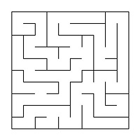
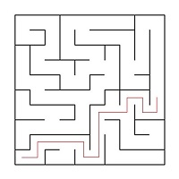
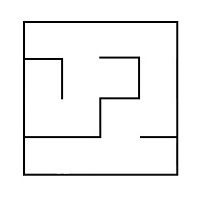
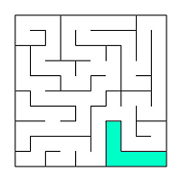
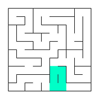
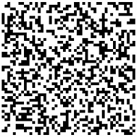
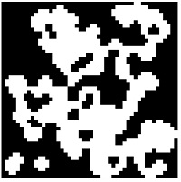

# Maze

Реализация проекта Maze.

💡 [Нажми сюда](https://new.oprosso.net/p/4cb31ec3f47a4596bc758ea1861fb624), **чтобы поделиться с нами обратной связью на этот проект**. Это анонимно и поможет нашей команде сделать обучение лучше. Рекомендуем заполнить опрос сразу после выполнения проекта.

## Contents

1. [Chapter I](#chapter-i) \
   1.1. [Introduction](#introduction)
2. [Chapter II](#chapter-ii) \
   2.1. [Information](#information)
3. [Chapter III](#chapter-iii) \
   3.1. [Part 1](#part-1-%D1%80%D0%B5%D0%B0%D0%BB%D0%B8%D0%B7%D0%B0%D1%86%D0%B8%D1%8F-%D0%BF%D1%80%D0%BE%D0%B5%D0%BA%D1%82%D0%B0-maze) \
   3.2. [Part 2](#part-2-%D0%B3%D0%B5%D0%BD%D0%B5%D1%80%D0%B0%D1%86%D0%B8%D1%8F-%D0%B8%D0%B4%D0%B5%D0%B0%D0%BB%D1%8C%D0%BD%D0%BE%D0%B3%D0%BE-%D0%BB%D0%B0%D0%B1%D0%B8%D1%80%D0%B8%D0%BD%D1%82%D0%B0) \
   3.3. [Part 3](#part-3-%D1%80%D0%B5%D1%88%D0%B5%D0%BD%D0%B8%D0%B5-%D0%BB%D0%B0%D0%B1%D0%B8%D1%80%D0%B8%D0%BD%D1%82%D0%B0) \
   3.4. [Part 4](#part-4-%D0%B4%D0%BE%D0%BF%D0%BE%D0%BB%D0%BD%D0%B8%D1%82%D0%B5%D0%BB%D1%8C%D0%BD%D0%BE-%D0%B3%D0%B5%D0%BD%D0%B5%D1%80%D0%B0%D1%86%D0%B8%D1%8F-%D0%BF%D0%B5%D1%89%D0%B5%D1%80) \
   3.5. [Part 5](#part-5-%D0%B4%D0%BE%D0%BF%D0%BE%D0%BB%D0%BD%D0%B8%D1%82%D0%B5%D0%BB%D1%8C%D0%BD%D0%BE-ml-%D0%BE%D0%B1%D1%83%D1%87%D0%B5%D0%BD%D0%B8%D0%B5-%D1%81-%D0%BF%D0%BE%D0%B4%D0%BA%D1%80%D0%B5%D0%BF%D0%BB%D0%B5%D0%BD%D0%B8%D0%B5%D0%BC) \
   3.6. [Part 6](#part-6-%D0%B4%D0%BE%D0%BF%D0%BE%D0%BB%D0%BD%D0%B8%D1%82%D0%B5%D0%BB%D1%8C%D0%BD%D0%BE-%D0%B2%D0%B5%D0%B1-%D0%B8%D0%BD%D1%82%D0%B5%D1%80%D1%84%D0%B5%D0%B9%D1%81)

## Chapter I


Ева подошла к кабинету начальства ровно в тот момент, когда из него послышались приглушенные крики знакомого голоса:

`-` Как ... додуматься открыть ...туп в ИНТЕРНЕТ эти..рверам?! А самое главное, зачем ...лы?!

Заходить сейчас в кабинет было явно не лучшей идеей, поэтому Ева решила переждать явно неприятный разговор в коридоре. \
После неразборчивого ответа возмущения босса продолжились:

`-` Вы, видимо, совсем не осознаете важность этого проекта для нашей... Это... А сейчас бегом исправлять все эти косяки!

Дверь в кабинет приоткрылась, откуда поспешно выходили Алиса с Чарли с потупленным взором.

`-` И не дай бог, что-то вдруг утекло! — раздалось им вдогонку.

Алиса и Чарли удалились в противоположном направлении, даже не обратив на стоящую рядом Еву внимания. Подождав пару минут, она набралась сил и постучала в дверь.

`-` Войдите. А, Ева, да, заходи, — пригласил ее босс. Просторная комната с широкими окнами была заполнена различными книгами по алгоритмам, математике и программированию. В середине комнаты находился стол, на котором красовалась пластиковая табличка «Роберт М.».

`-` Боб, я по поводу экспериментов по задачке...

`-` С лабиринтами, да, знаю. Твои наработки протестировали. Они интересные, но слишком простые. Мы отправили примеры генераций нашим партнерам, но их детище прошло лабиринты за неприлично малый промежуток времени. А в нашем случае понадобится нечто еще сложнее. \
Попробуй уменьшить количество корректных путей. Просмотри интернет еще раз, посмотри в сторону пещер и клеточных автоматов, и тогда вернемся еще раз к тестам и экспериментам. И помни: чем сложнее — тем лучше!

Выйдя из кабинета, Ева отправилась к своему рабочему месту, обдумывая, какие еще алгоритмы можно опробовать. По пути она попыталась найти глазами Алису или Чарли, чтобы узнать, что случилось, но не найдя их, села за компьютер и продолжила работу.

## Introduction

В данном проекте тебе предстоит познакомиться с лабиринтами и пещерами, а также основными алгоритмами их обработки, такими как: генерация, отрисовка, поиск решения.

## Chapter II

## Information

Лабиринт с «тонкими стенками» представляет собой таблицу размером *n* строк на *m* столбцов.

Между ячейками таблицы могут находиться «стены». Также «стенами» окружена вся таблица в целом.

Далее приведён пример такого лабиринта: \


Решением лабиринта считается кратчайший путь от заданной начальной точки (ячейки таблицы) до конечной.
При прохождении лабиринта можно передвигаться к соседним ячейкам, не отделенным «стеной» от текущей ячейки и находящимся сверху, снизу, справа или слева.
Кратчайшим маршрут считается, если он проходит через наименьшее число ячеек.
Пример лабиринта с его решением: \


В этом примере начальная точка задана как 10; 1, а конечная как 6; 10.

## Описание лабиринта

Лабиринт может храниться в файле в виде количества строк и столбцов, а также двух матриц, содержащих положение вертикальных и горизонтальных стен соответственно.
В первой матрице отображается наличие стены справа от каждой ячейки, а во второй — снизу.

Пример подобного файла:

```
4 4
0 0 0 1
1 0 1 1
0 1 0 1
0 0 0 1

1 0 1 0
0 0 1 0
1 1 0 1
1 1 1 1
```

Лабиринт, описанный в этом файле: \


Больше примеров описания лабиринтов можно найти в материалах.

## Недостатки лабиринтов

К недостаткам лабиринтов относятся изолированные области и петли.

Изолированная область — это часть лабиринта с проходами, в которые нельзя попасть из оставшейся части лабиринта. Например: \


Петля — это часть лабиринта с проходами, по которым можно ходить «кругами». Стены в петлях не соединены со стенами, окружающими лабиринт. Например: \


## Генерация с использованием клеточного автомата

Во многих играх есть необходимость в ветвящихся локациях, например, пещерах. Такие локации могут быть созданы генерацией с использованием клеточного автомата. При подобной генерации используется идея, схожая с уже знакомой тебе игрой «Жизнь».

Суть предложенного алгоритма состоит в реализации всего двух шагов: сначала все поле заполняется случайным образом стенами, — т. е. для каждой клетки случайным образом определяется, будет ли она свободной или непроходимой, — а затем несколько раз происходит обновление состояния карты в соответствии с условиями, похожими на условия рождения/смерти в «Жизни».

Правила проще, чем в «Жизни»: есть две специальные переменные, одна — для «рождения» «мертвых» клеток (предел «рождения») и одна — для уничтожения «живых» клеток (предел «смерти»). Если «живые» клетки окружены «живыми» клетками, количество которых меньше, чем предел «смерти», они «умирают».

Аналогично, если «мертвые» клетки находятся рядом с «живыми», количество которых больше, чем предел «рождения», они становятся «живыми».
Пример результата работы алгоритма (на первой картинке только инициализированный лабиринт, а на второй лабиринт, в котором при последующих шагах больше не происходит изменений): \



## Описание пещер

Пещера, прошедшая 0 шагов симуляции (только инициализированная), может храниться в файле в виде количества строк и столбцов, а также в виде матрицы, содержащей положение «живых» и «мертвых» клеток.

Пример подобного файла:

```
4 4
0 1 0 1
1 0 0 1
0 1 0 0
0 0 1 1
```

Пещера, описанная в этом файле: \


Больше примеров описания пещер можно найти в материалах.

## Chapter III

## Part 1. Реализация проекта Maze

Тебе необходимо реализовать программу Maze, позволяющую генерировать и отрисовывать идеальные лабиринты и пещеры:

- Программа должна быть разработана на языке Go.
- Код программы должен находиться в папке src.
- При написании кода необходимо придерживаться Google Style.
- Сборка программы должна быть настроена с помощью Makefile со стандартным набором целей для GNU-программ: all, install, uninstall, clean, dvi, dist, tests. Установка должна вестись в любой другой произвольный каталог.
- В программе должен быть реализован графический пользовательский интерфейс на базе любой GUI-библиотеки для Go.
- В программе должна быть предусмотрена кнопка для загрузки лабиринта из файла, который задается в формате, описанном [выше](#%D0%BE%D0%BF%D0%B8%D1%81%D0%B0%D0%BD%D0%B8%D0%B5-%D0%BB%D0%B0%D0%B1%D0%B8%D1%80%D0%B8%D0%BD%D1%82%D0%B0).
- Максимальный размер лабиринта — 50 х 50.
- Загруженный лабиринт должен быть отрисован на экране в поле размером 500 x 500 пикселей.
- Толщина «стены» — 2 пикселя.
- Размер самих ячеек лабиринта вычисляется таким образом, чтобы лабиринт занимал всё отведенное под него поле.

## Part 2. Генерация идеального лабиринта

Добавь возможность автоматической генерации идеального лабиринта. \
Идеальным считается лабиринт, в котором из каждой точки можно попасть в любую другую точку ровно одним способом.

- Генерировать лабиринт нужно согласно **алгоритму Эллера**.
- Сгенерированный лабиринт не должен иметь изолированных областей и петель.
- Должно быть обеспечено полное покрытие unit-тестами модуля генерации идеального лабиринта.
- Пользователем вводится только размерность лабиринта: количество строк и столбцов.
- Сгенерированный лабиринт должен сохраняться в файл в формате, описанном [выше](#%D0%BE%D0%BF%D0%B8%D1%81%D0%B0%D0%BD%D0%B8%D0%B5-%D0%BB%D0%B0%D0%B1%D0%B8%D1%80%D0%B8%D0%BD%D1%82%D0%B0).
- Созданный лабиринт должен отображаться на экране, как указано в [первой части](#part-1-%D1%80%D0%B5%D0%B0%D0%BB%D0%B8%D0%B7%D0%B0%D1%86%D0%B8%D1%8F-%D0%BF%D1%80%D0%BE%D0%B5%D0%BA%D1%82%D0%B0-maze).

## Part 3. Решение лабиринта

Добавь возможность показать решение *любого* лабиринта, который сейчас изображен на экране:

- Пользователем задаются начальная и конечная точки.
- Маршрут, являющийся решением, отобрази линией толщиной 2 пикселя, проходящей через середины всех ячеек лабиринта, через которые пролегает решение.
- Цвет линии решения должен быть отличным от цветов стен и поля.
- Должно быть обеспечено полное покрытие unit-тестами модуля решения лабиринта.

## Part 4. Дополнительно. Генерация пещер

Добавь генерацию пещер с [использованием клеточного автомата](#%D0%B3%D0%B5%D0%BD%D0%B5%D1%80%D0%B0%D1%86%D0%B8%D1%8F-%D1%81-%D0%B8%D1%81%D0%BF%D0%BE%D0%BB%D1%8C%D0%B7%D0%BE%D0%B2%D0%B0%D0%BD%D0%B8%D0%B5%D0%BC-%D0%BA%D0%BB%D0%B5%D1%82%D0%BE%D1%87%D0%BD%D0%BE%D0%B3%D0%BE-%D0%B0%D0%B2%D1%82%D0%BE%D0%BC%D0%B0%D1%82%D0%B0):

- Пользователем выбирается файл, в котором описана пещера по описанному [выше](#%D0%BE%D0%BF%D0%B8%D1%81%D0%B0%D0%BD%D0%B8%D0%B5-%D0%BF%D0%B5%D1%89%D0%B5%D1%80) формату.
- Для отображения пещер используй отдельное окно или вкладку пользовательского интерфейса.
- Максимальный размер пещеры — 50 х 50.
- Загруженная пещера должна быть отрисована на экране в поле размером 500 x 500 пикселей.
- Пользователем задаются пределы «рождения» и «смерти» клетки, а также шанс на начальную инициализацию клетки.
- Пределы «рождения» и «смерти» могут иметь значения от 0 до 7.
- Клетки за границей пещеры считаются живыми.
- Должен быть предусмотрен пошаговый режим отрисовки результатов работы алгоритма в двух вариантах:
  - При нажатии на кнопку следующего шага отрисовывается очередная итерация работы алгоритма;
  - При нажатии на кнопку автоматической работы запускается отрисовка итераций работы алгоритма с частотой 1 шаг в `N` миллисекунд, где число миллисекунд `N` задаётся через специальное поле в пользовательском интерфейсе.
- Размер клеток в пикселях вычисляется таким образом, чтобы пещера занимала всё отведенное под него поле.
- Должно быть обеспечено полное покрытие unit-тестами модуля генерации пещер.

## Part 5. Дополнительно. ML. Обучение с подкреплением

С помощью обучения с подкреплением тебе необходимо разработать алгоритм обучения агента кратчайшему прохождению лабиринтов:

- Пользователем указывается файл, в котором описана структура лабиринта, и конечная точка.
- Агент должен быть способен находить выход из лабиринта из любой начальной точки.
- Необходимо использовать метод Q-обучения.
- Агент обучается на одном лабиринте, который не меняется ни в процессе обучения, ни на этапе тестирования; конечная точка также фиксирована.
- Должно быть обеспечено полное покрытие unit-тестами модуля обучения агента.

Требуется предоставить пользователю возможность взаимодействия с обученным агентом:

- Пользователь определяет начальную точку.
- Построенный агентом маршрут из заданной точки отображается в соответствии с описанными выше правилами.

Модули обучения агента и взаимодействия с ним должны быть разработаны на языке Go без использования готовых библиотек обучения с подкреплением.

## Part 6. Дополнительно. Веб-интерфейс

Добавь веб-версию пользовательского интерфейса в любом формате (MPA, SPA) с использованием соответствующих фреймворков. Веб-интерфейс должен удовлетворять как минимум всем базовым функциональным требованиям из частей выше ([Part 1](#part-1-%D1%80%D0%B5%D0%B0%D0%BB%D0%B8%D0%B7%D0%B0%D1%86%D0%B8%D1%8F-%D0%BF%D1%80%D0%BE%D0%B5%D0%BA%D1%82%D0%B0-maze)-[Part 3](#part-3-%D1%80%D0%B5%D1%88%D0%B5%D0%BD%D0%B8%D0%B5-%D0%BB%D0%B0%D0%B1%D0%B8%D1%80%D0%B8%D0%BD%D1%82%D0%B0)).