# SimpleNavigator

Implementation of the Simple Navigator project.

The russian version of the task can be found in the repository.

💡 [Tap here](https://new.oprosso.net/p/4cb31ec3f47a4596bc758ea1861fb624) **to leave your feedback on the project**. It's anonymous and will help our team make your educational experience better. We recommend completing the survey immediately after the project.

## Contents

1. [Chapter I](#chapter-i) \
   1.1. [Introduction](#introduction)
2. [Chapter II](#chapter-ii) \
   2.1. [Information](#information)
3. [Chapter III](#chapter-iii) \
   3.1. [Part 1](#part-1-depth--and-breadth-first-search)\
   3.2. [Part 2](#part-2-finding-the-shortest-paths-in-a-graph)\
   3.3. [Part 3](#part-3-finding-the-minimum-spanning-tree)\
   3.4. [Part 4](#part-4-travelling-salesman-problem)\
   3.5. [Part 5](#part-5-console-interface)\
   3.6. [Part 6](#part-6-bonus-comparison-of-methods-for-solving-the-traveling-salesman-problem)
4. [Chapter IV](#chapter-iv)

## Chapter I


"We're transferring you to another project," Robert said, sounding like a judgment. Eve was back in the middle of her boss's office. She couldn't understand the reason for this decision. "Finish your pathfinding task, then collect all the work you've done and give it to Alice. From now on, this will be her department's responsibility."

"But why," Eve started to say, but Robert M.'s forceful tone interrupted her.

"Because there are more important things for you to do. This is Alice, by the way." The girl at the door was not the same as before, her face looked tired and she didn't even try to hide the black circles under her eyes. Since her last visit to Bob's, Eve hadn't had a chance to talk to her or Charlie because she hadn't seen them at the office.

"Good afternoon, boss. Hello, Eve," said Alice, surprisingly cheerful.

"Come in, Eve and I are almost finished. She is just gathering up her work and handing it over to you. Eve, when you're finished, come back and we'll talk about what to do next. You can go now, and don't forget to close the door. "

Eve nodded confusedly and headed for the door. She stopped in the hallway for a moment, wondering how unfair it was that her little research project was being given to someone else's department, leaving her out of the loop. From behind the door she could hear a muffled conversation between Bob and Alice:

"We've lost him for good. Whether he's in hiding or just waiting for something, I don't know. But that's why..."

"I have to talk to Alice when she comes to pick up the work. Everything is so strange," Eve decided to herself. With a tired sigh, she went to her place, thoughts of the seven bridges of Königsberg swirling in her head.

## Introduction

In this project, you will implement some basic algorithms on graphs. Graphs are one of the basic data structures in programming that are used everywhere. Graphs can be used to interpret road maps, electrical circuits, geographic maps, communication between people in social networks, and many other things.

## Chapter II

## Information

### Historical background

Leonard Euler (1707-1783) is the founder of graph theory. The origin of this theory can be traced back to the correspondence of the great scholar. Here is a translation of the Latin text quoted from a letter that Euler sent from St. Petersburg to the Italian mathematician and engineer Marinoni on March 13, 1736:

> A problem was presented to me concerning an island in the city of Königsberg, surrounded by a river spanned by seven bridges.

The city of Königsberg (now Kaliningrad), founded in the 13th century, consisted of three formally independent urban settlements and several other "slobodas" and "settlements". They were located on the islands and banks of the Pregel River, dividing the city into four main parts: A) Old Town, B) Kneiphof, C) Lomse, D) Vorstadt. The construction of bridges to connect these parts of the city began in the 14th century. Because of the constant military danger, bridges had defensive qualities. The bridges were a place of demonstrations, religious and festive processions, as well as Orthodox cross processions. Here is a map of the area and its simplified scheme:

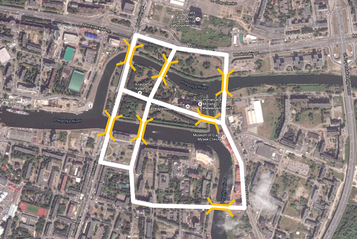

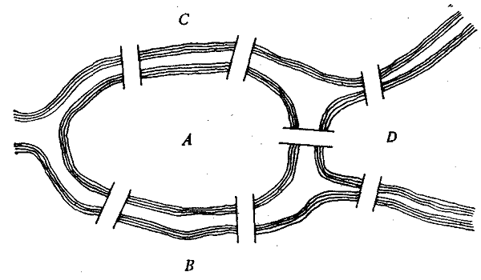

> I was asked if one could cross the separate bridges in one continuous walk, so that each bridge is crossed only once. I was informed that no one had yet shown that this was possible or that it was impossible. This question is so banal, but it seemed to me worthy of attention, since neither geometry, nor algebra, nor even the art of counting was sufficient to solve it. And so, after some deliberation, I came up with a simple, but completely established rule, with the help of which one can immediately decide, for all examples of this kind, with any number of bridges in any arrangement, whether such a round trip is possible or not.

You can see how the bridges of Königsberg are located in the following picture, where the vertices of the graph correspond to a certain part of the city, and the edges correspond to the bridges over the river, where A is an island, and B, C, and D are parts of the continent, separated from each other by arms of the river.


So is it possible to cross the Königsberg bridges by crossing each of them only once? To find the answer, let's continue with Euler's letter to Marinoni:

> The question is whether or not it is possible to circumvent all seven bridges by crossing each of them only once. My rule leads to the following solution to this question. First of all, you have to look at how many sections are separated by water, so that there is no other way to get from one to the other than through the bridge. In this example, there are four such sections — A, B, C, D. Next, you need to distinguish whether the number of bridges leading to these individual sections is even or odd. In our case, there are five bridges leading to section A and three bridges leading to the rest, i.e. the number of bridges leading to individual sections is odd, and this is enough to solve the problem. When this is determined, we apply the following rule: if the number of bridges leading to each section is even, then the detour in question would be possible, and at the same time it would be possible to start this detour from any section. If, however, two of these numbers were odd, for only one of them can be odd, then the detour could be made as prescribed, but only the beginning of the detour must necessarily be taken from one of those two sections to which an odd number of bridges leads. Finally, if there are more than two sections to which an odd number of bridges leads, then such a movement is generally impossible ... if other, more serious problems could be cited here, this method could be even more useful and should not be neglected.

We can paraphrase the author's words and formulate the following rules:

1. The number of odd vertices (vertices to which an odd number of edges lead) of a graph must be even.
   There cannot be a graph with an odd number of odd vertices.
2. If all vertices of a graph are even (vertices to which an even number of edges lead), you can draw the graph without taking your pencil off the paper, and you can start at any vertex of the graph and end at the same vertex.
3. A graph with more than two odd vertices cannot be drawn with a single stroke.

The Königsberg bridge graph has four odd vertices, so it is impossible to cross all the bridges without crossing any of them twice.

Until the beginning of the 20th century, graph theory developed mainly by formulating new theorems based on the results of solving various "puzzle problems". With the advent of large-scale mass production and general breakthroughs in science and technology in the first half of the 20th century, graph theory began to develop in earnest.

### Main terms

A **Graph** has a finite set of vertices, and a set of edges. Each edge has two points from the set of graph vertices that form the edge points.

There are **types of graphs based on the type of edges:**

- *Undirected* — a graph in which movement between vertices connected by an edge is possible in any direction.


- *Directed* — a graph, the edges of which have a direction. Directed edges are also called arcs. Moving from one vertex to another is possible only by arcs of corresponding direction.

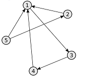

If besides the edge between two vertices, the weight of the edge is also given, then such a graph is called ***weighted***.

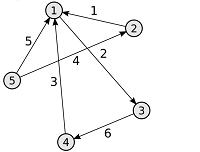

**Types of graphs based on the number of edges:**

- *Null graph* is a graph in which there are no edges/

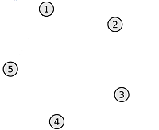

- *Incomplete* — the graph has edges, but not from every vertex, there is an edge to every other vertex.

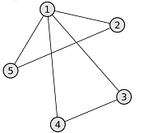

- *Complete* — the graph has an edge from each vertex to any other vertex.

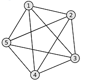

**Types of graphs based on node reachability:**

- *Connected* — for any vertex in the graph there is at least one path to any other vertex in the same graph.

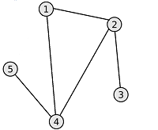

- *Disconnected* — the graph has no path between at least two vertices.

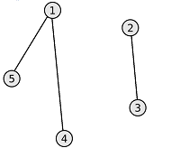

For directed graphs there are two more types of connectivity: *strongly connected* and *weakly connected*.

- *Strongly connected* — there is a path for any vertex in a directed graph to any other vertex and back.
- *Weakly connected* — there is a path between any two vertices in the graph, but this path can be one-sided.
  It means that from vertex A to vertex B the path can exist, but not the opposite way.

**Trees**

An important subtype of graphs are *trees*. \
***A tree*** is a connected acyclic graph in which any two vertices are connected by only one path. The following formula is the same for all trees: *q = n - 1*, where q is the number of edges, n is the number of vertices of the graph (tree). Trees can be built from either undirected or directed graphs, depending on the problem to be solved.

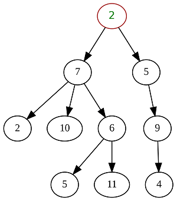

***A spanning tree*** is a subgraph of a given graph that contains all of its vertices and is a tree. The graph edges that are not part of the spanning tree are called chords of the graph relative to the spanning tree.

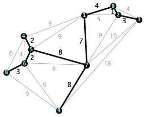

### Ways of representing a graph

The main ways of representing graphs are:

- *an adjacency matrix* is a square matrix whose dimension is equal to the number of vertices in the graph, and in which ‘Aij‘‘Aij‘`A\_{ij}` element of the matrix contains information about an edge from vertex ‘i‘‘i‘`i` to vertex ‘j‘‘j‘`j`. Possible values that ‘Aij‘‘Aij‘`A\_{ij}` can have:
  - For an unweighted undirected graph:
    - 0 — there is no edge between the vertices;
    - 1 — there is an edge between the vertices.
  - For a weighted undirected graph:
    - 0 — there is no edge between the vertices;
    - N — there is an edge between vertices, and its weight is N.
  - For an unweighted directed graph:
    - 0 — there is no arc between the vertices;
    - 1 — there is an arc (directed edge), which is directed from vertex ‘i‘‘i‘`i` to vertex ‘j‘‘j‘`j`.
  - For a weighted directed graph:
    - 0 — there is no arc between the vertices;
    - N — there is an arc (directed edge), which is directed from vertex ‘i‘‘i‘`i` to vertex ‘j‘‘j‘`j`, and its weight is N.
- *An incidence matrix* is a matrix with the number of rows equal to the number of vertices, and the number of columns equal to the number of edges. It specifies the connections between the incident elements of the graph (edge (arc) and vertex). In an undirected graph, if a vertex is connected to an edge, then the corresponding element is 1, otherwise the element is 0. In a directed graph, if an edge comes from a vertex, then the corresponding element is 1, if the edge goes into a vertex, then the corresponding element is -1, if there is no edge, then the element is 0.

An example of representing a graph with an adjacency matrix can be found in the materials.

If the number of graph edges is small compared to the number of vertices, the values of most elements of the adjacency matrix will be 0. In this case it is not reasonable to use this method. For such graphs there are more appropriate ways to represent them:

- *An adjacency list* is one way to represent a graph as a collection of lists of vertices. Each vertex of the graph corresponds to a list of "neighbors" (i.e., vertices that are directly reachable from the current vertex) of that vertex, with edge weights.
- *List of edges* is a table (matrix of dimension Nx3), each row of which contains two adjacent vertices and the weight of the edge connecting them.

## Chapter III

Within this task, all graphs must meet the following requirements:

- Edge weights are natural numbers only.
- There may be loops.
- Weights can be different on all edges.
- Only a non-zero connected graph.

## Part 1. Depth- and Breadth-first search

Implementation of the s21\_graph library:

- The library must be developed in Kotlin language.
- The library code must be located in the src folder in the develop branch.
- When writing code it is necessary to follow the Kotlin Coding Conventions.
- Make it as a static library (s21\_graph.h).
- The library must be represented as a `Graph` class that stores information about the graph using an **adjacency matrix**. The dimensionality of the adjacency matrix should be set dynamically when initializing the graph (when loading it from a file).
- The program must be built with Makefile which contains standard set of targets for GNU-programs: all, clean, test, s21\_graph.
- Prepare full coverage of the `Graph` class methods with unit-tests.
- The class `Graph` must contain at least the following public methods:
  - `loadGraphFromFile(filename: String)` — loading a graph from a file in the adjacency matrix format.
  - `exportGraphToDot(filename: String)`- exporting a graph to a dot file (see materials).

Implementation of the s21\_graph\_algorithms library:

- The library must be developed in Kotlin language.
- The library code must be located in the src folder in the develop branch.
- Make it as a static library (s21\_graph\_algorithms).
- The library must be represented as a `GraphAlgorithms` class that stores the implementation of algorithms on graphs. The class `GraphAlgorithms` itself must not know anything about the internal representation of the graph from the class `Graph`. To interact with graph data, the class `GraphAlgorithms` can only use the public methods and properties provided by the `Graph` class.
- Add to the Makefile s21\_graph\_algorithms target.
- Prepare full coverage of the `GraphAlgorithms` class methods with unit-tests.
- The class `GraphAlgorithms` must contain at least the following public methods:
  - `depthFirstSearch(graph: Graph, startVertex: Int)` — a *non-recursive* depth-first search in the graph from a given vertex. The function should return an array that contains the traversed vertices in the order they were traversed. When implementing this function, you must use the *self-written* data structure **stack**, which should be previously made as a separate static library.
  - `breadthFirstSearch(graph: Graph, startVertex: Int)` — breadth-first search in the graph from a given vertex. The function should return an array that contains the traversed vertices in the order they were traversed. When implementing this function, you must use the *self-written* data structure **queue**, which should be previously made as a separate static library.
- It is necessary to adapt previously created *self-written* helper classes `Stack` and `Queue` (you can reuse your solution from the *CPP2* project for this) and implement interfaces for them in Kotlin. These classes must contain the following methods:
  - `stack()` — creating an empty stack;
  - `queue()` — creating an empty queue;
  - `push(value)` — adding an element to the stack/queue;
  - `pop()` — getting an element from the stack/queue followed by its removal from the stack/queue;
  - `top()` — getting an element from the stack without its removal from the stack;
  - `front()` — getting the first element from the queue without its removal from the queue;
  - `back()` — getting the last element from the queue without its removal from the queue.

*In this and the following tasks, consider that the vertex numbers start from 1.*

## Part 2. Finding the shortest paths in a graph

- Add two new methods to the `GraphAlgorithms` class:
  - `getShortestPathBetweenVertices(graph: Graph, vertex1: Int, vertex2: Int)` — searching for the shortest path between two vertices in a graph using *Dijkstra's algorithm*. The function accepts as input the numbers of two vertices and returns a numerical result equal to the smallest distance between them.
  - `getShortestPathsBetweenAllVertices(graph: Graph)` — searching for the shortest paths between all pairs of vertices in a graph using the *Floyd-Warshall algorithm*. As a result, the function returns the matrix of the shortest paths between all vertices of the graph.

## Part 3. Finding the minimum spanning tree

- Add a new method to the `GraphAlgorithms` class:
  - `getLeastSpanningTree(graph: Graph)` — searching for the minimal spanning tree in a graph using *Prim's algorithm*. As a result, the function should return the adjacency matrix for the minimal spanning tree.

## Part 4. Traveling salesman problem

- Add a new method to the `GraphAlgorithms` class:
  - `solveTravelingSalesmanProblem(graph: Graph)` — solving the traveling salesman's problem using the *ant colony algorithm*.
    You need to find the shortest path that goes through all vertices of the graph at least once, followed by a return to the original vertex. As a result, the function should return the `TsmResult` class described below:

  ```
  class TsmResult (
      val vertices: Array<Int>,    // an array with the route you are looking for (with the vertex traverse order).
      val distance: Double  // the length of this route
  )
  ```

*If it is impossible to solve the problem with a given graph, output an error.*

## Part 5. Console interface

- You need to write the main program, which is a console application for testing the functionality of the implemented s21\_graph and s21\_graph\_algorithms libraries.
- The console interface must provide the following functionality:
  1. Load the original graph from a file.
  2. Traverse the graph in breadth and print the result to the console.
  3. Traverse the graph in depth and print the result to the console.
  4. Find the shortest path between any two vertices and print the result to the console.
  5. Find the shortest paths between all pairs of vertices in the graph and print the result matrix to the console.
  6. Search for the minimum spanning tree in the graph and print the resulting adjacency matrix to the console.
  7. Solve the Salesman problem, with output of the resulting route and its length to the console.

## Part 6. Bonus. Comparison of methods for solving the traveling salesman problem

- It is necessary to choose two additional algorithms to solve the traveling salesman problem and implement them as methods of the `GraphAlgorithms` class.
- Add to the console interface the ability to perform a comparison of speed of the three algorithms (the ant colony algorithm and two randomly selected algorithms):
  - The study starts for a graph that was previously loaded from a file.
  - As part of the study you need to keep track of the time it took to solve the salesman's problem `N` times in a row, by each of the algorithms. Where `N` is set from the keyboard.
  - The results of the time measurement must be displayed in the console.

*Example:* For `N = 1000` it will measure how long it will take to solve the traveling salesman problem 1000 times for the current given graph by an ant colony algorithm and two randomly chosen algorithms.

## Chapter IV

"Bob asked if we could do the job, and we did. I'd like to take you with us, but Bob has his own ideas," Alice answered Eve's question.

"Still, I don't see how your job has anything to do with a robot vacuum cleaner," Eve complained. "Where is Charlie? He used to come by at least a couple of times a week."

"Charlie... is working. We've got a little problem, and your trail work is just what we need. Don't worry, when this is all over, our evening meetings will be back. We'll discuss everything then," Alice assured her reassuringly, but sadly. "Thank you for your time, I have to go. See you later!"