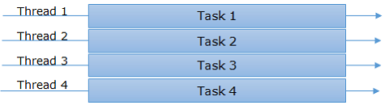
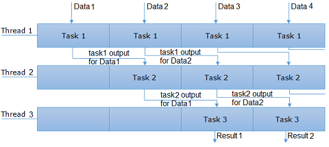

# Parallels

В данном проекте тебе предстоит ознакомиться с основными подходами к параллелизму, а также реализовать некоторые алгоритмы с его применением.

💡 [Нажми сюда](https://new.oprosso.net/p/4cb31ec3f47a4596bc758ea1861fb624), **чтобы поделиться с нами обратной связью на этот проект**. Это анонимно и поможет нашей команде сделать обучение лучше. Рекомендуем заполнить опрос сразу после выполнения проекта.

## Contents

1. [Chapter I](#chapter-i) \
   1.1. [Introduction](#introduction)
2. [Chapter II](#chapter-ii) \
   2.1. [Многопоточность](#%D0%BC%D0%BD%D0%BE%D0%B3%D0%BE%D0%BF%D0%BE%D1%82%D0%BE%D1%87%D0%BD%D0%BE%D1%81%D1%82%D1%8C) \
   2.2. [Мьютексы](#%D0%BC%D1%8C%D1%8E%D1%82%D0%B5%D0%BA%D1%81%D1%8B) \
   2.3. [Метод конвейерного параллелизма](#%D0%BC%D0%B5%D1%82%D0%BE%D0%B4-%D0%BA%D0%BE%D0%BD%D0%B2%D0%B5%D0%B9%D0%B5%D1%80%D0%BD%D0%BE%D0%B3%D0%BE-%D0%BF%D0%B0%D1%80%D0%B0%D0%BB%D0%BB%D0%B5%D0%BB%D0%B8%D0%B7%D0%BC%D0%B0)
3. [Chapter III](#chapter-iii) \
   3.1. [Задача 1](#%D0%B7%D0%B0%D0%B4%D0%B0%D1%87%D0%B0-1-%D0%BC%D1%83%D1%80%D0%B0%D0%B2%D1%8C%D0%B8%D0%BD%D1%8B%D0%B9-%D0%B0%D0%BB%D0%B3%D0%BE%D1%80%D0%B8%D1%82%D0%BC) \
   3.2. [Задача 2](#%D0%B7%D0%B0%D0%B4%D0%B0%D1%87%D0%B0-2-%D1%80%D0%B5%D1%88%D0%B5%D0%BD%D0%B8%D0%B5-%D1%81%D0%BB%D0%B0%D1%83) \
   3.3. [Задача 3](#%D0%B7%D0%B0%D0%B4%D0%B0%D1%87%D0%B0-3-%D0%B0%D0%BB%D0%B3%D0%BE%D1%80%D0%B8%D1%82%D0%BC-%D0%B2%D0%B8%D0%BD%D0%BE%D0%B3%D1%80%D0%B0%D0%B4%D0%B0)

## Chapter I

Чак сел за стол с таким грохотом, что кофе на столешнице чуть не выплеснулся из чашки.

`-` Ты не поверишь, что я только что узнал от чувака из ИБ, — начал он, выглядывая официанта. Это кафе было местом, которое они вдвоем облюбовали еще во времена студенчества. Немноголюдное, с вкусным кофе и десертами, а самое главное — всегда тихое и спокойное. Как раз удобно заниматься своими делами, работать или учиться, что сейчас и делала Ева. Ее давно привлекала тема многопоточности и распараллеливания алгоритмов. А тут, наконец, нашлось время позаниматься и изучить ее как следует.

`-` Короче, наши «гении» наверху умудрились потерять какой-то опасный сверхразумный искусственный интеллект, — Чак перешел на шепот. — Уж не знаю, для какого пылесоса-убийцы они его там готовили, но все, похоже, в панике. Говорят, Боб сам не свой.

`-` Звучит серьезно, — оторвалась от своих задачек Ева. — Я тоже слышала краем уха нечто подобное, но Боб не выглядел таким уж напуганным. Да и как можно потерять искусственный интеллект? Не выпал же он из кармана.

`-` Черт его знает. А вдруг сбежал сам? Так или иначе, но выглядит это все очень грязно. Ты видела наши финансовые отчеты? А я работаю с ними. И там все не очень радужно, чтобы еще вкладываться в каких-то инновационных роботов. Говорю тебе, они подпольно создают Терминатора.

`-` Да брось ты, — задумавшись произнесла Ева.

`-` Ну, вот увидишь, — отвлеченно ответил Чак. — Так, что это ты заказала? М-м, пахнет вкусно...

## Chapter II

### Многопоточность

**Синхронная программная модель** – это программная модель, в рамках которой каждому потоку назначается набор задач.
Все задачи в рамках потока выполняются последовательно друг за другом: когда завершено выполнение одной задачи, появляется возможность заняться другой.
В этой модели невозможно остановить выполнение одной задачи, чтобы в промежутке выполнить другую .

Частным случаем синхронной модели является *однопоточность*. Если появляется несколько задач, которые надлежит выполнить, и текущая система предоставляет один поток, который может работать со всеми задачами, то он берет поочередно одну за другой, и процесс выглядит так:

Здесь видно, что имеется поток и четыре задачи, которые необходимо выполнить. Поток начинает выполнять поочередно одну за одной и выполняет их в итоге все.

В случаях, когда порядок, в котором задачи выполняются, не влияет на результат работы программы, может быть применена *многопоточность*.

Многопоточность является другим случаем синхронной модели: в этом сценарии используются много потоков, которые могут брать задачи и приступать к работе с ними, т. е. у нас есть пулы потоков и множество задач. \
Итак, многопоточность может работать вот так:

Здесь можно видеть, что у нас есть четыре потока и столько же задач для выполнения, и каждый поток начинает работать с ними.
Это идеальный сценарий, но обычно используется большее число задач, чем количество доступных потоков. Таким образом, освободившийся поток получает другое задание. \
Каждый раз создавать новые потоки нежелательно, потому что для этого требуется использование дополнительных системных ресурсов, таких как процессорное время и память. Поэтому следует заранее задать начальное количество потоков.

### Мьютексы

При написании многопоточных приложений почти всегда требуется работать с общими данными, одновременное изменение которых может привести к очень неприятным последствиям.
Для блокировки общих данных от одновременного доступа следует использовать *объекты синхронизации*.

**Мьютекс** (англ. mutex) представляет собой взаимно исключающий синхронизирующий объект.
Это означает, что он может быть получен потоком только по очереди. Мьютекс предназначен для тех ситуаций, в которых общий ресурс может быть одновременно использован только в одном из потоков.

Допустим, системный журнал совместно используется в нескольких процессах, но только в одном из них данные могут записываться в файл этого журнала в любой момент времени. Для синхронизации процессов в данной ситуации идеально подходит мьютекс.

Для описания мьютекса требуется всего один бит, хотя чаще используется целая переменная, у которой 0 означает неблокированное состояние, а все остальные значения соответствуют блокированному состоянию.

Значение мьютекса устанавливается двумя процедурами: захвата и освобождения.

1. Если поток собирается войти в критическую область, он вызывает процедуру захвата.
2. Если мьютекс не заблокирован, запрос выполняется и вызывающий поток может попасть в критическую область.
3. Если мьютекс закрыт, то поток, пытающийся войти в критическую секцию, блокируется.
4. Если поток собирается выйти из критической области, он, соответственно, вызывает процедуру освобождения.

Принципы работы с мьютексами отличаются в Windows и Linux, но в общем случае можно выделить следующие шаги:

- Создание/Описание,
- Открытие/Инициализация,
- Попытка захвата и ожидание,
- Освобождение.

### Метод конвейерного параллелизма

Классическим способом применения многопоточности, в случае когда необходимо решить одну и ту же задачу для некоторого количества *N* наборов исходных данных, является запуск всего алгоритма в одном потоке. При таком подходе каждым потоком алгоритм выполняется для *N/(число\_потоков)* наборов исходных данных.

**Конвейеризация** (или конвейерная обработка) в общем случае основана на разделении подлежащего исполнению алгоритма на более мелкие части, называемые ступенями, и выделении для каждой из них отдельного потока.

Так, обработку любого набора данных можно разделить на несколько этапов, организовав передачу данных от одного этапа к следующему. Производительность при этом возрастает благодаря тому, что на различных ступенях (в разных потоках) конвейера одновременно обрабатываются разные наборы данных.

Пример организации работы конвейера:

В качестве конкретного примера можно привести алгоритм поиска наибольшего числа в строке.
На вход подается массив строк, для каждой из которых нужно выполнить поиск. В первом потоке будет выполняться разбиение строки на слова, во втором — приведение слов к числовому типу данных, в третьем — поиск наибольшего среди чисел.

И тогда процесс работы будет выглядеть так:

1. В первом потоке обрабатывается 1-я строка из массива. Остальные строки ожидают своей очереди.
2. Массив слов, полученный после обработки 1-й строки, поступает на обработку во 2-й поток. Так как первой поток освободился, в него на обработку поступает 2-я строка.
3. Далее переход между 2-м и 3-м потоками происходит так же, как и между 1-м и 2-м.
4. В случае если 2-я строка обработалась в 1-м потоке быстрее, чем 1-я строка во 2-м потоке, 2-я строка поступает в очередь ожидающих освобождения 2-го потока. Тем временем, так как первой поток освободился, в него на обработку поступает 3-я строка.

## Chapter III

## Задача 1. Муравьиный алгоритм

Тебе необходимо реализовать муравьиный алгоритм для решения задачи коммивояжера из прошлого задания *A2\_SimpleNavigator* с применением параллельных вычислений и без них:

- Программа должна быть разработана на языке C++ стандарта C++20.
- Код программы должен находиться в папке src.
- При написании кода придерживайся Google Code Style.
- Не применяй устаревшие и выведенные из употребления конструкции языка и библиотечные функции.
- Предусмотри Makefile для сборки программы (с целями all, clean, ant).
- У программы должен быть предусмотрен консольный интерфейс.
- Пользователем задается матрица для задачи коммивояжера.
- Пользователем задается кол-во выполнений *N*.
- Выведи на экран результаты работы каждого из алгоритмов для указанной матрицы.
- Измерь время, которое потребуется для выполнения *N* раз муравьиного алгоритма с применением параллелизма для заданной пользователем матрицы.
- Измерь время, которое потребуется для выполнения *N* раз обычного муравьиного алгоритма для заданной пользователем матрицы.
- На экран выведи время, полученное в обоих случаях.
- Для блокировки доступа к данным при параллельной реализации используй мьютексы.

## Задача 2. Решение СЛАУ

Тебе нужно реализовать обычный и параллельный алгоритмы решения СЛАУ методом Гаусса:

- Программа должна быть разработана на языке C++ стандарта C++20.
- Код программы должен находиться в папке src.
- При написании кода придерживайся Google Code Style.
- Не применяй устаревшие и выведенные из употребления конструкции языка и библиотечные функции.
- Добавь в существующий Makefile цель «gauss» для сборки программы.
- У программы должен быть предусмотрен консольный интерфейс.
- Пользователем задается матрица, описывающая СЛАУ.
- Пользователем задается кол-во выполнений *N*.
- Выведи на экран результаты работы каждого из алгоритмов для указанной СЛАУ.
- Измерь время, которое потребуется для выполнения *N* раз параллельного алгоритма решения заданной пользователем СЛАУ.
- Измерь время, которое потребуется для выполнения *N* раз обычного алгоритма решения заданной пользователем СЛАУ.
- Выведи на экран время, полученное в обоих случаях.
- Для блокировки доступа к данным при параллельной реализации используй мьютексы.

## Задача 3. Алгоритм Винограда

Тебе необходимо реализовать алгоритм Винограда умножения матриц без применения параллелизма, а также с использованием конвейерного и классического способов параллелизма:

- Программа должна быть разработана на языке C++ стандарта C++20.
- Код программы должен находиться в папке src.
- При написании кода придерживайся Google Code Style.
- Не применяй устаревшие и выведенные из употребления конструкции языка и библиотечные функции.
- Добавь в существующий Makefile цель «winograd» для сборки программы.
- Должно быть выделено 4 стадии работы конвейера.
- У программы должен быть предусмотрен консольный интерфейс.
- Должно быть предусмотрено 2 способа ввода:
  - Пользователем задаются обе матриц для умножения.
  - Пользователем задаются размерности матриц, которые затем заполняются в программе случайным образом.
- Пользователем задается кол-во выполнений *N*.
- Выведи на экран результаты работы каждого из алгоритмов, а также сгенерированные матрицы.
- Измерь время, которое потребуется для выполнения *N* раз перемножения матриц без применения параллелизма.
- Измерь время, которое потребуется для выполнения *N* раз перемножения матриц с применением классического параллелизма при количестве потоков, равном 2, 4, 8, ..., 4 \* (число логических процессоров компьютера).
- Измерь время, которое потребуется для выполнения *N* раз перемножения матриц с применением конвейерного параллелизма.
- Выведи на экран время, полученное в каждом случае.
- Для блокировки доступа к данным при параллельной реализации используй мьютексы.