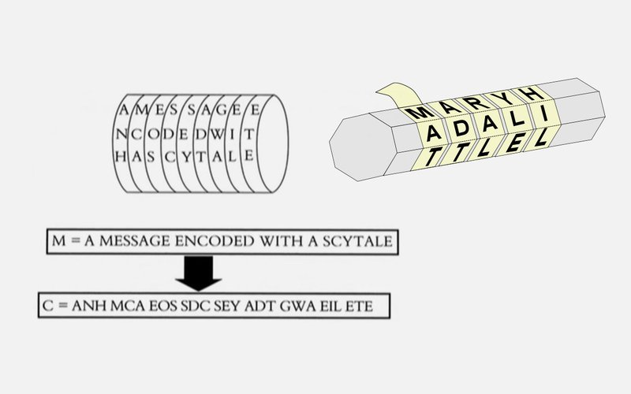
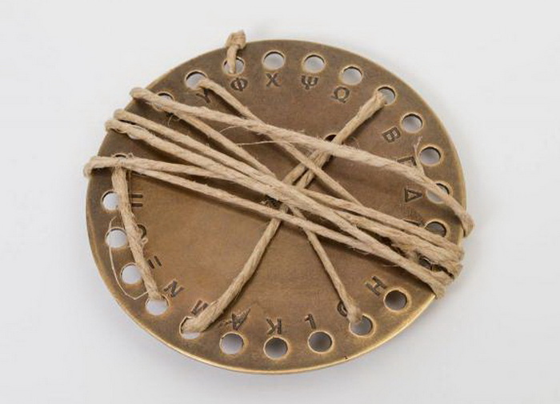
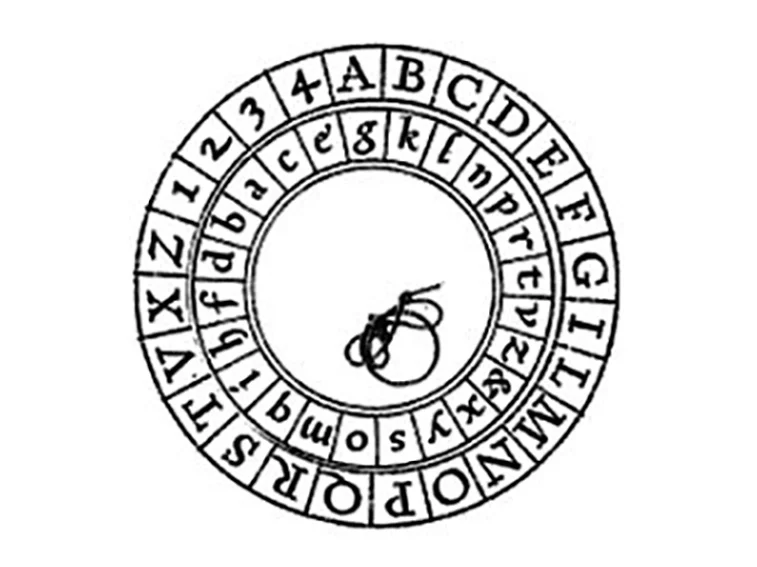
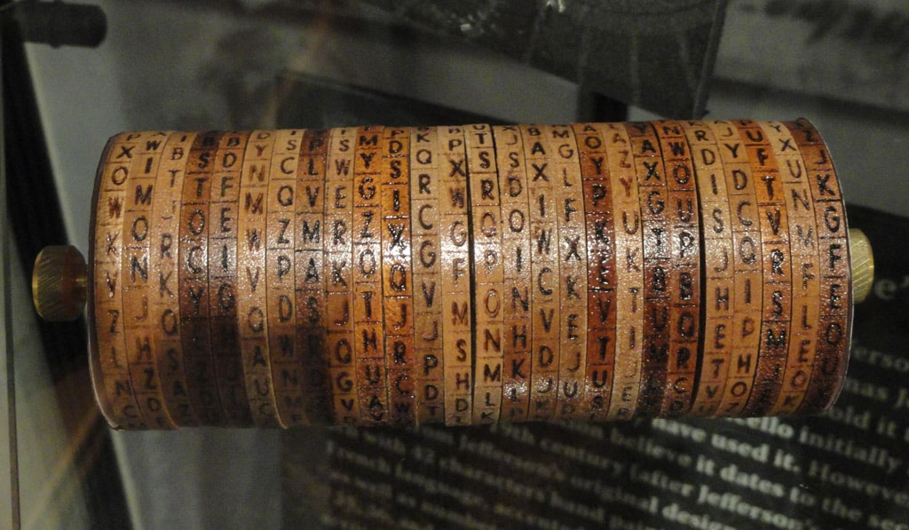
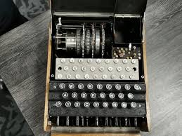
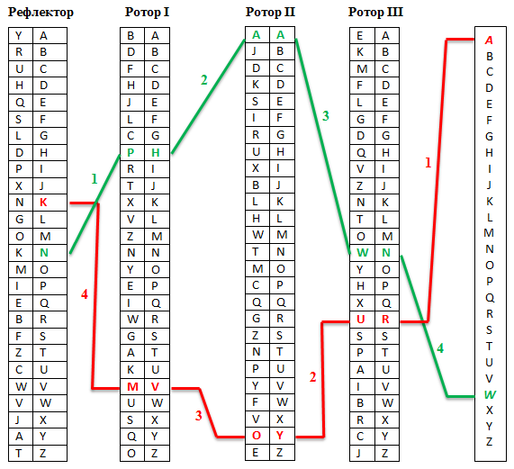
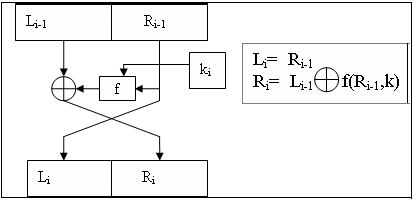
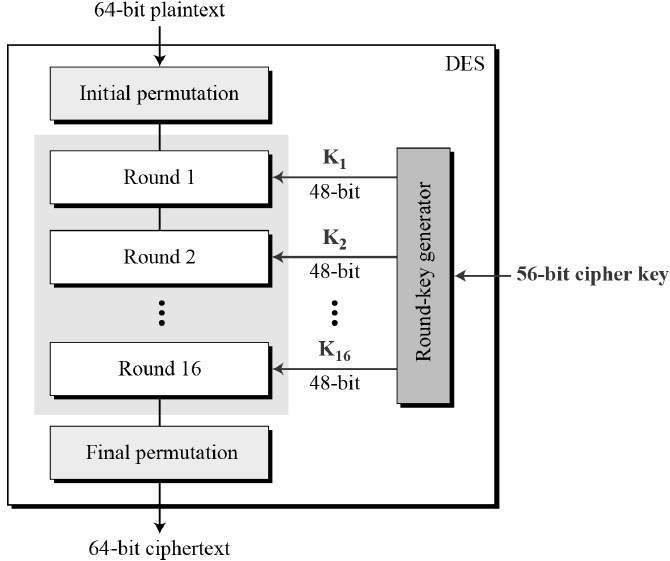
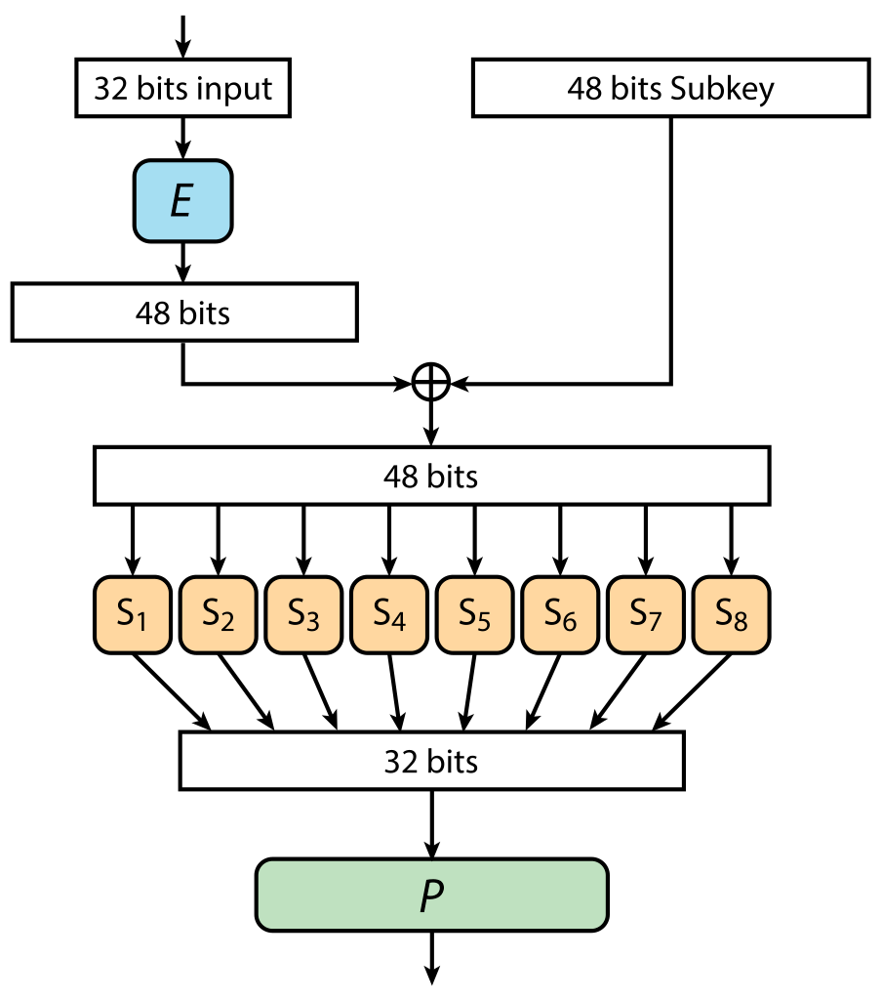

# Crypto

В данном проекте тебе предстоит познакомиться с основами криптографии, понятиями синхронного и асинхронного шифрования, а также со сжатием данных. Ты напишешь свои реализации шифровальной машины «Энигма», алгоритмов асимметричного шифрования RSA и симметричного шифрования DES, алгоритма сжатия данных Хаффмана.

💡 [Нажми сюда](https://new.oprosso.net/p/4cb31ec3f47a4596bc758ea1861fb624), **чтобы поделиться с нами обратной связью на этот проект**. Это анонимно и поможет нашей команде сделать обучение лучше. Рекомендуем заполнить опрос сразу после выполнения проекта.

## Contents

1. [Chapter I](#chapter-i) \
   1.1. [Introduction](#introduction)
2. [Chapter II](#chapter-ii) \
   2.1. [Основные определения](#%D0%BE%D1%81%D0%BD%D0%BE%D0%B2%D0%BD%D1%8B%D0%B5-%D0%BE%D0%BF%D1%80%D0%B5%D0%B4%D0%B5%D0%BB%D0%B5%D0%BD%D0%B8%D1%8F)\
   2.2. [Зарождение криптографии](#%D0%B7%D0%B0%D1%80%D0%BE%D0%B6%D0%B4%D0%B5%D0%BD%D0%B8%D0%B5-%D0%BA%D1%80%D0%B8%D0%BF%D1%82%D0%BE%D0%B3%D1%80%D0%B0%D1%84%D0%B8%D0%B8)\
   2.3. [Эпоха шифровальных машин](#%D1%8D%D0%BF%D0%BE%D1%85%D0%B0-%D1%88%D0%B8%D1%84%D1%80%D0%BE%D0%B2%D0%B0%D0%BB%D1%8C%D0%BD%D1%8B%D1%85-%D0%BC%D0%B0%D1%88%D0%B8%D0%BD)\
   2.4. [Современная криптография. Симметричное шифрование](#%D1%81%D0%BE%D0%B2%D1%80%D0%B5%D0%BC%D0%B5%D0%BD%D0%BD%D0%B0%D1%8F-%D0%BA%D1%80%D0%B8%D0%BF%D1%82%D0%BE%D0%B3%D1%80%D0%B0%D1%84%D0%B8%D1%8F-%D1%81%D0%B8%D0%BC%D0%BC%D0%B5%D1%82%D1%80%D0%B8%D1%87%D0%BD%D0%BE%D0%B5-%D1%88%D0%B8%D1%84%D1%80%D0%BE%D0%B2%D0%B0%D0%BD%D0%B8%D0%B5)\
   2.5. [Современная криптография. Асимметричное шифрование](#%D1%81%D0%BE%D0%B2%D1%80%D0%B5%D0%BC%D0%B5%D0%BD%D0%BD%D0%B0%D1%8F-%D0%BA%D1%80%D0%B8%D0%BF%D1%82%D0%BE%D0%B3%D1%80%D0%B0%D1%84%D0%B8%D1%8F-%D0%B0%D1%81%D0%B8%D0%BC%D0%BC%D0%B5%D1%82%D1%80%D0%B8%D1%87%D0%BD%D0%BE%D0%B5-%D1%88%D0%B8%D1%84%D1%80%D0%BE%D0%B2%D0%B0%D0%BD%D0%B8%D0%B5)\
   2.6. [Алгоритмы сжатия данных](#%D0%B0%D0%BB%D0%B3%D0%BE%D1%80%D0%B8%D1%82%D0%BC%D1%8B-%D1%81%D0%B6%D0%B0%D1%82%D0%B8%D1%8F-%D0%B4%D0%B0%D0%BD%D0%BD%D1%8B%D1%85)
3. [Chapter III](#chapter-iii) \
   3.1. [Задача 1](#%D0%B7%D0%B0%D0%B4%D0%B0%D1%87%D0%B0-1-%D1%88%D0%B8%D1%84%D1%80%D0%BE%D0%B2%D0%B0%D0%BB%D1%8C%D0%BD%D0%B0%D1%8F-%D0%BC%D0%B0%D1%88%D0%B8%D0%BD%D0%B0-%D1%8D%D0%BD%D0%B8%D0%B3%D0%BC%D0%B0)\
   3.2. [Задача 2](#%D0%B7%D0%B0%D0%B4%D0%B0%D1%87%D0%B0-2-%D0%B0%D0%BB%D0%B3%D0%BE%D1%80%D0%B8%D1%82%D0%BC-%D1%81%D0%B6%D0%B0%D1%82%D0%B8%D1%8F-%D1%85%D0%B0%D1%84%D1%84%D0%BC%D0%B0%D0%BD%D0%B0)\
   3.3. [Задача 3](#%D0%B7%D0%B0%D0%B4%D0%B0%D1%87%D0%B0-3-%D0%B0%D0%BB%D0%B3%D0%BE%D1%80%D0%B8%D1%82%D0%BC-%D0%B0%D1%81%D0%B8%D0%BC%D0%BC%D0%B5%D1%82%D1%80%D0%B8%D1%87%D0%BD%D0%BE%D0%B3%D0%BE-%D1%88%D0%B8%D1%84%D1%80%D0%BE%D0%B2%D0%B0%D0%BD%D0%B8%D1%8F-rsa)\
   3.4. [Задача 4](#%D0%B7%D0%B0%D0%B4%D0%B0%D1%87%D0%B0-4-%D0%B4%D0%BE%D0%BF%D0%BE%D0%BB%D0%BD%D0%B8%D1%82%D0%B5%D0%BB%D1%8C%D0%BD%D0%BE-%D0%B0%D0%BB%D0%B3%D0%BE%D1%80%D0%B8%D1%82%D0%BC-%D1%81%D0%B8%D0%BC%D0%BC%D0%B5%D1%82%D1%80%D0%B8%D1%87%D0%BD%D0%BE%D0%B3%D0%BE-%D1%88%D0%B8%D1%84%D1%80%D0%BE%D0%B2%D0%B0%D0%BD%D0%B8%D1%8F-des)

## Chapter I

Письмо пришло на корпоративную почту ровно в тот момент, когда Ева вчитывалась в алгоритм работы DES. Data Encryption Standard не был какой-то супер инновацией, но включал в себя базы, которые использовались в шифровании повсеместно до сих пор. Да и сам алгоритм не стал легче для понимания из-за своего возраста. Поэтому Ева сидела с ручкой, бумажкой, кучкой таблиц и старательно пыталась вникнуть в суть.

Однако письмо все же заставило ее отвлечься. Текст не особо отличался подробностями, но Еву заинтересовал:

> Дорогие коллеги!
>
> Вы были выбраны для апробации нашего нового проекта под кодовым названием: «Невидимый колледж XXI». Суть задания предельно проста: вам будут предложены небольшие проекты по С (например, написать библиотеку или реализовать свой grep), которые необходимо выполнить за кратчайшие сроки в любом виде. Помимо решений, вам также будет необходимо предоставить отзыв по выполненному заданию. Установленная форма отзыва будет выдана позже. \
> Ваши решения помогут нам скорректировать сами задания, а также будут использованы в рамках других проектов компании по ML и AI. Анализ самих решений будет проводиться исключительно в анонимизированном формате. \
> За дальнейшими подробностями и условиями заданий, пожалуйста, обратитесь к начальникам своих отделов, Алисе С. или Чарли К.
>
> Надеемся на ваше сотрудничество и понимание!

«Нужно будет обязательно подойти в понедельник к Алисе, — решила про себя Ева. — Лишний шанс попробовать вытрясти из нее ответы. А пока что — обратно к DES».

## Chapter II

### Основные определения

**Криптография** — наука о методах обеспечения конфиденциальности (невозможности прочтения информации посторонним), целостности данных (невозможности незаметного изменения информации), аутентификации (проверки подлинности авторства или иных свойств объекта), шифрования (кодировки данных).

**Моноалфавитные шифры** — шифры с заменой алфавита исходного текста другим алфавитом. В результате каждой букве кодируемого текста ставится в соответствие однозначно какая-то шифрованная буква.

**Полиалфавитные (многоалфавитные) шифры** — это совокупность шифров простой замены, которые используются для шифрования очередного символа открытого текста согласно некоторому правилу. Суть полиалфавитного шифра заключается в циклическом применении нескольких моноалфавитных шифров к определённому числу букв шифруемого текста. Предположим, что имеется некоторое сообщение *x1, x2, x3, ..., xn, ..., x2n*, которое необходимо зашифровать, а также для использования полиалфавитного шифра взяли *n* моноалфавитных шифров. В данном случае к первой букве применяется первый моноалфавитный шифр, ко второй букве — второй, к третьей — третий, …, к *n*-ой букве — *n*-ый, а к *(n+1)*-ой вновь первый, и так далее, пока все сообщение не будет зашифровано.

**Симметричное шифрование** — это шифрование с единым секретным ключом, который используется для шифрования исходного сообщения и для его расшифровки. Включает в себя **блочные** и **поточные** алгоритмы.

**Поточное шифрование** — симметричный шифр, в котором каждый символ открытого текста преобразуется в символ шифрованного текста в зависимости не только от используемого ключа, но и от его расположения в потоке открытого текста.

**Блочное шифрование** — разновидность симметричного шифра, оперирующего группами бит фиксированной длины — блоками, характерный размер которых меняется в пределах 64‒256 бит. Если исходный текст (или его остаток) меньше размера блока, перед шифрованием его дополняют.

**Асиметричное шифрование** — это метод шифрования данных, предполагающий использование двух ключей — открытого и закрытого. Открытый (публичный) ключ применяется для шифрования информации и может передаваться по незащищенным каналам. Закрытый (приватный) ключ применяется для расшифровки данных, зашифрованных открытым ключом. Открытый и закрытый ключи — это очень большие числа, связанные друг с другом определенной функцией, но так, что, зная одно, крайне сложно вычислить второе.

### Зарождение криптографии

За наукообразным словом «криптография» (с древнегреческого букв. «тайнопись») скрывается древнее желание человека спрятать важную информацию от посторонних глаз. Можно сказать, что сама письменность в самом начале уже была криптографической системой, так как принадлежала узкому кругу людей, и с помощью нее они могли обмениваться знаниями, недоступными неграмотным. С распространением письма возникла потребность в более сложных системах шифрования. Со времен древних цивилизаций криптография верно служила военным, чиновникам, купцам и хранителям религиозных знаний.

Одним из первых свидетельств применения шифров является «алгоритм скитала». *Скитала* — инструмент, используемый для осуществления перестановочного шифрования, в криптографии известный также, как шифр Древней Спарты. Для шифрования сообщения использовались пергаментная лента и палочка цилиндрической формы с фиксированными длиной и диаметром. Пергаментная лента наматывалась на палочку так, чтобы не было ни просветов, ни нахлёстов. Написание сообщения производилось по намотанной пергаментной ленте по длинной стороне цилиндра. После того как достигался конец намотанной ленты, палочка поворачивалась на часть оборота и написание сообщения продолжалось. После разматывания ленты на ней оказывалось зашифрованное сообщение. Расшифрование выполнялась с использованием палочки таких же типоразмеров.

В IV столетии до н. э. автор военных трактатов Эней Тактик придумал шифровальный диск, названный впоследствии его именем. Для записи сообщения в отверстия диска с подписанными рядом с ними буквами последовательно продевалась нить. Чтобы прочитать текст, нужно было всего лишь вытягивать нить в обратной последовательности. Это и составляло основной минус устройства — при наличии времени шифр мог быть разгадан любым грамотным человеком. Зато чтобы быстро «стереть» информацию с диска Энея, нужно было всего лишь вытянуть нить или разбить устройство.

Одним из первых документально зафиксированных шифров является шифр Цезаря (около 100 г. до н. э.). Его принцип был очень прост: каждая буква исходного текста заменялась на другую, отстоящую от нее по алфавиту на определенное число позиций. Зная это число, можно было разгадать шифр и узнать, какие тайны Цезарь передавал своим генералам.

Высокий уровень развития математики и лингвистики позволил не только создавать шифры, но и заниматься расшифровкой чужих. Это привело к появлению первых научных работ по криптоанализу — дешифровке сообщений без знания ключа. Эпоха так называемой наивной криптографии, когда шифры были больше похожи на загадки, подошла к концу. В эпоху Возрождения криптография переживает подъем. Начинается период формальной криптографии, связанный с появлением формализованных, более надежных шифров. Около 1466 года итальянский ученый Леон Альберти изобретает шифровальный диск, состоящий из двух частей: внешней и внутренней. На неподвижном внешнем диске был написан алфавит и цифры. Внутренний подвижный диск также содержал буквы и цифры в другом порядке и являлся ключом к шифру. Для шифрования нужно было найти нужную букву текста на внешнем диске и заменить ее на букву на внутреннем, стоящую под ней. После этого внутренний диск сдвигался, и новая буква зашифровывалась уже с новой позиции. Таким образом, шифр Альберти стал одним из первых шифров многоалфавитной (полиалфовитной) замены, основанных на принципе комбинаторики. Кроме того, Леон Альберти написал одну из первых научных работ по криптографии − «Трактат о шифрах».

### Эпоха шифровальных машин

Промышленная революция не обошла вниманием и криптографию. Около 1790 года один из отцов — основателей США Томас Джефферсон создал дисковый шифр, прозванный позже цилиндром Джефферсона. Этот прибор, основанный на роторной системе, позволил автоматизировать процесс шифрования и стал первым криптоустройством Нового времени.

Большое влияние на шифровальное дело оказало изобретение телеграфа. Прежние шифры вмиг перестали работать, при этом потребность в качественном шифровании только возрастала в связи с чередой крупных военных конфликтов. В XIX-XX веках основные импульсы для развития криптографии давала именно военная сфера. С 1854 года британские военные применяют шифр Плейфера, в основе которого — шифрование биграмм, или пар символов. Этот шифр использовался до начала Второй мировой войны.

Во время Второй мировой войны противники уже использовали мобильные электромеханические шифраторы, шифры которых считались нераскрываемыми. Устройства были роторными или на цевочных дисках. К первым относилась знаменитая машина «Энигма», которой пользовались нацисты, ко вторым — американская машина M-209.

Машина «Энигма» состояла из трёх роторов и рефлектора. Каждый ротор имел 26 сечений, что соответствовало отдельной букве алфавита, а также 26 контактов для взаимодействия с соседними роторами. Как только оператор нажимал на нужную букву, — замыкалась электрическая цепь, в результате чего появлялась шифрованная буква. Замыкание цепи происходило за счет рефлектора. Шифры «Энигмы» считались самыми стойкими для взлома, так как количество ее комбинаций достигало 15 квадриллионов. Однако код «Энигмы» все же был расшифрован, сперва польскими криптографами в 1932 году, а затем английским ученым Аланом Тьюрингом, создавшим машину для расшифровки сообщений «Энигмы» под названием «Бомба». Комплекс из 210 таких машин позволял англичанам расшифровывать до 3 тыс. военных сообщений в сутки и внес большой вклад в победу союзников.

### Современная криптография. Симметричное шифрование

К концу 1960-х роторные шифровальные системы заменяются более совершенными блочными, которые предполагали обязательное применение цифровых электронных устройств. С распространением компьютеров криптография выходит на новый уровень. Мощности новых устройств позволяют создавать на порядки более сложные шифры. Шифр или код становится языком общения между компьютерами, а криптография становится полноценной гражданской отраслью. В 1978 году разрабатывается стандарт шифрования DES, который стал основой для многих современных криптографических алгоритмов.

В основе устройства алгоритма DES лежит сеть Фейстеля. Эта сеть оперирует блоками, и каждый блок, попадающий на вход, делится на две части: левую и правую. Левая часть становится правой без изменений. Правая часть «ксорится» с результатом вычисления некой функции, на вход которой подается левая часть и ключ. После данного преобразования правая часть становится левой.

У данной сети есть несколько интересных достоинств. Первое важное достоинство: функция F может быть любой, она не должна обладать свойствами обратимости, она может и не быть линейной или нелинейной. Все равно шифр остается симметричным. Второе очень удобное свойство: расшифровка устроена так же, как шифрование. Если нужно расшифровать данную сеть, то в прежний механизм вместо открытого текста просто подаётся на вход зашифрованный текст.

В реальной ситуации такая конструкция (одна сеть Фейстеля) представляет собой один раунд блочного шифра, то есть в реальном шифре она выполняется 16 раз с разными ключами. Для каждого из 16 раундов генерируется отдельный 48-битный ключ на основе исходного 56-битного ключа. Впоследствии в функции F на каждом раунде применяется сгенерированный 48-битный ключ.

Каждый из 16 раундов состоит всего из нескольких операций:

1. Размер попавшегося полублока становится равен 32 бита, полублок проходит функцию расширения, на вход попадает 32 бита. Дальше по специальной несекретной таблице происходит насыщение исходных 32 бит до 48 (за счёт дублирования и перестановки исходных битов в блоке).
2. Потом выполняется операция ксор с раундовым ключом, размер которого — тоже 48 бит, и на выходе получается 48-битное значение, которое попадает в набор функций S-боксов. Эти S-боксы преобразуют каждые 6 бит входа в 4 бита выхода. Следовательно, на выходе из S-боксов из 48 бит снова получается 32 бита.
3. В конце выполняется окончательная перестановка P. Она опять перемешивает 32 бита между собой.

Ключевая часть алгоритма кроется в указанных S-боксах, подобранных специальным образом: задумано очень сложное превращение 6 бит в 4. Если посмотреть на всю конструкцию, видно, что она состоит из XOR и пары перестановок. Если бы S-боксы были простыми, весь DES фактически представлял бы собой некоторый набор линейных преобразований. Его можно было бы представить как матрицу, на которую умножается наш открытый текст, получая зашифрованное сообщение. И тогда атака на DES была бы тривиальной: требовалось бы просто подобрать матрицу.

Ключевая проблема алгоритма DES кроется в использовании 56-битного ключа для шифрования. По мере роста вычислительных возможностей компьютеров стало возможно взломать шифр простым перебором. Так, организацией Electronic Frontier Foundation (EFF) ещё в 1998 году специально для взлома DES был построен суперкомпьютер, получивший кодовое название EFF DES Cracker, который смог подобрать ключ к зашифрованному образцу методом простого перебора всего за 56 часов, то есть менее чем за трое суток. Для этого DES Cracker потребовалось проверить около четверти всех возможных комбинаций, а это значит, что даже при самом неблагоприятном стечении обстоятельств на взлом уйдет около 224 часов, то есть не более 10 суток. При этом стоимость суперкомпьютера, с учетом затраченных на его проектирование средств, составила всего 250 тысяч долларов. Нетрудно догадаться, что сегодня взломать подобный шифр еще проще и дешевле.

На сегодняшний день на замену алгоритму DES пришёл алгоритм AES, принятый 6 ноября 2001 года в перечень Федеральных стандартов обработки информации США. Этот алгоритм также является симметричным алгоритм блочного шифрования, однако уже имеет размер блока в 128 бит и несколько вариаций с ключами на 128/192/256 бит, что делает AES устойчивым алгоритмом к взлому методом полного перебора.

### Современная криптография. Асимметричное шифрование

Сфера использования криптографии расширяется, при этом власти различных стран пытаются удержать контроль над использованием шифров. Разработки криптографов засекречиваются, от производителей шифровальных машин требуют оставлять в продуктах «черные ходы» для доступа спецслужб. Параллельно независимые криптоаналитики разрабатывают способы шифрования, которыми могли бы пользоваться все желающие — так называемую открытую криптографию. Особенно актуально это стало с развитием интернета, где вопрос конфиденциальности информации встал очень остро.

Схема передачи данных между двумя субъектами (А и Б) с использованием открытой криптографии выглядит следующим образом:

- Субъект А генерирует пару ключей: открытый и закрытый (публичный и приватный).
- Субъект А передает открытый ключ субъекту Б. Передача может осуществляться по незащищенным каналам.
- Субъект Б шифрует пакет данных при помощи полученного открытого ключа и передает его А. Передача может осуществляться по незащищенным каналам.
- Субъект А расшифровывает полученную от Б информацию при помощи секретного, закрытого ключа.

В такой схеме перехват любых данных, передаваемых по незащищенным каналам, не имеет смысла, поскольку восстановить исходную информацию возможно только при помощи закрытого ключа, известного лишь получателю и не требующего передачи.

Асимметричное шифрование решает главную проблему симметричного метода, при котором для кодирования и восстановления данных используется один и тот же ключ. Если передавать этот ключ по незащищенным каналам, его могут перехватить и получить доступ к зашифрованным данным. С другой стороны, асимметричные алгоритмы гораздо медленнее симметричных, поэтому во многих криптосистемах применяются и те и другие. Например, стандарты SSL и TLS используют асимметричный алгоритм на стадии установки соединения (рукопожатия): с его помощью кодируют и передают ключ от симметричного шифра, которым и пользуются в ходе дальнейшей передачи данных. Также асимметричные алгоритмы применяются для создания электронных подписей для подтверждения авторства и (или) целостности данных. При этом подпись генерируется с помощью закрытого ключа, а проверяется с помощью открытого.

Первой криптосистемой с открытым ключом считается созданный в 1977 году алгоритм RSA, название которого является акронимом имен создателей — Ривеста, Шамира и Адлемана. В основе этого алгоритма лежит вычислительная сложность факторизации (разложения на множители) больших чисел. Он применяется в защищенных протоколах SSL и TLS, стандартах шифрования, например, в PGP и S/MIME и так далее. Используется и для шифрования данных, и для создания цифровых подписей.

### Алгоритмы сжатия данных

Сжатие данных является частным случаем кодирования информации, в ходе которого итоговый размер сообщения (кодируемой информации) уменьшается. Существующие алгоритмы сжатия данных можно разделить на два больших класса — с потерями и без.

Алгоритмы с потерями обычно применяются для сжатия изображений и аудио. Эти алгоритмы позволяют достичь больших степеней сжатия благодаря избирательной потере качества. Однако, по определению, восстановить первоначальные данные из сжатого результата невозможно. Известными представителями этих алгоритмов являются JPEG, H.264, MPEG и MP3.

Алгоритмы сжатия без потерь применяются для уменьшения размера данных, и работают таким образом, что возможно восстановить данные в точности такими, какие они были до сжатия. Они применяются в коммуникациях, архиваторах и некоторых алгоритмах сжатии аудио и графической информации.

Так, одним из первых алгоритмов сжатия данных, можно считать азбуку Морзе. Морзе, изобретая свой код в 1838 году, разумно назначил самым часто используемым буквам в английском языке, «e» и «t», самые короткие последовательности (точка и тире соответственно). Вскоре после появления мейнфреймов в 1949 году был придуман алгоритм Шеннона — Фано, который назначал символам в блоке данных коды, основываясь на вероятности их появления в блоке. Вероятность появления символа в блоке была обратно пропорциональна длине кода, что позволяло сжать представление данных. Дэвид Хаффман был студентом в классе у Роберта Фано и в качестве учебной работы выбрал поиск улучшенного метода бинарного кодирования данных. В результате ему удалось улучшить алгоритм Шеннона-Фано. Ранние версии алгоритмов Шеннона-Фано и Хаффмана использовали заранее определённые коды. Позже для этого стали использовать коды, созданные динамически на основе данных, предназначенных для сжатия. В 1977 году Лемпель и Зив опубликовали свой алгоритм LZ77, основанный на использования динамически создаваемого словаря (его ещё называют «скользящим окном»). В 78 году они опубликовали алгоритм LZ78, который сначала парсит данные и создаёт словарь, вместо того, чтобы создавать его динамически.

## Chapter III

## Задача 1. Шифровальная машина Энигма

Тебе необходимо написать программную реализацию шифровальной машины Энигма:

- Программа должна быть разработана на языке C++ стандарта C++20.
- Код программы должен находиться в папке src/enigma.
- При написании программы используй стандартный для выбранного языка стиль написания кода.
- Не применяй устаревшие и вышедшие из употребления конструкции языка и библиотечные функции.
- Предусмотри Makefile для сборки программы и тестов (с целями all, clean, test, enigma).
- У программы должен быть предусмотрен консольный интерфейс
- Требования к реализуемой машине Энигма:
  - Сущности «Рефлектор», «Ротор» и «Машина Энигма» должны быть представлены в коде в виде отдельных классов.
  - Программа должна предоставлять возможность задавать абсолютный путь до файла, который требуется зашифровать.
  - В отличие от оригинальной машины Энигма, которая была способна шифровать исключительно текстовые сообщения, реализуемая в этом задании машина Энигма должна позволять шифровать произвольные файлы (бинарные и текстовые). Результатом работы программы является зашифрованный файл в формате `<имя_исходного_файла>_encoded`.
  - Программа должна предоставлять возможность считывать конфигурацию машины Энигма из произвольного файла. Конфигурация машины состоит из конфигурации рефлектора, конфигурации роторов и начального состояния машины. Конфигурация рефлектора или конфигурация ротора — массив, который задаёт правило отображения одних байт в другие. Начальное состояние машины — начальное положение роторов.
  - Программа должна позволять создавать машину Энигма с заданным числом Роторов (число роторов в реализуемой машине Энигма может быть от 1 до 255). В этом случае конфигурация всех роторов задаётся случайным образом при их инициализации.
  - Программа должна предоставлять возможность сохранения текущего состояния машины Энигма в конфигурационный файл. Имя файла и его местоположение задаётся пользователем в процессе работы программы.

## Задача 2. Алгоритм сжатия Хаффмана

Тебе необходимо реализовать алгоритм сжатия данных Хаффмана:

- Программа должна быть разработана на языке C++ стандарта C++20.
- Код программы должен находиться в папке src/huffman.
- При написании программы используй стандартный для выбранного языка стиль написания кода.
- Не применяй устаревшие и вышедшие из употребления конструкции языка и библиотечные функции.
- Предусмотри Makefile для сборки программы и тестов (с целями all, clean, test, huffman).
- У программы должен быть предусмотрен консольный интерфейс.
- Программа должна позволять кодировать (сжимать) и декодировать любые произвольные файлы (как текстовые, так и бинарные).
- В режиме кодирования (сжатия) программа принимает на вход абсолютный путь до исходного файла и на выходе генерирует два новых файла — сжатый в формате `<имя_исходного_файла>_encoded` и файл конфигурации `huffman.cfg`, который содержит в себе дерево Хаффмана, необходимое для декодирования сжатого файла. Местоположения этих двух файлов задаётся во время выполнения программы.
- В режиме декодирования программа принимает на вход абсолютный путь до сжатого файла и до файла конфигурации `huffman.cfg`. На выходе программа генерирует новый декодированный файл в формате `<имя_исходного_файла>_decoded`. Местоположение этого файла задаётся во время выполнения программы.

## Задача 3. Алгоритм асимметричного шифрования RSA

Тебе необходимо реализовать алгоритм шифрования данных RSA:

- Программа должна быть разработана на языке C++ стандарта C++20.
- Код программы должен находиться в папке src/rsa.
- При написании программы используй стандартный для выбранного языка стиль написания кода.
- Не применяй устаревшие и вышедшие из употребления конструкции языка и библиотечные функции.
- Предусмотри Makefile для сборки программы и тестов (с целями all, clean, test, rsa).
- У программы должен быть предусмотрен консольный интерфейс.
- Программа должна позволять шифровать и дешифровать любые произвольные файлы (как текстовые, так и бинарные).
- Программа должна работать в трёх режимах: режим генерации открытого и закрытого ключей, режим шифрования и режим дешифровки.
- В режиме генерации ключей программа принимает на вход абсолютный путь до директории, в которой будут созданы ключи. На выходе программа генерирует два файла в заданной директории: `private_key` и `public_key`.
- В режиме шифрования программа принимает на вход абсолютный путь до исходного файла и файла с открытым ключом. На выходе программа генерирует новый зашифрованный файл в формате `<имя_исходного_файла>_encoded`. Местоположение этого файла задаётся во время выполнения программы.
- В режиме дешифровки программа принимает на вход абсолютный путь до исходного файла и файлов с открытым и закрытым ключами. На выходе программа генерирует новый расшифрованный файл в формате `<имя_исходного_файла>_decoded`. Местоположение этого файла задаётся во время выполнения программы.

## Задача 4. Дополнительно. Алгоритм симметричного шифрования DES

Тебе необходимо реализовать алгоритм шифрования данных DES:

- Программа должна быть разработана на языке C++ стандарта C++20.
- Код программы должен находиться в папке src/des.
- При написании программы используй стандартный для выбранного языка стиль написания кода.
- Не применяй устаревшие и вышедшие из употребления конструкции языка и библиотечные функции.
- Предусмотри Makefile для сборки программы и тестов (с целями all, clean, test, des).
- У программы должен быть предусмотрен консольный интерфейс.
- Программа должна позволять шифровать и дешифровать любые произвольные файлы (как текстовые, так и бинарные).
- В режиме шифрования программа принимает на вход абсолютный путь до исходного файла и конфигурационного файла, содержащего в себе 56-битный ключ шифрования. На выходе программа генерирует новый зашифрованный файл в формате `<имя_исходного_файла>_encoded`. Местоположение этого файла задаётся во время выполнения программы.
- В режиме дешифровки программа принимает на вход абсолютный путь до исходного файла и конфигурационного файла, содержащего в себе 56-битный ключ шифрования. На выходе программа генерирует новый расшифрованный файл в формате `<имя_исходного_файла>_decoded`. Местоположение этого файла задаётся во время выполнения программы.