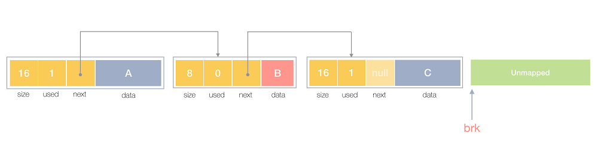
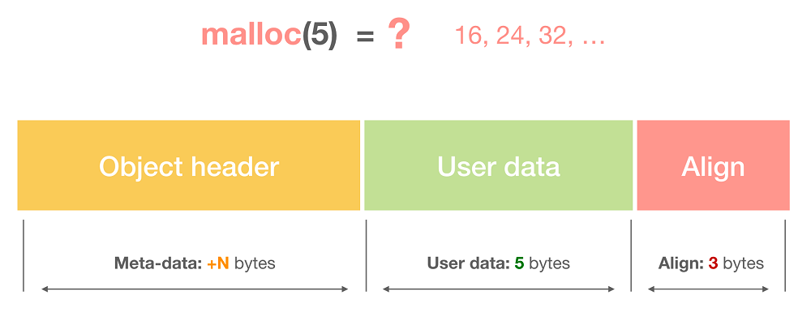
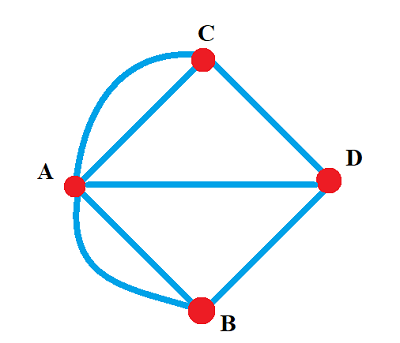

# s21\_memory\_CPP

Резюме: в данном проекте тебе предстоит познакомиться с алгоритмами выделения и освобождения памяти и написать свою реализацию функций *malloc*, *calloc*, *realloc* и *free*.

💡 [Нажми сюда](https://new.oprosso.net/p/4cb31ec3f47a4596bc758ea1861fb624), **чтобы поделиться с нами обратной связью на этот проект**. Это анонимно и поможет нашей команде сделать обучение лучше. Рекомендуем заполнить опрос сразу после выполнения проекта.

## Contents

1. [Chapter I](#chapter-i)
   - [Введение](#%D0%B2%D0%B2%D0%B5%D0%B4%D0%B5%D0%BD%D0%B8%D0%B5)
2. [Chapter II](#chapter-ii)
   - [Общая информация](#%D0%BE%D0%B1%D1%89%D0%B0%D1%8F-%D0%B8%D0%BD%D1%84%D0%BE%D1%80%D0%BC%D0%B0%D1%86%D0%B8%D1%8F)
     - [Блоки памяти](#%D0%B1%D0%BB%D0%BE%D0%BA%D0%B8-%D0%BF%D0%B0%D0%BC%D1%8F%D1%82%D0%B8)
     - [Выравнивание памяти](#%D0%B2%D1%8B%D1%80%D0%B0%D0%B2%D0%BD%D0%B8%D0%B2%D0%B0%D0%BD%D0%B8%D0%B5-%D0%BF%D0%B0%D0%BC%D1%8F%D1%82%D0%B8)
     - [Разделение блоков](#%D1%80%D0%B0%D0%B7%D0%B4%D0%B5%D0%BB%D0%B5%D0%BD%D0%B8%D0%B5-%D0%B1%D0%BB%D0%BE%D0%BA%D0%BE%D0%B2)
     - [Объединение блоков](#%D0%BE%D0%B1%D1%8A%D0%B5%D0%B4%D0%B8%D0%BD%D0%B5%D0%BD%D0%B8%D0%B5-%D0%B1%D0%BB%D0%BE%D0%BA%D0%BE%D0%B2)
     - [Описание функций](#%D0%BE%D0%BF%D0%B8%D1%81%D0%B0%D0%BD%D0%B8%D0%B5-%D1%84%D1%83%D0%BD%D0%BA%D1%86%D0%B8%D0%B9)
     - [Список свободных ячеек](#%D1%81%D0%BF%D0%B8%D1%81%D0%BE%D0%BA-%D1%81%D0%B2%D0%BE%D0%B1%D0%BE%D0%B4%D0%BD%D1%8B%D1%85-%D1%8F%D1%87%D0%B5%D0%B5%D0%BA)
     - [Фрагментация](#%D1%84%D1%80%D0%B0%D0%B3%D0%BC%D0%B5%D0%BD%D1%82%D0%B0%D1%86%D0%B8%D1%8F)
3. [Chapter III](#chapter-iii)
   - [Задача 1. Реализация библиотеки s21\_memory](#%D0%B7%D0%B0%D0%B4%D0%B0%D1%87%D0%B0-1-%D1%80%D0%B5%D0%B0%D0%BB%D0%B8%D0%B7%D0%B0%D1%86%D0%B8%D1%8F-%D0%B1%D0%B8%D0%B1%D0%BB%D0%B8%D0%BE%D1%82%D0%B5%D0%BA%D0%B8-s21_memory)
   - [Задача 2. Дополнительно. Поиск по свободным ячейкам](#%D0%B7%D0%B0%D0%B4%D0%B0%D1%87%D0%B0-2-%D0%B4%D0%BE%D0%BF%D0%BE%D0%BB%D0%BD%D0%B8%D1%82%D0%B5%D0%BB%D1%8C%D0%BD%D0%BE-%D0%BF%D0%BE%D0%B8%D1%81%D0%BA-%D0%BF%D0%BE-%D1%81%D0%B2%D0%BE%D0%B1%D0%BE%D0%B4%D0%BD%D1%8B%D0%BC-%D1%8F%D1%87%D0%B5%D0%B9%D0%BA%D0%B0%D0%BC)
   - [Задача 3. Дополнительно. Дефрагментация](#%D0%B7%D0%B0%D0%B4%D0%B0%D1%87%D0%B0-3-%D0%B4%D0%BE%D0%BF%D0%BE%D0%BB%D0%BD%D0%B8%D1%82%D0%B5%D0%BB%D1%8C%D0%BD%D0%BE-%D0%B4%D0%B5%D1%84%D1%80%D0%B0%D0%B3%D0%BC%D0%B5%D0%BD%D1%82%D0%B0%D1%86%D0%B8%D1%8F)

## Chapter I

## Введение


До повышения на позицию миддл-разработчика оставалось всего ничего: реализовать небольшой проект повторяющий поведение стандартной библиотеки по работе с памятью в так горячо любимом Евой языке С++. Когда Боб озвучил задачу, она не поверила своей удаче. Реализация malloc'а и free ей была знакома еще со времен прочтения книги Кернигана и Ритчи. Поэтому неудивительно, что Ева сразу же поспешила к себе выполнить задание, хотя времени было дано предостаточно.

Проходя по коридорам головного офиса SIS, Ева невольно отметила про себя, что работа кипит во всех отделах, компания живет. Так, PR-отдел в переговорке громко разрабатывал стратегию рекламы для робота мойщика окон. Очередная инновационная разработка SIS, за которой должны были выстроиться в очередь все: от владельцев стеклянных небоскребов до домохозяек, коллекционирующих линейку умных помощников, которые в лучшем случае используются пару раз в год. Отдел «разработки свободы», как его шутливо называют между собой сотрудники, активно работал над новейшими шарнирами, которые позволили бы повысить долговечность работы. Отдел финансов... следил и преумножал финансы компании. Безопасники бегали туда-сюда по коридорам и этажам офиса. В последние несколько недель количество работы для них резко увеличилось.

Недалеко от ресепшена висела мириада дипломов и наград, выигранных продуктами компании: «Лучший робот-пылесос года», или «Самая умная сушилка для одежды», или просто «Холодильник года». SIS, которая завоевала свою популярность пару десятков лет назад частично благодаря качественным и дешевым бытовым приборам, сегодня создавала все, что только можно, с припиской «умное», которое безоговорочно скупала ее верная аудитория. Для таких молодых умов, как Ева, SIS, в свою очередь, была возможностью стать квалифицированным сотрудником и получить бесценный опыт, даже несмотря на то, что компания сильно изменилась со времен своего расцвета.

Откинувшись на спинку кресла, Ева немного порефлексировала, а затем вернулась обратно в реальность и решительно приступила к задачке.

## Chapter II

## Общая информация

### Блоки памяти

Обычно в языках программирования более высокого уровня мы имеем дело с объектами, у которых есть структура, поля, методы и т. д.

Однако с точки зрения распределителя памяти, который работает на более низком уровне, объект представляется просто как блок памяти. Известно только, что этот блок имеет определенный размер, а его содержимое, будучи непрозрачным, обрабатывается как просто последовательность байтов. Во время выполнения этот блок памяти можно привести к нужному типу, и его логическая компоновка может отличаться в зависимости от этого приведения.

Выделение памяти всегда сопровождается выравниванием памяти и созданием заголовка объекта.
В заголовке хранится метаинформация, относящаяся к каждому объекту, и которая служит целям распределителя и сборщика.

Блок памяти должен объединять заголовок объекта и фактический указатель полезной нагрузки, который указывает на адрес пользовательских данных. Этот указатель возвращается пользователю по запросу на выделение.

Заголовок отслеживает размер объекта и хранит флаг, выделен ли этот блок в данный момент.
При выделении он устанавливается в значение `true`, а при операции освобождения сбрасывается обратно в значение `false`, поэтому блок может быть повторно использован в будущих запросах.
Кроме того, в связанном списке всех доступных блоков есть поля, указывающие на следующий и предыдущий блоки.

Вот изображение того, как блоки выглядят в памяти (в этом примере нет указателя на предыдущий блок):



Объекты A и C используются, а блок B в настоящее время не используется.

Поскольку это связанный список, должны быть переменные, отслеживающие начало и конец (верх) кучи.

### Выравнивание памяти

Как уже упоминалось, при выделении памяти мы не берем на себя никаких обязательств относительно логического расположения объектов, а вместо этого работаем с размером блока.

Для более быстрого доступа блок памяти должен быть выровнен, и обычно выравнивание производится по размеру машинного слова.

Вот изображение того, как выглядит выровненный блок с заголовком объекта:



Это означает, что если пользователь запрашивает выделение, скажем, 6 байт, мы фактически выделяем 8 байт. Выделение 4 байт может привести либо к 4 байтам — на 32-разрядной архитектуре, либо к 8 байтам — на машине с 64-разрядной архитектурой.

### Разделение блоков

Простое использование блока подходящего размера может оказаться неэффективным в случае, если найденный блок намного больше запрошенного.

Мы внедрим процедуру разделения большего свободного блока, взяв из него только фрагмент нужного размера. Другая часть остается свободной и может быть использована в дальнейших запросах на выделение.

Вот пример:


### Объединение блоков

Если у нас в куче есть два соседних блока размером 8, и пользователь запрашивает блок размером 16, мы не можем удовлетворить запрос на выделение. Давайте взглянем на оптимизацию для этого.

При освобождении объектов мы можем выполнить операцию, противоположную операции разделения, и объединить два (или более) соседних блока в один больший.

Вот пример:


### Описание функций

| № | Функция | Описание |
| --- | --- | --- |
| 1 | `void *malloc (size_t size)` | Функция `malloc` выделяет блок памяти размером `size` байт и возвращает указатель на начало блока. Содержание выделенного блока памяти не инициализируется, оно остается с неопределенными значениями. При неудаче возвращает указатель null. |
| 2 | `void *calloc (size_t num, size_t size)` | Функция `calloc` выделяет блок памяти для массива размером `num` элементов, каждый из которых занимает `size` байт и инициализирует все свои биты в нулями. В результате выделяется блок памяти размером `num * size` байт, причём весь блок заполнен нулями. Возвращает указатель на начало блока, при неудаче указатель на null. |
| 3 | `void *realloc(void *ptr, size_t size)` | Функция `realloc` выполняет перераспределение блоков памяти. Размер блока памяти, на который ссылается параметр `ptr`, изменяется на `size` байтов. Блок памяти может уменьшаться или увеличиваться в размере. Эта функция может перемещать блок памяти на новое место, в этом случае функция возвращает указатель на новое место в памяти. Содержание блока памяти сохраняется, даже если новый блок имеет меньший размер, чем старый. Отбрасываются только те данные, которые не вместились в новый блок. Если новое значение `size` больше старого, то содержимое вновь выделенной памяти будет неопределенным. Возвращает указатель на начало блока, при этом исходный указатель `ptr` становится недействительным, и любой доступ к нему является неопределенным поведением. В случае ошибки возвращает нулевой указатель, а исходный указатель `ptr` остается действительным. |
| 4 | `void free (void* ptr)` | Функция `free` освобождает место в памяти. Блок памяти, ранее выделенный с помощью вызова `malloc`, `calloc` или `realloc`, освобождается. То есть освобожденная память может дальше использоваться программами или ОС. Обрати внимание, что эта функция оставляет значение `ptr` неизменным, следовательно, он по-прежнему указывает на тот же блок памяти, а не на нулевой указатель. |

### Список свободных ячеек

Самым простым способом нахождения свободных ячеек является линейный поиск, т. е. анализ каждого блока, одного за другим.

Более эффективным алгоритмом было бы использование списка, который связывает только свободные блоки.



Это может привести к значительному повышению производительности, когда куча становится все больше, и в базовых алгоритмах требуется обойти множество объектов.

Такой список может быть реализован непосредственно в заголовке объекта. Для этого указатели `next` и `prev` будут указывать на свободные блоки.

Процедуры разделения и объединения должны быть соответствующим образом обновлены, поскольку `next` и `prev` больше не будут указывать на соседние блоки.

В качестве альтернативы можно создать отдельный дополнительный список свободных блоков.

### Фрагментация

Фрагментация возникает, когда свободные блоки в куче находятся не на соседних позициях.
В такой ситуации не удастся выделить больше памяти, чем размер каждого из свободных блоков, даже если их суммарного объема достаточно.

Дефрагментация заключается в перераспределении блоков в куче, в результате которого данные перезаписываются в непрерывной области. За счет этого все свободные блоки объединяются в один, размер которого равен сумме их размеров.

## Chapter III

## Задача 1. Реализация библиотеки s21\_memory

Тебе необходимо реализовать функции библиотеки stdlib.h, описанные [выше](#%D0%BE%D0%BF%D0%B8%D1%81%D0%B0%D0%BD%D0%B8%D0%B5-%D1%84%D1%83%D0%BD%D0%BA%D1%86%D0%B8%D0%B9):

- Программа должна быть разработана на C++ (C++20).
- Код программы должен находиться в папке src.
- При написании программы придерживайся стандартного для выбранного языка стиля написания кода.
- Не используй устаревшие и выведенные из употребления конструкции языка и библиотеки.
- Оформи решение как статическую библиотеку (с заголовочным файлом s21\_memory.h).
- Перед каждой функцией используй префикс s21\_.
- Запрещено копирование реализации стандартной библиотеки.
- Предусмотри Makefile для сборки библиотеки (с целями all, clean, s21\_memory.a).
- При реализации функций учитывай выравнивание памяти, разделение и объединение блоков, а также возможные ошибочные ситуации.
- Твои функции должны работать не с системной памятью, а выделенной под кучу в самой программе. Для этого в программе создаётся динамический массив, память под который выделяется стандартной функцией `malloc`.
- Должен быть реализован консольный интерфейс, который предоставляет пользователю следующие опции:
  - Инициализация кучи размером *N* байт (при этом текущая куча, если она есть, освобождается).
  - Вызов функций `s21_malloc`, `s21_calloc`, `s21_realloc`, `s21_free` с соответствующими параметрами (при этом отображай адреса, возвращаемые функциями).
  - Запись значения по указанному пользователем адресу. При этом пользователем указывается:
    - Адрес, по которому нужно записать значение;
    - Тип данных (Рассматриваются только `int`, `double` и `char`);
    - Является ли записываемое значение массивом;
    - Само значение (в случае массива его длина и элементы);
    - *Чтобы записанное значение можно было вывести на экран, в блоке памяти, в который идёт запись, создай поле, содержащее тип данных текущего значения. В ячейках, у которых тип ещё ни разу не указывался, считай его массивом `char`*.
  - Вывод текущего состояния кучи (адрес, содержимое, размер и состояние (свободен или занят) каждого блока). Формат вывода информации:

```
0x2f7b1a0
    Content: [15, 25, -401]
    Size: 16
    State: 1
0x2f7b1b0
    Content: 4.44
    Size: 8
    State: 0
0x2f7b1b8
    Content: [-1024, 127]
    Size: 8
    State: 1
0x2f7b1c0
    Content: ['a', 'a', 'a', 'b', 'a', 'a', 'a', 'o', 'o', 'a', 'a', 'a', 'b', 'a', 'a', 'a']
    Size: 16
    State: 0
```

## Задача 2. Дополнительно. Поиск по свободным ячейкам

Тебе необходимо написать функции `s21_malloc_onlyfree`, `s21_calloc_onlyfree`, `s21_realloc_onlyfree`, `s21_free_onlyfree`, в которых поиск подходящего блока происходит только по свободным блокам.
Добавь в интерфейс опцию исследования оптимизации поиска свободных блоков:

1. Для исследования выдели две кучи размером 1 000 000 байт.
2. Все вызовы функций `s21_malloc` и `s21_malloc_onlyfree` происходят с параметром 10 байт.
3. Вызови функцию `s21_malloc` для первой кучи 100 000 раз, т. е. куча должна полностью состоять из занятых блоков.
4. Вызови функцию `s21_malloc_onlyfree` для 2-ой кучи 100 000 раз, т. е. куча должна полностью состоять из занятых блоков.
5. Пользователем задаётся количество (в процентах) свободных блоков в куче.
6. В обеих кучах освобождаются случайные ячейки так, чтобы количество свободных стало равно заданному пользователем.
7. Измерь время, которое потребуется, чтобы снова полностью заполнить первую кучу занятыми блоками с помощью последовательных вызовов функции `s21_malloc`.
8. Измерь время, которое потребуется, чтобы снова полностью заполнить вторую кучу занятыми блоками с помощью последовательных вызовов функции `s21_malloc_onlyfree`.
9. Отобрази на экране полученные времена.

## Задача 3. Дополнительно. Дефрагментация

Напиши функцию `s21_defragmentation`, которая выполняет дефрагментацию текущей кучи:

- Добавь пользователю возможность вызова этой функции.