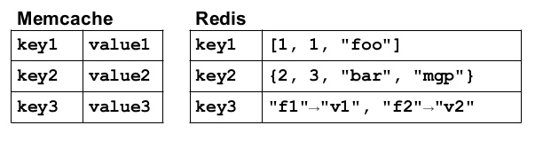
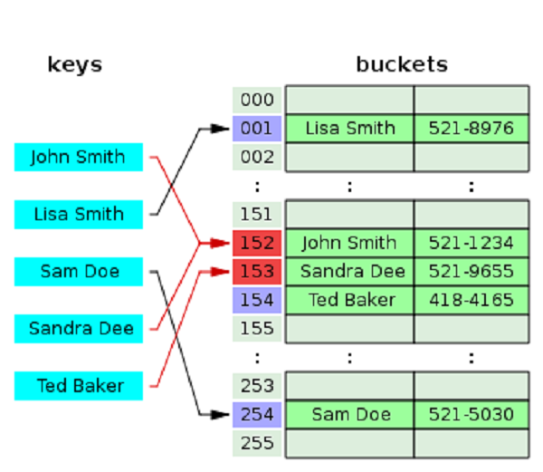
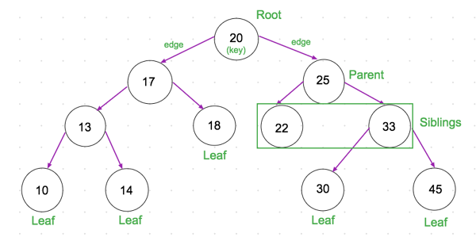

# Transactions\_CPP

Резюме: в данном проекте тебе предстоит вспомнить и подробнее ознакомиться с такими структурами данных, как хеш-таблицы и самобалансирующиеся бинарные деревья, а также реализовать на их основе хранилище типа «ключ-значение».

💡 [Нажми сюда](https://new.oprosso.net/p/4cb31ec3f47a4596bc758ea1861fb624), **чтобы поделиться с нами обратной связью на этот проект**. Это анонимно и поможет нашей команде сделать обучение лучше. Рекомендуем заполнить опрос сразу после выполнения проекта.

## Contents

1. [Chapter I](#chapter-i)
   - [Введение](#%D0%B2%D0%B2%D0%B5%D0%B4%D0%B5%D0%BD%D0%B8%D0%B5)
2. [Chapter II](#chapter-ii)
   - [Общая информация](#%D0%BE%D0%B1%D1%89%D0%B0%D1%8F-%D0%B8%D0%BD%D1%84%D0%BE%D1%80%D0%BC%D0%B0%D1%86%D0%B8%D1%8F)
     - [Key-value хранилища](#key-value-%D1%85%D1%80%D0%B0%D0%BD%D0%B8%D0%BB%D0%B8%D1%89%D0%B0)
     - [Хеш-таблица](#%D1%85%D0%B5%D1%88-%D1%82%D0%B0%D0%B1%D0%BB%D0%B8%D1%86%D0%B0)
     - [Двоичные деревья поиска](#%D0%B4%D0%B2%D0%BE%D0%B8%D1%87%D0%BD%D1%8B%D0%B5-%D0%B4%D0%B5%D1%80%D0%B5%D0%B2%D1%8C%D1%8F-%D0%BF%D0%BE%D0%B8%D1%81%D0%BA%D0%B0)
     - [Дерево поиска B-tree](#%D0%B4%D0%B5%D1%80%D0%B5%D0%B2%D0%BE-%D0%BF%D0%BE%D0%B8%D1%81%D0%BA%D0%B0-b-tree)
     - [Описание структуры данных](#%D0%BE%D0%BF%D0%B8%D1%81%D0%B0%D0%BD%D0%B8%D0%B5-%D1%81%D1%82%D1%80%D1%83%D0%BA%D1%82%D1%83%D1%80%D1%8B-%D0%B4%D0%B0%D0%BD%D0%BD%D1%8B%D1%85)
     - [Описание реализуемых функций key-value хранилища](#%D0%BE%D0%BF%D0%B8%D1%81%D0%B0%D0%BD%D0%B8%D0%B5-%D1%80%D0%B5%D0%B0%D0%BB%D0%B8%D0%B7%D1%83%D0%B5%D0%BC%D1%8B%D1%85-%D1%84%D1%83%D0%BD%D0%BA%D1%86%D0%B8%D0%B9-key-value-%D1%85%D1%80%D0%B0%D0%BD%D0%B8%D0%BB%D0%B8%D1%89%D0%B0)
3. [Chapter III](#chapter-iii)
   - [Задача 1. Реализация in-memory key-value хранилища на базе хеш-таблицы](#%D0%B7%D0%B0%D0%B4%D0%B0%D1%87%D0%B0-1-%D1%80%D0%B5%D0%B0%D0%BB%D0%B8%D0%B7%D0%B0%D1%86%D0%B8%D1%8F-in-memory-key-value-%D1%85%D1%80%D0%B0%D0%BD%D0%B8%D0%BB%D0%B8%D1%89%D0%B0-%D0%BD%D0%B0-%D0%B1%D0%B0%D0%B7%D0%B5-%D1%85%D0%B5%D1%88-%D1%82%D0%B0%D0%B1%D0%BB%D0%B8%D1%86%D1%8B)
   - [Задача 2. Реализация in-memory key-value хранилища на базе самобалансирующегося бинарного дерева поиска](#%D0%B7%D0%B0%D0%B4%D0%B0%D1%87%D0%B0-2-%D1%80%D0%B5%D0%B0%D0%BB%D0%B8%D0%B7%D0%B0%D1%86%D0%B8%D1%8F-in-memory-key-value-%D1%85%D1%80%D0%B0%D0%BD%D0%B8%D0%BB%D0%B8%D1%89%D0%B0-%D0%BD%D0%B0-%D0%B1%D0%B0%D0%B7%D0%B5-%D1%81%D0%B0%D0%BC%D0%BE%D0%B1%D0%B0%D0%BB%D0%B0%D0%BD%D1%81%D0%B8%D1%80%D1%83%D1%8E%D1%89%D0%B5%D0%B3%D0%BE%D1%81%D1%8F-%D0%B1%D0%B8%D0%BD%D0%B0%D1%80%D0%BD%D0%BE%D0%B3%D0%BE-%D0%B4%D0%B5%D1%80%D0%B5%D0%B2%D0%B0-%D0%BF%D0%BE%D0%B8%D1%81%D0%BA%D0%B0)
   - [Задача 3. Реализация консольного интерфейса](#%D0%B7%D0%B0%D0%B4%D0%B0%D1%87%D0%B0-3-%D1%80%D0%B5%D0%B0%D0%BB%D0%B8%D0%B7%D0%B0%D1%86%D0%B8%D1%8F-%D0%BA%D0%BE%D0%BD%D1%81%D0%BE%D0%BB%D1%8C%D0%BD%D0%BE%D0%B3%D0%BE-%D0%B8%D0%BD%D1%82%D0%B5%D1%80%D1%84%D0%B5%D0%B9%D1%81%D0%B0)
   - [Задача 4. Дополнительно. Реализация in-memory key-value хранилища на базе B+ деревьев](#%D0%B7%D0%B0%D0%B4%D0%B0%D1%87%D0%B0-4-%D0%B4%D0%BE%D0%BF%D0%BE%D0%BB%D0%BD%D0%B8%D1%82%D0%B5%D0%BB%D1%8C%D0%BD%D0%BE-%D1%80%D0%B5%D0%B0%D0%BB%D0%B8%D0%B7%D0%B0%D1%86%D0%B8%D1%8F-in-memory-key-value-%D1%85%D1%80%D0%B0%D0%BD%D0%B8%D0%BB%D0%B8%D1%89%D0%B0-%D0%BD%D0%B0-%D0%B1%D0%B0%D0%B7%D0%B5-b-%D0%B4%D0%B5%D1%80%D0%B5%D0%B2%D1%8C%D0%B5%D0%B2)
   - [Задача 5. Дополнительно. Исследование временных характеристик](#%D0%B7%D0%B0%D0%B4%D0%B0%D1%87%D0%B0-5-%D0%B4%D0%BE%D0%BF%D0%BE%D0%BB%D0%BD%D0%B8%D1%82%D0%B5%D0%BB%D1%8C%D0%BD%D0%BE-%D0%B8%D1%81%D1%81%D0%BB%D0%B5%D0%B4%D0%BE%D0%B2%D0%B0%D0%BD%D0%B8%D0%B5-%D0%B2%D1%80%D0%B5%D0%BC%D0%B5%D0%BD%D0%BD%D1%8B%D1%85-%D1%85%D0%B0%D1%80%D0%B0%D0%BA%D1%82%D0%B5%D1%80%D0%B8%D1%81%D1%82%D0%B8%D0%BA)

## Chapter I

## Введение


На кухне было необычайно много народу, казалось, весь этаж пришел поздравить именинника. Ну или, во всяком случае, просто урвать свой кусочек пирога. Даже Боб был здесь со своей любимой кружкой. \
Ева робко передала свои поздравления имениннику, взяла небольшую тарелочку с яблочным пирогом и поспешила обратно к своему рабочему месту. Ей было необходимо срочно закончить небольшой проект по реализации быстрого и легковесного хранилища для финансового отдела. Боб все время только и твердил, что у них там не хватает людей и рабочих рук. Поэтому Ева была призвана хотя бы частично восполнить этот дефицит. А пока все веселятся на кухне, можно спокойно и в тишине
поработать.

`-` Боб, я даже не хочу вспоминать произошедшее год назад, — внезапно прервал тишину неизвестный голос. — Столько нервов и денег ушло на то, чтобы замять этот инцидент, а сейчас я узнаю, что у нас есть риски получить нечто похуже.

`-` Виновные были наказаны тогда и наказаны сейчас. Мы активно ведем восстановительные работы, — прозвучал знакомый голос начальника. Им явно было неизвестно, что они сейчас здесь не одни. Ева тоже не стала выдавать себя и решила подслушать, чем же все-таки закончится разговор.

`-` Судя по всему, твои наказания не имеют никакого результата, раз история повторяется.

`-` Ситуация все же немного отличается...

`-` Немного? Да это еще мягко сказано. Пока что все звучит так, будто она в разы хуже. Если в прошлый раз мы получили зазомбированную семью, которая выполняла любые пожелания безумного алгоритма, то что будет сейчас? И ладно бы он просто манипулировал ими, заставляя покупать, скажем, только «определенные» товары, но что он сделал? Решил организовать свой «культ»?!

`-` Я понимаю твою озабоченность, но в этот раз все под куда большим контролем... — голоса постепенно удалялись в сторону кабинета Боба, и разбирать речь становилось все сложнее. Ева продолжала сидеть, не двигаясь и почти не дыша, даже когда голоса совсем затихли, а ее коллеги начали постепенно возвращаться на свои рабочие места после вкусного перерыва.
Ей еще предстояло до конца осознать все то, что она сейчас услышала...

## Chapter II

## Общая информация

### Key-value хранилища

Хранилища типа «ключ-значение» (англ. key-value store) предназначены для хранения, извлечения и управления ассоциативными массивами. Подобное хранилище реализуется во многих языках программирования в виде контейнерного класса *словарь*. Словари содержат коллекцию объектов или записей, которые, в свою очередь, имеют множество различных полей с данными. Эти записи хранятся и извлекаются с использованием ключа, который однозначно идентифицирует запись и
используется для быстрого поиска данных в хранилище.

Кроме того, за счёт высокой скорости чтения и записи, идею подобного хранилища реализуют многие NoSQL-базы данных, такие как Redis, Memcached, Tarantool и многие другие. Базы данных с использованием пар «ключ‑значение» поддерживают высокую разделяемость и обеспечивают беспрецедентное горизонтальное масштабирование, недостижимое при использовании многих других типов баз данных.



Для реализации key-value хранилищ в преобладающем большинстве используются хеш-таблицы или деревья поиска.

### Хеш-таблица

**Хеш-таблица** — это структура данных, которая используется, когда необходимо быстро выполнять операции вставки/удаления/нахождения элементов. Скорость выполнения этих операций обусловлена устройством хеш-таблиц. В основе их работы лежит функция хеширования, которая вычисляет значение индекса на базе переданного ей ключа. Благодаря этой функции локализация элемента в таблице по его ключу в общем случае происходит со сложностью О(1), которая не зависит от
размера самой хеш-таблицы. Сам же процесс получения индекса по ключу называется **хешированием**.



Когда хеш-функция генерирует одинаковый индекс для нескольких разных ключей, возникает конфликт: неизвестно, какое значение нужно сохранить в этом индексе. Подобные ситуации называются **коллизиями**.

Есть несколько методов борьбы с коллизиями:

- метод цепочек;
- метод открытой адресации: линейное пробирование, квадратичное пробирование, двойное хеширование.

Хеш-таблицы используются для реализации контейнерных классов типа ключ-значения во многих языках программирования, к примеру:

- *C#*: Dictionary, ConcurrentDictionary, HashMap;
- *Python*: set, map;
- *JavaScript*: Map.

### Двоичные деревья поиска

**Двоичное дерево (Бинарное дерево)** — это иерархическая структура данных, в которой каждый узел имеет значение и ссылки на левого и правого потомка. Узел, находящийся на самом верхнем уровне (не являющийся чьим-либо потомком), называется корнем. Узлы, не имеющие потомков (оба потомка которых равны `NULL`), называются листьями.

**Бинарное дерево поиска** — это бинарное дерево, обладающее дополнительными свойствами:

- оба поддерева — левое и правое — являются двоичными деревьями поиска;
- у всех узлов левого поддерева произвольного узла X значения ключей данных меньше, чем значение ключа данных самого узла X;
- у всех узлов правого поддерева произвольного узла X значения ключей данных больше или равны значению ключа данных самого узла X.



В итоге данные в бинарном дереве поиска хранятся в отсортированном виде. При каждой операции вставки нового или удаления существующего узла отсортированный порядок дерева сохраняется. Благодаря этому появляется возможность формализации алгоритма поиска элементов в бинарном дереве:

- Поиск осуществляется целенаправленным движением по ветвям дерева.
- Если ключ поиска равен ключу в вершине, значит, ключ найден и можно вернуть значение узла.
- Если ключ поиска меньше ключа в вершине, то осуществляется движение по дереву вниз влево, в противном случае — вниз вправо.
- Если в очередной вершине дальнейшее движение вниз невозможно (указатель равен `NULL`), то это означает, что искомого ключа нет в дереве.

Максимальная длина поиска в таком случае равна высоте дерева.

**Сбалансированное бинарное дерево поиска** — это бинарное дерево поиска с логарифмической высотой. Оно применяется, когда необходимо осуществлять быстрый поиск элементов, чередующийся со вставками новых элементов и удалениями существующих. В подобных деревьях для каждой вершины высота двух поддеревьев различается не более, чем на 1. Примерами самобалансирующихся деревьев поиска являются *красно-чёрные деревья* или *АВЛ-деревья*.

Красно-чёрные деревья поиска используются в структурах данных различных языков программирования, например:

- *Java*: java.util.TreeMap | java.util.TreeSet;
- *C++ STL*: map, multimap, multiset.;
- *Linux kernel*: completely fair scheduler, linux/rbtree.h.

### Дерево поиска B-tree

Основные операции в деревьях выполняются за время, пропорциональное их высоте. Сбалансированные деревья минимизируют свою высоту (к примеру, высота бинарного сбалансированного дерева с *n* узлами равна *log n*).

В чем же проблема этих стандартных деревьев поиска? Рассмотрим огромную базу данных, представленную в виде одного из упомянутых деревьев. Очевидно, что мы не можем хранить всё это дерево в оперативной памяти, поэтому в ней храним лишь часть информации, остальное же находится на стороннем носителе (допустим, на жестком диске, скорость доступа к которому
гораздо медленнее). Такие деревья, как красно-черное или АВЛ, будут требовать от нас *log n* обращений к стороннему носителю. При больших *n* это очень много. Как раз эту проблему и призваны решить B-деревья!

B-деревья также представляют собой сбалансированные деревья, поэтому время выполнения стандартных операций в них пропорционально высоте. Но, в отличие от остальных деревьев, они созданы специально для эффективной работы с дисковой памятью за счёт минимизации числа обращений на чтение или запись на диск.

B-деревья используются в key-value хранилищах:

- Apache Ignite;
- Tokyo Cabinet.

### Описание структуры данных

В качестве ключа в key-value хранилище будут выступать **строки**. В качестве значений (данных) в key-value хранилище будут храниться записи о студентах «Школы 21» в следующем виде:

- фамилия,
- имя,
- год рождения,
- город,
- число текущих коинов.

### Описание реализуемых функций key-value хранилища

### SET

Команда используется для установки ключа и его значения. В примере ниже ключом является строка `foo`, значением же является структура, описанная выше. Значение полей новой записи вводится в порядке их описания в структуре. В качестве необязательных параметров используется `EX` для указания срока жизни создаваемой записи. Если необязательное поле не указано, то по умолчанию время жизни записи никак не ограничено.

Описание параметров команды `SET`:

```
SET <ключ> <Фамилия> <Имя> <Год рождения> <Город> <Число текущих коинов> EX <время в секундах>
```

Пример использования команды `SET` для создания записи без ограничения на время её существования:

```
SET foo Васильев Иван 2000 Москва 55 
> OK
SET foo Васильев 123 aaaaa Москва 55 
> ERROR: unable to cast value "aaaa" to type int
```

Пример использования команды `SET` для создания записи с ограничением на время её существования. В этом примере запись будет существовать на протяжении 10 секунд, после чего автоматически удалится:

```
SET foo Васильев Иван 2000 Москва 55 EX 10 
> OK
```

### GET

Команда используется для получения значения, связанного с ключом. Если такой записи нет, то будет возвращён `(null)`:

```
GET foo
> Васильев Иван 2000  Москва   55 
GET unknownkey
> (null)
```

### EXISTS

Эта команда проверяет, существует ли запись с данным ключом. Она возвращает `true`, если объект существует, или `false`, если нет:

```
EXISTS foo
> true
```

### DEL

Команда удаляет ключ и соответствующее значение, после чего возвращает `true`, если запись успешно удалена, в противном случае `false`:

```
DEL foo
> true
```

### UPDATE

Команда обновляет значение по соответствующему ключу, если такой ключ существует:

```
SET foo Вас И 20 Мос 5 
> OK
UPDATE foo Васильев Иван 2000 Москва 55
> OK

GET foo
> Васильев Иван 2000 Москва 55
```

Если же какое-то поле менять не планируется, то на его месте ставится прочерк «-»:

```
SET foo Вас И 20 Мос 5 
> OK
UPDATE foo Васильев - - - 55
> OK

GET foo
> Васильев И 20 Мос 55
```

### KEYS

Возвращает все ключи, которые есть в хранилище:

```
KEYS
1) boo
2) foo
3) bar
```

### RENAME

Команда используется для переименования ключей:

```
RENAME foo foo2
> OK

GET foo
> (null)

GET foo2
> Васильев И 20 Мос 55
```

### TTL

Когда ключ установлен с истечением срока действия, эту команду можно использовать для просмотра оставшегося времени.
Если записи с заданным ключом не существует, то возвращается `(null)`:

```
SET foo Васильев Иван 2000 Москва 55 EX 10
> OK
TTL foo
> 6
TTL foo
> 5
TTL foo
> 4
TTL foo
> (null)
```

### FIND

Эта команда используется для восстановления ключа (или ключей) по заданному значению. Аналогично команде `UPDATE`
необязательно указывать все значения из структуры студентов Школы 21. Если по каким-либо полям не будет выполняться
поиск, то на их месте просто проставляются прочерк `-`.

Пример использования команды `FIND` с поиском по всем полям структуры студентов:

```
FIND Васильев Иван 2000 Москва 55
> 1) foo
FIND Васильев Антон 1997 Тверь 55
> 1) boo
```

Пример использования команды `FIND` с поиском по фамилии и числу коинов:

```
FIND Васильев - - - 55
> 1) foo
> 2) boo
```

### SHOWALL

Команда для получения всех записей, которые содержатся в key-value хранилище на текущий момент:

```
SHOWALL
> № | Фамилия |   Имя   | Год |  Город   | Количество коинов |
> 1 "Васильев"  "Иван"    2000  "Москва"          55 
> 2  "Иванов"  "Василий"  2000  "Москва"          55
```

### UPLOAD

Данная команда используется для загрузки данных из файла. Файл содержит список загружаемых данных в формате:

```
key1 "Васильев" "Иван" 2001 "Ростов" 55
key2 "Иванов" "Василий" 2000 "Москва" 55 
...
key101 "Сидоров" "Сергей" 1847 "Суздаль" 12312313
```

Вызов команды:

```
UPLOAD ~/Desktop/TestData/file.dat
> OK 101
```

После ответа `OK` выводится число загруженных строк из файла.

### EXPORT

Данная команда используется для выгрузки данных, которые находятся в текущий момент в key-value хранилище в файл. Файл должен на выходе содержать список данных в формате:

```
key1 "Васильев" "Иван" 2001 "Ростов" 55
key2 "Иванов" "Василий" 2000 "Москва" 55 
...
key101 "Сидоров" "Сергей" 1847 "Суздаль" 12312313
```

Вызов команды:

```
EXPORT ~/Desktop/TestData/export.dat
> OK 101
```

После ответа `OK` выводится число выгруженных строк из файла.

## Chapter III

## Задача 1. Реализация in-memory key-value хранилища на базе хеш-таблицы

Тебе необходимо реализовать in-memory key-value хранилище на основе хеш-таблицы:

- Программа должна быть разработана на языке C++ стандарта C++20.
- Код программы должен находиться в папке src.
- При написании программы используй стандартный для выбранного языка стиль написания кода.
- Классы должны быть реализованы внутри пространства имен `s21`.
- Не применяй устаревшие и вышедшие из употребления конструкции языка и библиотеки.
- Оформи решение, как статическую библиотеку (hash\_table).
- Библиотека должна быть представлена в виде класса `HashTable`, который хранит в себе информацию в виде хеш-таблицы и содержит все необходимые методы для реализации функционала, описанного [выше](#%D0%BE%D0%BF%D0%B8%D1%81%D0%B0%D0%BD%D0%B8%D0%B5-%D1%80%D0%B5%D0%B0%D0%BB%D0%B8%D0%B7%D1%83%D0%B5%D0%BC%D1%8B%D1%85-%D1%84%D1%83%D0%BD%D0%BA%D1%86%D0%B8%D0%B9-key-value-%D1%85%D1%80%D0%B0%D0%BD%D0%B8%D0%BB%D0%B8%D1%89%D0%B0). Выбор хеш-функции и способа разрешения коллизий остаётся за тобой.
- Класс `HashTable` должен наследоваться от базового абстрактного класса, содержащего все методы, описанные [выше](#%D0%BE%D0%BF%D0%B8%D1%81%D0%B0%D0%BD%D0%B8%D0%B5-%D1%80%D0%B5%D0%B0%D0%BB%D0%B8%D0%B7%D1%83%D0%B5%D0%BC%D1%8B%D1%85-%D1%84%D1%83%D0%BD%D0%BA%D1%86%D0%B8%D0%B9-key-value-%D1%85%D1%80%D0%B0%D0%BD%D0%B8%D0%BB%D0%B8%D1%89%D0%B0).
- Предусмотри Makefile для сборки библиотеки и тестов (с целями all, clean, tests, hash\_table).
- Должно быть обеспечено полное покрытие unit-тестами методов класса `HashTable`.

## Задача 2. Реализация in-memory key-value хранилища на базе самобалансирующегося бинарного дерева поиска

Тебе необходимо реализовать in-memory key-value хранилище на основе самобалансирующегося бинарного дерева поиска:

- Программа должна быть разработана на языке C++ стандарта C++20.
- Код программы должен находиться в папке src.
- При написании программы используй стандартный для выбранного языка стиль написания кода.
- Классы должны быть реализованы внутри пространства имен `s21`.
- Не применяй устаревшие и вышедшие из употребления конструкции языка и библиотеки.
- Оформи решение как статическую библиотеку (self\_balancing\_binary\_search\_tree).
- Библиотека должна быть представлена в виде класса `SelfBalancingBinarySearchTree`, который хранит в себе информацию в виде самобалансирующегося бинарного дерева поиска и содержит все необходимые методы для реализации функционала, описанного [выше](#%D0%BE%D0%BF%D0%B8%D1%81%D0%B0%D0%BD%D0%B8%D0%B5-%D1%80%D0%B5%D0%B0%D0%BB%D0%B8%D0%B7%D1%83%D0%B5%D0%BC%D1%8B%D1%85-%D1%84%D1%83%D0%BD%D0%BA%D1%86%D0%B8%D0%B9-key-value-%D1%85%D1%80%D0%B0%D0%BD%D0%B8%D0%BB%D0%B8%D1%89%D0%B0). Выбор типа самобалансирующегося бинарного дерева поиска остаётся за тобой.
- Класс `SelfBalancingBinarySearchTree` должен наследоваться от того же базового абстрактного класса, что и в [Part 1](#part-1-%D1%80%D0%B5%D0%B0%D0%BB%D0%B8%D0%B7%D0%B0%D1%86%D0%B8%D1%8F-in-memory-key-value-%D1%85%D1%80%D0%B0%D0%BD%D0%B8%D0%BB%D0%B8%D1%89%D0%B0-%D0%BD%D0%B0-%D0%B1%D0%B0%D0%B7%D0%B5-%D1%85%D0%B5%D1%88-%D1%82%D0%B0%D0%B1%D0%BB%D0%B8%D1%86%D1%8B), содержащего все методы, описанные [выше](#%D0%BE%D0%BF%D0%B8%D1%81%D0%B0%D0%BD%D0%B8%D0%B5-%D1%80%D0%B5%D0%B0%D0%BB%D0%B8%D0%B7%D1%83%D0%B5%D0%BC%D1%8B%D1%85-%D1%84%D1%83%D0%BD%D0%BA%D1%86%D0%B8%D0%B9-key-value-%D1%85%D1%80%D0%B0%D0%BD%D0%B8%D0%BB%D0%B8%D1%89%D0%B0).
- Добавь в существующий Makefile цель «self\_balancing\_binary\_search\_tree» для сборки библиотеки.
- Должно быть обеспечено полное покрытие unit-тестами методов класса `SelfBalancingBinarySearchTree`.

## Задача 3. Реализация консольного интерфейса

Ты должен реализовать консольный интерфейс, который предоставляет пользователю следующие опции:

- Первоначальный выбор типа хранилища, который будет использоваться в процессе работы программы:
  - хеш-таблица;
  - самобалансирующееся бинарное дерево поиска.
- Возможность ввода команд, описанных [выше](#%D0%BE%D0%BF%D0%B8%D1%81%D0%B0%D0%BD%D0%B8%D0%B5-%D1%80%D0%B5%D0%B0%D0%BB%D0%B8%D0%B7%D1%83%D0%B5%D0%BC%D1%8B%D1%85-%D1%84%D1%83%D0%BD%D0%BA%D1%86%D0%B8%D0%B9-key-value-%D1%85%D1%80%D0%B0%D0%BD%D0%B8%D0%BB%D0%B8%D1%89%D0%B0).

## Задача 4. Дополнительно. Реализация in-memory key-value хранилища на базе B+ деревьев

Тебе необходимо реализовать in-memory key-value хранилище на основе самобалансирующегося бинарного дерева поиска:

- Программа должна быть разработана на языке C++ стандарта C++20.
- Код программы должен находиться в папке src.
- При написании программы используй стандартный для выбранного языка стиль написания кода.
- Классы должны быть реализованы внутри пространства имен `s21`.
- Не применяй устаревшие и вышедшие из употребления конструкции языка и библиотеки.
- Оформи решение как статическую библиотеку (b\_plus\_tree).
- Библиотека должна быть представлена в виде класса `BPlusTree`, который хранит в себе информацию в виде B+ дерева и содержит все необходимые методы для реализации функционала, описанного [выше](#%D0%BE%D0%BF%D0%B8%D1%81%D0%B0%D0%BD%D0%B8%D0%B5-%D1%80%D0%B5%D0%B0%D0%BB%D0%B8%D0%B7%D1%83%D0%B5%D0%BC%D1%8B%D1%85-%D1%84%D1%83%D0%BD%D0%BA%D1%86%D0%B8%D0%B9-key-value-%D1%85%D1%80%D0%B0%D0%BD%D0%B8%D0%BB%D0%B8%D1%89%D0%B0).
- Класс `BPlusTree` должен наследоваться от базового абстрактного класса из [Part 1](#part-1-%D1%80%D0%B5%D0%B0%D0%BB%D0%B8%D0%B7%D0%B0%D1%86%D0%B8%D1%8F-in-memory-key-value-%D1%85%D1%80%D0%B0%D0%BD%D0%B8%D0%BB%D0%B8%D1%89%D0%B0-%D0%BD%D0%B0-%D0%B1%D0%B0%D0%B7%D0%B5-%D1%85%D0%B5%D1%88-%D1%82%D0%B0%D0%B1%D0%BB%D0%B8%D1%86%D1%8B) и [Part 2](#part-2-%D1%80%D0%B5%D0%B0%D0%BB%D0%B8%D0%B7%D0%B0%D1%86%D0%B8%D1%8F-in-memory-key-value-%D1%85%D1%80%D0%B0%D0%BD%D0%B8%D0%BB%D0%B8%D1%89%D0%B0-%D0%BD%D0%B0-%D0%B1%D0%B0%D0%B7%D0%B5-%D1%81%D0%B0%D0%BC%D0%BE%D0%B1%D0%B0%D0%BB%D0%B0%D0%BD%D1%81%D0%B8%D1%80%D1%83%D1%8E%D1%89%D0%B5%D0%B3%D0%BE%D1%81%D1%8F-%D0%B1%D0%B8%D0%BD%D0%B0%D1%80%D0%BD%D0%BE%D0%B3%D0%BE-%D0%B4%D0%B5%D1%80%D0%B5%D0%B2%D0%B0-%D0%BF%D0%BE%D0%B8%D1%81%D0%BA%D0%B0), содержащего все методы, описанные [выше](#%D0%BE%D0%BF%D0%B8%D1%81%D0%B0%D0%BD%D0%B8%D0%B5-%D1%80%D0%B5%D0%B0%D0%BB%D0%B8%D0%B7%D1%83%D0%B5%D0%BC%D1%8B%D1%85-%D1%84%D1%83%D0%BD%D0%BA%D1%86%D0%B8%D0%B9-key-value-%D1%85%D1%80%D0%B0%D0%BD%D0%B8%D0%BB%D0%B8%D1%89%D0%B0).
- Добавь в существующий Makefile цель «b\_plus\_tree» для сборки библиотеки.
- Должно быть обеспечено полное покрытие unit-тестами методов класса `BPlusTree`.
- Добавь в консольный интерфейс, описанный в [Part 3](#part-3-%D1%80%D0%B5%D0%B0%D0%BB%D0%B8%D0%B7%D0%B0%D1%86%D0%B8%D1%8F-%D0%BA%D0%BE%D0%BD%D1%81%D0%BE%D0%BB%D1%8C%D0%BD%D0%BE%D0%B3%D0%BE-%D0%B8%D0%BD%D1%82%D0%B5%D1%80%D1%84%D0%B5%D0%B9%D1%81%D0%B0), возможность выбора B+ дерева в качестве создаваемого in-memory key-value хранилища.

## Задача 5. Дополнительно. Исследование временных характеристик

Проведи исследование временных характеристик вариантов реализаций in-memory key-value хранилища на базе хеш-таблицы, а также бинарного дерева поиска.

- Пользователем задается количество элементов в хранилище.
- Данные в хранилище генерируются случайным образом.
- Пользователем задается количество повторений одного действия.
- Каждое действие, указанное ниже, должно выполняться указанное пользователем количество раз, после чего выводится среднее среди полученных значений времени работы.
- Измерь время выполнения следующих действий обоими видами хранилищ:
  - Получение произвольного элемента;
  - Добавление элемента;
  - Удаление элемента;
  - Получения списка всех элементов в словаре;
  - Поиск ключа элемента по значению.
- Будь готов объяснить полученные результаты.