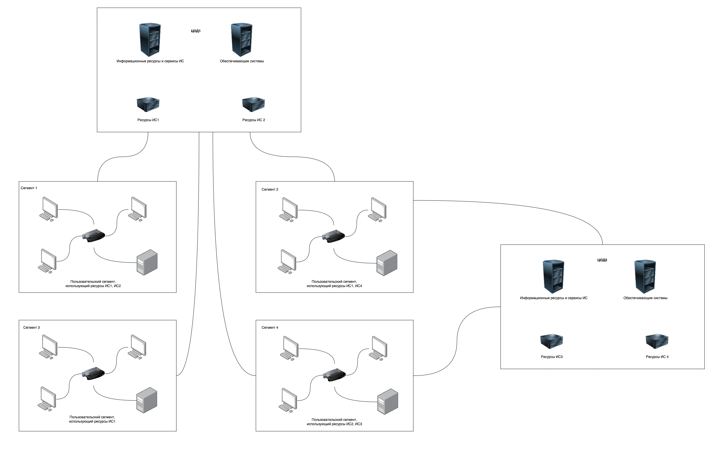
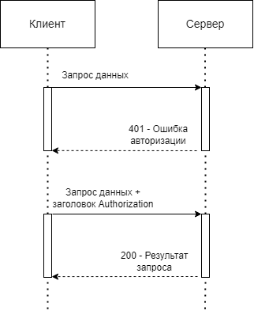

# Project Mobile 04 — Kotlin\_Bootcamp

Резюме: в этом проекте ты создашь мобильное приложение на Android в качестве клиента для реализованного сервера.

💡 [Нажми сюда](https://new.oprosso.net/p/4cb31ec3f47a4596bc758ea1861fb624), **чтобы поделиться с нами обратной связью на этот проект**. Это анонимно и поможет нашей команде сделать обучение лучше. Рекомендуем заполнить опрос сразу после выполнения проекта.

## Содержание

1. [Chapter I](#chapter-i)
   - [Инструкция](#%D0%B8%D0%BD%D1%81%D1%82%D1%80%D1%83%D0%BA%D1%86%D0%B8%D1%8F)
2. [Chapter II](#chapter-ii)
   - [Общая информация](#%D0%BE%D0%B1%D1%89%D0%B0%D1%8F-%D0%B8%D0%BD%D1%84%D0%BE%D1%80%D0%BC%D0%B0%D1%86%D0%B8%D1%8F)
     - [Паттерн MVVM](#%D0%BF%D0%B0%D1%82%D1%82%D0%B5%D1%80%D0%BD-mvvm)
     - [Авторизация](#%D0%B0%D0%B2%D1%82%D0%BE%D1%80%D0%B8%D0%B7%D0%B0%D1%86%D0%B8%D1%8F)
     - [Идентификация, аутентификация, авторизация](#%D0%B8%D0%B4%D0%B5%D0%BD%D1%82%D0%B8%D1%84%D0%B8%D0%BA%D0%B0%D1%86%D0%B8%D1%8F-%D0%B0%D1%83%D1%82%D0%B5%D0%BD%D1%82%D0%B8%D1%84%D0%B8%D0%BA%D0%B0%D1%86%D0%B8%D1%8F-%D0%B0%D0%B2%D1%82%D0%BE%D1%80%D0%B8%D0%B7%D0%B0%D1%86%D0%B8%D1%8F)
     - [Авторизация с помощью логина и пароля](#%D0%B0%D0%B2%D1%82%D0%BE%D1%80%D0%B8%D0%B7%D0%B0%D1%86%D0%B8%D1%8F-%D1%81-%D0%BF%D0%BE%D0%BC%D0%BE%D1%89%D1%8C%D1%8E-%D0%BB%D0%BE%D0%B3%D0%B8%D0%BD%D0%B0-%D0%B8-%D0%BF%D0%B0%D1%80%D0%BE%D0%BB%D1%8F)
3. [Chapter III](#chapter-iii)
   - [Проект: Крестики-Нолики](#%D0%BF%D1%80%D0%BE%D0%B5%D0%BA%D1%82-%D0%BA%D1%80%D0%B5%D1%81%D1%82%D0%B8%D0%BA%D0%B8-%D0%BD%D0%BE%D0%BB%D0%B8%D0%BA%D0%B8)
   - [Задание 0. Описание и требования](#%D0%B7%D0%B0%D0%B4%D0%B0%D0%BD%D0%B8%D0%B5-0-%D0%BE%D0%BF%D0%B8%D1%81%D0%B0%D0%BD%D0%B8%D0%B5-%D0%B8-%D1%82%D1%80%D0%B5%D0%B1%D0%BE%D0%B2%D0%B0%D0%BD%D0%B8%D1%8F)
   - [Задание 1. Реализация слоя данных и di](#%D0%B7%D0%B0%D0%B4%D0%B0%D0%BD%D0%B8%D0%B5-1-%D1%80%D0%B5%D0%B0%D0%BB%D0%B8%D0%B7%D0%B0%D1%86%D0%B8%D1%8F-%D1%81%D0%BB%D0%BE%D1%8F-%D0%B4%D0%B0%D0%BD%D0%BD%D1%8B%D1%85-%D0%B8-di)
   - [Задание 2. Реализация слоя бизнес-логики и di](#%D0%B7%D0%B0%D0%B4%D0%B0%D0%BD%D0%B8%D0%B5-2-%D1%80%D0%B5%D0%B0%D0%BB%D0%B8%D0%B7%D0%B0%D1%86%D0%B8%D1%8F-%D1%81%D0%BB%D0%BE%D1%8F-%D0%B1%D0%B8%D0%B7%D0%BD%D0%B5%D1%81-%D0%BB%D0%BE%D0%B3%D0%B8%D0%BA%D0%B8-%D0%B8-di)
   - [Задание 3. Реализация слоя пользовательского интерфейса. Часть 1](#%D0%B7%D0%B0%D0%B4%D0%B0%D0%BD%D0%B8%D0%B5-3-%D1%80%D0%B5%D0%B0%D0%BB%D0%B8%D0%B7%D0%B0%D1%86%D0%B8%D1%8F-%D1%81%D0%BB%D0%BE%D1%8F-%D0%BF%D0%BE%D0%BB%D1%8C%D0%B7%D0%BE%D0%B2%D0%B0%D1%82%D0%B5%D0%BB%D1%8C%D1%81%D0%BA%D0%BE%D0%B3%D0%BE-%D0%B8%D0%BD%D1%82%D0%B5%D1%80%D1%84%D0%B5%D0%B9%D1%81%D0%B0-%D1%87%D0%B0%D1%81%D1%82%D1%8C-1)
   - [Задание 4. Реализация слоя пользовательского интерфейса. Часть 2](#%D0%B7%D0%B0%D0%B4%D0%B0%D0%BD%D0%B8%D0%B5-4-%D1%80%D0%B5%D0%B0%D0%BB%D0%B8%D0%B7%D0%B0%D1%86%D0%B8%D1%8F-%D1%81%D0%BB%D0%BE%D1%8F-%D0%BF%D0%BE%D0%BB%D1%8C%D0%B7%D0%BE%D0%B2%D0%B0%D1%82%D0%B5%D0%BB%D1%8C%D1%81%D0%BA%D0%BE%D0%B3%D0%BE-%D0%B8%D0%BD%D1%82%D0%B5%D1%80%D1%84%D0%B5%D0%B9%D1%81%D0%B0-%D1%87%D0%B0%D1%81%D1%82%D1%8C-2)

## Chapter I

## Инструкция

1. На протяжении всего курса тебя будет сопровождать чувство неопределенности и острого дефицита информации — это нормально. Не забывай, что информация в репозитории и Google всегда с тобой. Как и пиры, и Rocket.Chat. Общайся. Ищи. Опирайся на здравый смысл. Не бойся ошибиться.
2. Будь внимателен к источникам информации. Проверяй. Думай. Анализируй. Сравнивай.
3. Внимательно читай задания. Перечитай несколько раз.
4. Читать примеры тоже лучше внимательно. В них может быть что-то, что не указано в явном виде в самом задании.
5. Тебе могут встретиться несоответствия, когда что-то новое в условиях задачи или примере противоречит уже известному. Если встретилось такое — попробуй разобраться. Если не получилось — запиши вопрос в открытые вопросы и выясни в процессе работы. Не оставляй открытые вопросы неразрешенными.
6. Если задание кажется непонятным или невыполнимым — так только кажется. Попробуй его декомпозировать. Скорее всего, отдельные части станут понятными.
7. На пути тебе встретятся самые разные задания. Те, что помечены звездочкой (\*) — подходят для более дотошных. Они повышенной сложности и необязательны к выполнению. Но если ты их сделаешь, то получишь дополнительный опыт и знания.
8. Не пытайся обмануть систему и окружающих. В первую очередь ты обманешь себя.
9. Есть вопрос? Спроси соседа справа. Если это не помогло — соседа слева.
10. Когда пользуешься помощью — всегда разбирайся до конца: почему, как и зачем. Иначе помощь не будет иметь смысла.
11. Всегда делай push только в ветку develop! Ветка master будет проигнорирована. Работай в директории src.
12. В твоей директории не должно быть иных файлов, кроме тех, что обозначены в заданиях.

## Chapter II

## Общая информация

### Паттерн MVVM

Паттерн MVVM (Model-View-ViewModel) – архитектурный шаблон проектирования приложения. Состоит из трех компонентов: модели бизнес-логики (Model), модели представления (ViewModel) и представления (View). Механизм привязки данных (bindings) обеспечивает связь между компонентами View и ViewModel.

#### Модель бизнес-логики

Описывает используемые в приложении данные. Модели могут содержать логику, непосредственно связанную с этими данными, например, логику валидации свойств модели. В то же время модель не должна содержать никакой логики, связанной с отображением данных и взаимодействием с визуальными элементами управления.

#### Представление

Определяет визуальный интерфейс, через который пользователь взаимодействует с приложением.
Представление передает действия пользователя в модель представления посредством команд.

#### Модель представления

Связывает представление и модель бизнес-логики через механизм привязки данных. Если в модели бизнес-логики изменяются значения свойств, то автоматически происходит изменение отображаемых данных в представлении, хотя напрямую модель бизнес-логики и представление не связаны.

Содержит логику по получению данных из модели бизнес-логики, которые потом передаются в представление. Модель представления определяет логику по обновлению данных в модели бизнес-логики.

Визуальные компоненты, например, поле ввода, не используют события, а представление взаимодействует с моделью представления посредством команд. Например, пользователь хочет сохранить введенные в текстовое поле данные. Он нажимает на кнопку и тем самым отправляет команду в модель представления. А модель представления уже получает переданные данные и в соответствии с ними обновляет модель.

### Авторизация

Средства авторизации контролируют доступ легальных пользователей к ресурсам системы, предоставляя каждому из них именно те права, которые ему были определены администратором.

### Идентификация, аутентификация, авторизация

**Идентификация** — процедура, в результате выполнения которой для субъекта выявляется его уникальный признак, однозначно определяющий его в информационной системе.

**Аутентификация** — процедура проверки подлинности, например, проверка подлинности пользователя путем сравнения введенного им пароля с паролем, сохраненным в системе.

**Авторизация** — предоставление определенному лицу или группе лиц прав на выполнение определенного набора действий.

### Авторизация с помощью логина и пароля

Метод основывается на том, что пользователь должен предоставить логин и пароль для успешной идентификации и аутентификации в системе. Пара логина и пароля задается пользователем при его регистрации в системе. В случае успешной авторизации на сервере пользователю выдаются права на выполнение доступных ему запросов.

Клиент отправляет запрос на сервер и получает в виде ответа сообщение «Unauthorized» вместе с информацией о порядке авторизации. После успешного прохождения авторизации в каждый последующий запрос клиента автоматически добавляется заголовок «Authorization» ([формирование заголовка авторизации](https://datatracker.ietf.org/doc/html/rfc7617)), в котором передаются данные клиента для аутентификации сервером.

Существуют и [другие способы авторизации](https://developer.mozilla.org/en-US/docs/Web/HTTP/Authentication#authentication_schemes).

## Chapter III

### Проект: Крестики-Нолики

Тебе предстоит разработать и реализовать клиентское мобильное приложение для игры в «Крестики-Нолики» с использованием паттерна MVVM. Приложение будет поддерживать:

- авторизацию по паре логина и пароля (basic auth);
- возможность регистрации;
- отображение списка текущих игр;
- возможность создания игры;
- возможность присоединения к игре;
- отображение информации об участниках;
- возможность играть в крестики-нолики;
- сохранение полученной информации в базу данных;
- выход на экран авторизации.

Для мобильного приложения проект создаётся один раз и используется для всех последующих заданий.

## Задание 0. Описание и требования

**Общие требования:**

- Код программы должен находиться в папке src и не противоречить требованиям ниже.
- В качестве рекомендаций по дизайну вы можете использовать [Material 2](https://m2.material.io/develop/android).
- Дизайн приложения должен быть интуитивно понятным.

**Для реализации мобильного приложения нужно использовать:**

- Android Studio 2022.1.1;
- Kotlin 1.8.10;
- Android SDK 32;
- Gradle 7.6 (управление зависимостями);
- Material 2 (создание пользовательского интерфейса).

**В проект должны быть добавлены следующие зависимости:**

- Room 2.5.0 (работа с базой данных);
- Gson (сериализация JSON);
- Retrofit 2.9.0 (сетевое взаимодействие);
- Dagger 2.45 (внедрение зависимостей);
- Kotlin Coroutines 1.6.4 (асинхронная работа).

**Приложение должно отвечать следующим требованиям с точки зрения архитектуры:**

- Использование архитектурного паттерна MVVM;
- Присутствие трех основных слоев приложения: данных, бизнес-логики и пользовательского интерфейса.

## Задание 1. Реализация слоя данных и di

1. Реализуй слой данных (datasource):
   - Сетевая часть (Retrofit):
     - В API должны быть описаны все запросы для T04 сервера.
     - Должны быть созданы отдельные модели (Dto) с сериализатором Gson.
     - Имя модели должно формироваться как ИмяDto (Например, UserDto).
     - Создай сетевой сервис, который:
       - работает с API;
       - осуществляет вызовы запросов и их обработку.
     - Создай Interceptor для автоматической подстановки логина и пароля из базы данных:
       - Добавь заголовок запроса Authorization.
       - Запиши в него Basic base64(login:password) [формирование заголовка авторизации](https://datatracker.ietf.org/doc/html/rfc7617).
   - Часть базы данных (Room):
     - Должны присутствовать как минимум модели:
       - для игры в крестики-нолики;
       - для хранения информации о пользователях;
       - для хранения информации о текущем пользователе.
     - Они описываются, как отдельные модели (Entity) для таблиц базы данных.
     - Имя модели должно формироваться, как ИмяEntity (Например, UserEntity).
     - Должны быть реализованы CRUD-операции.
     - Создай сервис для работы с базой данных, который:
       - работает с DAO;
       - осуществляет вызовы запросов и их обработку.
2. Внедри зависимости (DI — Dagger):
   - Опиши создание базы данных в качестве singleton (singleton должен создаваться c помощью DI).
   - Опиши создание API в качестве singleton (singleton должен создаваться c помощью DI).
   - Опиши создание сервисов.
   - Опиши все необходимые зависимости для создания объектов, перечисленных ранее.

## Задание 2. Реализация слоя бизнес-логики и di

1. Реализуй слой бизнес-логики (domain):
   - Должны быть созданы отдельные модели (Domain).
   - Имя модели должно формироваться как Имя (Например, User).
   - Должны быть реализованы мапперы для Dto<->Domain, Entity<->Domain.
   - Должны быть реализованы репозитории:
     - для работы с играми;
     - для работы с пользователями;
     - для авторизации и регистрации.
   - Репозитории объединяют разные источники получения и сохранения данных. (Например, обновление текущей игры: получение данных о текущей игре с помощью сетевого сервиса и сохранение с помощью сервиса для базы данных. Получение сохраненных данных из базы данных.)
2. Внедри зависимости (DI — Dagger):
   - Должно быть описано создание всех репозиториев.
3. Должны быть реализованы мапперы для Dto<->Domain, Entity<->Domain. Не помещай их в слой бизнес-логики, иначе это нарушит идею чистой архитектуры.

## Задание 3. Реализация слоя пользовательского интерфейса. Часть 1

1. Реализуй слой пользовательского интерфейса (presentation):
   - Экран авторизации:
     - Должно быть поле для ввода логина и поле для ввода пароля.
     - Поле с паролем должно быть с возможностью скрытия вводимых символов.
     - Кнопка для регистрации:
       - При нажатии на кнопку должен осуществляться переход на экран регистрации.
     - Кнопка для авторизации при помощи пары логина и пароля:
       - При нажатии на кнопку должна произойти валидация данных для полей ввода логина и пароля.
       - При ошибке валидации должно появиться всплывающее уведомление.
       - Если валидация пройдена успешно, то на сервер должен отправиться запрос авторизации.
       - При ошибке авторизации должно появиться всплывающее уведомление с причиной.
       - Если авторизация пройдена успешно, информация о пользователе должна сохраниться в базу данных.
     - Индикатор выполнения:
       - При авторизации должен показываться индикатор выполнения.
       - При ошибке или успешной авторизации должен скрываться индикатор выполнения.
     - Если при успешной авторизации в качестве текущего пользователя сохранен другой пользователь, то должна произойти полная очистка базы данных и должна сохраниться информация о новом пользователе.
   - Экран регистрации:
     - Должно быть поле для ввода логина, поле для ввода пароля и поле повторного ввода пароля для подтверждения.
     - Поля, связанные с паролем, должны быть с возможностью скрытия вводимых символов.
     - Кнопка регистрации:
       - При нажатии на кнопку регистрации на сервер должен отправиться запрос регистрации.
       - При успешной регистрации должен произойти переход на экран авторизации.
       - При ошибке регистрации должно появиться всплывающее уведомление с причиной.
   - Должны быть созданы отдельные модели (ViewData).
   - Имя модели должно формироваться как ИмяViewData (Например, UserViewData).
   - Должны быть реализованы мапперы ViewData<->Domain.
   - Операции отправки данных на сервер и получения данных с сервера должны выполняться асинхронно и не блокировать главный поток.
   - Операции сохранения данных должны выполняться асинхронно и не блокировать главный поток.
   - Должна поддерживаться горизонтальная и вертикальная ориентация устройства.
2. Обеспечь связь между слоем пользовательского интерфейса, слоем бизнес-логики и di.

## Задание 4. Реализация слоя пользовательского интерфейса. Часть 2

1. Реализуй слой пользовательского интерфейса (presentation):
   - Экран существующих игр:
     - Добавь переход с экрана авторизации на экран существующих игр при успешной авторизации.
     - Список существующих игр:
       - Должны отображаться только игры, к которым можно присоединиться.
       - Должен отображаться UUID текущей игры.
       - Должен отображаться логин участника, который создал игру.
       - При нажатии на элемент списка на сервер должен отправиться запрос присоединения к игре.
       - Если присоединение произошло успешно, должен быть переход на экран текущей игры.
       - При ошибке присоединения должно появиться всплывающее уведомление с причиной.
     - Кнопка создания игры:
       - При нажатии на кнопку должен быть переход на экран создания игры.
     - Кнопка выхода:
       - При нажатии на кнопку выхода должна быть полная очистка базы данных.
       - После очистки базы данных должен произойти переход на экран авторизации.
     - Обновление списка текущих игр:
       - Должен поддерживаться [SwipeRefreshLayout](https://developer.android.com/develop/ui/views/touch-and-input/swipe/add-swipe-interface) для обновления списка существующих игр.
       - При использовании refreshable или при переходе на экран существующих игр на сервер должен отправиться запрос получения списка текущих игр с использованием токена.
       - При ошибке запроса должно появиться всплывающее уведомление с причиной.
       - Если запрос выполнился успешно, текущие игры должны сохраниться в базу данных.
   - Экран создания игры:
     - Кнопка создания игры с компьютером:
       - При нажатии на кнопку на сервер должен отправиться запрос создания новой игры с компьютером.
       - При успешном создании должен произойти переход на экран текущей игры.
       - При ошибке создания должно появиться всплывающее уведомление с причиной.
     - Кнопка создания игры с другим игроком:
       - При нажатии на кнопку на сервер должен отправиться запрос создания новой игры с другим игроком.
       - При успешном создании должен произойти переход на экран текущей игры.
       - При ошибке создания должно появиться всплывающее уведомление с причиной.
   - Экран текущей игры:
     - Отображение UUID текущей игры.
     - Отображение логинов игроков в текущей игре.
     - Отображение значков игроков, которыми они будут ходить на игровом поле.
     - Отображение игрового поля:
       - При нажатии на определенную часть поля на сервер должен отправиться запрос изменения поля текущей игры.
       - При успешном изменении поля текущей игры должен отобразиться ход.
       - При ошибке изменения должно появиться всплывающее уведомление с причиной.
       - Каждую секунду должен отправляться на сервер запрос обновления текущей игры.
       - При успешном обновлении текущей игры информация на экране должна обновиться.
       - При ошибке обновления должно появиться всплывающее уведомление с причиной.
     - Отображение текущего состояния игры:
       - Ожидание игроков — отображение текста «Ожидание игроков» с пустым игровым полем.
       - Ход игрока с UUID — если UUID совпадает с текущим авторизованным пользователем, то должно быть отображение текста «Ваш ход» и должна быть возможность хода на игровом поле, в противном случае должно быть отображение текста «Ходит соперник login» и отсутствовать возможность хода на игровом поле.
       - Ничья — должен отобразиться текст «Ничья» и отсутствовать возможность хода на игровом поле.
       - Победа игрока с UUID — если UUID совпадает с текущим авторизованным пользователем, то должно быть отображение текста «Победа», иначе должно быть отображение текст «Поражение» и отсутствовать возможность хода на игровом поле.
   - Если в ответ на запрос, где требуется авторизация, пришел 401 код, то необходимо перейти на экран авторизации.
   - Должны быть созданы отдельные модели (ViewData).
   - Имя модели должно формироваться как ИмяViewData (Например, UserViewData).
   - Должны быть реализованы мапперы ViewData<->Domain.
   - Операции отправки данных на сервер и получения данных с сервера должны выполняться асинхронно и не блокировать главный поток.
   - Операции сохранения данных должны выполняться асинхронно и не блокировать главный поток.
   - Должна поддерживаться горизонтальная и вертикальная ориентация устройства.
2. Обеспечь связь между слоем пользовательского интерфейса, слоем бизнес-логики и di.