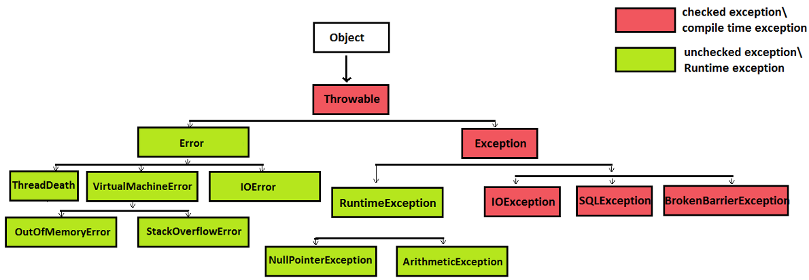

# Auto-testing basics (AQA)

In this project, you'll explore what Test Runners are and how to use them.

💡 [Press here](https://new.oprosso.net/p/4cb31ec3f47a4596bc758ea1861fb624) **to leave feedback on this project.** It's anonymous and will help our «School 21» team improve the learning experience. We recommend completing the survey immediately after finishing the project.

## Contents

- [Chapter 1](#chapter-1)
- [1.1. General instructions](#11-general-instructions)
- [Chapter 2](#chapter-2)
  - [2.1. Introduction](#21-introduction)
- [Chapter 3](#chapter-3)
  - [3.1. What is a Test Runner](#31-what-is-a-test-runner)
  - [3.2. Exceptions](#32-exceptions)
  - [3.3. Java exception handling keywords (try, catch, finally, throws)](#33-java-exception-handling-keywords-try-catch-finally-throws)
- [Chapter 4](#chapter-4)
  - [4.1. Framework Setup](#41-framework-setup)
  - [Task 1. First contact with JUnit](#task-1-first-contact-with-junit)
  - [Task 2. Parameterized tests in JUnit](#task-2-parameterized-tests-in-junit)
  - [Task 3. Test execution order in JUnit](#task-3-test-execution-order-in-junit)
  - [Task 4. Test suites](#task-4-test-suites)
  - [Task 5. Custom exception implementation](#task-5-custom-exception-implementation)
  - [Task 6. Alternative test execution methods](#task-6-alternative-test-execution-methods)
  - [Task 7. Introduction to TestNG](#task-7-introduction-to-testng)

## Chapter 1

## 1.1. General instructions

How to learn at “School 21”:

- Here, you’ll find a unique learning experience with a lot of freedom. You’re given a task and left to find your own way to solve it, using whatever resources work best for you — whether that’s the Internet or AI tools like GigaChat. Just be mindful of information quality: verify, think critically, analyze, and compare.
- Peer-to-peer (P2P) learning is the exchange of knowledge and experience with peers, where everyone acts as both mentor and student. This approach allows you to gain a deeper understanding of the material by learning from one another.
- Feel free to ask for help: around you are peers who are also navigating this path for the first time. Share your own experience and ideas with others. Join Rocket.Chat to stay updated with the latest community announcements.
- Your learning is meaningless if you just copy someone else’s solutions. When receiving help from others, always make sure you fully understand the “why”, “how”, and “purpose” behind the solution. Don’t be afraid to make mistakes.
- Does the task seem impossible? Take a break, get some fresh air and clear your mind — this has helped many people. Maybe after that, the solution will come to you naturally.
- The learning process is just as important as the result. It’s not just about completing the task — it’s about understanding HOW to solve it.

How to work with the project:

- Before starting, clone the project from GitLab into a repository with the same name.
- All files should be created inside the *src/* folder of the cloned repository.
- After cloning the project, create a *develop* branch and do all your development there. Then, push the *develop* branch to GitLab.
- Your directory should not contain any files other than those specified in the assignments.

## Chapter 2

### 2.1. Introduction

To efficiently execute and manage tests, you need to master Test Runners. In this project, you’ll learn to work with JUnit and TestNG by writing unit tests.

You’ll go from adding a Test Runner to running tests and creating test suites. You’ll practice writing custom exceptions, parameterized tests, and explore assertion types.

Ready? Let’s go!

## Chapter 3

### 3.1. What is a Test Runner

As the name suggests, a Test Runner is a tool that executes tests and exports results based on configurations. It’s a library that runs test code to detect errors.

Think of it as an orchestra conductor: it organizes processes, runs tests, and highlights failures.

Test runners are ubiquitous in automated testing (API, UI, mobile apps). Mastering them is essential for any AQA-engineer.

You can run tests via command-line parameters or UI tools. Common examples include JUnit (Java), Karma (JavaScript), PyTest (Python).

We’ll focus on Java’s two most widely-used runners: JUnit and TestNG. They’re functionally similar but differ in syntax and logic.

Initially, TestNG offered more features than older JUnit versions. However, JUnit 5 has caught up and now provides extensive options. Since JUnit 4 is outdated, we will use JUnit 5.

### 3.2. Exceptions

In programming, unexpected errors during execution are called exceptions. They can arise from user errors, missing resources, or server disconnections. They can also occur due to code bugs or API misuse. Java provides mechanisms to handle these errors.

Understanding exceptions is crucial for building test frameworks and interviews — many companies test this topic for automation roles.

### 3.3. Java exception handling keywords (try, catch, finally, throws)

Java exception handling process includes working with so-called keywords. Here is list of them:

- try: Defines a code block where exceptions may occur.
- catch: Handles exceptions from the try block.
- finally: Сontains code that always runs (after try/catch), even if an exception was thrown.

Those keywords are used to create such constructs as:

try{}catch \
try{}catch{}finally \
try{}finally{}

There are also keywords to manually throw errors:

- throw: Manually triggers an exception.
- throws: Declares exceptions a method might throw.

AQA engineers use try-catch-finally to create robust tests and prevent errors.

Source: <https://quarkphysics.ca/ICS4U1/unit2-FileIO/exceptions.html>

When errors occur, Java Virtual Machine (JVM) creates an object from Java's exception hierarchy. This hierarchy contains various exception types inherited from common ancestor — Throwable class.

Unexpected situations fall into two main groups:

1. Situations in which normal program execution cannot resume.
2. Situations in which program execution can resume.

The first group includes exceptions of the **Error class** — serious issues such as JVM failures, memory overflows, and system crashes. These are considered unchecked exceptions at compile time.

This group also includes RuntimeException — exception subclasses generated by JVM during execution. Often caused by programming errors. These are also unchecked exceptions — developers aren't required to handle them.

Second group includes predictable exceptions that developers should handle. These are checked exceptions. Handling these situations is a core developer responsibility.

Understanding this classification helps AQA engineers anticipate different program behaviors and prepare tests for various scenarios.

## Chapter 4

### 4.1. Framework Setup

General project implementation guidelines:

- Use Java 21 for all code.
- Non-test components (helpers, functional methods etc.) go in src folder
- Tests go in src/test folder.
- Use SOLID, DRY, and KISS architectural principles. Design objects to minimize future modifications and error risks.
- All tests must have descriptive names and include clear documentation via appropriate annotations.

**A key skill for an AQA specialist: working with AI tools**

Another goal of the project is to help you effectively use modern AI tools to enhance your work.

**A critically important rule:**

1. First, complete the tasks manually—this is a mandatory requirement. Experienced specialists delegate tasks to AI only after they already know the solution themselves; AI is brought in to help optimize or generate similar work. Mark the results obtained manually, for example, as manual-solution.
2. After completing the task independently, implement it using AI—mark these results as ai-assisted-solution.
3. Compare the results—analyze what the AI did better and where it made mistakes.

**Security, Ethics, Critical Thinking:**

1. Never upload code containing real data, passwords, or commercial information to public AI models. In this training project, there is no such data, but the habit must be formed.
2. Check all generated code snippets for vulnerabilities and compliance with company standards.
3. In real-world work, AI makes mistakes constantly—it may generate code that looks good but doesn’t actually work. Verify all output results and correct them as needed.

### Task 1. First contact with JUnit

1. In the src/java folder, find and review the MethodExamples.java class.
2. Write JUnit unit tests for all class methods.
3. Learn how assertAll works and implement it in your test verification chains.
4. Write test descriptions (comments) for each verification and pass them as the third assertion parameter.
5. Annotate all tests with a DisplayName that contains a clear test description. Maintain this standard for all subsequent tests.

This task involves writing unit tests with JUnit. Although this is typically a developer task, it is essential for understanding test runners.

**Recommendations for completing the task:**

- Review the existing build.gradle file.
- Write test methods without modifying the TestsExample classes.
- Create methods containing assertions that call static methods from the target class with the required parameters, and then compare them with the expected results.
- Aim to cover all relevant scenarios that align with the method's purpose (as described in its documentation).
- If the method doesn't handle all possible inputs, modify its body (while preserving the method signature and the original problem it solves).
- Use the JUnit assertion package methods (assertTrue, assertFalse, etc.). Group all tests for a single method in one test class method within the test package.

**Working with AI (after manual implementation)**

After you have written all the tests manually, complete an additional exercise using AI.

1. Copy the code of one of your tests (for example, the most complex one) and send it to YandexGPT, GigaChat, or another neural network with the following prompt:
   *"Suggest 5 different variants for the @DisplayName annotation for this test"*
2. Analyze the variants suggested by the AI. Choose one that, in your opinion, best describes the test. If none of them is perfect, take the best elements from the AI's suggestions and refine them yourself.
3. Prepare answers for the P2P-review:

   - What variants for the test annotation did the AI suggest?
   - Which variant did you choose and why?
   - Did you need to edit the AI's suggestions?
4. Save all results with the manual-solution and ai-assisted-solution labels.

### Task 2. Parameterized tests in JUnit

1. Create a program in the src/main directory that accepts input strings in the format `{name} {age} years` (e.g., `Maxim 15 years`) and validates them.
   1. The name has more than three letters.
   2. The person is an adult (over 18 years old).
2. Write a test to verify the functionality with multiple input examples.
3. Make this test parameterized using a ValueSource to test the happy path only.
4. Create a program that checks if an input string is a palindrome.
5. Write a test to verify the functionality with multiple examples.
6. Make this test parameterized using MethodSource, returning a string and the expected result.

**Recommendations for completing the task:**

- Implement everything in the test/java package.
- Add any necessary dependencies to the project to enable this functionality.
- The implementation must handle cases where invalid strings or whitespace are passed to the test.

**Comparison of manual and AI approaches (after manual implementation)**

After you have written the tests for checking palindromes and age manually, use AI to generate test data.

1. Create a prompt for YandexGPT, GigaChat, or another neural network with content roughly as follows:
   *"Generate 15 strings for testing a method that checks whether a string is a palindrome. Include palindromes, non-palindromes, strings with spaces, an empty string, and special characters. Return the result as a list."*
2. Compare the dataset you created manually with the one generated by the neural network.
3. Prepare answers for the P2P-review:

   - What are the differences between your dataset and the AI's dataset?
   - Which test cases did the AI miss, and which did it add unnecessarily?
   - Which dataset would you choose for the final version of the test and why?
4. Save all results with the manual-solution and ai-assisted-solution labels.

### Task 3. Test execution order in JUnit

1. In the test/java/junitTests folder, find the TestsExampleJunit.java class.
2. Convert the methods into tests using the appropriate annotations.
3. Execute the tests in the order specified in the comments above each method (research JUnit test ordering methods).
4. Create a BeforeAll method that prints: "Autotests will now run in the correct order" to the console.
5. Create an AfterAll method that prints: "Thank you for your attention!" to the console.

**Recommendations for completing the task:**

- Uncomment the base assertions in the existing tests and import the required dependencies.

### Task 4. Test suites

1. Add all necessary dependencies to the project to create test suites using JUnit 5.
2. Implement test suites for running tests using JUnit.

Create one suite that runs only the tests from the TestsExampleJunit file and another that runs the tests you wrote in Task 1.

### Task 5. Custom exception implementation

The ability to work with custom exceptions is a useful skill often tested in job interviews. Additionally, learning how to create your own exception can help you better understand how exceptions work in Java.

1. Implement an exception that can be thrown in case of an error in the first test from Task 3.
2. Duplicate the test method and add a ValueSource that will cause an exception during the assertion check. Then, handle this exception and throw your custom exception with a clear explanation in the attached exception message.

**Recommendations for completing the task:**

- The exception should be implemented in the src/java folder.
- Consider proper inheritance when creating your custom exception (which class should you extend?).
- The exception's name should be self-descriptive.
- Preserve the error trace when throwing your exception to ensure proper debugging.

**AI-Assistant (after manual implementation)**

1. Use AI to create exception code. For example, a prompt:

*"Write a custom exception in Java named TestDataValidationException that extends RuntimeException and accepts an error message and a cause."*

1. Compare the code you wrote manually with the code generated by AI. Are there any differences? Which code is cleaner and clearer?
2. Save all results with the manual-solution and ai-assisted-solution labels.

### Task 6. Alternative test execution methods

In Readme.md, write console commands for:

1. Running all tests via Gradle.
2. Running the first suite implemented in Task 4.
3. Running the second suite implemented in Task 4.

### Task 7. Introduction to TestNG

1. Add TestNG to the project dependencies.
2. Using this Test Runner's tools, repeat all steps from Tasks 1–4 in the test/java/testNG/Tests directory.

**Recommendations for completing the task:**

- Pay attention to imports. Annotations like assertTrue work differently in TestNG than in JUnit, so only import TestNG libraries.
- When creating a file to override the order of test execution (as in Task 2), give the class a meaningful name, and place it in the appropriate package so that it is easily distinguishable from the JUnit version.
- TestNG's assertAll works differently; be sure to pay extra attention to this topic. Mastering this annotation is highly valued in real projects.

💡 [Press here](https://new.oprosso.net/p/4cb31ec3f47a4596bc758ea1861fb624) **to leave feedback on this project.** It's anonymous and will help our «School 21» team improve the learning experience. We recommend completing the survey immediately after finishing the project.