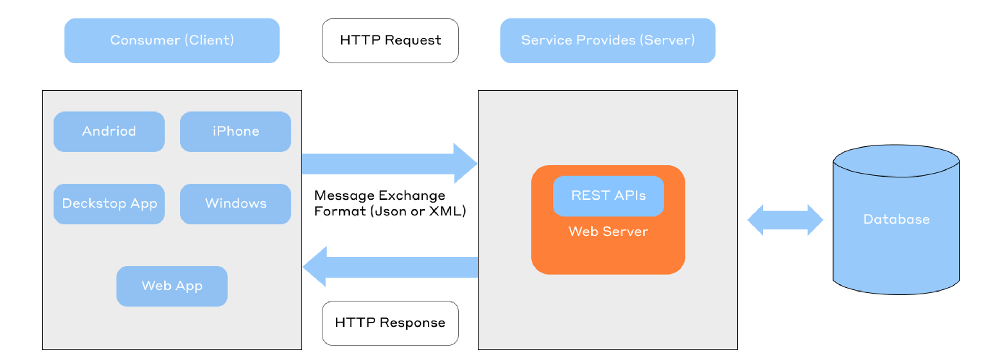

# API testing (AQA)

In this project you'll explore which Java libraries are commonly used for API testing. You'll practice HTTP interaction tools such as OKHTTP, Retrofit, and REST-Assured. You'll learn how to work with both data classes and records, and discover how to serialize DTOs using Jackson and Gson.

💡 [Press here](https://new.oprosso.net/p/4cb31ec3f47a4596bc758ea1861fb624) **to leave feedback on this project.** It's anonymous and will help our «School 21» team improve the learning experience. We recommend completing the survey immediately after finishing the project.

## Contents

- [Chapter 1](#chapter-1)
- [1.1. General instructions](#11-general-instructions)
- [Chapter 2](#chapter-2)
  - [2.1. Introduction](#21-introduction)
- [Chapter 3](#chapter-3)
  - [3.1. What is API](#31-what-is-api)
  - [3.2. OkHttp](#32-okhttp)
    - [Client and Request Setup](#client-and-request-setup)
    - [Sending Requests](#sending-requests)
    - [Reading Responses](#reading-responses)
  - [3.3. REST](#33-rest)
  - [3.4. REST-Assured](#34-rest-assured)
  - [3.5. Retrofit](#35-retrofit)
- [Chapter 4](#chapter-4)
  - [4.1. Framework Setup](#41-framework-setup)
  - [Task 1. Working with OKHTTP](#task-1-working-with-okhttp)
  - [Task 2. REST-Assured with Java Records](#task-2-rest-assured-with-java-records)
  - [Task 3. Retrofit with Gson](#task-3-retrofit-with-gson)

## Chapter 1

## 1.1. General instructions

How to learn at “School 21”:

- Here, you’ll find a unique learning experience with a lot of freedom. You’re given a task and left to find your own way to solve it, using whatever resources work best for you — whether that’s the Internet or AI tools like GigaChat. Just be mindful of information quality: verify, think critically, analyze, and compare.
- Peer-to-peer (P2P) learning is the exchange of knowledge and experience with peers, where everyone acts as both mentor and student. This approach allows you to gain a deeper understanding of the material by learning from one another.
- Feel free to ask for help: around you are peers who are also navigating this path for the first time. Share your own experience and ideas with others. Join Rocket.Chat to stay updated with the latest community announcements.
- Your learning is meaningless if you just copy someone else’s solutions. When receiving help from others, always make sure you fully understand the “why”, “how”, and “purpose” behind the solution. Don’t be afraid to make mistakes.
- Does the task seem impossible? Take a break, get some fresh air and clear your mind — this has helped many people. Maybe after that, the solution will come to you naturally.
- The learning process is just as important as the result. It’s not just about completing the task — it’s about understanding HOW to solve it.

How to work with the project:

- Before starting, clone the project from GitLab into a repository with the same name.
- All files should be created inside the *src/* folder of the cloned repository.
- After cloning the project, create a *develop* branch and do all your development there. Then, push the *develop* branch to GitLab.
- Your directory should not contain any files other than those specified in the assignments.

## Chapter 2

### 2.1. Introduction

As an automation test engineer, your responsibilities will vary depending on the project. One thing will always stay the same, though: you’ll have to write API tests.

In this project, you will master the most commonly used Java libraries for API testing.

You will start with a basic HTTP client, then work with Gherkin syntax in Rest-Assured, and finally explore Retrofit, a tool for enterprise-scale API testing.

In short, this project will cover everything you need to know to feel confident in the world of API testing. Let's go!

## Chapter 3

### 3.1. What is API?

The term "API" appears in job postings, even those for junior testers. REST API, SOAP API, etc. So, what are these? Let's break it down!

"But why do I need to know about it? I only test web apps! Maybe if I move into automation, but I’ve heard it’s mostly used in enterprise testing..."

Not exactly. Understanding APIs is useful for any tester. An API defines system interactions, which you encounter daily, even on the simplest websites.

An API is a software interface that defines how programs interact with other programs, unlike a UI, which facilitates interaction between a program and an end user. Typically, an API is part of an Internet protocol (e.g., SCI), a software framework, or an operating system (OS) function call standard. APIs are often implemented as separate libraries or OS services. Developers use APIs when building all kinds of applications.

APIs simplify programming by abstracting implementations and exposing only the necessary objects and actions. For instance, a UI for an email client might provide a "New Messages" button to highlight new emails. Similarly, a file I/O API might provide developers with a function to copy a file from one location to another without requiring them to understand the underlying file system operations.

In short, an API enables interaction between software components. It allows one computer program (such as a bot or website) to use the functionality of another program.

As an AQA engineer, you'll always be testing APIs in one form or another.

Next, let's explore the most in-demand tools on the market that will help you master this process.

### 3.2. OkHttp

OkHttp is a universal tool for testing network interactions in applications.

It is an open-source library that serves as an HTTP client for Java and Kotlin. It simplifies sending HTTP requests and validating server responses with its intuitive API. OkHttp supports modern protocols (HTTP/1.1 and HTTP/2) and all core HTTP methods (GET, POST, PUT, and DELETE).

OkHttp efficiently handles concurrent requests and offers additional features, including request/response caching, connection pooling, and authentication.

#### Client and Request Setup

The OkHttpClient class sends HTTP requests and handles responses.

`OkHttpClient.Builder` is a class used to configure a client, set up caching and authentication, add interceptors, configure timeouts, and more. Once configuration is complete, call the `build()` method, which returns an instance of the `OkHttpClient` class.

For more efficient use of OkHttp, create a single instance of `OkHttpClient` and reuse it for all requests. Each client has its own connection and thread pool. Reusing them reduces latency and saves memory resources. Creating a new client for each request wastes resources because the connection and thread pools remain underutilized.

#### Sending Requests

The `newCall` method in the `OkHttpClient` class is used to prepare a request for future execution. It takes a `Request` object and returns a `Call` object.

The `Call` class represents an executable request. This request can be canceled and cannot be executed more than once because each instance of the class represents a single request/response pair.

There are two ways to execute the request:

- `execute()` — synchronous It blocks the thread until the response or error is received.
- `enqueue()` — asynchronous. It schedules the request, and the dispatcher determines when to execute it. Once the request is complete, the client receives the response or error information.

#### Reading Responses

The HTTP response is represented by the Response class. The response body can be read once, after which it becomes unavailable. All other response properties are immutable.

To check if the request to the server was successful, use the `isSuccessful()` method. This method checks the status code of the HTTP response.

If the code falls within the range of 200–300, the request is considered successful and returns true.

Any code outside this range indicates a failed request (the method returns false).

### 3.3. REST

What is REST?

REST (Representational State Transfer) is a set of principles and guidelines that define how components of distributed systems should exchange data.

In other words, it is a "framework" of architectural rules that helps to create applications that are scalable and adaptable to new requirements.

REST-compliant functionality is called RESTful.



REST-architecture. Source: [*https://habr.com/ru/companies/alfa/articles/745854/*](https://habr.com/ru/companies/alfa/articles/745854/)

### 3.4. REST-Assured

REST-Assured is a tool for API testing that integrates with Java tests. Here's its basic usage:

```
given()
    .when()
    .get(someEndpoint)
    .then()
    .statusCode(200)
    .body();
```

Keywords of the request scenario:

- given — sets request parameters (headers, body, authentication).
- when — specifies the HTTP method and endpoint to call.
- then — defines response assertions (status code, data structure, headers).

You can also parse the response body into `JsonPath` or `XmlPath` objects for further data analysis.

In real-world scenarios, tests are more complex and include headers, authentication, request bodies, and other parameters.

**PRO-tip**: If the API lacks unique resources with special requirements, you can simplify your code by introducing helpers or utility classes, such as templates for repetitive requests or dedicated methods for response validation.

### 3.5. Retrofit

Retrofit is a Java/Android REST client that simplifies the exchange of structured data (JSON/XML).

Its flexibility is Retrofit's key feature: you can choose a converter for data serialization. Gson is used by default for JSON, but you can integrate custom solutions for XML or other formats.

Retrofit uses the OkHttp library to execute HTTP requests.

To write automated tests with Retrofit, you need at least three classes:

- A service class — defines methods for interacting with the API (endpoints and request parameters).
- A base client class — configures Retrofit (URL, converters, timeouts).
- A test class — implements API test scenarios (calling methods and validating responses).

Although the architecture of applications using Retrofit can vary, the technical foundation remains the same.

In the current project, you will focus on a minimal yet functional implementation, which will provide a solid foundation for understanding the principles of the API testing framework.

## Chapter 4

### 4.1. Framework Setup

General project implementation guidelines:

- Use Java 21 for all code.
- Non-test components (helpers, functional methods etc.) go in src folder.
- Use SOLID, DRY, and KISS architectural principles. Design objects to minimize future modifications and error risks.
- All tests must have descriptive names and include clear documentation via appropriate annotations.
- You’re free to use either JUnit or TestNG as your test runner-whichever you prefer.

At the end you should have a project with examples of using the 3 most popular tools for API testing.

**A key skill for an AQA specialist: working with AI tools**

Another goal of the project is to help you effectively use modern AI tools to enhance your work.

**A critically important rule:**

1. First, complete the tasks manually—this is a mandatory requirement. Experienced specialists delegate tasks to AI only after they already know the solution themselves; AI is brought in to help optimize or generate similar work. Mark the results obtained manually, for example, as manual-solution.
2. After completing the task independently, implement it using AI—mark these results as ai-assisted-solution.
3. Compare the results—analyze what the AI did better and where it made mistakes.

**Security, Ethics, Critical Thinking:**

1. Never upload code containing real data, passwords, or commercial information to public AI models. In this training project, there is no such data, but the habit must be formed.
2. Check all generated code snippets for vulnerabilities and compliance with company standards.
3. In real-world work, AI makes mistakes constantly—it may generate code that looks good but doesn’t actually work. Verify all output results and correct them as needed.

### Task 1. Working with OKHTTP

In this task, you will learn how to work with data classes, their serialization, and APIs using OKHTTP, the simplest and most "lightweight" tool of all the options mentioned above. Its minimalist design means less code to write and an easy-to-understand syntax.

1. The API you will test in all tasks of this project is Review <https://reqres.in/>. On the same page, you’ll find a list of supported methods and example responses.
2. Import the OKHTTP and Jackson dependencies.
3. Write one positive and one negative test for each HTTP method (GET, PUT, POST, and DELETE). Use OKHTTP for requests and Jackson-serialized data classes as DTOs.
4. Use two serialization methods:
   1. Full JSON object as a string.
   2. Field-by-field JSON construction: `book.title = "Обитаемый остров";`.

**Recommendations for completing the task:**

- Use Gradle for dependencies.
- Use Lombok for data classes.
- Use Jackson for serialization.
- Create a TestBase class with an OKHTTP client initialization in the @Before method.
- Create a universal response validation method in the base class.
- Store DTOs in the main.
- Use @DisplayName annotations that contain clear test descriptions.
- Keep the tests and base class in a separate package.

**Generating data classes with AI (after manual implementation)**

After you have manually created data classes for API responses, perform an experiment.

1. Take a JSON response from the reqres.in API.
2. Use an AI tool (YandexGPT, GigaChat, or the Codeium plugin in IDEA) to generate a Java class based on this JSON. The prompt can be as follows (improve it if necessary): *"Generate a Java class with Lombok @Data annotations based on this JSON: [paste JSON]."*
3. Compare the generated class with the one you wrote manually.
4. Prepare answers for the P2P-review:

- Did the data types chosen by AI match yours?
- Were there any errors in the generated code (for example, incorrect annotations)?
- How much time did manual class generation take, and how much did AI generation with subsequent review take?

1. Save all results with the manual-solution and ai-assisted-solution labels.

### Task 2. REST-Assured with Java Records

In this task, you will become familiar with the capabilities of modern Java language versions for working with data, using records as an example (available since Java 16; in the project, use Java 17 LTS), and learn to work with REST-Assured—one of the most popular tools for writing automated tests.

1. Import REST-Assured dependencies.
2. Reimplement the tests from Task 1 in a new package. Modify the scenarios for 2–3 tests by changing the input values or adjusting the checked parameter in a negative test. Use REST-Assured instead of OKHTTP and Java 17 record classes instead of data classes.

**Recommendations for completing the task:**

- Use Gradle for dependencies.
- Use the `.as()` method for record deserialization.
- Reuse the base validation method.
- Store DTOs in the main.
- Use @DisplayName annotations that contain clear test descriptions.
- Keep the tests and base class in a separate package.

**Transforming data classes into records with AI (after manual implementation)**

1. You need to reuse the DTO from Task 1, as a Java 17 record.
2. Ask AI to help with this transformation. For example: "Transform this Java class with @Data into a Java record: [paste class code]."
3. Analyze the results:

| Category | Actions |
| --- | --- |
| **Serialization Annotations** | - Run the test with the AI-generated record. - If the test fails, analyze the error message. What does it indicate? - Study the Jackson documentation for working with records (start with the official FasterXML website). - What annotations are needed to correctly map the JSON field `first_name` to the field `firstName`? - Add the necessary annotations and verify that the test passes. |
| **Library Compatibility** | - Find information about which version of Jackson added support for records. - Does the Jackson version in your project meet the requirements? If not, update the dependency. |
| **Lombok Annotations** | - Check whether AI left any Lombok annotations in the record. - Investigate whether Lombok works with records (search the Lombok documentation). - Remove any unnecessary annotations if present. |
| **Data Types** | - Verify the field types in the generated record against the actual API responses (look at examples on [reqres.in](http://reqres.in)). - If AI made mistakes with types (for example, used string for id), correct them. - Consider why AI might have made this mistake. What in the JSON response could have confused it? |

1. Prepare answers for the P2P review:

- Did AI successfully transform the class into a record?
- What syntax changes did you have to make manually?
- Did AI help handle all fields, or did you have to add some yourself?

1. Save all results with the manual-solution and ai-assisted-solution labels.

### Task 3. Retrofit with Gson

Now, you will explore the capabilities of an alternative DTO serializer and gain hands-on experience with Retrofit, a powerful yet complex tool offering maximum project scalability potential.

1. Import all Retrofit and Gson dependencies into the same project.
2. Reimplement the test suite from Task 1 in a new package. Modify the scenarios in 2–3 tests by changing the input values or adjusting the negative test parameters. Use Retrofit instead of OKHTTP and Gson for data class serialization.

**Recommendations for completing the task:**

- Use Gradle for dependency management and project building.
- Reuse the data classes from Task 1 (mandatory).
- For Gson serialization, create the necessary helper classes and research the components required for proper Gson operation.
- Implement a service interface that describes all API methods and endpoints.
- Create a base class to configure the Retrofit client settings, (base URL, converters, etc.).
- Initialize the Retrofit client in the @Before method of the test class.
- Use @DisplayName annotations with clear test descriptions.
- Keep all tests and base classes in a separate, dedicated package.

*Research Question Before Starting: What Gson settings might be required for proper serialization/deserialization in your project? Try to find information about GsonConverterFactory and GsonBuilder. Do any settings need to be configured for fields with null values?*

**Generating a retrofit interface (after manual implementation)**

1. To work with Retrofit, you need an interface describing the API endpoints.
2. Use AI to generate a draft of this interface. Formulate a prompt that solves the task to generate a Retrofit interface for the reqres.in endpoints. The prompt should specify the concrete paths: GET /users/{id}, POST /users, PUT /users/{id}, DELETE /users/{id}. Name the DTO as User. Save the prompt.
3. Analyze the generated code, verify that AI did not forget:

- The @Path("id") annotation for methods with the id parameter
- The return type Call (not just User)
- The correct HTTP methods for each endpoint

1. Prepare answers for the P2P review: what needed to be fixed in the generated interface to make it work.
2. Save all results with the manual-solution and ai-assisted-solution labels.

💡 [Press here](https://new.oprosso.net/p/4cb31ec3f47a4596bc758ea1861fb624) **to leave feedback on this project.** It's anonymous and will help our «School 21» team improve the learning experience. We recommend completing the survey immediately after finishing the project.