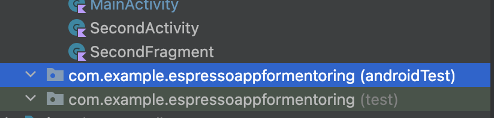

# Mobile testing (AQA)

В этом проекте ты научишься писать автотесты для Android-приложений с помощью Espresso. Ты освоишь взаимодействие с UI-элементами, создание стабильных тестов, настройку параметров запуска и работу с эмуляторами через встроенный инструментарий фреймворка.

💡 [Нажми сюда](https://new.oprosso.net/p/4cb31ec3f47a4596bc758ea1861fb624), **чтобы оставить отзыв на этот проект**. Это анонимно и поможет нашей команде «Школы 21» сделать обучение по этому проекту лучше. Рекомендуем заполнить опрос сразу после выполнения проекта.

## Contents

- [Глава 1](#%D0%B3%D0%BB%D0%B0%D0%B2%D0%B0-1) \
  [1.1. Общая инструкция](#11-%D0%BE%D0%B1%D1%89%D0%B0%D1%8F-%D0%B8%D0%BD%D1%81%D1%82%D1%80%D1%83%D0%BA%D1%86%D0%B8%D1%8F)
- [Глава 2](#%D0%B3%D0%BB%D0%B0%D0%B2%D0%B0-2) \
  [2.1. Введение](#21-%D0%B2%D0%B2%D0%B5%D0%B4%D0%B5%D0%BD%D0%B8%D0%B5)
- [Глава 3](#%D0%B3%D0%BB%D0%B0%D0%B2%D0%B0-3) \
  [3.1. Про мобильное тестирование](#31-%D0%BF%D1%80%D0%BE-%D0%BC%D0%BE%D0%B1%D0%B8%D0%BB%D1%8C%D0%BD%D0%BE%D0%B5-%D1%82%D0%B5%D1%81%D1%82%D0%B8%D1%80%D0%BE%D0%B2%D0%B0%D0%BD%D0%B8%D0%B5) \
  [3.2. Appium](#32-appium) \
  [3.3. Appium Inspector](#33-appium-inspector) \
  [3.4. Espresso](#34-espresso)
- [Глава 4](#%D0%B3%D0%BB%D0%B0%D0%B2%D0%B0-4) \
  [4.1. Начало работы с фреймворком](#41-%D0%BD%D0%B0%D1%87%D0%B0%D0%BB%D0%BE-%D1%80%D0%B0%D0%B1%D0%BE%D1%82%D1%8B-%D1%81-%D1%84%D1%80%D0%B5%D0%B9%D0%BC%D0%B2%D0%BE%D1%80%D0%BA%D0%BE%D0%BC) \
  [Задание 1. Работа с Espresso](#%D0%B7%D0%B0%D0%B4%D0%B0%D0%BD%D0%B8%D0%B5-1-%D1%80%D0%B0%D0%B1%D0%BE%D1%82%D0%B0-%D1%81-espresso)

## Глава 1

### 1.1. Общая инструкция

Как учиться в «Школе 21»:

- Здесь тебя ждет уникальный образовательный опыт с большим количеством свободы. Ты получаешь задачу и самостоятельно ищешь пути решения, используя любые удобные способы поиска информации — ресурсы Интернета или нейросети (например, GigaChat). Но внимательно относись к качеству информации: проверяй, думай, анализируй, сравнивай.
- Взаимообучение (Peer-to-Peer, P2P) — это обмен знаниями и опытом с другими пирами, где каждый выступает и учителем, и учеником. Такой подход позволяет глубже понять материал, учась друг у друга.
- Чувствуй себя свободно и проси о помощи — вокруг тебя те, кто тоже впервые проходят этот путь. Делись своим опытом и идеями с другими. Присоединяйся к Rocket.Chat, чтобы быть в курсе всех новостей от нашего сообщества.
- Твое обучение не будет иметь никакого смысла, если ты будешь копировать чужие решения. Если пользуешься помощью других — всегда разбирайся до конца, почему, как и зачем. Не бойся ошибиться.
- Кажется, что задача невыполнима? Сделай перерыв, проветрись, перезагрузи голову — это помогало многим. Возможно, после этого решение придет само собой.
- Важен не только результат обучения, но и сам процесс. Нужно не просто решить задачу, а понять, КАК ее решить.

Как работать с проектом:

- Перед выполнением проект необходимо склонировать с GitLab в одноименный репозиторий.
- Все файлы необходимо создавать в папке *src/* склонированного репозитория.
- После клонирования проекта необходимо создать ветку *develop* и вести разработку в ней. После этого пушить в GitLab также нужно ветку *develop*.
- В твоей директории не должно быть иных файлов, кроме тех, что обозначены в заданиях.

## Глава 2

### 2.1. Введение

За время предыдущих проектов у тебя точно прибавилось навыков тестирования: JUnit, TestNG, REST-Assured, okHttp, Retrofit, Selenide и Cucumber, использование record и data-классов для парсинга данных и Allure для отчетов.

В завершающем проекте по мобильному тестированию ты дополнишь свой «багаж» AQA-инженера на Java еще несколькими инструментам, востребованными сегодня на рынке и встречающимися в запросах рекрутеров.

Тестирование мобильных приложений — логичный шаг после освоения базовых навыков автоматизации (вроде API-тестов).

Разнообразные устройства, версии ОС, жесты, специфические сценарии взаимодействия — все это уникальные вызовы, с которыми ты будешь часто встречаться при тестировании мобильных приложений.

В рамках этого проекта мы сфокусируемся на двух самых распространенных в энтерпрайз-разработке инструментах:

- Appium — стандарт для кроссплатформенной автоматизации (iOS, Android);
- Espresso — инструмент для написания мобильных автотестов рядом с кодом (Android).

Ты освоишь написание автотестов для Android-приложения с помощью Espresso. Этот проект самый комплексный и трудоемкий среди всех предыдущих, т. к. он объединяет разные компоненты. Приготовься активно использовать знания из предыдущих проектов.

Поехали!

## Глава 3

### 3.1. Про мобильное тестирование

*Как ты думаешь, чем автотесты для мобилок отличаются от веб-автоматизации?*

Остановись немного и подумай над этим — что сразу приходит в качестве ответа?

Мы, конечно, вернемся к этому вопросу, а пока…

В проекте QA08\_Mobile testing (программа «Ручное тестирование») мы уже говорили о тонкостях мобильного тестирования и о том, что мобильные приложения — это не просто «маленькие версии» веб-сайтов.

Мобильные приложения живут в уникальной экосистеме:

- Разнообразие устройств — экраны, разрешения, версии iOS/Android;
- Специфика взаимодействия — жесты (свайпы, тапы, зум), ориентация экрана, прерывания (звонки, уведомления);
- Типы приложений — нативные (собранные под конкретную ОС), гибридные (веб-вью внутри), PWA.

А вот про **различия в тестировании мобильных и веб-приложений**:

| **Инструменты** | **Эмуляция vs. реальные устройства** | **Сложности стабильности** |
| --- | --- | --- |
| Для iOS и Android часто нужны разные подходы (например, XCUITest vs. Espresso), но такие инструменты, как, например, Appium решают эту проблему через единый API. | Тесты могут вести себя по-разному на симуляторах и «железе». | Факторы вроде загрузки процессора, памяти, фоновых процессов влияют на воспроизводимость. |

### 3.2. Appium

Appium — это open-source фреймворк для автоматизации мобильных приложений.

Работает по принципу «Write once, run anywhere» (хотя, нюансы платформ всё же есть).

**Поддерживает:**

- iOS (нативные, гибридные, мобильные веб-приложения);
- Android (нативные, гибридные, веб);
- Windows (для десктопных приложений, но это реже используется).

**Что под капотом?**

**Клиент-серверная архитектура:**

- Твой код (на Java/Python/etc.) отправляет команды на Appium Server через JSON Wire Protocol.
- Сервер преобразует их в «родные» команды для iOS (XCUITest) или Android (UiAutomator2/Espresso).

**Ключевые компоненты:**

- Appium Server — «переводчик» между твоим кодом и мобильной ОС.
- Драйверы (XCUITest, UiAutomator2) — отвечают за взаимодействие с элементами интерфейса.
- Сессии — каждая сессия = одно тестируемое приложение + устройство.

**Почему AQA-инженеры выбирают Appium?**

- Кроссплатформенность: один код для iOS и Android (если приложение имеет одинаковый функционал).
- Реальные устройства и эмуляторы: тестируй на симуляторе iPhone и «железном» Samsung одновременно.
- Языковая гибкость: пиши на Java, Python, JavaScript, C# и других языках.
- Интеграция с CI/CD: легко встраивается в Jenkins, GitLab CI и аналоги

**Типовые сценарии тестирования с Appium:**

| Тестирование нативных приложений | Гибридные приложения | Сквозные сценарии |
| --- | --- | --- |
| - Проверка авторизации;  - Работа с геолокацией, камерой, уведомлениями;  - Тесты на жесты (свайп, долгое нажатие). | - Переключение между нативным контекстом и WebView;  - Тестирование встроенных веб-страниц. | - Взаимодействие с другими приложениями (например, переход из мессенджера в браузер). |

Пример команды для поиска элемента:

```
// Android 

MobileElement button = driver.findElement(By.id("com.app:id/login_button"));
```

```
// iOS 

MobileElement input = driver.findElement(By.iOSClassChain("\*\*/XCUIElementTypeTextField[1]"));
```

**Какой можно сделать вывод:**

Appium — это мощный и универсальный инструмент для автоматизации тестирования мобильных приложений, однако у него есть один значительный недостаток.

Он считается самым нестабильным из всех инструментов для UI-тестирования, что делает его сложным в поддержке. Настройка среды для работы с Appium может занять значительное время, исчисляемое зачастую не в часах, а в рабочих днях.

А для эффективной автоматизации тестирования критичны высокая стабильность и скорость работы.

Из-за этих проблем многие компании, такие как Т-Банк, Avito и др., предпочитают использовать более простые в освоении и поддержке инструменты, такие как Espresso/Kaspresso для Android и других специализированные инструменты для iOS.

На сегодняшний день Espresso (иногда заменяют на Kaspresso, но это тот же самый инструмент, только совместимый с другим языком программирования) предоставляет самый актуальный в освоении инструментарий, о котором более подробно мы поговорим в главе 3.4.

В рамках этого проекта ты попробуешь написать автотесты именно на Espresso, чтобы разобраться в базовых принципах автоматизации мобильного тестирования и закрепить практические навыки.

### 3.3. Appium Inspector

Appium Inspector — утилита для изучения структуры мобильного приложения и поиска локаторов элементов (кнопок, полей ввода и др.).

**Основные функции:**

- просмотр иерархии UI-элементов;
- получение свойств элементов (ID, класс, координаты);
- генерация кода для действий (клики, ввод текста).

**Запуск:**

1. Запусти Appium Server.
2. Открой Appium Inspector (в составе Appium Desktop).
3. Укажи параметры сессии (capabilities): платформа, версия ОС, путь к приложению.
4. Подключись к устройству/эмулятору.

**Пример capabilities для Android:**

```
{
  "platformName": "Android",
      "appium:deviceName": "Pixel 6",
      "appium:app": "/path/to/app.apk",
      "appium:automationName": "UiAutomator2"
}
```

| **Возможности Appium Inspector** | **Ограничения Appium Inspector** |
| --- | --- |
| - Визуальное выделение элементов на скриншоте;  - Поддержка локаторов: ID, XPath, className;  - Генерация шаблонного кода на Java/Python. | - Для iOS требуется настройка Xcode и подписанное приложение;  - Сложности с гибридными приложениями (WebView);  - Иногда нестабилен при работе с динамическими элементами. |

***Рекомендация: всегда проверяй локаторы через Inspector перед использованием в тестах — это снизит количество ложных падений.***

### 3.4. Espresso

Espresso — фреймворк от Google для написания UI-тестов, тесно интегрированный с экосистемой Android.

Espresso оптимален, если:

- тебе нужно протестировать нативное приложение;
- тебе нужна быстрая и стабильная проверка;
- ты работаешь в среде Android Studio.

**Ключевые особенности:**

1. **Синхронизация с UI-потоком:**

Espresso автоматически ожидает завершения анимаций и обновления интерфейса, что снижает количество ложных падений тестов.

1. **Простой синтаксис:**

Четкая цепочка методов:

```
onView(withId(R.id.login_button))
    .perform(click())
    .check(matches(isDisplayed()));
```

1. **Idling Resources:**

Механизм для работы с асинхронными операциями (например, загрузка данных из сети).

**Основные компоненты фреймворка:**

```
ViewMatchers: Поиск элементов по ID, тексту, классу и другим атрибутам.

withId(R.id.element_id), withText("Submit")
```

```
ViewActions: Действия (клик, ввод текста, свайп).

click(), typeText("user@test.com"), swipeLeft()
```

```
ViewAssertions: Проверки состояния элементов.

matches(isDisplayed()), doesNotExist()
```

**Почему AQA-инженеры выбирают Espresso?**

- Скорость: тесты выполняются быстрее, чем через Appium/UiAutomator;
- Стабильность: улучшение надежности тестов flaky-тестов за счет синхронизации;
- Глубокая интеграция: доступ к контексту приложения и ресурсам.

## Глава 4

### 4.1. Начало работы с фреймворком

Общие рекомендации к выполнению заданий проекта:

- Код необходимо писать на языке Java версии 21.
- Все, что не связано с тестами (хелперы, функциональные методы, структурные классы и т. д.) должно находиться в папке src/main.
- При разработке приложения требуется использовать такие архитектурные принципы, как **SOLID**, **DRY** и **KISS**. Старайся выделять объекты таким образом, чтобы как меньше требовалось их переписывать или затрагивать каким-либо иным образом, чтобы не увеличивать вероятность внести ошибку в уже используемую часть кода.
- Все тесты должны иметь говорящее описание над ними, содержащееся в соответствующей аннотации.
- Все асершены должны иметь читабельное пояснение ошибки.
- В качестве тест-раннера можно применять на твое усмотрение JUnit или TestNG.

В рамках этого задания ты разберешься с работой Espresso — стандартным инструментом Android для автоматизации тестирования мобильного UI — и научишься взаимодействовать с элементами мобильного приложения и самим виртуальным устройством.

По итогу выполнения задания у тебя будут пример фреймворка для тестирования мобильных приложений с точки зрения белого ящика.

### Задание 1. Работа с Espresso

Представь, что компания, в которой ты проходишь стажировку, разрабатывает мобильное приложение и подготовила первый рабочий прототип. Твоя команда готовится к релизу новой версии, и тебе поручили протестировать основные функции приложения перед выпуском.

Твоя задача — создать набор автотестов на Espresso для проверки, что все операции работают корректно, интерфейс отзывчив, а ошибки обрабатываются правильно.

Прежде чем приступить к заданию, необходимо выполнить 2 шага:

- Установи Android Studio и создай в ней эмулятор — его мы и будем использовать для наших задач.
- Установи Appium Inspector и посмотри селекторы приложения на эмуляторе.

**Шаги выполнения задания:**

1. Загрузи мобильное приложение, которое тебе предстоит тестировать, и открой его в Android Studio. Мобильное приложение лежит в папке Materials.
2. Реализуй следующие тесты в следующих классах:
   1. ExampleInstrumentedTest — открыть активность с полем для ввода текста, ввести что-либо, проверить, что текст появился, изменить ориентацию экрана, проверить, что текст исчез, вернуть эмулятор в исходное состояние.
   2. IntentTest — проверить, что мы в первой активности, открыть вторую активность, проверить, что мы в ней и текст на экране соответствует необходимому.
   3. TransitionTest — проверить переходы между всеми экранами приложения (часть переходов будет осуществляться использованием системной кнопки «назад»).
   4. ToastTest — проверить текст, всплывающий при нажатии кнопки с письмом в правом нижнем углу экрана.
   5. ToolbarTest — проверить, что при нажатии на три точки в правом верхнем углу экрана появляется выпадающее меню с опцией «Settings», а при нажатии в другую часть экрана оно исчезает.

**Рекомендации по выполнению задания:**

- Используй gradle в проекте для сборки и импорта зависимостей.
- Ознакомься с документацией на официальном ресурсе <https://developer.android.com/training/testing/espresso> — она может быть очень полезной при выполнении заданий.
- Бегло ознакомься с кодом самого приложения, чтобы знать, какие ID кнопок тебе необходимо будет использовать.
- В проекте для удобства использован junit4 — обращай внимание на то, что тебе нужно использовать синтаксис именно для этой его версии.
- В проекте используется 11-я версия Java — тебя ее может попросить установить IDE. Тесты на Espresso должны находиться в этом пакете:



---

💡 [Нажми сюда](https://new.oprosso.net/p/4cb31ec3f47a4596bc758ea1861fb624), **чтобы оставить отзыв на этот проект**. Это анонимно и поможет нашей команде «Школы 21» сделать обучение по этому проекту лучше. Рекомендуем заполнить опрос сразу после выполнения проекта.