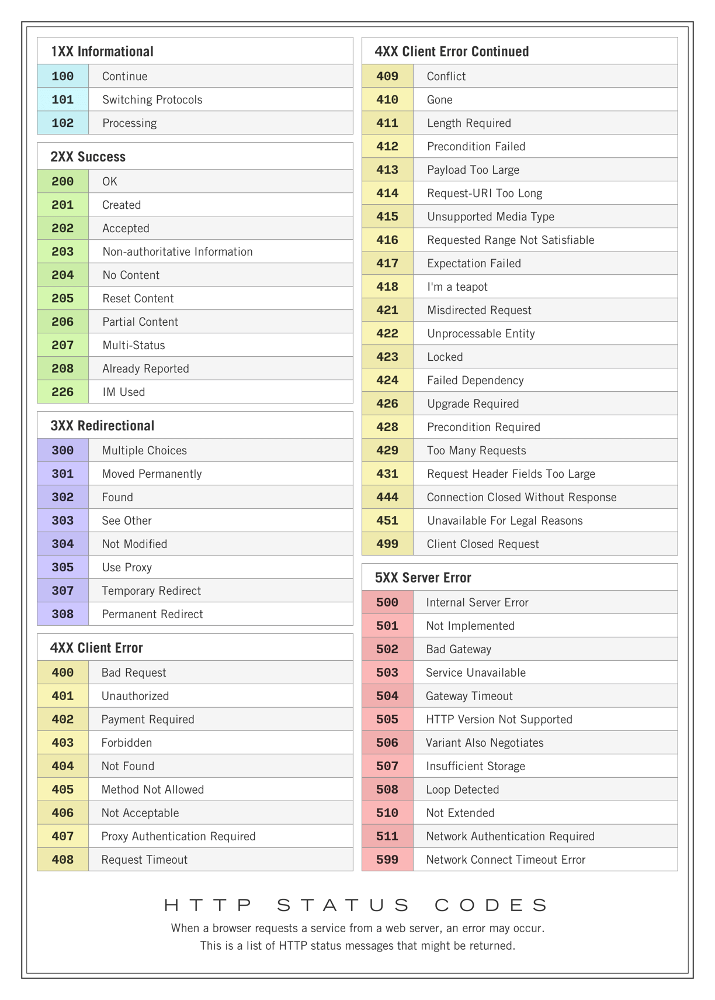
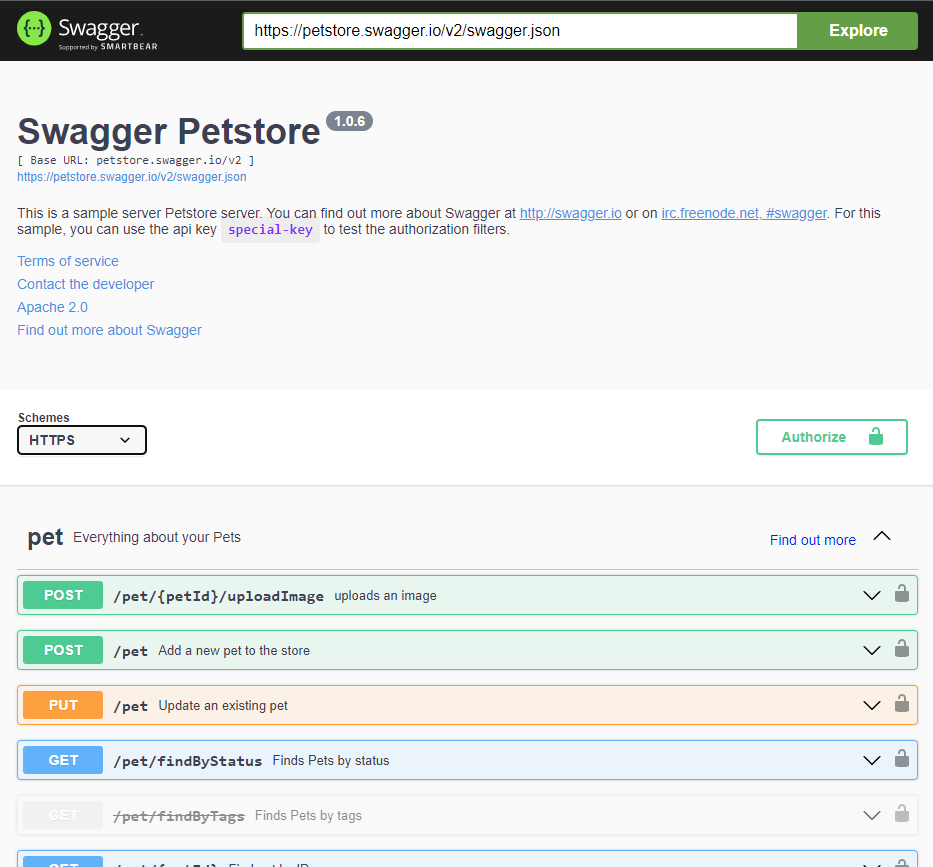

# REST API

💡 [Нажми сюда](https://new.oprosso.net/p/4cb31ec3f47a4596bc758ea1861fb624), **чтобы поделиться с нами обратной связью на этот проект**. Это анонимно и поможет нашей команде сделать обучение лучше. Рекомендуем заполнить опрос сразу после выполнения проекта.

## Contents

[[*TOC*]]

## Chapter I

### Introduction

Привет! В этом блоке мы посмотрим на то, что такое RESTful API и как оно разрабатывается на самых популярных языках. В конце тебя ждет практическое задание по проектированию API для собственного магазина!

## Chapter II

### REST API

Начнем с простого: расшифруем аббревиатуру. **RE**presentational **S**tate **T**ransfer (REST) — это передача состояния представления. Технология позволяет получать и модифицировать данные и состояния удаленных приложений, передавая HTTP-запросы через интернет или любую другую сеть.

Если проще, то REST API — это когда серверное приложение дает доступ к своим данным клиентскому приложению по определенному URL.

REST API позволяет использовать для общения между программами протокол HTTP (зашифрованная версия — HTTPS), с помощью которого мы получаем и отправляем большую часть информации в интернете.

Вбивая в адресную строку URL-адрес <http://website.com/something>, мы на самом деле идем на сервер website.com и запрашиваем ресурс под названием /something. «Пойди вот туда, принеси мне вот то» — это и есть HTTP-запрос. Теперь представим, что по адресу website.com работает программа, к которой хочет обратиться другая программа. Чтобы программа понимала, какие именно функции нужны, используют различные адреса.

Основа работы REST API — методы [HTTP](https://www.rfc-editor.org/rfc/rfc2616).
Классические методы HTTP:

- GET — клиенты используют GET для доступа к ресурсам, расположенным на сервере по указанному адресу;
- POST — используется для отправки данных на сервер;
- PUT — для создания или обновления существующего ресурса целиком;
- PATCH — для обновления части существующего ресурса;
- DELETE — для удаления ресурса.

Итак, имеется 5 функций, с помощью которых некоторая программа может получить данные ресурса. На деле существуют также функции HEAD, OPTIONS и т. д.

REST API — самое популярное решение для организации взаимодействия между различными программами. Оно применяется для связи мобильных приложений с серверными, для построения микросервисных приложений или предоставления доступа к программам сторонних разработчиков.

Важно заметить, что каждый REST API запрос сообщает о результатах работы числовыми кодами (так называемыми HTTP-статусами). Помнишь, как в учебных программах приходилось возвращать какой-либо код (например, 0 — успех, 1 — ошибка и т. д.)? Здесь идея аналогичная.



С помощью REST API можно обмениваться не только текстовой информацией, но и передавать данные в специальных форматах: XML, JSON и т. д.

Да, существуют и другие архитектуры API-систем (JSON-RPC, XML-RPC, GraphQL). Однако REST до сих пор остается самым востребованным инструментом для построения взаимодействия между удаленными приложениями.

#### Как работает REST?

Базовый принцип работы RESTful API совпадает с принципом работы в Интернете. Клиент связывается с сервером с помощью API, когда ему требуется какой-либо ресурс. Разработчики описывают принцип использования REST API клиентом в документации на API серверного приложения. Ниже представлены основные этапы запроса REST API:

- Клиент отправляет запрос на сервер. Руководствуясь документацией API, клиент форматирует запрос таким образом, чтобы его понимал сервер.
- Сервер аутентифицирует клиента и подтверждает, что клиент имеет право сделать этот запрос.
- Сервер получает запрос и внутренне обрабатывает его.
- Сервер возвращает ответ клиенту. Ответ содержит информацию, которая сообщает клиенту, был ли запрос успешным. Также запрос включает сведения, запрошенные клиентом.
- Сведения о запросе и ответе REST API могут немного различаться в зависимости от того, как разработчики проектируют API.

### RESTful система — это как?

Чтобы распределенная система считалась RESTful (сконструированной по [REST](https://restfulapi.net/)), необходимо, чтобы она удовлетворяла ряду критериев.

- **Client-Server.** Система должна быть разделена на клиентские и серверные части. Разделение позволит «отвязать» клиентов от конкретного способа работы сервера, поэтому мобильность кода улучшается.
- **Stateless.** Сервер не должен знать ничего о состояниях клиентов. Запросы должны содержать всю достаточную информацию для его обработки.
- **Cache.** Каждый ответ должен быть помечен, является он кешируемым или нет. Таким образом исключается повторное использование клиентами устаревших данных.
- **Uniform interface.** Единый интерфейс определяет интерфейс (набор доступных функций) между клиентами и серверами. Это упрощает архитектуру, позволяет развиваться её частям независимо.
- **Layered system.** Допускается разделять систему на иерархию слоёв, но с условием, что каждый компонент может видеть компоненты только непосредственно следующего слоя.

### Swagger & Open API 3.0

Изначально «Swagger» был оригинальным названием спецификации OpenAPI, но позже спецификация была переименована в «OpenAPI» для того, чтобы подчеркнуть открытую природу этого стандарта.

Спецификация OpenAPI определяет стандарт, представляющий из себя интерфейс (RESTful) HTTP API, который позволяет и людям, и компьютерам распознавать и понимать возможности сервиса без доступа к исходному коду или документации.

Документ спецификации OpenAPI — это Swagger-файл в формате YAML (или json), который создается для описания API.

В целом документ состоит из следующих частей:

- openapi

  В объекте openapi указывается версия спецификации (например, в нашем случае это 3.0.0). Пример:

  ```
  openapi: "3.0.2"
  ```

  Кстати, написать свой документ можно в официальном [онлайн-редакторе.](https://swagger.io/tools/swagger-editor/)
- info

  Данный объект содержит основную информацию об API (например, заголовок, версия, ссылка на лицензию и т. д.) Рассмотрим пример:

  ```
  openapi: "3.0.2"
  info:
    title: "The best API"
    description: "This is the most RESTful API in your life!"
    version: "1.2"
    termsOfService: "link"
    contact:
        name: "The best API contact"
        url: "link"
        email: "mail@mail"
    license:
        name: "Licence name"
        url: "link"
  ```
- servers

  Данный объект позволяет указать базовый путь, используемый в запросах API. Базовый путь — часть URL, которая находится перед конечной точкой. Конечные точки будут рассмотрены в объекте path. Рассмотрим пример servers.

  ```
  servers:
    - url: http://localhost:5000/
      description: main server
  ```
- paths

  Объект path содержит информацию о конечных точках. Каждый элемент в объекте path содержит объект operations (методы GET, POST, PUT, DELETE). Скелет одной конечной точки соединения выглядит следующим образом.

  ```
  paths:
    /weather:
      get:
        tags:
        summary:
        description:
        operationId:
        externalDocs:
        parameters:
        responses:
        deprecated:
        security:
        servers:
        requestBody:
        callbacks:
  ```

  Не все поля являются обязательными. Например, если у запроса отсутствуют параметры тела запроса, то нет необходимости включать объект requestBody.

  Параметры запроса содержат массив параметров со свойственными им объектами.

  ```
  parameters:
  - name: 
    in: 
    description:
    required:
    example:
    allowEmptyValue:
    ...
  - name:
    in:
    description:
    ...
  ```

  Рассмотрим также пример объекта responses.

  ```
  responses:
      200:
        description: Successful response
        content:
          application/json:
            schema:
              title: Sample
              type: object
              properties:
                placeholder:
                  type: string
                  description: Placeholder description

      404:
        description: Not found response
        content:
          text/plain:
            schema:
              title: Not found
              type: string
              example: Not found
  ```
- components

  В данном объекте сохраняются переиспользуемые определения, которые могут появляться в нескольких местах в документе спецификации.
- security

  Объект security указывает протокол безопасности или авторизации, используемый при отправке запросов.

Кроме того, существуют объекты tags и externalDocs.

#### **Swagger UI**

Swagger UI предоставляет фреймворк, который читает спецификацию OpenAPI и создает веб-страницу с интерактивной документацией, в которой можно посылать запросы в реальном времени.

Официальная [спецификация Swagger](https://swagger.io/specification/).

Важно отметить, что существует два подхода к написанию документации. Первый — документация практически автоматически пишется на основе кода. Второй — документация пишется отдельно от кода.

**В задании ты будешь писать комментарии в коде, на основе которых будет генерироваться OpenAPI спецификация, т. е. использовать 1 подход.**



### Реализация HTTP API в современных языках программирования

Посмотреть на примеры, основываясь на которые можно реализовать HTTP API, можно в папке materials.

### Про Postgres

Для реализации проекта тебе понадобится СУБД (система управления базами данных). Мы предлагаем тебе использовать Postgres. Что это?

PostgreSQL — свободная (open source) объектно-реляционная система управления базами данных. Поскольку это проект с открытым кодом, он постоянно улучшается и поддерживает множество расширений. Новые версии СУБД выходят регулярно. Поддерживаются как UNIX-подобные системы, так и Windows.

Скачать PostgreSQL можно с [официального сайта](https://www.postgresql.org/download/). Если ты скачиваешь desktop-версию, тебе также установится PgAdmin — клиент для работы с postgres.

Кроме того, postgres можно запустить в докер-контейнере и, настроив порты, обращаться к нему через localhost.

Как использовать postgres в своих приложениях? Для этого необходимо указать строку подключения к БД (connection string), и, в зависимости от языка, использовать библиотеки для работы с БД:

- Python — peewee, psycopg2;
- C# — EntityFramework;
- Go — pq;
- Java — pgJDBC.

## Chapter III

Так-так, пора делать что-то своими руками.

### ShopAPI

Итак, ты решил открыть свой магазин. Денег на заказ сайта нет, поэтому ты решил написать всё сам. Правильно написанный бэкенд позволит позже сделать веб-сайт, desktop и даже мобильные приложения. И все они будут получать данные из нашей REST API. Не забывай про внешние ключи. Изучи разницу между DAL (Data Access Layer) и DTL (Data Transfer Layer) объектами.

**Тематика магазина**: магазин бытовой техники.

**Обрати внимание!** В БД мы реализуем реляционную модель! Внимательно изучи модели и спроектируй модель БД в соответствии с нормальными формами. О нормальных формах тебе предстоит узнать самостоятельно!

Имеются следующие сущности:

```
// Клиент
client
{
    id
    client_name
    client_surname
    birthday
    gender
    registration_date
    address_id
}
```

```
// Товар
product
{
    id
    name
    category
    price
    available_stock // число закупленных экземпляров товара
    last_update_date // число последней закупки
    supplier_id
    image_id: UUID
}
```

```
// Поставщики
supplier
{
    id
    name
    address_id
    phone_number
}
```

```
// Изображения товаров
images
{
    id : UUID
    image: bytea
}
```

```
// Адреса

address 
{
    id
    country
    city
    street
}
```

Возможно выделение дополнительных сущностей.

Описанные выше сущности должны быть реализованы в реляционной БД PostgreSQL. По полученным таблицам, в проекте необходимо использовать DAO-объекты (Data Access Objects) для получения данных в репозиториях.

**Важно**: тебе необходимо подобрать оптимальный тип в СУБД для хранения данных (для каждого поля столбца)!

**Подсказка**: для уникальных идентификаторов используй тип UUID/GUID.

Необходимо реализовать популярные виды HTTP-запросов (GET, POST, PUT, DELETE, PATCH).

- Для клиентов:

  1. Добавление клиента (на вход подается json, соответствующей структуре, описанной сверху).
  2. Удаление клиента (по его идентификатору).
  3. Получение клиентов по имени и фамилии (параметры — имя и фамилия).
  4. Получение всех клиентов (В данном запросе необходимо предусмотреть опциональные параметры пагинации в строке запроса: limit и offset). В случае отсутствия этих параметров возвращать весь список.
  5. Изменение адреса клиента (параметры: id и новый адрес в виде json в соответствии с выше описанным форматом).
- Для товаров:

  1. Добавление товара (на вход подается json, соответствующей структуре, описанной сверху).
  2. Уменьшение количества товара (на вход запросу подается id товара и на сколько уменьшить).
  3. Получение товара по id.
  4. Получение всех доступных товаров.
  5. Удаление товара по id.
- Для поставщиков:

  1. Добавление поставщика (на вход подается json, соответствующей структуре, описанной сверху).
  2. Изменение адреса поставщика (параметры: id и новый адрес в виде json в соответствии с выше описанным форматом).
  3. Удаление поставщика по id
  4. Получение всех поставщиков
  5. Получение поставщика по id
- Для изображений:

  1. добавление изображения (на вход подается byte array изображения и id товара).
  2. Изменение изображения (на вход подается id изображения и новая строка для замены).
  3. Удаление изображения по id изображения.
  4. Получение изображения конкретного товара (по id товара).
  5. Получение изображения по id изображения.

Методы, возвращающие изображение, должны возвращать изображение (массив байт) с заголовком «application/octet-stream». При этом файл должен автоматически загружаться.

Для каждого из описанных запросов выше, если предусмотрено получение данных в теле на вход, необходимо провести валидацию данных и в случае, если валидация прошла неуспешно — выдавать код ошибки 400 с текстом сообщения.

Если запрос предусматривает обновление данных или получение по id, необходимо в случае отсутствия данных возвращать код ошибки 404 с текстом сообщения.

Если запрос предусматривает возврат списка данных, то в случае отсутствия данных возвращается пустой список.

**Обязательные требования**:

- Полное покрытие методов спецификацией OpenAPI, наличие swagger-комментариев и примеров объектов. Swagger-спецификация должна отдаваться по пути:
  > [http://localhost:{YourPort}/swagger/index.html](http://localhost:%7BYourPort%7D/swagger/index.html)
- Для коммуникации с API необходимо использовать DTO (Data Transfer Objects). Для преобразования одной модели в другую используй мапперы. Путь к методам контроллеров должен начинаться с приставки:
  > /api/v1/...
- API обязательно должен быть спроектирован по [RESTFUL](https://restfulapi.net/)-методологии.
- Используй БД для хранения данных, реализуй паттерн **Repository** в качестве прослойки доступа к данным.