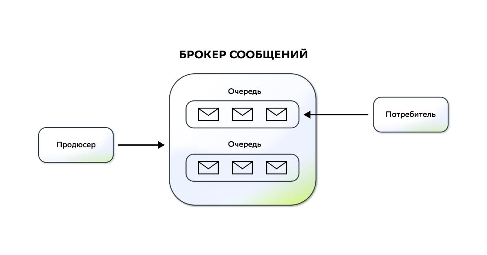
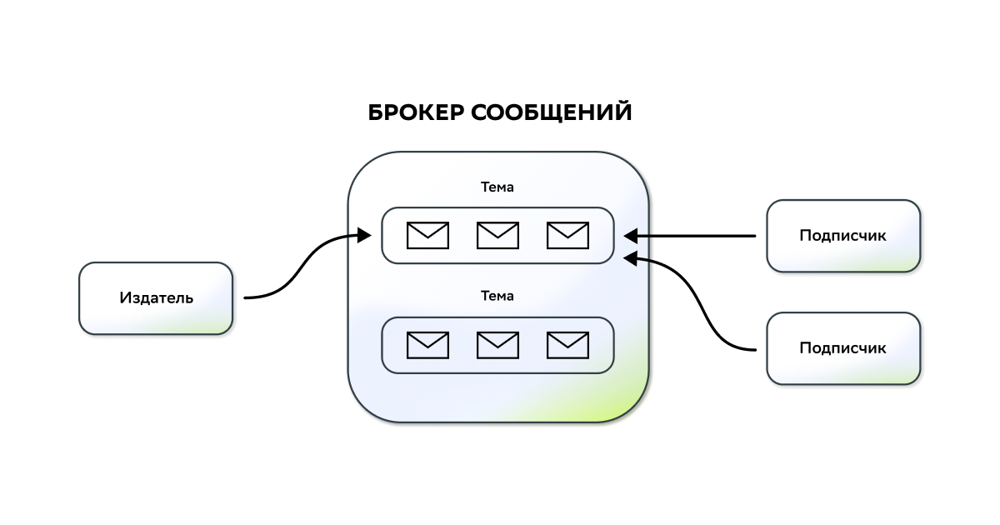

# Брокеры сообщений и распределённый кэш

💡 [Нажми сюда](https://new.oprosso.net/p/4cb31ec3f47a4596bc758ea1861fb624), **чтобы поделиться с нами обратной связью на этот проект**. Это анонимно и поможет нашей команде сделать обучение лучше. Рекомендуем заполнить опрос сразу после выполнения проекта.

## Contents

[[*TOC*]]

## Chapter I

### Брокеры сообщений

Брокер сообщений представляет собой тип построения архитектуры, при котором элементы системы «общаются» друг с другом с помощью посредника. Благодаря его работе происходит снятие нагрузки с веб-сервисов, так как им не приходится заниматься пересылкой сообщений: всю сопутствующую этому процессу работу он берёт на себя.

Можно сказать, что в работе любого брокера сообщений используются две основные сущности: producer (издатель сообщений) и consumer (потребитель/подписчик).

Одна сущность занимается созданием сообщений и отправкой их другой сущности-потребителю. Брокер сообщений умеет как сохранять передаваемые сообщения в свое персистентное хранилище (надежная политика), так и передавать их только через оперативную память без записи на диск (быстрая политика).

Здесь возможны несколько вариантов:

- Сообщение отправляется напрямую от отправителя к получателю.

В этом случае каждое сообщение используется только однократно;


- Схема публикации/подписки.

В рамках этой схемы обмена сообщениями отправитель не знает своих получателей и просто публикует сообщения в определённую тему. Потребители, которые подписаны на эту тему, получают сообщение. Далее на базе этой системы может быть построена работа с распределением задач между подписчиками. То есть выстроена логика работы, когда в одну и ту же тему публикуются сообщения для разных потребителей. Каждый «видит» уникальный маркер своего сообщения и забирает его для исполнения. Сообщение может доставляться и обрабатываться как всеми подписчиками, так и только самыми первыми.



**Для чего нужны брокеры сообщений?**

- Для организации связи между отдельными службами, даже если какая-то из них не работает в данный момент. То есть продюсер может отправлять сообщения, несмотря на то, проявляет ли активность потребитель в настоящее время.
- За счёт асинхронной обработки задач можно увеличить производительность системы в целом.
- Для обеспечения надёжности доставки сообщений: как правило, брокеры обеспечивают механизмы многократной отправки сообщений в тот же момент или через определённое время. Кроме того, обеспечивается соответствующая маршрутизация сообщений, которые не были доставлены.
- Для уменьшения связности сервисов системы.

**Недостатки брокеров сообщений:**

- Усложнение системы в целом как таковой, так как в ней появляется ещё один элемент. Кроме того, возникает зависимость от надёжности распределённой сети, а также возможность возникновения проблем из-за потребности в непротиворечивости данных, так как некоторые элементы системы могут обладать неактуальными данными.
- Из-за, как правило, асинхронной работы всей системы, а также её распределённого характера могут возникать ошибки, выяснение сути которых может стать непростой задачей.
- Освоение подобных систем является не самым простым вопросом и может занять существенное время.

Рассмотрим основные и самые популярные брокеры сообщений:

- RabbitMQ;
- Apache Kafka.

Говоря о RabbitMQ, можно сказать, что он представляет собой классический брокер, в котором присутствуют две описанные выше сущности — продюсер (система, генерирующая сообщения о разнообразных событиях) и подписчик, являющийся получателем этих сообщений.

Обе эти сущности в процессе работы взаимодействуют с очередью сообщений, которая представляет собой хранилище, где накапливаются отправляемые сообщения.

Система устроена таким образом, что поддерживает обоюдное уведомление об успешности доставки с двух сторон: после того как продюсером было отправлено целевое сообщение и оно получено, система отправляет продюсеру уведомление об успешном приёме. В свою очередь, потребитель, если сообщение им успешно получено, также отправляет уведомление в систему. Если же получение прошло неуспешно, отправляется информационное сообщение, а сообщение от продюсера остаётся в очереди, пока не будет получено подписчиком.

Основной особенностью этого брокера является возможность настройки гибкого роутинга: при отправке сообщение необязательно должно проходить только прямолинейный путь от продюсера к подписчику. В процессе оно может проходить через ряд промежуточных узлов обмена, которые могут перенаправлять его в различные очереди.

В рамках этого брокера инициатором информационного обмена является продюсер, только он отправляет сообщение в сеть, в то время как подписчик не может запросить его сам (так называемая push-доставка сообщений).

Apache Kafka представляет собой брокер, который, в отличие от RabbitMQ, хранит все сообщения в виде распределённого лога, причём гарантируется, что порядок сообщений отражает последовательность их поступления в систему. Сообщение в этом логе хранится в течение определённого времени, и работа построена таким образом, что продюсеры пишут новые сообщения в систему, а подписчики сами их запрашивают. При надобности организуется хранение сообщений в рамках тем. То есть можно сказать, что происходит определённого рода группировка сообщений в рамках одной темы.

Если попытаться некоторым образом обосновать выбор в пользу той или иной системы, то следует учесть, что RabbitMQ позволяет сконфигурировать даже весьма сложные сценарии доставки сообщений, что даёт разработчикам гибкость в построении нужного сценария информирования о событиях. При этом следует учитывать, что порядок доставки сообщений не гарантируется.

В свою очередь, брокер Apache Kafka больше предназначен для построения высоконагруженных систем сферы bigdata, так как сама его парадигма параллельной обработки, репликации позволяет создавать достаточно надёжные системы и обеспечивать неограниченные возможности по масштабированию. Высокая пропускная способность, а также возможности извлечения сообщений из очереди за определённый период времени (так как они хранятся в очереди, как мы сказали ранее, именно в том порядке, в каком были отправлены) являются мощным инструментом для анализа происходящего в историческом разрезе.

### Server Sent Events (SSE)

SSE является стандартом, который описывает способы начала передачи данных клиентам с момента организации клиентом первого соединения. Стандарт широко используется для посылки сообщений об обновлениях или для посылки непрерывных потоков данных браузеру клиента. Он спроектирован для улучшения кросс-браузерного вещания посредством JavaScript API под названием EventSource; с его помощью клиент задает URL для получения интересующего его потока событий.

```
const evtSource = new EventSource("//api.example.com/...", { withCredentials: true } );
```

Как только ты создал экземпляр EventSource, ты можешь начать получать сообщения с сервера, добавив обработчик события onMessage:

```
evtSource.onmessage = function(event) {
  const newElement = document.createElement("li");
  const eventList = document.getElementById('list');

  newElement.innerHTML = "message: " + event.data;
  eventList.appendChild(newElement);
}
```

Этот код обрабатывает входящие сообщения (то есть уведомления от сервера, на которых нет поля event) и добавляет текст сообщения в список в HTML-документе.

Также можно обрабатывать события, используя addEventListener():

```
evtSource.addEventListener("ping", function(event) {
  const newElement = document.createElement("li");
  const time = JSON.parse(event.data).time;

  newElement.innerHTML = "ping at " + time;
  eventList.appendChild(newElement);
});
```

Этот код аналогичен коду выше, за исключением того, что он будет вызываться автоматически всякий раз, когда сервер отправляет сообщение с полем event, установленным в «ping»; затем он парсит JSON в поле data и выводит эту информацию.

### Websockets

Спецификация WebSocket определяет API для установки соединения между веб-браузером и сервером, основанного на «сокете». Проще говоря, это постоянное соединение между клиентом и сервером, пользуясь которым клиент и сервер могут отправлять данные друг другу в любое время.

Клиент устанавливает соединение, выполняя процесс так называемого рукопожатия WebSocket. Этот процесс начинается с того, что клиент отправляет серверу обычный HTTP-запрос. В этот запрос включается заголовок Upgrade, который сообщает серверу о том, что клиент желает установить WebSocket-соединение.

Посмотрим, как установка такого соединения выглядит со стороны клиента:

```
// Создаём новое WebSocket-соединение.
var socket = new WebSocket('ws://websocket.example.com');
```

URL, применяемый для WebSocket-соединения, использует схему ws. Кроме того, имеется схема wss для организации защищённых WebSocket-соединений, что является эквивалентом HTTPS.

В данном случае показано начало процесса открытия WebSocket-соединения с сервером websocket.example.com.

Важно понимать, что необходимо корректно обрабатывать отключения клиента.

### Распределённый кэш

Распределённый кэш — это кэш, совместно используемый несколькими серверами приложений, обычно обслуживаемый как внешняя служба для серверов приложений, обращающихся к нему. Распределённый кэш может повысить производительность и масштабируемость приложения, особенно если приложение размещено облачной службой или фермой серверов.

Распределённый кэш имеет несколько преимуществ по сравнению с другими сценариями кэширования, в которых кэшированные данные хранятся на отдельных серверах приложений.

При распределении кэшированных данных они должны:

- быть согласованы между запросами на несколько серверов;
- выживать перезапуски сервера и развертывания приложений;
- не использовать локальную память.

**Распределённый кэш Redis**

Redis — это хранилище данных в памяти с открытым исходным кодом, которое часто используется в качестве распределённого кэша.

## Chapter II

Итак, перейдём к заданию. Этот проект групповой, так что выполняй его в команде.

1. Необходимо написать сервис-генератор событий об изменении атрибутов товара (стоимости и остаточном количестве).
   - Сервис представляет собой некий worker, который по таймеру будет брать рандомный товар, менять у него значения полей. Это и есть генерируемое событие по таймауту.
2. События должны посылаться на gateway нашего приложения (API), который должен обновить информацию о товаре в базе и обновить эту же информацию у клиентов по WebSockets и SSE:
   - Нужно реализовать простенькие эхо-клиенты (WebSockets и SSE) на JavaScript, которые будут получать обновлённую информацию о товаре и выводить информацию в консоль.
3. Доставка сообщений должна происходить в gateway через брокер сообщений (RabbitMQ или Apache Kafka).
4. Фотографии товара для ответов должны кешироваться в Redis.