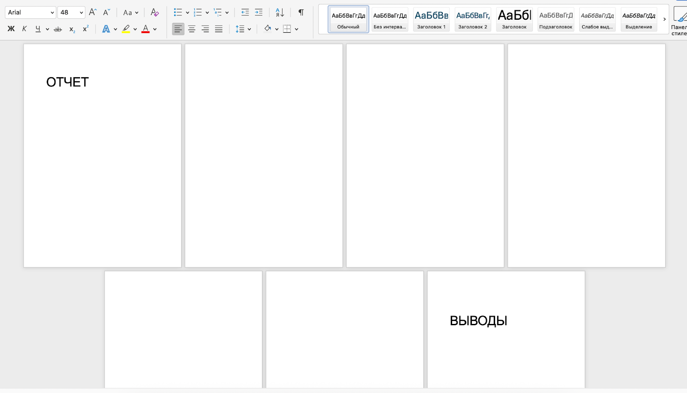

# Пайплайн для поиска плазмидных генов резистентности blaCTX-M-15

В этом проекте ты создашь автоматизированный пайплайн для анализа данных и научишься искать в неизвестных образцах гены устойчивости к антибиотикам (например, blaCTX‑M‑15).

Ты научишься интерпретировать биологические результаты и проводить полный цикл анализа — от первичных данных до итогового вывода, что заложит основу для работы в клинической биоинформатике, микробиологии и эпидемиологии. Это ключевой навык для исследований в этих областях.

## Содержание

- [Как учиться в «Школе 21»](#%D0%BA%D0%B0%D0%BA-%D1%83%D1%87%D0%B8%D1%82%D1%8C%D1%81%D1%8F-%D0%B2-%D1%88%D0%BA%D0%BE%D0%BB%D0%B5-21)
- [Chapter I](#chapter-i)
- [Chapter II](#chapter-ii)
  - [Задание 1. Скачивание файлов секвенирования](#%D0%B7%D0%B0%D0%B4%D0%B0%D0%BD%D0%B8%D0%B5-1-%D1%81%D0%BA%D0%B0%D1%87%D0%B8%D0%B2%D0%B0%D0%BD%D0%B8%D0%B5-%D1%84%D0%B0%D0%B9%D0%BB%D0%BE%D0%B2-%D1%81%D0%B5%D0%BA%D0%B2%D0%B5%D0%BD%D0%B8%D1%80%D0%BE%D0%B2%D0%B0%D0%BD%D0%B8%D1%8F)
  - [Задание 2. Разработка плана действий](#%D0%B7%D0%B0%D0%B4%D0%B0%D0%BD%D0%B8%D0%B5-2-%D1%80%D0%B0%D0%B7%D1%80%D0%B0%D0%B1%D0%BE%D1%82%D0%BA%D0%B0-%D0%BF%D0%BB%D0%B0%D0%BD%D0%B0-%D0%B4%D0%B5%D0%B9%D1%81%D1%82%D0%B2%D0%B8%D0%B9)
  - [Задание 3. Следуй плану](#%D0%B7%D0%B0%D0%B4%D0%B0%D0%BD%D0%B8%D0%B5-3-%D1%81%D0%BB%D0%B5%D0%B4%D1%83%D0%B9-%D0%BF%D0%BB%D0%B0%D0%BD%D1%83)
  - [Задание 4. Метрики сборки](#%D0%B7%D0%B0%D0%B4%D0%B0%D0%BD%D0%B8%D0%B5-4-%D0%BC%D0%B5%D1%82%D1%80%D0%B8%D0%BA%D0%B8-%D1%81%D0%B1%D0%BE%D1%80%D0%BA%D0%B8)
  - [Задание 5. Идентификация вида](#%D0%B7%D0%B0%D0%B4%D0%B0%D0%BD%D0%B8%D0%B5-5-%D0%B8%D0%B4%D0%B5%D0%BD%D1%82%D0%B8%D1%84%D0%B8%D0%BA%D0%B0%D1%86%D0%B8%D1%8F-%D0%B2%D0%B8%D0%B4%D0%B0)
  - [Задание 6. Поиск гена](#%D0%B7%D0%B0%D0%B4%D0%B0%D0%BD%D0%B8%D0%B5-6-%D0%BF%D0%BE%D0%B8%D1%81%D0%BA-%D0%B3%D0%B5%D0%BD%D0%B0)
  - [Задание 7. Анализ вариантов](#%D0%B7%D0%B0%D0%B4%D0%B0%D0%BD%D0%B8%D0%B5-7-%D0%B0%D0%BD%D0%B0%D0%BB%D0%B8%D0%B7-%D0%B2%D0%B0%D1%80%D0%B8%D0%B0%D0%BD%D1%82%D0%BE%D0%B2)
  - [Задание 8\*. Выводы по итогам исследования](#%D0%B7%D0%B0%D0%B4%D0%B0%D0%BD%D0%B8%D0%B5-8-%D0%B2%D1%8B%D0%B2%D0%BE%D0%B4%D1%8B-%D0%BF%D0%BE-%D0%B8%D1%82%D0%BE%D0%B3%D0%B0%D0%BC-%D0%B8%D1%81%D1%81%D0%BB%D0%B5%D0%B4%D0%BE%D0%B2%D0%B0%D0%BD%D0%B8%D1%8F)

## Как учиться в «Школе 21»

- Здесь тебя ждет уникальный образовательный опыт с большим количеством свободы. Ты получаешь задачу и самостоятельно ищешь пути решения, используя любые удобные способы поиска информации — ресурсы интернета или нейросети (например, GigaChat). Но внимательно относись к качеству информации: проверяй, думай, анализируй, сравнивай.
- Взаимообучение (Peer-to-Peer, P2P) — это обмен знаниями и опытом с другими пирами, где каждый выступает и учителем, и учеником. Такой подход позволяет глубже понять материал, учась друг у друга.
- Чувствуй себя свободно и проси о помощи — вокруг тебя те, кто тоже впервые проходят этот путь. Делись своим опытом и идеями с другими. Присоединяйся к RocketChat, чтобы быть в курсе всех новостей от нашего сообщества.
- Твое обучение не будет иметь никакого смысла, если ты будешь копировать чужие решения. Если пользуешься помощью других — всегда разбирайся до конца, почему, как и зачем. Не бойся ошибиться.
- Кажется, что задача невыполнима? Сделай перерыв, проветрись, перезагрузи голову — это помогало многим. Возможно, после этого решение придет само собой.
- Важен не только результат обучения, но и сам процесс. Нужно не просто решить задачу, а понять, КАК ее решить.

Как работать с проектом:

- Перед выполнением проект необходимо склонировать с GitLab в одноименный репозиторий.
- Все файлы необходимо создавать в папке *src/* склонированного репозитория.
- После клонирования проекта необходимо создать ветку develop и вести разработку в ней. После этого пушить в GitLab также нужно ветку develop.
- В твоей директории не должно быть иных файлов, кроме тех, что обозначены в заданиях.

## Chapter I

**День из жизни биоинформатика: охота на ген резистентности**

**09:30. Получение задачи на день**

За чашкой утреннего кофе я просматриваю задачу на день: три неизвестных бактериальных образца от клинической лаборатории, нужно определить, есть ли в них плазмидный ген blaCTX-M-15, и идентифицировать сами бактерии.

Интересно, почему коллеги не знают организмы, но знают ген, который искать? Наверное, заметили антибиотикорезистентность к определенному антибиотику, а вот саму бактерию не идентифицировали, так как устойчивость к одному и тому же антибиотику может быть у совершенно разных бактерий.

Могу поспорить: это не первая такая задача, скоро будут еще!

Как же хочется все оптимизировать: нужно создать пайплайн.

**09:45. Оценка сырых данных. Контроль качества (QC)**

Первым делом оцениваю сырые данные. Открываю отчеты FastQC и вижу, что Sample\_1 имеет отличное качество, а Sample\_3 совсем нет.

Низкое качество на 3'-концах и возможные адаптеры. Придется триммировать.

Sample\_2 где-то посередине.

Принимаю решение: использовать стандартные параметры Trimmomatic для всех образцов. Почему? В пайплайне важна воспроизводимость, а не тонкая настройка под каждый случай.

**10:30. Выбор стратегии сборки**

С качеством прочтений и их триммированием закончено, надо переходить к сборке.

SPAdes обычно дает лучшие результаты для бактериальных геномов, особенно с опцией --plasmid, но Velvet может быть более устойчив к шуму в Sample\_3.

Принимаю решение: использовать SPAdes для Sample\_1 и Sample\_2, а для проблемного Sample\_3 запущу оба сборщика и потом сравню результаты.

Держу в голове, что необходимо будет задокументировать это решение — в науке обоснование выбора методов не менее важно, чем сами результаты.

**11:30. Подготовка к поиску гена**

Пока идут сборки, готовлю референсные базы. Скачиваю эталонную последовательность blaCTX-M-15 из NCBI.

Возникает вопрос стратегии: стоит ли ограничиться только этим геном или добавить другие гены для контекста?

Принимаю решение сосредоточиться на целевом гене — все-таки задача пришла конкретная. Но оставляю возможность расширить анализ позже.

Принцип: сначала дать точный ответ на поставленный вопрос, а уже потом, при необходимости, проводить дополнительные исследования.

**13:00. Оценка качества сборки**

После обеда проверяю результаты сборки:

Sample\_1 собрался прекрасно — N50 больше 100 Кб, мало контигов.

Sample\_2 тоже хорош, Sample\_3, как и ожидалось, проблемный: SPAdes выдал много мелких контигов, Velvet справился немного лучше.

Выбираю для Sample\_3 сборку Velvet, несмотря на то что метрики хуже — она выглядит более правдоподобной при визуальном осмотре распределения покрытия. Все-таки QUAST — прекрасный инструмент!

**14:30. Идентификация вида**

Ну наконец-то самая интересная часть задачи! Идентификация видовой принадлежности.

Передо мной дилемма: Kraken2 быстр и точен для хорошо представленных видов, но BLAST против базы nt даст более надежные результаты для редких или нетипичных штаммов (+ я уже хорошо знаю этот инструмент по моей работе).

Учитывая клинический контекст, выбираю BLAST — точность здесь важнее скорости.

Запускаю выравнивание лучших контигов каждого образца против базы nt.

**15:00. Поиск гена резистентности**

Использую два независимых метода: BLAST для прямого поиска и ABRicate как дополнительное подтверждение.

Это мой принцип — важные биологические выводы (а особенно для клиники) должны подтверждаться несколькими методами.

Для Sample\_1 оба метода показывают четкий хит с высокой идентичностью!

Sample\_2 — только слабые хиты, вероятно, гомологичные гены.

Sample\_3 — несмотря на плохую сборку, находятся участки с умеренной идентичностью.

**16:30. Определение расположения гена**

Анализирую контекст найденного гена в Sample\_1.

Ген расположен на небольшом контиге с типичными плазмидными генами — репликации, мобильные элементы.

Это ключевой момент: это укрепляет уверенность, что мы имеем дело именно с плазмидной резистентностью, а не хромосомной. Плазмидная антибиотикорезистентность опаснее, так как легко передается между бактериями, в том числе разными видами, — как заразная «суперсила». Хромосомная устойчивость возникает из-за мутаций и передается только по наследству, поэтому распространяется медленнее.

**17:15. Анализ вариантов**

Запускаю анализ вариантов для каждого образца. Надо понять, насколько найденный ген в Sample\_1 отличается от референсного.

Судя по результату, степень сходства высокая, ничего интересного не замечено.

**18:20. Валидация**

Пришло время валидации. Запускаю пайплайн на контрольных данных с известным статусом. Волнуюсь…

Если чувствительность окажется низкой, все предыдущие выводы под вопросом. Но результаты обнадеживают: пайплайн корректно идентифицирует положительные и отрицательные контроли.

Для самопроверки в качестве отрицательного контроля выбираю сборку E. coli.

**18:00. Итоги работы**

Составляю итоговый отчет.



Выводы: Sample\_1 — E. coli с плазмидным геном CTX-M-15, Sample\_2 — K. pneumoniae без целевого гена, Sample\_3 — сложный случай, вероятно, смешанная культура с фрагментами целевого гена.

Особенно отмечаю в отчете все принятые решения, выбранные методы и их обоснование — это поможет коллегам понять логику анализа и при необходимости воспроизвести ее.

**19:00. Анализ дня**

Перед уходом еще раз проверяю, все ли этапы задокументированы.

В биоинформатике воспроизводимые исследования — это необходимость. Завтра предстоит обсуждение результатов с клиницистами, нужно быть готовым объяснить не только, что мы нашли, но и как мы это нашли.

Ну а сегодняшний день показал, что даже стандартные биоинформатические задачи требуют постоянного принятия решений и критического мышления.

## Chapter II

Теперь тебе предстоит почувствовать себя в роли главного героя-биоинформатика из предыдущей главы, исследующего только что полученные сырые данные парных прочтений.

Твоя цель — создать воспроизводимый пайплайн для анализа трех неизвестных бактериальных образцов, который:

1. Позволяет подготовить сырые данные и провести сборку.
2. Оценивает качество сборки (de novo сборка на выбор: SPAdes или Velvet).
3. Идентифицирует видовую принадлежность бактерий.
4. Определяет наличие плазмидного гена резистентности CTX-M-15.
5. Определяет варианты в гене резистентности CTX-M-15.

Для работы тебе понадобится:

- Установленный Python (рекомендуется версия 3.8+).
- Установленный [Biopython](https://biopython.org/wiki/Download) (документация [тут](https://biopython.org/docs/1.75/api/index.html)).
- Программа [FasQC](https://www.bioinformatics.babraham.ac.uk/projects/fastqc/).
- Программа [MultiQC](https://seqera.io/multiqc/).
- Программа [Trimmomatic](http://www.usadellab.org/cms/?page=trimmomatic).
- Программа [Samtools](http://www.htslib.org/).
- Программа [BWA](https://github.com/lh3/bwa) / программа [Bowtie2](https://bowtie-bio.sourceforge.net/bowtie2/manual.shtml).
- Программа [Velvet](https://github.com/dzerbino/velvet).
- Программа [Spades](https://github.com/ablab/spades).
- Программа [Quast](https://github.com/ablab/quast).
- Программа [VarScan](https://varscan.sourceforge.net).

Перед выполнением заданий проверь папку Materials: там есть необходимые рекомендации по созданию пайплайна в рамках этого проекта.

## Задание 1. Скачивание файлов секвенирования

1. Создай структуру папок:

```
- project10
    - results
    - data
    - script
```

2. [Перейди по ссылке](https://disk.360.yandex.ru/d/MmueWAh0m6YBcQ) и скачай data samples — 3 файла с парными «сырыми» прочтениями различных бактерий.

Не переименовывай их. Помести эти файлы в папку data.

Раздели их на прямые и обратные прочтения, используя split в fastq-dump.

Сохрани полученные файлы в папку data, используй названия согласно номеру исходного файла и R1 (для прямых) и R2 (для обратных) прочтений, например, `1_R2.fastq`.

## Задание 2. Разработка плана действий

Тебе нужно разработать план пайплайна для анализа трех неизвестных бактериальных образцов, который:

- позволяет подготовить сырые данные и провести сборку (на выбор: SPAdes или Velvet с обоснованием выбора метода в `answer2.txt`);
- оценивает качество сборки (de novo сборка на выбор: SPAdes или Velvet);
- идентифицирует видовую принадлежность бактерий (самостоятельный выбор с обоснованием метода в `answer2.txt`);
- определяет наличие плазмидного гена резистентности CTX-M-15 (самостоятельный выбор с обоснованием метода в `answer2.txt`);
- определяет варианты в гене резистентности CTX-M-15.

Прежде чем ты начнешь: найди в базе данных Gene NCBI референсную нуклеотидную последовательность гена CTX-M-15. Назови файл `reference_gene.fasta` и сохрани в папку data.

1. Создай файл `answer2.txt`, помести его в папку results. Опиши в нем:

- Стратегию создания пайплайна (простая последовательность запуска скриптов / создание пайплайна с помощью специализированных программ).
- Последовательность шагов анализа.
- Принцип разделения этих шагов на модули пайплайна.
- Ожидаемые названия выходных файлов для каждого шага.

Файлы необходимо называть согласно R1/R2 и результату.

2. Самостоятельно определи сложность пайплайна согласно твоему текущему уровню в программировании: это может быть либо последовательность скриптов к запуску, либо ты можешь создать его с помощью специальных систем (Nextflow, Snakemake и т. д.) — требует дополнительного изучения.

При написании простой последовательности скриптов к запуску важно помнить, что ты можешь столкнуться с проблемами реализации этого подхода (всегда валидируй результат):

- Нет обработки ошибок: если script2 упадет, script3 и script4 все равно попытаются запуститься и либо тоже упадут, либо, что еще хуже, обработают старые/битые данные.
- Нет перезапуска: если ты исправишь баг в script3, тебе придется запускать весь пайплайн с начала, даже если первые два шага уже выполнены.
- Нет параллелизации: ты не сможешь легко запустить обработку 100 образцов одновременно.
- Хрупкость: ты вручную передаешь имена файлов, может быть ошибка.

## Задание 3. Следуй плану

Тебе нужно реализовать разработанный план по созданию пайплайна для анализа трех неизвестных бактериальных образцов.

1. Начинай работу в соответствии со своим планом. Убедись, что названия полученных файлов соответствуют упомянутым в `answer2.txt`. Помести полученные файлы в папку results, а готовый пайплайн (программные файлы/скрипты) в папку script.

2. Внеси в `answer2.txt` требуемые обоснования: выбор инструмента сборки SPAdes или Velvet с обоснованием, выбор инструмента для идентификации видовой принадлежности бактерий с обоснованием выбора метода, выбор инструмента для определения наличия плазмидного гена резистентности CTX-M-15 с обоснованием выбора метода.

*Шаги для самопроверки:*

- *Запустить пайплайн дважды на одних данных и сравнить результаты*.
- *Убедиться в корректности обработки всех типов входных данных*.
- *Проверить, что все выходные файлы создаются корректно*.
- *Проверить, что все заявленные функции реализованы*.
- *Оценить биологическую правдоподобность результатов*.

## Задание 4. Метрики сборки

Сейчас тебе предстоит оценить качество полученных сборок.

Создай файл `answer4.txt`, помести его в папку results. В файле кратко опиши ответ на вопрос:

*«Дай свою оценку качества сборки для каждого образца. Определи, пригодны ли сборки для идентификации видовой принадлежности, поиска гена резистентности и для определения вариантов генов. Вывод должен быть сделан с опорой на данные качества сборок для каждого образца: количество контигов, их длина и другие статистические показатели».*

## Задание 5. Идентификация вида

Тебе необходимо обосновать получившийся результат идентификации вида.

Создай файл `answer5.txt`, помести его в папку results.

Кратко опиши для каждого образца (сырых данных):

- идентифицированный организм;
- метод определения;
- ключевые метрики, позволившие тебе сделать данный вывод.

Пример записи:

*«1 — E. coli, E-value = 99%, процент покрытия (query coverage) = 95%, результат получен с помощью … и является значимым, так как …»*

## Задание 6. Поиск гена

В этом задании тебе предстоит обосновать получившийся результат по поиску гена резистентности CTX-M-15.

Создай файл `answer6.txt`, помести его в папку results. В файле для каждого образца (сырого прочтения) укажи, найден ли в нем ген резистентности CTX-M-15, какой метод был использован для определения и какие метрики позволили тебе сделать данный вывод.

## Задание 7. Анализ вариантов

В этом задании тебе предстоит обосновать получившийся результат по анализу вариантов гена резистентности CTX-M-15.

Создай файл `answer7.txt`, помести его в папку results. В файле для (сырого прочтения) укажи:

- Фактический результат: найдены ли в нем значимые варианты гена резистентности CTX-M-15?
- Интерпретация: какой вывод о биологических свойствах гена можно сделать на этом основании?
- Методика: какой метод использовался для определения?
- Данные для вывода: какие метрики подтверждают вывод?

## Задание 8. Выводы по итогам исследования

На основе проведенного анализа сформулируй финальные выводы по проекту и продемонстрируй способность интерпретировать данные и критически оценивать примененные методы.

- Вопрос, который спросил бы твой тимлид:

  *«Какие выводы ты можешь сделать о гене CTX-M-15, основываясь на полученном результате?*

  *Оправдано ли использование пайплайнов для решения аналогичных задач по поиску генов антибиотикорезистентности в сырых данных? Какие есть преимущества и недостатки данного подхода?»*

Подготовь свой ответ к P2P-проверке.