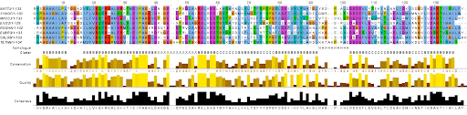
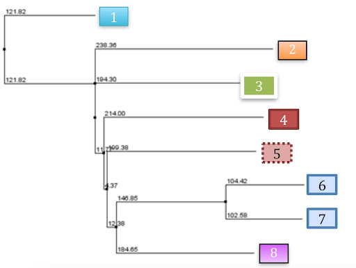
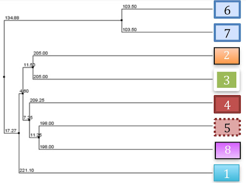

# Дерево для штаммов E. coli (EHEC, EPEC, ETEC) — эволюция патогенности

В этом проекте ты научишься строить филогенетическое дерево для штаммов E. coli (EHEC, EPEC, ETEC) и анализировать, как эволюционировали их болезнетворные свойства.

Этот навык — основа для реальной работы: отслеживания вспышек инфекций, анализа путей передачи и поиска мишеней для лекарств в биоинформатике и эпидемиологии.

## Содержание

- [Как учиться в «Школе 21»](#%D0%BA%D0%B0%D0%BA-%D1%83%D1%87%D0%B8%D1%82%D1%8C%D1%81%D1%8F-%D0%B2-%D1%88%D0%BA%D0%BE%D0%BB%D0%B5-21)
- [Chapter I](#chapter-i)
  - [День из жизни биоинформатика: эволюция патогенности](#%D0%B4%D0%B5%D0%BD%D1%8C-%D0%B8%D0%B7-%D0%B6%D0%B8%D0%B7%D0%BD%D0%B8-%D0%B1%D0%B8%D0%BE%D0%B8%D0%BD%D1%84%D0%BE%D1%80%D0%BC%D0%B0%D1%82%D0%B8%D0%BA%D0%B0-%D1%8D%D0%B2%D0%BE%D0%BB%D1%8E%D1%86%D0%B8%D1%8F-%D0%BF%D0%B0%D1%82%D0%BE%D0%B3%D0%B5%D0%BD%D0%BD%D0%BE%D1%81%D1%82%D0%B8)
- [Chapter II](#chapter-ii)
  - [Задание 1. Подготовка данных](#%D0%B7%D0%B0%D0%B4%D0%B0%D0%BD%D0%B8%D0%B5-1-%D0%BF%D0%BE%D0%B4%D0%B3%D0%BE%D1%82%D0%BE%D0%B2%D0%BA%D0%B0-%D0%B4%D0%B0%D0%BD%D0%BD%D1%8B%D1%85)
  - [Задание 2. Выравнивание и оценка качества](#%D0%B7%D0%B0%D0%B4%D0%B0%D0%BD%D0%B8%D0%B5-2-%D0%B2%D1%8B%D1%80%D0%B0%D0%B2%D0%BD%D0%B8%D0%B2%D0%B0%D0%BD%D0%B8%D0%B5-%D0%B8-%D0%BE%D1%86%D0%B5%D0%BD%D0%BA%D0%B0-%D0%BA%D0%B0%D1%87%D0%B5%D1%81%D1%82%D0%B2%D0%B0)
  - [Задание 3. Построение филогенетических деревьев](#%D0%B7%D0%B0%D0%B4%D0%B0%D0%BD%D0%B8%D0%B5-3-%D0%BF%D0%BE%D1%81%D1%82%D1%80%D0%BE%D0%B5%D0%BD%D0%B8%D0%B5-%D1%84%D0%B8%D0%BB%D0%BE%D0%B3%D0%B5%D0%BD%D0%B5%D1%82%D0%B8%D1%87%D0%B5%D1%81%D0%BA%D0%B8%D1%85-%D0%B4%D0%B5%D1%80%D0%B5%D0%B2%D1%8C%D0%B5%D0%B2)
  - [Задание 4. Деревья для генов патогенности](#%D0%B7%D0%B0%D0%B4%D0%B0%D0%BD%D0%B8%D0%B5-4-%D0%B4%D0%B5%D1%80%D0%B5%D0%B2%D1%8C%D1%8F-%D0%B4%D0%BB%D1%8F-%D0%B3%D0%B5%D0%BD%D0%BE%D0%B2-%D0%BF%D0%B0%D1%82%D0%BE%D0%B3%D0%B5%D0%BD%D0%BD%D0%BE%D1%81%D1%82%D0%B8)
  - [Задание 5. Визуализация, анализ, интерпретация](#%D0%B7%D0%B0%D0%B4%D0%B0%D0%BD%D0%B8%D0%B5-5-%D0%B2%D0%B8%D0%B7%D1%83%D0%B0%D0%BB%D0%B8%D0%B7%D0%B0%D1%86%D0%B8%D1%8F-%D0%B0%D0%BD%D0%B0%D0%BB%D0%B8%D0%B7-%D0%B8%D0%BD%D1%82%D0%B5%D1%80%D0%BF%D1%80%D0%B5%D1%82%D0%B0%D1%86%D0%B8%D1%8F)

## Как учиться в «Школе 21»

- Здесь тебя ждет уникальный образовательный опыт с большим количеством свободы. Ты получаешь задачу и самостоятельно ищешь пути решения, используя любые удобные способы поиска информации — ресурсы интернета или нейросети (например, GigaChat). Но внимательно относись к качеству информации: проверяй, думай, анализируй, сравнивай.
- Взаимообучение (Peer-to-Peer, P2P) — это обмен знаниями и опытом с другими пирами, где каждый выступает и учителем, и учеником. Такой подход позволяет глубже понять материал, учась друг у друга.
- Чувствуй себя свободно и проси о помощи — вокруг тебя те, кто тоже впервые проходят этот путь. Делись своим опытом и идеями с другими. Присоединяйся к RocketChat, чтобы быть в курсе всех новостей от нашего сообщества.
- Твое обучение не будет иметь никакого смысла, если ты будешь копировать чужие решения. Если пользуешься помощью других — всегда разбирайся до конца, почему, как и зачем. Не бойся ошибиться.
- Кажется, что задача невыполнима? Сделай перерыв, проветрись, перезагрузи голову — это помогало многим. Возможно, после этого решение придет само собой.
- Важен не только результат обучения, но и сам процесс. Нужно не просто решить задачу, а понять, КАК ее решить.

Как работать с проектом:

- Перед выполнением проект необходимо склонировать с GitLab в одноименный репозиторий.
- Все файлы необходимо создавать в папке *src/* склонированного репозитория.
- После клонирования проекта необходимо создать ветку develop и вести разработку в ней. После этого пушить в GitLab также нужно ветку develop.
- В твоей директории не должно быть иных файлов, кроме тех, что обозначены в заданиях.

## Chapter I

### День из жизни биоинформатика: эволюция патогенности

**08:30. Осмысление задачи на день**

За чашкой утреннего кофе я просматриваю задачу на день: 15 штаммов E. coli (5 EHEC, 5 EPEC, 5 ETEC) и 2 аутгруппы (Shigella и непатогенная E. coli K-12). Предстоит интересная задача: помимо изучения эволюции самих штаммов, мне предстоит изучить еще и эволюцию патогенности.

Это не экстренный анализ из-за вспышки, а плановое научное исследование. Мы изучаем эволюцию бактерий «задним числом», чтобы разобраться в главном: почему обычная бактерия вдруг становится опасной? Что за гены она для этого «подхватывает»? И может ли она стать еще опаснее в будущем?

Такие рутинные исследования помогают биоинформатикам заранее понимать механизмы развития инфекций, даже когда прямо сейчас всё спокойно.

Начинаю с самого начала. Сегодня я буду строить филогенетическое дерево, чтобы изучить, как одна и та же бактерия (E. coli) может быть непатогенной, а может вызывать различные по тяжести заболевания. Что к этому привело и на что влияет эволюция бактерий?

Что такое филогенетическое дерево? Представь себе семейное древо, но для бактерий. Оно показывает, как разные штаммы E. coli связаны между собой в эволюционном плане.

Эволюция — это процесс изменения организмов во времени, и как раз филогенетика изучает эти родственные отношения.

**9:00. Объекты исследования**

Итак, у меня три типа патогенных E. coli:

- EHEC (энтерогеморрагические) — вызывает кровавую диарею.
- EPEC (энтеропатогенные) — часто вызывает диарею у детей в развивающихся странах.
- ETEC (энтеротоксигенные) — «диарея путешественников».

Но почему они разные, если все E. coli? Ответ в эволюции.

Представь, что у тебя есть обычная E. coli, но она «случайно» приобретает «плохие гены» (гены патогенности) от другой бактерии через горизонтальный перенос генов. Теперь она может вызывать болезни.

**9:30. Ключевые термины**

Да, давненько не приходилось строить деревья. Вспоминаю ключевые термины, критичные для выбора правильных генов:

- Гомологи — гены имеют общего предка (как двоюродные братья).
- Ортологи — гены, разделившиеся при видообразовании (прямые потомки).
- Паралоги — гены, разделившиеся при дупликации гена (клоны внутри генома).

Для дерева эволюции штаммов мне нужны ортологичные гены — те, что унаследованы от общего предка, а не получены путем дупликации или горизонтального переноса.

**10:00. Выбор генов для анализа**

Первый вопрос: какие гены использовать для построения дерева?

Нужны консервативные маркеры, но достаточно вариабельные, чтобы видеть различия между штаммами.

Мне нужны гены, которые есть у всех бактерий (housekeeping genes) и медленно меняются. Почему медленно?

Представь, что ты сравниваешь тексты на разных языках. Если учитывать заимствованные или часто меняющиеся слова, то сложно увидеть родство языков. А если учитывать базовые слова — связь видна лучше.

Изучаю литературу. Для E. coli часто используют внутренние фрагменты housekeeping genes (схема MLST — мультилокусное типирование последовательностей):

- adk (аденилат-киназа);
- fumC (фумарат-гидратаза);
- gyrB (ДНК-гираза);
- icd (изоцитрат/изопропилмалат-дегидрогеназа);
- mdh (малат-дегидрогеназа);
- purA (аденилсукцинат-дегидрогеназа);
- recA (мотив связывания АТФ/ГТФ).

Но! Для изучения патогенности нужно будет добавить и гены патогенных островов.

Решаю начать с консервативных генов — они лучше покажут эволюционные отношения, а патогенные гены могут быть приобретены горизонтальным переносом.

Останавливаюсь на 7 генах из схемы MLST. Они медленно меняются — идеальные «отпечатки пальцев» для бактерий.

**10:30. Скачивание данных**

Беру 15 штаммов (по 5 каждого типа) и 2 аутгруппы.

Аутгруппа — это внешняя группа для сравнения, как дальний родственник на семейном древе. К примеру, если строить дерево приматов, аутгруппой могла бы быть мышь.

**11:00. Стратегия**

Размышляю над стратегией:

- Вариант А: построить дерево по конкатенированным последовательностям (результат соединения нескольких последовательностей в одну) всех 7 генов.
- Вариант Б: построить 7 отдельных деревьев.

Конкатенация дает больше информации, но если гены имеют разную эволюционную историю (например, из-за горизонтального переноса), это может исказить результат.

Профессиональный компромисс: решаю сделать и то и другое для сравнения.

**11:30. Подготовка файлов**

Подготавливаю файлы: создаю отдельные FASTA-файлы для каждого гена и один объединенный (я буду строить деревья для каждого из файлов).

Проверяю, что все последовательности в одной ориентации и не содержат стоп-кодонов в середине. Грязные данные = ложный вывод.

**12:00. Выравнивание**

Перехожу к выравниванию, без него дерево не построить.

Что такое выравнивание? Представь, что у тебя есть предложения на разных языках, и ты хочешь найти общие слова. Выравнивание ставит одинаковые буквы (нуклеотиды) друг под другом, чтобы найти гомологичные позиции.

Использую MAFFT — один из лучших сложных инструментов для выравнивания.

Почему он сложный? Потому что нужно найти оптимальное расположение, учитывая возможные вставки и удаления (гэпы). Это как собирать пазл, где некоторые кусочки потеряны, а некоторые кусочки лишние.

Выбираю алгоритм:

- L-INS-i — для очень похожих последовательностей (>85% идентичности);
- G-INS-i — для средне похожих (60–85%);
- E-INS-i — для содержащих большие вставки (или большие гэпы).

Мои гены — консервативные, поэтому я выбираю L-INS-i. Точный, но медленный — мне подходит.

**12:30. Оценка выравнивания**

Первое выравнивание готово.

Открываю в Jalview — это как микроскоп для последовательностей. Вижу разноцветные полосы:

- Красный/оранжевый — хорошо сохранившиеся позиции (консервативные).
- Синий/фиолетовый — вариабельные позиции.
- Черные линии — гэпы (пропуски).

*Пример получаемого окна в Jalview (в качестве последовательностей взяты иные объекты, не E. coli).*

Обнаруживаю проблему: несколько проблемных регионов с большим количеством гэпов в начале и конце.

Почему это плохо? Представь, что ты сравниваешь два рецепта приготовления блюда, но один начинается с «Возьмите...», а другой с «Для начала...». Смысл один, но слова разные.

В филогенетике такие регионы вносят шум — слишком много гэпов может исказить анализ.

Решение: подрезать выравнивание.

Использую trimAl для автоматической обрезки. Выбираю параметр «gt=0.8». Это значит: сохранять только те позиции, где гэпов менее 80%. Это как обрезать испорченные края.

**13:00. Обед**

Обедаю, размышляя о качестве выравнивания.

Что важнее: сохранить больше позиций или иметь меньше гэпов? Хорошее выравнивание — основа хорошего дерева. Если неправильно выровнять, дерево покажет ложные родственные связи.

Это как если бы в генеалогическом древе из-за ошибки в документах перепутались братья и сестры.

Именно поэтому филогенетики обычно предпочитают более консервативный подход — лучше меньше данных, но более надежных.

**14:00. Оценка выравниваний**

Готово и второе выравнивание для конкатенированных последовательностей. Анализирую оба выравнивания в Jalview.

Смотрю на консервативные и вариабельные регионы. Замечаю, что некоторые гены более консервативны, другие показывают больше вариаций между патогенными типами.

Это хороший знак — значит, они могут нести филогенетический сигнал.

**15:00. Построение деревьев**

Выбираю простой и быстрый метод — Neighbor-Joining (NJ).

Как он работает? Представь, что у тебя есть группа людей, и ты знаешь генетические расстояния между ними. NJ находит двух самых близких, объединяет их в «суперчеловека» и повторяет эти шаги до тех пор, пока вся группа не превратится в одного общего «суперчеловека». В результате строится эволюционное древо, показывающее предполагаемые родственные связи.

Это быстрый метод, но не самый точный.

Запускаю Neighbor-Joining в MEGA.

Выбираю модель эволюции (математическое описание того, как происходят мутации):

- Kimura 2-parameter — простейшая, учитывает переходы и трансверсии.
- Tamura-Nei — более сложная, учитывает разный состав нуклеотидов.

Итого: Neighbor-Joining, Kimura 2-parameter в MEGA. Запускаю бутстреп с 100 репликаций для оценки поддержки узлов.

*Пример дерева, полученного методом Neighbor-Joining.*

**15:30. Получаю первый набросок дерева!**

Вижу, что штаммы группируются по патогенным типам. Но некоторые ветви имеют низкую поддержку. Bootstrap — это мера уверенности.

Если bootstrap = 100, это значит, что в 100 из 100 случайных выборок данных эта ветвь появилась. <70 считается ненадежным.

Результат ожидаемый: NJ быстрый, но не самый точный метод.

**16:00. Maximum Likelihood в RAxML**

Перехожу к более точному методу — Maximum Likelihood (ML).

Что такое правдоподобие? Это вероятность получить наши данные при данной модели эволюции и данном дереве. ML ищет дерево, которое максимально правдоподобно объясняет наблюдаемые данные.

Выбираю модель: запускаю ModelTest, чтобы определить лучшую модель эволюции.

Для моих данных оптимальной оказывается модель GTR+G+I.

Настраиваю RAxML:

- 20 независимых запусков — чтобы не застрять в локальном максимуме.
- 100 бутстреп-репликаций — для оценки поддержки.

**17:00. Анализ результатов RAxML**

Анализирую результаты RAxML. Получаю ML-дерево. Оно похоже на NJ-дерево, но поддержка ветвей выше.

Полученное дерево выглядит более надежным: выше бутстреп-значения. Интересно, что один из ETEC штаммов оказывается ближе к EPEC.

Проверяю, воспроизводится ли это в NJ-дереве. Зачем? Возможно, это «мирный» предок, который недавно получил гены ETEC-токсина (ГПГ!), но генетически он ближе к EPEC.

**17:30. Сравнение**

Сравниваю деревья. Разные методы дали похожие, но не идентичные результаты. Это нормально!

В науке такая перекрестная проверка обязательна.

Наша базовая гипотеза состоит в том, что бактерии, относящиеся к одному и тому же типу, имеют гены, которые являются либо гомологами, либо паралогами, либо ортологами. Это важно для понимания истоков эволюции (образования нового штамма бактерии).

Дерево помогает нам ответить на вопросы: возможно ли, что у бактерий одного типа патогенности имеется общий предок, насколько далеко с точки зрения эволюции находятся различные типы патогенности, насколько отличаются между собой патогенные штаммы.

В общем виде, сравнивая деревья по генам домашнего хозяйства и по патогенным генам, мы можем понять, какой именно механизм возникновения патогенности присутствует, что напрямую влияет на изучение и прогнозирование новых возможных вспышек заболеваний и/или появления новых штаммов.

Пример деревьев, построенных разными методами для одних и тех же последовательностей.

Дерево 1:

Дерево 2:

**18:00. Дерево патогенности**

Повторяю весь пайплайн, но для генов патогенности (eae, stx, lt, st).

Дерево получается совершенно другим! Это доказывает, что гены патогенности распространялись горизонтальным переносом, а не передавались по наследству.

**19:30. Визуализация**

Пора сделать результаты наглядными. Использую ETE Toolkit.

Хочу показать не только эволюционные отношения, но и патогенные характеристики.

Добавляю цветовую маркировку по типу патогенности и наличию ключевых генов патогенности.

Создаю интерактивное дерево, где можно кликнуть на любой штамм и увидеть его характеристики: серотип, источник изоляции, год, патогенные гены.

**20:30. Анализ результатов**

Анализирую полученные деревья. Вижу несколько интересных закономерностей:

- EHEC образуют монофилетическую группу, что согласуется с их недавним происхождением — они недавно эволюционировали от одного предка.
- EPEC и ETEC перемешаны, что говорит об их полифилетической природе (возникали независимо много раз в разных эволюционных линиях, приобретая специфические гены).
- Распределение генов патогенности — хаотичное, мозаичное. Точный признак конвергентной эволюции через ГПГ.

**21:00. Отчет**

Готовлю финальные изображения деревьев в высоком разрешении.

Добавляю шкалу эволюционного расстояния, бутстреп-значения, легенду.

Важно, чтобы дерево было:

- читаемым (хороший шрифт, контрастные цвета),
- информативным (все необходимые аннотации),
- научно корректным (шкала расстояний, bootstrap-значения).

Пишу выводы в рамках сегодняшнего научного исследования.

Ключевой результат: патогенность в E. coli эволюционировала конвергентно, разные штаммы приобретали гены патогенности независимо через горизонтальный перенос. Консервативные гены показывают глубокое эволюционное разделение между штаммами.

## Chapter II

В данном проекте ты научишься строить и анализировать множественные выравнивания, строить и анализировать филогенетические деревья, а также исследовать эволюционные процессы применительно к бактериям.

Филогенетические деревья помогают ученым изучать эволюцию различных животных, растений, грибов, бактерий, простейших, вирусов и даже человека, открывать новые виды, переопределять эволюцию на основе общих предков (например, некоторые растения и животные изменили свои рода или семейства — это важно для правильного изучения данных организмов), а также в эпидемиологии, чтобы определять механизмы патогенности бактерий.

Тебе предстоит освоить новые программы:

- [MAFFT](https://mafft.cbrc.jp/alignment/server/index.html).
- [Jalview](https://www.jalview.org/).
- [trimAl](https://trimal.readthedocs.io/en/latest/).
- [MEGA](https://www.megasoftware.net/).
- [RAxML](https://cme.h-its.org/exelixis/web/software/raxml/).
- [ETE Toolkit](http://etetoolkit.org) (может быть недоступен в РФ — потребуются специальные настройки подключения).

## Задание 1. Подготовка данных

1. Создай структуру папок:

- project13
  - results
  - data

2. В этом задании тебе предстоит самому найти исходные данные для работы. Создай файл `report.docx` и помести его в папку results.

Подготовь список из 15 штаммов E. coli:

- 5 штаммов EHEC (например, O157:H7, O104:H4),
- 5 штаммов EPEC,
- 5 штаммов ETEC,
- 2 аутгруппы: Shigella dysenteriae и E. coli K-12.

Внеси в файл `report.docx` названия для каждого штамма и группу, к которой он относится.

3. Создай таблицу метаданных: внеси в файл `report.docx` таблицу с информацией о каждом выбранном штамме. Укажи: тип патогенности, год изоляции, источник изоляции.

4. Для каждого штамма найди последовательности 7 housekeeping генов MLST-схемы:

- adk, fumC, gyrB, icd, mdh, purA, recA.
- Используй базы данных: NCBI, Enterobase.

Внеси в файл `report.docx` идентификаторы найденных последовательностей генов для каждого штамма.

5. Подготовь FASTA-файлы:

- Создай отдельные файлы для каждого гена каждого штамма: `O157:H7_adk.fasta`, `O157:H7_fumC.fasta` и т. д.
- Создай конкатенированный файл со всеми генами для каждого штамма: `O157:H7_concatenated.fasta`.

*Не забудь проверить ориентацию всех последовательностей!*

## Задание 2. Выравнивание и оценка качества

1. Выполни множественное выравнивание для каждого гена:

- Используй [MAFFT с алгоритмом L-INS-i](https://mafft.cbrc.jp/alignment/server/index.html).
- Сохрани полученные выравнивания в папку results, назови файлы согласно гену, например, `alignment_adk`.

2. Оцени качество выравниваний:

- Визуализируй каждое выравнивание в [Jalview](https://www.jalview.org/).
- Определи консервативные и вариабельные регионы.
- Выяви регионы с большим количеством гэпов.

Внеси в файл `report.docx` свои наблюдения по оценке качества выравниваний (удобнее всего использовать скриншоты и описание наблюдений).

3. Подрежь выравнивания при необходимости:

- При необходимости используй [trimAl](https://trimal.readthedocs.io/en/latest/).
- Объясни в файле `report.docx`, почему была выполнена обрезка.

4. Создай конкатенированное выравнивание:

- Объедини подрезанные (если принималось решение об обрезке) выравнивания всех 7 генов. Сохрани полученное выравнивание `alignment_O157:H7_concatenated` в папку results.

## Задание 3. Построение филогенетических деревьев

В данном задании тебе необходимо выполнить построение деревьев для каждого гена (7 генов = 7 деревьев), каждое дерево содержит 15 штаммов. А также построение дерева для конкатенированного выравнивания всех 7 генов.

1. Построй деревья методом Neighbor-Joining:
   - Используй [MEGA](https://www.megasoftware.net/), примени модель эволюции Kimura 2-parameter.
   - Выполни bootstrap-анализ со 100 репликациями.
   - Сохрани деревья в форматах .newick и PDF.
2. Определи оптимальную модель эволюции:
   - Используй ModelTest.
   - Сравни несколько моделей и определи, какая модель лучше всего подходит для твоих данных.
   - Внеси в файл `report.docx` свои наблюдения и обоснование выбора модели.
3. Построй деревья методом Maximum Likelihood:
   - Используй [RAxML](https://cme.h-its.org/exelixis/web/software/raxml/) с выбранной моделью.
   - Выполни 20 независимых запусков для поиска best tree.
   - Проведи bootstrap-анализ со 100 репликациями.
   - Сохрани полученные результаты (BestTree и BootstrapTree).
4. Сравни полученные деревья:
   - Проведи сравнение топологий: отметь узлы с низкой bootstrap-поддержкой (<70%), определи, какие кластеры стабильны во всех методах. Внеси в файл `report.docx` свои наблюдения.

## Задание 4. Деревья для генов патогенности

1. Построй отдельные деревья по генам патогенности, все полученные результаты и файлы сохраняй в папку results:
   - Собери последовательности генов eae, stx, lt, st (исходные последовательности сохрани в папку data).
   - Выполни выравнивания и построй ML-деревья.
   - Сравни с ранее созданными деревьями по housekeeping-генам.
   - Внеси в файл `report.docx` свои наблюдения.

## Задание 5. Визуализация, анализ, интерпретация

1. Создай аннотированную визуализацию дерева:

- Используй ETE Toolkit.
- Добавь цветовую маркировку по типу патогенности.
- Отобрази bootstrap-значения на узлах.
- Добавь шкалу эволюционного расстояния.
- Сохрани полученный результат annotation\_tree в папку results.

2. Проанализируй полученные деревья:

- Определи, образуют ли штаммы, объединенные в группы по патогенности (например, EHEC), монофилетические группы.
- Объясни случаи, когда штаммы не кластеризуются по ожидаемому типу.
- Исследуй эволюцию патогенности:
  - Сравни деревья по housekeeping-генам с деревьями по патогенным генам.
  - Сделай выводы о роли горизонтального переноса генов.
  - Опиши, что означают полученные результаты для понимания эволюции E. coli.
  - Сформулируй выводы о возможной практической значимости исследования.
  - Ответы внеси в файл `report.docx` (пример оформления выводов можешь найти в Chapter I).