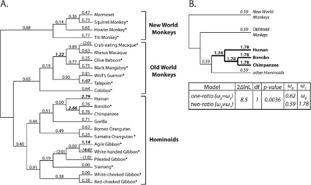
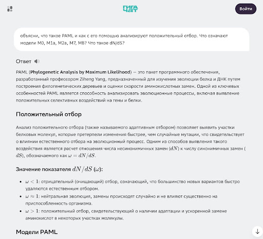
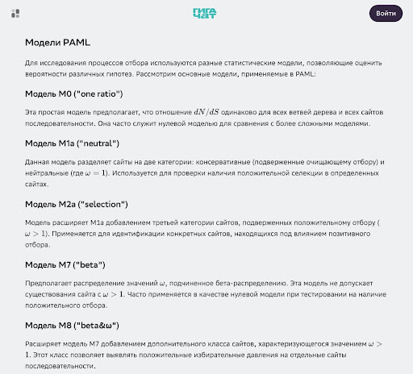
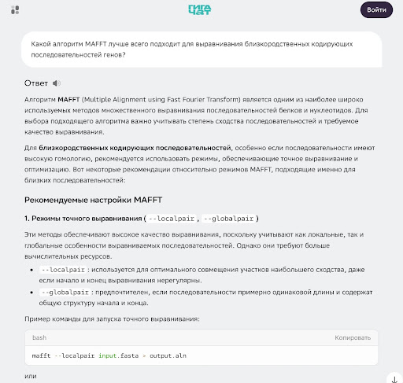
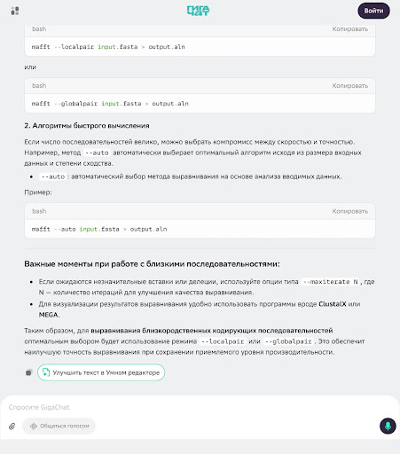
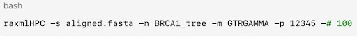
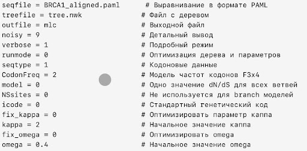

# Сравнение BRCA1 человека, неандертальца и шимпанзе

В этом групповом проекте вы исследуете эволюцию ключевого гена BRCA1, связанного с предрасположенностью к раку груди и яичников. Вы сравните последовательности гена у современных людей, неандертальцев, шимпанзе, бонобо и макаки, построите филогенетическое дерево и проведете анализ отбора с помощью программы PAML, чтобы проверить гипотезы о положительном отборе в эволюционной линии человека и шимпанзе.

Эти навыки пригодятся при работе как в науке, так и в коммерческих компаниях. Например, компания «Генотек» уже давно предлагает своим клиентам узнать, насколько их геном похож на геном неандертальца.

## Содержание

- [Как учиться в «Школе 21»](#%D0%BA%D0%B0%D0%BA-%D1%83%D1%87%D0%B8%D1%82%D1%8C%D1%81%D1%8F-%D0%B2-%D1%88%D0%BA%D0%BE%D0%BB%D0%B5-21)
- [Chapter I](#chapter-i)
  - [День из жизни группы биоинформатиков: сравнение BRCA1](#%D0%B4%D0%B5%D0%BD%D1%8C-%D0%B8%D0%B7-%D0%B6%D0%B8%D0%B7%D0%BD%D0%B8-%D0%B3%D1%80%D1%83%D0%BF%D0%BF%D1%8B-%D0%B1%D0%B8%D0%BE%D0%B8%D0%BD%D1%84%D0%BE%D1%80%D0%BC%D0%B0%D1%82%D0%B8%D0%BA%D0%BE%D0%B2-%D1%81%D1%80%D0%B0%D0%B2%D0%BD%D0%B5%D0%BD%D0%B8%D0%B5-brca1)
- [Chapter II](#chapter-ii)
  - [Задание 1. Подготовка данных](#%D0%B7%D0%B0%D0%B4%D0%B0%D0%BD%D0%B8%D0%B5-1-%D0%BF%D0%BE%D0%B4%D0%B3%D0%BE%D1%82%D0%BE%D0%B2%D0%BA%D0%B0-%D0%B4%D0%B0%D0%BD%D0%BD%D1%8B%D1%85)
  - [Задание 2. Выравнивание и контроль качества](#%D0%B7%D0%B0%D0%B4%D0%B0%D0%BD%D0%B8%D0%B5-2-%D0%B2%D1%8B%D1%80%D0%B0%D0%B2%D0%BD%D0%B8%D0%B2%D0%B0%D0%BD%D0%B8%D0%B5-%D0%B8-%D0%BA%D0%BE%D0%BD%D1%82%D1%80%D0%BE%D0%BB%D1%8C-%D0%BA%D0%B0%D1%87%D0%B5%D1%81%D1%82%D0%B2%D0%B0)
  - [Задание 3. Филогенетический анализ](#%D0%B7%D0%B0%D0%B4%D0%B0%D0%BD%D0%B8%D0%B5-3-%D1%84%D0%B8%D0%BB%D0%BE%D0%B3%D0%B5%D0%BD%D0%B5%D1%82%D0%B8%D1%87%D0%B5%D1%81%D0%BA%D0%B8%D0%B9-%D0%B0%D0%BD%D0%B0%D0%BB%D0%B8%D0%B7)
  - [Задание 4. Визуализация и интерпретация](#%D0%B7%D0%B0%D0%B4%D0%B0%D0%BD%D0%B8%D0%B5-4-%D0%B2%D0%B8%D0%B7%D1%83%D0%B0%D0%BB%D0%B8%D0%B7%D0%B0%D1%86%D0%B8%D1%8F-%D0%B8-%D0%B8%D0%BD%D1%82%D0%B5%D1%80%D0%BF%D1%80%D0%B5%D1%82%D0%B0%D1%86%D0%B8%D1%8F)

## Как учиться в «Школе 21»

- Здесь тебя ждет уникальный образовательный опыт с большим количеством свободы. Ты получаешь задачу и самостоятельно ищешь пути решения, используя любые удобные способы поиска информации: ресурсы интернета или нейросети (например, GigaChat). Но внимательно относись к качеству информации: проверяй, думай, анализируй, сравнивай.
- Взаимообучение (Peer-to-Peer, P2P) — это обмен знаниями и опытом с другими пирами, где каждый выступает и учителем, и учеником. Такой подход позволяет глубже понять материал, учась друг у друга.
- Чувствуй себя свободно и проси о помощи — вокруг тебя те, кто тоже впервые проходят этот путь. Делись своим опытом и идеями с другими. Присоединяйся к RocketChat, чтобы быть в курсе всех новостей от нашего сообщества.
- Твое обучение не будет иметь никакого смысла, если ты будешь копировать чужие решения. Если пользуешься помощью других — всегда разбирайся до конца, почему, как и зачем. Не бойся ошибиться.
- Кажется, что задача невыполнима? Сделай перерыв, проветрись, перезагрузи голову — это помогало многим. Возможно, после этого решение придет само собой.
- Важен не только результат обучения, но и сам процесс. Нужно не просто решить задачу, а понять, КАК ее решить.

Как работать с проектом:

- Перед выполнением проект необходимо склонировать с GitLab в одноименный репозиторий.
- Все файлы необходимо создавать в папке *src/* склонированного репозитория.
- После клонирования проекта необходимо создать ветку develop и вести разработку в ней. После этого пушить в GitLab также нужно ветку develop.
- В твоей директории не должно быть иных файлов, кроме тех, что обозначены в заданиях.

## Chapter I

### День из жизни группы биоинформатиков: сравнение BRCA1

**08:30. Знакомство с проектом и распределение ролей**

Сегодня в лаборатории у нашей группы снова исследовательский проект. Объект исследования — ген BRCA1, связанный с предрасположенностью к раку груди и яичников. Но смотреть мы будем не в микроскоп, а в прошлое: нас интересует, как этот ген эволюционировал у разных видов гоминид.

В команде 2 основные роли:

Специалист по выравниванию (отвечает за «сырые» данные):

*«Мы будем сравнивать ген BRCA1 у современных людей, неандертальцев и шимпанзе. Интересно, насколько сильно он отличается у наших ближайших родственников».*

Специалист по филогенетике (отвечает за эволюционные связи):

*«Да, и это особенно актуально, ведь у многих из нас есть 1–3% неандертальской ДНК. Возможно, мы найдем различия, которые помогут понять эволюцию этого важного гена».*

**09:00. Теоретическая подготовка и роли**

Перед погружением в данные распределяем задачи.

Специалист по выравниванию:

*«Давай распределим задачи. Я сосредоточусь на сборе данных и выравнивании последовательностей. У меня есть опыт работы с базами данных и MAFFT. И давай для порядку уточним, что такое палеогеномика вообще, чтобы понимать, с чем имеем дело.*

*Палеогеномика — это изучение древней ДНК. Геномы неандертальцев были реконструированы из костных останков возрастом десятки тысяч лет. ДНК фрагментирована, перемешана — отсюда и шум».*

Специалист по филогенетике:

*«Принято! Наша задача: собрать этот древний пазл и понять, как эти фрагменты соотносятся с современными видами.*

*Тогда моя зона ответственности — филогенетический анализ и визуализация через RAxML и ETE Toolkit. У меня есть опыт работы с ними с прошлого проекта».*

**9:30. Подготовка данных и теоретические основы**

Специалист по выравниванию:

*«Начну с поиска последовательностей BRCA1. Мне нужны:*

*1. Современный человек (Homo sapiens).*

*2. Неандерталец (Homo neanderthalensis) — из разных образцов, если доступно.*

*3. Шимпанзе (Pan troglodytes) — как аутгруппа для сравнения.*

*Быть может, добавить еще обезьян… Надо подумать».*

Специалист по филогенетике:

*«Важно понимать: гены BRCA1 у этих видов гомологичны — они происходят от общего предка. Но они могут быть ортологами (прямые потомки) или паралогами (дупликаты). В данном случае, скорее всего, ортологи. Но это лишь гипотеза, надо проверять».*

Специалист по выравниванию ныряет в базы данных:

- NCBI GenBank для современных последовательностей;
- UCSC Genome Browser для аннотированных геномов;
- специализированные базы палеогеномных данных.

*«Нашел интересное: у неандертальцев есть несколько вариантов BRCA1 из разных находок — Виндия (Хорватия), Денисова пещера, Алтайские горы».*

В этот момент напарники натыкаются на статью, которая переворачивает их представление. Специалист по филогенетике:

*«Смотри, какая статья! Авторы утверждают парадоксальную вещь: BRCA1, возможно, эволюционирует быстро, а не консервативно. В аннотации говорится, что они проанализировали 23 вида приматов и обнаружили положительный отбор у человека, шимпанзе и бонобо. Но они не исследовали неандертальца!*

*Смотри на рисунок 1: здесь показано дерево с рассчитанными значениями dN/dS. Ветви, ведущие к человеку и шимпанзе/бонобо, имеют значения больше 1! Это же классический маркер положительного отбора».*



*Источник: <https://pubmed.ncbi.nlm.nih.gov/25011685/#&gid=article-figures&pid=figure-1-uid-0>*

Специалист по выравниванию:

*«Значит, наша основная гипотеза: мы ожидаем увидеть dN/dS > 1 на ветвях, ведущих к человеку, неандертальцу и общей кладе шимпанзе/бонобо, и dN/dS < 1 у макаки?»*

Специалист по филогенетике:

*«Да, но есть нюанс. Я ранее не работала с геномом неандертальца, давай спросим у ИИ, насколько мы можем сделать такое предположение на основе статьи. Формально мы будем проверять и дополнять выводы статьи, используя те же статистические методы, что и авторы — анализ кодонов в программе PAML.*

*Но вместо 23 видов мы возьмем только 5: человека, неандертальца, шимпанзе, бонобо и макаку как внешнюю группу.*

*PAML — это программа для филогенетического анализа методом максимального правдоподобия, но я с ней никогда не работала. Поэтому еще стоит лучше понять, как работает эта программа и какие модели они использовали».*





**10:00. Понимание эволюционного контекста**

Прежде чем работать с нуклеотидами, мы набрасываем временную шкалу, чтобы понимать, какого масштаба различия мы ищем.

Специалист по филогенетике:

*«Давай вспомним временные масштабы. Общий предок человека и шимпанзе жил около 7 миллионов лет назад. Общий предок с неандертальцами — около 500 тысяч лет назад, если я правильно помню».*

Специалист по выравниванию:

*«То есть различия между человеком и шимпанзе должны быть больше, чем между человеком и неандертальцем. Но интересно, какие именно изменения произошли».*

Специалист по филогенетике:

*«BRCA1 участвует в репарации ДНК. Возможно, эволюционные изменения связаны с разной скоростью мутаций, продолжительностью жизни или репродуктивными стратегиями».*

**10:30. Подготовка последовательностей**

Приступаем к поиску последовательностей в NCBI Nucleotide. Комментарии специалиста по выравниванию — готовый чек-лист для любого начинающего биоинформатика.

Специалист по выравниванию:

*«Открываю NCBI Nucleotide. Ищу 'BRCA1 Homo sapiens mRNA'. Важно взять именно референсную кодирующую последовательность, а не геномную — в геномной будут интроны. В статье они использовали полные кодирующие регионы. Надо убедиться, что последовательность начинается со старт-кодона и заканчивается стоп-кодоном. Вот она: NM\_007294.4 — это референсная мРНК для человека. Теперь ищу для остальных».*

Через некоторое время список образцов готов:

- современный человек,
- неандертальцы,
- 2 последовательности шимпанзе (обыкновенной и бонобо для сравнения),
- макаки.

Специалист по филогенетике (одобряя выбор):

*«Хороший набор. Макака будет аутгруппой — внешней точкой отсчета. Бонобо добавит глубины анализу. Для эволюционного сравнения действительно лучше взять кодирующие последовательности (экзоны). Они более консервативны и меньше подвержены влиянию нейтральной эволюции».*

**11:00. Выравнивание с MAFFT**

Подготовив FASTA-файл, готовимся запустить множественное выравнивание. Здесь возникает технический вопрос, знакомый каждому, кто работал с выравниваниями.

Специалист по выравниванию:

*«Запускаю MAFFT. Для таких похожих последовательностей (>90% идентичности) лучше использовать алгоритм L-INS-i — он точный, хотя и медленный, но я не уверен, какой алгоритм оптимален для кодирующих последовательностей. Спрошу у ИИ».*





Специалист по выравниванию (смотря на результаты ответа):

*«Интересно! Проанализирую ответ и сверюсь с советами в мануале и своим опытом. Информация от ИИ часто неточная и требует проверки».*

На основе анализа, опираясь на мануал, собственный опыт и анализ ответа ИИ, выбираем алгоритм для MAFFT.

**11:30. Оценка качества выравнивания**

Пока MAFFT работает, мы обсуждаем критерии качества выравнивания.

Для филогенетики важно, чтобы гомологичные позиции были правильно сопоставлены.

Специалист по выравниванию (открывает Jalview и смотрит цветовую карту консервативности):

*«Выравнивание готово. Вижу, что последовательности очень похожи — много консервативных позиций (красные/оранжевые колонки)».*

Специалист по филогенетике:

*«Это ожидаемо для столь близких видов. Но нам для анализа нужны и вариабельные позиции — синие или зеленые колонки, где есть замены. Именно они понесут сигнал об отборе. Вижу, что MAFFT добавил гэпы (-)».*

Специалист по выравниванию:

*«Это нормально: у кого-то из видов могла произойти индель-мутация (вставка или выпадение нуклеотида). Для компенсации разницы в длине MAFFT вставляет пропуски (-). Но мы должны убедиться, что нет стоп-кодонов и рамка считывания не нарушена.*

*Давай подключим ИИ и напишем простой скрипт для проверки: стоп-кодонов в середине быть не должно».*

**12:00. Обсуждение вопросов об эволюции**

Пока скрипт проверяет целостность данных, мы позволяем себе поразмышлять о биологическом смысле проекта. Это важный момент: любой анализ в биоинформатике должен отвечать на биологический вопрос.

Специалист по выравниванию:

*«Интересно, какие изменения в BRCA1 могли повлиять на предрасположенность к раку у современных людей?»*

Специалист по филогенетике:

*«Есть гипотеза, что некоторые "неандертальские" аллели могут влиять на риск заболеваний. Возможно, мы найдем такие различия».*

Специалист по выравниванию:

*«Также интересно, как естественный отбор действовал на этот ген. BRCA1 важен для репродуктивного здоровья, поэтому на него мог быть сильный отбор».*

Специалист по филогенетике:

*«При этом такой важный ген подвергается положительному отбору. В статье предполагают гипотезу о взаимодействии с вирусами».*

Специалист по выравниванию:

*«Да, BRCA1 участвует в репарации ДНК. Если вирусы каким-то образом используют или блокируют этот путь, то может идти "гонка вооружений" — отсюда и быстрая эволюция».*

**13:00. Подготовка к построению дерева**

Наступает время специалиста по филогенетике. Выравнивание готово, теперь нужно превратить его в эволюционную историю.

Специалист по филогенетике:

*«Поскольку у нас всего 5 видов, топология предположительно известна, но PAML требует дерево в формате NEWICK. Мы можем либо взять "каноническую" топологию (ее нам может подсказать ИИ, как в статье), либо построить дерево сами, чтобы убедиться. Я выберу второй вариант — построим в RAxML для надежности».*

Специалист по выравниванию:

*«Какую модель будем ставить? Для близких последовательностей обычно берут GTR+G — это обобщенная модель замен с гамма-распределением скорости эволюции по сайтам».*

Специалист по филогенетике:

*«Да, и добавлю параметр "+I" для инвариантных сайтов. Запускаю ModelTest — программа сама выберет лучшую модель по критериям информативности».*

**13:30. Построение дерева с RAxML**

Специалист по филогенетике пишет команду для RAxML:



Специалист по выравниванию: *«Почему именно 100 bootstrap, а не 1000, например?»*

Специалист по филогенетике:

*«Bootstrap показывает надежность ветвей. 100 — хороший компромисс между точностью и временем вычислений. Значения >70% считаются надежными».*

**14:00. Анализ предварительных результатов**

Пока дерево строится, мы обсуждаем, что ожидаем увидеть.

Специалист по выравниванию:

*«Ожидаемая топология: макака как аутгруппа отдельно, потом шимпанзе, затем неандертальцы и современные люди как сестринские группы».*

Специалист по филогенетике:

*«Да, но интересно, будут ли неандертальцы монофилетической группой, или они перемешаются с некоторыми человеческими последовательностями».*

**14:10. Первые результаты**

Результат появляется на экране.

Специалист по филогенетике (всматриваясь в топологию):

*«Общая структура та, что ИИ предсказывал. Но интересно — неандертальцы не образуют отдельный кластер, а перемежаются с современными людьми!»*

Специалист по выравниванию (задумчиво):

*«Это может указывать на:*

*1. Неполное сортирование линий.* \
*2. Гибридизацию между видами.* \
*3. Ошибки в данных или анализе».*

Специалист по филогенетике (проверяя цифры):

*«Смотрю bootstrap. Узлы, объединяющие некоторые неандертальские и человеческие последовательности, имеют высокую поддержку (больше 90)».*

**14:30. Расчет генетических расстояний**

Мы рассчитываем генетические расстояния. Это покажет, насколько последовательности отличаются.

Специалист по выравниванию показывает:

*«Среднее расстояние человек-шимпанзе: 1.2%. Человек-неандерталец: 0.08%. Неандерталец-шимпанзе: 1.25%».*

Специалист по филогенетике (считая в уме):

*«Интересно! Человек и неандерталец в 15 раз ближе друг к другу, чем человек и шимпанзе. Это соответствует временам дивергенции. Отлично, теперь можно использовать это дерево в PAML!»*

**15:00. Подготовка контрольного файла для PAML**

Специалист по филогенетике:

*«Так, честно признаю: с PAML я работаю впервые. Будем действовать согласно мануалу, беря во внимание статью и консультируясь с ИИ.*

*ИИ говорит, что программа работает через контрольный файл. Нужно создать codeml.ctl. Сначала надо настроить простейшую модель one-ratio (M0), которая предполагает одно значение dN/dS для всех ветвей.*

*ИИ советует сделать так»:*



Специалист по выравниванию (смотря на экран):

*«Почему начальное omega = 0.4? Откуда это?»*

Специалист по филогенетике:

*«Из статьи. В таблице 1 они использовали начальные значения 0.4 и 1.6. Omega = dN/dS. Значение 0.4 предполагает очищающий отбор, что разумно для важного гена. Но программа потом сама подберет оптимум на основе наших данных. Запускаю codeml».*

Программа работает... Готово. Смотрим выходной файл mlc:

```
lnL = -9876.543210
dN/dS (omega) = 0.85
```

Специалист по филогенетике:

*«Хм… Общее omega = 0.85. Формально это все еще очищающий отбор (меньше 1), но очень слабый, почти нейтральная эволюция. Но это среднее значение по всем ветвям.*

*Возможно, на некоторых ветвях значение выше, на некоторых ниже. Теперь создам модель, которая позволит разным ветвям иметь разные значения omega.*

*В статье они использовали two-ratio модель для клады человек-шимпанзе-бонобо против остальных. Надо отредактировать codeml.ctl для branch-модели».*

Специалист по филогенетике помечает ветви в дереве и обновляет tree.nwk и параллельно объясняет, что делает:

*«Смотри. Вот строка:*

*((Human #1,(Chimp #1,Bonobo #1) #1) #1,Macaque #2)*

*Это означает: все, что помечено #1 (вся внутренняя клада приматов, кроме макаки), будет иметь одно значение omega. А ветвь, ведущая к макаке (#2), получит свое значение. PAML теперь подберет два числа вместо одного».*

Далее запускает codeml с обновленными файлами.

*«Ого! Смотри! Для клады человека, шимпанзе и бонобо omega = 1.35! Это больше 1 — свидетельство положительного отбора! А для макаки omega = 0.45 — очищающий отбор?»*

Специалист по выравниванию:

*«Это именно то, что показано в статье! Мы воспроизвели их ключевой вывод, даже на меньшем наборе данных. Теперь надо проанализировать, что у нас с неандертальцем: давай посмотрим на данные и сделаем выводы».*

**15:30. Визуализация с ETE Toolkit**

Пришло время показать результаты красиво.

Специалист по филогенетике:

*«Теперь создам красивую визуализацию. Использую ETE Toolkit для Python. Добавляем аннотации».*

Специалист по выравниванию:

*«Отлично! Добавь еще шкалу расстояний и bootstrap-значения».*

**16:00. Анализ конкретных замен**

Специалист по филогенетике:

*«Из статьи: они нашли 10 кодонов под положительным отбором. Давай посмотрим на выравнивание в этих позициях. Нас особенно интересуют конкретные аминокислотные замены, которые уникальны для современного человека по сравнению с неандертальцем и шимпанзе».*

Специалист по выравниванию:

*«Смотрю выравнивание. Вижу несколько nonsynonymous замен (меняют аминокислоту) в важных доменах BRCA1. Смотрю позиции, которые в статье обозначены как быстро эволюционирующие. Например, позиция 170... Да, здесь у человека L (лейцин), у шимпанзе L, у бонобо L, а у макаки — Q (глутамин)».*

Специалист по филогенетике:

*«Особенно интересны замены в:*

*1. RING domain (участвует в убиквитинировании).* \
*2. BRCT domains (связывание с фосфорилированными белками)».*

Специалист по выравниванию:

*«Нашел одну замену в позиции, которая у человека ассоциирована с повышенным риском рака. У неандертальцев и шимпанзе там другие аминокислоты».*

Специалист по филогенетике:

*«А в базе данных полиморфизмов человека есть вариант в этой позиции?»*

Специалист по выравниванию:

*«Да, согласно статье, в базе BIC есть SNP в позиции 170. И в других позициях из их списка тоже».*

**16:30. Биологическая интерпретация**

Специалист по филогенетике:

*«Итак, что мы имеем?* \
*Во-первых, близость человека и неандертальца подтверждает их недавнее расхождение.Мы также подтвердили основной вывод статьи: BRCA1 эволюционирует под положительным отбором в линии человека и шимпанзе/бонобо».*

Специалист по выравниванию:

*«Во-вторых, некоторые замены специфичны для современного человека. Возможно, они возникли после отделения от неандертальцев».*

Специалист по филогенетике:

*«Интересный вопрос: могли ли эти изменения повлиять на предрасположенность к раку у современного человека?»*

Специалист по выравниванию:

*«BRCA1 участвует в репарации ДНК. Изменения в этом гене могли повлиять на накопление мутаций и, следовательно, на риск рака. В статье предлагают гипотезу о вирусах: BRCA1 участвует в ответе на повреждение ДНК. Некоторые вирусы могут ингибировать этот путь. Поэтому идет "гонка вооружений": вирусы эволюционируют, чтобы обойти BRCA1, а BRCA1 эволюционирует, чтобы оставаться эффективным.*

*Альтернативная гипотеза: изменения могут быть связаны с особенностями репродукции или продолжительности жизни. У человека и шимпанзе более долгая жизнь, больше клеточных делений — может быть, нужна немного иная система репарации».*

**17:00. Обсуждение методологических аспектов**

Мы садимся за стол, чтобы критически оценить свою работу — мы получили красивые результаты, но у нашего анализа есть ограничения.

Специалист по филогенетике:

*«Важно отметить ограничения нашего анализа. Палеогеномные данные — это не свежий образец из клиники, они могут содержать ошибки из-за деградации ДНК и контаминации».*

Специалист по выравниванию:

*«Да, и мы использовали только кодирующие регионы. Это дало нам чистый сигнал для анализа отбора, но мы полностью проигнорировали интроны. А там могут быть регуляторные элементы — промоторы, энхансеры, которые влияют на то, сколько белка производится, а не какой у него состав».*

Специалист по филогенетике:

*«Также мы не учитывали эпигенетические изменения — метилирование ДНК, которое могло отличаться у неандертальцев. Также у нас только 5 видов против 23, мы использовали простые branch-модели, а в статье использовали более сложные site-модели (M8) для поиска конкретных кодонов под отбором, а еще мы не анализировали полиморфизмы внутри видов».*

Специалист по выравниванию:

*«Хорошо, а если бы у нас был бесконечный грант и еще год времени? Что можно было бы сделать в первую очередь?»*

Специалист по филогенетике:

*«1. Добавить больше видов приматов.*\
*2. Проанализировать BRCA2, как в статье.*\
*3. Искать конкретные кодоны под положительным отбором с помощью site-моделей.*\
*4. Связать найденные замены с трехмерной структурой белка».*

Специалист по выравниванию:

*«Звучит как план для магистерской диссертации. А я хочу отметить главное — в этом проекте мы активно использовали ИИ как ассистента, а не как "черный ящик", которому верят на слово. Мы каждый его ответ проверяли: сверяли со статьей, лезли в документацию PAML, смотрели, сходится ли логика».*

**17:30. Подготовка отчета**

Набрасываем структуру отчета:

1. Введение — важность BRCA1 и эволюционные вопросы. \
2. Методы — сбор данных, выравнивание, филогенетический анализ. \
3. Результаты — дерево, генетические расстояния, конкретные замены. \
4. Обсуждение — биологическая интерпретация и ограничения.

Специалист по филогенетике:

*«Добавлю визуализации в ETE: дерево с аннотациями, таблицу генетических расстояний, выравнивание ключевых позиций».*

**18:00. Выводы и перспективы**

Рабочий день подходит к концу. Время подвести черту.

Специалист по выравниванию (подводя итог):

*«Основные выводы нашего мини-исследования:*

*1. BRCA1 высококонсервативен среди гоминид.* \
*2. Человек и неандерталец очень близки генетически.* \
*3. Найдены несколько замен, специфичных для современного человека».*

Специалист по филогенетике (добавляя):

*«Перспективы для дальнейшего исследования:*

*1. Анализ большего числа неандертальских образцов.* \
*2. Включение денисовского человека.* \
*3. Функциональная проверка эффектов найденных замен».*

Отлично. Это был интересный день: мы прошли полный цикл биоинформатического исследования — от запроса в базе данных до биологической интерпретации. И даже нашли загадку, над которой можно думать дальше.

## Chapter II

Вашей команде необходимо исследовать эволюцию ключевого гена BRCA1: изучить статьи, построить и проанализировать множественные выравнивания, построить и проанализировать филогенетические деревья, проанализировать характер отбора, используя современные методы (PAML), а также сформулировать и проверить гипотезы о положительном отборе в эволюционной линии человека и шимпанзе.

В этом групповом проекте вам предстоит самостоятельно определить роли и распределить задачи.

Программы для работы над данным проектом:

- Базы данных: NCBI, UCSC Genome Browser, палеогеномные базы (например, Ancient Genome Browser).
- [MAFFT](https://mafft.cbrc.jp/alignment/server/index.html).
- [Jalview](https://www.jalview.org/).
- [trimAl](https://trimal.readthedocs.io/en/latest/) (при необходимости).
- [MEGA](https://www.megasoftware.net/).
- [RAxML](https://cme.h-its.org/exelixis/web/software/raxml/).
- [PAML](https://anaconda.org/channels/bioconda/packages/paml/overview).
- [ETE Toolkit](http://etetoolkit.org) (может быть недоступен в РФ — потребуются специальные настройки подключения).

## Задание 1. Подготовка данных

1. Изучите [статью](https://pubmed.ncbi.nlm.nih.gov/25011685/). Если вы не знаете английский или не уверены в своем переводе — используйте GigaChat или другую нейросеть. Сфокусируйтесь на следующих вопросах при изучении:
- Какой парадокс (эволюция критического для выживания гена) авторы пытаются объяснить?
- Какие три основных результата они получили?
- Что показывают рисунки 1A и 1B в статье? Это ваша цель для повторения в упрощенном виде.
- Сформулируйте гипотезы для проверки в своем мини-исследовании (например: «Ветви, ведущие к человеку и шимпанзе, будут иметь значение dN/dS > 1»).
- Распределите роли для выполнения проекта.

2. Создайте структуру папок:

- project14
  - results
  - data
  - scripts

3. В папке results создайте файл отчета `report.docx`.

4. В этом задании вам предстоит самостоятельно найти исходные данные для данного проекта. Используя UCSC Genome browser, NCBI Nucleotide и другие базы, найдите кодирующие последовательности (CDS) гена BRCA1 для следующих видов (или образцов):

- Современный человек (Homo sapiens) – референсная последовательность (NM\_001407585.1).
- Неандерталец (Homo neanderthalensis — altai Neanderthal) — последовательность содержится в папке data samples.
- Шимпанзе обыкновенный (Pan troglodytes).
- Бонобо (Pan paniscus).
- Макака-резус (Macaca mulatta).

Убедитесь, что последовательности содержат полную кодирующую область (от старт- до стоп-кодона). Если доступны только фрагменты, выберите наиболее полные.

Сохраните каждую последовательность в отдельный FASTA-файл в папке data с понятным именем, например: `Homo_sapiens_BRCA1.fasta`, `Neanderthal_BRCA1.fasta` и т. д.

В отчет `report.docx` внесите таблицу со следующими столбцами: вид/образец, идентификатор (Accession), источник данных.

## Задание 2. Выравнивание и контроль качества

1. Постройте множественное выравнивание:

- Создайте один FASTA-файл, содержащий все найденные последовательности (`BRCA1_all.fasta`).
- Выполните множественное выравнивание с помощью MAFFT. В отчете `report.docx` обоснуйте применяемый алгоритм для кодирующих последовательностей.
- Сохраните выравнивание в формате FASTA в папку results под именем `BRCA1_alignment.fasta`.

2. Оцените качество выравнивания в Jalview:

- Откройте выравнивание в Jalview. Оцените:
  - консервативные участки (высокий процент идентичности);
  - вариабельные участки.
- Сделайте скриншоты ключевых областей и вставьте их в отчет `report.docx` с комментариями.
- Убедитесь, что нет стоп-кодонов внутри последовательностей (если они есть, возможно, это псевдоген или ошибка). Для этого используйте GigaChat или другую нейросеть для написания небольшого скрипта (Python), который выявляет внутренние стоп-кодоны.
- Скриншот промпта с командой по написанию скрипта (по правилам качественного промпта) сохраните в папку results.
- Полученный скрипт (после проверки работоспособности и редактирования при необходимости) сохраните в папку scripts.

3. При необходимости отредактируйте выравнивания:

- Если выравнивание содержит явно плохие участки (большие гэпы, несовпадение рамки), используйте trimAl для автоматической обрезки или отредактируйте вручную в Jalview.
- Обоснуйте в отчете `report.docx`, была ли необходима обрезка и по каким критериям она проводилась (если проводилась).
- Сохраните финальное выравнивание (подрезанное, если применимо) как `BRCA1_alignment_trimmed.fasta`.

## Задание 3. Филогенетический анализ

1. Построение дерева методом Maximum Likelihood (RAxML):
- Определите оптимальную модель эволюции для вашего выравнивания.
- Запишите выбранную модель в отчет `report.docx` и обоснуйте выбор (например, по наименьшему AIC).
- Постройте ML-дерево с помощью RAxML. Используйте:
- модель, определенную на предыдущем шаге;
- bootstrap-анализ (100 репликаций).
- Сохраните дерево в формате NEWICK (например, `RAxML_bestTree.BRCA1.nwk`) и в PDF (скриншот).
- При затруднениях с синтаксисом команд RAxML обратитесь к ИИ за примером команды.

2. Анализ дерева и генетические расстояния:

- В отчете `report.docx` опишите полученную топологию:
  - Соответствует ли она ожидаемой (макака — внешняя группа, клада человекообразных)?
  - Какие bootstrap-поддержки у основных узлов?
  - Рассчитайте средние генетические расстояния (p-distance или Kimura): парные расстояния между всеми последовательностями, средние расстояния между группами с помощью MEGA или другого инструмента. Внесите значения в отчет `report.docx`.

3. Анализ эволюционного давления (dN/dS) с PAML:

- Подготовьте файлы для PAML (codeml). Для подготовки контрольного файла и понимания параметров обратитесь к ИИ, но обязательно сверься с документацией PAML:
  - файл с выравниванием (`alignment.phy`);
  - файл с деревом в формате NEWICK (`tree.nwk`). Можно использовать дерево, полученное в RAxML, или фиксированную топологию, известную из литературы;
  - контрольный файл `codeml.ctl`;
  - скриншот промпта с командой сохраните в папку results.
- Запустите простейшую модель M0 (одно отношение dN/dS для всех ветвей). Запишите полученное значение ω (omega) и lnL в отчет `report.docx`.
- Запустите модель, позволяющую разным ветвям иметь разные ω (например, ветви предков человека и шимпанзе против остальных). Для этого:
  - Отредактируйте дерево, добавив метки ветвей (например, #1 для клады человек/шимпанзе, #2 для макаки).
  - В контрольном файле укажите model = 2 (несколько отношений dN/dS для разных ветвей).
  - Интерпретируйте результаты: если ω > 1 для какой-либо ветви, это может указывать на положительный отбор. Внесите свои выводы в `report.docx`.
  - Сравните модели с помощью теста отношения правдоподобий. Если модель Two-ratio значимо лучше, и ω для клады человека/шимпанзе > 1, значит, вы подтвердили главный вывод статьи. Внесите свои выводы в `report.docx`.
- Сравните свои результаты с данными из статьи, упомянутой ранее. В отчете `report.docx` укажите, подтвердилась ли гипотеза о положительном отборе в линии человека и шимпанзе.

## Задание 4. Визуализация и интерпретация

1. Аннотированная визуализация дерева:

- Используя ETE Toolkit (Python) или FigTree, создайте итоговое изображение дерева:
  - Раскрасьте ветви или внесите метки в зависимости от вида (современный человек, неандерталец, шимпанзе, бонобо, макака).
  - Отобразите bootstrap-значения на узлах.
  - Добавьте шкалу эволюционных расстояний.
  - Сохраните результат в папку results как `BRCA1_tree_annotated.png` или .pdf.

2. Анализ конкретных аминокислотных замен:

- На основе выравнивания определите позиции, в которых аминокислота у современного человека отличается от неандертальца и/или шимпанзе.
- Используя базы данных (UniProt, NCBI SNP, <https://genevo.pasteur.fr> (Show variants)), выясните, есть ли эти позиции в BRCA1 и ассоциированы ли они с патогенными мутациями у человека.
- В отчете приведите таблицу со всеми найденными заменами и их возможным значением.

3. Биологическая интерпретация. Внесите свои ответы в `report.docx`:

- В отчете сформулируйте ответы на вопросы:
  - О чем говорит близость последовательностей человека и неандертальца?
  - Подтверждается ли гипотеза о положительном отборе в линии человека и шимпанзе? Какие возможные причины?
  - Есть ли замены, уникальные для современного человека?
- В отчете опишите ограничения проведенного анализа: что могло повлиять на результат?