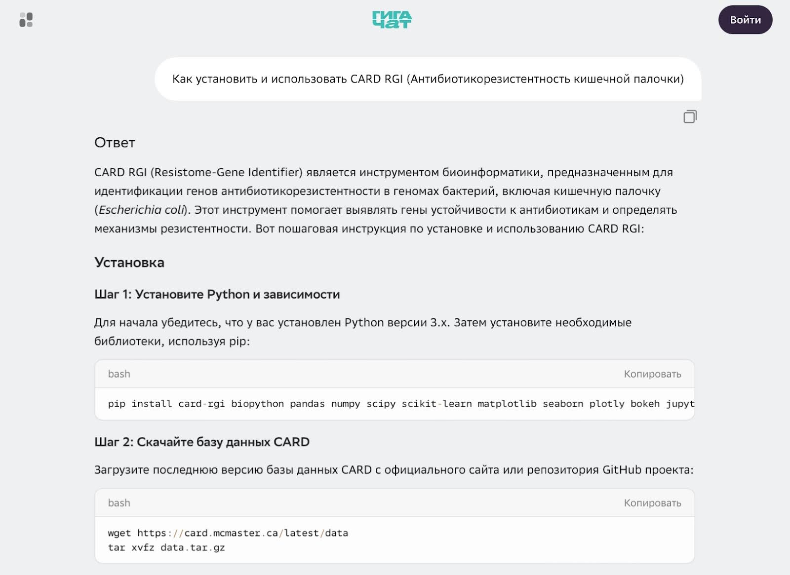
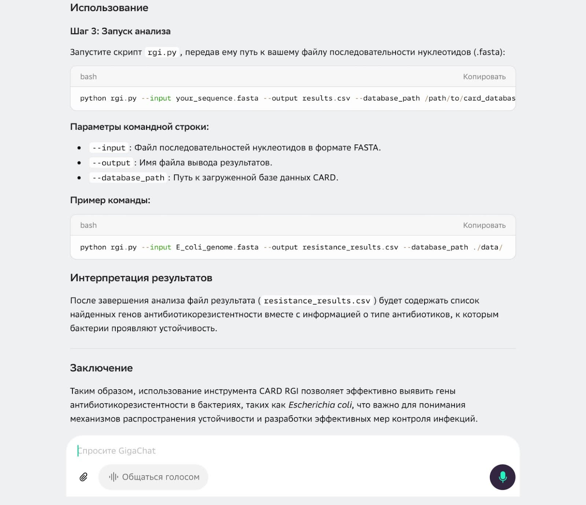
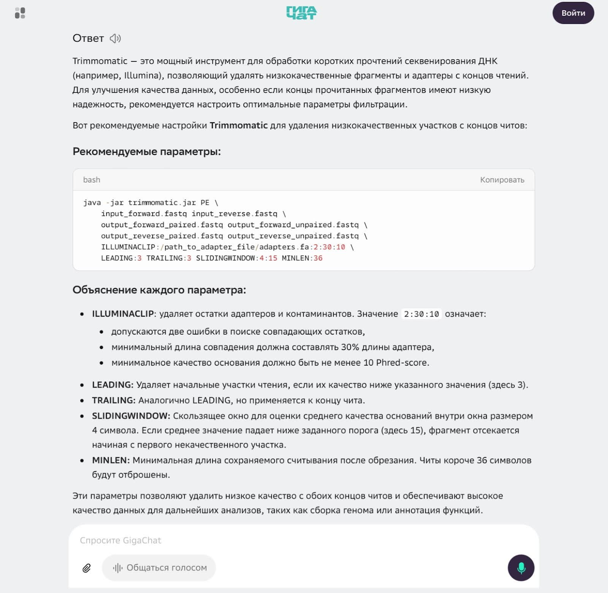
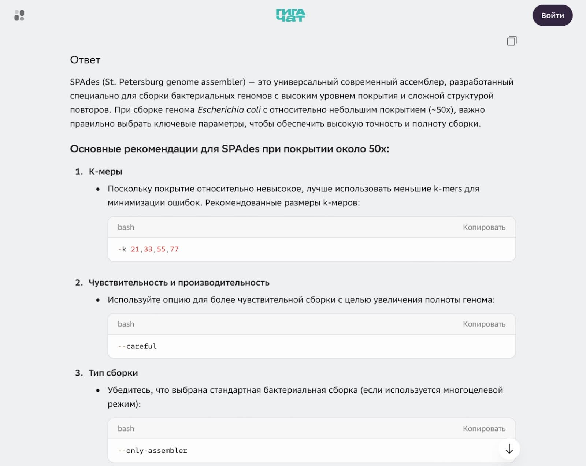
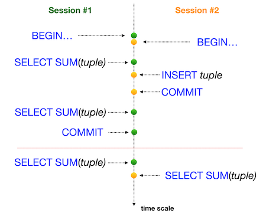
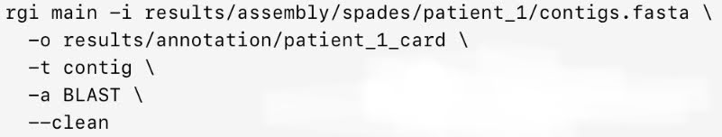
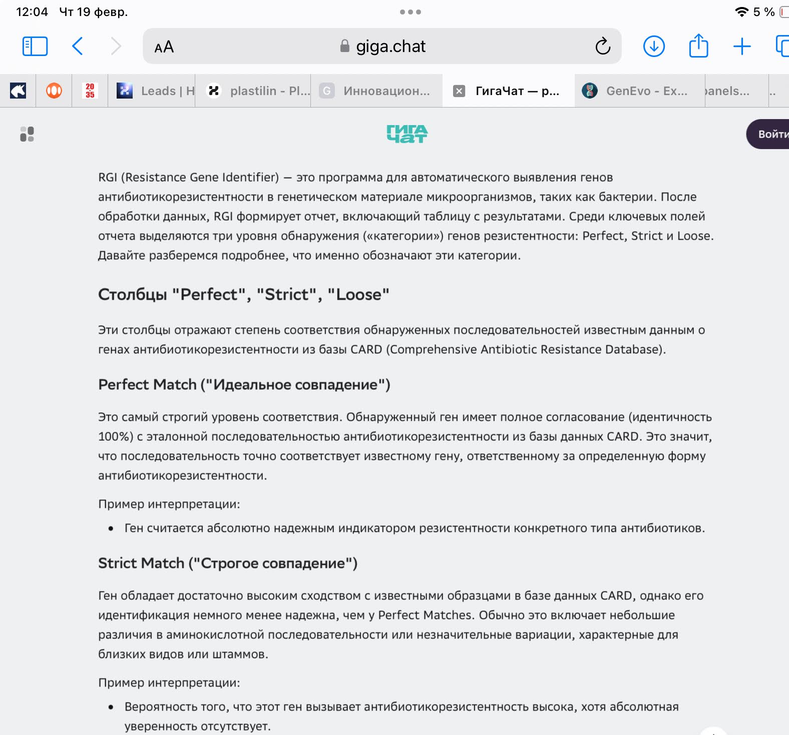
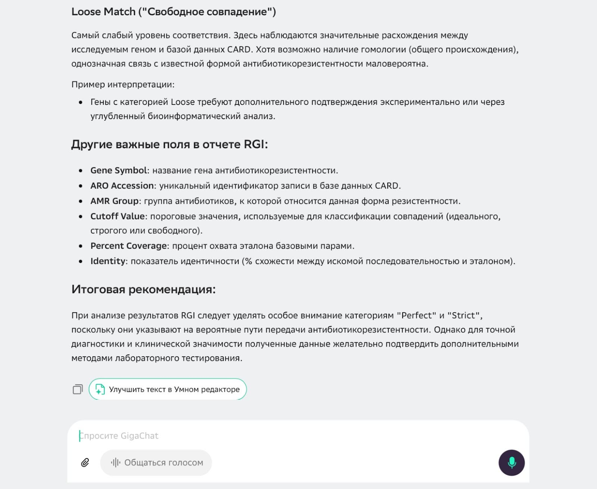
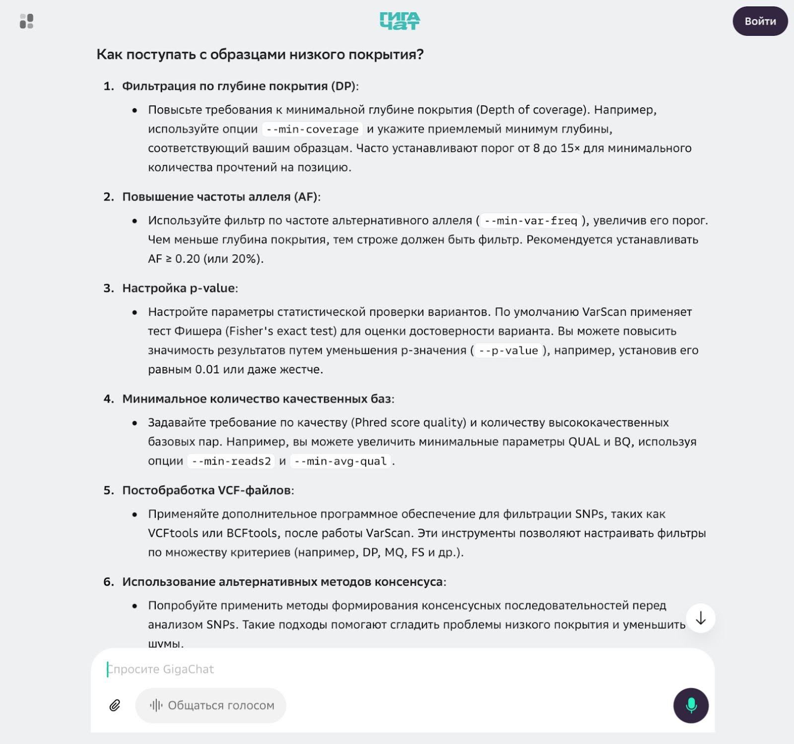
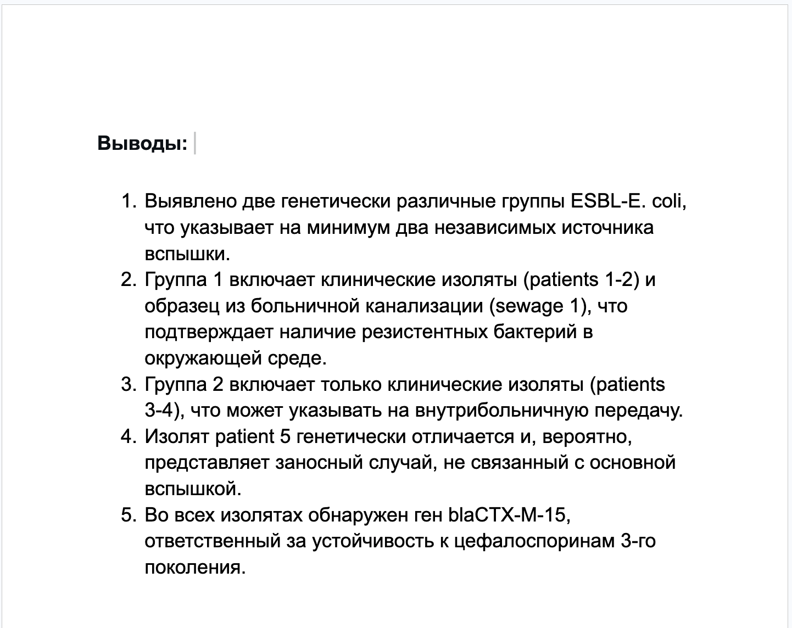

# Исследование вспышки ESBL-E. coli — сборка и гены резистентности

В этом групповом проекте ты в команде исследуешь вспышку ESBL-E. coli. Вам предстоит пройти полный цикл анализа данных: от сырых прочтений до создания простого и понятного отчета. Это является ключевым навыком в прикладной биоинформатике.

Исследования полного цикла — неотъемлемая часть вашей будущей работы. Для биоинформатика важен не только качественный код, но и умение гибко подбирать параметры анализа, исходя из специфики образцов, а также навык грамотной интерпретации полученных результатов.

## Содержание

- [Как учиться в «Школе 21»](#%D0%BA%D0%B0%D0%BA-%D1%83%D1%87%D0%B8%D1%82%D1%8C%D1%81%D1%8F-%D0%B2-%D1%88%D0%BA%D0%BE%D0%BB%D0%B5-21)
- [Chapter I](#chapter-i)
- [Chapter II](#chapter-ii)
  - [Задание 1. Подготовка данных](#%D0%B7%D0%B0%D0%B4%D0%B0%D0%BD%D0%B8%D0%B5-1-%D0%BF%D0%BE%D0%B4%D0%B3%D0%BE%D1%82%D0%BE%D0%B2%D0%BA%D0%B0-%D0%B4%D0%B0%D0%BD%D0%BD%D1%8B%D1%85)
  - [Задание 2. Подготовка данных](#%D0%B7%D0%B0%D0%B4%D0%B0%D0%BD%D0%B8%D0%B5-2-%D0%BF%D0%BE%D0%B4%D0%B3%D0%BE%D1%82%D0%BE%D0%B2%D0%BA%D0%B0-%D0%B4%D0%B0%D0%BD%D0%BD%D1%8B%D1%85)
  - [Задание 3. Поиск и аннотация генов резистентности](#%D0%B7%D0%B0%D0%B4%D0%B0%D0%BD%D0%B8%D0%B5-3-%D0%BF%D0%BE%D0%B8%D1%81%D0%BA-%D0%B8-%D0%B0%D0%BD%D0%BD%D0%BE%D1%82%D0%B0%D1%86%D0%B8%D1%8F-%D0%B3%D0%B5%D0%BD%D0%BE%D0%B2-%D1%80%D0%B5%D0%B7%D0%B8%D1%81%D1%82%D0%B5%D0%BD%D1%82%D0%BD%D0%BE%D1%81%D1%82%D0%B8)
  - [Задание 4. Вариационный анализ и филогения](#%D0%B7%D0%B0%D0%B4%D0%B0%D0%BD%D0%B8%D0%B5-4-%D0%B2%D0%B0%D1%80%D0%B8%D0%B0%D1%86%D0%B8%D0%BE%D0%BD%D0%BD%D1%8B%D0%B9-%D0%B0%D0%BD%D0%B0%D0%BB%D0%B8%D0%B7-%D0%B8-%D1%84%D0%B8%D0%BB%D0%BE%D0%B3%D0%B5%D0%BD%D0%B8%D1%8F)
  - [Задание 5. Визуализация и отчет](#%D0%B7%D0%B0%D0%B4%D0%B0%D0%BD%D0%B8%D0%B5-5-%D0%B2%D0%B8%D0%B7%D1%83%D0%B0%D0%BB%D0%B8%D0%B7%D0%B0%D1%86%D0%B8%D1%8F-%D0%B8-%D0%BE%D1%82%D1%87%D0%B5%D1%82)

## Как учиться в «Школе 21»

- Здесь тебя ждет уникальный образовательный опыт с большим количеством свободы. Ты получаешь задачу и самостоятельно ищешь пути решения, используя любые удобные способы поиска информации — ресурсы интернета или нейросети (например, GigaChat). Но внимательно относись к качеству информации: проверяй, думай, анализируй, сравнивай.
- Взаимообучение (Peer-to-Peer, P2P) — это обмен знаниями и опытом с другими пирами, где каждый выступает и учителем, и учеником. Такой подход позволяет глубже понять материал, учась друг у друга.
- Чувствуй себя свободно и проси о помощи — вокруг тебя те, кто тоже впервые проходят этот путь. Делись своим опытом и идеями с другими. Присоединяйся к RocketChat, чтобы быть в курсе всех новостей от нашего сообщества.
- Твое обучение не будет иметь никакого смысла, если ты будешь копировать чужие решения. Если пользуешься помощью других — всегда разбирайся до конца, почему, как и зачем. Не бойся ошибиться.
- Кажется, что задача невыполнима? Сделай перерыв, проветрись, перезагрузи голову — это помогало многим. Возможно, после этого решение придет само собой.
- Важен не только результат обучения, но и сам процесс. Нужно не просто решить задачу, а понять, КАК ее решить.

Как работать с проектом:

- Перед выполнением проект необходимо склонировать с GitLab в одноименный репозиторий.
- Все файлы необходимо создавать в папке *src/* склонированного репозитория.
- После клонирования проекта необходимо создать ветку develop и вести разработку в ней. После этого пушить в GitLab также нужно ветку develop.
- В твоей директории не должно быть иных файлов, кроме тех, что обозначены в заданиях.

## Chapter I

**День из жизни биоинформатиков: расследование вспышки ESBL-E. coli**

**08:30. Вводная: «Нужно уже вчера»**

Мы только налили себе кофе в лаборатории, как нас вызывают к руководителю. Атмосфера накалена — в городской больнице чрезвычайная ситуация.

Руководитель лаборатории:

*«Коллеги, проблема. В больнице зафиксирована вспышка инфекций, вызванных ESBL-продуцирующей E. coli.*

*Эти бактерии неуязвимы для большинства современных антибиотиков, вроде пенициллинов и цефалоспоринов III–IV поколений. У нас на руках 5 изолятов от разных пациентов и 2 образца из больничной канализации.*

*Нам нужно выяснить: это одна вспышка, общая для всех, или несколько независимых? Какие именно гены дают устойчивость? И самый острый вопрос: передаются ли бактерии от пациентов в окружающую среду (в канализацию) и обратно? Все данные — сырые риды с Illumina. Время — нужно уже вчера».*

Специалист по сборке и аннотации (прикидывая план):

*«Понятно. Значит, стандартный путь: собираем геномы, ищем гены резистентности, сравниваем все изоляты между собой и строим филогенетическое дерево. По нему уже увидим, кто кому “родственник”».*

Специалист по филогенетике и вариационному анализу:

*«Да, но это не просто научный проект, а реальное эпидрасследование. Мы проходим полный цикл: от сырых чтений до презентации для эпидемиологов. Надо будет документировать каждый шаг: команды, параметры, обоснование выбора. Результаты могут пойти в официальный отчет, так что воспроизводимость превыше всего».*

**09:00. Распределение задач**

Специалист по сборке и аннотации:

*«Беру на себя сборку геномов и поиск генов резистентности. Попробую оба сборщика (SPAdes и Velvet), сравню результаты и выберу лучший. Потом аннотирую собранные геномы и буду искать гены ESBL в базе CARD».*

Специалист по филогенетике и вариационному анализу:

*«А я займусь вариационным анализом и филогенией. Сравню изоляты на уровне единичных нуклеотидных замен (SNP), построю дерево. Посмотрим, кластеризуются ли клинические образцы с образцами из канализации. В конце все красиво визуализирую для отчета».*

Специалист по сборке и аннотации:

*«Договорились. И еще раз: документируем каждый шаг!».*

**09:30. Погружение: контроль качества**

Специалист по сборке и аннотации запускает FastQC для всех образцов.

Пока машина думает, копаем теорию.

Специалист по филогенетике и вариационному анализу:

*«Пока FastQC работает, нужно найти больше информации про базу CARD. Я слышала, там есть удобный инструмент для поиска генов резистентности — RGI (Resistance Gene Identifier). Это удобно?».*

Специалист по сборке и аннотации уточняет в интернете:

*«Да, можно скачать базу локально и запустить наши будущие сборки через RGI. Чтобы не ошибиться с установкой, сейчас быстренько уточню у ИИ оптимальную команду».*





**10:30. Результаты FastQC**

Специалист по сборке и аннотации всматривается в графики:

*«FastQC выдал отчеты. Есть нюанс: у двух клинических образцов подозрительно низкое качество на концах ридов. Надо подрезать».*

Специалист по филогенетике и вариационному анализу:

*«Берем стандартный Trimmomatic с базовыми параметрами?»*

Специалист по сборке и аннотации:

*«Для большинства — стандарт. А для этих двух проблемных, наверное, стоит сделать более строгую обрезку, чтобы на вход сборщику пошли только качественные нуклеотиды.*

*Спрошу-ка у ИИ, какие параметры Trimmomatic он посоветует для данных с низким качеством на концах».*



Специалист по сборке и аннотации:

*«Интересный вариант. Учту при выборе параметров».*

**12:00. Выбор между SPAdes и Velvet**

Переходим к ключевому этапу — сборке геномов.

Специалист по филогенетике и вариационному анализу:

*«Итак, у нас два сборщика: SPAdes и Velvet. В чем разница?»*

Специалист по сборке и аннотации:

*«SPAdes обычно лучше для бактериальных геномов, особенно если есть плазмиды — у него есть специальный режим `--plasmid`. Velvet быстрее и может быть лучше для данных с неравномерным покрытием».*

Специалист по филогенетике и вариационному анализу:

*«Давай запустим оба сборщика для всех образцов, а потом сравним результаты. Критерии отбора: метрика N50 (чем выше, тем лучше), количество контигов (чем меньше, тем обычно лучше, если геном не разорван на тысячу кусков), длина самой длинной сборки. И самый главный критерий — сможем ли мы найти в этих сборках все гены резистентности?».*

Специалист по сборке и аннотации:

*«Хорошо. И зафиксируем, почему выбрали тот или иной сборщик для каждого образца».*

**12:30. Мозговой штурм с ИИ: параметры**

Перед запуском SPAdes специалист по сборке и аннотации уточняет у ИИ, какие параметры оптимальны для E. coli с покрытием генома ~50x.

ИИ выдает стандартную рекомендацию:





Специалист по сборке и аннотации:

*«Интересно, что ИИ считает покрытие ~50x небольшим. Хотя по классике для E. coli ~50x — на самом деле достаточно для сборки. Тренд понятен, но я еще подумаю над параметрами».*

Специалист по филогенетике и вариационному анализу:

*«А для Velvet? Я помню, там критичен выбор k-mer».*

Специалист по сборке и аннотации:

*«Мы ранее уже работали с выбором k-mer. Используем опыт и наработки».*

**13:30. Запуск сборок**

Специалист по сборке и аннотации запускает SPAdes и Velvet для всех 7 образцов.

Специалист по филогенетике и вариационному анализу:

*«Долго будет работать. Давай параллельно разберемся с поиском генов резистентности через CARD и скачаем все необходимое».*

**14:30. CARD и RGI: настройка**

Специалист по сборке и аннотации открывает сайт CARD:

*«Сборка готова. Смотри: у них есть веб-версия, можно загрузить файл и получить результат онлайн. Но для 7 образцов и ради воспроизводимости лучше сделать локально. Я уже скачал базу и установил RGI. Давай попробуем сделать пробный запуск».*



Специалист по филогенетике и вариационному анализу:

*«А что означают параметры?»*

Специалист по сборке и аннотации:

*«-t contig — входные данные это контиги;*

*-a BLAST — использовать BLAST для поиска;*

*--clean — удалить временные файлы.*

*На выходе получим таблицу с найденными генами и их позициями».*

**15:00. Первые результаты RGI**

Запуск завершен, и мы вглядываемся в первые строки отчета.

Специалист по сборке и аннотации:

*«Смотри, у patient\_1 нашелся классический CTX-M-15! Это как раз ESBL-ген. И еще несколько: TEM-1, OXA-1. Типичная компания для устойчивой к антибиотикам бактерии».*

Специалист по филогенетике и вариационному анализу:

*«А что у patient\_2? Та же картина?»*

Специалист по сборке и аннотации (сравнивает):

*«Тоже CTX-M-15, но с немного другой последовательностью. Хм… Интересно... Может быть, разные варианты, попавшие в бактерии».*

Специалист по филогенетике и вариационному анализу:

*«Кстати, смотри, в выдаче есть колонки Perfect, Strict и Loose. Надо понять, как интерпретировать результаты RGI».*





Специалист по филогенетике и вариационному анализу (резюмирует):

*«Понятно. Для эпидемиологии важны Perfect и Strict, смотрим в первую очередь на эти колонки. Loose могут быть ложноположительными. Нам нужны только надежные улики».*

**15:30. Подготовка к вариационному анализу**

Специалист по филогенетике и вариационному анализу:

*«Гены резистентности нашли, отлично. Теперь нам нужно сравнить изоляты на уровне SNP. Чтобы понять, кто кому родственник, нам нужна точка отсчета, референсный геном».*

Специалист по сборке и аннотации:

*«Возьмем стандартный E. coli K-12 как референс. Но тогда надо выравнивать наши сборки на него».*

Специалист по филогенетике и вариационному анализу:

*«Да, можно, но все изоляты из одной вспышки, они будут близки к какому-то общему предку. Есть идея: взять за референс одну из наших сборок».*

Специалист по сборке и аннотации делает запрос, использовать внешний референс или одну из сборок.


Специалист по филогенетике и вариационному анализу:

*«Хорошо. Возьмем patient\_1 как референс — у него лучшая сборка и самый полный набор генов резистентности».*

**16:00. Запуск VarScan**

Специалист по филогенетике и вариационному анализу (печатает, почти не глядя на клавиатуру):

*«Итак, поехали по классическому пайплайну для SNP:*

*Индексируем референс, выравниваем каждый образец на референс, конвертируем в ВАМ и сортируем, получаем mpileup, запускаем Varscan для детекции вариантов».*

Специалист по сборке и аннотации:

*«Подожди. А для самого patient\_1 как получить варианты? Он же референс».*

Специалист по филогенетике и вариационному анализу:

*«Для референса вариантов не будет — он точка отсчета. Но мы можем выровнять его риды на самого себя и проверить, нет ли смеси (что маловероятно для чистой культуры). Если выборка чистая, мы не увидим значимых SNP».*

**16:30. Первые проблемы**

Специалист по филогенетике и вариационному анализу (хмурится):

*«Для sewage\_2 VarScan выдает очень много SNP. Что-то не так».*

Специалист по сборке и аннотации:

*«Давай проверим покрытие. Может, низкое качество?»*

Специалист по филогенетике и вариационному анализу быстро считает:

*«Да, покрытие всего 15x, а для patient\_1 — 50x. Это объясняет шум».*

Специалист по сборке и аннотации делает запрос о том, как быть с образцами низкого покрытия в анализе SNP:



Специалист по филогенетике и вариационному анализу:

*«Запускаю повторно с порогом 0.2 и min-coverage 8. Должно отсеять мусор».*

**17:00. Подготовка множественного выравнивания**

Специалист по филогенетике и вариационному анализу:

*«Очищенные SNP по всем образцам готовы. Теперь из всех найденных SNP нам нужно создать множественное выравнивание. Можно использовать snp-sites или написать скрипт на Biopython».*

Специалист по сборке и аннотации:

*«Я видел в тьюториалах, как в BV-BRC это делается в пару кликов: загрузил SNP — получил выравнивание и дерево через MUSCLE и RAxML».*

Специалист по филогенетике и вариационному анализу:

*«У нас нет доступа к BV-BRC, но RAxML мы можем запустить локально».*

Специалист по филогенетике и вариационному анализу с помощью подсказок ИИ пишет Python-скрипт:

```
from Bio import SeqIO, AlignIO
from Bio.Align import MultipleSeqAlignment
import pandas as pd

# Читаем VCF файлы и создаем конкатенированную последовательность SNP.
    # Загружаем референсные позиции.
    # Для каждого образца создаем строку SNP.
        # Читаем VCF, извлекаем позиции с SNP.
        # Создаем строку: 0 — если совпадает с референсом, 1 — если SNP.
        # Сохраняем в FASTA.
```

**17:30. Запуск RAxML**

Специалист по филогенетике и вариационному анализу:

*«Выравнивание готово. Теперь построим дерево в RAxML. Возьму модель GTRGAMMA».*

Специалист по сборке и аннотации:

*«Почему GTRGAMMA?»*

Специалист по филогенетике и вариационному анализу:

*«Это стандартная модель для высокой точности. GTR учитывает разные частоты замен, а гамма-распределение — разную скорость эволюции в разных сайтах. Для SNP-анализа подходит оптимально».*

**18:00. Первый взгляд на дерево**

Специалист по филогенетике и вариационному анализу (открывает полученное дерево):

*«Дерево готово! Смотри, patient\_1, patient\_2 и sewage\_1 образуют одну группу — они почти идентичны. А вот patient\_3 и patient\_4 — это другая группа. А patient\_5 вообще отдельно».*

Специалист по сборке и аннотации:

*«Так-так. Значит, вспышка минимум из двух источников. И самое главное: sewage\_1 попал в ту же группу, что и первые пациенты. Это прямое доказательство: бактерии от пациентов попали в окружающую среду (в канализацию)».*

Специалист по филогенетике и вариационному анализу:

*«Именно так. Теперь это "сырое" дерево нужно упаковать так, чтобы коллеги-эпидемиологи поняли с первого взгляда.*

*Мы ранее уже с ETE Toolkit. Предлагаю покрасить ветви по группам и добавить bootstrap-значения на узлы».*

Специалист по сборке и аннотации:

*«Отлично! Может еще добавить легенду с типами образцов?»*

**19:00. Финальная визуализация**

Специалист по филогенетике и вариационному анализу (показывает экран):

*«Готово. Теперь это не просто дерево, а произведение искусства. Теперь сразу видно: две группы, связь с канализацией, один изолят — сторонний».*

**19:30. Структурирование отчета**

Специалист по сборке и аннотации:

*«Данные есть, визуализация есть. Теперь надо упаковать это в официальный отчет для эпидемиологов. Давай структурируем:*

- Методы: какие образцы были, как собирали, какие программы использовали.
- Результаты сборки: таблица с метриками (N50, количество контигов).
- Гены резистентности: какие ESBL найдены и у кого.
- Филогенетический анализ: дерево с интерпретацией.
- Выводы: сколько групп, есть ли связь с окружающей средой».

Специалист по филогенетике и вариационному анализу:

*«И обязательно раздел «Ограничения»: упомянем про низкое покрытие sewage\_2, возможные ошибки сборки и т. д.»*

**20:00. Формулирование выводов**

Пишем финальные выводы для отчета:



Специалист по филогенетике и вариационному анализу:

*«Итак, мы закончили:*

- *все скрипты и логи;*
- *таблицы с генами резистентности;*
- *филогенетическое дерево с аннотациями;*
- *отчет для эпидемиологов.*

*Вот это и есть профессиональная биоинформатика в эпидемиологии. Готово!».*

## Chapter II

Вашей команде необходимо исследовать вспышку ESBL-E. coli. Все как и в реальной жизни: образцы, ограниченное время, необходимость разбираться в новых инструментах и вывод, который очень важен.

В этом групповом проекте вам предстоит самостоятельно определить роли и распределить задачи.

Программы для работы над данным проектом вам уже знакомы. Из новых программ вам потребуется:

- [CARD RGI](https://card.mcmaster.ca/analyze/rgi).

## Задание 1. Подготовка данных

1. Создайте структуру папок:

- project15
  - results
  - data
  - scripts

2. В папке results создайте файл отчета `report.docx`.

3. Скачайте сырые прочтения 7 образцов из папки data samples. Сохраните их в папку data, не меняйте названия.

4. Самостоятельно изучите вопрос о механизмах ESBL-резистентности: что такое ESBL, какие гены и механизмы действия.

## Задание 2. Подготовка данных

1. Составьте план работы по подготовке данных, опираясь на задачи ниже. В отчет `report.docx` занесите информацию о предполагаемых шагах и наименованиях выходных файлов для каждого из пунктов. Названия файлам формулируйте согласно номеру и подпункту задания и названию образца.
2. Оцените качество сырых данных для всех образцов. Занесите полученные выводы о качестве данных в файл отчета `report.docx`. Сохраните полученные выходные файлы программ в папку results.
3. Выполните триммирование образцов при необходимости, используйте адаптивные параметры для образцов с разным качеством. В файл отчета `report.docx` внесите выводы о необходимости триммирования и используемых параметрах и причинах их выбора (в случае если триммирование необходимо). Сохраните полученные выходные файлы в папку results.
4. Выполните сборку SPAdes. В файл отчета `report.docx` внесите информацию об используемой команде и параметрах, выводы о получившейся сборке. Сохраните полученные выходные файлы программ в папку results.
5. Выполните сборку Velvet. В файл отчета `report.docx` внесите информацию об используемой команде, параметрах и выборе k-mer, выводы о получившейся сборке. Сохраните полученные выходные файлы программ в папку results.
6. Сравните сборки. В файл отчета `report.docx` внесите сравнение N50, количество контигов, длины сборок, внесите выводы о наиболее качественной сборке (выберите лучшую сборку для каждого образца, внесите критерии выбора в файл отчета). Сохраните полученные выходные файлы программ в папку results.

## Задание 3. Поиск и аннотация генов резистентности

1. Используйте лучшую из полученных вами сборок для каждого образца. Запустите поиск генов для всех сборок RGI. Для каждой сборки сохраните результаты выдачи в папку results.
2. Сравните профили резистентности: какие гены общие, какие уникальные. Внесите получившееся сравнение в формате таблицы в файл отчета `report.docx`.
3. Проверьте наличие генов, характерных именно для ESBL: в файле отчета `report.docx` укажите, наличие каких именно генов вы проверяли, также укажите, какие гены и в каких образцах были найдены.
4. На основе сравнения из пункта 2 сделайте собственный вывод о том, какие гены могут являться «ядром» вспышки. Зафиксируйте этот вывод в файле отчета `report.docx`.
5. Разработайте промпт, который на основе ваших данных (файлов выдачи RGI) сможет ответить на вопрос «какие гены могут являться ядром вспышки». При составлении промпта следуйте правилам хорошего промпта. Сохраните скриншот промпта и выдачи (promt\_gene) в папку results.
6. Сравните ваш собственный вывод из пункта 4 с ответом, полученным от ИИ. Сформулируйте ответы на вопросы:

   - С чем вы согласны в ответе ИИ и почему?
   - С чем вы не согласны и почему (укажите конкретные расхождения)?
   - Какие важные нюансы (например, низкое качество сборки одного из образцов) ИИ мог упустить или неверно интерпретировать?

В файл отчета `report.docx` внесите:

- итоговую оценку: какой ответ (ваш или ИИ) более точен и почему?

## Задание 4. Вариационный анализ и филогения

1. Выберите референсный геном. В файле отчета `report.docx` укажите, какой геном был выбран в качестве референсного и почему (обратите внимание на логику действий коллег из истории выше).
2. Выполните выравнивание всех образцов на референс, подготовьтесь к вызову вариантов. В файл отчета `report.docx` внесите: информацию о предполагаемых шагах и наименованиях выходных файлов для каждого из пунктов. Названия файлам рекомендуем присваивать согласно номеру и подпункту задания и названию образца.
3. Проведите вызов вариантов с помощью VarScan. Сохраните полученные файлы выдачи в папку results. Названия файлам рекомендуем присваивать согласно номеру и подпункту задания и названию образца. В файл отчета `report.docx` внесите информацию об используемой команде.
4. Напишите скрипт для сравнения SNP (по VCF-файлам) в целевых генах, определенных вами как возможное «ядро» вспышки, для образцов.

Работа с ИИ как с «парным программистом»:

Составьте промпт для ИИ, который сгенерирует основу скрипта.

Полученный от ИИ скрипт не копируйте слепо. Вы должны:

- Добавить подробные комментарии на русском языке к каждой логической строке кода, объясняющие, что делает эта часть.
- Протестировать скрипт на одном из ваших VCF-файлов.
- Если скрипт работает некорректно, уточнить промпт и попросить ИИ исправить ошибки.
- В отчете указать, какие изменения вы внесли в сгенерированный код и почему.

Сохраните итоговый скрипт с вашими комментариями в папку scripts.

1. Создайте множественное выравнивание. Сохраните полученное выравнивание в папку results.

2. Постройте филогенетическое дерево RAxML, используйте 100 bootstrap. Сохраните полученное дерево в папку results. В файл отчета `report.docx` внесите информацию об использованной модели и почему была выбрана именно такая модель.

Работа с ИИ: если вы не уверены в выборе модели, запросите у ИИ консультацию с обязательным обоснованием. Пример промпта: *«Для филогенетического анализа 7 бактериальных геномов на основе SNP я планирую использовать RAxML. Какие модели нуклеотидных замен (GTRGAMMA, GTRCAT и др.) подходят для моих данных? От чего зависит выбор модели? Объясни так, чтобы я мог принять обоснованное решение».*

3. Оцените bootstrap-поддержку. В файл отчета `report.docx` внесите, какие узлы надежны и почему.

4. В файл отчета `report.docx` внесите выводы о кластеризации образцов.

## Задание 5. Визуализация и отчет

1. Визуализируйте дерево с помощью ETE Toolkit: цветовая маркировка, bootstrap, легенда. Сохраните скриншот полученного дерева в папку results.

2. Определите количество филогенетических групп среди изолятов. Сформулируйте выводы (группа - образец) : например, «группа 1 - sewage\_1, patient\_2»

Работа с ИИ как с редактором:

Составьте промпт для ИИ, который поможет улучшить ваш черновик. Пример промпта: *«Ты научный редактор с опытом в эпидемиологии. Перепиши следующий черновой текст вывода в формальный, четкий и профессиональный стиль для научного отчета. Используй термины 'филогенетическая группа', 'кластер', 'изолят', 'эпидемиологическая связь'. Вот мой черновик: [вставьте ваш текст]. Сохрани все фактические данные, улучши только стиль изложения».*

Полученный от ИИ отредактированный текст проанализируйте:

- Не добавил ли ИИ фактов, которых нет в ваших данных (галлюцинации)?
- Не потерялся ли важный нюанс (например, низкое качество sewage\_2)?
- Соответствует ли стиль требованиям к научному отчету?

Внесите итоговый, проверенный вами вариант выводов в файл отчета `report.docx`.

3. В файл отчета `report.docx` внесите ответ на вопрос: есть ли связь между клиническими и экологическими образцами?

4. Вопросы, которые мог бы задать тимлид. Подготовьте свои ответы к P2P-проверке:

- *«На каких этапах проекта ИИ оказался наиболее полезен и почему?»*
- *«С какими ограничениями и рисками ИИ вы столкнулись (приведите 1–2 конкретных примера из вашего опыта)?»*
- *«Как вы проверяли достоверность информации, полученной от ИИ?»*