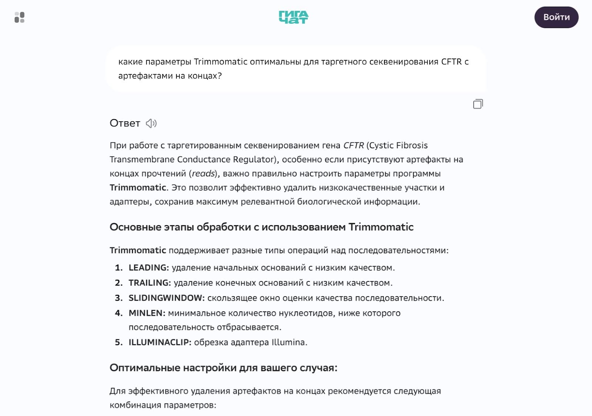
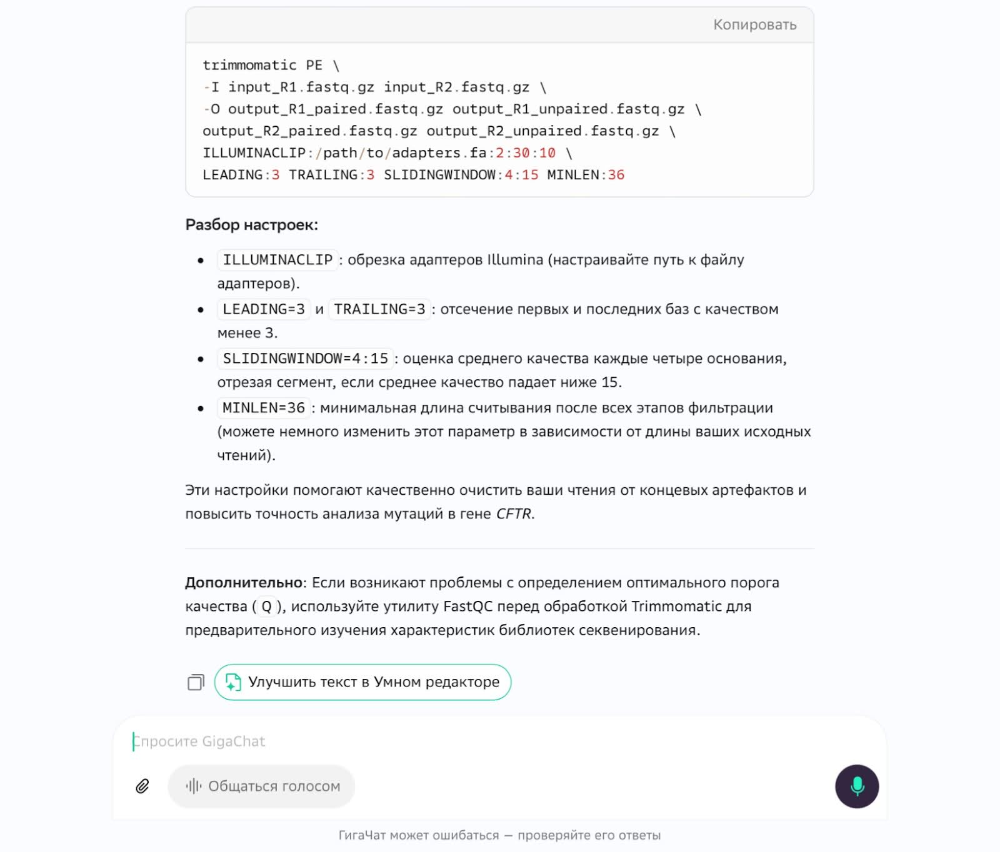
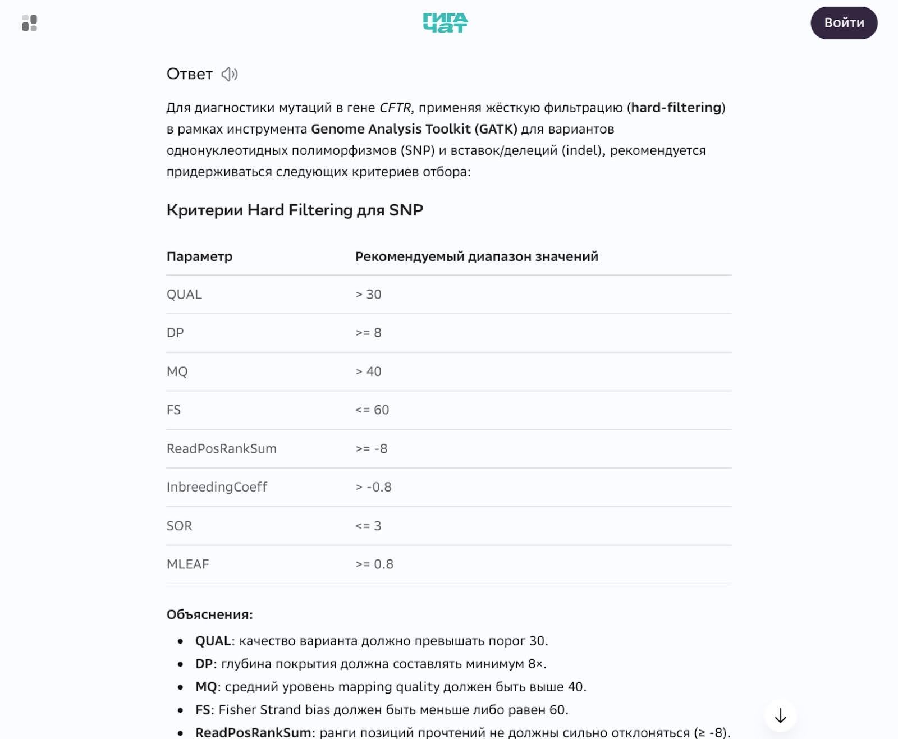
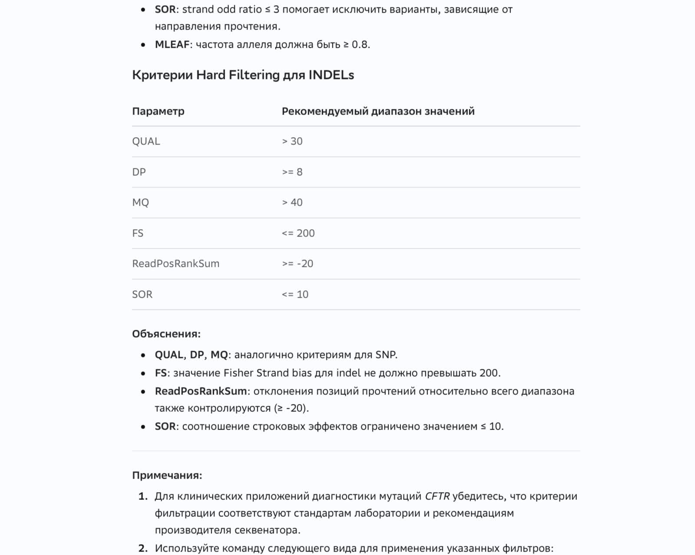
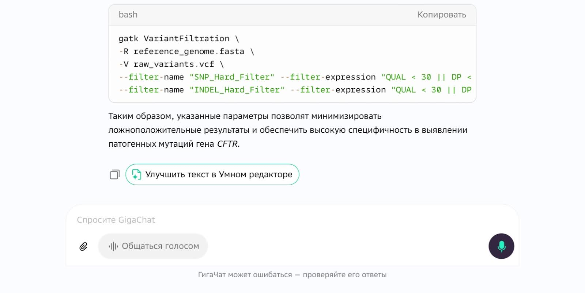

# Диагностика вариантов CFTR - корреляция генотипа с тяжестью заболевания

Это финальный проект. В нем ваша команда проведет полный цикл клинико-биоинформатического анализа: от сырых NGS-данных до интерпретации вариантов гена CFTR и оценки их связи с тяжестью муковисцидоза.

Муковисцидоз — одно из самых распространенных наследственных заболеваний в европейской популяции. Тяжесть клинических проявлений напрямую зависит от того, какой вариант (или комбинация вариантов) в гене CFTR достался пациенту. Ваша задача — установить эту связь на реальных данных.

## Содержание

- [Как учиться в «Школе 21»](#%D0%BA%D0%B0%D0%BA-%D1%83%D1%87%D0%B8%D1%82%D1%8C%D1%81%D1%8F-%D0%B2-%D1%88%D0%BA%D0%BE%D0%BB%D0%B5-21)
- [Chapter I](#chapter-i)
- [Chapter II](#chapter-ii)
  - [Задание 1. Подготовка данных](#%D0%B7%D0%B0%D0%B4%D0%B0%D0%BD%D0%B8%D0%B5-1-%D0%BF%D0%BE%D0%B4%D0%B3%D0%BE%D1%82%D0%BE%D0%B2%D0%BA%D0%B0-%D0%B4%D0%B0%D0%BD%D0%BD%D1%8B%D1%85)
  - [Задание 2. Картирование и оценка качества](#%D0%B7%D0%B0%D0%B4%D0%B0%D0%BD%D0%B8%D0%B5-2-%D0%BA%D0%B0%D1%80%D1%82%D0%B8%D1%80%D0%BE%D0%B2%D0%B0%D0%BD%D0%B8%D0%B5-%D0%B8-%D0%BE%D1%86%D0%B5%D0%BD%D0%BA%D0%B0-%D0%BA%D0%B0%D1%87%D0%B5%D1%81%D1%82%D0%B2%D0%B0)
  - [Задание 3. Идентификация и фильтрация вариантов](#%D0%B7%D0%B0%D0%B4%D0%B0%D0%BD%D0%B8%D0%B5-3-%D0%B8%D0%B4%D0%B5%D0%BD%D1%82%D0%B8%D1%84%D0%B8%D0%BA%D0%B0%D1%86%D0%B8%D1%8F-%D0%B8-%D1%84%D0%B8%D0%BB%D1%8C%D1%82%D1%80%D0%B0%D1%86%D0%B8%D1%8F-%D0%B2%D0%B0%D1%80%D0%B8%D0%B0%D0%BD%D1%82%D0%BE%D0%B2)
  - [Задание 4. Клиническая интерпретация](#%D0%B7%D0%B0%D0%B4%D0%B0%D0%BD%D0%B8%D0%B5-4-%D0%BA%D0%BB%D0%B8%D0%BD%D0%B8%D1%87%D0%B5%D1%81%D0%BA%D0%B0%D1%8F-%D0%B8%D0%BD%D1%82%D0%B5%D1%80%D0%BF%D1%80%D0%B5%D1%82%D0%B0%D1%86%D0%B8%D1%8F)
  - [Задание 5. Филогения и визуализация](#%D0%B7%D0%B0%D0%B4%D0%B0%D0%BD%D0%B8%D0%B5-5-%D1%84%D0%B8%D0%BB%D0%BE%D0%B3%D0%B5%D0%BD%D0%B8%D1%8F-%D0%B8-%D0%B2%D0%B8%D0%B7%D1%83%D0%B0%D0%BB%D0%B8%D0%B7%D0%B0%D1%86%D0%B8%D1%8F)

## Как учиться в «Школе 21»

- Здесь тебя ждет уникальный образовательный опыт с большим количеством свободы. Ты получаешь задачу и самостоятельно ищешь пути решения, используя любые удобные способы поиска информации — ресурсы интернета или нейросети (например, GigaChat). Но внимательно относись к качеству информации: проверяй, думай, анализируй, сравнивай.
- Взаимообучение (Peer-to-Peer, P2P) — это обмен знаниями и опытом с другими пирами, где каждый выступает и учителем, и учеником. Такой подход позволяет глубже понять материал, учась друг у друга.
- Чувствуй себя свободно и проси о помощи — вокруг тебя те, кто тоже впервые проходят этот путь. Делись своим опытом и идеями с другими. Присоединяйся к RocketChat, чтобы быть в курсе всех новостей от нашего сообщества.
- Твое обучение не будет иметь никакого смысла, если ты будешь копировать чужие решения. Если пользуешься помощью других — всегда разбирайся до конца, почему, как и зачем. Не бойся ошибиться.
- Кажется, что задача невыполнима? Сделай перерыв, проветрись, перезагрузи голову — это помогало многим. Возможно, после этого решение придет само собой.
- Важен не только результат обучения, но и сам процесс. Нужно не просто решить задачу, а понять, КАК ее решить.

Как работать с проектом:

- Перед выполнением проект необходимо склонировать с GitLab в одноименный репозиторий.
- Все файлы необходимо создавать в папке *src/* склонированного репозитория.
- После клонирования проекта необходимо создать ветку develop и вести разработку в ней. После этого пушить в GitLab также нужно ветку develop.
- В твоей директории не должно быть иных файлов, кроме тех, что обозначены в заданиях.

## Chapter I

**День из жизни биоинформатиков: диагностика вариантов CFTR**

**08:30. Вводная: «У нас пять пациентов — нужен ответ к обходу»**

Лаборатория молекулярной диагностики. Утренняя планерка.

Руководитель отдела ставит задачу:

*«Итак, коллеги, к нам поступили NGS-данные от пяти пациентов с подозрением на муковисцидоз. У каждого — парные риды с Illumina, секвенирование таргетное: покрыт весь ген CFTR.*

*Задача: найти патогенные варианты, оценить их по ClinVar и дать клиническое заключение — какой генотип у пациентов, какой фенотипический класс тяжести прогнозировать. Результаты нужны завтра к утреннему обходу. Время пошло».*

Специалист по картированию (в уме уже прокручивает пайплайн):

*«Ясно, двигаемся по стандартному клиническому пайплайну: получаем FASTQ, проводим QC, картируем на hg38 с геном CFTR. Затем сортируем и индексируем BAM-файлы, оцениваем покрытие. Будем вызывать варианты через GATK HaplotypeCaller, потом фильтрация, аннотация — и в ClinVar за клинической значимостью».*

Специалист по клинической интерпретации:

*«Да, но для нас это не просто биоинформатический пайплайн — это реальная медицинская диагностика. Каждый шаг должен быть задокументирован: команды, параметры, обоснование. Наши результаты лягут в историю болезни, поэтому наш приоритет — воспроизводимость».*

Снова разделяемся по задачам.

Специалист по картированию:

*«Беру на себя контроль качества, триммирование и картирование. Попробую Bowtie2 для таргетных данных — он быстрее для небольших регионов. Как только получу чистые BAM-файлы, оценю покрытие и передам эстафету для вызова вариантов».*

Специалист по клинической интерпретации:

*«А я займусь GATK: вызов вариантов, фильтрация артефактов, аннотация через ClinVar. Потом самая интересная часть: классификация патогенности и корреляция «генотип-фенотип». Еще построю филогенетическое дерево по найденным вариантам. Интересно, есть ли между этими пятью изолятами родственные связи».*

Руководитель (напоминает):

*«Отлично. Работаем. И да — каждый шаг документируем».*

**09:30. Получение данных и контроль качества**

Специалист по картированию запускает FastQC для всех образцов и параллельно скачивает референсный геном hg38.

Специалист по клинической интерпретации (листая браузер):

*«Пока QC работает, посмотрим в базе NCBI, какие публичные FASTQ по CFTR есть в SRA. Нам нужны данные с нормальной глубиной покрытия, ≥30x для таргетного региона».*

Спустя 10 минут специалист по картированию вглядывается в графики FastQC:

*«FastQC выдал отчеты. Вижу: у трех образцов хорошее качество, у двух — классика жанра для таргетного секвенирования: просадка по качеству на 3'-концах и небольшие проблемы с дупликатами. Ничего критичного, применим Trimmomatic с адаптивными параметрами».*

Специалист по клинической интерпретации:

*«Если сомневаешься в параметрах для обрезания концов, можно уточнить у ИИ, какие настройки сейчас считаются оптимальными именно для таргетных данных с такими артефактами».*





**10:00. Картирование на референс**

Специалист по картированию (смотрит на монитор, где одна за другой завершаются задачи):

*«Триммирование завершено. Теперь самое важное — правильно посадить риды на референс. Запускаю Bowtie2 для картирования на hg38 — только регион CFTR (chr7:117,480,000–117,668,000). Чтобы не пропустить сложные делеции или вставки, добавлю флаг `--very-sensitive`».*

```
# Индексирование референса (регион CFTR)
bowtie2-build cftr_region_hg38.fa cftr_index

# Картирование
bowtie2 -x cftr_index -1 sample_R1_trimmed.fastq.gz \
        -2 sample_R2_trimmed.fastq.gz \
        --very-sensitive -p 8 | \
    samtools view -bS | samtools sort -o sample.sorted.bam

# Индексирование BAM
samtools index sample.sorted.bam
```

Специалист по клинической интерпретации (не отрываясь от своего терминала):

*«Пока Bowtie2 грузит процессор, я уже проверила покрытие через samtools depth. Для клинической диагностики CFTR нам нужно покрытие ≥20x во всех экзонах — если хоть один экзон просядет, можем потерять вариант. При муковисцидозе это цена жизни».*

**12:00. Вызов вариантов: GATK HaplotypeCaller**

Специалист по клинической интерпретации (сверяет логи):

*«Картирование готово, покрытие хорошее у 4 из 5 образцов. У sample\_3 в экзоне 11 покрытие 14x — ниже порога. Отметим в отчете как ограничение».*

Специалист по картированию:

*«Тогда для sample\_3 буду аккуратнее с вызовом. Запускаю HaplotypeCaller для каждого образца в режиме -ERC GVCF, затем объединю все и проведу совместное генотипирование. Это стандартный клинический протокол для когорты — так мы видим даже редкие варианты».*

**13:30. Фильтрация: отсекаем варианты**

Специалист по картированию:

*«VCF-файлы готовы. Варианты есть, но нужна фильтрация. Можно было бы запустить VQSR, но для пяти образцов обучающей выборки маловато — модель не натренируешь нормально. Будем использовать жесткую фильтрацию по критериям: QD < 2.0, FS > 60, MQ < 40, глубина покрытия < 20.*

*Запрошу у ИИ рекомендуемые пороговые значения для CFTR-диагностики».*







**14:30. ClinVar: клиническая интерпретация**

Специалист по клинической интерпретации (напряженно вглядываясь в таблицу):

*«Фильтрация пройдена. Теперь самое интересное: аннотация через ClinVar. Открываю базу и сверяю каждый найденный вариант».*

| Вариант | Образец | Класс ClinVar |
| --- | --- | --- |
| F508del (c.1521\_1523del) | sample\_1, sample\_2 | Патогенный (5) |
| G542X (c.1624G>T) | sample\_3 | Патогенный (5) |
| R117H (c.350G>A) | sample\_4 | Патогенный/мягкий (3/4) |
| 5T аллель (IVS8) | sample\_4 | Вероятно патогенный |
| p.Ala455Glu | sample\_5 | Патогенный |

Специалист по картированию:

*«Насколько я помню, F508del - самая частая мутация при муковисцидозе, 70% всех аллелей у пациентов европейского происхождения. У нас сразу два пациента с ней. А вот фенотипы нам предстоит поискать и дополнить таблицу».*

**15:30. Построение филогении по CFTR-вариантам**

Специалист по клинической интерпретации (переключая контекст):

*«Давай копнем глубже. Мало просто найти мутации — надо понять, как эти гаплотипы CFTR связаны между собой эволюционно. Вдруг у sample\_1 и sample\_2 общий предок? Возьмем SNP-сайты из нашего отфильтрованного VCF, сделаем множественное выравнивание и запустим RAxML. Построим дерево».*

**16:30. Визуализация ETE Toolkit**

Специалист по картированию (колдует над графикой):

*«Дерево готово. Теперь визуализирую через ETE Toolkit: раскрашу ветви по классу тяжести фенотипа (красный — тяжелый, оранжевый — умеренный, зеленый — легкий), добавлю bootstrap-значения и аннотацию вариантов прямо на узлах. Эпидемиологи должны понять с первого взгляда».*

**17:30. Формулировка отчета**

Специалист по клинической интерпретации:

*Данные есть, дерево построено, варианты классифицированы. Собираем отчет для клиницистов:*

- Методы: образцы, референс, инструменты, параметры фильтрации.
- Результаты картирования: таблица покрытия по образцам и экзонам.
- Обнаруженные варианты: таблица с классификацией ClinVar.
- Филогенетическое дерево с аннотацией тяжести.
- Клиническое заключение: генотип → предполагаемый фенотипический класс.
- Ограничения: низкое покрытие в sample\_3 экзон 11; VUS в sample\_5.

*Все. Завтра на обходе они скажут спасибо. Или зададут вопросы. Готовимся отвечать».*

## Chapter II

Это финальный проект в программе, в котором вашей команде необходимо воспроизвести клинический пайплайн диагностики вариантов гена CFTR.

Все как в реальной жизни: публичные NGS-данные, клинические стандарты фильтрации и вывод, который может повлиять на лечебную тактику.

Проект максимально приближен к реальной задаче, которую вам может поставить руководитель лаборатории или научный консультант. После него — только экзамен. Поэтому:

- каждое решение должно быть обосновано;
- каждый параметр задокументирован;
- каждый вывод проверен.

Самостоятельно распределите роли внутри команды и задачи.

Все используемые программы для выполнения заданий вам уже знакомы по предыдущим проектам.

## Задание 1. Подготовка данных

1. Создайте структуру папок:

- project16
  - results
  - data
  - scripts

2. В папке results создайте файл отчета `report.docx`.

3. Получите сырые FASTQ-файлы для 5 образцов из папки data\_samples. Сохраните файлы в папку data, не изменяя названия.

4. Скачайте референсный геном (только регион CFTR) и файл аннотации гена. Сохраните `reference.fasta` и `CFTR_hg38.gtf` в папку data.

5. Самостоятельно изучите вопрос: что такое муковисцидоз, какова роль гена CFTR, какие классы вариантов существуют (I–VI) и как они связаны с тяжестью заболевания. Занесите краткое резюме в файл отчета `report.docx`.

## Задание 2. Картирование и оценка качества

1. Составьте план работы по картированию. В отчет `report.docx` внесите предполагаемые шаги и наименования выходных файлов для каждого пункта. Названия файлам формулируйте согласно номеру и подпункту задания и названию образца.

2. Оцените качество сырых данных для всех 5 образцов. В отчет внесите выводы о качестве: уровень Phred, наличие адаптеров, дубликаты. Сохраните выходные файлы в папку results.

3. При необходимости выполните триммирование. Используйте адаптивные параметры для образцов с разным качеством. В отчете `report.docx` укажите: для каких образцов применялось триммирование (если применялось), какие параметры использовались и почему. Сохраните выходные файлы в папку results.

4. Выполните картирование отфильтрованных ридов на референс. В отчет внесите: программу, команду, ключевые параметры, процент картировавшихся ридов для каждого образца. Сохраните отсортированные и индексированные BAM-файлы в папку results.

**Работа с ИИ:**

*Если нужна помощь с подбором параметров Bowtie2 для таргетного секвенирования, используйте промпт: «Я картирую таргетные риды (CFTR) на регион hg38 с помощью \_\_\_\_. *Данные парные, \_* bp.* *Порекомендуй параметры для максимальной чувствительности при поиске инделей. Объясни, почему эти параметры предпочтительны».*

Важно: решение принимаете вы. ИИ — только консультант.

5. Оцените глубину покрытия с помощью samtools depth. Создайте сводную таблицу покрытия по образцам (средняя глубина, % с покрытием ≥20x). Внесите таблицу в отчет `report.docx`. Укажите образцы или регионы, где покрытие недостаточно, и обоснуйте, как это повлияет на интерпретацию результатов.

## Задание 3. Идентификация и фильтрация вариантов

1. Выполните вызов вариантов с помощью GATK HaplotypeCaller для каждого образца. Подберите режим, затем объедините все GVCF-файлы и проведите совместное генотипирование. Выходные VCF-файлы сохраните в папку results. В отчет внесите использованные команды.

2. Выполните разделение VCF на SNP и индели. Примените жесткую фильтрацию, обосновав параметры и пороги. В отчет `report.docx` внесите: количество вариантов до и после фильтрации, обоснование выбора пороговых значений.

3. Разработайте промпт для ИИ, который поможет обосновать выбор параметров фильтрации для клинической диагностики CFTR. При составлении промпта следуйте правилам качественного промпта. Сохраните скриншот промпта и ответа ИИ (promt\_filter) в папку results.

4. Сравните свой выбор параметров с рекомендациями ИИ. В отчет `report.docx` внесите:

- С чем вы согласны в ответе ИИ и почему?
- С чем не согласны (конкретные расхождения)?
- Какие клинически важные нюансы ИИ мог не учесть?
- Итоговая оценка: какой подход к фильтрации более обоснован с клинической точки зрения?

## Задание 4. Клиническая интерпретация

1. Для каждого отфильтрованного варианта выполните поиск в базе ClinVar. Сопоставьте найденные варианты с записями ClinVar и определите их клиническую значимость (патогенный, вероятно патогенный, VUS, доброкачественный). Для определения клинической значимости варианта необходимо работать в соответствии с ACMG критериями и учитывать популяционную частоту варианта в том числе.

2. В отчете `report.docx` добавьте заполненную таблицу со столбцами:

| Образец | Вариант | Локализация (экзон/интрон) | Класс ClinVar | Ожидаемый фенотипический класс тяжести | Примечания |
| --- | --- | --- | --- | --- | --- |
|  |  |  |  |  |  |

3. На основе таблицы сформулируйте клиническое заключение для каждого пациента: какой генотип обнаружен (гомозигота/гетерозигота), какой фенотип ожидается (здоров/болен/носитель), есть ли терапевтические мишени (например, для класса III - потенциальный ответ на модуляторы CFTR) - для этого вам понадобится подробнее изучить информацию о заболевании и терапиях, используя данные в интернете.

4. Если для одного или нескольких образцов обнаружен VUS (вариант неопределенной значимости), укажите в отчете:

- Почему этот вариант трудно интерпретировать?
- Какие дополнительные данные могли бы помочь в классификации (функциональные исследования, базы данных, частоты в популяции и т. д.)?
- Клинические риски неопределенности для конкретного пациента.

5. Напишите скрипт для автоматического сравнения вариантов из VCF-файла с локальной копией базы ClinVar (ClinVar VCF release). Для составления скрипта используйте работу с ИИ как с парным программистом. Составьте качественный промпт для генерации основы скрипта. Скрипт должен:

- читать входной VCF с отфильтрованными вариантами;
- искать каждый вариант в ClinVar VCF по позиции и нуклеотидному изменению;
- выводить вариант, клиническую значимость по ClinVar и связанное заболевание.

Полученный код не копируйте слепо. Вы должны:

- добавить подробные комментарии на русском языке к каждому логическому блоку кода;
- протестировать скрипт на одном из ваших VCF-файлов;
- если скрипт работает некорректно, уточнить промпт и попросить ИИ исправить ошибки.

В отчете укажите, какие изменения вы внесли в сгенерированный код и почему.

Итоговый скрипт с комментариями сохраните в папку scripts.

Скриншот промпта и ответа ИИ (promt\_clinvar) сохраните в папку results.

## Задание 5. Филогения и визуализация

1. Выберите референсный гаплотип для построения дерева. В отчете report.docx обоснуйте выбор: почему именно этот образец или опубликованная последовательность CFTR взята за точку отсчета.

2. Создайте множественное выравнивание на основе SNP из отфильтрованного VCF. Выравнивание сохраните в папку results.

3. Постройте филогенетическое дерево с помощью RAxML, используйте модель GTRGAMMA и 100 bootstrap-репликаций. В отчете укажите выбранную модель и обоснуйте ее. Файл дерева сохраните в папку results.

**Работа с ИИ**

Если сомневаетесь в выборе модели, используйте промпт: *«Для филогенетического анализа 5 образцов CFTR на основе SNP я планирую использовать RAxML. Подходит ли модель GTRGAMMA для данных из одного гена? Какие альтернативы существуют? Нужно обоснование для выбора».*

4. Оцените bootstrap-поддержку. В отчете укажите, какие узлы дерева надежны и какие выводы из этого следуют для интерпретации родства гаплотипов.

5. Визуализируйте дерево с помощью ETE Toolkit. Скриншот итогового дерева сохраните в папку results. Визуализация должна включать:

- цветовую маркировку ветвей по классу тяжести фенотипа (тяжелый/умеренный/легкий/VUS);
- bootstrap-значения на узлах;
- аннотацию вариантов прямо на листьях дерева;
- легенду с описанием цветовой схемы.

6. Определите количество гаплотипических групп. Сформулируйте выводы: есть ли образцы со схожими гаплотипами? Соответствует ли кластеризация клинической тяжести? Внесите выводы в отчет `report.docx`.

7. Работа с ИИ как с редактором:

Составьте промпт для ИИ, который поможет улучшить черновик выводов. При составлении промпта следуйте правилам качественного промпта. Сохраните полученный промпт и скриншот выдачи promt\_advise в папку results.

Проанализируйте полученный текст: не добавил ли ИИ несуществующих данных (галлюцинации)? Не потерялись ли важные ограничения (VUS, низкое покрытие)? Внесите проверенный вариант в отчет.

8. Резюмируйте пройденный цикл и в отчете `report.docx` сформулируйте ответ на главный вопрос исследования: есть ли корреляция между обнаруженными генотипами CFTR и ожидаемой тяжестью заболевания? Какие генотипы ассоциированы с наиболее тяжелыми фенотипами?

9. Вопросы, которые мог бы задать тимлид. Подготовьте ответы к P2P-проверке:

- *«Как вы решали, какой вариант считать патогенным, а какой — VUS? Какими критериями руководствовались?»*
- *«Почему глубина покрытия является клинически значимым ограничением именно для CFTR-диагностики?»*
- *«На каких этапах ИИ оказался наиболее полезен и почему? С какими рисками ИИ вы столкнулись?»*
- *«Если бы у пациента с VUS вы были лечащим врачом, какое решение приняли бы на основании только этих данных?»*

---

**Вы с командой прошли полный цикл: от сырых FASTQ до интерпретации, от сомнений в параметрах до финального заключения.**

**Это был твой завершающий учебный проект в рамках программы «Биоинформатика». Далее только P2P-проверка и затем выход на экзамен по всей программе.**