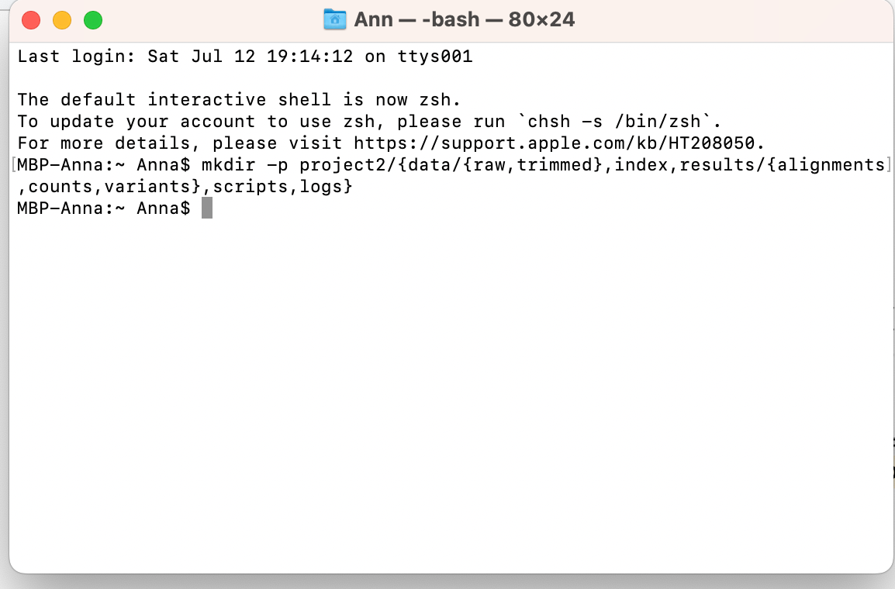
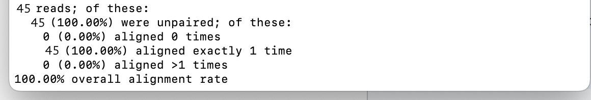
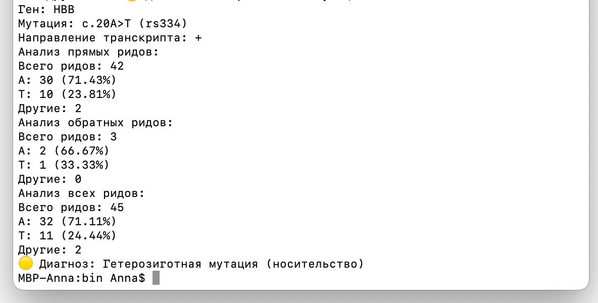

# Анализ гена HBB (β-глобин) — поиск мутаций, связанных с серповидноклеточной анемией

В этом проекте тебе предстоит анализировать данные человеческого генома и определять заболевшего пациента на основе специально смоделированных данных — навыки, востребованные в персонализированной медицине, генетической инженерии и фармацевтике.

Ты научишься проверять качество и фильтровать данные, использовать hisat2 для выравнивания последовательностей, samtools для преобразования и сортировки форматов SAM и BAM, а также samtools и Biopython для выявления генетических вариантов.

💡 [Нажми сюда](https://new.oprosso.net/p/4cb31ec3f47a4596bc758ea1861fb624), **чтобы поделиться с нами обратной связью на этот проект**. Это анонимно и поможет нашей команде сделать обучение лучше. Рекомендуем заполнить опрос сразу после выполнения проекта.

## Содержание

- [Как учиться в «Школе 21»](#%D0%BA%D0%B0%D0%BA-%D1%83%D1%87%D0%B8%D1%82%D1%8C%D1%81%D1%8F-%D0%B2-%D1%88%D0%BA%D0%BE%D0%BB%D0%B5-21)
- [Chapter I](#chapter-i)
  - [День из жизни биоинформатика: загадка пациента](#%D0%B4%D0%B5%D0%BD%D1%8C-%D0%B8%D0%B7-%D0%B6%D0%B8%D0%B7%D0%BD%D0%B8-%D0%B1%D0%B8%D0%BE%D0%B8%D0%BD%D1%84%D0%BE%D1%80%D0%BC%D0%B0%D1%82%D0%B8%D0%BA%D0%B0-%D0%B7%D0%B0%D0%B3%D0%B0%D0%B4%D0%BA%D0%B0-%D0%BF%D0%B0%D1%86%D0%B8%D0%B5%D0%BD%D1%82%D0%B0)
- [Chapter II](#chapter-ii)
  - [Задание 1. Оценка качества секвенирования](#%D0%B7%D0%B0%D0%B4%D0%B0%D0%BD%D0%B8%D0%B5-1-%D0%BE%D1%86%D0%B5%D0%BD%D0%BA%D0%B0-%D0%BA%D0%B0%D1%87%D0%B5%D1%81%D1%82%D0%B2%D0%B0-%D1%81%D0%B5%D0%BA%D0%B2%D0%B5%D0%BD%D0%B8%D1%80%D0%BE%D0%B2%D0%B0%D0%BD%D0%B8%D1%8F)
  - [Задание 2. Улучшение качества секвенирования (очистка чтений)](#%D0%B7%D0%B0%D0%B4%D0%B0%D0%BD%D0%B8%D0%B5-2-%D1%83%D0%BB%D1%83%D1%87%D1%88%D0%B5%D0%BD%D0%B8%D0%B5-%D0%BA%D0%B0%D1%87%D0%B5%D1%81%D1%82%D0%B2%D0%B0-%D1%81%D0%B5%D0%BA%D0%B2%D0%B5%D0%BD%D0%B8%D1%80%D0%BE%D0%B2%D0%B0%D0%BD%D0%B8%D1%8F-%D0%BE%D1%87%D0%B8%D1%81%D1%82%D0%BA%D0%B0-%D1%87%D1%82%D0%B5%D0%BD%D0%B8%D0%B9)
  - [Задание 3. Подготовка к выравниванию](#%D0%B7%D0%B0%D0%B4%D0%B0%D0%BD%D0%B8%D0%B5-3-%D0%BF%D0%BE%D0%B4%D0%B3%D0%BE%D1%82%D0%BE%D0%B2%D0%BA%D0%B0-%D0%BA-%D0%B2%D1%8B%D1%80%D0%B0%D0%B2%D0%BD%D0%B8%D0%B2%D0%B0%D0%BD%D0%B8%D1%8E)
  - [Задание 4. Построение индекса hisat2](#%D0%B7%D0%B0%D0%B4%D0%B0%D0%BD%D0%B8%D0%B5-4-%D0%BF%D0%BE%D1%81%D1%82%D1%80%D0%BE%D0%B5%D0%BD%D0%B8%D0%B5-%D0%B8%D0%BD%D0%B4%D0%B5%D0%BA%D1%81%D0%B0-hisat2)
  - [Задание 5. Выравнивание с hisat2](#%D0%B7%D0%B0%D0%B4%D0%B0%D0%BD%D0%B8%D0%B5-5-%D0%B2%D1%8B%D1%80%D0%B0%D0%B2%D0%BD%D0%B8%D0%B2%D0%B0%D0%BD%D0%B8%D0%B5-%D1%81-hisat2)
  - [Задание 6. Конвертация SAM-BAM и сортировка](#%D0%B7%D0%B0%D0%B4%D0%B0%D0%BD%D0%B8%D0%B5-6-%D0%BA%D0%BE%D0%BD%D0%B2%D0%B5%D1%80%D1%82%D0%B0%D1%86%D0%B8%D1%8F-sam-bam-%D0%B8-%D1%81%D0%BE%D1%80%D1%82%D0%B8%D1%80%D0%BE%D0%B2%D0%BA%D0%B0)
  - [Задание 7. Поиск вариантов (мутаций)](#%D0%B7%D0%B0%D0%B4%D0%B0%D0%BD%D0%B8%D0%B5-7-%D0%BF%D0%BE%D0%B8%D1%81%D0%BA-%D0%B2%D0%B0%D1%80%D0%B8%D0%B0%D0%BD%D1%82%D0%BE%D0%B2-%D0%BC%D1%83%D1%82%D0%B0%D1%86%D0%B8%D0%B9)
  - [Задание 8. Визуализация и проверка в геномном браузере](#%D0%B7%D0%B0%D0%B4%D0%B0%D0%BD%D0%B8%D0%B5-8-%D0%B2%D0%B8%D0%B7%D1%83%D0%B0%D0%BB%D0%B8%D0%B7%D0%B0%D1%86%D0%B8%D1%8F-%D0%B8-%D0%BF%D1%80%D0%BE%D0%B2%D0%B5%D1%80%D0%BA%D0%B0-%D0%B2-%D0%B3%D0%B5%D0%BD%D0%BE%D0%BC%D0%BD%D0%BE%D0%BC-%D0%B1%D1%80%D0%B0%D1%83%D0%B7%D0%B5%D1%80%D0%B5)

## Как учиться в «Школе 21»

- Здесь тебя ждет уникальный образовательный опыт с большим количеством свободы. Ты получаешь задачу и самостоятельно ищешь пути решения, используя любые удобные способы поиска информации — ресурсы интернета или нейросети (например, GigaChat). Но внимательно относись к качеству информации: проверяй, думай, анализируй, сравнивай.
- Взаимообучение (Peer-to-Peer, P2P) — это обмен знаниями и опытом с другими пирами, где каждый выступает и учителем, и учеником. Такой подход позволяет глубже понять материал, учась друг у друга.
- Чувствуй себя свободно и проси о помощи — вокруг тебя те, кто тоже впервые проходят этот путь. Делись своим опытом и идеями с другими. Присоединяйся к RocketChat, чтобы быть в курсе всех новостей от нашего сообщества.
- Твое обучение не будет иметь никакого смысла, если ты будешь копировать чужие решения. Если пользуешься помощью других — всегда разбирайся до конца, почему, как и зачем. Не бойся ошибиться.
- Кажется, что задача невыполнима? Сделай перерыв, проветрись, перезагрузи голову — это помогало многим. Возможно, после этого решение придет само собой.
- Важен не только результат обучения, но и сам процесс. Нужно не просто решить задачу, а понять, КАК ее решить.

Как работать с проектом:

- Перед выполнением проект необходимо склонировать с GitLab в одноименный репозиторий.
- Все файлы необходимо создавать в папке *src/* склонированного репозитория.
- После клонирования проекта необходимо создать ветку develop и вести разработку в ней. После этого пушить в GitLab также нужно ветку develop.
- В твоей директории не должно быть иных файлов, кроме тех, что обозначены в заданиях.

## Chapter I

### День из жизни биоинформатика: загадка пациента

**10:30 утра. Новая задача**

За чашкой кофе получаю сообщение от клинического генетика:

«У нас три образца пациентов, одному из них стало плохо при подъеме в горы! Подозреваем серповидноклеточную анемию».

*P.S. Что такое серповидноклеточная анемия? — подробнее в папке Materials.*

**11:00. Подготовка данных**

Открываю терминал и создаю структуру проекта. Предстоит много обработки, а значит, много файлов, каждый из которых должен быть на своем месте.



**11:10. Получение файлов**

Генетик присылает файлы. Опять не уточнили, что же это: секвенирование РНК или ДНК! Мне нравится работать с сырыми данными реальных пациентов, ведь я, используя лишь свой компьютер, могу помочь коллегам-врачам поставить диагноз.

*P.S. Правила работы с реальными данными пациента и отличия секвенирования ДНК от секвенирования РНК — подробнее в папке Materials.*

**11:30. Контроль качества**

Запускаю FastQC и вижу проблему. Адаптеры Illumina. Их надо удалить, иначе они помешают выравниванию. Trimmomatic справится с этим, но важно выбрать правильные параметры. Удаляю адаптеры и запускаю FastQC для очищенных чтений. Теперь порядок!

**12:30. Выравнивание**

Скачиваю аннотации и референсный геном.

Строю индекс в hisat2 — обязательный шаг перед выравниванием. Индекс запоминает все уникальные слова (k-mers) и их места в геноме. А когда появляется новый рид, hisat2 быстро смотрит в индекс и находит подходящие позиции.

Индекс очень сокращает время поиска, он сжат и оптимизирован (FM-индекс, граф де Брейна), так что даже сложные риды (с вариантами (содержащими или нет мутации) или сплайсингом) выравниваются правильно.

Обычно я строю индекс один раз — использую для множества образцов. Главное — сначала hisat2-build (создай индекс), потом hisat2 (выравнивай).

Для секвенирования РНК критически важно учитывать сплайсинг. Извлекаю сайты сплайсинга из аннотаций (gtf-файла), иначе выравнивание экзонов будет некорректным. Вариант (мутация) находится в экзоне 1 гена HBB, поэтому пропуск интронов должен быть точным.

**13:30. Результаты выравнивания**

Наконец-то выравнивание завершено! Что же я вижу?



Всего было обработано 45 ридов (прочтений). Все риды одиночные (unpaired) — то есть данные single-end (не paired-end). 0 (0.00%) aligned 0 times — 0 ридов не выровнялись на референсный геном. 45 (100.00%) — все 45 ридов выровнялись ровно 1 раз (уникальное выравнивание).

Это хорошо: нет множественных выравниваний (когда рид попадает в несколько мест генома). 0 (0.00%) aligned >1 times — ни один рид не выровнялся более 1 раза. Значит, нет проблем с повторяющимися регионами генома. 100.00% overall alignment rate — общий процент успешного выравнивания — 100%. Это отличный результат (все риды нашли свое место в геноме).

Что это значит для моего анализа?

Данные очень чистые:

- Нет «потерянных» ридов (все выровнялось).
- Нет множественных выравниваний (риды уникальны).
- Однако если ридов слишком мало, статистика может быть нерепрезентативной.

Коллеги молодцы!

Отправляю им молекулярного биолога в костюме супермена с припиской «Отличная работа! Лосей и прочей дичи в данных не замечено!».

 \
*Источник: изображение создано алгоритмом искусственного интеллекта Kandinsky 3.1.*

Теперь у меня есть результаты выравнивания ридов (коротких прочтений ДНК/РНК) на референсный геном, которые hisat2 выдал мне в формате SAM.

Дело за малым — сконвертировать в ВАМ, отсортировать и проиндексировать. Использую [Samtools](http://www.htslib.org/doc/samtools.html).

- **Преобразую SAM в BAM.**

  Сжимаю и упаковываю текстовый файл в бинарный формат BAM — компактный и быстрый для компьютера.
- **Сортирую BAM.**

  Упорядочиваю прочтения по координатам генома, чтобы мгновенно находить нужные участки.
- **Индексирую BAM.**

  Создаю индекс — маленький файл, который позволяет быстро прыгать к нужным данным.

Теперь необработанный хаос превратился в удобный, быстрый и готовый к анализу ресурс.

**14:30. Время писать код**

Подготовка завершена, прочтения готовы к анализу — приступаю к анализу.

Самое время искать вариант (мутацию) в гене HBB — нужно проверить конкретную позицию. Использую интернет, чтобы свериться с тем, какая позиция у rs334 (серповидноклеточная анемия). Даже при 100% alignment rate вариант (мутация) может отсутствовать, если ридов мало и они не покрывают нужную позицию. Нужно учесть все нюансы при написании скрипта.

Задаю параметры анализа:

- указываю позицию варианта (мутации):
- загружаю индексированный BAM-файл, референсный аллель и направление транскрипта гена (+/-).

Использую samtools для анализа strand-specific данных. Нужно учесть: пропуск unmapped ридов, определить направление рида, фильтр по strand-specificity, парсинг позиции в риде и коррекцию направления для «-» цепи.

Включаю в выдачу информацию об анализе: «Всего ридов», «Прямых ридов», «Обратных ридов», «Количество референсных аллелей», «Количество мутантных Т».

Возвращаю данные для диагностики. Прописываю основной анализ: анализ провожу по направлениям транскрипта гена (+, -, both). В диагностику включаю следующие критерии:

- Если аллелей 0 — данных по этой позиции нет.
- Если доля мутантных аллелей более 0,7 — гомозиготная мутация (патология).
- Если доля мутантных аллелей от 0,25 до 0,7 — гетерозиготная мутация (носительство).
- Если доля мутантных аллелей больше 0, но ниже 0,25 — обнаружены следы мутации, однако ниже клинически значимого порога, требуется перепроверка.
- Если мутантные аллели не найдены — «нормальный генотип».

**16:00. Поиск вариантов (мутации)**

Запускаю кастомный скрипт для первого пациента в терминале:



Теперь можно сделать перерыв на кофе. Опасения генетиков подтвердились. Гетерозиготный носитель. Но надо бы перепроверить.

**17:00. Финализация данных оставшихся пациентов**

Возвращаюсь к оставшимся двум пациентам. Повторяю свои действия. Теперь настало время для визуализации в JBrowse2. Открываю браузер для финальной проверки.

Ключевые наблюдения:

1. У пациента 1 — смесь A/T (примерно 50/50).
2. У пациента 2 — (верхняя дорожка) — почти все риды несут аллель T.
3. У пациента 3 — только аллель A.

**18:00. Итоговый отчет**

Отправляю заключение генетику:

- P01 — A/T — Носительство.
- P02 — T/T — Серповидноклеточная анемия.
- P03 — A/A — Норма.

Конечно же, помню и транслирую коллегам еще раз, что все выводы требуют клинического подтверждения. Биоинформатический анализ — лишь один этап диагностики, т. к. за каждым образцом стоит человек, и ошибка в интерпретации может изменить чью-то жизнь.

**19:00. Окончание дня**

Выключаю компьютер и думаю о том, насколько все-таки важна моя работа. Сегодня мне удалось не просто проанализировать данные, а подтвердить причину болезни пациента Р02, выяснить, что беспокоит P01, и дать P03 уверенность, что с этим заболеванием у него все в порядке.

Каждый раз убеждаюсь, что за каждым FASTQ-файлом стоит история человека. Завтра будет новый день, новые данные, но этот принцип останется неизменным.

## Chapter II

Теперь пора перейти к практике. Ты получишь «сырые» данные трех пациентов. Эти данные созданы с помощью специальной программы и очень похожи на реальные. Твоя задача — выяснить, есть ли среди них человек с серповидноклеточной анемией, или все здоровы, а может, кто-то является носителем.

Готовься разобраться!

Для работы тебе понадобятся:

1. Установленный Python (рекомендуется версия 3.8+).
2. Установленный [Biopython](https://biopython.org/wiki/Download) ([документация тут](https://biopython.org/docs/1.75/api/index.html)).
3. Программа [FasQC](https://www.bioinformatics.babraham.ac.uk/projects/fastqc/).
4. Программа [Trimmomatic](http://www.usadellab.org/cms/?page=trimmomatic).
5. Программа [hisat2](https://anaconda.org/bioconda/hisat2/files).
6. Программа [Samtools](http://www.htslib.org/).
7. Программа [JBrowse2](https://jbrowse.org/jb2/download/).

## Задание 1. Оценка качества секвенирования

Оцени качество секвенирования участков гена HBB трех «пациентов» с помощью программы FastQC.

1. Создай структуру папок:

- project2
  - results
  - data
  - index
  - script

2. Открой папку data-samples. Скачай 3 файла с «сырыми» данными пациентов. Пожалуйста, не переименовывай их. Помести эти файлы в папку data.

3. С помощью FastQC проведи анализ данных секвенирования. Все полученные файлы результатов помещай в папку results, название файла приводи согласно пациенту и пункту и подпункту задания (например, `1patient1_3.html` или `2patient1_3.html`).

4. Отметь, какие критичные проблемы (красный статус) тебе удалось обнаружить при анализе в FastQC для пациента 1patient:

- Basic Statistics.
- Per base sequence quality.
- Per sequence quality scores.
- Per base sequence content.
- Per sequence GC content.
- Per base N content.
- Sequence length distribution.
- Sequence duplication levels.
- Overrepresented sequence.
- Adapter content.

Отметь, какие проблемы для пациента 1patient требуют внимания (оранжевый статус):

- Basic Statistics.
- Per base sequence quality.
- Per sequence quality scores.
- Per base sequence content.
- Per sequence GC content.
- Per base N content.
- Sequence length distribution.
- Sequence duplication levels.
- Overrepresented sequence.
- Adapter content.

5. Отметь, какие критичные проблемы (красный статус) тебе удалось обнаружить при анализе в FastQC для пациента 2patient:

- Basic Statistics.
- Per base sequence quality.
- Per sequence quality scores.
- Per base sequence content.
- Per sequence GC content.
- Per base N content.
- Sequence length distribution.
- Sequence duplication levels.
- Overrepresented sequence.
- Adapter content.

Отметь, какие проблемы для пациента 2patient требуют внимания (оранжевый статус):

- Basic Statistics.
- Per base sequence quality.
- Per sequence quality scores.
- Per base sequence content.
- Per sequence GC content.
- Per base N content.
- Sequence length distribution.
- Sequence duplication levels.
- Overrepresented sequence.
- Adapter content.

6. Отметь, какие критичные проблемы (красный статус) тебе удалось обнаружить при анализе в FastQC для пациента 3patient:

- Basic Statistics.
- Per base sequence quality.
- Per sequence quality scores.
- Per base sequence content.
- Per sequence GC content.
- Per base N content.
- Sequence length distribution.
- Sequence duplication levels.
- Overrepresented sequence.
- Adapter content.

Отметь, какие проблемы для пациента 3patient требуют внимания (оранжевый статус):

- Basic Statistics.
- Per base sequence quality.
- Per sequence quality scores.
- Per base sequence content.
- Per sequence GC content.
- Per base N content.
- Sequence length distribution.
- Sequence duplication levels.
- Overrepresented sequence.
- Adapter content.

## Задание 2. Улучшение качества секвенирования (очистка чтений)

Тебе нужно улучшить качество секвенирования участков гена HBB трех «пациентов» и подготовить их к выравниванию с помощью программы trimmomatic.

1. Теперь твоя задача — улучшить качество чтений. Для этого используй программу Trimmomatic. Все полученные после триммирования файлы помести в папку data, название файла приводи согласно пациенту и пункту и подпункту задания. Если что-то забылось с предыдущего проекта — используй [мануал](http://www.usadellab.org/cms/uploads/supplementary/Trimmomatic/TrimmomaticManual_V0.32.pdf).

Обрати внимание на адаптеры и распределение длины чтений!

2. Запусти FastQC и проведи анализ для каждого «пациента» после триммирования. Сохрани файлы отчетов в папку results, название файла приводи согласно пациенту и пункту и подпункту задания.

## Задание 3. Подготовка к выравниванию

В этом задании ты научишься определять референсный геном для построения индекса и дальнейшему анализу.

1. Для ускорения анализа в качестве референса скачай только ту хромосому, в которой может находиться вариант (мутация). В какой хромосоме находится вариант (мутация)?

Для скачивания файла используй [ссылку](https://hgdownload.soe.ucsc.edu/goldenPath/hg38/chromosomes/chrN), замени **N** на номер хромосом .[fa.gz](http://fa.gz).

Распакуй полученный файл и помести его в папку data.

## Задание 4. Построение индекса hisat2

В этом задании ты научишься строить индекс hisat2 для хромосомы.

Для построения индекса тебе потребуется ранее скачанный файл хромосомы. Проводи построение в папке index.

***Важно!***

Если у тебя скачанный hisat2 по ссылке, а не установленный через anaconda: проверь в файлах hisat, для какого python или perl они написаны.

Установи perl для запуска или исправь python на python3 в файлах.

## Задание 5. Выравнивание с hisat2

В этом задании тебе нужно будет выровнять свои прочтения на референсный геном с помощью [hisat2](http://daehwankimlab.github.io/hisat2/manual/). Так ты определишь, какие участки референсного генома перекрываются прочтениями.

1. Проведи выравнивание с hisat2 для каждого файла пациента, полученного после триммирования. Для каждого из них скопируй отчет в формате ниже. Сохрани полученные файлы результатов в папку results, называй файлы согласно пациенту и пункту и подпункту задания.

```
Х reads; of these:
    У (У%) were unpaired;
        Z (Z%) aligned 0 times
        W (W%) aligned exactly 1 time
        A (A%) aligned >1 times
B% overall alignment rate
```

2. Скопируй отчет работы hisat2 для 1patient.

3. Скопируй отчет работы hisat2 для 2patient.

4. Скопируй отчет работы hisat2 для 3patient.

5. Вопрос, который спросил бы твой тимлид:

*«Какие проблемы могут повлиять на дальнейший анализ? Объясни, как они могут сказаться на анализе».*

Подготовь подробный ответ к P2P-проверке. Обрати внимание, что общего с твоим кейсом есть в истории героя-биоинформатика из предыдущей главы.

## Задание 6. Конвертация SAM-BAM и сортировка

Для выполнения задания используй [Samtools](http://www.htslib.org/doc/samtools.html).

1. Конвертируй получившийся SAM-файл для каждого пациента в ВАМ. Назови файлы согласно пациенту и пункту и подпункту задания и сохрани их в папку results.

2. Проведи сортировку всех полученных ВАМ-файлов. Назови полученные отсортированные файлы согласно пациенту и пункту и подпункту задания и сохрани их в папку results.

3. Проведи индексацию всех отсортированных ВАМ-файлов. Назови полученные проиндексированные файлы согласно пациенту и пункту и подпункту задания и сохрани их в папку results.

## Задание 7. Поиск вариантов (мутаций)

Теперь тебе нужен скрипт для анализа варианта rs334. Поскольку в этот раз ты работаешь лишь с небольшими чтениями (обычно их сотни), то в данном скрипте сосредоточься лишь на анализе вариантов (мутации) без проверки покрытия и порогов значимости, что тебе точно понадобится при работе с реальными данными. Ты освоишь это позднее.

При составлении скрипта можно либо сделать его универсальным для всех файлов patient (тогда скрипт будет анализировать их в рамках одного запуска), либо задавать анализируемый файл.

Сейчас тебе нужны только фактические частоты аллелей.

***Важно!*** Samtools mpileup не всегда учитывает все прочтения, покрывающие позицию из-за особенностей обработки. Тебе нужна инициализация счетчиков и точный подсчет аллелей.

1. Напиши скрипт для анализа наличия варианта (мутации). Укажи позицию варианта rs334 в хромосоме в формате chr\_\_:*\_*\_\_ (найди информацию о позиции в интернете).

В качестве формата вывода скрипта используй пример из истории героя-биоинформатика в предыдущей главе.

```
Анализ прямых ридов:
Всего ридов: 42
A: 30 (71.43%)
T: 10 (23.81%)
Другие: 2

Анализ обратных ридов:
Всего ридов: 3
A: 2 (66.67%)
T: 1 (33.33%)
Другие: 0

Анализ всех ридов:
Всего ридов: 45
A: 32 (71.11%)
T: 11 (24.44%)
Другие: 2
```

2. Для каждого пациента укажи предполагаемый диагноз:

- для пациента 1patient;
- для пациента 2patient;
- для пациента 3patient.

## Задание 8. Визуализация в геномном браузере

В этом задании тебе нужно проверить результаты анализа своего скрипта с помощью геномного браузера [JBROWSE2](https://jbrowse.org/jb2/download/).

1. Загрузи референсный геном hg38 и добавь треки — индексированные BAM-файлы «пациентов» и их индексы.

2. Обрати внимание на позицию варианта (мутации): подтвердились ли выводы твоего скрипта?

Опиши для каждого пациента:

- общее количество аллелей в позиции варианта (мутации);
- количество референсных аллелей (REF);
- количество мутантных аллелей.

3. Для каждого пациента укажи предполагаемый диагноз согласно анализу JBROWSE2:

- для пациента 1patient;
- для пациента 2patient;
- для пациента 3patient.

4. Вопрос, который спросил бы твой тимлид:

*«Какие дополнительные наблюдения у тебя есть по итогам анализа данных пациентов в JBROWSE2?»*

Подготовь подробный ответ к P2P-проверке. Обрати внимание на выдачу JBROWSE2 и на цветовое выделение.

---

💡 [Нажми сюда](https://new.oprosso.net/p/4cb31ec3f47a4596bc758ea1861fb624), **чтобы поделиться с нами обратной связью на этот проект**. Это анонимно и поможет нашей команде сделать обучение лучше. Рекомендуем заполнить опрос сразу после выполнения проекта.