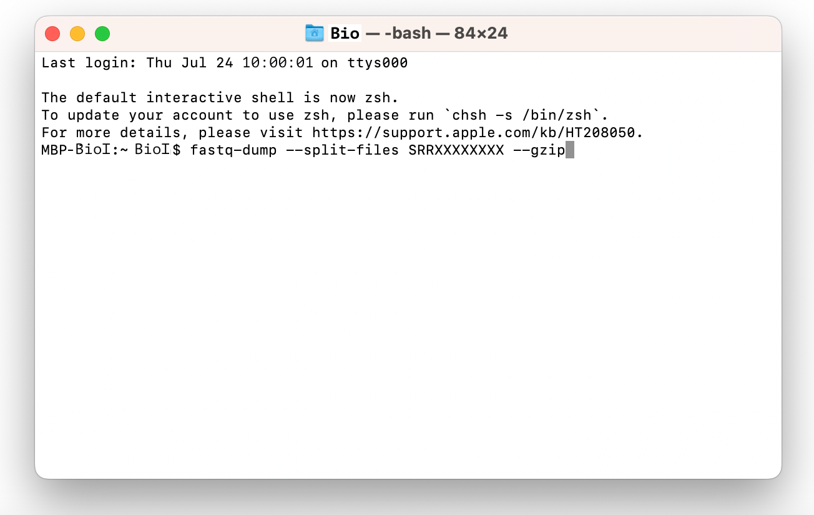

# Сборка генома бактерии — сравнение с референсом

В этом проекте ты научишься собирать геном опасного патогена E. coli O157:H7 с помощью биоинформатических инструментов, анализировать его структурные отличия от безопасного штамма K-12 и визуализировать результаты.

Навык сборки генома необходим специалисту, чтобы:

1. Разрабатывать диагностические тесты.
2. Создавать вакцины.
3. Понимать механизмы заражения.

💡 [Нажми сюда](https://new.oprosso.net/p/4cb31ec3f47a4596bc758ea1861fb624), **чтобы поделиться с нами обратной связью на этот проект**. Это анонимно и поможет нашей команде сделать обучение лучше. Рекомендуем заполнить опрос сразу после выполнения проекта.

## Содержание

- [Как учиться в «Школе 21»](#%D0%BA%D0%B0%D0%BA-%D1%83%D1%87%D0%B8%D1%82%D1%8C%D1%81%D1%8F-%D0%B2-%D1%88%D0%BA%D0%BE%D0%BB%D0%B5-21)
- [Chapter I](#chapter-i)
  - [День из жизни биоинформатика: охота за опасными генами в E. coli](#%D0%B4%D0%B5%D0%BD%D1%8C-%D0%B8%D0%B7-%D0%B6%D0%B8%D0%B7%D0%BD%D0%B8-%D0%B1%D0%B8%D0%BE%D0%B8%D0%BD%D1%84%D0%BE%D1%80%D0%BC%D0%B0%D1%82%D0%B8%D0%BA%D0%B0-%D0%BE%D1%85%D0%BE%D1%82%D0%B0-%D0%B7%D0%B0-%D0%BE%D0%BF%D0%B0%D1%81%D0%BD%D1%8B%D0%BC%D0%B8-%D0%B3%D0%B5%D0%BD%D0%B0%D0%BC%D0%B8-%D0%B2-e-coli)
- [Chapter II](#chapter-ii)
  - [Задание 1. Скачивание файлов секвенирования](#%D0%B7%D0%B0%D0%B4%D0%B0%D0%BD%D0%B8%D0%B5-1-%D1%81%D0%BA%D0%B0%D1%87%D0%B8%D0%B2%D0%B0%D0%BD%D0%B8%D0%B5-%D1%84%D0%B0%D0%B9%D0%BB%D0%BE%D0%B2-%D1%81%D0%B5%D0%BA%D0%B2%D0%B5%D0%BD%D0%B8%D1%80%D0%BE%D0%B2%D0%B0%D0%BD%D0%B8%D1%8F)
  - [Задание 2. Оценка качества секвенирования](#%D0%B7%D0%B0%D0%B4%D0%B0%D0%BD%D0%B8%D0%B5-2-%D0%BE%D1%86%D0%B5%D0%BD%D0%BA%D0%B0-%D0%BA%D0%B0%D1%87%D0%B5%D1%81%D1%82%D0%B2%D0%B0-%D1%81%D0%B5%D0%BA%D0%B2%D0%B5%D0%BD%D0%B8%D1%80%D0%BE%D0%B2%D0%B0%D0%BD%D0%B8%D1%8F)
  - [Задание 3. Улучшение качества секвенирования (очистка чтений)](#%D0%B7%D0%B0%D0%B4%D0%B0%D0%BD%D0%B8%D0%B5-3-%D1%83%D0%BB%D1%83%D1%87%D1%88%D0%B5%D0%BD%D0%B8%D0%B5-%D0%BA%D0%B0%D1%87%D0%B5%D1%81%D1%82%D0%B2%D0%B0-%D1%81%D0%B5%D0%BA%D0%B2%D0%B5%D0%BD%D0%B8%D1%80%D0%BE%D0%B2%D0%B0%D0%BD%D0%B8%D1%8F-%D0%BE%D1%87%D0%B8%D1%81%D1%82%D0%BA%D0%B0-%D1%87%D1%82%D0%B5%D0%BD%D0%B8%D0%B9)
  - [Задание 4. Сборка de novo Velvet](#%D0%B7%D0%B0%D0%B4%D0%B0%D0%BD%D0%B8%D0%B5-4-%D1%81%D0%B1%D0%BE%D1%80%D0%BA%D0%B0-de-novo-velvet)
  - [Задание 5. Сборка de novo SPAdes](#%D0%B7%D0%B0%D0%B4%D0%B0%D0%BD%D0%B8%D0%B5-5-%D1%81%D0%B1%D0%BE%D1%80%D0%BA%D0%B0-de-novo-spades)
  - [Задание 6. Оценка качества сборки QUAST](#%D0%B7%D0%B0%D0%B4%D0%B0%D0%BD%D0%B8%D0%B5-6-%D0%BE%D1%86%D0%B5%D0%BD%D0%BA%D0%B0-%D0%BA%D0%B0%D1%87%D0%B5%D1%81%D1%82%D0%B2%D0%B0-%D1%81%D0%B1%D0%BE%D1%80%D0%BA%D0%B8-quast)
  - [Задание 7. Поиск шига-токсина](#%D0%B7%D0%B0%D0%B4%D0%B0%D0%BD%D0%B8%D0%B5-7-%D0%BF%D0%BE%D0%B8%D1%81%D0%BA-%D1%88%D0%B8%D0%B3%D0%B0-%D1%82%D0%BE%D0%BA%D1%81%D0%B8%D0%BD%D0%B0)
  - [Задание 8. Использование Prokka для аннотирования и поиска отличий между штаммами](#%D0%B7%D0%B0%D0%B4%D0%B0%D0%BD%D0%B8%D0%B5-8-%D0%B8%D1%81%D0%BF%D0%BE%D0%BB%D1%8C%D0%B7%D0%BE%D0%B2%D0%B0%D0%BD%D0%B8%D0%B5-prokka-%D0%B4%D0%BB%D1%8F-%D0%B0%D0%BD%D0%BD%D0%BE%D1%82%D0%B8%D1%80%D0%BE%D0%B2%D0%B0%D0%BD%D0%B8%D1%8F-%D0%B8-%D0%BF%D0%BE%D0%B8%D1%81%D0%BA%D0%B0-%D0%BE%D1%82%D0%BB%D0%B8%D1%87%D0%B8%D0%B9-%D0%BC%D0%B5%D0%B6%D0%B4%D1%83-%D1%88%D1%82%D0%B0%D0%BC%D0%BC%D0%B0%D0%BC%D0%B8)

## Как учиться в «Школе 21»

- Здесь тебя ждет уникальный образовательный опыт с большим количеством свободы. Ты получаешь задачу и самостоятельно ищешь пути решения, используя любые удобные способы поиска информации — ресурсы интернета или нейросети (например, GigaChat). Но внимательно относись к качеству информации: проверяй, думай, анализируй, сравнивай.
- Взаимообучение (Peer-to-Peer, P2P) — это обмен знаниями и опытом с другими пирами, где каждый выступает и учителем, и учеником. Такой подход позволяет глубже понять материал, учась друг у друга.
- Чувствуй себя свободно и проси о помощи — вокруг тебя те, кто тоже впервые проходят этот путь. Делись своим опытом и идеями с другими. Присоединяйся к RocketChat, чтобы быть в курсе всех новостей от нашего сообщества.
- Твое обучение не будет иметь никакого смысла, если ты будешь копировать чужие решения. Если пользуешься помощью других — всегда разбирайся до конца, почему, как и зачем. Не бойся ошибиться.
- Кажется, что задача невыполнима? Сделай перерыв, проветрись, перезагрузи голову — это помогало многим. Возможно, после этого решение придет само собой.
- Важен не только результат обучения, но и сам процесс. Нужно не просто решить задачу, а понять, КАК ее решить.

Как работать с проектом:

- Перед выполнением проект необходимо склонировать с GitLab в одноименный репозиторий.
- Все файлы необходимо создавать в папке *src/* склонированного репозитория.
- После клонирования проекта необходимо создать ветку develop и вести разработку в ней. После этого пушить в GitLab также нужно ветку develop.
- В твоей директории не должно быть иных файлов, кроме тех, что обозначены в заданиях.

## Chapter I

## День из жизни биоинформатика: охота за опасными генами в E. coli

**10:00. Сложность опасности**

Холодный синий свет моего монитора освещает пустые кофейные чашки. На экране — только командная строка. Коллеги-биологи прислали сырые данные, как они предполагают, вспышка E. coli. Симптоматика очень похожа на энтерогеморрагические E. coli, но так ли это? Их же больше 100 серотипов! Время идентифицировать нашего «монстра».

*Примечание:*

*Энтерогеморрагические E. coli (EHEC) продуцируют шига-токсины (Stx) и шигаподобные токсины. E. coli O157:H7 — не просто бактерия. Это микроскопический «серийный» убийца. Вот его скачанный ДНК — цифровая «инструкция по тому, как навредить человеку».*

Нужна полная картина генома этого патогена: в таких задачах при анализе генома важна точность. Отлично, что у нас РЕ-чтения.

***Подробнее о чтениях с парными концами (Paired-End) VS чтениях с одиночными концами (Single-End) — в папке Materials.***

Наконец-то загрузились файлы. Можно начинать работу.

- SRRXXXXXXXX\_1.fastq — прямые чтения (Read1).
- SRRXXXXXXXX\_2.fastq — обратные чтения (Read2).

**11:00. Оценка**

FastQC запущен. Это позволит мне проверить качество «букв» ДНК (баз), как редактор проверяет текст. Запускаю Multiqc, чтобы анализировать сразу оба отчета. Это как собрать разрозненные страницы в книгу.

Что это? Красный значок на per-base quality! Качество падает, как скала после 100-го нуклеотида! Адаптеры охватили 15% чтений! Без тримминга сборка будет катастрофой!

**12:00. Спасение от катастрофы**

Запускаю Trimmomatic. Он фильтрует нужное мне от вредного:

- ILLUMINACLIP — вырезает адаптеры.
- SLIDINGWINDOW: 4:20 — скользящее окно. 4 шага: если среднее качество ниже 20 — удалить!
- MINLEN: 36 — убрать слишком короткие чтения.

10% потерь... Но это необходимая жертва. Теперь качество прекрасное!

**13:00. Час «икс». Сборка генома**

Запускаю двух соперников — SPAdes и Velvet. Грядет битва алгоритмов!

| SPAdes — стратег-интеллектуал | Velvet — быстрый и дерзкий |
| --- | --- |
| 1. Создает 55 разных «карт местности» (k-меры от 21 до 127). | 1. Работает с одним k-мером (31). |
| 2. Строит «штаб» — граф де Брейна. | 2. Быстро строит временный штаб (хеш-таблица). |
| 3. Ищет путь Эйлера — идеальную дорогу. | 3. Упрощает граф. |

***Про принципы работы, плюсы и минусы ассемблеров SPAdes и Velvet — в папке Materials.***

Зачем мне две сборки? Это как получить второе мнение врача. Сравнение помогает найти лучший результат.

SPAdes использует 32 ГБ оперативки — сервер стонет!

Velvet уже завершился? Слишком быстро... Неужели он что-то упустил?

**15:00. Сравнение с K-12**

Скачиваю E. coli K-12.

E. coli K-12 — безобидная лабораторная бактерия. O157:H7 — ее злой близнец. Надо сравнить их, чтобы понять, в чем же дело!

**15:30. Так кто победил? SPAdes vs Velvet**

Запускаю нашего «судью». Кто же лучше?

QUAST — строгий судья:

- N50 > 100 kb — хорошая сборка (полгенома в крупных контигах).
- Genome fraction > 95% — почти весь геном пойман.
- Misassemblies < 5 — минимум ошибок.

Bandage — рентгеновский глаз:

- Кольца — плазмиды или повторы.
- Толстые узлы — возможные ошибки сборки.
- Длинные ветви — уникальные гены.

***QUAST дает цифры, Bandage — картину. Вместе они отвечают на вопрос: «Что вообще было собрано?». Подробнее об инструментах и советах начинающим биоинформатикам — в папке Materials.***

SPAdes: N50=150kb! Velvet: только 120kb... 13% генома не выровнялось с K-12! Это и есть наше отличие в штаммах! Bandage показывает плазмиды. Где же наши патогены?

**17:00. Охота за токсинами**

Извлекаю невыровненные контиги — где-то там разгадка.

Шига-токсин — главный трофей: stx1 и stx2 — те самые гены, которые вызывают кровавую диарею. Надо сделать из них базу для поиска.

Вижу, что выравнивание завершилось!

Вот они! Ровно в файлах. Выравниваю контиг и вижу совпадение — O157:H7. Все подтвердилось. Сегодня удалось расшифровать инструкцию опасной бактерии и найти ее оружие.

**18:00. Любопытные находки**

Может быть, удастся найти еще токсины? Запускаю prokka в невыровненных контигах (эти гены уникальны для O157:H7 и отсутствуют в K-12). Внимательно изучаю выдачу… Интересно, но, кажется, самый опасный все же шига-токсин.

**19:00. Итоги**

Я выключаю монитор. В потемневшем экране отражается улыбка. Сегодня у меня получилось прокрутить скрипты, собрать геном сразу двумя методами, заодно сравнить образец с «мирным» вариантом бактерии и вычислить самые опасные гены в уникальных кусках. Удачный день!

## Chapter II

Теперь пора перейти к практике. Ты научишься собирать геном бактерии de novo, сравнивать его с уже собранными геномами и искать патогены.

Для работы тебе понадобятся:

1. Установленный Python (рекомендуется версия 3.8+).
2. Установленный [Biopython](https://biopython.org/wiki/Download) ([документация тут](https://biopython.org/docs/1.75/api/index.html)).
3. Программа [Sra toolkit](https://github.com/ncbi/sra-tools/wiki/02.-Installing-SRA-Toolkit).
4. Программа [FasQC](https://www.bioinformatics.babraham.ac.uk/projects/fastqc/).
5. Программа [MultiQC](https://seqera.io/multiqc/).
6. Программа [Trimmomatic](http://www.usadellab.org/cms/?page=trimmomatic).
7. Программа [Velvet](https://github.com/dzerbino/velvet).
8. Программа [Spades](https://github.com/ablab/spades).
9. Программа [Quast](https://github.com/ablab/quast).
10. Программа [Bandage](https://rrwick.github.io/Bandage/).
11. Программа [Blast](https://blast.ncbi.nlm.nih.gov/Blast.cgi).
12. Программа [Prokka](https://github.com/tseemann/prokka).

## Задание 1. Скачивание файлов секвенирования

Тебе нужно скачать сырые данные секвенирования с базы данных NCBI SRA.

Для этого используй Sra toolkit. Обрати внимание, что в этом проекте тебе предстоит работать с PE-чтениями.

1. Создай структуру папок

- project3
  - results
  - data

1. Используя Sra toolkit, скачай прямые и обратные файлы чтений SRR28289869 (SRR28289869\_R1 и SRR28289869\_R2). Сохрани их в папку data.

## Задание 2. Оценка качества секвенирования

В этом задании тебе необходимо оценить качество полученных данных секвенирования с помощью FastQC и MultiQC.

1. С помощью FastQC проведи анализ прямых и обратных данных секвенирования. Все полученные файлы результатов помещай в папку results, название файла приводи согласно прямому/обратному файлу (R1/R2) и пункту и подпункту задания. Например, `R1_2_1.html`.
2. Отметь, какие критичные проблемы (красный статус) тебе удалось обнаружить при анализе в FastQC для прямых чтений R1:

   - Basic Statistics.
   - Per base sequence quality.
   - Per sequence quality scores.
   - Per base sequence content.
   - Per sequence GC content.
   - Per base N content.
   - Sequence length distribution.
   - Sequence duplication levels.
   - Overrepresented sequence.
   - Adapter content.

   Отметь, какие проблемы для прямых чтений R1 требуют внимания (оранжевый статус):

   - Basic Statistics.
   - Per base sequence quality.
   - Per sequence quality scores.
   - Per base sequence content.
   - Per sequence GC content.
   - Per base N content.
   - Sequence length distribution.
   - Sequence duplication levels.
   - Overrepresented sequence.
   - Adapter content.
3. Отметь, какие критичные проблемы (красный статус) тебе удалось обнаружить при анализе в FastQC для обратных чтений R2:

   - Basic Statistics.
   - Per base sequence quality.
   - Per sequence quality scores.
   - Per base sequence content.
   - Per sequence GC content.
   - Per base N content.
   - Sequence length distribution.
   - Sequence duplication levels.
   - Overrepresented sequence.
   - Adapter content.

   Отметь, какие проблемы для обратных чтений R2 требуют внимания (оранжевый статус):

   - Basic Statistics.
   - Per base sequence quality.
   - Per sequence quality scores.
   - Per base sequence content.
   - Per sequence GC content.
   - Per base N content.
   - Sequence length distribution.
   - Sequence duplication levels.
   - Overrepresented sequence.
   - Adapter content.
4. Запусти MultiQC для объединения отчетов FastQC.
5. Вопрос, который спросил бы твой тимлид:\
   *«В каких случаях целесообразнее анализировать отчеты с помощью MultiQC? Что может подсветить такой анализ при работе с PE-прочтениями?»*\
   Подготовь подробный ответ к P2P-проверке.

## Задание 3. Улучшение качества секвенирования (очистка чтений)

Тебе необходимо улучшить качество секвенирования прямых и обратных прочтений и подготовить их к сборке с помощью программы Trimmomatic.

1. Все полученные после триммирования файлы помести в папку data, название файла приводи согласно прямому/обратному файлу (R1/R2) и пункту и подпункту задания. Например, `R1_3_1.fastq`. Если что-то забылось с предыдущих проектов, используй [мануал](http://www.usadellab.org/cms/uploads/supplementary/Trimmomatic/TrimmomaticManual_V0.32.pdf).
2. Запусти FastQC и проведи анализ для прямых и обратных чтений после триммирования. Сохрани файлы отчетов в папку results, название файла приводи согласно прямому/обратному файлу (R1/R2) и пункту и подпункту задания. Например, `R1_3_2.html`.
3. Запусти MultiQC для полученных после триммирования отчетов FastQC. Проанализируй получившийся отчет:

   Что удалось улучшить для прямых прочтений (R1):

   - Basic Statistics.
   - Per base sequence quality.
   - Per sequence quality scores.
   - Per base sequence content.
   - Per sequence GC content.
   - Per base N content.
   - Sequence length distribution.
   - Sequence duplication levels.
   - Overrepresented sequence.
   - Adapter content.

   Что удалось улучшить для обратных прочтений (R2):

   - Basic Statistics.
   - Per base sequence quality.
   - Per sequence quality scores.
   - Per base sequence content.
   - Per sequence GC content.
   - Per base N content.
   - Sequence length distribution.
   - Sequence duplication levels.
   - Overrepresented sequence.
   - Adapter content.

   Обрати внимание на изменение графика Per base sequence quality (до и после триммирования): заметны ли изменения?

## Задание 4. Сборка de novo Velvet

Тебе предстоит освоить сборку генома бактерии de novo с помощью Velvet.

1. Установи Velvet и изучи базовые параметры запуска для сборки бактерии. При подборе k-меры ты можешь полагаться на теоретические данные или рекомендации программ KmerGenie, VelvetOptimizer и т. д. Обрати внимание на параметр, который отвечает за шаг подбора k-меры, при небольшом шаге получаются более точные результаты. Построй хеш-таблицу, используя подобранную тобой k-меру. Сохрани файлы (папку выдачи velvet\_output) в папку results.

   *Важно! Опыт работы с биоинформатическим ПО включает не только его запуск, но и развертывание. Вероятность возникновения проблем при установке зависит от твоей операционной системы.*\
   *KmerGenie: Эта программа требует Python версии 2.7.18 или ниже. Для ее корректной работы без конфликтов с современными версиями Python тебе потребуется освоить работу с виртуальными окружениями (например, virtualenv или conda). Это идеальный повод получить этот критически важный навык.*
2. Проведи сборку. Сохрани файлы в папку results.
3. Для выполнения следующих заданий создай файл `answer4.txt` в папке results и внеси в него ответы на вопросы 4–7.
4. Укажи, какую k-меру ты используешь.
5. Укажи N50 сборки (в базовом пространстве, а не в пространстве k-мер).
6. Укажи размер самого большого контига (в базовом пространстве, а не в пространстве k-мер).
7. Проверь, сколько контигов в файле [contigs.fa](http://contigs.fa), и укажи, совпадает ли это число с числом, указанным в выдаче velvet.

## Задание 5. Сборка de novo SPAdes

Тебе предстоит освоить сборку генома бактерии de novo с помощью SPAdes.

1. Проведи сборку с помощью программы SPAdes. Сохрани папку выдачи (spades\_output) в папку results. Используй автоматический подбор k-мер.
2. Создай файл `answer5.txt` в папке results и укажи в нем, какие k-меры ты используешь.
3. Вопрос, который спросил бы твой тимлид:\
   *«Почему автоматически подобранные k-меры SPAdes не содержат рекомендуемую k-меру для Velvet? Как это может повлиять на сборку?»*\
   Подумай и подготовь свой ответ к P2P-проверке. Внимательно изучи мануалы про данные программы.

## Задание 6. Оценка качества сборки QUAST

Тебе предстоит оценить качество сборки, используя QUAST.

1. Скачай [геном E.coli K12](https://ftp.ncbi.nlm.nih.gov/genomes/all/GCF/000/005/845/GCF_000005845.2_ASM584v2/GCF_000005845.2_ASM584v2_genomic.fna.gz) и помести его в папку data.
2. Запусти оценку качества сборки QUAST (используй геном E.coli K12) для выдачи SPAdes и Velvet. Сохрани папку выдачи (quast\_output) в папку results.
3. Какие величины N50 для Velvet и SPAdes получились?
4. Какие величины L50 для Velvet и SPAdes получились?
5. Какая итоговая длина для Velvet и SPAdes получилась?
6. Какой GC-состав (GC%) для Velvet и SPAdes?
7. Создай файл `answer6.txt` в папке results и внеси в него ответы на вопросы:

   - Почему в этом задании используется геном E.coli K12?
   - Что необходимо понять?
8. Вопрос, который спросил бы твой тимлид:\
   *«Какая сборка лучше: Velvet или SPAdes? Почему? Приведи обоснованное объяснение с опорой на цифры отчета QUAST».*\
   Подготовь подробный ответ к P2P-проверке. Подсказка: изучи отчет QUAST (не только сам блок отчета, но и всю выдачу Icarus (см. папку выдачи QUAST)).

## Задание 7. Поиск шига-токсина

Тебе предстоит проверить, является ли твой образец патогенной E.coli, способной вырабатывать шига-токсин.

1. Выдели все невыровненные контиги в отдельный файл для каждой сборки. Переименуй их в соответствии с номенклатурой: `spades_unaligned_7_1.fasta` и `velvet_unaligned_7_1.fasta`. Помести получившиеся файлы в папку results. Выделение всех не выровненных или частично выровненных контигов актуально при поиске всех возможных различий между штаммами.
2. Для поиска шига-токсина используй blastn (установи его через терминал). Для поиска тебе нужно самостоятельно найти последовательность гена ДНК, кодирующую шига-токсин, и поискать данную последовательность в файлах, содержащих не выровненные контиги после сборки Velvet и SPAdes. Сохрани файлы выдачи Blast в папку results. Удалось ли найти шига-токсин в не выровненных контигах сборки Velvet? А в невыровненных контигах сборки SPAdes?
3. Открой получившиеся финальные графы Velvet и SPAdes в программе Bandage.
4. Создай файл `answer7.txt` и помести его в папку results. Внеси в него ответы на вопросы 5–7.
5. Используй программу Bandage для визуализации получившихся графов.
6. Вопрос, который спросил бы твой тимлид:\
   *«Как ты оцениваешь, какой граф лучше, и почему?»*\
   Подготовь подробный ответ к P2P-проверке.
7. Используй встроенный в программу Bandage Blast для поиска шига-токсина. Шига-токсин найден в итоговых графах сборок Velvet? А в SPAdes?
8. Какие еще структуры видны как обособленные в графах сборки (изучи 5 таких структур)? Что это за структуры и почему они могли появиться? Обрати внимание на графы в Bandage и используй встроенный Blast.

## Задание 8. Использование Prokka для аннотирования и поиска отличий между штаммами

Теперь давай посмотрим, есть ли какие-то еще отличия между штаммами.

1. Запусти программу Prokka для невыровненных контигов. Добавь папку выдачи результата (prokka\_output) в папку results.
2. Найди минимум 5 любых отличий в выдаче, которые могут дать бактерии преимущество в сохранении жизнеспособности или распространении. Создай файл `answer8.txt` и запиши их названия.

💡 [Нажми сюда](https://new.oprosso.net/p/4cb31ec3f47a4596bc758ea1861fb624), **чтобы поделиться с нами обратной связью на этот проект**. Это анонимно и поможет нашей команде сделать обучение лучше. Рекомендуем заполнить опрос сразу после выполнения проекта.