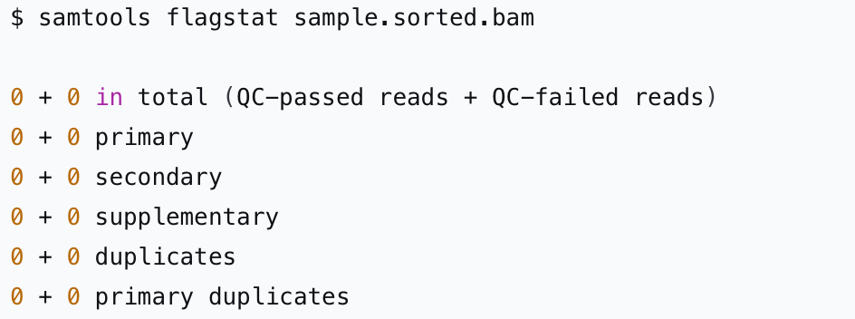

# Выравнивание данных экзома по TP53 — поиск соматических мутаций

В рамках этого проекта ты научишься анализировать данные экзомного секвенирования для выявления соматических мутаций в гене TP53, который часто ассоциируется с развитием онкологических заболеваний.

Для поиска таких мутаций и их визуализации ты будешь использовать биоинформатические инструменты, которые ты знаешь по предыдущим проектам, а также несколько новых инструментов для вызова вариантов.

Проект подготовит к практической работе с реальными клиническими генетическими данными.

## Содержание

- [Как учиться в «Школе 21»](#%D0%BA%D0%B0%D0%BA-%D1%83%D1%87%D0%B8%D1%82%D1%8C%D1%81%D1%8F-%D0%B2-%D1%88%D0%BA%D0%BE%D0%BB%D0%B5-21)
- [Chapter I](#chapter-i)
  - [День из жизни биоинформатика: поиск вариантов](#%D0%B4%D0%B5%D0%BD%D1%8C-%D0%B8%D0%B7-%D0%B6%D0%B8%D0%B7%D0%BD%D0%B8-%D0%B1%D0%B8%D0%BE%D0%B8%D0%BD%D1%84%D0%BE%D1%80%D0%BC%D0%B0%D1%82%D0%B8%D0%BA%D0%B0-%D0%BF%D0%BE%D0%B8%D1%81%D0%BA-%D0%B2%D0%B0%D1%80%D0%B8%D0%B0%D0%BD%D1%82%D0%BE%D0%B2)
- [Chapter II](#chapter-ii)
  - [Задание 1. Подготовка к работе](#%D0%B7%D0%B0%D0%B4%D0%B0%D0%BD%D0%B8%D0%B5-1-%D0%BF%D0%BE%D0%B4%D0%B3%D0%BE%D1%82%D0%BE%D0%B2%D0%BA%D0%B0-%D0%BA-%D1%80%D0%B0%D0%B1%D0%BE%D1%82%D0%B5)
  - [Задание 2. Разработка плана действий](#%D0%B7%D0%B0%D0%B4%D0%B0%D0%BD%D0%B8%D0%B5-2-%D1%80%D0%B0%D0%B7%D1%80%D0%B0%D0%B1%D0%BE%D1%82%D0%BA%D0%B0-%D0%BF%D0%BB%D0%B0%D0%BD%D0%B0-%D0%B4%D0%B5%D0%B9%D1%81%D1%82%D0%B2%D0%B8%D0%B9)
  - [Задание 3. Следуй плану](#%D0%B7%D0%B0%D0%B4%D0%B0%D0%BD%D0%B8%D0%B5-3-%D1%81%D0%BB%D0%B5%D0%B4%D1%83%D0%B9-%D0%BF%D0%BB%D0%B0%D0%BD%D1%83)
  - [Задание 4. Сравнение результата](#%D0%B7%D0%B0%D0%B4%D0%B0%D0%BD%D0%B8%D0%B5-4-%D1%81%D1%80%D0%B0%D0%B2%D0%BD%D0%B5%D0%BD%D0%B8%D0%B5-%D1%80%D0%B5%D0%B7%D1%83%D0%BB%D1%8C%D1%82%D0%B0%D1%82%D0%B0)
  - [Задание 5. Пометка дубликатов](#%D0%B7%D0%B0%D0%B4%D0%B0%D0%BD%D0%B8%D0%B5-5-%D0%BF%D0%BE%D0%BC%D0%B5%D1%82%D0%BA%D0%B0-%D0%B4%D1%83%D0%B1%D0%BB%D0%B8%D0%BA%D0%B0%D1%82%D0%BE%D0%B2)
  - [Задание 6. Вызов вариантов](#%D0%B7%D0%B0%D0%B4%D0%B0%D0%BD%D0%B8%D0%B5-6-%D0%B2%D1%8B%D0%B7%D0%BE%D0%B2-%D0%B2%D0%B0%D1%80%D0%B8%D0%B0%D0%BD%D1%82%D0%BE%D0%B2)
  - [Задание 7. Фильтрация вариантов](#%D0%B7%D0%B0%D0%B4%D0%B0%D0%BD%D0%B8%D0%B5-7-%D1%84%D0%B8%D0%BB%D1%8C%D1%82%D1%80%D0%B0%D1%86%D0%B8%D1%8F-%D0%B2%D0%B0%D1%80%D0%B8%D0%B0%D0%BD%D1%82%D0%BE%D0%B2)
  - [Задание 8. Аннотация](#%D0%B7%D0%B0%D0%B4%D0%B0%D0%BD%D0%B8%D0%B5-8-%D0%B0%D0%BD%D0%BD%D0%BE%D1%82%D0%B0%D1%86%D0%B8%D1%8F)
  - [Задание 9. Локальная проверка покрытия и поддержки](#%D0%B7%D0%B0%D0%B4%D0%B0%D0%BD%D0%B8%D0%B5-9-%D0%BB%D0%BE%D0%BA%D0%B0%D0%BB%D1%8C%D0%BD%D0%B0%D1%8F-%D0%BF%D1%80%D0%BE%D0%B2%D0%B5%D1%80%D0%BA%D0%B0-%D0%BF%D0%BE%D0%BA%D1%80%D1%8B%D1%82%D0%B8%D1%8F-%D0%B8-%D0%BF%D0%BE%D0%B4%D0%B4%D0%B5%D1%80%D0%B6%D0%BA%D0%B8)
  - [Задание 10. «Ручная» проверка с JBrowse2](#%D0%B7%D0%B0%D0%B4%D0%B0%D0%BD%D0%B8%D0%B5-10-%D1%80%D1%83%D1%87%D0%BD%D0%B0%D1%8F-%D0%BF%D1%80%D0%BE%D0%B2%D0%B5%D1%80%D0%BA%D0%B0-%D1%81-jbrowse2)

## Как учиться в «Школе 21»

- Здесь тебя ждет уникальный образовательный опыт с большим количеством свободы. Ты получаешь задачу и самостоятельно ищешь пути решения, используя любые удобные способы поиска информации — ресурсы интернета или нейросети (например, GigaChat). Но внимательно относись к качеству информации: проверяй, думай, анализируй, сравнивай.
- Взаимообучение (Peer-to-Peer, P2P) — это обмен знаниями и опытом с другими пирами, где каждый выступает и учителем, и учеником. Такой подход позволяет глубже понять материал, учась друг у друга.
- Чувствуй себя свободно и проси о помощи — вокруг тебя те, кто тоже впервые проходят этот путь. Делись своим опытом и идеями с другими. Присоединяйся к RocketChat, чтобы быть в курсе всех новостей от нашего сообщества.
- Твое обучение не будет иметь никакого смысла, если ты будешь копировать чужие решения. Если пользуешься помощью других — всегда разбирайся до конца, почему, как и зачем. Не бойся ошибиться.
- Кажется, что задача невыполнима? Сделай перерыв, проветрись, перезагрузи голову — это помогало многим. Возможно, после этого решение придет само собой.
- Важен не только результат обучения, но и сам процесс. Нужно не просто решить задачу, а понять, КАК ее решить.

Как работать с проектом:

- Перед выполнением проект необходимо склонировать с GitLab в одноименный репозиторий.
- Все файлы необходимо создавать в папке *src/* склонированного репозитория.
- После клонирования проекта необходимо создать ветку develop и вести разработку в ней. После этого пушить в GitLab также нужно ветку develop.
- В твоей директории не должно быть иных файлов, кроме тех, что обозначены в заданиях.

## Chapter I

### День из жизни биоинформатика: поиск вариантов

**10:00. Начало дня**

С утра я уже на пределе — решение вчерашней задачи затянулось, на сон было пару часов. Делаю первый глоток кофе, запускаю FastQC.

Кофе слабо бодрит, но нужно разобраться с сырыми данными секвенирования экзома пациента — найти варианты в определенном гене. Времени мало, коллеги ждут результатов сегодня.

Графики качества вызывают у меня легкую тревогу: не просто ожидаемый спад на концах, а целые «провалы» в середине прочтений.

Странно. Мысленно успокаиваю себя и запускаю тримминг: «Trimmomatic все подчистит».

— Ну, здравствуй, тримминг, — бормочу себе под нос, запуская Trimmomatic.

Файлы на выходе аккуратно обрезаны, готовы отправиться дальше. Первый этап пройден. Но… что-то меня смущает.

**10:30. Два инструмента, один результат — и почему-то сомнения**

Привычно запускаю bwa mem, мой надежный помощник. \
Команда, отточенная до автоматизма за последние полгода работы, с того момента, как меня приняли джуном (в этом режиме важно работать быстро, опираясь на проверенные команды и шаблоны, чтобы не тратить время на эксперименты):

`bwa mem -M -t 8 chr17.fasta R1trimmed.fq R2trimmed.fq | samtools view -bS - > aligned.bam`

Процесс идет, логи сыпятся в терминал. Выглядит вроде нормально. Восемь потоков процессора гудят, как мотор.

Спустя несколько минут процесс завершится, и я получу `aligned.bam` — по сути, неотсортированную коллекцию всех прочтений.

Далее наведение порядка. `Samtools sort` расставит все по позициям на хромосоме, а `samtools index` создаст карту для быстрой навигации. А на выходе я получу `aligned.sorted.bam` — идеально упакованный файл для анализа.

Параллельно для сравнения я запускаю Bowtie2 в чувствительном режиме (`--very-sensitive-local`), чтобы потом сравнить результаты. Посмотрим, кто лучше поймает нужное!

Пока оба пайплайна работают, я иду за вторым кофе. Кажется, все в порядке.

**11:00. Индикатор проблемы: красные флаги**

Возвращаюсь к терминалу — процессы завершились. Запускаю сортировку для BAM-файлов. Команды выполняются неестественно быстро. Почему так быстро? Что-то тут не так.

«Может, это просто везение?» — пытаюсь убедить себя убедить и продолжаю.

**12:00. Отмечаю дубликаты и осознаю опасность**

Запускаю Picard MarkDuplicates для сортированного bam. Как же я не люблю эту рутину! Однако без пометки ПЦР-дубликатов, которые могут серьезно исказить вариантную частоту, просто не обойтись.

Метрика — мизерные 0.1% дубликатов. Это почти невозможно. Обычно куда выше. Что-то пошло не так! \
Все-таки проверяю статистику выравнивания. Результат повергает в ступор:



Ни одно прочтение не выровнялось.

Я лихорадочно проверяю `alignedbowtie2.sorted.bam` — та же история.

Паника постепенно охватывает — что же случилось?

Перебираю логи bwa mem и тут обнаруживаю крошечный, но роковой промах в команде, которая вводилась на «автомате»:

`bwa mem -M -t 8 chr17.fasta R1trimmed.fq R2trimmed.fq …`

Все верно? Нет.

В рабочей директории файл с именем `chr17.fa`. А программа спокойно «не ругается», а просто молча воспринимает -M как имя файла, не выравнивая прочтения.

Выравнивание происходило не на референсный геном, а в пустоту! Тот же прокол и с bowtie2.

Два часа впустую! Электричество, вычислительная мощь — все исчезло зря.

**12:30. Перезапуск. Усвоен ли урок?**

Перезаписываю команды, исправляя расширение на .fa. Запускаю выравнивание заново.

Теперь с замиранием сердца слежу за статистикой — 98.5% mapped. Все как надо. Наконец-то работает.

**13:30. Цена невнимательности**

Перехожу к вызову вариантов. Мне привычнее работать с `bcftools` — быстрая и элегантная команда:

`bcftools mpileup -Ou -f chr17.fa aligned.sorted.bam | bcftools call -vm -Oz -o variants.vcf.gz`

Файл `variants.vcf.gz` создается без проблем. Улыбаюсь и запускаю GATK HaplotypeCaller — золотой стандарт клинической биоинформатики.

`gatk HaplotypeCaller -R chr17.fa -I aligned.sorted.bam -O variants.gatk.vcf`

И тут ошибка в терминале:

*ERROR: The BAM file does not have any read groups defined in the header…*

Останавливаюсь. Я уже начинаю ощущать усталость — мысли путаются.

Read Groups! Лучшие практики требуют их обязательного наличия, но в моем быстром пайплайне для внутренних исследований я привычно пропускаю шаг.

GATK, в отличие от bcftools, без этого не работает. Проверяю:

`samtools view -H aligned.sorted.bam | grep '@RG'`

Пусто. Полчаса трачу на то, чтобы остановить пайплайн, найти в документации Picard команду `AddOrReplaceReadGroups` и добавить необходимую информацию в BAM-файл.

Хорошо, что такая функция есть. Только после этого GATK соглашается работать, выдавая свой файл `variants.gatk.vcf`.

**14:30. Ошибка повторяется**

Запускаю GATK HaplotypeCaller для `alignedbowtie2.sorted.bam` — и забываю про read groups снова!

GATK снова выдает ту же ошибку — теряю еще 20 минут на исправление. Цена несистемного подхода.

**15:30. Загадка вариантов**

Первое сравнение двух VCF-файлов до фильтрации сбивает с толку. bcftools выдает десятки вариантов, а GATK — лишь несколько.

Хм… Я знаю, что GATK использует продвинутые эвристики и вероятностные модели. Возможно, bcftools слишком доверчив к шуму.

Решаю применить фильтры ко всем 4 выборкам. Запускаю команды для bcftools и для GATK, чтобы отфильтровать варианты по качеству.

И вот оно! После фильтрации списки сокращаются. Но что важно: GATK изначально вызвал меньше низкокачественных вариантов, поэтому его отфильтрованный файл чище и точнее.

Это же ценз качества, встроенный прямо в алгоритм!

И цена использования более простого инструмента (bcftools) — нужно быть очень внимательным к пост-обработке.

**16:00. BWA vs Bowtie2**

Перехожу к сравнению выравнивания.

- BWA-mem: 98.5% прочтений выровнялось.
- Bowtie2: 97.1% прочтений выровнялось.

Небольшая, но заметная разница.

Сравниваю VCF-файлы, изучаю варианты в гене TP53: почти все совпадают, но в одном локусе Bowtie2 пропущен индель, который уверенно поймал BWA-mem.

**16:30. Аннотация и снова проблемы**

Четыре итоговых VCF-файла отправляются в snpEff для аннотации.

Процесс идет, но в терминале появляются странные предупреждения:

*WARNING: Chromosome 'chr17' not found in database.*

Снова понимаю ошибку: мой референс смонтирован без префикса chr (просто 17), а база snpEff использует префикс.

В результате варианты не аннотируются — координаты не совпадают.

Я стою перед выбором: либо переименовывать хромосому в своем FASTA и перезапускать пайплайн (на что уже нет сил), либо искать способ перенастроить snpEff.

Это раздражает, день явно не задался.

Вместо 3 часов работы я рискую потратить 9.

Надо переименовать хромосому. Перезапускаю процессы и жду.

**17:30. Финальный результат**

Наконец-то! В колонке EFFECT вижу долгожданный вариант в гене TP53. Здесь есть интересный вариант, проверяю. Это же мутация, известная в базах данных, связанная с онкологией!

**18:00. Визуальная верификация. Убедиться лично**

Теории и статистики недостаточно.

Открываю JBrowse2 и загружаю:

- референсный геном,
- BAM-файлы с выравниваниями,
- финальный VCF.

Ищу координату найденной мутации.

В столбике выровненных прочтений вижу: часть прочтений несет вариант, а часть — референсный аллель.

Гетерозигота! Автоматическая статистика подтверждается визуально.

Делаю скриншоты для отчета — неопровержимое доказательство.

**18:30. Итоги самого долгого дня**

В конце дня я почти без сил. Сегодня без красивого результата — день был борьбой с собственными ошибками.

Какие выводы я делаю? Вот несколько пунктов из опыта ошибок сегодняшнего дня.

**Бинго-чек-лист советов по улучшению рабочего процесса биоинформатика**

Какие из пунктов тебе знакомы / что ты применяешь на практике? \
Мысленно сыграй в бинго — сколько ячеек ты отметишь?

|  |  |  |
| --- | --- | --- |
| Всегда **проверяй** логи сразу — молчание не знак успеха. | Следи за **точностью** имен файлов — опечатка стоит дорого. | **Верифицируй** результат на каждом **этапе** — статистика и логи — друзья. |
| Соблюдай **принцип системности** — если что-то делаешь для одного файла, делай для всех. | **Логируй** все с самого начала: версии ОС, софта, параметры. | Учитывай нюансы данных — **согласуй номенклатуру хромосом** (chr или без) на всех этапах: от референса до аннотационных баз. |

Вернись к истории дня героя — какие ошибки он совершал шаг за шагом?

Цена ошибки экспоненциально растет. Ошибка на начальных шагах означает, что все последующие часы работы и этапы будут бесполезны.

## Chapter II

Теперь пора перейти к практике. Ты получишь «сырые» данные РЕ секвенирования «пациента», для которого требуется оценить варианты гена TP53.

Прежде чем приступить к заданию, изучи информацию про то, что представляет из себя ген TP53, какие бывают мутации и к чему они приводят (найди информацию самостоятельно или спроси у пиров, где лучше найти проверенные источники).

Этот проект отличается от предыдущих: в нем тебе предстоит самостоятельно выстроить шаги по работе с данными в условиях разных обстоятельств (которые могут возникнуть в реальной практике биоинформатика).

Твоя задача — найти все варианты в гене TP53.

Готовься разобраться!

*И прежде чем ты приступишь, маленькая подсказка: используй hg38.*

Для работы тебе понадобится:

1. Установленный Python (рекомендуется версия 3.8+).
2. Установленный Python (версия 3.6) для работы в виртуальном окружении.
3. Установленный [Biopython](https://biopython.org/wiki/Download) ([документация тут](https://biopython.org/docs/1.75/api/index.html)).
4. Программа [FasQC](https://www.bioinformatics.babraham.ac.uk/projects/fastqc/).
5. Программа [MultiQC](https://seqera.io/multiqc/).
6. Программа [Trimmomatic](http://www.usadellab.org/cms/?page=trimmomatic).
7. Программа [Samtools](http://www.htslib.org/).
8. Программа [BWA](https://github.com/lh3/bwa).
9. Программа [Bowtie2](https://bowtie-bio.sourceforge.net/bowtie2/manual.shtml).
10. Программа [GATK](https://gatk.broadinstitute.org/).
11. Программа [bcftools](http://samtools.github.io/bcftools/).
12. Программа [Picard](https://broadinstitute.github.io/picard/).
13. Программа [snpEff](https://pcingola.github.io/SnpEff/).
14. Программа [JBrowse2](https://jbrowse.org/jb2/download/).

### Задание 1. Подготовка к работе

Оцени качество секвенирования экзома «пациента» с помощью программы FastQC.

1. Создай структуру папок:

```
   - project5  
      - results  
      - data
```

2. [Перейди по ссылке](https://disk.360.yandex.ru/d/9eqRg-uA78wWPw) и скачай data samples — 2 файла с парными «сырыми» прочтения пациента (R1 — прямое прочтение, R2 — обратное прочтение). Пожалуйста, не переименовывай их. Помести эти файлы в папку data.

### Задание 2. Разработка плана действий

В этом задании тебе предстоит разработать план действий для изучения вариантов в гене TP53.

1. Твоя задача — получить bam-файлы с помощью двух алгоритмов выравнивания для дальнейшего анализа (посмотри внимательно на программы, которые потребуются тебе для работы).

Создай файл `answer2.txt`. В документе отрази план работ: последовательность шагов анализа и названия выходных файлов, которые ты планируешь получить в соответствии с шагами. Файлы необходимо называть согласно R1/R2, программы и операции (чтобы не запутаться).

*Помни про подсказку использовать hg38 сборку и еще раз внимательно изучи историю дня героя в этом проекте.* 🙂

### Задание 3. Следуй плану

В этом задании тебе нужно будет реализовать разработанный план по анализу вариантов в гене TP53.

Помни, что твоя задача была получить сортированные BAM-файлы, используя два различных алгоритма выравнивания, для их последующего сравнительного анализа. Еще раз ознакомься с необходимыми для работы программами выше.

1. Начинай работу в соответствии со своим планом. Помни, что названия полученных файлов должны соответствовать упомянутым в `answer2.txt`. Помещай полученные файлы в папку results.

### Задание 4. Сравнение результата

В этом задании тебе предстоит сравнить сортированные bam-файлы, полученные с помощью двух алгоритмов выравнивания.

Их ты будешь использовать для дальнейшего анализа.

1. Сравни полученные результаты, используя команду `samtools flagstat`. Сделай скриншоты полученной выдачи (окна терминала) и сохрани их согласно наименованию используемой программы и номеру задания в папку results (например, `bwa_4.png`).

2. Вопрос, который спросил бы твой тимлид:

*«Сравни результаты работы двух алгоритмов: как ты можешь интерпретировать эти результаты и при каких исследовательских задачах можно рекомендовать каждый из инструментов? Обоснуй свой выбор».*

Подготовь подробный ответ к P2P-проверке.

### Задание 5. Пометка дубликатов

В этом задании тебе предстоит провести пометку дубликатов с помощью Picard.

1. Проведи пометку дубликатов с помощью Picard для двух ранее получившихся bam-файлов. Сохрани полученные файлы в папку results. Назови их согласно используемой ранее программе и номеру задания, например, `bwa_5_1.bam` и `bwa_metrics.txt`.

### Задание 6. Вызов вариантов

В этом задании тебе предстоит провести вызов вариантов двумя методами (bcftools и GATK HaplotypeCaller) для двух получившихся ранее файлов (результат — 4 итоговых файла вызова вариантов).

1. Проведи вызов вариантов с помощью bcftools для двух получившихся по результатам предыдущих шагов файлов. Сохрани полученные файлы в папку results (назови полученные файлы согласно используемой ранее программе и номеру задания, например, `bwa_6_1.bam`).

2. Проведи вызов вариантов с помощью GATK для двух получившихся по результатам предыдущих шагов файлов. Сохрани полученные файлы в папку results (назови полученные файлы согласно используемой ранее программе и номеру задания, например, `bwa_6_2.bam`).

3. В папке results cоздай файл `answer6.txt` для внесения ответов на вопросы ниже.

4. Сравни полученные варианты: у какого варианта вызова (bcftools или GATK HaplotypeCaller) качество вариантов (QUAL) лучше среди результатов, полученных с помощью первого алгоритма выравнивания? В первой строке файла `answer6.txt` запиши название программы, с помощью которой было получено исходное выравнивание, и название инструмента с лучшим качеством вариантов.

5. Сравни полученные результаты: у какого варианта вызова (bcftools или GATK HaplotypeCaller) качество вариантов (QUAL) лучше среди данных, полученных с помощью второго алгоритма выравнивания?

Во второй строке файла `answer6.txt` запиши название программы, с помощью которой было получено исходное выравнивание, и название инструмента с лучшим качеством вариантов.

6. Сравни полученные результаты: у какого варианта вызова (bcftools или GATK HaplotypeCaller) глубина покрытия и поддержка варианта (параметры DP, AD) лучше среди данных, полученных с помощью первого алгоритма выравнивания?

В третьей строке файла `answer6.txt` запиши название программы, с помощью которой было получено исходное выравнивание, и название инструмента с более достоверными данными.

7. Сравни полученные результат: у какого варианта вызова (bcftools или GATK HaplotypeCaller) глубина покрытия и поддержка варианта (DP, AD) лучше среди данных, полученных с помощью второго алгоритма выравнивания?

В четвертой строке файла `answer6.txt` запиши название программы, с помощью которой было получено исходное выравнивание, и название инструмента с более достоверными данными.

8. Сравни получившиеся выдачи: у какого инструмента наиболее информативная выдача (bcftools или GATK HaplotypeCaller)?

В пятой строке файла `answer6.txt` запиши название инструмента, который обеспечил более полную и структурную информацию.

9. Вопрос, который спросил бы твой тимлид:

*«Какое сочетание алгоритмов выравнивание-вызов вариантов показали наилучший результат? Объясни, по каким именно параметрам эта комбинация оказалась лучше других».*

Подготовь подробный ответ к P2P-проверке.

### Задание 7. Фильтрация вариантов

В этом задании тебе предстоит провести фильтрацию вариантов. Это нужно для того, чтобы упростить анализ (аннотацию).

1. Проведи фильтрацию полученных bcftools-файлов с вариантами по качеству и глубине покрытия (подбери наиболее подходящие параметры сам) с помощью bcftools filter.

Сохрани полученные файлы в папку results (назови полученные файлы согласно используемым ранее программам и номеру задания, например, `bwa_bcftools_7_1.vcf`).

2. Проведи фильтрацию полученных GATK-файлов с вариантами по качеству и глубине покрытия (подбери наиболее подходящие параметры сам) с помощью gatk VariantFiltration.

Сохрани полученные файлы в папку results (назови полученные файлы согласно используемой ранее программе и номеру задания, например, `bwa_gatk_7_2.vcf`).

### Задание 8. Аннотация

Тебе предстоит проанализировать полученные **vcf**-файлы с помощью программы snpEff.

1. Проанализируй полученные после фильтрации vcf-файлы (у тебя должно быть 4 файла) с помощью программы snpEff.\
Сохрани полученные файлы в папку results (назови полученные файлы согласно используемой ранее программе и номеру задания, например, `bwa_gatk_8_1.vcf`).

*Если у тебя выходит ошибка «java.lang.OutOfMemoryError: Java heap space», то, скорее всего, что у тебя недостаточно памяти.*

*Возможные решения:*

*- Для работы с данным заданием используй АРМ в кампусе.*

*- Если можешь использовать более мощный сервер для запуска — используй.*

*- Подумай, как снизить объем используемой памяти, что стоит вырезать и анализировать только данные, относящиеся к гену TP53.*

2. В папке results cоздай файл `answer8.txt` и внеси в него ответ на вопрос: «Проанализируй варианты гена TP53 и выяви наиболее значимый (укажи позицию), укажи причину его значимости (одно-два слова или короткое предложение)».

3. Вопрос, который спросил бы твой тимлид:

*«Какое сочетание алгоритмов «выравнивание – вызов вариантов» лучше справилось с задачей? Изменилось ли твое мнение после аннотации? Объясни, по каким именно параметрам эта комбинация оказалась лучше других».*

Подготовь подробный ответ к P2P-проверке.

### Задание 9. Локальная проверка покрытия и поддержки

В этом задании тебе предстоит выполнить локальную проверку покрытия и поддержки, чтобы убедиться, что найденный тобой вариант значим.

1. Для найденных тобой наиболее значимых вариантов в гене TP53 выполни локальную проверку покрытия для сортированных bam-файлов, полученных двумя разными методами выравнивания, с помощью `samtools mpileup`. Сделай скриншоты полученной выдачи (окна терминала) и сохрани их согласно наименованию используемой программы и номеру задания в папку results (например, `bwa_9.png`).

2. Есть ли отличия в выдаче?

3. Согласно локальной проверке покрытия и поддержки, полученному результату можно доверять?

### Задание 10. «Ручная» проверка с JBrowse2

А теперь тебе предстоит визуализировать полученные результаты.

1. Загрузи полученные bam-файлы и vcf SNPeff для сравнения (в качестве референса используй hg38).

2. Добавь трек Clinvar Variants. Сделай скриншот полученного окна JBrowse2 в позиции значимых вариантов и сохрани согласно номеру задания в папку results (например, `10.png`).

3. На основе аннотации из ClinVar сделай вывод о состоянии здоровья «пациента».

В папке results создай файл `answer10.txt` и запиши свой ответ.

---

💡 [Нажми сюда](https://new.oprosso.net/p/4cb31ec3f47a4596bc758ea1861fb624), **чтобы поделиться с нами обратной связью на этот проект**. Это анонимно и поможет нашей команде сделать обучение лучше. Рекомендуем заполнить опрос сразу после выполнения проекта.