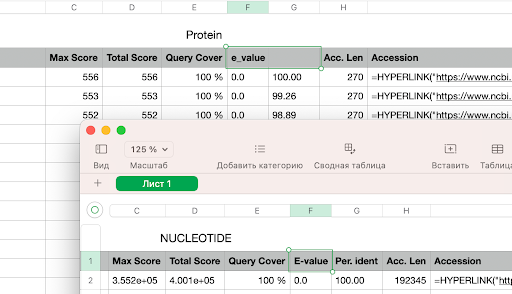
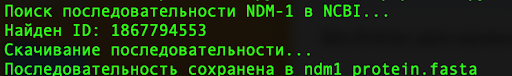
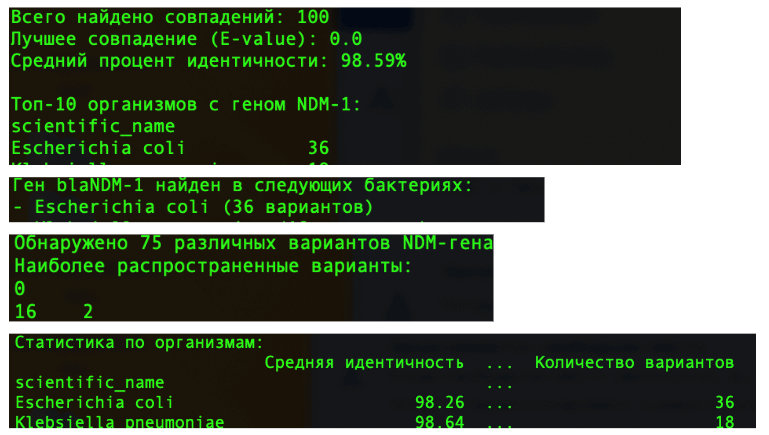
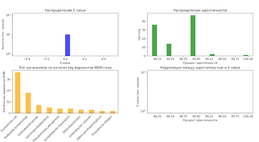
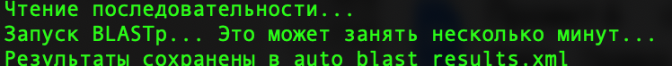
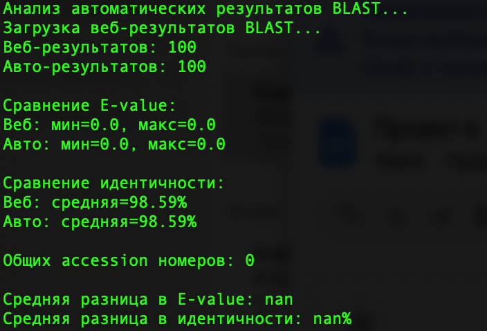
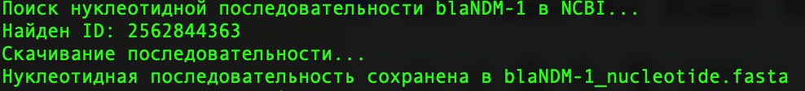
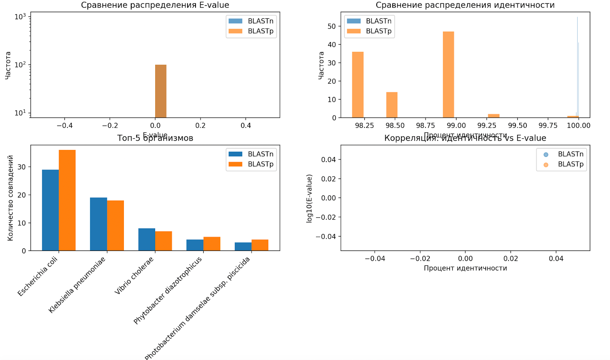
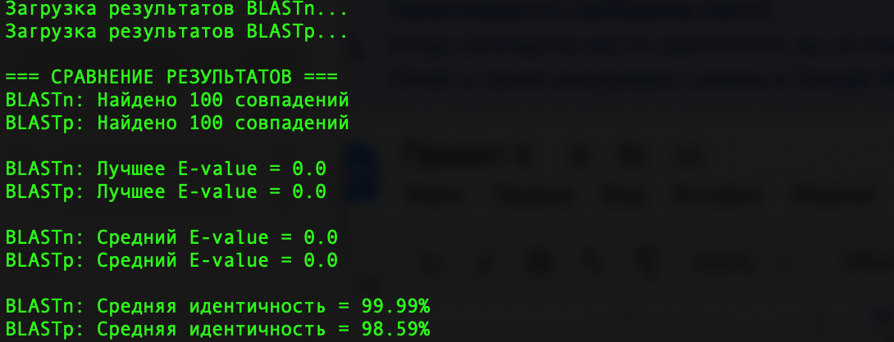

# Поиск гомологов blaNDM-1 — анализ антибиотикорезистентности

В этом проекте ты научишься использовать алгоритмы BLAST и Biopython для поиска гомологов гена blaNDM-1, анализировать устойчивость к антибиотикам и работать с базами NCBI.

## Содержание

- [Как учиться в «Школе 21»](#%D0%BA%D0%B0%D0%BA-%D1%83%D1%87%D0%B8%D1%82%D1%8C%D1%81%D1%8F-%D0%B2-%D1%88%D0%BA%D0%BE%D0%BB%D0%B5-21)
- [Chapter I](#chapter-i)
  - [День из жизни биоинформатика: охота на ген устойчивости](#%D0%B4%D0%B5%D0%BD%D1%8C-%D0%B8%D0%B7-%D0%B6%D0%B8%D0%B7%D0%BD%D0%B8-%D0%B1%D0%B8%D0%BE%D0%B8%D0%BD%D1%84%D0%BE%D1%80%D0%BC%D0%B0%D1%82%D0%B8%D0%BA%D0%B0-%D0%BE%D1%85%D0%BE%D1%82%D0%B0-%D0%BD%D0%B0-%D0%B3%D0%B5%D0%BD-%D1%83%D1%81%D1%82%D0%BE%D0%B9%D1%87%D0%B8%D0%B2%D0%BE%D1%81%D1%82%D0%B8)
- [Chapter II](#chapter-ii)
  - [Задание 1. Скачивание последовательностей](#%D0%B7%D0%B0%D0%B4%D0%B0%D0%BD%D0%B8%D0%B5-1-%D1%81%D0%BA%D0%B0%D1%87%D0%B8%D0%B2%D0%B0%D0%BD%D0%B8%D0%B5-%D0%BF%D0%BE%D1%81%D0%BB%D0%B5%D0%B4%D0%BE%D0%B2%D0%B0%D1%82%D0%B5%D0%BB%D1%8C%D0%BD%D0%BE%D1%81%D1%82%D0%B5%D0%B9)
  - [Задание 2. Веб-интерфейс](#%D0%B7%D0%B0%D0%B4%D0%B0%D0%BD%D0%B8%D0%B5-2-%D0%B2%D0%B5%D0%B1-%D0%B8%D0%BD%D1%82%D0%B5%D1%80%D1%84%D0%B5%D0%B9%D1%81)
  - [Задание 3. Анализ результатов](#%D0%B7%D0%B0%D0%B4%D0%B0%D0%BD%D0%B8%D0%B5-3-%D0%B0%D0%BD%D0%B0%D0%BB%D0%B8%D0%B7-%D1%80%D0%B5%D0%B7%D1%83%D0%BB%D1%8C%D1%82%D0%B0%D1%82%D0%BE%D0%B2)
  - [Задание 4. Автоматизация BLASTp с помощью Biopython](#%D0%B7%D0%B0%D0%B4%D0%B0%D0%BD%D0%B8%D0%B5-4-%D0%B0%D0%B2%D1%82%D0%BE%D0%BC%D0%B0%D1%82%D0%B8%D0%B7%D0%B0%D1%86%D0%B8%D1%8F-blastp-%D1%81-%D0%BF%D0%BE%D0%BC%D0%BE%D1%89%D1%8C%D1%8E-biopython)
  - [Задание 5. Сравнение выдачи, полученной с помощью веб-интерфейса и выдачи, полученной с помощью автоматизации BLASTp с помощью Biopython](#%D0%B7%D0%B0%D0%B4%D0%B0%D0%BD%D0%B8%D0%B5-5-%D1%81%D1%80%D0%B0%D0%B2%D0%BD%D0%B5%D0%BD%D0%B8%D0%B5-%D0%B2%D1%8B%D0%B4%D0%B0%D1%87%D0%B8-%D0%BF%D0%BE%D0%BB%D1%83%D1%87%D0%B5%D0%BD%D0%BD%D0%BE%D0%B9-%D1%81-%D0%BF%D0%BE%D0%BC%D0%BE%D1%89%D1%8C%D1%8E-%D0%B2%D0%B5%D0%B1-%D0%B8%D0%BD%D1%82%D0%B5%D1%80%D1%84%D0%B5%D0%B9%D1%81%D0%B0-%D0%B8-%D0%B2%D1%8B%D0%B4%D0%B0%D1%87%D0%B8-%D0%BF%D0%BE%D0%BB%D1%83%D1%87%D0%B5%D0%BD%D0%BD%D0%BE%D0%B9-%D1%81-%D0%BF%D0%BE%D0%BC%D0%BE%D1%89%D1%8C%D1%8E-%D0%B0%D0%B2%D1%82%D0%BE%D0%BC%D0%B0%D1%82%D0%B8%D0%B7%D0%B0%D1%86%D0%B8%D0%B8-blastp-%D1%81-%D0%BF%D0%BE%D0%BC%D0%BE%D1%89%D1%8C%D1%8E-biopython)
  - [Задание 6. Скачивание нуклеотидной последовательности](#%D0%B7%D0%B0%D0%B4%D0%B0%D0%BD%D0%B8%D0%B5-6-%D1%81%D0%BA%D0%B0%D1%87%D0%B8%D0%B2%D0%B0%D0%BD%D0%B8%D0%B5-%D0%BD%D1%83%D0%BA%D0%BB%D0%B5%D0%BE%D1%82%D0%B8%D0%B4%D0%BD%D0%BE%D0%B9-%D0%BF%D0%BE%D1%81%D0%BB%D0%B5%D0%B4%D0%BE%D0%B2%D0%B0%D1%82%D0%B5%D0%BB%D1%8C%D0%BD%D0%BE%D1%81%D1%82%D0%B8)
  - [Задание 7. Веб-интерфейс](#%D0%B7%D0%B0%D0%B4%D0%B0%D0%BD%D0%B8%D0%B5-7-%D0%B2%D0%B5%D0%B1-%D0%B8%D0%BD%D1%82%D0%B5%D1%80%D1%84%D0%B5%D0%B9%D1%81)
  - [Задание 8. Анализ результатов](#%D0%B7%D0%B0%D0%B4%D0%B0%D0%BD%D0%B8%D0%B5-8-%D0%B0%D0%BD%D0%B0%D0%BB%D0%B8%D0%B7-%D1%80%D0%B5%D0%B7%D1%83%D0%BB%D1%8C%D1%82%D0%B0%D1%82%D0%BE%D0%B2)
  - [Задание 9. Сравнение результатов BLASTp и BLASTn](#%D0%B7%D0%B0%D0%B4%D0%B0%D0%BD%D0%B8%D0%B5-9-%D1%81%D1%80%D0%B0%D0%B2%D0%BD%D0%B5%D0%BD%D0%B8%D0%B5-%D1%80%D0%B5%D0%B7%D1%83%D0%BB%D1%8C%D1%82%D0%B0%D1%82%D0%BE%D0%B2-blastp-%D0%B8-blastn)

## Как учиться в «Школе 21»

- Здесь тебя ждет уникальный образовательный опыт с большим количеством свободы. Ты получаешь задачу и самостоятельно ищешь пути решения, используя любые удобные способы поиска информации — ресурсы интернета или нейросети (например, GigaChat). Но внимательно относись к качеству информации: проверяй, думай, анализируй, сравнивай.
- Взаимообучение (Peer-to-Peer, P2P) — это обмен знаниями и опытом с другими пирами, где каждый выступает и учителем, и учеником. Такой подход позволяет глубже понять материал, учась друг у друга.
- Чувствуй себя свободно и проси о помощи — вокруг тебя те, кто тоже впервые проходят этот путь. Делись своим опытом и идеями с другими. Присоединяйся к RocketChat, чтобы быть в курсе всех новостей от нашего сообщества.
- Твое обучение не будет иметь никакого смысла, если ты будешь копировать чужие решения. Если пользуешься помощью других — всегда разбирайся до конца, почему, как и зачем. Не бойся ошибиться.
- Кажется, что задача невыполнима? Сделай перерыв, проветрись, перезагрузи голову — это помогало многим. Возможно, после этого решение придет само собой.
- Важен не только результат обучения, но и сам процесс. Нужно не просто решить задачу, а понять, КАК ее решить.

Как работать с проектом:

- Перед выполнением проект необходимо склонировать с GitLab в одноименный репозиторий.
- Все файлы необходимо создавать в папке *src/* склонированного репозитория.
- После клонирования проекта необходимо создать ветку develop и вести разработку в ней. После этого пушить в GitLab также нужно ветку develop.
- В твоей директории не должно быть иных файлов, кроме тех, что обозначены в заданиях.

## Chapter I

### День из жизни биоинформатика: охота на ген устойчивости

**9:00. Утро, прекрасное время для старта**

Сегодня нашему департаменту поручили подготовить выступление на конференции с докладом по антибиотикорезистентности и методах ее исследования.

В рамках этой подготовки я приступаю к новому проекту по анализу гена blaNDM-1. Именно этот ген отвечает за устойчивость к антибиотикам последней линии защиты. Если раньше носители этого гена встречались преимущественно в клинических условиях, то теперь мы находим эти «супербактерии» и в окружающей среде.

Создаю папку ndm\_1\_analysis. Кажется, все просто, но это только начало.

**9:15. Скачивание последовательности**

Что нужно сделать сначала: получить эталонную последовательность белка NDM-1 из NCBI.

Пишу скрипт на Python с использованием Bio.Entrez и Bio.SeqIO.

Bio.Entrez — прекрасный модуль Python, мостик между моим кодом и огромными научными базами данных. Bio.Entrez автоматизирует ручной поиск и загрузку информации из публичных биомедицинских баз данных, таких как NCBI, PubMed, GenBank.

Вместо того чтобы вручную копировать данные с сайтов, я пишу скрипт, который через Bio.Entrez сам связывается с этими базами, находит то, что мне нужно, и возвращает данные в удобном для обработки виде.

Гениальное изобретение! Отлично работает в паре с Bio.SeqIO. Bio.SeqIO — еще один любопытный инструмент в Biopython, который работает как универсальный переводчик для файлов с биологическими последовательностями (ДНК, РНК, белков).

Он позволяет читать, записывать и конвертировать данные между разными форматами (как FASTA, GenBank). Благодаря этому инструменту я легко могу работать с данными в нашем коде, не тратя время на сложные форматы.

Все идет гладко, скрипт находит белок и сохраняет его в `ndm1_protein.fasta`.

Уже чувствую себя повелителем баз данных!


**10:30. Веб-интерфейс**

Следующий шаг: поиск гомологов, то есть эволюционных «родственников» белка NDM-1 в бесконечных базах данных. Использую BLASTp — самый популярный инструмент в арсенале биоинформатика для этой задачи.

Ввожу свою последовательность, а программа быстро сканирует базы данных и выдает выровненные совпадения со статистической оценкой их значимости. Алгоритм сначала находит короткие точные совпадения, а затем расширяет их в обе стороны, чтобы построить оптимальные локальные выравнивания. Каждое найденное совпадение сопровождается статистической оценкой, которая помогает отделить сигнал от шума.

Все еще немного сомневаюсь: использовать привычный веб-интерфейс на сайте NCBI или сразу автоматизировать процесс через API? Будут ли отличия в выдаче, если запустить и тот, и другой?

Загружаю свой FASTA-файл, выставляю параметры: база refseq\_protein, 100 таргетов, E-value < 0.001.

Запускаю и… тут же получаю ошибку: *«Сервер перегружен, попробуйте позже».*

Жду 10 минут, пробую снова.

Параллельно решаю автоматизировать BLAST, чтобы больше не зависеть от капризного веб-интерфейса.

Использую модуль `NCBIWWW.qblast` из Biopython. Скрипт отработал с первого раза, я получаю красивый XML-файл с результатами — `auto_blast_results.xml`.

Но при попытке его распарсить и сравнить с веб-результатами оказывается, что количество записей не совпало: в веб-выдаче 100, в автоматизированной — 92. Видимо, какие-то параметры по умолчанию в API отличаются от тех, что я выставил в веб-интерфейсе.

Для чистоты эксперимента решаю использовать для дальнейшего сравнения только общие accession-номера.

Мда, все-таки автоматизация хоть и мощный инструмент, но слепое доверие к скрипту без проверки может привести к неожиданностям.

**12:00. Анализ результатов BLASTp**

Пишу скрипт для разбора CSV-выдачи.

Все почти хорошо, но... cтолбец с accession number в исходном файле называется Accession (с пробелом в конце!).

Мой скрипт сначала падает с ошибкой KeyError, но я быстро исправляю это, прописав правильное имя столбца.

Строю графики: распределение E-value, идентичности, топ организмов.

**Распределение E-value** — это статистический показатель, который оценивает вероятность случайного совпадения. Чем значение ближе к нулю, вероятнее, что найденное сходство является биологически значимым, а не результатом случайности.

**Identity (идентичность)** показывает процент точного совпадения аминокислот между моей последовательностью и найденным результатом, что отражает степень похожести.

Эти параметры взаимодополняют друг друга: высокий Identity с низким E-value указывает на биологически значимое сходство.

Картина после анализа пугающая: ген blaNDM-1 был массово обнаружен у целого ряда клинически значимых оппортунистических патогенов — *Klebsiella pneumoniae*, *E. coli*, *Acinetobacter baumannii*. А значит? угроза устойчивости к антибиотикам реальна.

**14:00. Обед**

Пока жую сэндвич с курицей, думаю, что белок — это отличное начало, но чтобы увидеть более полную картину, интересно изучить нуклеотидную последовательность самого гена blaNDM-1.

**15:00. Опечатка**

Запускаю скрипт для поиска нуклеотидной последовательности гена blaNDM-1.

Вставляю стандартный код из предыдущего шага, но забываю поменять db="protein" на db="nucleotide". Снова получаю в ответ белок…

Трачу 15 минут на поиск причины, пока не замечаю эту очевидную опечатку. Одна маленькая опечатка — и база данных возвращает совершенно другой тип информации. Исправляю и наконец получаю нуклеотидную последовательность.

Сохраняю результат в файл `blaNDM-1_nucleotide.fasta`.

**16:00. BLASTn**

Запускаю BLASTn для нуклеотидной последовательности. Сохраняю результаты и приступаю к их анализу. В целом процесс напоминает работу с белковым BLAST, но некоторые организмы в топе немного отличаются.

**16:45. Финальный аккорд**

Сравниваю результаты BLASTp и BLASTn. Пишу скрипт для визуализации двух наборов данных.

Однако обнаруживаю, что в нуклеотидном файле столбец с e-value почему-то называется evalue, а в белковом — e\_value.



Пришлось привести названия к единому формату для корректной работы скрипта.

Пришлось привести названия к единому формату для корректной работы скрипта.

Строю сравнительные графики. BLASTn, как и ожидалось, показывает более высокую идентичность для близких видов, но хуже находит отдаленные гомологи из-за вырожденности генетического кода.

**18:00. Подвожу итоги**

Несмотря на все небольшие сложности и несостыковки — перегруженный сервер, небольшие расхождения в результатах API, опечатка в коде, разные форматы названий столбцов — основная задача выполнена.

Мне удалось найти гомологи гена blaNDM-1, проанализировать их распространение и подтвердить, что этот ген представляет собой глобальную угрозу для антибиотикотерапии.

Получился отличный материал для доклада на конференции!

Теперь абсолютно ясно: на blaNDM-1 необходимо обращать внимание при диагностике и подборе антибиотиков для пациентов.

Сохраняю все графики и финальные выводы в отчет для коллег. Выключаю компьютер. Завтра — новый день, новые гены и новые задачи, которые наверняка преподнесут свои сюрпризы.

## Chapter II

Теперь ты переходишь от теории к практике, где каждое задание — это шаг в реалистичном сценарии исследования.

Ты не просто автоматизируешь запросы, а учишься отвечать на ключевой биологический вопрос: насколько широко распространен и опасен ген устойчивости blaNDM-1?

Для этого ты получишь исходные данные, проведешь параллельный анализ на уровне белка (BLASTp) и гена (BLASTn), а затем сравнишь результаты, чтобы сделать собственные выводы об угрозе антибиотикорезистентности — именно так работает биоинформатик в реальной жизни.

Для работы тебе понадобятся:

1. Установленный Python (рекомендуется версия 3.8+).
2. Установленный [Biopython](https://biopython.org/wiki/Download) ([документация тут](https://biopython.org/docs/1.75/api/index.html)).
3. Веб-интерфейс [BLASTp](https://blast.ncbi.nlm.nih.gov/Blast.cgi).
4. Библиотеки pandas, matplotlib, numpy, seaborn:
   - Документация [pandas](https://pandas.pydata.org/docs/).
   - Документация [matplotlib](https://matplotlib.org/stable/contents.html).
5. [Blast](https://blast.ncbi.nlm.nih.gov/Blast.cgi).
6. [Bio Enterez](https://biopython.org/docs/1.76/api/Bio.Entrez.html), [SeqIO](https://biopython.org/wiki/SeqIO).

### Задание 1. Скачивание последовательностей

Тебе предстоит автоматизировать поиск и скачивание белковой последовательности NDM-1 (металло-бета-лактамазы) из базы данных NCBI в формате FASTA с помощью Bio Entrez и SeqIO.

1. Создай структуру папок:

```
  - project6  
    - results  
    - scripts
```

2. Напиши скрипт для поиска и скачивания белковой последовательности NDM-1 из базы данных NCBI и помести его в папку scripts (назови файл согласно пункту и подпункту задания, например, `1_1.py`).

Скрипт должен выполнять следующие шаги:

1. Импортировать необходимые модули.
2. Установить email для доступа к NCBI.
3. Выполнить запрос в базе данных protein с термином ndm-1 и фильтром RefSeq (только эталонные последовательности).
4. Извлечь первый найденный идентификатор (ID белка).
5. Используя этот идентификатор, скачать последовательность в формате FASTA.
6. Сохранить последовательность в файл `1_2.fasta` (файл создается в той же директории, что и скрипт).
7. Пример выдачи скрипта:



### Задание 2. Веб-интерфейс

Тебе предстоит выполнить поиск гомологичных белков с помощью веб-интерфейса Protein BLAST (blastp).

1. Открой NCBI BLAST (Protein BLAST (blastp)). \
2. Используй файл `1_2.fasta`. \
3. В разделе Database выбери Reference proteins (refseq\_protein).\
4. В Algorithm parameters установи:

- Max target sequences: 100.
- Expect threshold: 0.001.

5. После завершения скачай результаты Descriptions Table (csv) и сохрани их в папку results (называй файл согласно пункту и подпункту задания, например, `2_5.csv`).

### Задание 3. Анализ результатов

Тебе предстоит написать скрипт для анализа результатов выдачи, полученных с помощью веб-интерфейса Protein BLAST (blastp).

1. Напиши скрипт для анализа результатов выдачи, полученных с помощью веб-интерфейса Protein BLAST (blastp), и помести его в папку scripts, назови файл скрипта согласно пункту и подпункту задания.

**Входные данные**: CSV-файл с результатами BLAST-поиска (`2_5.csv`), содержащий следующие колонки:

- Accession (возможно, с пробелом в конце! Проверь! Учти это при написании скрипта):
  - Описание последовательности.
  - Научное название организма.
  - Параметры поиска: Max Score, Total Score, Query Cover, E-value, Percent Identity, Accession Length.

Скрипт должен выполнять следующие шаги:

- Предобработка данных:
  - Извлечение чистого accession ID из гиперссылок.
  - Переименование колонок для удобства обработки.
  - Преобразование процентных значений в числовой формат.
- Базовый статистический анализ:
  - Расчет общего количества совпадений.
  - Определение лучшего значения E-value.
  - Вычисление среднего процента идентичности.
- Анализ по организмам:
  - Определение топ-10 организмов с наибольшим количеством вариантов гена NDM-1.
- Визуализация данных: создание комплексной панели графиков (2×2):
  - Распределение E-value в логарифмической шкале.
  - Распределение процента идентичности.
  - Топ организмов по количеству вариантов NDM.
  - Корреляция между идентичностью и E-value.
- Специализированный анализ:
  - Анализ вариантов NDM (извлечение номеров вариантов из описаний).
  - Групповая статистика по организмам.

**Выходные данные**:

- Статистический отчет в консоли, включающий:

  - Основные метрики качества BLAST-поиска.
  - Топ-10 организмов с вариантами NDM.
  - Анализ вариантов белка.
  - Пример вывода скрипта (обрати внимание, что в данном здании корректнее заменить «ген» на «белок»):

  
- Графический файл `3_1.png` с визуализацией результатов в папке results.

Пример возможной визуализации (обрати внимание, что в данном здании корректнее заменить «ген» на «белок»):



2. Создай файл `answer3.txt` в папке results и помести туда ответ на вопрос:

*Какие выводы ты можешь сделать о распространении данного **белка** среди бактерий (основываясь на идентичности, e-value, статистике по организмам)? Представляет ли этот **белок** угрозу?*

Два ответа в файле должны напрямую отвечать на вопросы о распространении белка, о том, представляет ли белок угрозу. Ответы должен быть подкреплены данными из анализа, статистики.

### Задание 4. Автоматизация BLASTp с помощью Biopython

Тебе предстоит написать скрипт для автоматизации BLASTp с помощью Biopython.

1. Автоматизируй выполнение BLASTp-поиска для белковой последовательности NDM-1 против базы данных RefSeq NCBI и сохрани результаты в формате XML для последующего анализа. Напиши скрипт и помести его в папку scripts, назови файл согласно пункту и подпункту задания. Результаты в формате XML (4\_1.xml) помести в папку results.

**Входные данные:**

- Файл `1_2.fasta` с белковой последовательностью NDM-1.

  Скрипт должен выполнять следующие шаги:
- Чтение последовательности:

  - Загрузка белковой последовательности из FASTA-файла.
  - Извлечение последовательности в подходящем формате для BLAST-запроса.
- Выполнение BLASTp-запроса:

  - Использование программы BLASTp (поиск гомологичных белковых последовательностей).
  - Поиск в базе данных refseq\_protein (только эталонные последовательности).
  - Установка параметров поиска:
    - Количество возвращаемых результатов (hitlist\_size): 100.
    - Порог значимости (expect): 0.001.
  - Обработка возможных задержек и таймаутов при запросе (добавление задержки (5 секунд) между запросами для соблюдения лимитов NCBI).
- Сохранение результатов:

  - Запись результатов в XML-формате в файл `4_1.xml`.
  - Корректное закрытие файловых дескрипторов.

**Выходные данные:**

- XML-файл `4_1.xml` с результатами BLASTp-поиска.
- Пример вывода скрипта:



### Задание 5. Сравнение выдачи BLASTp — веб и Biopython

В этом задании тебе предстоит сравнить и проанализировать результаты BLAST-поиска, полученные двумя разными методами: через автоматический запрос (XML) и через веб-интерфейс (CSV), для оценки корректности автоматизации процесса.

1. Создай скрипт, позволяющий сравнить и проанализировать результаты BLAST-поиска, полученные двумя разными методами, сохрани полученный скрипт `5_1.py` в папку scripts.

**Входные данные:**

- XML-файл с автоматическими результатами BLAST (`4_1.xml`).
- CSV-файл с веб-результатами BLAST (`2_5.csv`).

  Скрипт должен выполнять следующие шаги:
- Парсинг XML-результатов автоматического BLAST:

  - Извлечение данных из XML-формата результатов BLAST.
  - Извлечение для каждого совпадения:
    1. Accession номера.
    2. Описания последовательности.
    3. E-value.
    4. Процента идентичности (рассчитанного как identities/align\_length \* 100).
    5. Длины выравнивания.
- Обработка веб-результатов BLAST:

  - Загрузка CSV-файла с результатами из веб-интерфейса.
  - Извлечение чистого accession номера из гиперссылок с использованием регулярных выражений.
  - Переименование колонок для единообразия.
  - Преобразование процентных значений в числовой формат.
- Сравнительный анализ:

  - Сравнение количества результатов из обоих источников.
  - Анализ статистик E-value и процента идентичности.
  - Определение общего количества совпадающих accession номеров.
  - Расчет средних различий в E-value и идентичности.
  - Выявление значительных расхождений (>1% в идентичности).
- Формирование отчета:

  - Вывод сводной статистики по обоим наборам данных.

**Выходные данные** (сделай скриншот `5_1.png` и помести его в папку results):

- Консольный отчет, содержащий:
  - количество результатов из каждого источника,
  - сравнительную статистику по E-value и идентичности,
  - количество общих accession номеров,
  - оценку средних расхождений между методами,
  - пример скриншота:



2. Создай файл `answer5.txt` в папке results и помести туда вывод о корректности автоматизации (опирайся на полученные данные: сравни результаты, оперируй цифрами).

### Задание 6. Загрузка нуклеотидной последовательности

Тебе предстоит автоматизировать поиск и скачивание нуклеотидной последовательности гена blaNDM-1 из базы данных NCBI в формате FASTA с помощью Bio Entrez и SeqIO.

Напиши скрипт для поиска и скачивания нуклеотидной последовательности NDM-1 из базы данных NCBI и помести его в папку scripts (назови файл согласно пункту и подпункту задания, например, `6_1.py`).

Скрипт должен выполнять следующие шаги:

1. Импортировать необходимые модули.
2. Установить email для доступа к NCBI.
3. Выполнить запрос к базе данных nucleotide с термином blaNDM-1 и фильтром RefSeq (только эталонные последовательности).
4. Извлечь идентификатор (ID), соответствующий plasmid pZX30-192k, complete sequence.
5. Используя этот идентификатор, скачать последовательность в формате FASTA.
6. Сохранить последовательность в файл `6_1.fasta` (файл создается в той же директории, что и скрипт).
7. Пример выдачи скрипта:



### Задание 7. Веб-интерфейс

Тебе предстоит выполнить поиск гомологичных белков с помощью веб-интерфейса Nucleotide BLAST (blastn).

1. Открой NCBI BLAST (Nucleotide BLAST (blastn)).\
2. Используй файл `8_1.fasta`.\
3. В разделе Database выбери Nucleotide collection (nr/nt).\
4. В Algorithm parameters установи:

- Max target sequences: 100.
- Expect threshold: 0.001.

5. После завершения скачай результаты Descriptions Table (csv) и сохрани их в папку results (называй файл согласно пункту и подпункту задания, например, `7_5.csv`).

### Задание 8. Анализ результатов

Тебе предстоит написать скрипт для анализа результатов выдачи, полученных с помощью веб-интерфейса Nucleotide BLAST (blastn).

1. Перепиши скрипт из Задания 3 для анализа результатов выдачи, полученных с помощью веб-интерфейса Nucleotide BLAST (blastn). Требования к формату выдачи и содержанию остаются такими же, как в Задании 3.

Полученный скрипт `8_1.py` помести в папку scripts, графический файл `8_1.png` с визуализацией результатов помести в папку results.

2. Создай файл `answer8.txt` и помести туда ответ на вопрос:

*Какие выводы ты можешь сделать о распространении данного **гена** среди бактерий (основываясь на идентичности, e-value, статистике по организмам)? Представляет ли данный **ген** угрозу?*

### Задание 9. Сравнение результатов BLASTp и BLASTn

Тебе предстоит провести сравнительный анализ результатов BLASTn (поиск по нуклеотидным последовательностям) и BLASTp (поиск по белковым последовательностям) для гена blaNDM-1, выявить различия и сходства. А также сделать выводы о распространенности белка и гена.

1. Напиши скрипт для сравнения результатов BLASTp и BLASTn. Полученный скрипт `9_1.py` помести в папку scripts, графический файл `9_1.png` с визуализацией результатов помести в папку results. Для корректности сравнения используй выдачи веб-интерфейсов.

**Входные данные:**

- CSV-файл с результатами BLASTn (`7_5.csv`).
- CSV-файл с результатами BLASTp (`2_5.csv`).

  Скрипт должен включать следующие шаги:
- Загрузка и предобработка данных:

  - Загрузка результатов BLASTn и BLASTp из CSV-файлов.
  - Извлечение чистого accession номера из гиперссылок с использованием регулярных выражений.
  - Удаление исходных столбцов с гиперссылками.
  - Стандартизация названий колонок для обоих наборов данных.
- Сравнительный статистический анализ:

  - Сравнение количества найденных совпадений.
  - Анализ лучших и средних значений E-value.
  - Сравнение средних процентов идентичности.
  - Определение топ-5 организмов для каждого типа поиска.
- Визуализация результатов: создание комплексной панели графиков (2×2):

  - Сравнение распределения E-value в логарифмической шкале.
  - Сравнение распределения процента идентичности.
  - Сравнение топ-5 организмов по количеству совпадений.
  - Корреляция между процентом идентичности и E-value.
  - Пример визуализации на 2 графиках (не забывай про еще 2 необходимых графика!):

  

**Выходные данные**:

- Графический файл `9_1.png` с визуализацией сравнения.
- Детальный отчет в консоли, содержащий:

  - сравнительную статистику,
  - пример выдачи скрипта:

  

Сделай скриншот отчета консоли (`9_1_1.png`) и помести его в папку results.

1. Вопрос, который спросил бы твой тимлид:

*«Сравни результаты BLASTn и BLASTp в этом проекте: чем принципиально отличаются эти два подхода, каковы их преимущества и недостатки в контексте изучения антибиотикорезистентности, какой из методов точнее определяет функциональную устойчивость к антибиотикам. Обоснуй свой выбор».*

Подготовь подробный ответ к P2P-проверке.

💡 [Нажми сюда](https://new.oprosso.net/p/4cb31ec3f47a4596bc758ea1861fb624), **чтобы поделиться с нами обратной связью на этот проект**. Это анонимно и поможет нашей команде сделать обучение лучше. Рекомендуем заполнить опрос сразу после выполнения проекта.