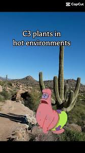
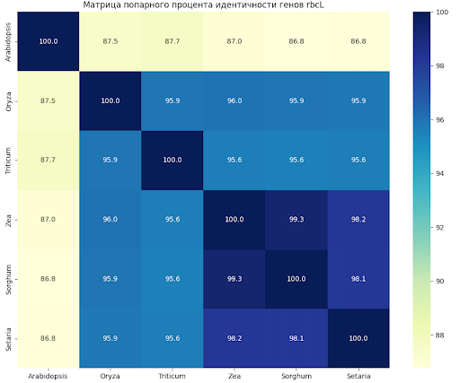
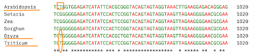

# Сравнение rbcL у C3- и C4-растений — поиск адаптивных мутаций

В этом проекте ты научишься проводить биоинформатический анализ и сравнить последовательности гена rbcL между растениями с разными типами фотосинтеза, найти различия и дать им биологическую интерпретацию.

Этот опыт подготовит тебя к работе с данными BLAST и выравниваниями и поможет уверенно стартовать в проектах, связанных с эволюционной биоинформатикой.

## Содержание

- [Как учиться в «Школе 21»](#%D0%BA%D0%B0%D0%BA-%D1%83%D1%87%D0%B8%D1%82%D1%8C%D1%81%D1%8F-%D0%B2-%D1%88%D0%BA%D0%BE%D0%BB%D0%B5-21)
- [Chapter I](#chapter-i)
  - [День из жизни биоинформатика: исследование фотосинтеза](#%D0%B4%D0%B5%D0%BD%D1%8C-%D0%B8%D0%B7-%D0%B6%D0%B8%D0%B7%D0%BD%D0%B8-%D0%B1%D0%B8%D0%BE%D0%B8%D0%BD%D1%84%D0%BE%D1%80%D0%BC%D0%B0%D1%82%D0%B8%D0%BA%D0%B0-%D0%B8%D1%81%D1%81%D0%BB%D0%B5%D0%B4%D0%BE%D0%B2%D0%B0%D0%BD%D0%B8%D0%B5-%D1%84%D0%BE%D1%82%D0%BE%D1%81%D0%B8%D0%BD%D1%82%D0%B5%D0%B7%D0%B0)
- [Chapter II](#chapter-ii)
  - [Задание 1. Поиск и скачивание данных](#%D0%B7%D0%B0%D0%B4%D0%B0%D0%BD%D0%B8%D0%B5-1-%D0%BF%D0%BE%D0%B8%D1%81%D0%BA-%D0%B8-%D1%81%D0%BA%D0%B0%D1%87%D0%B8%D0%B2%D0%B0%D0%BD%D0%B8%D0%B5-%D0%B4%D0%B0%D0%BD%D0%BD%D1%8B%D1%85)
  - [Задание 2. Подготовка к сравнению](#%D0%B7%D0%B0%D0%B4%D0%B0%D0%BD%D0%B8%D0%B5-2-%D0%BF%D0%BE%D0%B4%D0%B3%D0%BE%D1%82%D0%BE%D0%B2%D0%BA%D0%B0-%D0%BA-%D1%81%D1%80%D0%B0%D0%B2%D0%BD%D0%B5%D0%BD%D0%B8%D1%8E)
  - [Задание 3. Сравнение последовательностей](#%D0%B7%D0%B0%D0%B4%D0%B0%D0%BD%D0%B8%D0%B5-3-%D1%81%D1%80%D0%B0%D0%B2%D0%BD%D0%B5%D0%BD%D0%B8%D0%B5-%D0%BF%D0%BE%D1%81%D0%BB%D0%B5%D0%B4%D0%BE%D0%B2%D0%B0%D1%82%D0%B5%D0%BB%D1%8C%D0%BD%D0%BE%D1%81%D1%82%D0%B5%D0%B9)
  - [Задание 4. Выравнивание НК-последовательностей](#%D0%B7%D0%B0%D0%B4%D0%B0%D0%BD%D0%B8%D0%B5-4-%D0%B2%D1%8B%D1%80%D0%B0%D0%B2%D0%BD%D0%B8%D0%B2%D0%B0%D0%BD%D0%B8%D0%B5-%D0%BD%D0%BA-%D0%BF%D0%BE%D1%81%D0%BB%D0%B5%D0%B4%D0%BE%D0%B2%D0%B0%D1%82%D0%B5%D0%BB%D1%8C%D0%BD%D0%BE%D1%81%D1%82%D0%B5%D0%B9)
  - [Задание 5. Выравнивание АК-последовательностей](#%D0%B7%D0%B0%D0%B4%D0%B0%D0%BD%D0%B8%D0%B5-5-%D0%B2%D1%8B%D1%80%D0%B0%D0%B2%D0%BD%D0%B8%D0%B2%D0%B0%D0%BD%D0%B8%D0%B5-%D0%B0%D0%BA-%D0%BF%D0%BE%D1%81%D0%BB%D0%B5%D0%B4%D0%BE%D0%B2%D0%B0%D1%82%D0%B5%D0%BB%D1%8C%D0%BD%D0%BE%D1%81%D1%82%D0%B5%D0%B9)
  - [Задание 6. Анализ результата](#%D0%B7%D0%B0%D0%B4%D0%B0%D0%BD%D0%B8%D0%B5-6-%D0%B0%D0%BD%D0%B0%D0%BB%D0%B8%D0%B7-%D1%80%D0%B5%D0%B7%D1%83%D0%BB%D1%8C%D1%82%D0%B0%D1%82%D0%B0)
  - [Задание 7. Подтверждение результата](#%D0%B7%D0%B0%D0%B4%D0%B0%D0%BD%D0%B8%D0%B5-7-%D0%BF%D0%BE%D0%B4%D1%82%D0%B2%D0%B5%D1%80%D0%B6%D0%B4%D0%B5%D0%BD%D0%B8%D0%B5-%D1%80%D0%B5%D0%B7%D1%83%D0%BB%D1%8C%D1%82%D0%B0%D1%82%D0%B0)

## Как учиться в «Школе 21»

- Здесь тебя ждет уникальный образовательный опыт с бóльшим количеством свободы. Ты получаешь задачу и самостоятельно ищешь пути решения, используя любые удобные способы поиска информации — ресурсы интернета или нейросети (например, GigaChat). Но внимательно относись к качеству информации: проверяй, думай, анализируй, сравнивай.
- Взаимообучение (Peer-to-Peer, P2P) — это обмен знаниями и опытом с другими пирами, где каждый выступает и учителем, и учеником. Такой подход позволяет глубже понять материал, учась друг у друга.
- Чувствуй себя свободно и проси о помощи — вокруг тебя те, кто тоже впервые проходят этот путь. Делись своим опытом и идеями с другими. Присоединяйся к RocketChat, чтобы быть в курсе всех новостей от нашего сообщества.
- Твое обучение не будет иметь никакого смысла, если ты будешь копировать чужие решения. Если пользуешься помощью других — всегда разбирайся до конца, почему, как и зачем. Не бойся ошибиться.
- Кажется, что задача невыполнима? Сделай перерыв, проветрись, перезагрузи голову — это помогало многим. Возможно, после этого решение придет само собой.
- Важен не только результат обучения, но и сам процесс. Нужно не просто решить задачу, а понять, КАК ее решить.

Как работать с проектом:

- Перед выполнением проект необходимо склонировать с GitLab в одноименный репозиторий.
- Все файлы необходимо создавать в папке *src/* склонированного репозитория.
- После клонирования проекта необходимо создать ветку develop и вести разработку в ней. После этого пушить в GitLab также нужно ветку develop.
- В твоей директории не должно быть иных файлов, кроме тех, что обозначены в заданиях.

## Chapter I

### День из жизни биоинформатика: исследование фотосинтеза

**10:00. Начало дня**

Вчера на семинаре обсудили план научной деятельности лаборатории на ближайший месяц.

Сегодня передо мной стоит задача — «раскрыть секрет эффективности кукурузы», а именно — разобраться, почему C4-растения (такие как кукуруза) — эффективнее в фотосинтезе, в отличие от C3-растений (например, пшеницы).

Все дело в ключевом ферменте Рубиско, который кодируется геном rbcL. Может быть, у С4-растений в самом гене есть особые «апгрейды»-мутации?

**10:20. Теория и планирование**

Прежде чем начинать, повторяю биологию.

Рубиско — это ключевой фермент фотосинтеза, который захватывает CO₂ из воздуха, чтобы запустить процесс «создания сахаров». Существует проблема — он может ошибаться и вместо CO₂ захватывать кислород, осуществляя фотодыхание.

Эта ошибка сильно снижает эффективность фотосинтеза, особенно у C3-растений.

А вот С4-растения придумали механизм, чтобы уменьшить эту проблему Рубиско.

| **C3-растения («Классики»)**  **Пшеница 🌾** | **C4-растения («Стартаперы»)**  **Кукуруза 🌽** |
| --- | --- |
| Напрямую фиксируют CO₂ в цикле Кальвина при помощи фермента **Рубиско**. | Дополнительный этап-концентратор CO₂ перед циклом Кальвина.CO₂ сначала фиксируется ферментом PEP-карбоксилазой в мезофилльных клетках, а потом переносится в обкладочные клетки, где работает Рубиско.  Такой «двухступенчатый» механизм помогает Рубиско меньше ошибаться и почти избавляет от фотодыхания. |
| При высокой температуре и ярком свете Рубиско начинает связывать O₂ вместо CO₂, из-за чего снижается эффективность (возникает фотодыхание). | Фотосинтез остается эффективным в жарком климате. |

***Моя текущая гипотеза:*** в процессе эволюции сам белок Рубиско у С4-растений мог немного измениться, делая их более эффективными по сравнению с С3-растениями.

Но так ли это? Именно на этот вопрос мне предстоит ответить в данном проекте.

Итак, мой план на сегодня:

- Собрать данные: для этого мне потребуются последовательности гена rbcL как минимум для трех C3-растений (резуховидка Таля, рис, пшеница) и трех C4-растений (кукуруза, сорго, просо).
- Сравнить все со всем: создать скрипт, который автоматически запустит BLAST для каждой пары растений и построит красивую цветную матрицу (heatmap), чтобы сразу увидеть степень схожести генов.
- Найти точные отличия: сделать множественное выравнивание всех последовательностей и вручную искать позиции, где у всех C3 одна буква (нуклеотид/аминокислота), а у всех C4 — другая.
- Сделать выводы: попробовать понять, могут ли найденные отличия быть теми самыми адаптивными мутациями и менять структуру и функцию белка Рубиско.

**11:30. Старт работы**

План разработан, могу приступать к выполнению.

Для начала мне нужно загрузить данные для анализа.

Решаю автоматизировать загрузку. Для примера начинаю с риса (*Oryza sativa*). Ввожу:

`search_handle = Entrez.esearch(db="nucleotide", term='rbcL AND "Oryza sativa"[Organism] AND "complete cds"')`

И тут появляется:

`IndexError: list index out of range`

Процесс падает с этой ошибкой. Что же не так?

Поисковый запрос не вернул ни одного результата! IdList пустой!

Так бывает, если запрос слишком строгий. В моем идеальном мире для каждого вида в базе существовала бы полная кодирующая последовательность (complete cds), и она была бы помечена именно так.

Скрипт не думает, он просто выполняет команды, возможно, сам запрос был некорректен — последовательность в базе могла быть помечена иначе, она могла быть неполной, или название вида могло иметь синоним или вариацию.

Как же не хочется все делать вручную.

Упрощаю запрос. Сначала ищу просто `rbcL AND "Oryza sativa"[Organism]`, вывожу список найденных записей, чтобы выбрать подходящую ID вручную.

Автоматизация — это здорово, но слепо доверять ей нельзя. Всегда нужно проверять, что вернул запрос.

**12:30. Сравнение**

Ура, последовательности наконец собраны (через NCBI и TAIR). Теперь создаю локальную BLAST-базу и приступаю к написанию скрипта для попарного сравнения.

`OSError: [Errno 2] No such file or directory: 'blastn'`

Скрипт пытался запустить BLAST, но не нашел программу blastn.

- BLAST установлен на компьютер? Да.
- Система знает, где его искать? Нет.

Исполняемые файлы (blastn, makeblastdb) не добавлены в переменную среды PATH. Когда скрипт Python вызывает blastn, система не понимает, по какому адресу на диске находится эта программа.

Жизненный урок биоинформатики: бóльшая часть успеха — это не написание алгоритмов, а решение «скучных» технических вопросов — пути к файлам, версии ПО, форматы данных.

Прописываю полный путь к исполняемым файлам BLAST, и скрипт заработал!

**14:30. Анализ данных**

Матрица и тепловая карта построены.

На тепловой карте четко видно два ярких кластера!

Что показывает карта?

- Все C3-растения очень похожи друг на друга — идентичность около 95–98%.
- Все C4-растения тоже очень схожи внутри группы.

Но между этими двумя группами идентичность уже ниже (~90–92%). Любопытный результат!

**15:00. Выравнивание нуклеотидных последовательностей**

Загружаю все последовательности в Clustal Omega, делаю множественное выравнивание (MSA).

Clustal Omega — программа для множественного выравнивания белков или ДНК. Она располагает последовательности друг под другом так, чтобы похожие участки совпали.

Как это работает?

Основной принцип — сначала быстро найти похожие последовательности и построить «дерево родства», затем использовать это дерево как инструкцию для точного выравнивания.

Что получается в результате?

Выровненные последовательности, где видны:

- Консервативные (неизменные) участки — области, где все совпадают, обычно отмечены символом «\*». Это часто важные для функции участки.
- Переменные регионы — где последовательности отличаются.

Обращаю внимание на символы «\*» и «-».

- Гэпы (-) вставляются программой, чтобы компенсировать вставки или делеции в ходе эволюции.
- Если гэпы встречаются в одном и том же месте у многих последовательностей — это может указывать на важное эволюционное событие.
- Случайные гэпы у одной последовательности — просто уникальная особенность.

Изучая множественное выравнивание, я нахожу любопытную колонку.

В одной из позиций наблюдается разница между С3 и С4.

Вопрос: вызывает ли эта разница замену аминокислоты?

**16:00. Выравнивание аминокислотных последовательностей**

Чтобы проверить влияние на аминокислотный состав, я перевожу нуклеотидную последовательность в аминокислотную.

Теперь ищу замены уже в самом белке. Для этого снова запускаю множественное выравнивание в Clustal Omega.

…И нахожу несколько позиций, где аминокислоты стабильно различаются между группами C3 и C4.

Но достаточно ли этих данных, чтобы сделать устойчивый вывод?

**17:00. To be continued**

Размышляю над полученными результатами — очень хочется сделать промежуточный вывод: найден кандидат на «адаптивную мутацию». Но нужно в этом убедиться.

Проблема в том, что для анализа всего 6 последовательностей — это мало.

Завтра планирую расширить выборку и посмотреть, насколько часто встречается замена Ser на Pro.

Также важно понять, какой биологический процесс может быть связан с этой заменой.

Возможно, она влияет на жесткость белковой цепи. Это изменение могло бы помочь белку Рубиско лучше работать в условиях высоких концентраций углекислого газа, создаваемых C4-циклом.

Но, возможно, моя теория не подтвердится.

Окажется, что у C3- и C4-растений нет «адаптивных мутаций» в гене rbcL, кодирующем большую субъединицу фермента Рубиско, а весь секрет фотосинтеза в том, что место экспрессии гена отличается.

## Chapter II

В данном проекте тебе предстоит почувствовать себя в роли главного героя-биоинформатика из предыдущей главы, который ищет следы естественного отбора в ДНК.

Твоя цель — понять, какие генетические изменения помогли C4-растениям приобрести выдающиеся способности к фотосинтезу.

Изучение адаптивных мутаций — фундамент современной биологии. Понимая, какие именно изменения в геноме приводят к улучшению признаков, ученые могут создавать высокоэффективные сорта растений, которые лучше переносят холод, жару и засуху, дают больше урожая, дольше хранятся, а может быть, обладают невероятным вкусом.

В реальности такой поиск — сложный многоэтапный процесс. Ученые анализируют фенотипы (то, как именно проявляется генотип в тех или иных условиях окружающей среды), формируют группы для сравнения (например, растения, которые показывают хорошие результаты при жаре, и растения, которые показывают плохие результаты), выдвигают гипотезы (изменение в каком белке могли привести к улучшению результата) и лишь затем приступают к анализу генов.

Но твоя задача в этом проекте — сфокусироваться на ключевом этапе проверки гипотезы. Ты уже знаешь, что:

- C4-растения (кукуруза, сорго) эффективнее C3 (пшеница, рис);
- ключевой фермент их фотосинтеза — Рубиско, кодируемый геном rbcL.

Твоя гипотеза: в гене rbcL у C4-растений есть специфические мутации, которые стали эволюционным преимуществом.

Научный поиск не всегда приводит к простому и очевидному результату. Возможно, твой анализ покажет, что явных «апгрейдов» в самом гене rbcL нет, и вся эффективность C4-фотосинтеза обеспечивается другими механизмами. *Это тоже будет большим научным открытием в рамках проекта!*

Умение корректно интерпретировать «отрицательный» результат — важнейший навык биоинформатика.

Именно построение гипотез и изучение биологических процессов на всех уровнях помогает ученым выявлять те самые данные для создания новых сортов и гибридов.

А сейчас, используя биоинформатические инструменты (BLAST, Clustal Omega, Biopython), тебе предстоит сравнить последовательности гена rbcL между растениями с разными типами фотосинтеза, найти различия и дать им биологическую интерпретацию.

Для работы тебе понадобятся:

- Установленный Python (рекомендуется версия 3.8+).
- Установленный [Biopython](https://biopython.org/wiki/Download) ([документация тут](https://biopython.org/docs/1.75/api/index.html)).
- [Bio Enterez](https://biopython.org/docs/1.76/api/Bio.Entrez.html), [SeqIO](https://biopython.org/wiki/SeqIO).
- BLAST.
- Библиотеки pandas, matplotlib (matplotlib.pyplot), seaborn.
- [Clustal Omega](https://www.ebi.ac.uk/jdispatcher/msa/clustalo).

## Задание 1. Поиск и скачивание данных

1. Создай структуру папок:

- project7
  - results
  - data
  - scripts

2. Для старта работы тебе необходимо найти и скачать последовательности rbcL для выбранных видов:

- C3-растения: Арабидопсис (Arabidopsis thaliana), рис (Oryza sativa), пшеница (Triticum aestivum).
- C4-растения: Кукуруза (Zea mays), сорго (Sorghum bicolor), просо (Setaria italica).

Для выполнения данной задачи ты можешь выбрать любой вариант, который более удобен для тебя:

- Автоматизация загрузки данных через Biopython (Bio.Entrez): написать скрипт для автоматического извлечения последовательностей из NCBI.
- Поиск и скачивание вручную: получить нуклеотидные последовательности гена rbcL для всех растений (NCBI Nucleotide/TAIR) через поисковые запросы в веб-интерфейсе.

Выбери референсную (удобочитаемую, проверенную) последовательность из результатов и скачай ее в формате FASTA.

Сохрани последовательности в папку data. Назови файлы согласно наименованию растения, например, `Arabidopsis_thaliana.fasta`.

3. Создай два файла: `c3_sequences.fasta` и `c4_sequences.fasta` и сохрани в них соответствующие последовательности. Помести получившиеся файлы в папку data.

## Задание 2. Подготовка к сравнению

Тебе предстоит создать локальную базу данных для последующего множественного попарного сравнения последовательностей с помощью BLAST.

- Создай файл `2_1.fasta`, содержащий все 6 последовательностей (3 C3 и 3 C4) в формате FASTA. Помести его в папку data.
- Создай локальную BLAST-базу данных: используй makeblastdb для создания локальной базы данных из файла `2_1.fasta`. Для выходных файлов используй префикс 2\_2.

Результаты сохрани в папку results.

## Задание 3. Сравнение последовательностей

Тебе предстоит произвести множественное попарное сравнение последовательностей с помощью BLAST: сравнить каждую последовательность из твоего набора со всеми другими, построить матрицу попарного сходства, выявить особенности внутри группы C3, группы С44 и между группами C3 и C4 и интерпретировать результаты.

- Создай скрипт на Python, который будет автоматически запускать BLAST для каждой последовательности против созданной базы. Помести скрипт в папку scripts.

Скрипт должен включать следующие этапы:

- Считывать все последовательности, чтобы получить их идентификаторы:
  - создать матрицу для результатов;
  - перебирать каждую последовательность как запрос;
  - запускать BLAST: искать запрос в локальной базе;
  - разбирать результаты BLAST, извлекая ID последовательности из базы и процент идентичности;
  - заполнять матрицу значением процента идентичности;
  - сохранять матрицу в файл `3_1.csv` (в папке results);
  - строить тепловую карту для визуализации (`3_1.png` в папке results).

Пример формата тепловой карты:

- Создай файл `answer3.txt`, помести его в папку results и сохрани в него мини-отчет с выводами и наблюдениями:
  - Какая пара последовательностей имеет самый низкий процент идентичности среди межгрупповых сравнений?
  - Основываясь на матрице, укажи пары последовательностей, которые ты считаешь наиболее интересными для детального изучения в рамках множественного сравнения в следующих заданиях (4, 5). В отчете укажи краткую причину, почему ты выбираешь именно эти пары.

## Задание 4. Выравнивание НК-последовательностей

Тебе предстоит визуализировать различия и сходства между всеми нуклеотидными последовательностями.

- Проведи множественное выравнивание (Multiple Sequence Alignment, MSA) нуклеотидных последовательностей с помощью онлайн-сервиса Clustal Omega.

Сохрани выдачу программы в папку results, назови файл согласно пункту и подпункту задания 4\_1.

- Изучи выдачу программы. Визуализируй результат выравнивания.

Проведи поиск позиций, где все C3-растения имеют один нуклеотид, а все C4-растения — другой.

Сделай скриншоты выдачи (минимум 1), где можно однозначно увидеть отличия (выдели их) между С3 и С4.

Пример скриншота (идентификаторы последовательностей и наименования растений слева скрыты, но должны быть в твоих скриншотах):

Сохрани скриншоты в папку results. Назови их согласно пункту, подпункту задания и порядковой нумерации. Например, `4_2_1.png`, `4_2_2.png` и т. д.

## Задание 5. Выравнивание АК-последовательностей

Тебе предстоит визуализировать различия и сходства между всеми аминокислотными последовательностями. Определи, являются ли замены синонимичными (не меняют аминокислоту) или несинонимичными (меняют аминокислоту). Именно несинонимичные замены потенциально адаптивны.

- Трансляция в код белка. «Преобразуй» нуклеотидную последовательность в аминокислотную — для этого можно использовать онлайн-сервис, например, [этот](http://molbiol.ru/scripts/01_13.html).

Сохрани все полученные белковые последовательности в файл `5_1.fasta` в папку data. Сохрани идентификаторы, которые были ранее для удобства сравнения.

- Проведи множественное выравнивание аминокислотных последовательностей в Clustal Omega. Сохрани выдачу программы в папку results, назови файл согласно пункту и подпункту задания 5\_2.
- Изучи выдачу программы. Визуализируй результат выравнивания.

Проведи поиск позиции, где все C3-растения имеют одну аминокислоту, а все C4-растения — другую.

Сделай скриншот выдачи, где можно однозначно увидеть отличия (выдели их) между С3 и С4.

Сохрани скриншоты в папку results. Назови их согласно пункту, подпункту задания и порядковой нумерации. Например, `5_3_1.png`, `5_3_2.png` и т. д.

## Задание 6. Анализ результата

Тебе предстоит проанализировать полученный результат, сформулировать выводы и попытаться связать их с существующими научными знаниями.

- Создай файл `answer6.txt` (помести его в папку results) и сохрани в него мини-отчет.

Кратко опиши все найденные устойчивые паттерны (нуклеотидные и аминокислотные), которые, по твоим наблюдениям, коррелируют с типом фотосинтеза.

Используй формат: «В позиции X у всех/большинства C3-растений обнаружена аминокислота A, в то время как у всех/большинства C4-растений — аминокислота B».

- Попробуй найти информацию о найденной тобой замене аминокислоты и ее связи с изменением активности или стабильности Рубиско. Создай файл `answer6.1.txt`, помести в него свои поисковые запросы и напиши 2–3 предложения о том, подтверждаются ли твои выводы литературными данными. Если удастся найти конкретную статью, то укажи ее название и авторов. Если нет, то опиши процесс поиска и почему, возможно, не удалось найти прямых подтверждений.

## Задание 7. Подтверждение результата

Тебе предстоит подтвердить/опровергнуть надежность первоначальных выводов на бóльшей выборке.

- Выбери еще три С3- и три С4-растения других видов. Чтобы проверить надежность находок, новые C3 и C4 следует выбрать из других семейств, не представленных в твоей первоначальной выборке.

Создай файл `answer7.txt` в папке results и сохрани в нем названия шести выбранных С3- и С4-растений и краткое обоснование их выбора.

- Скачай их последовательности, выполни «перевод» в аминокислотные последовательности, добавь полученные аминокислотные последовательности в файл с последовательностями (для получения бóльшей выборки).

Сохрани получившийся файл `7_1.fasta` в папку data.

- Повтори множественное выравнивание для расширенного набора аминокислотных последовательностей. Сохрани выдачу программы в папку results, назови файл согласно пункту и подпункту задания 7\_2.
- Вопросы, которые точно спросит твой тимлид:\
  *«Были ли найдены устойчивые паттерны замен, ассоциированные с C4-фотосинтезом?»*\
  *«Подтвердилась ли твоя гипотеза «В гене rbcL у C4-растений есть специфические мутации, которые стали эволюционным преимуществом»?»*\
  Подготовь ответ к P2P-проверке.