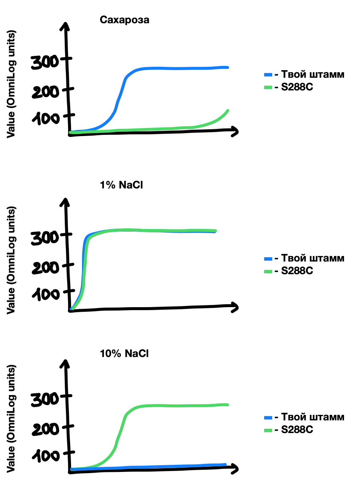

# Идентификация SNP в SUC2 и ENA1 — связь с осмотическим стрессом

В этом проекте ты научишься выполнять базовый биоинформатический анализ, находить изменения в генах SUC2 и ENA1 и изучать, как они связаны с осмотическим стрессом. Также ты научишься интерпретировать полученные результаты с точки зрения биологии.

Этот опыт поможет тебе подготовиться к работе с задачами из области аналитической биоинформатики, где важно анализировать генетические вариации и искать необходимую информацию в научной литературе.

## Содержание

- [Как учиться в «Школе 21»](#%D0%BA%D0%B0%D0%BA-%D1%83%D1%87%D0%B8%D1%82%D1%8C%D1%81%D1%8F-%D0%B2-%D1%88%D0%BA%D0%BE%D0%BB%D0%B5-21)
- [Chapter I](#chapter-i)
  - [День из жизни биоинформатика: охота на дрожжевые гены SUC2 и ENA1](#%D0%B4%D0%B5%D0%BD%D1%8C-%D0%B8%D0%B7-%D0%B6%D0%B8%D0%B7%D0%BD%D0%B8-%D0%B1%D0%B8%D0%BE%D0%B8%D0%BD%D1%84%D0%BE%D1%80%D0%BC%D0%B0%D1%82%D0%B8%D0%BA%D0%B0-%D0%BE%D1%85%D0%BE%D1%82%D0%B0-%D0%BD%D0%B0-%D0%B4%D1%80%D0%BE%D0%B6%D0%B6%D0%B5%D0%B2%D1%8B%D0%B5-%D0%B3%D0%B5%D0%BD%D1%8B-suc2-%D0%B8-ena1)
- [Chapter II](#chapter-ii)
  - [Задание 1. Подготовка директории](#%D0%B7%D0%B0%D0%B4%D0%B0%D0%BD%D0%B8%D0%B5-1-%D0%BF%D0%BE%D0%B4%D0%B3%D0%BE%D1%82%D0%BE%D0%B2%D0%BA%D0%B0-%D0%B4%D0%B8%D1%80%D0%B5%D0%BA%D1%82%D0%BE%D1%80%D0%B8%D0%B8)
  - [Задание 2. Разработка плана действий](#%D0%B7%D0%B0%D0%B4%D0%B0%D0%BD%D0%B8%D0%B5-2-%D1%80%D0%B0%D0%B7%D1%80%D0%B0%D0%B1%D0%BE%D1%82%D0%BA%D0%B0-%D0%BF%D0%BB%D0%B0%D0%BD%D0%B0-%D0%B4%D0%B5%D0%B9%D1%81%D1%82%D0%B2%D0%B8%D0%B9)
  - [Задание 3. Следуй плану](#%D0%B7%D0%B0%D0%B4%D0%B0%D0%BD%D0%B8%D0%B5-3-%D1%81%D0%BB%D0%B5%D0%B4%D1%83%D0%B9-%D0%BF%D0%BB%D0%B0%D0%BD%D1%83)
  - [Задание 4. Статистика выравнивания](#%D0%B7%D0%B0%D0%B4%D0%B0%D0%BD%D0%B8%D0%B5-4-%D1%81%D1%82%D0%B0%D1%82%D0%B8%D1%81%D1%82%D0%B8%D0%BA%D0%B0-%D0%B2%D1%8B%D1%80%D0%B0%D0%B2%D0%BD%D0%B8%D0%B2%D0%B0%D0%BD%D0%B8%D1%8F)
  - [Задание 5. Вызов SNP с помощью VarScan](#%D0%B7%D0%B0%D0%B4%D0%B0%D0%BD%D0%B8%D0%B5-5-%D0%B2%D1%8B%D0%B7%D0%BE%D0%B2-snp-%D1%81-%D0%BF%D0%BE%D0%BC%D0%BE%D1%89%D1%8C%D1%8E-varscan)
  - [Задание 6. Вызов SNP с помощью GATK](#%D0%B7%D0%B0%D0%B4%D0%B0%D0%BD%D0%B8%D0%B5-6-%D0%B2%D1%8B%D0%B7%D0%BE%D0%B2-snp-%D1%81-%D0%BF%D0%BE%D0%BC%D0%BE%D1%89%D1%8C%D1%8E-gatk)
  - [Задание 7. Анализ SNP с помощью JBrowse2](#%D0%B7%D0%B0%D0%B4%D0%B0%D0%BD%D0%B8%D0%B5-7-%D0%B0%D0%BD%D0%B0%D0%BB%D0%B8%D0%B7-snp-%D1%81-%D0%BF%D0%BE%D0%BC%D0%BE%D1%89%D1%8C%D1%8E-jbrowse2)

## Как учиться в «Школе 21»

- Здесь тебя ждет уникальный образовательный опыт с большим количеством свободы. Ты получаешь задачу и самостоятельно ищешь пути решения, используя любые удобные способы поиска информации — ресурсы интернета или нейросети (например, GigaChat). Но внимательно относись к качеству информации: проверяй, думай, анализируй, сравнивай.
- Взаимообучение (Peer-to-Peer, P2P) — это обмен знаниями и опытом с другими пирами, где каждый выступает и учителем, и учеником. Такой подход позволяет глубже понять материал, учась друг у друга.
- Чувствуй себя свободно и проси о помощи — вокруг тебя те, кто тоже впервые проходят этот путь. Делись своим опытом и идеями с другими. Присоединяйся к RocketChat, чтобы быть в курсе всех новостей от нашего сообщества.
- Твое обучение не будет иметь никакого смысла, если ты будешь копировать чужие решения. Если пользуешься помощью других — всегда разбирайся до конца, почему, как и зачем. Не бойся ошибиться.
- Кажется, что задача невыполнима? Сделай перерыв, проветрись, перезагрузи голову — это помогало многим. Возможно, после этого решение придет само собой.
- Важен не только результат обучения, но и сам процесс. Нужно не просто решить задачу, а понять, КАК ее решить.

Как работать с проектом:

- Перед выполнением проект необходимо склонировать с GitLab в одноименный репозиторий.
- Все файлы необходимо создавать в папке *src/* склонированного репозитория.
- После клонирования проекта необходимо создать ветку develop и вести разработку в ней. После этого пушить в GitLab также нужно ветку develop.
- В твоей директории не должно быть иных файлов, кроме тех, что обозначены в заданиях.

## Chapter I

### **День из жизни биоинформатика: охота на дрожжевые гены SUC2 и ENA1**

**10:00. Задача**

Сегодня в приоритете задача от коллег-биологов, которые занимаются созданием дрожжей для различных отраслей промышленности. Особый интерес представляет разработка штаммов для виноделия: это отечественные технологии, позволяющие раскрывать потенциал как традиционных, так и автохтонных сортов. Очень актуальная задача с реальным внедрением, мне нравится моя работа. :)

Надо разобраться, почему одни дрожжи делают вино хорошо, а другие — нет. Виноделы говорят про «хорошие штаммы», а мы, биоинформатики, знаем, что все дело в генах.

Сегодня на повестке новый штамм дрожжей и два интереснейших гена: SUC2 (инвертаза, помогает дрожжам расщеплять сахарозу) и ENA1 (натриевая помпа, выкачивает «соль» при осмотическом стрессе — поддерживает низкие концентрации ионов натрия в клетке).

Oсмотический стресс — один из главных врагов дрожжей в бродящем сусле. Если SUC2 отключается при стрессе, а ENA1, наоборот, должен включаться на полную, то хороший винный штамм должен уметь балансировать между этими состояниями. Запутанная история, но нужно разобраться.

**10:30. Подготовка данных**

Со стороны может показаться, что вся моя работа состоит из одних и тех же рутинных пайплайнов.

Однако это не так: работа биоинформатика очень сильно привязана к объекту. Именно от объекта исследования зависят многие особенности выбора и настроек в программах.

Биология — наука не столько о правилах, сколько об исключениях, поэтому я сначала обращаю внимание на то, что именно изучаю в конкретном случае, и только потом разрабатываю оптимальные пути решения задачи.

Как же хочется потратить меньше времени на решение задачи. Проверяю, все ли программы установлены. VarScan скачан, вроде работает.

Где тут мои прочтения? Скачиваю файлы прочтений и референсный геном с NCBI Nucleotide.

Хорошо, что с выбором референсного генома все просто: дрожжи — классика жанра! Без тени сомнения скачиваю fasta для S288C, ведь это самая стандартная и широко известная референсная сборка, если речь идет о Saccharomyces cerevisiae. В большинстве научных статей используют именно такой референс.

**11:00. Контроль качества. FastQC**

`fastqc ksd.fq -o ../results/fastqc/`

Запустилось... Пойду еще кофе налью.

**11:15. Очистка прочтений**

Работа FastQC завершена. Вроде бы ничего критичного: немного адаптеров, чуть-чуть дупликатов.

Запускаю Trimmomatic.

**11:30. Подготовка прочтений к сборке**

И снова FastQC для триммированных прочтений.

Все в порядке, можно идти к сборке.

**11:40. Сборка**

Буду проводить выравнивание на референс.

А пока алгоритм трудится, почитаю статьи о различных полиморфизмах (SNP), встречающихся в генах SUC2 и ENA1. Интересно, что действительно существуют SNP как в гене SUC2, так и в промоторе, влияющие на экспрессию!

А ген ENA1... Это же главный насос по выкачиванию натрия! Если в нем есть усиливающие мутации — штамм будет суперустойчив к осмотическому стрессу.

Надо проверить оба гена в моем штамме и подробнее изучить литературу: как хорошо, что в NCBI PubMed по ключевым словам можно найти все!

**12:00. SAMtools: конвертация, сортировка, индексирование**

```
samtools view -Sb output.sam > aligned.bam

samtools sort aligned.bam -o aligned_sorted.bam

samtools index aligned_sorted.bam
```

Запускаю конвертацию, сортировку и индексирование для двух отсеквенированных хромосом: 4 и 9.

Время переходить к самому интересному — вызову вариантов.

**12:30. Проблема: GATK отказывается работать**

`gatk HaplotypeCaller -R S288C_9.fasta -I aligned.sorted_ksd_9.bam -O your_output_9.g.vcf -ERC GVCF`

Возникает ошибка! В BAM-файле нет Read Groups (@RG)! GATK так не умеет!

*Почему GATK так принципиально относится к этим Read Groups?*

Точно, вспоминаю. Это требование — не прихоть, а часть системы обеспечения точности.

В старых данных их и нет. Чтобы их добавить, нужно запустить Picard Tools, а точнее ее аналог внутри GATK.

**13:30. Спасение ВАМ-файлов**

```
gatk AddOrReplaceReadGroups \

    -I aligned.sorted_ksd_9.bam \

    -O aligned.sorted_ksd_9.withRG.bam \

    -LB lib1 \

    -PL illumina \

    -PU unit1 \

    -SM ksd_9
```

Теперь снова сортирую и индексирую... Сколько же шагов!

```
samtools sort -o aligned_sorted.withRG.sorted.bam aligned_sorted.withRG.bam

samtools index aligned_sorted.withRG.sorted.bam
```

**14:30. Наконец-то вызов вариантов!**

Запускаю HaplotypeCaller и GenotypeGVCFs для обеих хромосом. Работает! Получаю VCF-файлы.

Параллельно запускаю VarScan. Надо бы сравнить выдачи, чтобы точно не упустить ни один из вариантов!

**15:30. Фильтрация и самое интересное — анализ в JBrowse2**

Провожу фильтрацию SNP, отделяя значимые с порогом в 60%.

Загружаю свои BAM, VCF и референсный геном в JBrowse2.

Первый сюрприз: VCF-файлы VarScan не загружаются. Хм… Почему так?.. Точно! JBrowse2 не работает с такими VCF-файлами.

Как же хорошо, что GATK у меня тоже запущен!

Ищу гены SUC2 и ENA1.

Смотрю замены в гене SUC2 для моего штамма по сравнению с референсом S288C:

- Первая позиция — `C -> T`:\
  Это синонимичная замена (Ser->Ser). Ничего интересного.
- А вот и вторая — `A -> C`:\
  Вот это да! Аспарагин (N) -> Гистидин (H)! Та самая замена, про которую писали в статье!

**16:45. Переключаюсь на ENA1. Вот это да!**

Ген ENA1 — это просто «поле битвы»: в нашем штамме по сравнению с S288C целый набор вариантов.

- Замена в кодирующей области: Глицин (G) -> Аспарагиновая кислота (D). Может влиять на структуру белка.
- Еще одна миссенс-замена: Аланин (A) -> Валин (V). Консервативная, но все же...

Продолжаю анализ…

**18:15. Вечернее озарение**

Картина вырисовывается грандиозная! Наш штамм-лидер — это не случайный набор свойств, а тщательно сбалансированная система, оптимизированная для экстремальных условий виноделия.

- По SUC2: есть аминокислотные замены, подтверждаются литературой. Также у него «сильный» промотор, который, вероятно, позволяет поддерживать экспрессию инвертазы на приличном уровне даже при легком стрессе.
- По ENA1: здесь целый арсенал! Множество замен в самом белке (может, они даже усиливают работу помпы?) и также «усиленный» промотор. Это значит, что при осмотическом стрессе (а в вине его предостаточно) наш штамм моментально включает систему детоксикации и выкачивает из клетки все лишнее.

Выходит, потенциальный успех штамма — в комбинации «тюнинга» промоторов ключевых генов и вариантов в кодирующих последовательностях.

Маркеры «успешного штамма» найдены, можно передавать в тестирование.

**18:45. Выводы и планы на завтра**

Нужно:

- Посмотреть на экспрессию SUC2 и ENA1 в RNA-seq данных (когда они будут у коллег-биологов), чтобы подтвердить гипотезу о работе промоторов.
- Зафиксировать в методичке, что при анализе винных дрожжей следует смотреть и на кодирующую последовательность, и на промотор генов SUC2 и ENA1, а также на гены сигнального пути. Чувствую, что коллеги-биологи серьезно настроены на создание «идеальных» дрожжей, а значит, задачи такого типа будут возникать регулярно. К тому же скоро еще и студенты на практику придут.
- Дописать отчет для коллег, где четко описать свои действия по решению сегодняшней задачи.

**19:15. Финал дня**

Выключаю компьютер. Охота на гены завершена успешно. Кажется, теперь я понимаю, что может делать эти дрожжи сильными. Окончательный вердикт — за экспериментом.

## Chapter II

Теперь тебе предстоит почувствовать себя в роли главного героя-биоинформатика из предыдущей главы, исследующего только что отсеквенированный штамм дрожжей.

Твоя цель — понять, какие генетические изменения в генах ENA1 и SUC2 делают этот штамм перспективным для виноделия.

У тебя есть преимущество на старте: экспериментальные данные о поведении штамма в различных условиях. Эти реальные данные помогут тебе при анализе.

На графиках показана активность дыхания бактерий во времени. Каждая линия показывает, как активно бактерии питаются одним конкретным веществом (например, сахаром). Активное питание приводит к дыханию, которое прибор фиксирует в условных единицах (OmniLog units, ось Y). Чем выше линия, тем активнее бактерии потребляют это вещество и растут. Ось X — время. Сравнивая графики для разных условий, можно увидеть, как эти условия влияют на метаболизм бактерий.



А сейчас, используя биоинформатические инструменты (JBrose2, Samtools, Biopython), тебе необходимо сравнить последовательности генов ENA1 и SUC2 между дрожжами с различной степенью эффективности, найти различия и дать им биологическую интерпретацию, основываясь в том числе на анализе литературы.

Для работы тебе понадобятся:

- Установленный Python (рекомендуется версия 3.8+).
- Установленный [Biopython](https://biopython.org/wiki/Download) ([документация тут](https://biopython.org/docs/1.75/api/index.html)).
- Программа [FasQC](https://www.bioinformatics.babraham.ac.uk/projects/fastqc/).
- Программа [MultiQC](https://seqera.io/multiqc/).
- Программа [Trimmomatic](http://www.usadellab.org/cms/?page=trimmomatic).
- Программа [Samtools](http://www.htslib.org/).
- Программа [BWA](https://github.com/lh3/bwa) / программа [Bowtie2](https://bowtie-bio.sourceforge.net/bowtie2/manual.shtml).
- Программа [GATK](https://gatk.broadinstitute.org/).
- Программа [Picard](https://broadinstitute.github.io/picard/).
- Программа [VarScan](https://varscan.sourceforge.net).
- Программа [JBrowse2](https://jbrowse.org/jb2/download/).

## Задание 1. Подготовка директории

- Создай структуру папок:

  - project8
    - results
    - data
- Скачай data samples из одноименной папки — 4 файла с парными «сырыми» прочтениями хромосом 4 и 9 штамма дрожжей (R1 — прямое прочтение, R2 — обратное прочтение). Пожалуйста, не переименовывай их. Помести эти файлы в папку data.
- Скачай референсный геном для хромосом 4 и 9 и аннотации для них в папку data. Сборка R64 Saccharomyces cerevisiae S288C. Скачай файлы последовательностей для хромосом 4 и 9 в fasta-формате (формат данных — RefSeq, complete sequence). Назови файлы `4.fasta` и `9.fasta`. Формат файлов с аннотациями — Gff3. Назови файлы `4.gff3` и `9.gff3`.

## Задание 2. Разработка плана действий

В этом задании тебе предстоит разработать план действий для изучения вариантов в генах SUC2 и ENA1. А прежде чем ты начнешь, определи для себя, в какой из хромосом находится каждый ген и какие у него координаты (тебе нужно знать, на что обращать внимание).

- Получи BAM-файлы с помощью любого из двух знакомых тебе алгоритмов выравнивания (BWA/Bowtie2) для дальнейшего анализа.
- Создай файл `answer2.txt`. В документе отрази план работ: последовательность шагов анализа и названия выходных файлов, которые ты планируешь получить в соответствии с шагами. Файлы необходимо называть согласно R1/R2 и результату (чтобы не запутаться). Посмотри внимательно на пример из дня героя-биоинформатика: так, результат триммирования будет иметь название `4_R1_trimmed.fasta` и т. д.

## Задание 3. Следуй плану

В этом задании тебе нужно будет реализовать разработанный план по анализу вариантов в генах SUC2 и ENA1.

Помни, что твоя задача была — получить сортированные BAM-файлы хромосом 4 и 9, используя выбранный алгоритм выравнивания, для последующего вызова вариантов.

- Начинай работу в соответствии со своим планом. Помни, что названия полученных файлов должны соответствовать упомянутым в `answer2.txt`. Помещай полученные файлы в папку results.

## Задание 4. Статистика выравнивания

В этом задании тебе предстоит проанализировать проведенное выравнивание на референс с помощью Samtools flagstat.

- Запусти команду и сохрани скриншоты выдачи в папку results. Назови файлы согласно хромосоме и номеру задания `4_4.png` и `9_4.png`.

## Задание 5. Вызов SNP с помощью VarScan

В этом задании тебе предстоит провести вызов вариантов (именно SNP) с помощью VarScan и проанализировать выдачу.

- Проведи вызов вариантов для полученных сборок хромосом 4 и 9 с помощью VarScan. Для этого сделай шаг 1: создание pileup-файла. Сохрани полученные файлы в папку results. Назови файлы согласно хромосоме и номеру задания `4_5.pileup` и `9_5.pileup`. Для выполнения задания используй выровненные и отсортированные BAM-файлы!
- Выполни шаг 2: запуск VarScan для поиска SNP. Подбери разумные параметры min-coverage, min-var-freq и p-value (всегда внимательно изучай инструкции к инструменту). Сохрани полученные файлы в папку results. Назови файлы согласно хромосоме и номеру задания `4_5.vcf` и `9_5.vcf`.
- Проанализируй полученную выдачу: создай файлы `4_5_3.vcf` и `9_5_3.vcf`, помести их в папку results и сохрани в них только те позиции, которые подходят под гены SUC2 и ENA1 (для этого тебе потребуется знать координаты начала и конца генов и выделить строки файла, в которых указанные координаты попадают в ген).
- Создай файл `answer5.txt`, помести его в папку results и внеси туда ответы на вопросы:\
  *Как отделить значимые варианты в генах? Какие метрики (параметры) ты планируешь использовать для определения значимых вариантов выдачи?*\
  *Приведи 3 примера вариантов, которые ты предварительно (без анализа влияния на замену аминокислоты) считаешь значимыми для гена SUC2, основываясь на полученной выдаче.*

## Задание 6. Вызов SNP с помощью GATK

В этом задании тебе предстоит провести вызов вариантов с помощью GATK и проанализировать выдачу.

- Для работы с GATK тебе необходимо создать индекс референсного генома и словарь (сохрани файл как `4.dict`). Выполни эти операции. Файлы сохрани в папку data.
- Добавь группы прочтений. Используй gatk AddOrReplaceReadGroups для создания нового BAM-файла с добавленным заголовком. Сохрани получившиеся ВАМ-файлы в папку results. Назови файлы согласно хромосоме и номеру задания `4_6.bam` и `9_6.bam`.
- Отсортируй и проиндексируй новые BAM-файлы. Сохрани получившиеся отсортированные ВАМ-файлы и индексы для них в папку results. Назови отсортированные файлы согласно хромосоме, номеру и подномеру задания `4_6_3.bam` и `9_6_3.bam`.
- Создание GVCF: запусти HaplotypeCaller, чтобы создать GVCF-файл. Это промежуточный формат, который хранит информацию о вызовах и невызовах. Сохрани получившиеся g.vcf-файлы в папку results. Назови файлы согласно хромосоме, номеру и подномеру задания `4_6_4.g.vcf` и `9_6_4.g.vcf`.
- Создание VCF: после создания GVCF-файла выполни GenotypeGVCFs, чтобы получить окончательные VCF-файлы, содержащие вызовы вариантов. Сохрани получившиеся vcf-файлы в папку results. Назови файлы согласно хромосоме, номеру и подномеру задания `4_6_5.vcf` и `9_6_5.vcf`.
- Выполни фильтрацию вариантов по качеству (gatk VariantFiltration): фильтры определи самостоятельно исходя из возможностей программы и целесообразности применения для твоей выдачи. Сохрани получившиеся vcf-файлы в папку results. Назови файлы согласно хромосоме, номеру и подномеру задания `4_6_6.vcf` и `9_6_6.vcf`.
- Вопрос, который спросит твой тимлид:\
  *«Какая из программ вызова вариантов справилась лучше и почему?»*\
  Подготовь свой ответ к P2P-проверке.

## Задание 7. Анализ SNP с помощью JBrowse2

В этом задании тебе предстоит провести анализ полученных вариантов с помощью JBrowse2.

- Загрузи в JBrowse2 файл референсного генома хромосомы 9, добавь трек с BAM-файлом и его индексом. Чтобы увидеть аминокислотную последовательность в JBrowse2, выполни следующие шаги:

  - Добавь трек с файлом с аннотациями (GFF3). Убедись, что трек с аннотациями (файл .gff3) загружен в JBrowse2. Он должен содержать координаты кодирующих областей (CDS) для генов.
  - Найди интересующий тебя ген в геноме, используя поле поиска.
  - Открой панель Feature sequence и выбери опцию для просмотра последовательности. В появившейся панели Feature sequence выбери опцию Protein. JBrowse2 автоматически переведет нуклеотидную последовательность CDS в аминокислотную на основе кодирующих рамок, указанных в аннотации. Изучи последовательность: это поможет определить тебе один из трех вариантов транскрипции, указанный у референса, который ты будешь использовать при анализе влияния вариантов в твоем штамме на изменение аминокислот.
- Проанализируй ген SUC2. В папке results cоздай файл `answer7_2.txt`.
- Проведи анализ всех имеющихся значимых замен с помощью JBrowse2 и внеси ответы в файл: координату, саму замену (какое изменение в нуклеотидной последовательности), частоту замены, укажи, влияет ли данное изменение на аминокислотную последовательность (если да, то какая замена происходит?).
- Проведи поиск по литературе: являются ли данные замены известными для дрожжей, если да, то скопируй ссылку на найденные статью/статьи и вставь ссылку рядом с заменой.
- Загрузи в JBrowse2 файл референсного генома хромосомы 4, добавь трек с BAM-файлом и его индексом. Чтобы увидеть аминокислотную последовательность в JBrowse2, выполни шаги из пункта 1. Проанализируй ген ENA1.
- В папке results создай файл `answer7_3.txt`, найди любых 3 значимых варианта, которые влияют на замену аминокислот, и внеси ответы в файл: укажи координату, саму замену (какое изменение в нуклеотидной последовательности), частоту замены, влияет ли данное изменение на аминокислотную последовательность (если да, то какая замена происходит).
- Проведи поиск по литературе: являются ли данные замены известными для дрожжей, если да, то скопируй ссылку на найденные статью/статьи и вставь ссылку рядом с заменой.
- Сохрани полученный проект JBrowse2 в папку results, назови его согласно пункту и подпункту задания 7\_4.
- Создай файл `answer7_4.txt`. В документе создай отчет о проделанной работе, ответив на вопросы:\
  *Какие выводы ты можешь сделать о проанализированном штамме и его потенциале применения (опирайся на данные и научные источники, которые используешь для подтверждения выводов)?*\
  *Перечисли шаги, которые необходимо сделать.*\
  *Укажи, какую информацию необходимо получить для дальнейшего подтверждения твоей гипотезы.*