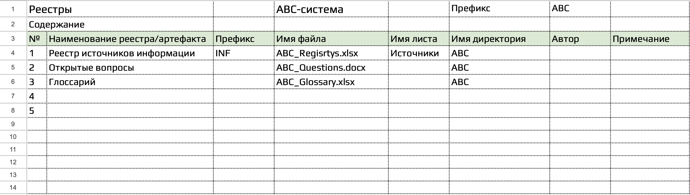
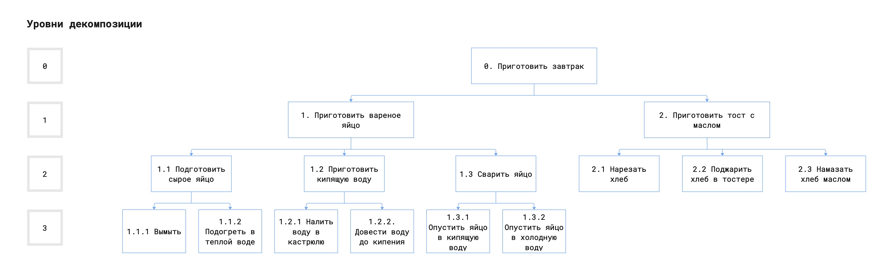
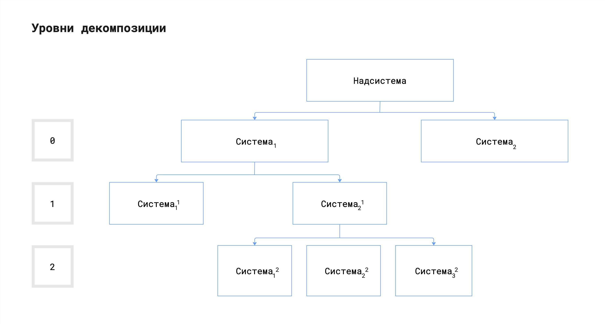
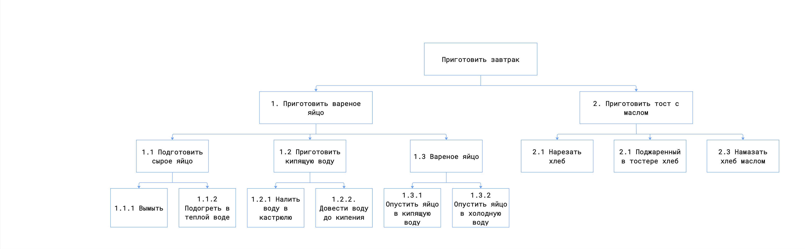

## Роль и функции ИТ-аналитика в команде разработки ИТ-систем

Резюме: В данном проекте ты познакомишься с типовым жизненным циклом разработки программного обеспечения, типовым ролевым составом команды и основными функциями каждой роли на этапах жизненного цикла. А еще узнаешь такое понятие, как декомпозиция, и освоишь правила применения.

___

> 💡 Если это твой первый проект, заполни эту [форму](http://opros.so/kAnXy).

> 💡 [Нажми сюда](https://new.oprosso.net/p/4cb31ec3f47a4596bc758ea1861fb624), чтобы поделиться с нами обратной связью на этот проект. Это анонимно и поможет нашей команде сделать обучение лучше. Рекомендуем заполнить опрос сразу после выполнения проекта.

## Contents

1.  [Chapter I](https://platform.21-school.ru/project/69540/task#chapter-i)
    
    1.1. [Общая информация](https://platform.21-school.ru/project/69540/task#11)
2.  [Chapter II](https://platform.21-school.ru/project/69540/task#chapter-ii)
    
    2.1. [Инструкция](https://platform.21-school.ru/project/69540/task#21)
3.  [Chapter III](https://platform.21-school.ru/project/69540/task#chapter-iii)
    
    3.1. [Жизненный цикл разработки ИТ-систем](https://platform.21-school.ru/project/69540/task#31)
    
    3.2. [Выявление источников информации](https://platform.21-school.ru/project/69540/task#32)
    
    3.3. [Глоссарий](https://platform.21-school.ru/project/69540/task#33)
    
    3.4. [Правила размещения, именования и другие правила](https://platform.21-school.ru/project/69540/task#34)
    
    3.5. [Декомпозиция. Основные понятия](https://platform.21-school.ru/project/69540/task#35)
    
    3.6. [Правила декомпозиции](https://platform.21-school.ru/project/69540/task#36)
    
    3.7. [Рекомендации по построению декомпозиции](https://platform.21-school.ru/project/69540/task#37)
4.  [Chapter IV](https://platform.21-school.ru/project/69540/task#chapter-iv)
    
    4.1. [Задача 1. Запись на стрижку (Sign up for a haircut)](https://platform.21-school.ru/project/69540/task#41)
    
    4.2. [Задача 2. Доставка заказов (Delivery of orders)](https://platform.21-school.ru/project/69540/task#42)
5.  [Chapter V](https://platform.21-school.ru/project/69540/task#chapter-v)
    
    5.1. [Exercise 00 — Creating a workspace (Создание пространства)](https://platform.21-school.ru/project/69540/task#51)
    
    5.2. [Exercise 01 — Identifying information sources (Выявление источников информации)](https://platform.21-school.ru/project/69540/task#52)
    
    5.3. [Exercise 02 — Creating and maintaining a glossary (Создание и ведение глоссария)](https://platform.21-school.ru/project/69540/task#53)
    
    5.4. [Exercise 03 — Concept of Decomposition (Основные понятия декомпозиции)](https://platform.21-school.ru/project/69540/task#53)
    
    5.5. [Exercise 04 — Types of Decomposition (Виды декомпозиции)](https://platform.21-school.ru/project/69540/task#55)
    
    5.6. [Exercise 05 — Types of Decomposition (Виды декомпозиции)](https://platform.21-school.ru/project/69540/task#56)
    
    5.7. [Exercise 06 — Decomposition Rules (Правила декомпозиции)](https://platform.21-school.ru/project/69540/task#57)

## Chapter I

### Общая информация

Типовой жизненный цикл разработки программного обеспечения состоит из этапов: обследование, проектирование, разработка, тестирование, внедрение, эксплуатация, вывод из эксплуатации. Ты познакомишься с типовым составом команды и работами на каждом этапе.

А еще в текущем проекте ты рассмотришь несколько навыков ИТ-аналитика, который выполняет те или иные работы на каждом этапе разработки:

1.  Выявление источников информации.
    
    Практически во всех проектах информации, указанной первоначально в условиях задачи, недостаточно. Поэтому мы должны уметь быстро выявлять дополнительную информацию.
    
2.  Единство терминов и понятий.
    
    Неточности в трактовке терминов и понятий чреваты ошибками проекта. Ведение глоссария проекта позволяет максимально снизить вероятность неточного трактования.
    
3.  Декомпозиция.
    
    Один из основных приемов проектирования программного обеспечения и разработки сложных ИТ-систем.
    

В этом проекте ты научишься:

-   собирать источники информации и использовать их в дальнейшем;
-   создавать и вести глоссарий для единого толкования терминов и понятий;
-   «разделять слона на кусочки», применяя принципы и правила декомпозиции.

### Литература

1.  Вигерс К., Битти Дж. Разработка требований к программному обеспечению : учебник / К. Вигерс, Дж. Битти. – 3-е изд., доп. – М. : BHV, 2024. – 736 с.
2.  Фитцпатрик Р. Спроси маму: как общаться с клиентами и подтвердить правоту своей бизнес-идеи, если все кругом врут? / Р. Фитцпатрик; пер. с англ. Д. Янин. – М. : Альпина Паблишер, 2025. – 155 с. – (Альпина.Бизнес).
3.  BABOK. Руководство к Сводy знаний по бизнес-анализу / под ред. IIBA ; пер. с англ. – М. : ООО Олимп-Бизнес, 2021. – 626 с.
4.  Министерство труда и социальной защиты Российской Федерации. Профессиональный стандарт «Системный аналитик» : утв. приказом Минтруда России от 27.04.2023 № 367н \[Электронный ресурс\]. – Режим доступа: [https://profstandart.rosmintrud.ru/obshchiy-informatsionnyy-blok/natsionalnyy-reestr-professionalnykh-standartov/reestr-professionalnykh-standartov/index.php?ELEMENT\_ID=121409](https://profstandart.rosmintrud.ru/obshchiy-informatsionnyy-blok/natsionalnyy-reestr-professionalnykh-standartov/reestr-professionalnykh-standartov/index.php?ELEMENT_ID=121409), свободный
5.  Microsoft. Work breakdown structures overview \[Электронный ресурс\] / Microsoft. – Режим доступа: [https://learn.microsoft.com/ru-ru/dynamics365/project-operations/prod-pma/work-breakdown-structures](https://learn.microsoft.com/ru-ru/dynamics365/project-operations/prod-pma/work-breakdown-structures), свободный

## Chapter II

### Инструкция

1.  Всю дорогу тебя будет сопровождать чувство неопределенности и острого дефицита информации — это нормально. Не забывай, что информация в репозитории и Google всегда с тобой, так же как пиры и Rocket.Chat. Общайся, ищи, опирайся на здравый смысл и не бойся ошибиться.
2.  Будь внимателен к источникам информации: проверяй, думай, анализируй,сравнивай.
3.  Будь внимателен к тексту задания, перечитывай по нескольку раз.
4.  Внимательно читай примеры. В них может быть что-то, что не указано в явном виде в самом задании.
5.  Могут встретиться несоответствия, когда что-то новое в условиях задачи или примере противоречит уже известному. Если встретилось такое — попробуй разобраться. Если не получилось — запиши вопрос в перечень открытых вопросов и найдешь ответ в процессе работы. Не оставляй открытые вопросы неразрешенными.
6.  Если задание кажется непонятным или невыполнимым — так только кажется.Попробуй его декомпозировать. Скорее всего, отдельные части станут понятными.
7.  На пути тебе встретятся разные задания. Помеченные звездочкой (\*) подходят для более дотошных и пытливых. Эти задания с повышенной сложностью и необязательны к выполнению, но если ты их сделаешь, то получишь дополнительный опыт и знания.
8.  Не пытайся обмануть систему и окружающих. Ведь в первую очередь ты обманываешь себя.
9.  Есть вопрос? Спроси своего соседа справа, если это не помогло — соседа слева.
10.  Когда пользуешься чьей-либо помощью, то всегда разбирайся до конца: почему, как и зачем. Иначе помощь не будет иметь смысла.
11.  Всегда делай push только в ветку develop! Ветка master будет проигнорирована.Работай в директории src.
12.  В твоей директории не должно быть иных файлов, кроме тех, что обозначены в заданиях.

## Chapter III

### 1\. Жизненный цикл разработки ИТ-систем

Любое ПО проходит через 6 основных этапов, от начального замысла до использования её конечным пользователем. Эти этапы в разных методологиях могут называться по-разному, мы приведем наиболее употребляемые термины. Вот эти этапы:

-   Обследование (сбор требований);
-   Проектирование;
-   Разработка;
-   Тестирование;
-   Внедрение;
-   Сопровождение.

В общем случае в команде разработки присутствуют специалисты, выполняющие такие роли:

-   ИТ-аналитик (может быть отдельно бизнес-аналитик и системный аналитик);
-   Архитектор (архитекторы могут быть разных направлений);
-   Разработчик (разработчики тоже могут быть разных направлений);
-   Тестировщик (и они бывают разные);
-   Специалист внедрения/сопровождения;
-   Менеджер;
-   Специалист DevOps;
-   Технический писатель.

И это только роли, не отдельные специалисты. Каждую роль может выполнять несколько человек, и один человек может выполнять несколько ролей.

### 2\. Выявление источников информации

Существует много методов выявления информации о задаче, о некоторых мы поговорим позже. Но один метод надо понимать всегда и начинать с него. Это изучение материалов, до которых можем дотянуться в начальный момент: нормативно-правовые документы, официальный сайт, статьи в СМИ, описание процессов, научно-популярные ролики. В случае госорганов — список функций, возложенных государством (их тоже можно найти на официальном сайте).

Мы не сможем изучить все документы в сжатые сроки, поэтому создаем каталог источников информации, к которому можем обратиться в нужный момент.

Заносим туда:

1.  Нормативно-правовые акты;
2.  Приказы, распоряжения;
3.  Сайты, статьи в СМИ, ролики;
4.  Регламенты, инструкции;
5.  Интервью, опросы;
6.  Мировой опыт, лучшие практики, опыт конкурентов;
7.  И т. д.

Чтобы не потеряться в этих источниках, рекомендуется указывать некоторые параметры. Эти параметры ты должен выбрать самостоятельно, исходя из здравого смысла, чтобы быстро ориентироваться в большом объеме документов, например:

1.  Источник (название, автор, дата выпуска, откуда получен, и пр.);
2.  Адрес размещения;
3.  Приоритет изучения;
4.  Актуальность, легитимность (Не устаревшая ли информация? Насколько можно доверять источнику?);
5.  Дата ввода/прекращения действия (если это нормативно-законодательные документы);
6.  Кто добавляет источник в каталог;
7.  Дата занесения;
8.  Отметка об изучении;
9.  Примечание (содержание, комментарии, заметки).

Даже кратко записанное содержание и небольшие комментарии помогут тебе вспомнить и вернуться к источнику при необходимости.

### 3\. Глоссарий

Часто одно понятие называют разными словами, например, «стейкхолдеры» и «заинтересованные стороны». А иногда одним именем называют совсем разные понятия, например, лицевой счет и балансовый счет сокращенно могут называть «счет». Путаница в понятиях отрицательно сказывается на результатах анализа, а затем и проектирования, повышает риск ошибок, может потребовать переделки уже выбранных решений, увеличить сроки работ. Для исключения этого с самого начала следует создать глоссарий и поддерживать его на протяжении всей работы над проектом. Надо понимать, что понятия могут изменять свое значение, например, при изменении нормативно-правовых документов. Поэтому следует вести историю изменений глоссария, указывать дату добавления/обновления каждого понятия и фиксировать его источник.

### 4\. Правила размещения, именования и другие правила

Для уменьшения ошибок из-за нестыковок и досадных недоразумений рекомендуем придерживаться правил размещения и именования создаваемых артефактов. Обычно эти правила вырабатываются командой продукта/проекта в начале работ. Если ты пришел в команду в процессе работы — выясни эти правила и выполняй их. Если таких правил нет, то выработай их самостоятельно, доведи до других членов команды и при согласовании придерживайся их.

Ниже — вариант правил, который можно использовать в работе над проектами.

1.  Для каждого продукта (задачи) определи префикс (трех- или четырехбуквенное осмысленное выражение) и создай для каждого продукта (задачи) отдельную директорию, названную с указанием префикса.
2.  Размещай все рабочие и проектные документы в созданной директории. Часто в директории дополнительно создают отдельные папки для разделения документации по типам: контрактная, рабочая, проектная, пользовательская и прочее.
3.  Текстовые рабочие документы, состоящие из списков, сохраняй в формате .xlsx. Так проще добавлять новые признаки и свойства, необходимые для работы. Также можно сохранять в формате .docx альбомной ориентации.
4.  Списки, каталоги размещай на разных листах в файле формата .xlsx.
5.  При создании каталогов кодируй как сам каталог, так и его элементы. Один из вариантов кодировки:
    -   Каждый каталог обозначается осмысленным трехбуквенным выражением, например:
        -   STA — каталог заинтересованных сторон (стейкхолдеров);
        -   INF — каталог источников информации.
    -   Элементы каталогов обозначаются по шаблону , где:
        -   XXX — буквенное обозначение каталога;
        -   YYYYY — числовое значение, уникальный неизменяемый номер в каталоге, количество знаков — на усмотрение разработчика каталога.
6.  Создай документ «Содержание», где отражай все созданные аналитиками артефакты, место их размещения, автора (ответственного). Допустимо размещать его как отдельный лист в файле каталога.
7.  Актуализируй документ «Содержание» в процессе работы.

P.S. Принципы кодировки и размещения могут отличаться в зависимости от сложности системы, предметной области, правил компании или команды.

#### Пример:

### 5\. Декомпозиция. Основные понятия

Декомпозиция, то есть процесс разделения целого на части, позволяет рассматривать любую систему, как состоящую из отдельных взаимосвязанных подсистем, которые, в свою очередь, также могут быть декомпозированы.

Мы применяем процесс декомпозиции в ИТ повсеместно, когда разбиваем на небольшие части свои цели, задачи, а также функции и компоненты самой ИТ-системы. Декомпозировать можно различными способами, видов декомпозиции довольно много. При разработке ИТ-систем обычно применяют такие виды декомпозиции:

1.  **Функциональная** — структурирование функций. Например, в задаче 1 (Chapter IV) клиент барбершопа может выполнить действия (функции):
    -   Регистрация на сайте;
    -   Просмотр расписания мастеров;
    -   Выбор мастера, услуги, времени;
    -   Запись на услугу.
2.  **Объектная, компонентная** — расчленение на объекты. Так, в задаче 1 (Chapter IV) услуги подразделяются на:
    -   Первый уровень: тип услуги (парикмахерские, косметические);
    -   Второй уровень (парикмахерские): стрижка, покраска, укладка и т. д;
    -   Второй уровень (косметические): чистка, массаж, питательная маска и т. д.

**Цели разбиения**

Вид декомпозиции выбираем исходя из стоящей перед нами цели. В таблице 1 приведены цели выполнения декомпозиции и соответствующие им основные виды, а также вопросы, помогающие выполнить декомпозицию.

Таблица 1. Вопросы для выявления вида декомпозиции

|Цель|Вид декомпозиции|Вопросы|
|---|---|---|
|Выделение функций|Функциональная|Что делает / должна делать система? Что обеспечивает / должна обеспечивать система?|
|Выделение составляющих частей (компонент)|Компонентная, объектная|Из каких частей/подсистем/модулей состоит / должна состоять система?|
|Структурирование по выбранным критериям|Структурная|Как разделяется / должна разделяться система по выбранным критериям?|
|Разделение по времени, по событиям|Темпоральная, событийная|Какие этапы проходит система? Как разделяются этапы?|

**Уровень (глубина) декомпозиции**

Уровень декомпозиции, т. е. глубина разбиения и подробности описания, зависит от предназначения декомпозиции и пользователя (для кого предназначена). В качестве элементарного уровня выбирают уровень, достаточный для выполнения работ. Искомая система принимается за нулевой уровень и не учитывается при подсчете уровней декомпозиции, т.к. разбиения на нулевом уровне нет, поскольку на нем система представлена в целостном виде.

**Документирование декомпозиции**

Декомпозицию можно записать в виде схемы, таблицы, каталога.

Для наглядности каждому элементу декомпозиции присваивается уникальный идентификатор, соответствующий уровню и, например, порядковому номеру на уровне с использованием разделителей типа табуляции, знаков препинания и т. д. На рисунке 1 представлена декомпозиция завтрака.

Для обозримости рекомендуют выделять на каждом уровне 7 (+/- 2) подсистем/элементов. Естественно, это не всегда получается. Иногда количество элементов довольно велико. В таких случаях декомпозиция представляется в табличном виде или в виде каталога.

Часто на схеме показывают не только декомпозируемую систему, но и вышестоящую (надсистему), в которую входит рассматриваемая система, и смежные системы — другие подсистемы надсистемы. На рисунке 2 — декомпозиция системы Система1. Дополнительно на этой же схеме указаны надсистема и смежная Система2.

_Рисунок 1. Декомпозиция подготовки завтрака_

_Рисунок 2. Декомпозиция системы Система1_

### 6\. Правила декомпозиции

При построении декомпозиции применяют следующие правила:

1.  Подчиненность;
2.  Единственность критерия;
3.  Целостность.

**Подчиненность**

Построение декомпозиции обычно начинается сверху вниз. Исходная система располагается на нулевом уровне и представляется в виде частей одинаковой значимости, которые не пересекаются между собой и полностью закрывают верхний уровень. Это первый уровень декомпозиции. Расчленение этих подсистем приводит к появлению подсистем второго уровня и т. д.

**Единственность критерия**

Система расчленяется только по одному, постоянному для уровня, критерию. Критерии уровней выбираются в зависимости от цели декомпозиции. Критерием декомпозиции может быть:

1.  Назначение (выполнение функций);
2.  Конструктивное устройство (части системы, вид материалов, формы поверхностей и др.);
3.  Структурные признаки (способы построения и др.);
4.  Виды этапов и процессов (жизненный цикл, физическое состояние и др.);
5.  Предметные характеристики (экономические, информационные, технологические и др.);
6.  И другие.

Например, выделение в составе автомобиля мотора, шасси и кузова проводится в соответствии с функциональным признаком (назначение частей).

**Целостность**

Целостность обеспечивается правилами:

1.  **Полнота:** вычленяемые подсистемы на одном уровне в сумме должны полностью характеризовать систему верхнего уровня. Не должно оставаться чего-то, что не входит в одну из групп. Если нет возможности определить полный набор элементов, допустимо ввести группу «другие», «прочие» и т. п.;
2.  **Взаимное непересечение**: элементы, входящие в одну группу, не должны входить в другую группу на этом же уровне.

P.S. Иногда в работе целесообразно отойти от этих правил, и в дальнейших проектах мы рассмотрим такие примеры.

### 7\. Рекомендации по построению декомпозиции

Перед тем как выполнять декомпозицию, определи:

1.  Зачем декомпозировать? Что хотим показать?
2.  Для какого пользователя выполняем декомпозицию? В чем потребность пользователя?
3.  Какой показатель выбираем для разбиения? Что будет составными частями?
4.  По каким критериям хотим разделять подсистемы и элементы декомпозиции?

В ответах на эти вопросы раскроется цель и потребность декомпозиции, и далее ты определишь ее вид.

P.S. Не всегда хорошая декомпозиция получается с первого раза (точнее, редко получается с первого раза). Хорошее решение приходит с опытом.

**Примерный порядок создания декомпозиции методом «Сверху вниз»**

1.  Определи верхний (корневой, нулевой) уровень декомпозиции — систему, которая подлежит разбиению.
2.  Выбери несколько критериев (два-три) для разделения подсистем первого уровня, соответствующих цели декомпозиции.
3.  Разбей корневую систему по каждому критерию.
4.  Проверь, что по каждому критерию выполняются правила декомпозиции:
    -   Система верхнего уровня разделена полностью (не осталось неохваченной части);
    -   Все части нижнего уровня входят в верхний уровень системы;
    -   Выделенные части нижнего уровня разделены по единому критерию;
    -   Выделенные части не пересекаются между собой.
5.  Сравни результаты разбивки по выбранным критериям, выбери оптимальный с учетом дальнейших действий.
6.  Повтори операции 2-5 для каждой подсистемы первого и всех последующих уровней.
7.  Остановись на том уровне, который достаточен для выполнения теми, кто будет работать с выделенными элементами (функциями, работами или объектами).

## Chapter IV

### Description of tasks

### Задача 1. Запись на стрижку (Sign up for a haircut)

Руководство сети барбершопов приняло решение о внедрении системы, обеспечивающей онлайн-запись на прием. Основная цель — развитие бизнеса путем расширения клиентской базы за счет возможности онлайн-записи, а также снижение трудозатрат сотрудников и уменьшение ручного труда за счет автоматического информирования клиентов по каналам связи.

Запись может осуществлять как зарегистрированный, так и незарегистрированный посетитель сайта. При записи можно выбрать тип услуги: парикмахерские или косметологические, а также саму услугу, мастера и время из свободных интервалов. Система должна обеспечивать автоматическую отправку напоминаний клиентам через выбранный клиентом канал связи (Telegram, WhatsApp, VK, СМС) по настроенному менеджером расписанию. После получения услуги система предлагает клиенту оценить услугу и написать предложения по улучшению работы.

Расписание мастеров и выполняемые каждым мастером услуги должен вводить менеджер, возможно, это будет не один человек. Он же отвечает за актуальность расписания и при необходимости корректирует его, осуществляет связь с клиентами в ручном режиме, проставляет отметку о выполнении услуги, начисляет и принимает оплату, передает данные об оплате в бухгалтерию. Также менеджер может получать отчеты о выполненных услугах и просматривать отзывы клиентов.

Любой мастер имеет возможность посмотреть расписание и запись на свои услуги, отзывы клиентов.

### Задача 2. Доставка заказов (Delivery of orders)

В локдаун многие продуктовые магазины и предприятия питания резко увеличили объемы онлайн-продаж, и потому возросла потребность в быстрой доставке мелких партий товаров индивидуальным клиентам.

Компания студентов собралась и решила создать стартап службы доставки.

Идея состоит в том, чтобы оперативно получать информацию о заказах, месте и сроке комплектации, месте доставки, желаемых сроках доставки и раздавать инфо курьерам, которые будут получать заказ в месте комплектации и доставлять в место доставки. Решили развернуть онлайн-систему, куда стекаются заказы и откуда курьеры оперативно разбирают заказы для выполнения. На первом этапе решили собирать заказы от магазинов и предприятий питания любым доступным способом и вводить в систему в едином формате силами оператора, но разработать мобильное приложение для курьеров.

Курьер должен иметь возможность просматривать информацию о заказах, выбирать заказ из свободных, бронировать его, забирать в точке выдачи и доставлять клиенту. Результат своих действий курьер должен оперативно отражать в системе через мобильное приложение. Также в системе должен работать диспетчер, который контролирует курьеров и при необходимости переназначает заказы. Информация о поступивших заказах должна направляться в бухгалтерию (в другую ИТ-систему) для расчета с поставщиками заказов за доставку. Также в бухгалтерию должна направляться информация о доставке заказа, где будет производиться расчет оплаты курьеров. Начисленная оплата должна передаваться в систему и отражаться в личном кабинете курьера. И еще запланировано рабочее место администратора, регистрирующего курьеров и назначающего всем права доступа.

## Chapter V

### Exercise 00 — Creating a workspace (Создание пространства)

**Для каждой задачи**:

1.  Определи префикс продукта.
2.  Создай отдельную директорию в своем GIT-репозитории в подпапке src, имя директории должно содержать префикс продукта.

### Exercise 01 — Identifying information sources (Выявление источников информации)

**Для каждой задачи:**

1.  Создай каталог источников информации.
2.  Найди не менее 5 источников информации и занеси их в каталог.
3.  Укажи приоритет изучения источников информации.
4.  Определи необходимые параметры каталога.
5.  Укажи свои ответы в сдаваемом файле `ex01_<префикс продукта>_infosources.xlsx`.

### Exercise 02 — Creating and maintaining a glossary (Создание и ведение глоссария)

**Для каждой задачи:**

1.  Создай глоссарий.
2.  Размести в глоссарии не менее 10 понятий.
3.  Укажи свои ответы в сдаваемом файле `ex02_<префикс продукта>_glossary.xlsx`.

**Рекомендации по выполнению задания:**

1.  В работе над проектами (здесь и далее) в качестве даты добавления понятия в глоссарий следует указывать номер проекта, выполняя который было добавлено данное понятие (Пример: BSA 00).

### Exercise 03 — Concept of Decomposition (Основные понятия декомпозиции)

1.  Найди демографическую пирамиду РФ. Отрази найденную пирамиду в файле.
2.  Укажи показатель разбиения демографической пирамиды.
3.  Укажи цель составления демографической пирамиды.
4.  Определи вид декомпозиции демографической пирамиды.
5.  Укажи:
    -   Сколько уровней декомпозиции у демографической пирамиды;
    -   Какие это уровни;
    -   Какие критерии применяются для разбиения каждого уровня.
6.  Определи порядок построения демографической пирамиды.
7.  Укажи свои ответы в сдаваемом файле `ex03_decomposition.docx`.

### Exercise 04 — Types of Decomposition (Виды декомпозиции)

**Меню завтрака:** вареное яйцо, тост с маслом, сок, чай.

1.  Рассмотри декомпозицию завтрака на рисунке 3:
    -   Определи цель и вид декомпозиции;
    -   Укажи количество уровней декомпозиции;
    -   Найди ошибки декомпозиции и перечисли их;
    -   Исправь ошибки в декомпозиции и примени исправленную версию для следующего задания.
2.  Разработай объектную декомпозицию завтрака на основе уточненной декомпозиции в пункте выше:
    -   Укажи цель декомпозиции;
    -   Построй декомпозицию до уровня 2;
    -   Укажи критерии разбиения для каждого уровня построенной декомпозиции.
3.  Укажи свои ответы в сдаваемом файле `ex04_types.docx`.

_Рисунок 3. Декомпозиция завтрака_

**Условия:**

Средство для изображения декомпозиции — на твое усмотрение.

### Exercise 05 — Types of Decomposition (Виды декомпозиции)

**Для задачи 2:**

1.  Изучи задачу 2 (Chapter IV).
2.  Разработай декомпозицию действий курьеров.
3.  Определи цель и вид декомпозиции.
4.  Укажи количество уровней.
5.  Разработай объектную декомпозицию действующих лиц (ролей) задачи.
6.  Укажи цель объектной декомпозиции.
7.  Укажи количество уровней.
8.  Укажи свои ответы в сдаваемом файле `ex05_types.docx`.

### Exercise 06 — Decomposition Rules (Правила декомпозиции)

**Активности дня:**

1.  Перечисли не менее 10 активностей своего дня.
2.  Определи минимум 2 цели декомпозиции, в рамках каждой цели определи пользователей и потребности.
3.  Построй событийную декомпозицию активностей своего дня в соответствии с выбранной целью. Во время построения придерживайся правил декомпозиции.
4.  Укажи свои ответы в сдаваемом файле `ex06_rules.docx`.

**Рекомендации по выполнению задания:**

Нет единственно верного пути создания декомпозиции. Всегда иди от цели создания, потребности того пользователя, для которого создается декомпозиция. Выбирай вид декомпозиции исходя из цели. Определяй активности исходя из ответов на «Вопросы для выявления вида декомпозиций». Возможно, активности будут разноуровневые — на этапе перечисления активностей — это нормально. Но далее обязательно посмотри и перераспредели активности по уровням в зависимости от критерия.

Следи, чтобы элементы одного уровня были равнозначными, отвечали на один и тот же вопрос, выделялись по одному критерию. Относились именно к этому уровню, а не к более высокому или низкому. Сделай несколько вариантов и выбери наиболее подходящий твоей цели, твоим потребностям и условиям.