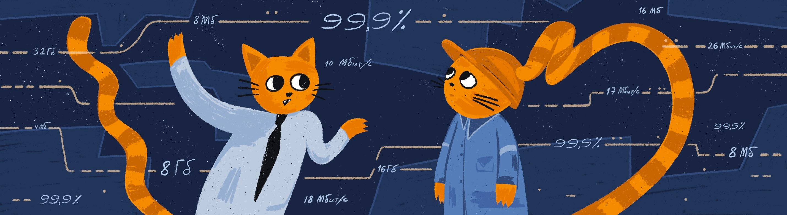

# Нефункциональные требования

Резюме:
В текущем проекте ты рассмотришь нефункциональные требования, поймешь, как от них зависит успешность системы, и научишься выявлять и формулировать их.

💡 [Нажми сюда](https://new.oprosso.net/p/4cb31ec3f47a4596bc758ea1861fb624), **чтобы поделиться с нами обратной связью на этот проект**. Это анонимно и поможет нашей команде сделать обучение лучше. Рекомендуем заполнить опрос сразу после выполнения проекта.

## Contents

- [Chapter I](#chapter-i)
  - [Preamble](#preamble)
- [Chapter II](#chapter-ii)
  - [General Rules](#general-rules)
- [Chapter III](#chapter-iii)
  - [Theory](#theory)
- [Chapter IV](#chapter-iv)
  - [Задача 1. Запись на стрижку (Sign up for a haircut)](#%D0%B7%D0%B0%D0%B4%D0%B0%D1%87%D0%B0-1-%D0%B7%D0%B0%D0%BF%D0%B8%D1%81%D1%8C-%D0%BD%D0%B0-%D1%81%D1%82%D1%80%D0%B8%D0%B6%D0%BA%D1%83-sign-up-for-a-haircut)
  - [Задача 2. Доставка заказов (Delivery of orders)](#%D0%B7%D0%B0%D0%B4%D0%B0%D1%87%D0%B0-2-%D0%B4%D0%BE%D1%81%D1%82%D0%B0%D0%B2%D0%BA%D0%B0-%D0%B7%D0%B0%D0%BA%D0%B0%D0%B7%D0%BE%D0%B2-delivery-of-orders)
- [Chapter V](#chapter-v)
  - [Exercise 00 — Определение нефункциональных требований](#exercise-00--%D0%BE%D0%BF%D1%80%D0%B5%D0%B4%D0%B5%D0%BB%D0%B5%D0%BD%D0%B8%D0%B5-%D0%BD%D0%B5%D1%84%D1%83%D0%BD%D0%BA%D1%86%D0%B8%D0%BE%D0%BD%D0%B0%D0%BB%D1%8C%D0%BD%D1%8B%D1%85-%D1%82%D1%80%D0%B5%D0%B1%D0%BE%D0%B2%D0%B0%D0%BD%D0%B8%D0%B9)
  - [Exercise 01 — Классификация нефункциональных требований](#exercise-01--%D0%BA%D0%BB%D0%B0%D1%81%D1%81%D0%B8%D1%84%D0%B8%D0%BA%D0%B0%D1%86%D0%B8%D1%8F-%D0%BD%D0%B5%D1%84%D1%83%D0%BD%D0%BA%D1%86%D0%B8%D0%BE%D0%BD%D0%B0%D0%BB%D1%8C%D0%BD%D1%8B%D1%85-%D1%82%D1%80%D0%B5%D0%B1%D0%BE%D0%B2%D0%B0%D0%BD%D0%B8%D0%B9)
  - [Exercise 02 — Выбор НФТ](#exercise-02--%D0%B2%D1%8B%D0%B1%D0%BE%D1%80-%D0%BD%D1%84%D1%82)
  - [Exercise 03 — Атрибуты производительности](#exercise-03--%D0%B0%D1%82%D1%80%D0%B8%D0%B1%D1%83%D1%82%D1%8B-%D0%BF%D1%80%D0%BE%D0%B8%D0%B7%D0%B2%D0%BE%D0%B4%D0%B8%D1%82%D0%B5%D0%BB%D1%8C%D0%BD%D0%BE%D1%81%D1%82%D0%B8)
  - [Exercise 04 — Атрибуты доступности и надежности](#exercise-04--%D0%B0%D1%82%D1%80%D0%B8%D0%B1%D1%83%D1%82%D1%8B-%D0%B4%D0%BE%D1%81%D1%82%D1%83%D0%BF%D0%BD%D0%BE%D1%81%D1%82%D0%B8-%D0%B8-%D0%BD%D0%B0%D0%B4%D0%B5%D0%B6%D0%BD%D0%BE%D1%81%D1%82%D0%B8)
  - [Exercise 05 — Атрибуты масштабирования](#exercise-05--%D0%B0%D1%82%D1%80%D0%B8%D0%B1%D1%83%D1%82%D1%8B-%D0%BC%D0%B0%D1%81%D1%88%D1%82%D0%B0%D0%B1%D0%B8%D1%80%D0%BE%D0%B2%D0%B0%D0%BD%D0%B8%D1%8F)
  - [Exercise 06 — Атрибуты безопасности](#exercise-06--%D0%B0%D1%82%D1%80%D0%B8%D0%B1%D1%83%D1%82%D1%8B-%D0%B1%D0%B5%D0%B7%D0%BE%D0%BF%D0%B0%D1%81%D0%BD%D0%BE%D1%81%D1%82%D0%B8)

## Chapter I

### Preamble

Успешность системы зависит не только от того, выполняет ли она функции, в которых есть потребность заказчика и пользователей системы. Немаловажно то, как она их выполняет:

- Как часто система недоступна в периоды работы пользователей;
- Удовлетворяет ли пользователей скорость выполнения тех или иных операций;
- Удобно ли пользователям работать в системе;
- Сохраняются ли данные в системе столько, сколько требуется;
- Соответствует ли пропускная способность сети объемам пересылаемых данных.

Это далеко неполный список условий (для каждой системы свой), определяющих качество выполнения функции системы.

В настоящем проекте ты рассмотришь эти условия, а также научишься их выявлять и формулировать.

### Литература

1. Карл Вигерс, Джой Битти, «Разработка требований к программному обеспечению», издание третье, дополненное.
2. Н.Тарасова [«Нефункциональные требования. Как не упустить качество продукта»](https://rutube.ru/video/9f0c8e681994034e5eeb05a9b3e23c69/?ysclid=m0m8oih8dv400187997).
3. М.Максимов [«Нефункциональные требования. Как аналитику работать с ними»](https://rutube.ru/video/523fb99f096855893c40dbe6918bca7d/?ysclid=m0m8pcd64k889258712).
4. И.Гертовская [«Чтобы не попасть в капкан. О влиянии нефункциональных требований на работоспособность системы»](https://rutube.ru/video/20792726635aeea4f0ae6f7ff4970d70/?ysclid=m0m8prjjfn9750426).

## Chapter II

### General Rules

1. На протяжении всего курса тебя будет сопровождать чувство неопределенности и острого дефицита информации — это нормально. Не забывай, что информация в репозитории и Google всегда с тобой. Как и пиры, и Rocket.Chat. Общайся. Ищи. Опирайся на здравый смысл. Не бойся ошибиться.
2. Будь внимателен к источникам информации. Проверяй. Думай. Анализируй. Сравнивай.
3. Внимательно читай задания. Перечитай несколько раз.
4. Читать примеры тоже лучше внимательно. В них может быть что-то, что не указано в явном виде в самом задании.
5. Тебе могут встретиться несоответствия, когда что-то новое в условиях задачи или примере противоречит уже известному. Если встретилось такое — попробуй разобраться. Если не получилось — запиши вопрос в открытые вопросы и выясни в процессе работы. Не оставляй открытые вопросы неразрешенными.
6. Если задание кажется непонятным или невыполнимым — так только кажется. Попробуй его декомпозировать. Скорее всего, отдельные части станут понятными.
7. На пути тебе встретятся самые разные задания. Те, что помечены звездочкой (\*), подходят для более дотошных. Они повышенной сложности и необязательны к выполнению. Но если ты их сделаешь, то получишь дополнительный опыт и знания.
8. Не пытайся обмануть систему и окружающих. В первую очередь ты обманешь себя.
9. Есть вопрос? Спроси своего соседа справа. Если это не помогло — соседа слева.
10. Когда пользуешься помощью — всегда разбирайся до конца: почему, как и зачем. Иначе помощь не будет иметь смысла.
11. Всегда делай push только в ветку develop! Ветка master будет проигнорирована. Работай в директории src.
12. В твоей директории не должно быть иных файлов, кроме тех, что обозначены в заданиях.

## Chapter III

### Theory

От чего зависит успешное выполнение операций в системе?

1. От количества одновременно выполняющихся однотипных операций в системе. Фактически — от количества одновременно работающих в системе пользователей одной роли (выполняющих однотипные операции).
2. От техники (оборудования), на котором установлено программное обеспечение.
3. От мощности сетей, обеспечивающих взаимодействие со смежными системами, в том числе от устойчивости и пропускной способности интернета, если взаимодействие через интернет.
4. От методов, настроек и качества кода, обеспечивающего быстроту и надежность выполнения операций в системе.
5. От архитектуры системы. От того, на каком системном программном обеспечении работает прикладное программное обеспечение, какие технологии применяются.

Не бывает единого архитектурного решения на все случаи жизни. В одних системах требуется накопление больших объемов данных в течение нескольких лет и их обработка (например, для прогноза погоды), в других — получение небольших сообщений и быстрый ответ на каждое сообщение (например, банковские операции).

За построение архитектуры системы отвечает архитектор, но делается это на основании тех сведений, которые в первую очередь собирает аналитик при сборе требований.

Показатели, влияющие на успешность выполнения функций в системе, исторически принято называть нефункциональными требованиями, в противоположность функциональным требованиям. Еще эти показатели называют атрибутами качества. В зависимости от целей и функций системы те или иные атрибуты имеют большее или меньшее значение. Вот список наиболее часто применяемых атрибутов.

| Время выполнения (run time) | Время разработки (design time) |
| --- | --- |
| Доступность | Повторяемость |
| Надежность | Расширяемость |
| Долговечность | Портируемость |
| Масштабируемость | Совместимость |
| Удобство использования | Обслуживаемость |
| Безопасность | Локализация |
| Производительность | Тестируемость |
| Ограничения |  |

Это неполный список атрибутов качества, и в разных проектах не всегда нужны все ниже перечисленные атрибуты.

Разъяснение понятий отдельных атрибутов, примеры атрибутов качества и порядок их выявления ты можешь найти в:

1. К. Вигерс, Дж. Битти «Разработка требований к программному обеспечению», изд.3, глава 14.
2. [Н. Тарасова «Нефункциональные требования. Как не упустить качество продукта»](https://www.youtube.com/watch?v=IEWlrZcqXCw).
3. [М. Максимов «Нефункциональные требования. Как аналитику работать с ними»](https://www.youtube.com/watch?v=dJKr6DfY3Cs&t=2375s).
4. [И. Гертовская «Чтобы не попасть в капкан. О влиянии нефункциональных требований на работоспособность системы»](https://www.youtube.com/watch?v=x--UgY-QbVA).

О категориях нефункциональных требованиях, источниках НФТ и порядке их выявления рассказано в докладе Надежды Тарасовой и Ирины Гертовской. При выявлении нефункциональных требований аналитики должны тесно взаимодействовать с другими ролями команды и с представителями заказчика. С кем взаимодействовать конкретно и по каким атрибутам качества, хорошо рассмотрено в докладе М. Максимова. Рекомендуем не только прослушать сами доклады, но и вопросы-ответы на них. Это поможет выполнить задания.

Также надо понимать, что в зависимости от функций системы, целей заказчика и потребностей пользователей системы большую или меньшую значимость могут приобрести те или иные атрибуты. Так, система, нацеленная на онлайн-продажи для широкой аудитории, должна обладать удобным привлекательным интерфейсом с учетом трендов в дизайне (иначе пользователи уйдут в онлайн-магазин с более удобным доступом), быстротой доступа к функциям клиента, но нет смысла в ней хранить состояние предлагаемых товаров в течение нескольких лет. А система для внутреннего применения на крупном заводе, например, рассчитана на значительно меньший контингент пользователей, в дизайне не обязательно учитывать тренды, важно, чтобы был удобный доступ к операциям, но для анализа нужны данные за несколько предыдущих лет. О подходе к определению значимости нефункциональных требований хорошо описано в главе 14 книги Карла Вигерса.

Всё это надо учитывать при выявлении и формировании нефункциональных требований.

## Chapter IV

### Description of tasks

### Задача 1. Запись на стрижку (Sign up for a haircut)

Руководство сети барбершопов приняло решение о внедрении системы, обеспечивающей онлайн-запись на прием. Основная цель — развитие бизнеса путем расширения клиентской базы за счет возможности онлайн-записи, а также снижение трудозатрат сотрудников и уменьшение ручного труда за счет автоматического информирования клиентов по каналам связи.

Запись может осуществлять как зарегистрированный, так и незарегистрированный посетитель сайта. При записи можно выбрать услугу, мастера и время из свободных интервалов. Система должна обеспечивать автоматическую отправку напоминаний клиентам через выбранный клиентом канал связи (Telegram, WhatsApp, VK, СМС) по настроенному менеджером расписанию. После получения услуги система предлагает клиенту оценить услугу и написать предложения по улучшению работы.

Расписание мастеров и выполняемые каждым мастером услуги должен вводить менеджер, возможно, это будет не один человек. Он же отвечает за актуальность расписания и при необходимости корректирует его, осуществляет связь с клиентами в ручном режиме, проставляет отметку о выполнении услуги, начисляет и принимает оплату, передает данные об оплате в бухгалтерию. Также менеджер может получать отчеты о выполненных услугах и просматривать отзывы клиентов.

Любой мастер имеет возможность посмотреть расписание и запись на свои услуги, отзывы клиентов.

В качестве первой очереди для внедрения системы выделено 5% точек сети, в которых работают 75 мастеров, в стандартном режиме мастера загружены на 60-70%, а в пиковые периоды (перед Новым годом и другими праздниками) потребность возрастает до 150% и более. При положительном результате внедрения в течение первого квартала эксплуатации, за следующие девять месяцев расширить систему на всю сеть, размещенную во всех регионах РФ.

### Задача 2. Доставка заказов (Delivery of orders)

В локдаун многие продуктовые магазины и предприятия питания резко увеличили объемы онлайн-продаж, и возросла потребность в быстрой доставке мелких партий товаров индивидуальным клиентам.

Компания студентов собрались и решила создать стартап службы доставки.

Идея состоит в том, чтобы оперативно получать информацию о заказах, месте и сроке комплектации, месте доставки, желаемых сроках доставки и раздавать инфо курьерам, которые будут получать заказ в месте комплектации и доставлять в место доставки. Решили развернуть онлайн-систему, куда стекаются заказы и откуда курьеры оперативно разбирают заказы для выполнения.

На первом этапе решили собирать заказы от магазинов и предприятий питания любым доступным способом и вводить в систему в едином формате силами оператора, но разработать мобильное приложение для курьеров. Курьер должен иметь возможность просматривать информацию о заказах, выбирать заказ из свободных, бронировать его, забирать в точке выдачи и доставлять клиенту.

Результат своих действий курьер должен оперативно отражать в системе через мобильное приложение. Также в системе должен работать диспетчер, который контролирует курьеров и при необходимости переназначает заказы. Информация о поступивших заказах должна направляться в бухгалтерию (в другую ИТ-систему) для расчета с поставщиками заказов за доставку. Дополнительно в бухгалтерию должна направляться информация о доставке заказа, где будет производиться расчет оплаты курьеров. Начисленная оплата должна передаваться в систему и отражаться в личном кабинете курьера. И еще запланировано рабочее место администратора, регистрирующего курьеров и назначающего всем права доступа.

## Chapter V

### Exercise 00 — Определение нефункциональных требований

Выпиши номера предложений, содержащих нефункциональные требования.

1. Система должна формировать список свободных слотов.
2. Система должна формировать список свободных слотов не более чем за 10 секунд при одновременно работающих 1000 пользователей.
3. Система должна предоставлять доступ к функциям в соответствии с назначенной пользователю ролью.
4. Система должна предоставлять доступ к данным зоны ответственности управления, только сотрудникам управления и контролерам.
5. Система должна сохранять информацию о выполненных курьером заказах не менее 3 лет.
6. Система должна рассчитывать оплату курьеру за доставку заказа.
7. Система должна рассчитывать остатки на конец дня на лицевых счетах клиентов не позднее 50 минут после закрытия оперативного дня при количестве лицевых счетов клиентов не более 1000000.
8. Восстановление системы при сбое должно выполняться не более чем за 30 минут.
9. Система должна восстанавливать введенные ранее данные. Допускается потеря данных не более, чем за 5 минут перед сбоем.

**Шкала от 1 до 5**

### Exercise 01 — Классификация нефункциональных требований

Сопоставь нефункциональные требования и типы НФТ из указанных ниже:

1. Для каждого НФТ указать тип НФТ.
2. Результаты разместить в таблицу.

Типы НФТ:

1. доступность,
2. надежность,
3. масштабируемость,
4. локализация,
5. удобство использования,
6. производительность,
7. совместимость,
8. долговечность,
9. безопасность.

НФТ:

1. Система должна предоставлять пользователю с ролью «Администратор» доступ к назначению и корректировке ролей пользователей.
2. Система должна сохранять информацию об оплатах клиента за товар не менее 5 лет.
3. Система должна запретить доступ к назначению и корректировке ролей пользователей всем пользователям, кроме пользователей с ролью «Администратор».
4. Срок восстановления системы после сбоя должен занимать не более 30 минут.
5. После выбора клиентом региона система должна показывать региональное время и обеспечивать клиенту выполнение своих действий с учетом регионального времени.
6. Система должна предоставлять клиенту возможность оформлять заказ круглосуточно, семь дней в неделю за исключением времени технологических перерывов. Время технологических перерывов: еженедельно, в воскресенье с 2:00 до 4:00.
7. Первая волна внедрения системы должна быть выполнена на двух регионах. В течение полугода после окончания внедрения первой волны система должна быть внедрена в следующих четырех регионах.
8. Экранные интерфейсы для клиентов системы должны удовлетворять современным трендам и обеспечивать настройку цветовой гаммы.
9. Система должна быть доступна с 9:00 до 21:00 99% времени, в остальное время — 90%.
10. Система должна обеспечить выбор мастера и услуги в среднем за 3 секунды и не более чем за 6 секунд после запроса у системы при одновременной работе до 1000 пользователей.
11. Система должна поддерживать интерфейс пользователя через браузеры: Chrome, Safari, Firefox. И протестирована на следующих версиях браузеров: указать последнюю и предпоследнюю версию браузеров.

**Шкала от 1 до 5**

### Exercise 02 — Выбор НФТ

Выбери типы НФТ для задачи 1 и задачи 2:

1. Укажи список типов НФТ, необходимых для успешного функционирования системы.
2. Укажи в списке не менее 7 типов НФТ.
3. Укажи приоритет каждого типа НФТ (от 1 до 5, 1 — высший приоритет) отдельно для каждой задачи.

**Шкала от 1 до 5**

### Exercise 03 — Атрибуты производительности

Укажи атрибуты производительности для задачи 1 и задачи 2:

1. Укажи не менее 3 важных сценариев для каждой задачи с точки зрения бизнеса и клиентов.
2. Распиши роли, принимающие участие в каждом сценарии.
3. Для каждого сценария укажи:
   1. примерное количество зарегистрированных пользователей в разрезе ролей;
   2. примерное количество одновременно работающих пользователей в разрезе ролей;
   3. пиковые периоды работы пользователей;
   4. примерное количество одновременно работающих пользователей в разрезе ролей в пиковые периоды.
4. Напиши от 3 до 5 операций/страниц, требующих контролируемого времени отклика (наиболее значимых для эффективной работы системы).
5. Укажи время отклика для каждой из контролируемых операций.
6. Результаты представь в табличном виде, допустимо несколько таблиц.

**Шкала от 1 до 5**

### Exercise 04 — Атрибуты доступности и надежности

Укажи атрибуты доступности и надежности для задачи 1 и задачи 2:

1. Укажи атрибуты доступности для каждой задачи.
2. Укажи атрибуты надежности для каждой задачи.

**Шкала от 1 до 5**

### Exercise 05 — Атрибуты масштабирования

Укажи атрибуты масштабирования и локализации для задачи 1 и задачи 2:

1. Укажи потребность масштабирования системы или ее отсутствие.
2. Если потребность масштабирования есть, опиши требования к масштабированию.
3. Укажи потребность локализации или ее отсутствие.
4. Если есть потребность локализации, опиши атрибуты локализации.

**Шкала от 1 до 5**

### Exercise 06 — Атрибуты безопасности

Опиши для задачи 1 и задачи 2 требования к безопасности в части паролей и логирования.

Требования в части паролей и многофакторности укажи с различными подходами в каждой задаче.

1. Укажи требования к составу пароля.
2. Опиши правила сброса, смены и восстановления пароля.
3. Укажи требования к многофакторной аутентификации:
   1. Действия, требующие многофакторной аутентификации;
   2. Порядок аутентификации.
4. Укажи требования к логированию:
   1. Операции, требующие логирования;
   2. Логируемые данные.

**Шкала от 1 до 5**