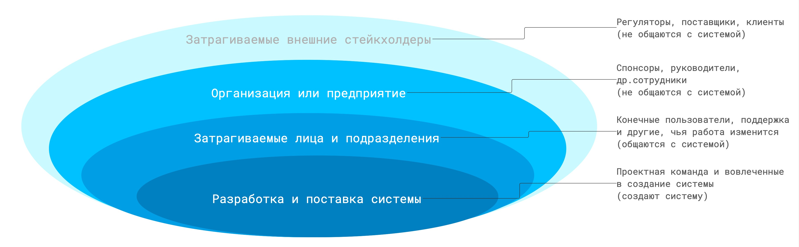
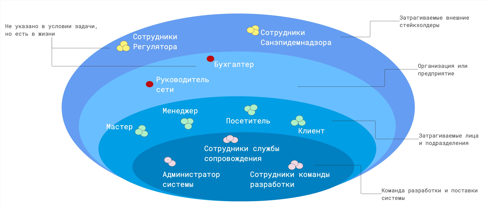

# Заинтересованные стороны (Стейкхолдеры)

Резюме:
Сегодня ты узнаешь, кто такие стейкхолдеры, и каково их значение для ИТ-систем.
А также познакомишься с приемами выявления стейкхолдеров и методами работы с ними.

💡 [Нажми сюда](https://new.oprosso.net/p/4cb31ec3f47a4596bc758ea1861fb624), **чтобы поделиться с нами обратной связью на этот проект**. Это анонимно и поможет нашей команде сделать обучение лучше. Рекомендуем заполнить опрос сразу после выполнения проекта.

## Contents

1. [Chapter I](#chapter-i) \
   1.1. [Общая информация](#11)
2. [Chapter II](#chapter-ii) \
   2.2. [Инструкция](#21)
3. [Chapter III](#chapter-iii) \
   3.1. [Заинтересованные стороны](#31) \
   3.2. [Кто заинтересован в системе?](#32) \
   3.3. [Роли](#33) \
   3.4. [Каталог заинтересованных сторон](#34) \
   3.5. [Луковичная диаграмма](#35)
4. [Chapter IV](#chapter-iv) \
   4.1. [Задача 1. Запись на стрижку](#41) \
   4.2. [Задача 2. Доставка заказов](#42)
5. [Chapter V](#chapter-v) \
   5.1. [Exercise 00 — Выявление заинтересованных сторон](#51) \
   5.2. [Exercise 01 — Построение луковичной диаграммы](#52) \
   5.3. [Exercise 02 — Интересы, потребности, проблемы заинтересованных сторон](#53) \
   5.4. [Exercise 03 — Наполнение глоссария](#54)

## Chapter I

### Общая информация

Любая система (промышленная, интеллектуальная, культурная или ИТ) строится в интересах кого-то, для удовлетворения чьих-то потребностей. Полезно помнить слова Тома Гилба: «Стейкхолдеров всегда на одного больше, чем вы знаете, а те, которых вы знаете, имеют минимум на одну потребность больше, чем вам сейчас известно».
В этом проекте ты узнаешь, как выявлять заинтересованные стороны и их потребности.

**Литература:**

1. Вигерс К., Битти Дж. Разработка требований к программному обеспечению : учебник / К. Вигерс, Дж. Битти. – 3-е изд., доп. – М. : BHV, 2024. – 736 с.
2. BABOK. Руководство к Сводy знаний по бизнес-анализу / под ред. IIBA ; пер. с англ. – М. : ООО Олимп-Бизнес, 2021. – 626 с.

**Рекомендации от представителей индустрии:**

1. Стейкхолдеры: зона особого внимания // Хабр. — 2017. — Режим доступа: <https://habr.com/ru/articles/127630>
2. Как взаимодействовать со стейкхолдерами? Мнение бизнес-аналитика, опытных экспертов и самих стейкхолдеров // Хабр. — 2023. — URL: <https://habr.com/ru/companies/sportmaster_lab/articles/778386>
3. Стейкхолдеры: кто это и почему они важны // Calltouch. — 2024. — URL: <https://www.calltouch.ru/blog/stejkholdery-kto-eto-takie-kakie-byvayut-vidy-stejkholderov-proekta>
4. Открытый микрофон #1. Как взаимодействовать со стейкхолдерами? / Спикер: Д. Шорохов; эксперты: А. Петухов, М. Заборов, А. Нечитайло, М. Харитонов, А. Сможенков; канал «Со-Общество | Спортмастер»// Хабр. Блог компании SM Lab. — 2023. — URL: [https://habr.com/ru/companies/sportmaster\_lab/articles/778386Карл](https://habr.com/ru/companies/sportmaster_lab/articles/778386%D0%9A%D0%B0%D1%80%D0%BB) Вигерс, Джой Битти «Разработка требований к программному обеспечению» издание третье.

## Chapter II

### Инструкция

1. На протяжении всего курса тебя будет сопровождать чувство неопределенности и острого дефицита информации — это нормально. Не забывай, что информация в репозитории и Google всегда с тобой. Как и пиры, и Rocket.Chat. Общайся. Ищи. Опирайся на здравый смысл. Не бойся ошибиться.
2. Будь внимателен к источникам информации. Проверяй. Думай. Анализируй. Сравнивай.
3. Внимательно читай задания. Перечитай несколько раз.
4. Читать примеры тоже лучше внимательно. В них может быть что-то, что не указано в явном виде в самом задании.
5. Тебе могут встретиться несоответствия, когда что-то новое в условиях задачи или примере противоречит уже известному. Если встретилось такое — попробуй разобраться. Если не получилось — запиши вопрос в открытые вопросы и выясни в процессе работы. Не оставляй открытые вопросы неразрешенными.
6. Если задание кажется непонятным или невыполнимым — так только кажется. Попробуй его декомпозировать. Скорее всего, отдельные части станут понятными.
7. На пути тебе встретятся самые разные задания. Те, что помечены звездочкой (\*) — подходят для более дотошных. Они повышенной сложности и необязательны к выполнению. Но если ты их сделаешь, то получишь дополнительный опыт и знания.
8. Не пытайся обмануть систему и окружающих. В первую очередь ты обманешь себя.
9. Есть вопрос? Спроси своего соседа справа. Если это не помогло — соседа слева.
10. Когда пользуешься помощью — всегда разбирайся до конца: почему, как и зачем. Иначе помощь не будет иметь смысла.
11. Всегда делай push только в ветку develop! Ветка master будет проигнорирована. Работай в директории src.
12. В твоей директории не должно быть иных файлов, кроме тех, что обозначены в заданиях.

## Chapter III

### 1. Заинтересованные стороны

Если система не приносит ценность тому, в чьих интересах она создается/изменяется, то она не нужна.
Поэтому первый вопрос, на который нужно ответить:

### 2. Кто заинтересован в системе?

Люди или организации, так или иначе заинтересованные в системе, называются заинтересованными сторонами (стейкхолдерами).

Заинтересованные стороны — одно из ключевых понятий бизнес-анализа. Выявлению заинтересованных сторон и их потребностей, а также формированию требований для удовлетворения этих потребностей посвящена значительная часть бизнес-анализа в ИТ.

**Заинтересованные стороны (Стейкхолдеры)** — это группа лиц и/или один человек, которые могут:

- влиять на систему;
- оказаться под влиянием системы;
- считать себя затронутыми системой;
- повлиять на выбор путей реализации системы.

То есть заинтересованные стороны — это все, кого так или иначе затрагивает система, или кто думает, что система затрагивает их интересы. А также те, кто воздействует на систему или может это делать. Это влияние может быть как в процессе разработки, так и в процессе использования системы.

Поэтому важно выявить стейкхолдеров (отдельных лиц или группы) и определить их потребности. Выделить требования, которые позволят системе удовлетворить эти требования.

В группы стейкхолдеров могут входить:

1. Те, кто заказывает и оплачивает проект: собственники, инвесторы, заказчики;
2. Те, кто производит или предоставляет товары или услуги для дальнейшего распространения или применения системой: поставщики, посредники, производители;
3. Те, кто получает товары или услуги посредством системы: покупатели, клиенты;
4. Те, кто задает и проверяет нормативы и правила для работы системы, регуляторы: органы власти или общественные институты;
5. Конкуренты — они не всегда заинтересованы в том, чтобы система работала или работала хорошо, и потому могут отрицательно повлиять на ее создание и работу;
6. Те, кто поддерживает систему в рабочем состоянии и оказывает помощь пользователям системы: администраторы, специалисты сопровождения.

Существует много техник работы с заинтересованными сторонами. В этом проекте рассмотрим:

1. Каталог (список) заинтересованных сторон;
2. Луковичная диаграмма.

### 3. Роли

Каждая из перечисленных групп определяется своими интересами по отношению к нашей системе.

Некоторые из стейкхолдеров могут быть объединены в группы, т.к. выполняют в системе одинаковые функции. Такие группы называют ролью (проектная роль, роль в проекте).

Роль называется по основной выполняемой ею функции. Например, человек, выбирающий товар, откладывающий его в корзину, оплачивающий и получающий его тем или иным способом — покупатель.

Не рекомендуется называть проектную роль обобщенными названиями, собирающими несколько ролей, в том числе выполняющих разные функции (например, пользователь), если есть отдельные группы, выполняющие в системе разные функции: покупатели, продавцы, товароведы, бухгалтеры.

Каждая заинтересованная сторона (организация или человек) может выполнять несколько ролей, например, заказчик может быть одновременно поставщиком, т.е. если поставщик товаров/услуг заказал систему для продвижения своего товара/услуги, он является и заказчиком, и поставщиком. И одну роль могут выполнять несколько заинтересованных сторон (т.е. иметь один и тот же интерес, выполнять одни и те же функции в системе).

А иногда физическое лицо (и даже организация) под влиянием обстоятельств могут изменить свои интересы и выполняемые действия, т.е. сменить свою роль в проекте.

### 4. Каталог заинтересованных сторон

Чтобы выявить все возможные источники требований и не потерять их потребности, в процессе построения системы следует создать и вести каталог заинтересованных сторон. Стейкхолдеры могут быть выявлены не только в начале работы над проектом, но и позже. Актуальный каталог стейкхолдеров нужен на всем протяжении проекта, чтобы не потерять важного стейкхолдера. В списке могут быть как пользователи системы, так и заинтересованные в системе, но не работающие с ней.

Для анализа значимости стейкхолдеров для проекта и выбора способов работы с ними рекомендуется в каталог собирать такие характеристики:

1. ФИО (если известно);
2. Контактная информация (телефон, email, ник в соцсети, где договорились общаться);
3. Организация/компания;
4. Должность/позиция;
5. Локация;
6. Роль в проекте (если понятно);
7. Масштабируемость роли (один / примерное количество);
8. Ответственность в проекте (за что отвечает);
9. Уровень полномочий в проекте (что уполномочен делать/решать);
10. Предыдущий опыт, полезный проекту;
11. Дату добавления стейкхолдера в каталог.

В случае небольшого проекта достаточно выбрать 2-4 характеристики, которые помогут вам в работе с заинтересованными сторонами, например, чтобы разложить стейкхолдеров по областям луковичной диаграммы (см. раздел 5. Луковичная диаграмма) и для определения роли пользователей в системе.

Есть несколько вопросов, которые помогут выявить заинтересованные стороны.

Таблица 1. Группы заинтересованных сторон и вопросы для их выявления

|  | Класс | Вопросы |
| --- | --- | --- |
| 1 | Выгодоприобретатели (заказчики, спонсоры, инвесторы) | Кто заказывает систему? Кто платит за разработку системы? Кто заинтересован в доходе от проекта? |
| 2 | Пользователи (покупатели, клиенты, продавцы и пр.) | Кто будет использовать систему? |
| 3 | Взаимодействующие стороны | С кем взаимодействует система? С кем интегрируется? |
| 4 | Конкуренты | Есть ли у системы конкуренты? Кто они? |
| 5 | Регуляторы | На основании каких законов и нормативных актов должна работать система? |
| 6 | Команда сопровождения | Кто будет поддерживать работу системы во время ее использования? Кто предоставляет доступы? Кто восстанавливает сбои? Кто консультирует пользователей? |
| 7 | Команда разработки и внедрения | Кто готовит начальные данные? Кто исправляет ошибки, занимается развитием системы? |

### 5. Луковичная диаграмма

Луковичная диаграмма помогает выявить заинтересованные стороны и определить их отношение к продукту, а также способствует выявлению их интересов и потребностей. На диаграмме элементы (стейкхолдеры и группы стейкхолдеров) отображаются в концентрических кругах, элементы в каждом круге находятся в равном удалении от системы: взаимодействуют с ней, зависят от нее (пользуются результатами или данными), являются внешними к системе, но взаимодействующими с ней (получающими/передающими ей информацию).

## Chapter IV

### Задача 1. Запись на стрижку

Руководство сети барбершопов приняло решение о внедрении системы, обеспечивающей онлайн-запись на прием. Основная цель — развитие бизнеса путем расширения клиентской базы за счет возможности онлайн-записи, а также снижение трудозатрат сотрудников и уменьшение ручного труда за счет автоматического информирования клиентов по каналам связи.

Запись может осуществлять как зарегистрированный, так и незарегистрированный посетитель сайта. При записи можно выбрать тип услуги: парикмахерские или косметологические, а также саму услугу, мастера и время из свободных интервалов. Система должна обеспечивать автоматическую отправку напоминаний клиентам через выбранный клиентом канал связи (Telegram, WhatsApp, VK, СМС) по настроенному менеджером расписанию. После получения услуги система предлагает клиенту оценить услугу и написать предложения по улучшению работы.

Расписание мастеров и выполняемые каждым мастером услуги должен вводить менеджер, возможно, это будет не один человек. Он же отвечает за актуальность расписания и при необходимости корректирует его, осуществляет связь с клиентами в ручном режиме, проставляет отметку о выполнении услуги, начисляет и принимает оплату, передает данные об оплате в бухгалтерию. Также менеджер может получать отчеты о выполненных услугах и просматривать отзывы клиентов.

Кроме того, система должна обеспечить учет санитарной обработки помещения каждого барбешопа, как того требуют нормы Санэпиднадзора. Расписание санобработки вносит менеджер, он же проставляет отметку о выполнении после санобработки техническим работником.

Любой мастер имеет возможность посмотреть расписание и запись на свои услуги, отзывы клиентов.

### Задача 2. Доставка заказов

В локдаун многие продуктовые магазины и предприятия питания резко увеличили объемы онлайн-продаж, и потому возросла потребность в быстрой доставке мелких партий товаров индивидуальным клиентам.

Компания студентов собрались и решила создать стартап службы доставки.

Идея состоит в том, чтобы оперативно получать информацию о заказах, месте и сроке комплектации, месте доставки, желаемых сроках доставки и раздавать инфо курьерам, которые будут получать заказ в месте комплектации и доставлять в место доставки. Решили развернуть онлайн-систему, куда стекаются заказы и откуда курьеры оперативно разбирают заказы для выполнения. На первом этапе решили собирать заказы от магазинов и предприятий питания любым доступным способом и вводить в систему в едином формате силами оператора, но разработать мобильное приложение для курьеров.

Курьер должен иметь возможность просматривать информацию о заказах, выбирать заказ из свободных, бронировать его, забирать в точке выдачи и доставлять клиенту. Результат своих действий курьер должен оперативно отражать в системе через мобильное приложение. Также в системе должен работать диспетчер, который контролирует курьеров и при необходимости переназначает заказы. Информация о поступивших заказах должна направляться в бухгалтерию (в другую ИТ-систему) для расчета с поставщиками заказов за доставку. Также в бухгалтерию должна направляться информация о доставке заказа, где будет производиться расчет оплаты курьеров. Начисленная оплата должна передаваться в систему и отражаться в личном кабинете курьера. И еще запланировано рабочее место администратора, регистрирующего курьеров и назначающего всем права доступа.

## Chapter V

### Exercise 00 — Выявление заинтересованных сторон

**Для задачи 2:**

1. Создай каталог заинтересованных сторон.
2. Укажи в каталоге заинтересованные стороны.
3. Определи характеристики каталога — категории, по которым будут классифицироваться стейкхолдеры каждой задачи. Укажи характеристики, известные из условий задачи.
4. Запиши свои ответы в turn-in файле `ex00_<префикс продукта>_stakeholders.xlsx`.

**Рекомендации по выполнению задания:**

1. Выбери категории, которые понадобятся тебе для:
   - Категоризации по областям луковичной диаграммы для работы в дальнейшем;
   - Выявления ролей в системе.
2. Категории каталога выбирайте с учетом контекста задачи. Можно принять во внимание список групп стейкхолдеров, описанный в разделе «Кто заинтересован в системе?».
3. Укажи в каталоге заинтересованные стороны.
4. Проставь категории, вытекающие из условий задачи.
5. Укажи дату добавления стейкхолдера в каталог. В качестве даты добавления стейкхолдера в каталог следует указывать номер проекта, выполняя который он был добавлен (пример: BSA 01).
6. Пример части каталога заинтересованных сторон по задаче 1 в таблице ниже.

**Каталог заинтересованных сторон** на примере задачи 1.

| Идентификатор | Заинтересованная сторона ФИО (если известно) | Орг-я или физ.лицо | Категория ЗСт | Уровень контактности с системой (луковичная диаграмма) | Роль в проекте (если есть) |
| --- | --- | --- | --- | --- | --- |
| st00100 | Руководитель сети | Организация | Организация системы | Не общаются с системой | нет |
| st00200 | Зарегистрированный посетитель | Физ. лицо | Затрагиваемые стороны | Конечный пользователь | Клиент |
| st00300 | Незарегистрированный посетитель | Физ. лицо | Затрагиваемые стороны | Конечный пользователь | Посетитель |
| st00400 | Мастер | Физ. лицо | Затрагиваемые стороны | Конечный пользователь | Мастер |
| st00500 | Менеджер | Физ. лицо | Затрагиваемые стороны | Конечный пользователь | Менеджер |
| st00600 | Администратор | Физ. лицо | Затрагиваемые стороны | Конечный пользователь | Администратор |
| st00700 | Санэпиднадзор | Организация | Регулятор | Затрагиваемые внешние стороны | Смежная система |
| st00800 | Разработчики системы | Организация | Проектная команда | Создают систему | Разработчики |

### Exercise 01 — Построение луковичной диаграммы

**Для задачи 2:**

1. Определи категории стейкхолдеров относительно взаимодействия с нашей системой (слои луковичной диаграммы). Одну из категорий определи как признаки слоев луковичной диаграммы.
2. Определи заинтересованные стороны или группы (роли), относящиеся к каждой категории (слою).
3. Построй луковичную диаграмму, укажи на луковичной диаграмме слои и заинтересованные стороны, относящиеся к каждому слою.
4. На луковичной диаграмме дополнительно укажи те заинтересованные стороны, которые не даны в задаче, но могут встретиться в жизни.
5. При выявлении стейкхолдеров, не отраженных в каталоге, добавь их туда из Ex. 00.
6. Запиши свои ответы в turn-in файле `ex01_<префикс продукта>_onion.xxx` (xxx — расширение).

**Рекомендации по выполнению задания:**

Построй луковичную диаграмму. Пример луковичной диаграммы для задачи 1:

### Exercise 02 — Интересы, потребности, проблемы заинтересованных сторон

**Для каждой задачи:**

1. Выпиши в таблицу интересы, потребности, проблемы заинтересованных сторон (в том числе внешних).
2. Укажи свои ответы в turn-in файле `ex02_<префикс продукта>_needs.xlsx`.

**Рекомендации по выполнению задания:**

Пример описания интересов, потребностей, проблем ключевого стейкхолдера для задачи 1 приведен в таблице.

| Идент. | Стейкхолдер |  | Интересы |  | Потребности |  | Проблемы |
| --- | --- | --- | --- | --- | --- | --- | --- |
| st00100 | Руководитель сети барбершопов | 1 | Объем бизнеса | 1 | Расширить клиентскую базу | 1 | Отсутствие роста клиентской базы |
|  |  | 2 | Размер клиентской базы | 2 | Повысить средний чек | 2 | Клиенты по записи не доходят на услуги |
|  |  | 3 | Трудозатраты сотрудников | 3 | Снизить трудозатраты сотрудников на дозвоны и запись клиентов | 3 | Высокие неравномерные трудозатраты (пиковые периоды) на запись по телефону, |
|  |  | 4 | Средний чек | 4 | Снизить ошибки при записи на услуги по телефону | 4 | Клиенты часто не могут записаться на услугу по телефону |
|  |  |  |  | 5 |  | 5 | В пиковые периоды менеджер не успевает обработать звонки для записи на услуги |
|  |  |  |  | 6 |  | 6 | Клиент часто не приходит на услугу, не помнит время записи |
|  |  |  |  | 7 |  | 7 | Клиенты при записи по телефону не видят полного списка услуг |

### Exercise 03 — Наполнение глоссария

**Для каждой задачи:**

1. Выпиши новые понятия и термины, встретившиеся в задаче, в глоссарий.
2. Найди описание понятий и терминов и занеси их в глоссарий.
3. Запиши свои ответы в turn-in файле `ex03_<префикс продукта>_glossary.xlsx`.