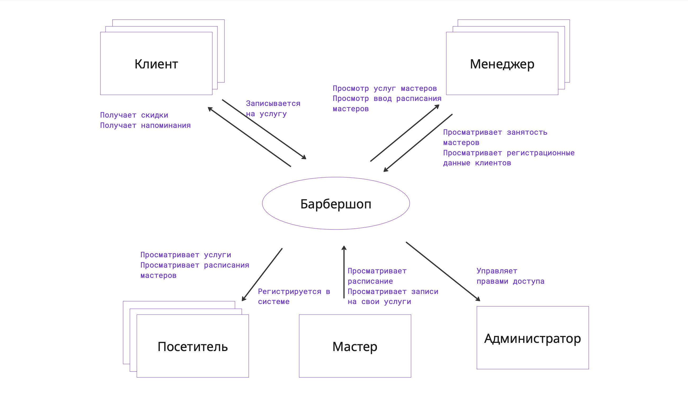
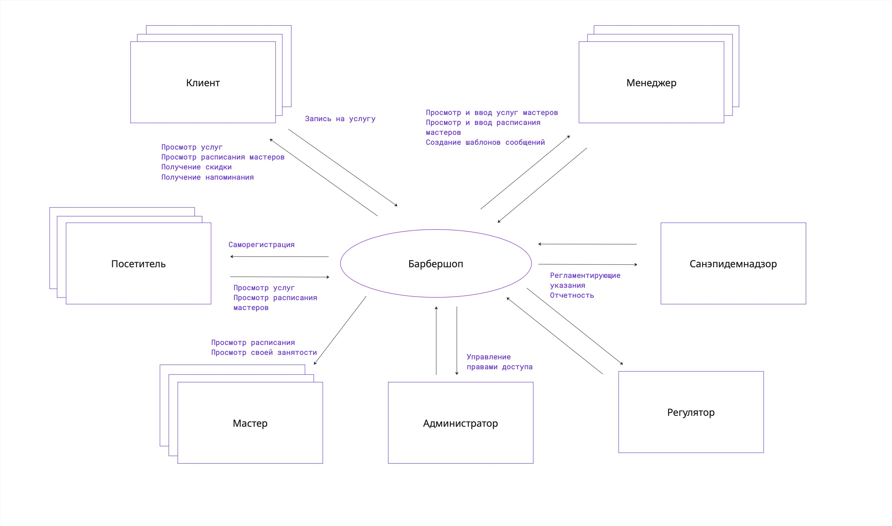

# Требования

Резюме:

Сегодня ты узнаешь, что такое требования к ПО, их виды, уровни, связи и зависимости. Познакомишься с моделями as is и to be, построишь контекстную диаграмму, выделишь роли стейкхолдеров, их проблемы и потребности, а также выявишь бизнес-требования продукта.

💡 [Нажми сюда](https://new.oprosso.net/p/4cb31ec3f47a4596bc758ea1861fb624), **чтобы поделиться с нами обратной связью на этот проект**. Это анонимно и поможет нашей команде сделать обучение лучше. Рекомендуем заполнить опрос сразу после выполнения проекта.

## Contents

1. [Chapter I](#chapter-i) \
   1.1. [Общая информация](#11)
2. [Chapter II](#chapter-ii) \
   2.1. [Инструкция](#21)
3. [Chapter III](#chapter-iii) \
   3.1. [Виды требований, уровни требований](#31) \
   3.2. [Модели as is и to be](#32) \
   3.3. [Контекстная диаграмма](#33)
4. [Chapter IV](#chapter-iv) \
   4.1. [Задача 1. Запись на стрижку](#41) \
   4.2. [Задача 2. Доставка заказов](#42)
5. [Chapter V](#chapter-v) \
   5.1. [Exercise 00 — Роли и их действия as is](#51) \
   5.2. [Exercise 01 — Создание контекстной диаграммы](#52) \
   5.3. [Exercise 02 — Разрешение проблем стейкхолдеров](#53) \
   5.4. [Exercise 03 — Проверка входных/выходных потоков данных](#54) \
   5.5. [Exercise 04 — Дополнение артефактов](#55)

## Chapter I

### Общая информация

Требование — это пригодное для практического использования представление потребности или решения. В этом проекте ты узнаешь о классификации требований, которые с разных сторон описывают систему. И о том, как и почему требования связаны друг с другом. А также научишься строить контекстную диаграмму.

**Литература:**

1. Халл Э., Джексон К., Дик Дж. Инженерия требований / пер. с англ. А. В. Снастина; под ред. В. К. Батоврина. — Москва : ДМК Пресс, 2017.
2. Леффингуэлл Д., Уидриг Д. Принципы работы с требованиями к программному обеспечению. Унифицированный подход / пер. с англ. — Москва : Вильямс, 2002. — 441 с. — ISBN 5-8459-0275-4. — Глава 4: Пять этапов анализа проблемы.
3. Корнипаев, И. Требования для программного обеспечения: рекомендации по сбору и документации. — Москва : УчКнига\_КПТ, 2017.
4. Халл, Э., Джексон, К., Дик, Дж. Инженерия требований / Э. Халл, К. Джексон, Дж. Дик. — Москва : ДМК Пресс, 2019

**Рекомендации от представителей индустрии:**

1. Критерии качества требований с примерами (Часть 1) // Habr. — URL: <https://habr.com/ru/articles/842296>
2. Анализ требований по Вигерсу (2004). Этапы сбора требований // Бизнес-Анализ в России. — URL: [https://business-analytics-russia.ru/requirements-analysis/analysis-of-requirements-wiegers-2004/#Уровни\_требованийКарл](https://business-analytics-russia.ru/requirements-analysis/analysis-of-requirements-wiegers-2004/#%D0%A3%D1%80%D0%BE%D0%B2%D0%BD%D0%B8_%D1%82%D1%80%D0%B5%D0%B1%D0%BE%D0%B2%D0%B0%D0%BD%D0%B8%D0%B9%D0%9A%D0%B0%D1%80%D0%BB) Вигерс, Джой Битти «Разработка требований к программному обеспечению», издание третье, глава 1 и другие.

## Chapter II

### Инструкция

1. На протяжении всего курса тебя будет сопровождать чувство неопределенности и острого дефицита информации — это нормально. Не забывай, что информация в репозитории и Google всегда с тобой. Как и пиры, и Rocket.Chat. Общайся. Ищи. Опирайся на здравый смысл. Не бойся ошибиться.
2. Будь внимателен к источникам информации. Проверяй. Думай. Анализируй. Сравнивай.
3. Внимательно читай задания. Перечитай несколько раз.
4. Читать примеры тоже лучше внимательно. В них может быть что-то, что не указано в явном виде в самом задании.
5. Тебе могут встретиться несоответствия, когда что-то новое в условиях задачи или примере противоречит уже известному. Если встретилось такое — попробуй разобраться. Если не получилось — запиши вопрос в открытые вопросы и выясни в процессе работы. Не оставляй открытые вопросы неразрешенными.
6. Если задание кажется непонятным или невыполнимым — так только кажется. Попробуй его декомпозировать. Скорее всего, отдельные части станут понятными.
7. На пути тебе встретятся самые разные задания. Те, что помечены звездочкой (\*) — подходят для более дотошных. Они повышенной сложности и необязательны к выполнению. Но если ты их сделаешь, то получишь дополнительный опыт и знания.
8. Не пытайся обмануть систему и окружающих. В первую очередь ты обманешь себя.
9. Есть вопрос? Спроси своего соседа справа. Если это не помогло — соседа слева.
10. Когда пользуешься помощью — всегда разбирайся до конца: почему, как и зачем. Иначе помощь не будет иметь смысла.
11. Всегда делай push только в ветку develop! Ветка master будет проигнорирована. Работай в директории src.
12. В твоей директории не должно быть иных файлов, кроме тех, что обозначены в заданиях.

## Chapter III

### 1. Виды требований, уровни требований

Требования — это описание потребностей того, что должно быть реализовано. В них описано поведение системы, ее свойства, характеристики и ограничения. Требования описывают систему во всех ее проявлениях, со всех сторон.

Наиболее применяемая типизация требований приведена в книге К. Вигерса и Д. Битти «Разработка требований к программному обеспечению», таблица ниже.

**Виды требований**

| Понятие | Определение |
| --- | --- |
| Бизнес-требование | Высокоуровневая бизнес-цель организации или заказчиков системы |
| Бизнес-правило | Определяющее или ограничивающее, политика или правило |
| Пользовательские требования | Задачи, которые должны получать пользователи от системы или выполнять с помощью системы |
| Внешние интерфейсы | Взаимодействие с другими системами или пользователями |
| Ограничения | Ограничения доступных вариантов реализации |
| Системные требования | Верхнеуровневые требования к продукту, содержащему несколько подсистем и состоящему из ПО или ПО и оборудования |
| Функциональные требования | Требуемое поведение системы в определенных условиях |
| Нефункциональные требования | Свойства или особенности, которыми должна обладать система, или ограничения, которое система должна соблюдать |
| Атрибуты качества | Характеристики свойств, особенности, ограничения системы |

Требования разных видов к одному программному продукту всегда связаны, зависят друг от друга, влияют друг на друга. Взаимосвязи требований и их уровни изображены на рисунке 1 — их можно посмотреть в книге К. Вигерса и Д. Битти «Разработка требований к программному обеспечению», изд. 3, глава 1. Но следует понимать, что на одном уровне и под единым понятием, например, пользовательских требований, собраны требования от разных групп пользователей (разных ролей), и в том числе могут оказаться противоположные по предпочтениям требования.

*Рисунок 1. Взаимосвязи и уровни требований*

### 2. Модели as is и to be

**As is** — модель текущего состояния системы или организации. Показывает протекающие в настоящем процессы, объекты, роли и действия. Целью построения модели as is является выявление текущего состояния и проблемных мест в текущем состоянии. На основе модели as is мы должны понять, что следует сделать для решения проблемы и построить модель **to be** — предполагаемое состояние будущей системы и/или изменение процессов и/или самой системы. И далее — определить порядок перехода от текущего к будущему состоянию системы.

### 3. Контекстная диаграмма

Контекстная диаграмма характеризует текущую (существующую) или будущую (предполагаемую) систему в ее связях с окружающим миром — стейкхолдерами и смежными системами. Она отображает, какие потоки информации или управляющие воздействия передаются извне внутрь системы, а какие из системы наружу, и кто их передает. Контекстная диаграмма не показывает, что делается внутри системы, только «черный ящик». А еще она помогает определить границы системы.

#### Описание

Диаграмма показывает, в каком окружении (предметной области, контексте) существует система, что и кто ее окружает и взаимодействует с ней. В первую очередь это пользователи системы (в разных ролях) и внешние системы, обменивающиеся с ней информацией.

Понимание контекста, окружающего систему, позволяет выявить:

1. Действия, которые ожидают от системы разные роли пользователей;
2. Потоки данных, которыми система обменивается с другими системами;
3. Управляющие воздействия, оказываемые извне на систему и системой наружу.

Каждая внешняя сущность может являться для системы либо источником, либо получателем данных, либо тем и другим одновременно. Контекстная диаграмма позволяет выделить все точки вне системы, с которыми система так или иначе взаимодействует, и указать, как именно. Тем самым контекстная диаграмма позволяет определить границы системы: перечислить стороны, взаимодействующие с системой, действия, ожидаемые от системы, и данные, как получаемые системой, так и генерируемые, передаваемые наружу.

Чтобы не усложнять, в контекстную диаграмму не включают:

- средства передачи данных (протоколы), которыми данные передаются в систему и из нее;
- интерфейсы взаимодействия, которыми общаются с системой пользователи и сторонние системы.

#### Элементы

Диаграмма состоит из следующих частей:

1. Сама система, обозначение обычно — овал;
2. Внешние сущности, взаимодействующие с системой (обычно прямоугольник):

   - пользователи (в определенной роли);
   - организации;
   - сторонние системы, устройства, способные получать, или генерировать и передавать данные. \
     Каждая сущность должна иметь как минимум один входящий или исходящий из нее в систему поток данных. \
     Обозначение: существительное, вписанное в прямоугольник, указывает на роль пользователя, организацию (подразделение) или стороннюю систему.
3. Взаимодействие системы с внешними сущностями (обычно линии со стрелками и надписями):

   - потоки данных;
   - материальные или нематериальные объекты (информация о них);
   - управляющие воздействия. \
     Стрелка между системой и внешней сущностью указывает направление передачи информации с описанием передаваемых данных или действий.

Пример контекстной диаграммы по задаче 1 приведен на рис. 2.

*Рисунок 2.*

## Chapter IV

### Задача 1. Запись на стрижку

Руководство сети барбершопов приняло решение о внедрении системы, обеспечивающей онлайн-запись на прием. Основная цель — развитие бизнеса путем расширения клиентской базы за счет возможности онлайн-записи, а также снижение трудозатрат сотрудников и уменьшение ручного труда за счет автоматического информирования клиентов по каналам связи.

Запись может осуществлять как зарегистрированный, так и незарегистрированный посетитель сайта. При записи можно выбрать тип услуги: парикмахерские или косметологические, а также саму услугу, мастера и время из свободных интервалов. Система должна обеспечивать автоматическую отправку напоминаний клиентам через выбранный клиентом канал связи (Telegram, WhatsApp, VK, СМС) по настроенному менеджером расписанию. После получения услуги система предлагает клиенту оценить услугу и написать предложения по улучшению работы.

Расписание мастеров и выполняемые каждым мастером услуги должен вводить менеджер, возможно, это будет не один человек. Он же отвечает за актуальность расписания и при необходимости корректирует его, осуществляет связь с клиентами в ручном режиме, проставляет отметку о выполнении услуги, начисляет и принимает оплату, передает данные об оплате в бухгалтерию. Также менеджер может получать отчеты о выполненных услугах и просматривать отзывы клиентов.

Любой мастер имеет возможность посмотреть расписание и запись на свои услуги, отзывы клиентов.

### Задача 2. Доставка заказов

В локдаун многие продуктовые магазины и предприятия питания резко увеличили объемы онлайн-продаж, и возросла потребность в быстрой доставке мелких партий товаров индивидуальным клиентам.

Компания студентов собрались и решила создать стартап службы доставки.

Идея состоит в том, чтобы оперативно получать информацию о заказах, месте и сроке комплектации, месте доставки, желаемых сроках доставки и раздавать инфо курьерам, которые будут получать заказ в месте комплектации и доставлять в место доставки. Решили развернуть онлайн-систему, куда стекаются заказы и откуда курьеры оперативно разбирают заказы для выполнения. На первом этапе решили собирать заказы от магазинов и предприятий питания любым доступным способом и вводить в систему в едином формате силами оператора, но разработать мобильное приложение для курьеров.

Курьер должен иметь возможность просматривать информацию о заказах, выбирать заказ из свободных, бронировать его, забирать в точке выдачи и доставлять клиенту. Результат своих действий курьер должен оперативно отражать в системе через мобильное приложение. Также в системе должен работать диспетчер, который контролирует курьеров и при необходимости переназначает заказы. Информация о поступивших заказах должна направляться в бухгалтерию (в другую ИТ-систему) для расчета с поставщиками заказов за доставку. Также в бухгалтерию должна направляться информация о доставке заказа, где будет производиться расчет оплаты курьеров. Начисленная оплата должна передаваться в систему и отражаться в личном кабинете курьера. И еще запланировано рабочее место администратора, регистрирующего курьеров и назначающего всем права доступа.

## Chapter V

### Exercise 00 — Роли и их действия as is

**Для каждой задачи:**

1. Создай таблицу ролей и их действий в текущем состоянии (as is) (для задачи 1 доработай).
2. Из описания задачи выпиши все предполагаемые роли стейкхолдеров и их действия.
3. Укажи проблемы, которые в текущем состоянии (as is) возникают перед ролями стейкхолдеров.
4. Укажи в таблице не только роли стейкхолдеров, непосредственно взаимодействующих с системой, но и роли других стейкхолдеров. Актуализируй каталог стейкхолдеров предыдущего проекта. Загрузи актуализированный каталог в src.
5. Запиши свои ответы в turn-in файле `ex00_<префикс продукта>_asis.xlsx`.

**Рекомендации по выполнению задания:**

Проверь указание всех проблем, отраженных в проекте Заинтересованные стороны, Exercise 02 — Интересы, потребности, проблемы заинтересованных сторон.

Пример части таблицы с выявлением ролей, их действий и проблем по задаче 1.

| Идентификатор | Роль | Действие | as is |  | Проблемы |
| --- | --- | --- | --- | --- | --- |
|  |  |  | по телефону | очно |  |
| st00200 | Клиент | Запись /перенос записи на услугу | + | + | Клиенту трудно записаться (дозвониться) |
| st00200 | Клиент | Получение скидки | - | + |  |
| st00200 | Клиент | Получение напоминания | + /- | - | Менеджеру сложно направить СМС всем вручную |
| st00300 | Посетитель | Регистрация | - | + |  |
| st00300 | Посетитель | Запись /перенос записи на услугу | + | + | Клиенту трудно записаться (дозвониться) |
| st00300 | Посетитель | Получение скидки | - | - |  |
| st00300 | Посетитель | Получение напоминания | - | - | Без регистрации менеджер теряет номера телефонов |

### Exercise 01 — Создание контекстной диаграммы

**Для задачи 2:**

1. Разработай контекстную диаграмму.
2. Укажи на диаграмме стейкхолдеров, действия стейкхолдеров и управляющие воздействия, направленные в систему или получаемые из системы.
3. Укажи на диаграмме сторонние системы и потоки данных, которыми система взаимодействует с ними.
4. Размести диаграмму в turn-in файле `ex01_<префикс продукта>_context.xxx` (xxx — расширение файла).

**Рекомендации по выполнению задания:**

Пример контекстной диаграммы задачи 1 приведен на рисунке.

### Exercise 02 — Разрешение проблем стейкхолдеров

**Для каждой задачи:**

1. Дополни таблицу, разработанную в **Exercise 00 — Роли и их действия as is**, действиями пользователей системы to be, исходя из контекстной диаграммы.
2. При необходимости уточни диаграмму или исходную таблицу.
3. Напиши состояние to be по каждой проблеме: помогает ли решение для разрешения проблемы при применении системы.
4. Укажи свои ответы в turn-in файле `ex02_<префикс продукта>_tobe.xlsx`.

**Рекомендации по выполнению задания:**

Пример части доработанной таблицы по задаче 1.

| Идентификатор | Стейкхолдер (Роль в проекте) | Действие | as is |  | Проблемы | to be |  | Решение проблемы |
| --- | --- | --- | --- | --- | --- | --- | --- | --- |
|  |  |  | по телефону | очно |  | В системе | Очно |  |
| st00200 | Клиент | Запись /перенос записи на услугу | + | + | Клиенту трудно записаться (дозвониться) | + |  | Облегчение записи клиенту |
| st00200 | Клиент | Получение скидки | - | + |  | - | + | - |
| st00200 | Клиент | Получение напоминания | + /- | - | Менеджеру сложно направить СМС всем вручную | + |  | Напоминания будут направляться автоматизировано |
| st00300 | Посетитель | Регистрация | - | + |  | + |  | Упрощение регистрации Снижение нагрузки на менеджера |
| st00300 | Посетитель | Запись /перенос записи на услугу | + | + | Клиенту трудно записаться (дозвониться) | + |  | Облегчение записи |
| st00300 | Посетитель | Получение скидки | - | - |  | - | - | - |
| st00300 | Посетитель | Получение напоминания | - | - | Без регистрации менеджер теряет номера телефонов | - |  | Возможность направлять напоминания автоматизировано |

### Exercise 03 — Проверка входных/выходных потоков данных

**Для каждой задачи:**

1. Построй таблицу входных/выходных потоков данных, исходя из контекстной диаграммы.
2. В случае расхождений в таблице уточни контекстную диаграмму и таблицу соответствий.
3. Если есть отклонения, отрази в примечаниях к таблице и поясни.
4. Укажи свои ответы в turn-in файле `ex03_<префикс продукта>_streams.xlsx`.

### Exercise 04 — Дополнение артефактов

**Для каждой задачи:**

1. Выпиши в глоссарий новые понятия и термины, встретившиеся в задаче.
2. Найди описание понятий и терминов и занеси их в глоссарий.
3. Дополни каталог заинтересованных сторон новыми обнаруженными стейкхолдерами.
4. Укажи атрибуты новых стейкхолдеров.
5. Укажи свои ответы в turn-in файле `ex04_<префикс продукта>_glossary.xlsx`.