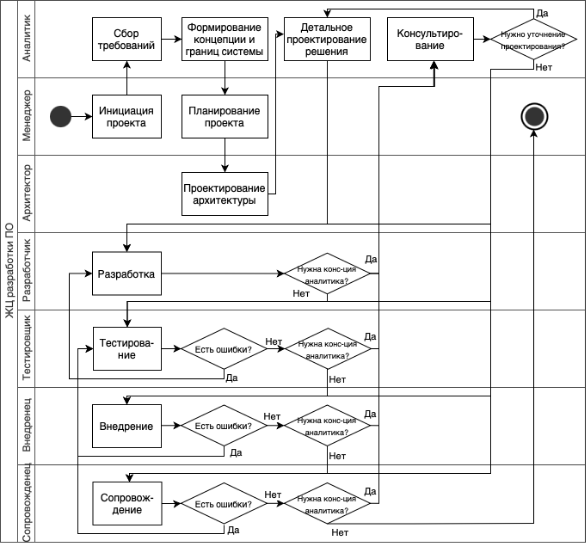
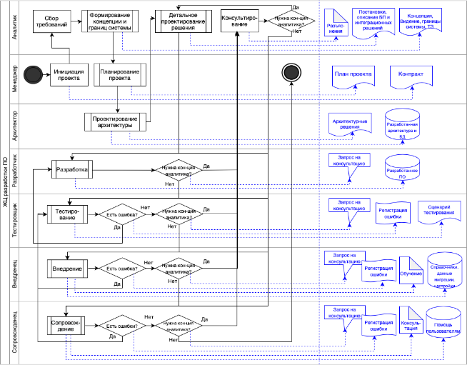
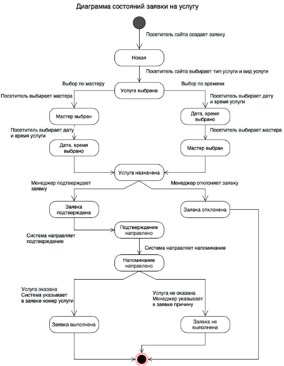
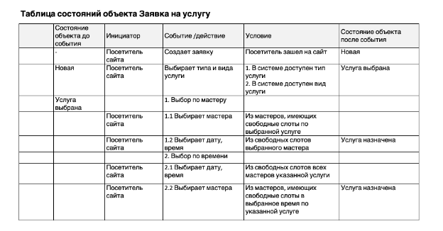

# Модели и диаграммы

Резюме:
Ты познакомишься с понятием «моделирование требований», основными моделями и представлениями. Научишься строить диаграмму потоков данных (data flow diagram), межфункциональную диаграмму (swimlane diagram) и диаграмму состояний. А также узнаешь, как применять таблицы решений.

💡 [Нажми сюда](https://new.oprosso.net/p/4cb31ec3f47a4596bc758ea1861fb624), **чтобы поделиться с нами обратной связью на этот проект**. Это анонимно и поможет нашей команде сделать обучение лучше. Рекомендуем заполнить опрос сразу после выполнения проекта.

## Contents

1. [Chapter I](#chapter-i) \
   1.1. [Preamble](#11)
2. [Chapter II](#chapter-ii) \
   2.1. [General Rules](#21)
3. [Chapter III](#chapter-iii) \
   3.1. [Модели и моделирование требований](#31) \
   3.2. [Диаграмма потоков данных](#32) \
   3.3. [Диаграмма «плавательные дорожки»](#33) \
   3.4. [Расширение диаграммы swimlane](#34) \
   3.5. [Диаграмма состояний](#35)
4. [Chapter IV](#chapter-iv) \
   4.1. [Задача 1. Запись на стрижку (Sign up for a haircut)](#41) \
   4.2. [Задача 2. Доставка заказов (Delivery of orders)](#42)
5. [Chapter V](#chapter-v) \
   5.1. [Exercise 00 — Building DFD, level 0 (Построение диаграммы потоков данных, уровень 0)](#51) \
   5.2. [Exercise 01 — Building a Swimlane diagram (Построение диаграммы «плавательные дорожки»](#52) \
   5.3. [Exercise 02 — Extending the Swimlane Diagram (Дополнение диаграммы «плавательные дорожки»)](#53) \
   5.4. [Exercise 03 — State diagram (Диаграмма состояний)](#54) \
   5.5. [Exercise 04 — State table (Таблица состояний)](#55)

## Chapter I

### Preamble

В первом модуле ты познакомился с основными понятиями, с которыми работают аналитики в ИТ — заинтересованными сторонами, требованиями, классификацией требований и понятием предметной области.

В этом модуле ты познакомишься с методами, которые позволяют аналитикам описывать требования для быстрейшего их понимания — как создателями системы, так и окружающими. Способы представления требований различны — это и графические диаграммы, и таблицы, и текстовые описания.

В этом проекте ты узнаешь о диаграммах, их назначении и способах их создания. Научишься создавать диаграмму потоков данных и «плавательных дорожек», диаграмму и таблицу состояний.

### Литература

1. Карл Вигерс, Джой Битти, «Разработка требований к программному обеспечению», издание третье, дополненное.
2. Мартин Фаулер, Кендалл Скотт «UML основы. Второе издание. Краткое руководство по унифицированному языку моделирования».
3. Крэг Ларман «Применение UML и шаблонов проектирования. Введение в объектно-ориентированный анализ».
4. BABOK v3 «Руководство к своду знаний по бизнес-анализу» IIBA.
5. Дин Леффингуэлл, Дон Уидриг «Принципы работы с требованиями к программному обеспечению».

## Chapter II

### General Rules

1. На протяжении всего курса тебя будет сопровождать чувство неопределенности и острого дефицита информации — это нормально. Не забывай, что информация в репозитории и Google всегда с тобой. Как и пиры, и Rocket.Chat. Общайся. Ищи. Опирайся на здравый смысл. Не бойся ошибиться.
2. Будь внимателен к источникам информации. Проверяй. Думай. Анализируй. Сравнивай.
3. Внимательно читай задания. Перечитай несколько раз.
4. Читать примеры тоже лучше внимательно. В них может быть что-то, что не указано в явном виде в самом задании.
5. Тебе могут встретиться несоответствия, когда что-то новое в условиях задачи или примере противоречит уже известному. Если встретилось такое — попробуй разобраться. Если не получилось — запиши вопрос в открытые вопросы и выясни в процессе работы. Не оставляй открытые вопросы неразрешенными.
6. Если задание кажется непонятным или невыполнимым — так только кажется. Попробуй его декомпозировать. Скорее всего, отдельные части станут понятными.
7. На пути тебе встретятся самые разные задания. Те, что помечены звездочкой (\*) — подходят для более дотошных. Они повышенной сложности и необязательны к выполнению. Но если ты их сделаешь, то получишь дополнительный опыт и знания.
8. Не пытайся обмануть систему и окружающих. В первую очередь ты обманешь себя.
9. Есть вопрос? Спроси своего соседа справа. Если это не помогло — соседа слева.
10. Когда пользуешься помощью — всегда разбирайся до конца: почему, как и зачем. Иначе помощь не будет иметь смысла.
11. Всегда делай push только в ветку develop! Ветка master будет проигнорирована. Работай в директории src.
12. В твоей директории не должно быть иных файлов, кроме тех, что обозначены в заданиях.

## Chapter III

«Все модели неверны, но некоторые полезны».

Джордж Бокс

### 1. Модели и моделирование требований

История создания успешных ИТ-проектов (и не только ИТ) говорит о том, что представление требований к проекту в одном виде не дает их полной картины (Алан Девис). Следует предоставить не только текстовое описание текущего состояния и функциональных требований, но и графическое представление (диаграммы разного рода), табличное (например, состояние различных артефактов в зависимости от условий), прототипы пользовательского интерфейса, отчетов и пр. Каждое такое представление показывает требования в каком-то отдельном разрезе и полностью освещает этот разрез. А сопоставление разных представлений позволяет выявить несоответствия, нестыковки, пропуски и просчеты. Поэтому необходимо осветить задуманную систему в разных моделях.

**Модель** — упрощенное описание действительности, позволяющее исследовать или обрабатывать объект, содержит существенные свойства моделируемого объекта. Модель всегда проще системы и подсвечивает отдельные ее аспекты, например:

| Артефакт | Модели | Компоненты (аспекты) моделей |
| --- | --- | --- |
| Люди, организации, ИТ-системы | Контекстная диаграмма, Диаграмма потоков данных | Внешние системы, внешние объекты |
|  | Диаграммы вариантов использования | Действующие лица |
|  | Диаграммы «сущность-связь» | Сущности или их атрибуты |
|  | Диаграмма swimlane | Дорожки |
|  | Диаграмма переходов состояний, таблица состояний | Объекты с состояниями |
| Передаваемые и хранимые данные | Контекстная диаграмма, Диаграмма потоков данных | Потоки и хранилища данных |
|  | Диаграмма «сущность-связь» | Сущности или их атрибуты |
|  | Диаграмма swimlane | Дорожки |

Строгость применения нотаций при моделировании определяется договоренностью в команде. В зависимости от целей, с которыми строим модели, назначения диаграммы, уровня участников, тех, кто будет читать, комментировать диаграмму. Диаграмму для обсуждения с заказчиком допустимо нарисовать проще, чем для применения внутри команды. Важно, чтобы команда была согласна (были приняты договоренности) и важно выполнять эти договоренности.

Более полный список артефактов в привязке к моделям и их компонентам приведен в главе 12 книги К. Вигерса «Разработка требований к программному обеспечению», издание 3, табл.12-1. Принципы выбора наиболее подходящих моделей приведены в таблице 12-2.

Мы рассмотрим несколько моделей визуального представления, показывающих систему в том или ином разрезе:

- диаграмма потоков данных;
- диаграмма «плавательные дорожки»;
- диаграмма состояний (или таблица состояний);
- диаграмма бизнес-процессов в нотации BPMN;
- а также ты уже рассмотрел контекстную диаграмму (модуль 1), которая является упрощенной диаграммой потоков данных.

Надо понимать, что диаграммы могут отражать как текущее состояние as is для выявления проблем (область проблем в терминологии инженерии требований), так и будущее, проектируемое состояние to be (область решений). При создании диаграммы ты должен всегда понимать, к какой области относится то, что ты создаешь.

Итак, перед тем, как приступать к построению диаграммы, следует определить:

1. Цель построения диаграммы;
2. Область рассмотрения: as is (область проблем) или to be (область решений);
3. Метод (вид диаграммы).

### 2. Диаграмма потоков данных

Диаграмма потоков данных (data flow diagrams, DFD) дает представление о том, как данные движутся внутри системы и между системой и внешним миром, отражает хранилища и потоки данных и материалов (строго говоря, информации о материалах, т. е. тоже потоки данных), которыми система управляет. Движение данных и материалов между внешней средой и системой (система как черный ящик) — это контекстная диаграмма, крайний случай диаграммы потоков данных. Далее в процессе разработки может быть построена более детальная диаграмма потоков данных, потоки между процессами или подсистемами внутри системы между собой и с внешними системами. Диаграмму потоков данных можно строить для уровня 0 и глубже, декомпозируя потоки и действия. Диаграмма потоков данных уровня 0 соответствует контекстной диаграмме, но с расширением до функций внутри системы.

На диаграмме DFD могут отражаться люди или организации, являющиеся инициаторами передачи данных или получателями данных. Это наши стейкхолдеры (заинтересованные стороны). То есть диаграмма потоков данных должна коррелировать с каталогом заинтересованных сторон и с луковичной диаграммой — мы должны проверить эти соответствия и при необходимости устранить нестыковки. Но диаграмма не отражает последовательность процессов и действий. Не стремись отразить последовательность процессов на DFD!

Данные, содержащиеся в DFD — это те же данные, которые описаны в словаре данных. Поэтому также сравниваем, проверяем и исправляем их при необходимости.

И еще: все данные, которые входят в систему, должны для чего-то этой системой использоваться. Если они не используются, то они не нужны. И все данные, которые передаются системой наружу и используются внутри, должны откуда-то появиться (поступить в систему или быть созданными внутри системы) — это тоже подлежит проверке.

Детально построение DFD описано в книге К. Вигерса, издание 3, глава 12, раздел «Диаграмма потоков данных».

### 3. Диаграмма «плавательные дорожки» (swimlane)

Диаграмма swimlane (межфункциональная диаграмма, «плавательные дорожки») применяется для изучения и демонстрации бизнес-процессов, выполняемых пользователями и системой, взаимодействия пользователей между собой и/или отражения последовательности бизнес-процессов или действий в бизнес-процессе. Это то, что происходит внутри процесса в диаграмме потоков данных. Диаграмма разделена на дорожки, и в каждой из них действует та или иная роль, участвующая в работе системы, сама система или внешняя система. Иногда рассматривают только роли пользователей или подразделения, если требуется разобрать только их взаимодействие. Детально построение диаграммы описано в главе 12 К. Вигерса «Разработка требований к программному обеспечению», раздел «Диаграмма swimlane».

Диаграмма позволяет проверить полноту ролевой модели — роли и выполняемые ими действия, взаимодействие с внешними системами, порядок выполнения действий. Иногда в диаграмму добавляют применяемые/порождаемые в каждом процессе/действии данные. И тогда есть возможность сверить с диаграммой потоков данных, выявить несоответствие, при необходимости — провести дополнительное обследование и устранить неточности.

На рисунке — ЖЦ разработки ПО, представленное диаграммой «плавательные дорожки». Показаны основные функции каждой роли и более детально — функции аналитика, как дополнение к ролику BSA00, рассказывающем о функциях аналитика в разработке ПО.

Для примера к ролику, содержащему описание роли и функций аналитика в разработке ПО построена диаграмма ЖЦ разработки ПО (рис.1):

1. Цель построения диаграммы: познакомить студентов ветки Системный анализ в ИТ. Beginner с жизненным циклом разработки ПО, ролью аналитика в разработке ПО и его функциями;
2. Область рассмотрения: as is;
3. Вид диаграммы: диаграмма дорожек.

*Рисунок 1*

### 4. Расширение диаграммы swimlane

Часто диаграмму «плавательные дорожки» расширяют, добавляя артефакты (документы, запросы, объекты, создаваемые представителями той или иной роли во время выполнения действий бизнес-процесса. На рисунке 2 показаны артефакты, создаваемые каждой ролью в процессе разработки и внедрения ИТ-системы, указаны действия или процессы, во время которых создается этот артефакт. Для облегчения чтения диаграммы, артефакты и их связи с действиями/процессами выделены синим, но это необязательная опция. Кроме того, на диаграмме разными элементами показаны процессы (прямоугольник с двумя линиями на вертикальных сторонах) и действия (прямоугольник). Процесс содержит несколько действий, не указанных на текущей диаграмме, но может быть расписан более детально на диаграмме следующего уровня.

В данном случае нельзя сказать, что первая диаграмма — неправильная, хотя на ней не указаны процессы. Такое изображение процесса (простой прямоугольник, без двойных вертикальных сторон) достаточно распространено. Важно, чтобы вся команда это понимала.

*Рисунок 2*

### 5. Диаграмма состояний

Диаграмма состояний показывает поведение конкретного объекта (класса) в системе, изменение состояний этого объекта под влиянием событий, происходящих в системе или внешних факторов. Диаграммы состояний обычно строят относительно одного или нескольких наиболее важных объектов системы. С помощью диаграммы для каждого состояния можно отследить:

- возможные состояния объекта в системе;
- предыдущее состояние (состояние до события);
- событие (действие), переводящее объект в другое состояние;
- роль, инициирующая переход;
- условия перехода в новое состояние (возможно, переход в несколько состояний, в зависимости от условий);
- состояние после события.

На рисунке показана диаграмма состояний объекта Заявка из Задачи 1.

Эту же информацию можно представить и в таблице (показана частично).

## Chapter IV

### Description of tasks

### Задача 1. Запись на стрижку (Sign up for a haircut)

Руководство сети барбершопов приняло решение о внедрении системы, обеспечивающей онлайн-запись на прием. Основная цель — развитие бизнеса путем расширения клиентской базы за счет возможности онлайн-записи, а также снижение трудозатрат сотрудников и уменьшение ручного труда за счет автоматического информирования клиентов по каналам связи.

Запись может осуществлять как зарегистрированный, так и незарегистрированный посетитель сайта. При записи можно выбрать тип услуги: парикмахерские или косметологические, а также саму услугу, мастера и время из свободных интервалов. Система должна обеспечивать автоматическую отправку напоминаний клиентам через выбранный клиентом канал связи (Telegram, WahtsApp, VK, СМС) по настроенному менеджером расписанию. После получения услуги система предлагает клиенту оценить услугу и написать предложения по улучшению работы.

Расписание мастеров и выполняемые каждым мастером услуги должен вводить менеджер, возможно, это будет не один человек. Он же отвечает за актуальность расписания и при необходимости корректирует его, осуществляет связь с клиентами в ручном режиме, проставляет отметку о выполнении услуги, начисляет и принимает оплату, передает данные об оплате в бухгалтерию. Также менеджер может получать отчеты о выполненных услугах и просматривать отзывы клиентов.

Любой мастер имеет возможность посмотреть расписание и запись на свои услуги, отзывы клиентов.

### Задача 2. Доставка заказов (Delivery of orders)

В локдаун многие продуктовые магазины и предприятия питания резко увеличили объемы онлайн-продаж, и возросла потребность в быстрой доставке мелких партий товаров индивидуальным клиентам.

Компания студентов собрались и решила создать стартап службы доставки.

Идея состоит в том, чтобы оперативно получать информацию о заказах, месте и сроке комплектации, месте доставки, желаемых сроках доставки и раздавать инфо курьерам, которые будут получать заказ в месте комплектации и доставлять в место доставки. Решили развернуть онлайн-систему, куда стекаются заказы и откуда курьеры оперативно разбирают заказы для выполнения. На первом этапе решили собирать заказы от магазинов и предприятий питания любым доступным способом и вводить в систему в едином формате силами оператора, но разработать мобильное приложение для курьеров.

Курьер должен иметь возможность просматривать информацию о заказах, выбирать заказ из свободных, бронировать его, забирать в точке выдачи и доставлять клиенту. Результат своих действий курьер должен оперативно отражать в системе через мобильное приложение. Также в системе должен работать диспетчер, который контролирует курьеров и при необходимости переназначает заказы. Информация о поступивших заказах должна направляться в бухгалтерию (в другую ИТ-систему) для расчета с поставщиками заказов за доставку. Также в бухгалтерию должна направляться информация о доставке заказа, где будет производиться расчет оплаты курьеров. Начисленная оплата должна передаваться в систему и отражаться в личном кабинете курьера. И еще запланировано рабочее место администратора, регистрирующего курьеров и назначающего всем права доступа.

## Chapter V

### Exercise 00 — Building DFD, level 0 (Построение диаграммы потоков данных, уровень 0)

**Для каждой задачи:**
Построй диаграмму потоков данных уровня 0:

1. Укажи цель построения диаграммы.
2. Укажи область рассмотрения: as is или to be.
3. Отрази в прямоугольниках на диаграмме внешние сущности, взаимодействующие с системой.
4. Отрази в овалах процессы (действия заинтересованных сторон над данными).
5. Отрази на стрелках содержание потоков информации.
6. Отрази в отрезках параллельных прямых хранилища данных и содержание хранимой в системе информации.
7. Выполни следующие правила:
   1. Все процессы (овалы) должны быть пронумерованы. На диаграмме уровня 0 — целыми числами;
   2. Процессы названы: глагол+ объект;
   3. Для обозначения объекта применяются понятные названия предметной области (нетехнические названия сущностей БД системы);
   4. Процессы взаимодействуют не напрямую между собой, а через хранилища данных;
   5. Потоки данных передаются между хранилищами и внешним сущностям или между собой через процесс (не напрямую);
   6. Диаграмма не отражает последовательность процессов и действий;
   7. Диаграмма должна быть читаемой.
8. Укажи свои ответы в turn-in файле ex00\_<префикс продукта>\_dfd.xxx (xxx — расширение файла).

### Exercise 01 — Building a Swimlane diagram (Построение диаграммы «плавательные дорожки»)

**Для каждой задачи:**

Построй диаграмму «плавательные дорожки»:

1. Укажи цель построения диаграммы.
2. Укажи область рассмотрения: as is или to be.
3. Выбери действующие роли для диаграммы: заинтересованные стороны, подразделения, внешние системы.
4. Отрази на диаграмме дорожки для ролей.
5. Покажи шаги процесса в виде прямоугольников.
6. Отобрази шаги процесса, выполняемые ролью, на соответствующей дорожке.
7. Покажи переходы между шагами процесса стрелками.
8. Решения отрази ромбами.
9. Отрази варианты решений на стрелках, выходящих из ромба.
10. Отрази начальным/завершающим кружком начало и конец процесса.
11. Запиши свои ответы в turn-in файле ex01\_<префикс продукта>\_swd.xxx (xxx — расширение файла).

### Exercise 02 — Extending the Swimlane Diagram (Дополнение диаграммы «плавательные дорожки»)

**Для каждой задачи** дополни диаграмму «плавательные дорожки» создаваемыми артефактами:

1. Скопируй диаграмму «плавательные дорожки», измени наименование.
2. Укажи цель построения диаграммы.
3. Обозначь область рассмотрения: as is или to be.
4. Добавь на диаграмму «плавательные дорожки» для каждой роли создаваемые ей артефакты: документы, разработанный код, зарегистрированные ошибки, запросы и т. д.
   1. Для каждой роли на дорожке покажи артефакты, которые разрабатывают или корректируют представители роли, отрази на дорожке роли;
   2. Для каждого артефакта укажи пунктирной линией связь с источником, где создается/корректируется артефакт;
   3. Допустимо группировать артефакты, т. е. указывать несколько артефактов в одном пуле, если они создаются одной ролью в одном процессе (или при выполнении одного действия).
5. Запиши свои ответы в turn-in файле ex02\_<префикс продукта>\_adswd.(xxx — расширение файла).

### Exercise 03 — State diagram (Диаграмма состояний)

**Для каждой задачи:**

1. Выбери объект (сущность предметной области), имеющий жизненный цикл. В задаче 1 — исключая объект Заявка на услугу.
2. Укажи цель построения диаграммы.
3. Обозначь область рассмотрения: as is или to be.
4. Построй диаграмму состояний выбранного объекта:
   1. Выбери названия состояний объекта;
   2. Укажи на диаграмме каждое состояние объекта;
   3. Соедини стрелками предыдущее и последующее состояния объектов;
   4. Обозначь рядом со стрелкой событие (действие), переводящее объект из одного состояния в другое;
   5. Укажи инициатора каждого события (действия);
   6. При наличии развилок укажи условия;
   7. Обозначь начало и окончание жизненного цикла объекта.
5. Запиши свои ответы в turn-in файле ex03\_<префикс продукта>\_dst.xxx (xxx — расширение файла).

### Exercise 04 — State table (Таблица состояний)

**Для каждой задачи** построй таблицу состояний объектов:

1. Выбери объекты (сущности предметной области), имеющие жизненный цикл.

Для объекта, по которому не построена полная диаграмма состояний объекта:

1. Укажи объект.
2. Укажи цель построения таблицы.
3. Обозначь область рассмотрения: as is или to be.
4. Построй таблицу состояний:
   1. Выбери названия состояний объекта;
   2. Укажи в строке таблицы:
      1. предыдущее и последующее состояния объекта;
      2. событие (действие), переводящее объект из предыдущего состояния в последующее;
      3. инициатора каждого события (действия);
      4. при наличии развилок укажи условия;
   3. Укажи начало и окончание жизненного цикла объекта.
5. Запиши свои ответы в turn-in файле ex04\_<префикс продукта>\_tst.xxx (xxx — расширение файла).