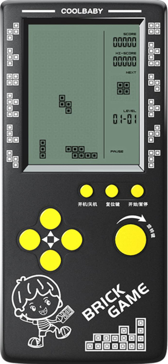
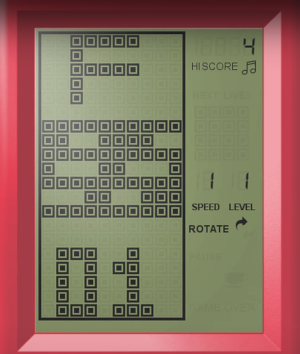
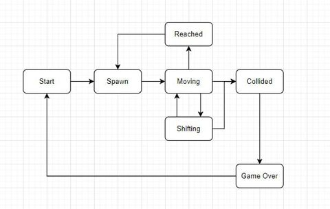
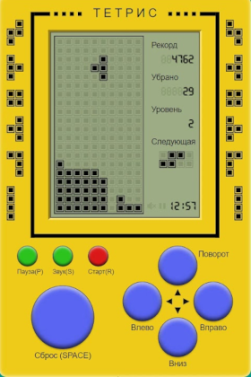
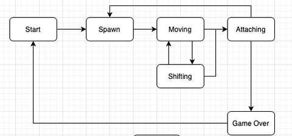
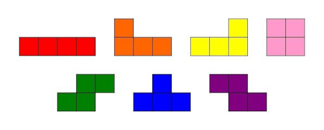

# BrickGame Тетрис

Резюме: в данном проекте тебе предстоит реализовать игру «Тетрис» на языке программирования С с использованием структурного подхода.

💡 [Нажми сюда](https://new.oprosso.net/p/4cb31ec3f47a4596bc758ea1861fb624), **чтобы поделиться с нами обратной связью на этот проект**. Это анонимно и поможет нашей команде сделать обучение лучше. Рекомендуем заполнить опрос сразу после выполнения проекта.

## Содержание

- [BrickGame Тетрис](#brickgame-%D1%82%D0%B5%D1%82%D1%80%D0%B8%D1%81)
  - [Содержание](#%D1%81%D0%BE%D0%B4%D0%B5%D1%80%D0%B6%D0%B0%D0%BD%D0%B8%D0%B5)
  - [Введение](#%D0%B2%D0%B2%D0%B5%D0%B4%D0%B5%D0%BD%D0%B8%D0%B5)
  - [Chapter I](#chapter-i-)
  - [Общая информация](#%D0%BE%D0%B1%D1%89%D0%B0%D1%8F-%D0%B8%D0%BD%D1%84%D0%BE%D1%80%D0%BC%D0%B0%D1%86%D0%B8%D1%8F)
    - [BrickGame](#brickgame)
    - [История тетриса](#%D0%B8%D1%81%D1%82%D0%BE%D1%80%D0%B8%D1%8F-%D1%82%D0%B5%D1%82%D1%80%D0%B8%D1%81%D0%B0)
    - [Конечные автоматы](#%D0%BA%D0%BE%D0%BD%D0%B5%D1%87%D0%BD%D1%8B%D0%B5-%D0%B0%D0%B2%D1%82%D0%BE%D0%BC%D0%B0%D1%82%D1%8B)
    - [Фроггер](#%D1%84%D1%80%D0%BE%D0%B3%D0%B3%D0%B5%D1%80)
    - [Тетрис](#%D1%82%D0%B5%D1%82%D1%80%D0%B8%D1%81)
  - [Chapter II](#chapter-ii-)
  - [Требования к проекту](#%D1%82%D1%80%D0%B5%D0%B1%D0%BE%D0%B2%D0%B0%D0%BD%D0%B8%D1%8F-%D0%BA-%D0%BF%D1%80%D0%BE%D0%B5%D0%BA%D1%82%D1%83)
    - [Часть 1. Основное задание](#%D1%87%D0%B0%D1%81%D1%82%D1%8C-1-%D0%BE%D1%81%D0%BD%D0%BE%D0%B2%D0%BD%D0%BE%D0%B5-%D0%B7%D0%B0%D0%B4%D0%B0%D0%BD%D0%B8%D0%B5)
    - [Часть 2. Дополнительно. Подсчет очков и рекорд в игре](#%D1%87%D0%B0%D1%81%D1%82%D1%8C-2-%D0%B4%D0%BE%D0%BF%D0%BE%D0%BB%D0%BD%D0%B8%D1%82%D0%B5%D0%BB%D1%8C%D0%BD%D0%BE-%D0%BF%D0%BE%D0%B4%D1%81%D1%87%D0%B5%D1%82-%D0%BE%D1%87%D0%BA%D0%BE%D0%B2-%D0%B8-%D1%80%D0%B5%D0%BA%D0%BE%D1%80%D0%B4-%D0%B2-%D0%B8%D0%B3%D1%80%D0%B5)
    - [Часть 3. Дополнительно. Механика уровней](#%D1%87%D0%B0%D1%81%D1%82%D1%8C-3-%D0%B4%D0%BE%D0%BF%D0%BE%D0%BB%D0%BD%D0%B8%D1%82%D0%B5%D0%BB%D1%8C%D0%BD%D0%BE-%D0%BC%D0%B5%D1%85%D0%B0%D0%BD%D0%B8%D0%BA%D0%B0-%D1%83%D1%80%D0%BE%D0%B2%D0%BD%D0%B5%D0%B9)

## Инструкции

Как учиться в «Школе 21»:

- Здесь тебя ждет уникальный образовательный опыт с большим количеством свободы. Ты получаешь задачу и самостоятельно ищешь пути решения, используя любые удобные способы поиска информации — ресурсы Интернета или нейросети (например, GigaChat). Но внимательно относись к качеству информации: проверяй, думай, анализируй, сравнивай.
- Взаимообучение (Peer-to-Peer, P2P) — это обмен знаниями и опытом с другими пирами, где каждый выступает и учителем, и учеником. Такой подход позволяет глубже понять материал, учась друг у друга.
- Чувствуй себя свободно и проси о помощи — вокруг тебя те, кто тоже впервые проходят этот путь. Делись своим опытом и идеями с другими. Присоединяйся к Rocket.Chat, чтобы быть в курсе всех новостей от нашего сообщества.
- Твое обучение не будет иметь никакого смысла, если ты будешь копировать чужие решения. Если пользуешься помощью других — всегда разбирайся до конца, почему, как и зачем. Не бойся ошибиться.
- Кажется, что задача невыполнима? Сделай перерыв, проветрись, перезагрузи голову — это помогало многим. Возможно, после этого решение придет само собой.
- Важен не только результат обучения, но и сам процесс. Нужно не просто решить задачу, а понять, КАК ее решить.

## Введение

Для реализации игры «Тетрис» проект должен состоять из двух частей: библиотеки, реализующей логику работы игры, которую можно в будущем подключать к различным GUI, и терминального интерфейса. Логика работы библиотеки должна быть реализована с использованием конечных автоматов, одно из возможных описаний которого будет дано ниже.

## Chapter I

## Общая информация

### BrickGame

BrickGame — популярная портативная консоль 90-ых годов с несколькими ~~тысячами~~ встроенными играми, разработана она была в Китае. Изначально эта игра была копией, разработанной в СССР и выпущенной Nintendo в рамках платформы GameBoy игры «Тетрис», но включала в себя также и множество других игр, которые добавлялись с течением времени. Консоль имела небольшой экранчик с игровым полем размера 10 х 20, представляющим из себя матрицу «пикселей». Справа от поля находилось табло с цифровой индикацией состояния текущей игры, рекордами и прочей дополнительной информацией. Самыми распространенными играми на BrickGame были: тетрис, танки, гонки, фроггер и змейка.

### История тетриса

«Тетрис» был написан Алексеем Пажитновым 6 июня 1984 года на компьютере Электроника-60. Игра представляла собой головоломку, построенную на использовании геометрических фигур «тетрамино», состоящих из четырех квадратов. Первая коммерческая версия игры была выпущена в Америке в 1987 году. В последующие годы «Тетрис» был портирован на множество различных устройств, в том числе на мобильные телефоны, калькуляторы и карманные персональные компьютеры.

Наибольшую популярность приобрела реализация «Тетриса» для игровой консоли Game Boy и видеоприставки NES. Но кроме нее существуют различные версии игры. Например, есть версия с трехмерными фигурами или дуэльная версия, в которой два игрока получают одинаковые фигуры и пытаются обойти друг друга по очкам.

### Конечные автоматы

Конечный автомат (КА) в теории алгоритмов — математическая абстракция, модель дискретного устройства, имеющего один вход, один выход и в каждый момент времени находящегося в одном состоянии из множества возможных.

При работе КА на вход последовательно поступают входные воздействия, а на выходе КА формирует выходные сигналы. Переход из одного внутреннего состояния КА в другое может происходить не только от внешнего воздействия, но и самопроизвольно.

КА можно использовать для описания алгоритмов, позволяющих решать те или иные задачи, а также для моделирования практически любого процесса. Несколько примеров:

- Логика искусственного интеллекта для игр;
- Синтаксический и лексический анализ;
- Сложные прикладные сетевые протоколы;
- Потоковая обработка данных.

Ниже представлены примеры использования КА для формализации игровой логики нескольких игр из BrickGame.

### Фроггер

«Фроггер» — одна из поздних игр, выходящих на консолях Brickgame. Игра представляет собой игровое поле, по которому движутся бревна, и, перепрыгивая по ним, игроку необходимо перевести лягушку с одного берега на другой. Если игрок попадает в воду или лягушка уходит за пределы игрового поля, то лягушка погибает. Игра завершается, когда игрок доводит лягушку до другого берега или погибает последняя лягушка.

Для формализации логики данной игры можно представить следующий вариант конечного автомата:

Данный КА имеет следующие состояния:

- Старт — состояние, в котором игра ждет, пока игрок нажмет кнопку готовности к игре.
- Спавн — состояние, в котором создается очередная лягушка.
- Перемещение — основное игровое состояние с обработкой ввода от пользователя: движение лягушки по полосе влево/право или прыжки вперед/назад.
- Сдвиг — состояние, которое наступает после истечения таймера, при котором все объекты на полосах сдвигаются вправо вместе с лягушкой.
- Столкновение — состояние, которое наступает, если после прыжка лягушка попадает в воду, или если после смещения бревен лягушка оказывается за пределами игрового поля.
- Достигнут другой берег — состояние, которое наступает при достижении лягушкой другого берега.
- Игра окончена — состояние, которое наступает после достижения другого берега или смерти последней лягушки.

Пример реализации фроггера с использованием КА ты можешь найти в папке `code-samples`.

### Тетрис

«Тетрис», наверное, одна из самых популярных игр для консоли Brickgame. Нередко и саму консоль называют тетрисом. Цель игры — в наборе очков за построение линий из генерируемых игрой блоков. Очередной блок, сгенерированный игрой, начинает опускаться вниз по игровому полю, пока не достигнет нижней границы или не столкнется с другим блоком. Пользователь может поворачивать фигуры и перемещать их по горизонтали, стараясь составлять ряды. После заполнения ряд уничтожается, игрок получает очки, а блоки, находящиеся выше заполненного ряда, опускаются вниз. Игра заканчивается, когда очередная фигура останавливается в самом верхнем ряду.

Для формализации логики данной игры можно представить следующий вариант конечного автомата:

Данный КА состоит из следующих состояний:

- Старт — состояние, в котором игра ждет, пока игрок нажмет кнопку готовности к игре.
- Спавн — состояние, в которое переходит игра при создании очередного блока и выбора следующего блока для спавна.
- Перемещение — основное игровое состояние с обработкой ввода от пользователя: поворот блоков/перемещение блоков по горизонтали.
- Сдвиг — состояние, в которое переходит игра после истечения таймера. В нем текущий блок перемещается вниз на один уровень.
- Соединение — состояние, в которое переходит игра после «соприкосновения» текущего блока с уже упавшими или с землей. Если образуются заполненные линии, то они уничтожаются, и остальные блоки смещаются вниз. Если блок останавливается в самом верхнем ряду, то игра переходит в состояние «игра окончена».
- Игра окончена — игра окончена.

## Chapter II

## Требования к проекту

### Часть 1. Основное задание

Тебе необходимо реализовать программу BrickGame v1.0 aka Tetris:

- Перед выполнением проект необходимо склонировать с GitLab в одноименный репозиторий.
- После клонирования проекта необходимо создать ветку *develop* и вести разработку в ней. После этого пушить в GitLab также нужно ветку *develop*.
- Программа должна быть разработана на языке С стандарта C11 с использованием компилятора gcc.
- Программа должна состоять из двух частей: библиотеки, реализующей логику игры тетрис, и терминального интерфейса с использованием библиотеки `ncurses`.
- Для формализации логики игры должен быть использован конечный автомат.
- Библиотека должна иметь функцию, принимающую на вход ввод пользователя, и функцию, выдающую матрицу, которая описывает текущее состояние игрового поля при каждом ее изменении.
- Код библиотеки программы должен находиться в папке `src/brick_game/tetris`.
- Код с интерфейсом программы должен находиться в папке `src/gui/cli`.
- Сборка программы должна быть настроена с помощью Makefile со стандартным набором целей для GNU-программ: all, install, uninstall, clean, dvi, dist, test, gcov\_report. Установка должна вестись в любой другой произвольный каталог.
- Программа должна быть разработана в соответствии с принципами структурного программирования.
- При написании кода необходимо придерживаться Google Style, заимствованному из стандарта для языка C++ ([ссылка](https://google.github.io/styleguide/cppguide.html)).
- Должно быть обеспечено покрытие библиотеки unit-тестами с помощью библиотеки `check` (тесты должны проходить на ОС Darwin/Ubuntu). Покрытие библиотеки с логикой игры тестами должно составлять не меньше 80 процентов.
- В игре должны присутствовать следующие механики:
  - Вращение фигур;
  - Перемещение фигуры по горизонтали;
  - Ускорение падения фигуры (при нажатии кнопки фигура перемещается до конца вниз);
  - Показ следующей фигуры;
  - Уничтожение заполненных линий;
  - Завершение игры при достижении верхней границы игрового поля;
  - В игре должны присутствовать все виды фигур, показанные на картинке ниже.
- Для управления добавь поддержку всех кнопок, предусмотренных на физической консоли:
  - Начало игры,
  - Пауза,
  - Завершение игры,
  - Стрелка влево — движение фигуры влево,
  - Стрелка вправо — движение фигуры вправо,
  - Стрелка вниз — падение фигуры,
  - Стрелка вверх — не используется в данной игре,
  - Действие (вращение фигуры).
- Игровое поле должно соответствовать размерам игрового поля консоли: десять «пикселей» в ширину и двадцать «пикселей» в высоту.
- Фигура после достижения нижней границы поля или соприкосновения с другой фигурой должна остановиться. Вслед за этим происходит генерация следующей фигуры, показанной на превью.
- Интерфейс библиотеки должен соответствовать описанию, которое находится в [тут](https://git.21-school.ru/masters/C7_BrickGame_v1.0.ID_1449897/-/blob/33/./materials/library-specification_RUS.md).
- Пользовательский интерфейс должен поддерживать отрисовку игрового поля и дополнительной информации.
- Подготовь в любом формате диаграмму, описывающую используемый КА (его состояния и все возможные переходы).
- В твоей директории не должно быть иных файлов, кроме тех, что обозначены в заданиях.

Используемые фигуры:

### Часть 2. Дополнительно. Подсчет очков и рекорд в игре

Добавь в игру следующие механики:

- подсчет очков;
- хранение максимального количества очков.

Данная информация должна передаваться и выводиться пользовательским интерфейсом в боковой панели. Максимальное количество очков должно храниться в файле или встраиваемой СУБД и сохраняться между запусками программы.

Максимальное количество очков должно изменяться во время игры, если пользователь превышает текущий показатель максимального количества очков во время игры.

Начисление очков будет происходить следующим образом:

- 1 линия — 100 очков;
- 2 линии — 300 очков;
- 3 линии — 700 очков;
- 4 линии — 1500 очков.

### Часть 3. Дополнительно. Механика уровней

Добавь в игру механику уровней. Каждый раз, когда игрок набирает 600 очков, уровень увеличивается на 1. Повышение уровня увеличивает скорость движения фигур. Максимальное количество уровней — 10.