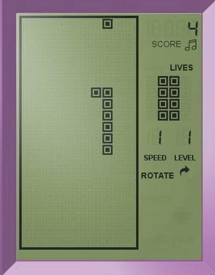
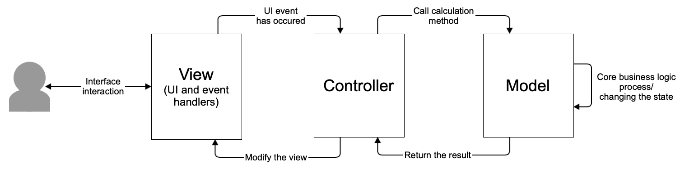
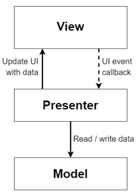
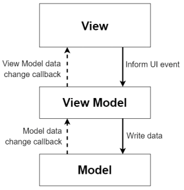

# BrickGame Змейка

Резюме: в данном проекте тебе предстоит реализовать игру «Змейка» на языке программирования С++ в парадигме объектно-ориентированного программирования.

💡 [Нажми сюда](https://new.oprosso.net/p/4cb31ec3f47a4596bc758ea1861fb624), **чтобы поделиться с нами обратной связью на этот проект**. Это анонимно и поможет нашей команде сделать обучение лучше. Рекомендуем заполнить опрос сразу после выполнения проекта.

## Содержание

- [BrickGame Змейка](#brickgame-%D0%B7%D0%BC%D0%B5%D0%B9%D0%BA%D0%B0)
  - [Содержание](#%D1%81%D0%BE%D0%B4%D0%B5%D1%80%D0%B6%D0%B0%D0%BD%D0%B8%D0%B5)
  - [Введение](#%D0%B2%D0%B2%D0%B5%D0%B4%D0%B5%D0%BD%D0%B8%D0%B5)
- [Chapter I](#chapter-i)
  - [Общая информация](#%D0%BE%D0%B1%D1%89%D0%B0%D1%8F-%D0%B8%D0%BD%D1%84%D0%BE%D1%80%D0%BC%D0%B0%D1%86%D0%B8%D1%8F)
    - [Змейка](#%D0%B7%D0%BC%D0%B5%D0%B9%D0%BA%D0%B0)
    - [Паттерн MVC](#%D0%BF%D0%B0%D1%82%D1%82%D0%B5%D1%80%D0%BD-mvc)
    - [Паттерн MVP](#%D0%BF%D0%B0%D1%82%D1%82%D0%B5%D1%80%D0%BD-mvp)
    - [Паттерн MVVM](#%D0%BF%D0%B0%D1%82%D1%82%D0%B5%D1%80%D0%BD-mvvm)
- [Chapter II](#chapter-ii)
  - [Требования к проекту](#%D1%82%D1%80%D0%B5%D0%B1%D0%BE%D0%B2%D0%B0%D0%BD%D0%B8%D1%8F-%D0%BA-%D0%BF%D1%80%D0%BE%D0%B5%D0%BA%D1%82%D1%83)
    - [Часть 1. Основное задание](#%D1%87%D0%B0%D1%81%D1%82%D1%8C-1-%D0%BE%D1%81%D0%BD%D0%BE%D0%B2%D0%BD%D0%BE%D0%B5-%D0%B7%D0%B0%D0%B4%D0%B0%D0%BD%D0%B8%D0%B5)
    - [Часть 2. Дополнительно. Подсчет очков и рекорд в игре](#%D1%87%D0%B0%D1%81%D1%82%D1%8C-2-%D0%B4%D0%BE%D0%BF%D0%BE%D0%BB%D0%BD%D0%B8%D1%82%D0%B5%D0%BB%D1%8C%D0%BD%D0%BE-%D0%BF%D0%BE%D0%B4%D1%81%D1%87%D0%B5%D1%82-%D0%BE%D1%87%D0%BA%D0%BE%D0%B2-%D0%B8-%D1%80%D0%B5%D0%BA%D0%BE%D1%80%D0%B4-%D0%B2-%D0%B8%D0%B3%D1%80%D0%B5)
    - [Часть 3. Дополнительно. Механика уровней](#%D1%87%D0%B0%D1%81%D1%82%D1%8C-3-%D0%B4%D0%BE%D0%BF%D0%BE%D0%BB%D0%BD%D0%B8%D1%82%D0%B5%D0%BB%D1%8C%D0%BD%D0%BE-%D0%BC%D0%B5%D1%85%D0%B0%D0%BD%D0%B8%D0%BA%D0%B0-%D1%83%D1%80%D0%BE%D0%B2%D0%BD%D0%B5%D0%B9)

## Введение

Для реализации игры «Змейка» проект состоит из двух отдельных компонентов: библиотеки, отвечающей за реализацию логики игры, и десктопного графического интерфейса.

Разработанную библиотеку также нужно будет подключить к консольному интерфейсу из BrickGame v1.0. Консольный интерфейс должен полностью поддерживать новую игру.

Разработанную в BrickGame v1.0 игру «Тетрис» необходимо подключить к десктопному интерфейсу, разработанному в данном проекте. Он должен полностью поддерживать игру.

## Chapter I

## Общая информация

Напоминаем, что для формализации логики игры тебе необходимо использовать конечные автоматы. Чтобы освежить свои знания, описание и примеры КА ты можешь найти [здесь](https://git.21-school.ru/masters/CPP3_BrickGame_v2.0.ID_1396153/-/blob/20/materials/brick-game-v1.0_RUS.md).

### Змейка

Игрок управляет змейкой, которая непрерывно движется вперед. Игрок изменяет направление движения змейки с помощью стрелок. Цель игры заключается в сборе «яблок», появляющихся на игровом поле. При этом игрок не должен касаться стенок игрового поля. После «поедания» очередного «яблока» длина змейки увеличивается на один. Игрок побеждает, если змейка достигает максимального размера (200 «пикселей»). Если змейка сталкивается с границей игрового поля, то игрок проигрывает.

Игра была разработана на основе другой, которая называлась Blockage. В ней два игрока управляли персонажами, оставлявшими след, в который нельзя было врезаться. Игрок, продержавшийся дольше, побеждал. В 1977 компания Atari выпустила игру Worm, в которую играл уже только один игрок. Самой популярной версией игры может считаться версия 1997, выпущенная шведской компанией Nokia для их телефона Nokia 6110 и разработанная Taneli Armanto.

### Паттерн MVC

Паттерн MVC (Model-View-Controller, Модель-Представление-Контроллер) представляет собой схему разделения модулей приложения на три отдельных макрокомпонента: модель, содержащую в себе бизнес-логику, представление — форму пользовательского интерфейса для осуществления взаимодействия с программой и контроллер, осуществляющий модификацию модели по действию пользователя.

Концепция MVC была описана Трюгве Реенскаугом в 1978 году, работавшем в научно-исследовательском центре «Xerox PARC» над языком программирования «Smalltalk». Позже Стив Бурбек реализовал шаблон в Smalltalk-80. Окончательная версия концепции MVC была опубликована лишь в 1988 году в журнале Technology Object. Впоследствии шаблон проектирования стал эволюционировать. Например, была представлена иерархическая версия HMVC, MVA и MVVM.

Основная необходимость возникновения этого паттерна связана с желанием разработчиков отделить бизнес-логику программы от представлений, что позволяет легко заменять представления и переиспользовать реализованную единожды логику в других условиях. Отделенная от представления модель и контроллер для взаимодействия с ней позволяет эффективно переиспользовать или модифицировать уже написанный код.

Модель хранит и осуществляет доступ к основным данным, производит по запросам операции, определенные бизнес-логикой программы, то есть руководит той частью программы, которая отвечает за все алгоритмы и процессы обработки информации. Данные модели, изменяясь под действием контроллера, влияют на отображение информации на представлении пользовательского интерфейса. В качестве модели в данной программе должна выступить библиотека классов, осуществляющая логику игры змейка. Эта библиотека должна предоставлять все необходимые классы и методы для осуществления механики игры. Это и есть бизнес-логика данной программы, так как предоставляет средства для решения задачи.

Контроллер — тонкий макрокомпонент, который осуществляет модификацию модели. Через него формируются запросы на изменение модели. В коде это выглядит, как некий «фасад» для модели, то есть набор методов, которые уже работают напрямую с моделью. Тонким он называется потому, что идеальный контроллер не содержит в себе никакой дополнительной логики, кроме вызова одного или нескольких методов модели. Контроллер выполняет функцию связующего элемента между интерфейсом и моделью. Это позволяет полностью инкапсулировать модель от отображения. Такое разделение полезно в силу того, что позволяет коду представления ничего не знать о коде модели и обращаться к одному лишь контроллеру, интерфейс предоставляемых функций которого, вероятно, не будет значительно меняться. Модель же может претерпевать значительные изменения, и, при «переезде» на другие алгоритмы, технологии или даже языки программирования в модели, потребуется поменять лишь небольшой участок кода в контроллере, непосредственно связанный с моделью. В противном случае, вероятнее всего, пришлось бы переписывать значительную часть кода интерфейса, так как он сильно зависел бы от реализации модели. Таким образом, взаимодействуя с интерфейсом, пользователь вызывает методы контроллера, которые модифицируют модель.

К представлению относится весь код, связанный с интерфейсом программы. В коде идеального интерфейса не должно быть никакой бизнес-логики. Он только представляет форму для взаимодействия с пользователем.

### Паттерн MVP

Паттерн MVP имеет два общих компонента с MVC: модель и представление. Но он заменяет контроллер на презентер.

Презентер реализует взаимодействие между моделью и представлением. Когда представление уведомляет презентер, что пользователь что-то сделал (например, нажал кнопку), презентер принимает решение об обновлении модели и синхронизирует все изменения между моделью и представлением. Однако презентер не общается с представлением напрямую. Вместо этого он общается через интерфейс. Благодаря чему все компоненты приложения впоследствии могут быть протестированы по отдельности.

### Паттерн MVVM

MVVM — это более современная эволюция MVC. Основная цель MVVM — обеспечить четкое разделение между уровнями представления и модели.

MVVM поддерживает двустороннюю привязку данных между компонентами View и ViewModel.

Представление выступает подписчиком на события изменения значений свойств предоставляемых моделью представления (ViewModel). В случае если в модели представления изменилось какое-либо свойство, то она оповещает всех подписчиков об этом, и представление, в свою очередь, запрашивает обновлённое значение свойства из модели представления. В случае если пользователь воздействует на какой-либо элемент интерфейса, представление вызывает соответствующую команду, предоставленную моделью представления.

Модель представления — с одной стороны, абстракция представления, а с другой — обертка данных из модели, подлежащих связыванию. То есть она содержит модель, преобразованную к представлению, а также команды, которыми может пользоваться представление, чтобы влиять на модель.

## Chapter II

## Требования к проекту

### Часть 1. Основное задание

Реализуй BrickGame v2.0:

- Программа должна быть разработана на языке C++ стандарта C++20.
- Программа должна состоять из двух частей: библиотеки, реализующей логику игры змейка, и десктопного интерфейса.
- Для формализации логики игры должен быть использован конечный автомат.
- Библиотека должна соответствовать спецификации, приведенной в первой части BrickGame (ее можно найти в materials/library-specification\_RUS.md).
- Код библиотеки программы должен находиться в папке src/brick\_game/snake.
- Код с интерфейсом программы должен находиться в папке src/gui/desktop.
- При написании кода придерживайся Google Style.
- При написании кода рекомендуется использовать идиомы C++, такие как RAII.
  Правило "одного выхода из функции" (single return), которое было важно в проектах на C,
  в C++ не является обязательным благодаря автоматическому управлению ресурсами через деструкторы.
- Классы должны быть реализованы внутри пространства имен `s21`.
- Библиотека, реализующая логику игры, должна быть покрыта unit-тестам. Особое внимание удели проверке состояний и переходами КА. Для тестов используй библиотеку GTest. Покрытие библиотеки тестами должно составлять не меньше 80 процентов.
- Сборка программы должна быть настроена с помощью Makefile со стандартным набором целей для GNU-программ: all, install, uninstall, clean, dvi, dist, test. Установка должна вестись в любой другой произвольный каталог.
- Реализация должна быть с графическим пользовательским интерфейсом, на базе одной из GUI-библиотеки с API для C++20:
  - Qt
  - GTK+
- Программа должна быть реализована с использованием паттерна MVC, а также:
  - не должно быть кода бизнес-логики в коде представлений;
  - не должно быть кода интерфейса в контроллере и в модели;
  - контроллеры должны быть тонкими.
- Перенеси папку библиотеки с логикой игры из проекта BrickGame v1.0.
- Десктопный интерфейс должен поддерживать игру из проекта BrickGame v1.0.
- Перенеси папку с консольным интерфейсом игры из проекта BrickGame v1.0.
- Консольный интерфейс должен поддерживать змейку.
- В игре змейка должны присутствовать следующие механики:
  - Змейка должна передвигаться по полю самостоятельно, на один блок вперед по истечении игрового таймера.
  - Когда змейка сталкивается с «яблоком», ее длина увеличивается на один.
  - Когда длина змейки достигает 200 единиц, игра заканчивается победой игрока.
  - Когда змейка сталкивается с границей поля или сама с собой, игра заканчивается поражением игрока.
  - Пользователь может менять направление движение змейки с помощью стрелок, при этом змейка может поворачивать только налево и направо относительно текущего направления движения.
  - Пользователь может ускорять движение змейки нажатием клавиши действия.
- Начальная длина змейки равна четырем «пикселям».
- Игровое поле имеет размер 10 «пикселей» в ширину и 20 «пикселей» в высоту.
- Подготовь для сдачи проекта диаграмму, отображающую все состояния и переходы между ними для реализованного КА.

### Часть 2. Дополнительно. Подсчет очков и рекорд в игре

Добавь в игру следующие механики:

- подсчет очков;
- хранение максимального количества очков.

Данная информация должна передаваться и выводиться пользовательским интерфейсом в боковой панели. Максимальное количество очков должно храниться в файле или встраиваемой СУБД и сохраняться между запусками программы.

Максимальное количество очков должно изменяться во время игры, если пользователь во время игры превышает текущий показатель максимального количества набранных очков.

Начисление очков будет происходить следующим образом: при поедании очередного «яблока» добавляется одно очко.

### Часть 3. Дополнительно. Механика уровней

Добавь в игру механику уровней. Каждый раз, когда игрок набирает 5 очков, уровень увеличивается на 1. Повышение уровня увеличивает скорость движения змейки. Максимальное количество уровней — 10.