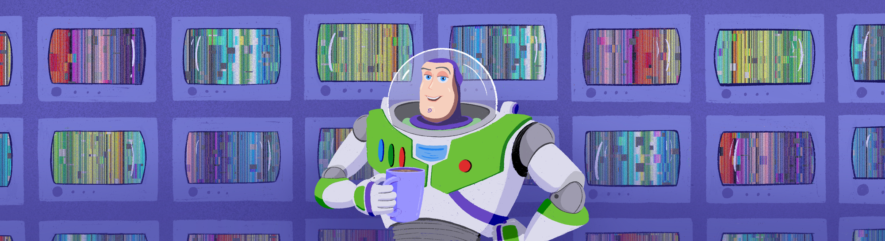

# 3DViewer v2.0

В этом проекте ты разработаешь программу 3DViewer v2.0.

💡 [Нажми сюда](https://new.oprosso.net/p/4cb31ec3f47a4596bc758ea1861fb624), **чтобы поделиться с нами обратной связью на этот проект**. Это анонимно и поможет нашей команде сделать обучение лучше. Рекомендуем заполнить опрос сразу после выполнения проекта.

## Contents

1. [Chapter I](#chapter-i) \
   1.1. [Introduction](#introduction)
2. [Chapter II](#chapter-ii) \
   2.1. [Information](#information)
3. [Chapter III](#chapter-iii) \
   3.1. [Part 1](#part-1-3dviewer-v20) \
   3.2. [Part 2](#part-2-%D0%B4%D0%BE%D0%BF%D0%BE%D0%BB%D0%BD%D0%B8%D1%82%D0%B5%D0%BB%D1%8C%D0%BD%D0%BE-%D0%BD%D0%B0%D1%81%D1%82%D1%80%D0%BE%D0%B9%D0%BA%D0%B8) \
   3.3. [Part 3](#part-3-%D0%B4%D0%BE%D0%BF%D0%BE%D0%BB%D0%BD%D0%B8%D1%82%D0%B5%D0%BB%D1%8C%D0%BD%D0%BE-%D0%B7%D0%B0%D0%BF%D0%B8%D1%81%D1%8C)

## Chapter I

Где-то около кофемашины в 90-ом:

*— Все очень просто, друг мой. Это будет мультфильм про игрушки, как короткометражка, что принесла нам «Оскар». Исходная форма игрушек отлично подойдет под low-полигональные 3D-модели, которые мы умеем анимировать. А скудная мимика не станет критичной, это же ведь игрушки. Да и сюжетик на примете уже имеется... Оживим их! И построим сюжет на взаимоотношении игрушек и ребенка.*

*— Звучит знакомо и звучит заманчиво!*

*— Так и есть. Тебе следует как можно скорее пойти к своей команде и заняться разработкой ПО для 3D-моделирования. Если хотим сделать этот мультик, нам нужны свои собственные программные средства. То, что есть на рынке, позволит анимировать разве что деревянную пирамиду, да и ту в форме куба.*

*— Знаешь, у меня похожие ощущения. Где-то даже наработки имеются.*

*— Думаю, стоит начать с главного — экрана предпросмотра. Удачи!* — с этими словами Лассетер допил свой кофе, вымыл кружку и вышел из комнаты отдыха, оставив тебя наедине с размышлениями. Дверь медленно закрылась после его ухода, оставив только до боли знакомое белое свечение в щелях.

*— Было бы удобно подготовить несколько стратегий отрисовки заранее...* — задумчиво пробормотал ты вслух. — *А также скрыть всю реализацию бизнес-логики за каким-нибудь фасадом, тогда работать с UI будет проще. И команды для обработки действий пользователя, так-так...*

Внезапный звук dial-up модема вдали отвлек тебя от размышлений. Необходимо срочно обсудить поставленную задачу с командой и спроектировать архитектуру будущего приложения. Время не ждет! \
Ты открыл дверь комнаты отдыха, и яркий свет залил твое лицо. Твоя решимость непоколебима, планируемому мультику суждено войти в историю!

## Introduction

В данном проекте тебе предстоит реализовать на языке программирования С++ в парадигме объектно-ориентированного программирования приложение для просмотра 3D-моделей в каркасном виде, реализующее те же самые функции, что и разработанное ранее приложение в проекте 3DViewer v1.0.

## Chapter II

## Information

### Паттерны проектирования

В любой человеческой деятельности, как, например, готовка еды или проведение экспериментов в области ядерной физики, существует определенный набор устоявшихся практик, решающих базовые элементарные задачи. Они не требуют индивидуального подхода и обычно разрешаются устоявшимися за долгое время подходами, основанными на уже накопленном опыте предыдущих поваров или ядерных физиков. Например, для того чтобы испечь пирог, пусть даже и необычный, скорее всего понадобится тесто, технология приготовления которого заранее известна и обычно не требует творческого подхода. Так же и с программированием — при проектировании часто возникают элементарные задачи, с которыми до тебя сталкивалось огромное число программистов, а их совокупный опыт вылился в устоявшиеся паттерны проектирования.

**Паттерн проектирования** описывает часто повторяющуюся при проектировании приложений задачу и принцип ее решения, который является универсальным для этой задачи. То есть для программиста паттерн проектирования — не что иное, как строительный блок, элементарная единица, которая реализуется в случае возникновения типовой подзадачи внутри проекта.

Обычно паттерны проектирования разделяют на три группы: порождающие паттерны, структурные паттерны и паттерны поведения. Подробнее про паттерны проектирования смотри в материалах к данному заданию. \
Паттерн MVC в том или ином виде является одним из самых частых решений в плане структурирования кода в ходе разработки приложений с пользовательским интерфейсом. Пользовательский интерфейс и бизнес-логику с прилежащим к ней контроллером обычно разбивают на два различных глобальных домена: домен интерфейса и домен бизнес-логики.

Домен интерфейса отвечает только за отображение интерфейса и передачу команд домену бизнес-логики. Загруженные из файла данные не должны храниться в домене интерфейса.

Домен бизнес-логики отвечает за основную функциональность системы. Именно в нем хранятся загруженные данные и выполняются все операции над ними. Также в этом домене производится отрисовка.

С примерной предлагаемой диаграммой классов для домена бизнес-логики можешь ознакомиться в материалах.

## Chapter III

## Part 1. 3DViewer v2.0

Разработай программу для визуализации каркасной модели в трехмерном пространстве.

- Программа должна быть разработана на языке C++ стандарта C++20.
- Код программы должен находиться в папке src.
- При написании кода необходимо придерживаться Google Style.
- При написании кода рекомендуется использовать идиомы C++, такие как RAII.
  Правило "одного выхода из функции" (single return), которое было важно в проектах на C,
  в C++ не является обязательным благодаря автоматическому управлению ресурсами через деструкторы.
- Сборка программы должна быть настроена с помощью Makefile со стандартным набором целей для GNU-программ: all, install, uninstall, clean, dvi, dist, tests. Установка должна вестись в любой другой произвольный каталог.
- Программа должна быть разработана в соответствии с принципами объектно-ориентированного программирования, структурный подход запрещен.
- Должно быть обеспечено полное покрытие unit-тестами модулей, связанных с загрузкой моделей и аффинными преобразованиями.
- В один момент времени должна быть только одна модель на экране.
- Программа должна предоставлять возможность:
  - Загружать каркасную модель из файла формата obj (поддержка только списка вершин и поверхностей);
  - Перемещать модель на заданное расстояние относительно осей X, Y, Z;
  - Поворачивать модель на заданный угол относительно своих осей X, Y, Z;
  - Масштабировать модель на заданное значение.
- В программе должен быть реализован графический пользовательский интерфейс, на базе любой GUI-библиотеки с API для C++:
  - Для Linux: GTK+, CEF, Qt, JUCE;
  - Для Mac: GTK+, CEF, Qt, JUCE, SFML, Nanogui, Nngui.
- Графический пользовательский интерфейс должен содержать:
  - Кнопку для выбора файла с моделью и поле для вывода его названия;
  - Зону визуализации каркасной модели;
  - Кнопку/кнопки и поля ввода для перемещения модели;
  - Кнопку/кнопки и поля ввода для поворота модели;
  - Кнопку/кнопки и поля ввода для масштабирования модели;
  - Информацию о загруженной модели — название файла, кол-во вершин и ребер.
- Программа должна корректно обрабатывать и позволять пользователю просматривать модели с деталями до 100, 1000, 10 000, 100 000, 1 000 000 вершин без зависания (зависание — это бездействие интерфейса более 0,5 секунды).
- Программа должна быть реализована с использованием паттерна MVC, то есть:
  - не должно быть кода бизнес-логики в коде представлений;
  - не должно быть кода интерфейса в контроллере и в модели;
  - контроллеры должны быть тонкими.
- Необходимо использовать минимум три различных паттерна проектирования (например, фасад, стратегия и команда).
- Классы должны быть реализованы внутри пространства имен `s21`.
- Для осуществления афинных преобразований могут использоваться матрицы из библиотеки из предыдущего проекта s21\_matrix+.

*Замечание:* **Не загружай тяжелые файлы (>10 Мб) в гит.**

## Part 2. Дополнительно. Настройки

- Программа должна позволять настраивать тип проекции (параллельная и центральная).
- Программа должна позволять настраивать тип (сплошная, пунктирная), цвет и толщину ребер, способ отображения (отсутствует, круг, квадрат), цвет и размер вершин.
- Программа должна позволять выбирать цвет фона.
- Настройки должны сохраняться между перезапусками программы.

## Part 3. Дополнительно. Запись

- Программа должна позволять сохранять полученные («отрендеренные») изображения в файл в форматах bmp и jpeg.
- Программа должна позволять по специальной кнопке записывать небольшие «скринкасты» — текущие пользовательские аффинные преобразования загруженного объекта в gif-анимацию (640x480, 10fps, 5s).