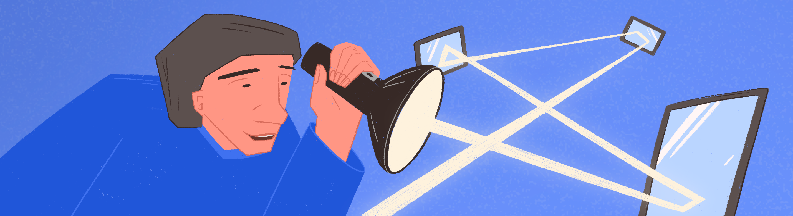

# 3DViewer v2.2

Тебе предстоит разработать программу 3DViewer v2.2.

💡 [Нажми сюда](https://new.oprosso.net/p/4cb31ec3f47a4596bc758ea1861fb624), **чтобы поделиться с нами обратной связью на этот проект**. Это анонимно и поможет нашей команде сделать обучение лучше. Рекомендуем заполнить опрос сразу после выполнения проекта.

## Contents

1. [Chapter I](#chapter-i) \
   1.1. [Introduction](#introduction)
2. [Chapter II](#chapter-ii) \
   2.1. [Information](#information)
3. [Chapter III](#chapter-iii) \
   3.1. [Part 1](#part-1-3dviewer-v22) \
   3.2. [Part 2](#part-2-%D0%B4%D0%BE%D0%BF%D0%BE%D0%BB%D0%BD%D0%B8%D1%82%D0%B5%D0%BB%D1%8C%D0%BD%D0%BE-%D0%BD%D0%B0%D1%81%D1%82%D1%80%D0%BE%D0%B9%D0%BA%D0%B8) \
   3.3. [Part 3](#part-3-%D0%B4%D0%BE%D0%BF%D0%BE%D0%BB%D0%BD%D0%B8%D1%82%D0%B5%D0%BB%D1%8C%D0%BD%D0%BE-%D0%BE%D0%BF%D1%82%D0%B8%D0%BC%D0%B8%D0%B7%D0%B0%D1%86%D0%B8%D1%8F)

## Chapter I

*-- Итак, в сегодняшнем выпуске мы продолжаем разбирать трассировку лучей. И остановились мы на таком понятии, как трассировка пути.*

*-- Да, эти два понятия часто путают. Мне кажется, проще всего запомнить, что трассировка пути — по своей сути частный случай трассировки лучей, тогда и вся путаница уйдет.*

*-- То есть трассировка пути должна быть более простой операцией по сравнению с лучами?*

*-- Да, так и есть. Видите ли, после того как один луч отразится от объекта, он может превратиться в 10 лучей, а эти 10 затем могут превратиться в 100, 1000 и так далее. То есть получаем уже экспоненциальное увеличение количества лучей. Можно визуализировать один фрейм, но страшно представить, сколько понадобится времени, чтобы рассчитать все эти лучи для нескольких фреймов. По этой причине используют облегченную версию трассировки лучей — трассировку пути. В ней при отражении луча всегда создается всего один луч, а отраженные лучи следуют не по заданной линии, а расходятся в случайном направлении. Поэтому для большей достоверности результирующей картинки в трассировки пути для одного пикселя изображения выпускают не один луч, а десятки, сотни или тысячи. И тем не менее, получается все равно быстрее, чем классическая трассировка лучей.* \
*И даже несмотря на такое ускорение, все равно придумывают различные способы еще больше ускорить работу алгоритма: уменьшенное разрешение рендеринга при отражении лучей, ограничения по расстоянию, на которое могут уйти отраженные лучи и так далее.*

*-- А что же по качеству работы алгоритмов? Не должна ли трассировка лучей выдавать более качественные рендеры?*

*-- Конечно. Но, к сожалению, мы ограничены в вычислительных мощностях. Это касается не только геймеров, но и крупных мультипликационных и CGI студий. Большинство до сих пор используют различные вариации трассировки пути для создания своих шедевров. Тем не менее, существуют определенные методы, позволяющие еще больше улучшить качество рендеров, полученных с помощью трассировки пути, и приблизить их к реальной трассировке лучей. Например, можно отражать лучи не просто случайным образом, а по некоторым паттернам.*

Буферизация 15%... 35%... 50%... 77%...

## Introduction

В рамках данного проекта тебе предстоит произвести модификацию приложения, разрабатываемого в проекте 3D Viewer v2.1. Новая версия должна осуществлять визуализацию рендеринга трехмерной сцены методом трассировки лучей.

## Chapter II

## Information

### Историческая справка

Изначально компьютерная графика занималась имитацией визуальных характеристик объектов. В том числе видимость и затенение полигонов объектов осуществлялась определенными подходами, позволяющими добиться схожего с реальностью результата. Однако с появлением метода трассировки лучей связана идея применения в компьютерной графике концепций и моделей, имеющих реальный физический смысл. Было принято решение попробовать произвести рендеринг (отрисовку) изображений путем учета отражения и преломления лучей света, исходящих из источников освещения. Однако разработчики Артур Аппель, Роберт Голдштейн и Роджер Нагель, впервые осуществлявшие попытки произвести рендеринг путем трассировки лучей в начале 60-х, в значительной степени ограниченные в ресурсах и технологиях, пришли к выводу, что вовсе не обязательно отслеживать все лучи, исходящие из источника освещения. Значимыми для рендеринга лучами являются лишь только те лучи, которые попадают в «глаз» наблюдателя. Учитывая законы оптики (например, тот факт, что угол падения равен углу отражения), достаточно легко показать, что если отслеживать лучи в обратном порядке, результат окажется практически таким же, что и в прямом, однако будет затрачено значительно меньшее количество ресурсов. Так, в 1963 году в университете Мэриленда было получено первое изображение при помощи трассировки лучей.

Позже стали появляться более сложные модели трассировки лучей, учитывающие глобальное освещение, непрямое освещение от других объектов, преломление и многое другое. Именно трассировка лучей надолго зарекомендовала себя в компьютерной графике как алгоритм получения фотореалистичных изображений.

### Рендеринг трассировкой лучей

Алгоритм трассировки лучей при своей концептуальной простоте связан с большим количеством вычислений, размер которых зависит от степени точности моделирования путешествия лучей по сцене. Как уже было сказано, на практике используется обратная трассировка лучей, то есть лучи исходят от наблюдателя, как в случае с ray casting. Тем не менее, разница этих двух методов достаточно существенна, хотя некоторые из авторов учебных пособий и воспринимают эти два метода как синонимичные.

В случае с обратной трассировкой лучей, лучи, испускаемые от наблюдателя, не просто устанавливают факт видимости объекта, но и определяют его визуальные свойства. Достаточно математически описать форму объекта сцены и задать некоторое количество коэффициентов, и, если модель поведения лучей описана достаточно подробно, будет получен и непосредственно цвет пикселя, без необходимости применения дополнительных подходов к закраске или вычислению цвета объекта.

Подробнее о рендеринге с помощью трассировки лучей можешь прочитать в материалах.

## Chapter III

## Part 1. 3DViewer v2.2

Модифицируй 3DViewer v2.1.

- Программа должна быть разработана на языке C++ стандарта C++20.
- Код программы должен находиться в папке src.
- При написании кода необходимо придерживаться Google Style.
- При написании кода рекомендуется использовать идиомы C++, такие как RAII.
  Правило "одного выхода из функции" (single return), которое было важно в проектах на C,
  в C++ не является обязательным благодаря автоматическому управлению ресурсами через деструкторы.
- Сборка программы должна быть настроена с помощью Makefile со стандартным набором целей для GNU-программ: all, install, uninstall, clean, dvi, dist, tests. Установка должна вестись в любой другой произвольный каталог.
- Программа должна быть разработана в соответствии с принципами объектно-ориентированного программирования, структурный подход запрещен.
- Должно быть обеспечено покрытие unit-тестами модулей, связанных с загрузкой моделей и аффинными преобразованиями.
- В один момент времени **может быть загружено и отображаться сразу несколько моделей**.
- Программа должна предоставлять возможность:
  - Загружать модель из файла формата obj (поддержка списка вершин, поверхностей, нормалей и, возможно, uv-координат) и загружать объект из стандартного пула аналитически описанных стереометрических объектов: шар, цилиндр, конус, куб, пирамида (для отображения в вьювере использовать полигональные аппроксимации, для рендеринга трассировкой лучей использовать аналитическое описание).
  - Перемещать отдельную модель и всю сцену на заданное расстояние относительно осей X, Y, Z.
  - Поворачивать отдельную модель и всю сцену на заданный угол относительно осей X, Y, Z. Сцену необходимо вращать вокруг начала координат.
  - Масштабировать отдельную модель и всю сцену на заданное значение.
  - Переключать тип отображения объекта: каркасная модель, плоское затенение, мягкое затенение (методом Гуро или методом Фонга).
  - Задавать направленный источник освещения с соответствующими характеристиками (позиция, интенсивность и цвет через три компонента RGB), задавать глобальное освещение (интенсивность и цвет через 3 компонента RGB).
  - Рендерить изображение по нажатию кнопки в отдельный файл в формате bmp, jpeg или png трассировкой лучей с указанными пользователем разрешением (до 1920x1440); после рендеринга изображение должно быть отображено в отдельном окне предпросмотра в GUI.
  - Включать и выключать отображение «пола» — плоскости, на которой размещена модель по умолчанию.
  - Добавлять до 5 дополнительных моделей на сцену. Предусмотреть возможность переключения между моделями для применения аффинных преобразований и изменения свойств для каждой конкретной модели.
  - Задавать визуальные свойства объекта: коэффициент прозрачности, преломления, отражения, шероховатости поверхности, для полигональных моделей - твердые и мягкие ребра.
- В программе должен быть реализован графический пользовательский интерфейс, на базе любой GUI-библиотеки с API для C++:
  - Для Linux: GTK+, CEF, Qt, JUCE;
  - Для Mac: GTK+, CEF, Qt, JUCE, SFML, Nanogui, Nngui.
- Графический пользовательский интерфейс должен содержать:
  - Кнопку для выбора файла с моделью и поле для вывода его названия;
  - Зону визуализации сцены;
  - Кнопку/кнопки и поля ввода для перемещения модели/сцены;
  - Кнопку/кнопки и поля ввода для поворота модели/сцены;
  - Кнопку/кнопки и поля ввода для масштабирования модели/сцены;
  - Кнопка рендеринга трассировкой лучей;
  - Кнопка включения/выключения пола, отображения пола;
  - Кнопка добавления новой модели на сцену;
  - Кнопки переключения выделения текущий модели для применения к ней действий;
  - Информацию о загруженной модели — название файла, кол-во вершин и ребер.
- Программа должна корректно обрабатывать и позволять пользователю просматривать модели с деталями до 100, 1000, 10 000, 100 000, 1 000 000 вершин без зависания (зависание — это бездействие интерфейса более 0,5 секунды).
- Программа должна быть реализована с использованием паттерна MVC, то есть:
  - не должно быть кода бизнес-логики в коде представлений;
  - не должно быть кода интерфейса в контроллере и в модели;
  - контроллеры должны быть тонкими.
- Необходимо использовать минимум три различных паттерна проектирования (например, фасад, стратегия и команда).
- Классы должны быть реализованы внутри пространства имен `s21`.
- Для осуществления аффинных преобразований могут использоваться матрицы из библиотеки из предыдущего проекта s21\_matrix+.

## Part 2. Дополнительно. Настройки

- Программа должна позволять настраивать тип проекции (параллельная и центральная).
- Программа должна позволять настраивать тип (сплошная, пунктирная), цвет и толщину ребер, способ отображения (отсутствует, круг, квадрат), цвет и размер вершин.
- Программа должна позволять выбирать цвет фона.
- Программа должна позволять выбирать базовый цвет объекта.
- Настройки должны сохраняться между перезапусками программы.
- Предусмотри возможность добавления до 5 новых точечных источников освещения с задачей собственных параметров (позиция, интенсивность и цвет через три компонента RGB).

## Part 3. Дополнительно. Оптимизация

- Реализуй разбиение пространства сцены при помощи KD-дерева и оптимизировать поиск пересечения лучей с объектами сцены через бинарный поиск по дереву.