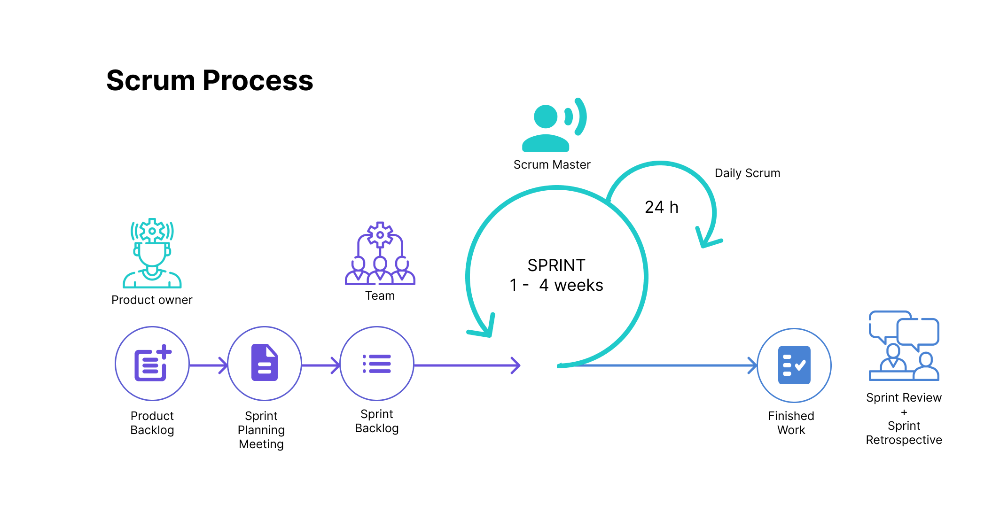
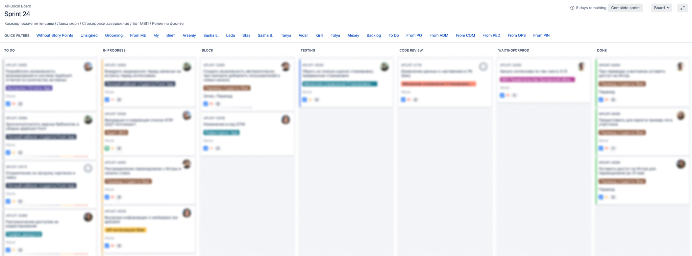
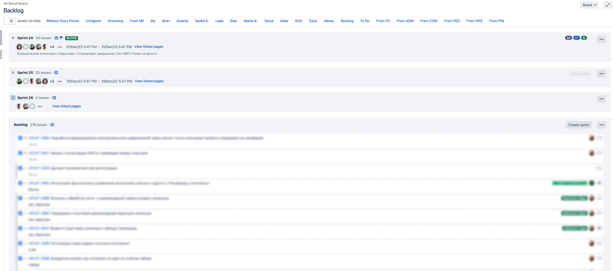
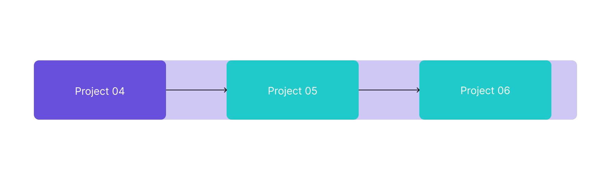

## Career track. Project 04

В данном проекте ты познакомишься с актуальными методологиями и инструментами для их реализации, по которым работают большинство ИТ-команд, а также узнаешь про формальные и неформальные правила работы в команде.

**Важно**

Ты не можешь завершить Project 04, пока недоделаешь индивидуальные проекты Project 05 и 06. Если ты завершишь Project 04, то не сможешь выполнить следующие проекты.

💡 [Нажми сюда](https://new.oprosso.net/p/4cb31ec3f47a4596bc758ea1861fb624), **чтобы поделиться с нами обратной связью на этот проект**. Это анонимно и поможет нашей команде сделать обучение лучше. Рекомендуем заполнить опрос сразу после выполнения проекта.

## Contents

1.  [Chapter I](https://platform.21-school.ru/project/73034/task#chapter-i)
    
    1.1. [Preamble](https://platform.21-school.ru/project/73034/task#preamble)
2.  [Chapter II](https://platform.21-school.ru/project/73034/task#chapter-ii)
    
    2.1. [General rules](https://platform.21-school.ru/project/73034/task#general-rules)
3.  [Chapter III](https://platform.21-school.ru/project/73034/task#chapter-iii)
    
    3.1. Зачем понимать методологию, если я пришел просто кодить? (быстрый онбординг и фактор роста)
    
    3.2. Работа по фреймворку Scrum. К чему быть готовым?
    
    3.3. Использование Канбан-метода. Как его применять в реальной жизни?
    
    3.4. Формальные и неформальные правила. Для чего их выделяют?
4.  [Chapter IV](https://platform.21-school.ru/project/73034/task#chapter-iv)
    
    [Задача](https://platform.21-school.ru/project/73034/task#%D0%B7%D0%B0%D0%B4%D0%B0%D1%87%D0%B0)
5.  [Chapter V](https://platform.21-school.ru/project/73034/task#chapter-v)

## Chapter I

## Preamble

После официального устройства на работу в ИТ-компанию ты вступаешь в ряды команды разработчиков, работающей над одним продуктом/проектом/сервисом.

В процессе работы над проектом ты усилишь свой навык «работы в команде» и получишь ответы на вопросы:

-   Зачем понимать методологию, если я пришел просто кодить?
-   Работа по фреймворку Scrum. К чему быть готовым?
-   Использование Канбан-метода. Как его применять в реальной жизни?
-   Инструменты работы для организации команды. Как они помогают прийти к эффективному результату?
-   Формальные и неформальные правила. Для чего их выделяют?

**Литература:**

1.  [Agile манифест](https://agilemanifesto.org/iso/ru/manifesto.html).
2.  [Скрам гайд](https://scrumguides.org/docs/scrumguide/v2020/2020-Scrum-Guide-Russian.pdf) (доступно для скачивания в папке materials -> Scrum-Guide).
3.  [Краткое руководство по Канбану](https://git.21-school.ru/masters/CT5_Teamwork.ID_886866/-/blob/20/https://git.21-school.ru/masters/CT5_Teamwork.ID_886866/-/blob/20/materials/%D0%9A%D0%B0%D0%BD%D0%B1%D0%B0%D0%BD.pdf) (доступно для скачивания в папке materials -> Канбан).
4.  [Тренажер по Scrum](https://www.scrum.org/open-assessments/scrum-open).
5.  [Набор упражнений для pетро](https://retromat.org/ru/?id=59-128-41-124-112).
6.  Книга «Путь скрам-мастера. #ScrumMasterWay».
7.  [Книга «Коучинг agile-команд»](https://git.21-school.ru/masters/CT5_Teamwork.ID_886866/-/blob/20/materials/Agile_-_%D0%BA%D0%BE%D0%BC%D0%B0%D0%BD%D0%B4.pdf) (доступно для скачивания в папке materials -> Agile-команд, Agile).
8.  Книга «Agile ретроспектива. Как превратить хорошую команду в великую».

## Chapter II

## Genеral rules

1.  На протяжении всего курса тебя будет сопровождать чувство неопределенности и острого дефицита информации — это нормально. Не забывай, что информация в репозитории и Google всегда с тобой, так же как пиры и Rocket.Chat. Общайся, ищи, опирайся на здравый смысл и не бойся ошибиться.
2.  Будь внимателен к источникам информации: проверяй, думай, анализируй, сравнивай.
3.  Будь внимателен к тексту задания, перечитывай по нескольку раз.
4.  Внимательно читай примеры. В них может быть что-то, что не указано в явном виде в самом задании.
5.  Могут встретиться несоответствия, когда что-то новое в условиях задачи или примере противоречит уже известному. Если встретилось такое — попробуй разобраться. Если не получилось — запиши вопрос в перечень открытых вопросов и найдешь ответ в процессе работы. Не оставляй открытые вопросы неразрешенными.
6.  Если задание кажется непонятным или невыполнимым — так только кажется. Попробуй его декомпозировать. Скорее всего, отдельные части станут понятными.
7.  На пути тебе встретятся разные задания. Бонусные задания подходят для самых дотошных и пытливых. Эти задания с повышенной сложностью и необязательны к выполнению, но если ты их сделаешь, то получишь дополнительный опыт и знания.
8.  Не пытайся обмануть систему и окружающих. Ведь в первую очередь ты обманываешь сам себя.
9.  Есть вопрос? Спроси соседа справа, если это не помогло — обратись к соседу слева.
10.  Когда пользуешься чьей-либо помощью, то всегда разбирайся до конца: почему, как и зачем. Иначе помощь не будет иметь смысла.
11.  Всегда делай push только в ветку develop! Ветка master будет проигнорирована. Работай в директории src.
12.  В твоей директории не должно быть иных файлов, кроме тех, что обозначены в заданиях.

## Chapter III

## Зачем понимать методологию, если я пришел просто кодить?

Давай представим твои первые дни в компании. Ты пришел в команду разработчиков, вокруг много незнакомых людей и новых терминов, в календаре стоят встречи, и как возможное следствие, у тебя на начальном этапе происходит непонимание, как в данной компании все работает.

Чем раньше ты поймешь, на старте карьеры, как устроена команда и по каким правилам она играет, как устроен производственный процесс работы над задачами:

1.  тем лучше вольешься в коллектив и процесс работы;
2.  у тебя появится дополнительный фактор для быстрого роста;
3.  тем быстрее сможешь принимать активное участие в жизни команды и уже предлагать улучшения.

_Пример:_ В команду, которая успешно и давно работает по одной из методологий, пришел разработчик, который ее не знал и никак не хотел понимать. Из большого желания проявить себя он:

-   начинает дополнительно к своим задачам придумывать новый функционал и тут же его реализовывать, что может оказаться не нужно заказчику;
-   перестает ходить на командные встречи, потому что не понимает, зачем он там нужен;
-   пытается самостоятельно реализовать сразу весь функционал, а не двигается поступательно и не разбивает задачу на более мелкие.

Каждый член команды связан, поэтому, если работать не сообща, все вышеперечисленные действия приводят к тому, что команда может медленнее доставлять нужную ценность до заказчика/пользователя, а бизнес, например, терять деньги.

Таким образом, во избежание такого рода инцидентов, под каждую разработку продукта/проекта, над которым работает команда, подбирается определенная методология, которая наиболее эффективно приведет команду к успешному результату.

Методология — набор подходов, практик и моделей разработки.

Выделяют два основных типа управления проектами: Традиционный и Гибкий.

1.  **Традиционный подход** используется, когда мы на самом старте уже точно знаем, какой продукт хотим реализовать, а каждый следующий этап начинается только после завершения предыдущего. Наиболее чаще применение данного типа метода можно встретить в сфере строительства и медицине.
    
    Одним из примеров такого подхода являются Waterfall (каскадная модель) и V-образная модель.
    
2.  Для преодоления недостатков традиционного подхода стали появляться **гибкие методологии**, которые были объединены в единую философию Agile — набор из 4 ценностей и 12 принципов разработки.
    

В каких сферах своей жизни или текущей работе ты уже применяешь ценности Agile? Чтобы ответить на вопрос, прочитай Agile-манифест.

Наиболее популярными, особенно в ИТ-среде Agile-подходами, являются SCRUM (скрам, не скрум) и Kanban. Далее мы их подробнее рассмотрим.

Обрати внимание, что краеугольным камнем в Agile является общение: **взаимодействие и внутри команды, и с пользователями.**

Для многих это может быть непривычно: «почему я всей команде должен рассказывать о своих задачах», «почему я должен анализировать и всем рассказывать свои ошибки», «зачем нужны эти встречи». Подобные действия помогают командам быть самоорганизованными и выпускать качественный, нужный рынку продукт.

## Работа по фреймворку Scrum. К чему быть готовым?

Scrum — способ организации рабочего процесса, который особенно сильно популярен в ИТ-командах. С большой долей вероятности ты будешь работать по этому фреймворку.

Основной единицей Scrum является самоорганизованная и кросс-функциональная команда, а это значит, что:

-   все решения принимаются, учитывая мнение каждого;
-   команда сама решает, кто, что, как и когда делает;
-   в команде есть все необходимые навыки для достижения цели.

Scrum подходит командам, которые занимаются развитием продукта. Когда есть только идея продукта, но нет понимания, как к ней прийти, когда есть бизнес-цель, но нет уверенности, какие конкретно фичи приведут к ней, когда никто не может дать четкий план разработки. Scrum позволяет постепенно преодолевать неопределенность, двигаясь **небольшими итерациями и постоянно проверяя**: мы делаем то, что нужно клиентам? приносит ли это пользу?

В SCRUM однозначно регламентируют, какие ценности, роли, события (встречи) и артефакты должны быть при использовании этого фреймворка. Они описаны в Scrum guide — это правила применения.

Более подробно рассмотрим инструмент SCRUM под названием «ретроспектива». Так как ты с командой будешь проводить ее в рамках текущего блока, то эта встреча нужна для осмысления проделанной работы всеми участниками, чтобы запланировать улучшения качества или эффективности. Алгоритм проведения встречи состоит из 5 шагов:

1.  Открытие;
2.  Сбор данных;
3.  Генерация идей;
4.  Составления плана действия;
5.  Закрытие.

Более [подробно](https://filipyev.ru/2018/07/25/pyat-shagov-restrospektivy-konceptualnaya-karta/) про проведение встречи. А для выбора упражнений на свою ретроспективу можно вдохновиться [инструментом](https://retromat.org/ru/?id=114-35-74-100-109).

## Использование Канбан-метода. Как его применять в реальной жизни?

Канбан-метод можно применить к любому процессу, в котором ты участвуешь, и сделать его лучше: на работе, в учебе и личной жизни. Очень похоже на действие подорожника — к чему бы ни приложил, станет только лучше.

Это эволюционный подход, то есть не нужно ничего в команде перестраивать или сразу всё внедрять для его использования. Практики можно начать использовать постепенно.

Суть применения Канбан-метода заключается в том, чтобы первым этапом увидеть, в чем заключается текущий процесс работы и как он устроен, а вторым этапом совершенствовать все эти процессы — распространять полезные изменения и корректировать неэффективные.

Для такой работы Канбан-метод предлагает 6 практик.

Разберем одну из практик. _Визуализируй_ Всю нашу работу необходимо визуализировать. Это позволит увидеть весь наш текущий процесс, понять закономерности в работе и предложить варианты ее улучшения. Часто бывает так, что если задачу не записали на доску, то, вероятно, она не будет сделана. Визуализировать нужно также правила, по которым работает команда. Поэтому визуализация поможет весь большой поток запросов и просьб, которые к нам поступают, увидеть в одном месте и привести их в порядок.

Подробнее про эти и [другие практики](https://git.21-school.ru/masters/CT5_Teamwork.ID_886866/-/blob/20/https://git.21-school.ru/masters/CT5_Teamwork.ID_886866/-/blob/20/materials/%D0%9A%D0%B0%D0%BD%D0%B1%D0%B0%D0%BD.pdf)

Часто в командах, которые стараются работать, используя Канбан-метод, выделяют такую роль, как Service Delivery Manager. Этот человек занимается управлением потока задач в Канбан-системе (вручную не раздает задачи) и устранением препятствий на его пути. Он также следит за метриками команды и помогает команде планировать улучшения.

## Формальные и неформальные правила работы в команде. Для чего их выделяют?

Ты пришел в команду и разобрался, как она работает и какие есть формальные правила.

Например, почти у всех команд есть **таск-трекеры**, которые помогают на практике реализовать SCRUM или Канбан-метод. Одним из популярных сервисов для ведения задач является Jira (название получила в честь японского монстра Годзиллы, что являлось отсылкой к названию конкурирующего продукта Bugzilla), потому что в ней можно удобно реализовать любой из этих фреймворков, с помощью графиков и отчетов наблюдать за потоком задач и производительностью команд. Также есть большой набор плагинов, которые можно подключать, чтобы усовершенствовать этот инструмент. Например, далее будут примеры, как команда «Школы 21» использует Jira для фреймворка SCRUM.

Так выглядит доска, на которой видны все задачи, находящиеся в спринте, и которые нам нужны для достижения цели спринта:

А далее представлен пример бэклога продукта, на основе которого Product Owner может уже заранее распределять цели и задачи по спринтам.

Подобный инструмент позволяет:

-   видеть всю нашу работу в целом;
-   быть сфокусированным на цели спринта;
-   быть команде самоорганизованной;
-   отслеживать, где команда отстает и где возникают сложности, которые нужно вместе преодолеть.

Если мы говорим о Канбан-методе, то его реализация в таск-трекере поможет применить несколько практик. Как ты думаешь, какие практики ты сможешь использовать, если будешь с командой, работающей по Канбан-методу, вести таск-трекер?

Помимо Jira, конечно, есть еще много удобных онлайн-досок для ведения задач. Например:

-   Trello;
-   Asana;
-   Kaiten;
-   Яндекс.Трекер и др.

Также одним из формальных правил работы в команде может быть ведение корпоративной базы знаний. По ходу работы над проектом команда получает новые знания о его реализации, о допущенных ошибках, о новых договоренностях и так далее. Поэтому для сохранения этих знаний и для дальнейшего погружения новых сотрудников они хранятся в одном месте. Часто для этих целей команды используют Confluence, в котором создаются пространства для команд, а внутри появляются статьи, документы и вложения.

Не бойся проявлять себя, задавать вопросы и предлагать изменения! Успехов тебе на новом месте работы!

## Chapter IV

## Задача

Тебе необходимо прожить ближайшую неделю в команде разработчиков, используя популярные практики, которые применяются в компаниях — работа с доской задач и участие в ретроспективах. Это одни из самых распространенных практик, где при выходе на работе уже поймешь, зачем это нужно и попробуешь на себе. Также ты глубже разберешься, как применяется SCRUM и пройдешь тест.

**Важно**

Ты не можешь завершить Project 04, пока не завершишь индивидуальные проекты Project 05 и 06. Если ты завершишь Project 04, то не сможешь выполнить следующие проекты.

## Chapter V

## Exercise 00

### Создание и ведение командной доски с задачами обучения

1.  Создайте доску на любой удобной платформе для всей команды.
2.  Ведите там все задачи третьего блока (Project 04, Project 05, Project 06) всеми участниками команды. Задачи могут касаться не только выполнения конкретных заданий, но и изучения текущих или дополнительных материалов.
3.  По ссылке может перейти любой человек и увидеть доску с задачами.

## Exercise 01

### Проведение командной ретроспективы

1.  После того как все участники выполнят задания каждого дня (Project 05, Project 06), необходимо провести ретроспективу, используя онлайн-доску (miro, metroretro, trello и т. д.), соблюдая 5 этапов встречи.
2.  Каждый участник команды должен отработать роль фасилитатора и участника. К роли фасилитатора для проведения встречи необходимо заранее подготовиться, спланировать каждый этап, выбрать упражнение и инструмент. Старайтесь на каждой встрече подбирать разные инструменты, чтобы не повторяться и протестировать все варианты.
3.  Одну из встреч команды необходимо записать и загрузить, где будет отражен весь процесс ретроспективы и продемонстрированы все 5 этапов.

Видео с ретроспективы и ссылки на доски загружены, по которым можно перейти и увидеть результаты обсуждений.

## Exercise 02

### Сдача ассесмента по SCRUM

1.  Каждому участнику необходимо пройти тест на понимание [Scrum](https://www.scrum.org/open-assessments/scrum-open).
2.  Результат теста должен быть больше 70%. Скрин с результатом ассессмента прикрепить. Для лучшей подготовки можно изучить последнюю версию [Scrum Guide](https://git.21-school.ru/masters/CT5_Teamwork.ID_886866/-/blob/20/materials/Scrum_Guide.pdf) (доступно для скачивания в папке materials -> Scrum-Guide). Все ответы можно найти там.