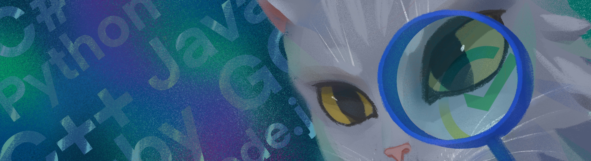

## Career track. Project 05

В данном проекте ты узнаешь, что такое корпоративная культура и как погрузиться в корпоративную культуру организации, а также как безопасно работать с корпоративной информацией.

💡 [Нажми сюда](https://new.oprosso.net/p/4cb31ec3f47a4596bc758ea1861fb624), **чтобы поделиться с нами обратной связью на этот проект**. Это анонимно и поможет нашей команде сделать обучение лучше. Рекомендуем заполнить опрос сразу после выполнения проекта.

## Contents

1.  [Chapter I](https://platform.21-school.ru/project/73035/task#chapter-i)
    
    1.1. [Preamble](https://platform.21-school.ru/project/73035/task#preamble)
2.  [Chapter II](https://platform.21-school.ru/project/73035/task#chapter-ii)
    
    2.1. [General rules](https://platform.21-school.ru/project/73035/task#general-rules)
3.  [Chapter III](https://platform.21-school.ru/project/73035/task#chapter-iii)
    
    3.1. [Корпоративная культура / Корпоративный этикет](https://platform.21-school.ru/project/73035/task#%D0%BA%D0%BE%D1%80%D0%BF%D0%BE%D1%80%D0%B0%D1%82%D0%B8%D0%B2%D0%BD%D0%B0%D1%8F-%D0%BA%D1%83%D0%BB%D1%8C%D1%82%D1%83%D1%80%D0%B0--%D0%BA%D0%BE%D1%80%D0%BF%D0%BE%D1%80%D0%B0%D1%82%D0%B8%D0%B2%D0%BD%D1%8B%D0%B9-%D1%8D%D1%82%D0%B8%D0%BA%D0%B5%D1%82)
    
    3.2. [Культура безопасности](https://platform.21-school.ru/project/73035/task#%D0%BA%D1%83%D0%BB%D1%8C%D1%82%D1%83%D1%80%D0%B0-%D0%B1%D0%B5%D0%B7%D0%BE%D0%BF%D0%B0%D1%81%D0%BD%D0%BE%D1%81%D1%82%D0%B8)
4.  [Chapter IV](https://platform.21-school.ru/project/73035/task#chapter-iv)

## Chapter I

## Preamble

Если твоя цель — не только пройти стажировку, но и зарекомендовать себя для дальнейшей работы в компании, тогда тебе важно погрузиться в корпоративную культуру и узнать, какие правила и порядки действуют в компании. А также за время стажировки «стать своим», т. е. встроиться, что означает не только показать результат, но и играть по правилам компании.

Как узнать эти правила и что они включают, будем разбираться в этом проекте. А также затронем тему информационной кибербезопасности. Ты, как сотрудник компании, будешь иметь доступ к данным, и твоя ответственность — защитить компанию от утечек информации и кибератак.

Для начала обратимся к терминологии:

**Корпоративная культура** — набор норм, традиций и ценностей, которые принимаются членами организации и обеспечивают создание сильной конкурентоспособной команды, объединенной общими целями и мотивациями. А правила, принятые в компании, помогут тебе адаптироваться.

**Информационная безопасность** — это всесторонняя защищённость информации и поддерживающей её инфраструктуры от любых случайных или злонамеренных воздействий, результатом которых может явиться нанесение ущерба самой информации, ее владельцам или поддерживающей инфраструктуре. Задачи информационной безопасности сводятся к минимизации ущерба, а также к прогнозированию и предотвращению таких воздействий.

**Кибербезопасность** — совокупность методов и практик защиты от атак злоумышленников для компьютеров, серверов, мобильных устройств, электронных систем, сетей и данных. Кибербезопасность находит применение в самых разных областях, от бизнес-сферы до мобильных технологий. В этом направлении можно выделить несколько основных категорий.

Литература:

1.  [«Новые правила деловой переписки», М. Ильяхов](https://git.21-school.ru/masters/CT05.ID_888906/-/blob/17/https://git.21-school.ru/masters/CT05.ID_888906/-/blob/17/https://git.21-school.ru/masters/CT05.ID_888906/-/blob/17/materials/%D0%94%D0%B5%D0%BB%D0%BE%D0%B2%D0%B0%D1%8F_%D0%BF%D0%B5%D1%80%D0%B5%D0%BF%D0%B8%D1%81%D0%BA%D0%B0.pdf).
2.  [Большая разница: чем различается корпоративная культура больших корпораций и IT-стартапов](https://www.forbes.ru/karera-i-svoy-biznes/348291-bolshaya-raznica-chem-razlichaetsya-korporativnaya-kultura-bolshih).
3.  [«Правила делового общения. 33 «нельзя» и 33 «можно», Н. Зверева](https://git.21-school.ru/masters/CT05.ID_888906/-/blob/17/https://git.21-school.ru/masters/CT05.ID_888906/-/blob/17/https://git.21-school.ru/masters/CT05.ID_888906/-/blob/17/materials/%D0%9F%D1%80%D0%B0%D0%B2%D0%B8%D0%BB%D0%B0_%D0%B4%D0%B5%D0%BB%D0%BE%D0%B2%D0%BE%D0%B3%D0%BE_%D0%BE%D0%B1%D1%89%D0%B5%D0%BD%D0%B8%D1%8F.pdf).
4.  [«Манеры для карьеры», О. Шевелева](https://git.21-school.ru/masters/CT05.ID_888906/-/blob/17/https://git.21-school.ru/masters/CT05.ID_888906/-/blob/17/https://git.21-school.ru/masters/CT05.ID_888906/-/blob/17/materials/%D0%9C%D0%B0%D0%BD%D0%B5%D1%80%D1%8B_%D0%B4%D0%BB%D1%8F_%D0%BA%D0%B0%D1%80%D1%8C%D0%B5%D1%80%D1%8B.pdf).
5.  [Вторая глава книги Дейла Карнеги «Как завоевать друзей»](https://git.21-school.ru/masters/CT05.ID_888906/-/blob/17/materials/%D0%9A%D0%B0%D0%BA_%D0%B7%D0%B0%D0%B2%D0%BE%D0%B5%D0%B2%D0%B0%D1%82%D1%8C_%D0%B4%D1%80%D1%83%D0%B7%D0%B5%D0%B9.pdf).
6.  [Ответственность за утечку персональных данных](https://rt-solar.ru/products/solar_dozor/blog/2795/).
7.  [Что такое кибербезопасность?](https://www.kaspersky.ru/resource-center/definitions/what-is-cyber-security)
8.  [Что такое кибербезопасность?](https://www.sap.com/central-asia-caucasus/products/financial-management/what-is-cybersecurity.html)
9.  Фильм «Стажер», 2015.

## Chapter II

## Genеral rules

1.  На протяжении всего курса тебя будет сопровождать чувство неопределенности и острого дефицита информации — это нормально. Не забывай, что информация в репозитории и Google всегда с тобой, так же как пиры и Rocket.Chat. Общайся, ищи, опирайся на здравый смысл и не бойся ошибиться.
2.  Будь внимателен к источникам информации: проверяй, думай, анализируй, сравнивай.
3.  Будь внимателен к тексту задания, перечитывай по нескольку раз.
4.  Внимательно читай примеры. В них может быть что-то, что не указано в явном виде в самом задании.
5.  Могут встретиться несоответствия, когда что-то новое в условиях задачи или примере противоречит уже известному. Если встретилось такое — попробуй разобраться. Если не получилось — запиши вопрос в перечень открытых вопросов и найдешь ответ в процессе работы. Не оставляй открытые вопросы неразрешенными.
6.  Если задание кажется непонятным или невыполнимым — так только кажется. Попробуй его декомпозировать. Скорее всего, отдельные части станут понятными.
7.  На пути тебе встретятся разные задания. Бонусные задания подходят для самых дотошных и пытливых. Эти задания с повышенной сложностью и необязательны к выполнению, но если ты их сделаешь, то получишь дополнительный опыт и знания.
8.  Не пытайся обмануть систему и окружающих. Ведь в первую очередь ты обманываешь сам себя.
9.  Есть вопрос? Спроси соседа справа, если это не помогло — обратись к соседу слева.
10.  Когда пользуешься чьей-либо помощью, то всегда разбирайся до конца: почему, как и зачем. Иначе помощь не будет иметь смысла.
11.  Всегда делай push только в ветку develop! Ветка master будет проигнорирована. Работай в директории src.
12.  В твоей директории не должно быть иных файлов, кроме тех, что обозначены в заданиях.

## Chapter III

## Корпоративная культура / Корпоративный этикет

Зачем исследовать корпоративную культуру компании, разбираться в правилах и играть по ним? Разве это не ограничивает твою свободу быть собой?

Соблюдать правила корпоративной культуры — не значит перестать быть собой, а значит, сделать свою работу легче и проще. Это похоже на то, как ты идешь зимой на лыжах по лыжне или перпендикулярно лыжне.

Еще одно определение корпоративной культуры звучит так: Корпоративная культура — это устойчивые образцы поведения, которые сложились в компании и доказали эффективность в разных ситуациях: экстремальных и обыденных. К ней относится всё: ритуалы, гласные и негласные правила, система взаимодействия в офисе, модель управления, коммуникации между людьми. Это как окружающая среда, где существуют все сотрудники и процессы. Она хорошо заметна всем, кто сталкивается с компанией: клиентам, партнерам и кандидатам. Простыми словами, корпоративная культура призвана сделать жизнь сотрудников и достижение ими рабочих целей максимально легким. Часто правила корпоративной культуры напрямую соотносятся с законами элементарной вежливости и этикета.

Прежде чем ты пойдешь дальше, рекомендуем к прочтению три книги:

1.  [М. Ильяхов «Новые правила деловой переписки»](https://git.21-school.ru/masters/CT05.ID_888906/-/blob/17/https://git.21-school.ru/masters/CT05.ID_888906/-/blob/17/https://git.21-school.ru/masters/CT05.ID_888906/-/blob/17/materials/%D0%94%D0%B5%D0%BB%D0%BE%D0%B2%D0%B0%D1%8F_%D0%BF%D0%B5%D1%80%D0%B5%D0%BF%D0%B8%D1%81%D0%BA%D0%B0.pdf).
2.  [Н. Зверева «Правила делового общения. 33 «нельзя» и 33 «можно»](https://git.21-school.ru/masters/CT05.ID_888906/-/blob/17/https://git.21-school.ru/masters/CT05.ID_888906/-/blob/17/https://git.21-school.ru/masters/CT05.ID_888906/-/blob/17/materials/%D0%9F%D1%80%D0%B0%D0%B2%D0%B8%D0%BB%D0%B0_%D0%B4%D0%B5%D0%BB%D0%BE%D0%B2%D0%BE%D0%B3%D0%BE_%D0%BE%D0%B1%D1%89%D0%B5%D0%BD%D0%B8%D1%8F.pdf).
3.  [О. Шевелева «Манеры для карьеры»](https://git.21-school.ru/masters/CT05.ID_888906/-/blob/17/https://git.21-school.ru/masters/CT05.ID_888906/-/blob/17/https://git.21-school.ru/masters/CT05.ID_888906/-/blob/17/materials/%D0%9C%D0%B0%D0%BD%D0%B5%D1%80%D1%8B_%D0%B4%D0%BB%D1%8F_%D0%BA%D0%B0%D1%80%D1%8C%D0%B5%D1%80%D1%8B.pdf).

И давай разберемся, как погружаться и исследовать каждый элемент корпоративной культуры.

Погрузиться в правила корпоративной культуры можно, изучая информацию о компании, а также знакомясь с ее сотрудниками. Можно посмотреть выступления топ-менеджеров компании, они часто упоминают в своих выступлениях, что именно составляет ценности компании и какая в компании корпоративная культура. Можно посмотреть сайт компании: иногда есть отдельный раздел, посвященный корпоративной культуре. И можно поговорить с сотрудниками компании, например, на стадии интервью спросить у твоих интервьюеров, как они чувствуют корпоративную культуру.

Рекомендации: [Большая разница: чем различается корпоративная культура больших корпораций и IT-стартапов](https://www.forbes.ru/karera-i-svoy-biznes/348291-bolshaya-raznica-chem-razlichaetsya-korporativnaya-kultura-bolshih).

### Внешний вид

_Коко Шанель: «У вас не будет второго шанса произвести первое впечатление»._

Что важно во внешнем виде сотрудника?

Обувь, одежда, ухоженная кожа, ногти, волосы.

А еще соответствие внешнего вида той компании, в которой ты оказался.

Посмотри фильм «Стажер» и обрати внимание на то, во что одеты сотрудники фирмы и как одет главный герой.

Внешний вид транслирует о тебе гораздо больше, чем тебе хотелось бы думать. Неопрятный внешний вид может говорить о том, что ты не очень-то ценишь себя и свою работу. Это важно не только для офлайн-встреч, но и для онлайн-встреч. И можно ли тогда тебе доверять? Уважение к себе ты транслируешь в том числе через внешний вид. Если ты уважаешь себя, руководитель и коллеги будут уважать твой труд, и вклад тоже.

### Рабочее время

Время — один из главных ресурсов. Рабочее время, сроки проекта, отпуска и так далее. Все эти понятия являются твоим рабочим инструментом. Рабочее время — это важное существенное условие труда, поэтому уточни на стадии интервью узнать какое рабочее время в компании.

Для начала тебе придется узнать, что принято в компании:

-   Во сколько начало и конец рабочего дня?
-   Часто ли сотрудники перерабатывают и задерживаются? Оплачивается ли переработка и работа в выходные?
-   Как обсуждается время ухода в отпуск, с кем нужно согласовывать сроки?

### Рабочее пространство — туалет/кофе/столовая

На работе мы не только работаем.

У каждого человека есть определенные физиологические потребности. На работе мы также едим, ходим в туалет, кто-то курит. Есть перерывы от работы, и их тоже можно где-то провести: погулять или может есть зона отдыха. Все эти вопросы можно узнать у HR-менеджера, который будет сопровождать твое трудоустройство или все эти вопросы могут быть поводом познакомиться и наладить коммуникацию с коллегами.

Узнай у коллег:

-   где находится туалет;
-   где можно налить кофе, принято ли в компании приносить свой кофе и что-то к кофе, или компания покупает кофе и плюшки;
-   где находится столовая;
-   где находится и есть ли в компании зона отдыха/спортзал.

Твое рабочее место:

-   где будет твое рабочее место;
-   как оформить пропуск;
-   где взять технику;
-   как оформить доступы в системы;
-   как оформить удаленный доступ, если предполагается частично удаленная работа.

Узнай, есть ли в компании открытые зоны, где тоже можно работать, например, в кафе.

## Правила коммуникации

Следующий большой блок посвящен коммуникации. Ты не работаешь один, вы работаете в команде, и очень важно выстроить коммуникацию таким образом, чтобы с тобой хотелось общаться, хотелось тебе помочь. Рекомендации к изучению:

1.  [М. Ильяхов «Новые правила деловой переписки»](https://git.21-school.ru/masters/CT05.ID_888906/-/blob/17/https://git.21-school.ru/masters/CT05.ID_888906/-/blob/17/https://git.21-school.ru/masters/CT05.ID_888906/-/blob/17/materials/%D0%94%D0%B5%D0%BB%D0%BE%D0%B2%D0%B0%D1%8F_%D0%BF%D0%B5%D1%80%D0%B5%D0%BF%D0%B8%D1%81%D0%BA%D0%B0.pdf).
2.  [Н. Зверева «Правила делового общения. 33 «нельзя» и 33 «можно»](https://git.21-school.ru/masters/CT05.ID_888906/-/blob/17/https://git.21-school.ru/masters/CT05.ID_888906/-/blob/17/https://git.21-school.ru/masters/CT05.ID_888906/-/blob/17/materials/%D0%9F%D1%80%D0%B0%D0%B2%D0%B8%D0%BB%D0%B0_%D0%B4%D0%B5%D0%BB%D0%BE%D0%B2%D0%BE%D0%B3%D0%BE_%D0%BE%D0%B1%D1%89%D0%B5%D0%BD%D0%B8%D1%8F.pdf).
3.  [О. Шевелева «Манеры для карьеры»](https://git.21-school.ru/masters/CT05.ID_888906/-/blob/17/https://git.21-school.ru/masters/CT05.ID_888906/-/blob/17/https://git.21-school.ru/masters/CT05.ID_888906/-/blob/17/materials/%D0%9C%D0%B0%D0%BD%D0%B5%D1%80%D1%8B_%D0%B4%D0%BB%D1%8F_%D0%BA%D0%B0%D1%80%D1%8C%D0%B5%D1%80%D1%8B.pdf).

**Устная коммуникация**

С кем бы ты ни общался, сначала тебе нужно будет познакомиться с этим человеком. Не стесняйся переспросить, как зовут коллегу, и задать ему несколько нейтральных вопросов: как давно он в компании, чем он занимается.

Не забудь представиться сам, рассказать, кто ты и над какой задачей планируешь работать. В работе важно здороваться, если ты не виделся с человеком в этот день, и прощаться, если день завершается. Обращайся по имени.

**Корпоративная почта**

Узнай, какими электронными средствами коммуникации пользуются сотрудники, в какой программе почта и календарь.

**Мессенджеры**

Уточни, какими мессенджерами пользуются коллеги, можно ли установить десктопную версию мессенджера на ноутбук или компьютер.

**Календарь — встречи/отпуска** Узнай, в какой программе выставляют встречи. Разберись, как принять или отклонить встречу, как написать ответное сообщение. Разберись, какие встречи проходят офлайн, а какие онлайн.

**Офлайн-встречи**

Разберись, где территориально будет проходить встреча. Заранее уточни у коллег, где именно эта переговорная. На встречу приходи пораньше, опоздание тоже производит впечатление о тебе, как о необязательном человеке.

**Встречи онлайн**

Убедись, что у тебя есть программа для подключения к встрече онлайн, работает ли камера и микрофон. Встречи важно проводить с включенной камерой, особенно в начале твоей работы/стажировки. Это важно, чтобы коллеги с тобой познакомились и запомнили тебя.

**Отпуск/отбивка**

Ты еще не вышел на работу, а мы уже говорим о твоем отпуске. Отпуск — это важная часть работы, и об этом, и правда, стоит подумать заранее. Ты — часть рабочей системы. Ты делаешь свою часть работы. Коллеги рассчитывают на тебя. Поэтому заранее предупреждай о том, что ты планируешь уйти в отпуск, даже если у тебя неоплачиваемая стажировка, а уж тем более работа. Предупреди коллег заранее и поставь автоответ в электронной почте на время отпуска. Если не знаешь, как это делать, погугли или попроси коллег помочь. Не совершай ошибку, когда неверно установленный автоответ приводит к рассылке писем от твоего имени по всей компании.

## Культура безопасности

Безопасность — то, что нельзя нарушать! Потеря любых данных компании или проникновение в корпоративные системы киберугрозы может повлечь за собой вплоть до уголовной ответственности.

Предупрежден — значит вооружен. Мы не говорим о преднамеренной утечке, важно предотвратить случайную утечку.

**Самые простые вещи:** пересылка информации через мессенджер, использование флешки, открытие внешнего сайта с рабочего компьютера — все это может привести к потере данных или открытию канала для кибератаки. Пожалуйста, не теряй бдительность.

Случайная утечка, несмотря на отсутствие целей и подготовленных действий, может нанести ощутимый урон компании. Она способна скомпрометировать репутацию организации, раскрыть коммерческую тайну, предоставить важные сведения конкурентам. Главная опасность заключается в том, что произошедший инцидент обнаруживают спустя какое-то время, что не позволяет провести мероприятия по устранению последствий и минимизации ущерба.

Неумышленная утечка — ситуация, при которой происходит непреднамеренная передача сведений лицу или лицам, не имеющим изначально прав, обладать ими. Возникает чаще всего на фоне выполнения однообразной работы, когда из-за усталости или халатности работника информация попадает или передается третьим лицам по незащищенному каналу связи или с использованием съемных носителей. Во всех подобных случаях отмечается нарушение политик безопасности.

Типичными примерами, иллюстрирующими неумышленную утечку информации, выступают:

-   Введение ошибочного адреса электронной почты, куда отправляется информация.
-   Отправка данных через мессенджер или социальные сети не тому получателю.
-   Использование открытых файлообменников, облачных сервисов, документов открытого доступа для хранения конфиденциальных данных.
-   Оставленный без присмотра включенный компьютер с конфиденциальными данными.
-   Использование сменных носителей информации с последующей их потерей или переносом данных на домашний компьютер.

**Основные каналы случайных утечек:**

1.  Мобильные устройства.
    
    Сегодня большую часть информации о себе человек носит на смартфоне или телефоне. К устройству могут быть привязаны персональные данные: ФИО, фотография, банковская карта. Помимо этого, там могут находиться пароли и логины для авторизации на сайтах, соцсетях, интернет-магазинах, и в том числе файлы, с которыми человек проводит различные действия на работе. Потеря или кража мобильного устройства может дорого обойтись владельцу.
    
2.  Электронная почта, мессенджеры.
    
    Невнимательность, повышенная загруженность работой способны привести к ошибочной отправке документов заведомо неправильному адресату. Также не исключена ситуация перехода по фишинговой ссылке или установки вредоносного кода, которые провоцируют утечки данных.
    
3.  Файлообменные сервисы.
    
    Многие крупные компании используют для удобства работы различные облачные сервисы, которые позволяют получить быстрый доступ к информации и хранить там большие объемы данных. Неправильная настройка прав доступа к файлам, ошибка сервера, передача ссылок по незащищенному каналу способствуют неконтролируемому доступу третьих лиц к этим данным.
    

Полезно изучить:

1.  [Чем угрожает утечка информации?](https://rt-solar.ru/products/solar_dozor/blog/2795/)
2.  [Кибербезопасность](https://www.kaspersky.ru/resource-center/definitions/what-is-cyber-security).
3.  [Что такое кибербезопасность?](https://www.sap.com/central-asia-caucasus/products/financial-management/what-is-cybersecurity.html)

## Chapter IV

## Exercise 00

### До выхода на стажировку/работу

Ты уже выбрал несколько вакансий в Project01, которые отвечают твоим ценностям и приоритетам. Теперь необходимо больше изучить компанию и подготовиться к стажировке.

1.  Изучи 3 источника получения сведений о корпоративной культуре компании и ответь на несколько вопросов:

-   Как одеваются сотрудники? Есть ли дресс-код?
-   Что надеть в первый день, чтобы соответствовать культуре компании?
-   Как ты узнаешь, во сколько приходить на стажировку и во сколько можно уходить?
-   Что еще тебе важно узнать про рабочее место и рабочее время? Напиши 5 пунктов.

1.  Составь список вопросов о корпоративной культуре, на которые ты не нашел ответы и спросишь в первый рабочий день.

## Exercise 01

### Первый день

Отлично, теперь представь, что состоялся твой первый рабочий день в компании. Тебе необходимо составить письмо-визитку, чтобы презентовать себя команде.

1.  Напиши письмо коллегам и представь себя. Продумай структуру письма: кто ты, как тебя зовут и над какой задачей ты будешь работать. Какие факты будут полезны для коллег. В конце здорово добавить фразу «Буду рад быть полезен компании и Вам».
2.  Во многих компаниях просят прикрепить фото. Продумай и прикрепи, какое фото лучше тебя презентует перед командой.