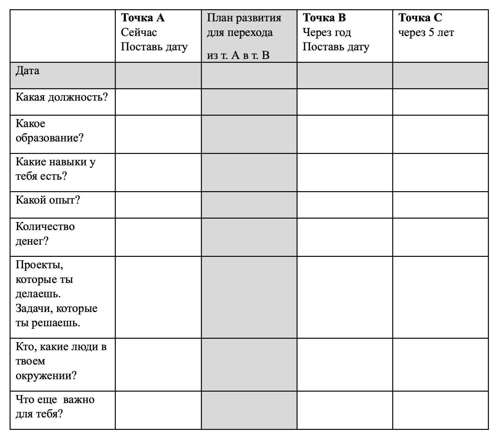

## Career track. Project 07

В этом проекте ты узнаешь, как планировать карьеру после того, как выйдешь на работу, а также выберешь конкретную должность и приступишь к планированию следующих карьерных шагов. В том числе поймешь, чем отличается мышление тех, кто видит возможности, и те, кто видят ограничения, и начнешь развивать два ключевых навыка, необходимых для карьерного роста: видеть возможностями и самопрезентацию.

💡 [Нажми сюда](https://new.oprosso.net/p/4cb31ec3f47a4596bc758ea1861fb624), **чтобы поделиться с нами обратной связью на этот проект**. Это анонимно и поможет нашей команде сделать обучение лучше. Рекомендуем заполнить опрос сразу после выполнения проекта.

## Contents

1.  [Chapter I](https://platform.21-school.ru/project/73037/task#chapter-i)
    
    1.1. [Preamble](https://platform.21-school.ru/project/73037/task#preamble)
2.  [Chapter II](https://platform.21-school.ru/project/73037/task#chapter-ii)
    
    2.1. [General rules](https://platform.21-school.ru/project/73037/task#general-rules)
3.  [Chapter III](https://platform.21-school.ru/project/73037/task#chapter-iii)
    
    3.1. [Как планировать карьеру](https://platform.21-school.ru/project/73037/task#%D0%BA%D0%B0%D0%BA-%D0%BF%D0%BB%D0%B0%D0%BD%D0%B8%D1%80%D0%BE%D0%B2%D0%B0%D1%82%D1%8C-%D0%BA%D0%B0%D1%80%D1%8C%D0%B5%D1%80%D1%83)
    
    3.2. [Когда говорить с руководителем о том, что тебе важен рост](https://platform.21-school.ru/project/73037/task#%D0%BA%D0%BE%D0%B3%D0%B4%D0%B0-%D0%B3%D0%BE%D0%B2%D0%BE%D1%80%D0%B8%D1%82%D1%8C-%D1%81-%D1%80%D1%83%D0%BA%D0%BE%D0%B2%D0%BE%D0%B4%D0%B8%D1%82%D0%B5%D0%BB%D0%B5%D0%BC-%D0%BE-%D1%82%D0%BE%D0%BC-%D1%87%D1%82%D0%BE-%D1%82%D0%B5%D0%B1%D0%B5-%D0%B2%D0%B0%D0%B6%D0%B5%D0%BD-%D1%80%D0%BE%D1%81%D1%82)
    
    3.3. [Ключевые компетенции для карьерного роста](https://platform.21-school.ru/project/73037/task#%D0%BA%D0%BB%D1%8E%D1%87%D0%B5%D0%B2%D1%8B%D0%B5-%D0%BA%D0%BE%D0%BC%D0%BF%D0%B5%D1%82%D0%B5%D0%BD%D1%86%D0%B8%D0%B8-%D0%B4%D0%BB%D1%8F-%D0%BA%D0%B0%D1%80%D1%8C%D0%B5%D1%80%D0%BD%D0%BE%D0%B3%D0%BE-%D1%80%D0%BE%D1%81%D1%82%D0%B0)
4.  [Chapter IV](https://platform.21-school.ru/project/73037/task#chapter-iv)

## Chapter I

## Preamble

Когда мы говорим о планировании карьеры, то сейчас этот вопрос кажется как будто слишком сложным. Как планировать, если мир за окном каждый день меняется? Как планировать карьеру? В этом модуле ты узнаешь, как планировать, даже если мир меняется. Узнаешь, как двигаться в сторону своей цели, что сделать, чтобы увидеть возможности внутри компании, и в какой момент говорить руководителю о желании расти.

Ключевые компетенции для карьерного роста: какие компетенции нужны для карьерного роста? Поймешь, чем отличается мышление человека, который видит возможности или видит ограничения, и как перестроить мышление. Узнаешь, как развивать самые важные компетенции: видение возможностей и самопрезентация.

Литература:

1.  [Сам себе бренд](https://git.21-school.ru/masters/CT8_Career_planning.ID_888916/-/blob/20/materials/%D0%A1%D0%B0%D0%BC_%D1%81%D0%B5%D0%B1%D0%B5_%D0%B1%D1%80%D0%B5%D0%BD%D0%B4.pdf).

## Chapter II

## Genеral rules

1.  На протяжении всего курса тебя будет сопровождать чувство неопределенности и острого дефицита информации — это нормально. Не забывай, что информация в репозитории и Google всегда с тобой, так же как пиры и Rocket.Chat. Общайся, ищи, опирайся на здравый смысл и не бойся ошибиться.
2.  Будь внимателен к источникам информации: проверяй, думай, анализируй, сравнивай.
3.  Будь внимателен к тексту задания, перечитывай по нескольку раз.
4.  Внимательно читай примеры. В них может быть что-то, что не указано в явном виде в самом задании.
5.  Могут встретиться несоответствия, когда что-то новое в условиях задачи или примере противоречит уже известному. Если встретилось такое — попробуй разобраться. Если не получилось — запиши вопрос в перечень открытых вопросов и найдешь ответ в процессе работы. Не оставляй открытые вопросы неразрешенными.
6.  Если задание кажется непонятным или невыполнимым — так только кажется. Попробуй его декомпозировать. Скорее всего, отдельные части станут понятными.
7.  На пути тебе встретятся разные задания. Бонусные задания подходят для самых дотошных и пытливых. Эти задания с повышенной сложностью и необязательны к выполнению, но если ты их сделаешь, то получишь дополнительный опыт и знания.
8.  Не пытайся обмануть систему и окружающих. Ведь в первую очередь ты обманываешь сам себя.
9.  Есть вопрос? Спроси соседа справа, если это не помогло — обратись к соседу слева.
10.  Когда пользуешься чьей-либо помощью, то всегда разбирайся до конца: почему, как и зачем. Иначе помощь не будет иметь смысла.
11.  Всегда делай push только в ветку develop! Ветка master будет проигнорирована. Работай в директории src.
12.  В твоей директории не должно быть иных файлов, кроме тех, что обозначены в заданиях.

## Chapter III

## Как планировать карьеру

Как планировать карьеру, если мир за окном каждый день меняется? Вдруг ты что-то запланируешь и не сможешь реализовать? Или инвестируешь время в развитие, а все равно не достигнешь целей. Стоит ли вообще планировать?

Однозначно, **да**. Наличие цели, к которой ты идешь, многое меняет в твоей жизни:

-   Ты будешь не просто работать, а будешь замечать движение, как ты растешь и как идешь в сторону своей цели.
-   Тебе станет проще принимать решения в ежедневной жизни. Например, если тебе нужно выбрать, в какую задачу погрузиться плотнее, то понимание, куда ты движешься, поможет тебе принимать решения в ежедневной жизни.
-   Те, кто имеет цель, меньше выгорают. Посмотри видео Виктора Франкла, основателя экзистенциальной психологии. Суть которой в том, что наличие смысла влияет на то, что ты готов работать больше и легче воспринимать ситуации, когда что-то идет не так. Меньше выгорания -> выше работоспособность -> легче отношение к сложностям.
-   Когда у тебя есть цель, у тебя меньше прокрастинации и выше мотивация. Если тебе стало лень, ты замечаешь, что нет сил и мотивации, убедись, что у тебя есть цель.

Помнишь, ты планировал в Project 00 свою карьерную цель на 5 лет, которая основывалась на твоих желаниях и планах? После того как ты проработаешь некоторое время, твоя карьерная цель может измениться, и у тебя появится больше условий, которые ты можешь анализировать.

Необходимо изучить более расширенную таблицу «Карьерной цели», к которой ты сможешь возвращаться в течение всей своей карьеры.

1.  Начни с определения точки А, точки здесь и сейчас. Что у тебя прямо сейчас есть в карьере. Честно опиши свою ситуацию прямо сейчас, даже если ты пока чем-то недоволен, напиши как есть.
2.  Точка В — твоя цель через год. Что ты хочешь, чтобы было в точке В.
3.  Точка С — цель через 5 лет (стратегическая цель). До какой должности ты можешь вырасти. Какие направления для тебя доступны в этот момент. Имей в виду, что большинство людей склонны переоценивать свои возможности на коротком промежутке времени, например, неделя-две, и при этом недооценивают свои возможности на долгосрочном горизонте — год/пять лет и 10 лет. И есть еще одно ограничение, о котором стоит помнить: чаще люди боятся больше своей силы, чем своих слабостей, поэтому это нормально, что мечтать о большом страшно.
4.  Как двигаться в сторону цели? Инструменты развития — это все, где ты получаешь новые знания, совершенствуешь навыки или меняешь поведение или мышление. Это может быть обучение, онлайн- и оффлайн-курсы, программы стажировки, менторинг или наставничество.
    -   Какие ресурсы и возможности есть для роста, развития и обучения в твоей компании? — Об этом можно узнать у своего руководителя или представителя HR.
    -   Предлагает ли компания оплачивать внешнее обучение и на каких условиях для сотрудника? — Об этом тоже можно узнать у HR.
    -   Есть ли в компании программа менторинга и наставничества?
    -   Есть ли коучи внешние и внутренние?
    -   И другие возможности, каждая из которых поможет тебе достичь свою цель.
    -   Узнай, какие инструменты развития есть в компании, выбери те, что помогут тебе самым лучшим образом достичь свою цель в точке В и точке С.

## Когда говорить с руководителем о том, что тебе важен рост

В каждой компании есть свои правила роста и развития. Об этих правилах, возможностях и ограничениях можно узнать у HR.

Когда говорить с руководителем о том, что тебе важен рост? Чем раньше, тем лучше. Если ты только заходишь на стажировку и знакомишься с руководителем и сразу говоришь о том, что у тебя есть план расти, то можно тогда и поднимать вопрос, что тебе нужно сделать, чтобы это сделать. На что тебе следует обращать внимание, какой результат — самый важный для твоего руководителя.

Когда ты заходишь с целью: «Ну, как-то надо пройти стажировку» или же с целью: «Я хочу пройти стажировку и расти, чтобы получить доступ к самым интересным задачам», у руководителя, соответственно, складывается совершенно разное впечатление о тебе.

## Ключевые компетенции для карьерного роста

Когда речь идет о карьерном росте, есть две ключевые компетенции, которые помогают расти, помимо того, что нужно хорошо работать и приносить результат. Это две компетенции — видеть возможности и самопрезентация.

**Первая компетенция — это видеть возможности**

Чем отличается мышление человека, который растет, развивается, получает новую должность, от мышления человека, который не получает рост? Мы все живем в условиях определенных ограничений, нам чаще всего не хватает времени, денег, людей в команде, знаний, опыта. Разберем несколько примеров:

_Пример №1_: У руководителя нет возможности дать тебе новую должность. Нет вакансии, нет бюджета. И в этот момент ты можешь уткнуться в это ограничение и ничего не делать. Жаловаться, какие несовершенные процессы в компании.

или

Ты начинаешь смотреть шире. Например, смотришь, куда ты идешь, на свою точку С, и понимаешь, какие навыки и компетенции тебе нужны. Ты начинаешь развиваться и видеть возможности для роста, пока новая должность тебе недоступна. Ты понимаешь, чему еще нужно поучиться. К кому сходить на менторинг или наставничество. Какие навыки развить в работе. С кем еще познакомиться. Какую кросс-функциональную сферу освоить — все это и есть навык «видеть возможности».

Не фокусироваться на ограничениях, а на том, что для тебя остается возможным в конкретной ситуации.

_Пример №2_: Я не могу планировать карьеру, потому что я не знаю, смогу ли получить новую должность в следующем году. И поэтому ничего не буду делать. Зачем я буду стараться, если результат не гарантирован?

или

Я не знаю, смогу ли я получить должность в следующем году, но я точно могу еще раз поставить цель с руководителем, определить ключевые компетенции, которые мне нужно развить. И даже если я не получу должность, я стану лучшим профессионалом, более уверенным в себе, и для меня откроется еще больше возможностей.

Это и есть мышление возможностей.

**Вторая компетенция — это презентация твоих результатов**

Это умение замечать и говорить о ежедневных результатах. Если никто, кроме тебя, не знает, как хорошо ты работаешь, что является твоими результатами, и что ты растешь и выполняешь более сложные задачи, что тебе приходится преодолевать и как ты справляешься со своими задачами, то никто об этом и не будет догадываться. Ты можешь рассказывать о результатах на командных митингах или на регулярных встречах с руководителем.

Время, когда для карьерного роста было достаточно просто хорошо работать, безвозвратно ушло. Если ты хочешь расти, важно уметь видеть результат своего труда и рассказывать о нем.

## Chapter IV

## Exercise 00

### Презентуй свои результаты

Тебе необходимо составить и презентовать не менее пяти своих достижений в течение обучения в «Школе 21».

## Exercise 01

### Построй свой план развития

Заполни расширенную таблицу «Карьерные цели», учитывая все материалы, которые ты изучил в течение курса.