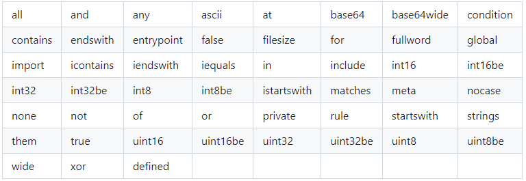

# Принципы работы защитных решений. Аномалия

Аннотация: в этом проекте ты глубже погрузишься в принципы работы защитных решений, узнаешь, что такое сигнатура и какие они бывают, научишься выделять вредоносные пакеты из трафика и вредоносное ПО из файлов, а также напишешь скрипт, который может определить человека по скорости печатания на клавиатуре.

## Содержание

1. [Chapter I](#chapter-i) \
   1.1. [Рекомендации к проекту](#%D1%80%D0%B5%D0%BA%D0%BE%D0%BC%D0%B5%D0%BD%D0%B4%D0%B0%D1%86%D0%B8%D0%B8-%D0%BA-%D0%BF%D1%80%D0%BE%D0%B5%D0%BA%D1%82%D1%83)
2. [Chapter II](#chapter-ii) \
   2.1. [Принципы работы защитных решений](#%D0%BF%D1%80%D0%B8%D0%BD%D1%86%D0%B8%D0%BF%D1%8B-%D1%80%D0%B0%D0%B1%D0%BE%D1%82%D1%8B-%D0%B7%D0%B0%D1%89%D0%B8%D1%82%D0%BD%D1%8B%D1%85-%D1%80%D0%B5%D1%88%D0%B5%D0%BD%D0%B8%D0%B9)
3. [Chapter III](#chapter-iii) \
   3.1. [Задание 1. Технологии, используемые для детектирования вредоносных файлов](#%D0%B7%D0%B0%D0%B4%D0%B0%D0%BD%D0%B8%D0%B5-1-%D1%82%D0%B5%D1%85%D0%BD%D0%BE%D0%BB%D0%BE%D0%B3%D0%B8%D0%B8-%D0%B8%D1%81%D0%BF%D0%BE%D0%BB%D1%8C%D0%B7%D1%83%D0%B5%D0%BC%D1%8B%D0%B5-%D0%B4%D0%BB%D1%8F-%D0%B4%D0%B5%D1%82%D0%B5%D0%BA%D1%82%D0%B8%D1%80%D0%BE%D0%B2%D0%B0%D0%BD%D0%B8%D1%8F-%D0%B2%D1%80%D0%B5%D0%B4%D0%BE%D0%BD%D0%BE%D1%81%D0%BD%D1%8B%D1%85-%D1%84%D0%B0%D0%B9%D0%BB%D0%BE%D0%B2) \
   3.2. [Задание 2. Детектирование вредоносного сетевого трафика](#%D0%B7%D0%B0%D0%B4%D0%B0%D0%BD%D0%B8%D0%B5-2-%D0%B4%D0%B5%D1%82%D0%B5%D0%BA%D1%82%D0%B8%D1%80%D0%BE%D0%B2%D0%B0%D0%BD%D0%B8%D0%B5-%D0%B2%D1%80%D0%B5%D0%B4%D0%BE%D0%BD%D0%BE%D1%81%D0%BD%D0%BE%D0%B3%D0%BE-%D1%81%D0%B5%D1%82%D0%B5%D0%B2%D0%BE%D0%B3%D0%BE-%D1%82%D1%80%D0%B0%D1%84%D0%B8%D0%BA%D0%B0) \
   3.3. [Задание 3. Поведенческий анализ для выявления аномалий](#%D0%B7%D0%B0%D0%B4%D0%B0%D0%BD%D0%B8%D0%B5-3-%D0%BF%D0%BE%D0%B2%D0%B5%D0%B4%D0%B5%D0%BD%D1%87%D0%B5%D1%81%D0%BA%D0%B8%D0%B9-%D0%B0%D0%BD%D0%B0%D0%BB%D0%B8%D0%B7-%D0%B4%D0%BB%D1%8F-%D0%B2%D1%8B%D1%8F%D0%B2%D0%BB%D0%B5%D0%BD%D0%B8%D1%8F-%D0%B0%D0%BD%D0%BE%D0%BC%D0%B0%D0%BB%D0%B8%D0%B9)

### Введение

> Мегаполис — это всегда каменные джунгли с огромным количеством обитателей. В наше время среди обитателей нередко оказываются роботы, коты, машины с автопилотом и, конечно же, камеры видеонаблюдения. Последние, в свою очередь, выполняют очень важную работу — отслеживают нарушителей закона, причем не только со стороны людей, но и со стороны машин и роботов.
>
> Как раз под одной из таких камер пробегает каждое утро робот Салли. Он обычный робот-доставщик, но, к сожалению, его сделали не на официальном заводе, а значит, в мегаполисе ему работать было нельзя. Однако Салли очень не хотел отправиться на металлолом или, еще хуже, работать роботом-доставщиком в деревне, где нет асфальта, красивых небоскребов и просторных улиц. Поэтому ему пришлось перебить свои серийные номера, поменять колеса и надеяться, что никто не будет проверять его происхождение через прошивку, в которую внести изменения он не мог.

## Chapter I

### Рекомендации к проекту

Как учиться в «Школе 21»:

- На протяжении всего курса ты будешь самостоятельно добывать информацию. Пользуйся всеми доступными средствами поиска информации, к примеру, Google и GigaChat. Будь внимателен к источникам информации: проверяй, думай, анализируй, сравнивай.
- Взаимообучение (P2P, Peer-to-Peer) — это процесс, при котором учащиеся обмениваются знаниями и опытом, выступая одновременно в роли учителей и учеников. Этот подход позволяет учиться не только у преподавателя, но и друг у друга, что способствует более глубокому пониманию материала.
- Не стесняйся просить помощи: вокруг тебя такие же пиры, которые тоже проходят этот путь впервые. Не бойся откликаться на просьбы о помощи. Твой опыт ценен и полезен, смело делись им с другими участниками.
- Не списывай, а если пользуешься помощью — всегда разбирайся до конца, почему, как и зачем. Иначе твое обучение не будет иметь никакого смысла.
- Если ты на чем-то застрял и кажется, что все уже перепробовал, но по-прежнему непонятно, куда идти, — просто передохни! Поверь, этот совет помогал многим экспертам по КБ в их работе. Проветрись, перезагрузи голову, и, возможно, в следующий раз тебе наконец придет нужное решение!
- Важен не только результат обучения, но и сам процесс. Нужно не просто решить задачу, а понять, КАК ее решить.
- На пути к мастерству в сфере кибербезопасности ты имеешь возможность стать частью поддерживающего и вдохновляющего сообщества «Школы 21» по Кибербезопасности. Присоединяйся в [Rocket.Chat](https://rocketchat-student.21-school.ru/channel/cybersec_21), чтобы получать свежие анонсы от сообщества, а также вступай в [Telegram] (<https://t.me/+r5wufz8L3mUzOGUy>) для коммуникации.

Как работать с проектом:

- Перед выполнением проект необходимо склонировать с GitLab в одноименный репозиторий.
- Все файлы с кодом необходимо создавать в папке src склонированного репозитория.
- После клонирования проекта необходимо создать ветку `develop` и вести разработку в ней. После этого пушить в GitLab также нужно ветку `develop`.
- В твоей директории не должно быть иных файлов, кроме тех, что обозначены в заданиях.

Дисклеймер:

- В целях геймификации обучения проект подается в формате истории, чтобы у тебя была возможность отвлечься от сложных заданий и тонны теории в гугле. Если придуманная история кажется тебе бесталанной и скучной, можно указать на это в обратной связи, чтобы автор поплакал над своим писательским навыком. Также можно пропускать введение в каждом задании и фокусироваться только на содержательной части.

## Chapter II

### Принципы работы защитных решений

В одном из прошлых проектов мы упоминали, что существует в основном два способа определения того, является ли файл вредоносным: сигнатуры и эвристика (поведенческий анализ).

Среди них наиболее распространенным способом является обнаружение на основе сигнатур, т. е. на основе хеша файла. Его проверяют по базе данных сигнатур и определяют, не был ли этот файл ранее обнаружен как вредоносное ПО. Такая сигнатура бесполезна для обнаружения неизвестного вредоносного ПО, и чтобы обойти эту систему, достаточно просто изменить хоть один бит в коде.

Чтобы попытаться пресечь методы уклонения, обычно используют эвристический метод. Этот метод опирается на поведение исполняемого файла и по действиям, которые он выполняет внутри системы, решает, является ли такой файл вредоносным. Основная проблема этого метода заключается в том, что он порождает большое количество ложных срабатываний (false positive или ФП на сленге). Это происходит из-за того, что легальное ПО зачастую выполняет действия, схожие с вредоносной активностью: обращение к реестру в Windows, запуск других процессов и т. д.

И последнее, но не менее важное: существует еще один метод (по сути, подвид сигнатурного метода). Этот метод основан на другом виде сигнатур, отличном от вышеупомянутого. Вместо поиска хешей он использует текстовые или двоичные строки, которые однозначно идентифицируют образец вредоносного ПО. Таким образом, даже если файл был подделан, если он все еще содержит эти строковые или бинарные отличительные последовательности, можно обнаружить и классифицировать образец вредоносного ПО.

Для реализации сигнатурного метода используются правила детектирования. Одним из языков написания этих правил является YARA.

YARA — это инструмент, разработанный Виктором Мануэлем Альваресом в основном для обнаружения и классификации вредоносных программ на основе строковых сигнатур.

Используя относительно простые правила, YARA просматривает полученные файлы и ищет строки, прописанные в правиле, и, если они соответствуют необходимым условиям, определяет правило, которое «срабатывает» на тот или иной файл. Это также применимо и к запущенным процессам.

## Chapter III

### Задание 1. Технологии, используемые для детектирования вредоносных файлов

Для решения данного задания нужны знания в следующих темах: YARA, сигнатуры, шестнадцатеричный формат данных.

> До поры до времени Салли успешно проезжал под камерами, проскакивал между другими роботами, доставлял людям их товары и зарабатывал себе на жизнь. Но технологический прогресс в городе не стоял на месте, и начали появляться камеры, которые были способны по серийному номеру удаленно подключиться к устройству и считать его данные с прошивки. Сначала их поставили только в центре, поэтому Салли просто сменил свои привычные маршруты, но со временем эти камеры стали расползаться по мегаполису, словно чума.

YARA призван помочь исследователям вредоносного ПО идентифицировать и классифицировать образцы вредоносного ПО. С помощью YARA ты можешь создавать описания семейств вредоносных программ на основе текстовых или двоичных шаблонов. Каждое правило состоит из набора строк и логического выражения, которые определяют его логику. Давай рассмотрим пример:

```
rule silent_banker : banker
{
    meta:
        description = "This is just an example"
        threat_level = 3
        in_the_wild = true

    strings:
        $a = {6A 40 68 00 30 00 00 6A 14 8D 91}
        $b = {8D 4D B0 2B C1 83 C0 27 99 6A 4E 59 F7 F9}
        $c = "UVODFRYSIHLNWPEJXQZAKCBGMT"

    condition:
        $a or $b or $c
}
```

В правиле выше написано, что любой файл, содержащий одну из трех строк, должен быть указан как *silent\_banker*. Это всего лишь простой пример, более детальные и сложные правила могут быть созданы с использованием подстановочных знаков, регулярных выражений, спецсимволов и т. д., все возможности по созданию правил можно найти в [документации YARA](https://yara.readthedocs.org/).

Правила YARA довольно легко писать. Они имеют структуру, похожую на язык C. Ниже приведены ключевые слова, используемые при создании правил Yara:



Правила обычно состоят из двух вещей: определения строк и условия. Сегмент определения строк можно исключить, если правило не зависит ни от какой строки, однако сегмент условий требуется обязательно. Каждая строка имеет идентификатор, состоящий из символа `$`, за которым следует набор буквенно-цифровых символов и символов подчеркивания. Эти идентификаторы можно использовать в сегменте условий для ссылки на сравниваемую строку. Строки можно охарактеризовать по содержимому или по шестнадцатеричной структуре, как показано в прилагаемом правиле:

```
rule Example_Rule
{
    strings:
        $my_text_string = "text"
        $my_hex_string = { E2 34 A1 C8 23 FB }

    condition:
        $my_text_string or $my_hex_string
}
```

Каждое правило должно начинаться со строки «rule ...», где вместо многоточия — название правила (без пробелов).

#### Комментарии

В правила могут включаться в комментарии, аналогичные комментариям в C. В правилах Yara можно использовать однострочные и многострочные комментарии.

```
/*
    This is a multi-line comment.
*/
rule Example   // this is a single-line comment
{
    condition:
       True
}
```

#### Условия

Условия — это не что иное, как логические выражения, которые можно найти во всех языках программирования, например, оператор *if*. Они могут содержать типичные логические операторы `and`, `or` и `not`, а также условные операторы `>=`, `<=`, `<`, `>`, `==` и `!=`. Кроме того, арифметические операторы (`+`, `-`, `*`, `\`, `%`) и побитовые операторы (`&`, `|`, `<<`, `>>`, `~`, `^`) могут использоваться в выражениях.

```
rule condition_Example
{
    strings:
        $a = "text1"
        $b = "text2"
        $c = "text3"
        $d = "text4"

    condition:
        ($a or $b) and ($c or $d)
}
```

**Твое задание:**

Напиши YARA-правила для детектирования предоставленных файлов (file1.bin, file2.bin, file3.bin). Твои правила должны однозначно идентифицировать их, без False Positive результатов (т. е. одним правилом должен детектироваться строго один файл).

Дополнительные условия:

1. Во всех правилах должны присутствовать минимум 2 условия: наличие уникальной hex-строки и наличие обычной строки.
2. Одно из правил должно также включать условие по размеру файла.

В гит загрузи три правила с названиями, содержащими названия файлов, для которых эти правила сделаны. Например, `file1_rule.yar`, `file2_rule.yar`, `file3_rule.yar`.

### Задание 2. Детектирование вредоносного сетевого трафика

Для решения данного задания нужны знания в следующих темах: Suricata, YAML, Wireshark, модель OSI, сигнатуры.

> Данные о расположении новых камер Салли узнавал из интернета, поэтому каждое утро проверял сайт гостранспорта, чтобы понимать, куда можно возить заказы, а куда категорически нельзя. Вряд ли можно сказать, что у роботов есть интуиция, но именно она подсказывала Салли, что сегодня лучше не выходить на смену. Он не прислушался.
>
> Стоя на пешеходном переходе, Салли заметил роботов-полицейских, которые спешно приближались к нему. Такое уже случалось раньше, и обычно они просто проезжали мимо по своим делам, так что робот-доставщик перестал придавать таким вещам значение и по привычке подумал, что сейчас они проедут дальше, а он поедет выполнять заказ. Но не в этот раз.
>
> Роботы-полицейские окружили Салли, и у одного из них открылся маленький динамик с заранее записанными звуковыми сигналами. Для человека они звучат как набор высокочастотных звуков, но Салли сразу понял: он арестован. Его засекла одна из новейших камер, местоположение которой не опубликовали на сайте. Среди остальных машин и роботов-доставщиков его вычислили по перебитому серийному номеру, не смогли подключиться удаленно и выслали патруль для проверки.

Вредоносный трафик или вредоносный сетевой трафик — это любая подозрительная ссылка, файл или соединение, создаваемое или получаемое по сети. Вредоносный трафик — это угроза, которая создает инцидент, способный повлиять на безопасность организации.

Самый опасный и распространенный тип вредоносного трафика — это форма HTTP-трафика от небраузерных приложений, которые хотят подключиться к известным недоверенным URL-адресам, таким как серверы управления и контроля (C&C). Этот трафик является ранним индикатором наличия вредоносного ПО на устройстве в организации, которое пытается подключиться к удаленным серверам и нанести ущерб. Содержимое трафика может включать доставку дополнительного вредоносного ПО, дальнейшие инструкции/обновления для вторжения, связь с ботнетом, инструкции по загрузке/скачиванию дополнительных файлов или удалению конфиденциальных данных.

Технология обнаружения вредоносного трафика заключается в постоянном отслеживании трафика на предмет возможных признаков создания или получения подозрительных ссылок, файлов или соединений. Чтобы идентифицировать вредоносный трафик, расширенные возможности его обнаружения могут проверить, является ли подозрительная ссылка формой вредоносного трафика, исходящего с недоверенных URL-адресов или сайтов C&C.

#### Suricata

Suricata — это основанный на правилах движок IDS/IPS, который использует разработанные наборы правил для мониторинга сетевого трафика и создания алертов при возникновении подозрительных событий. Разработанный для совместимости с существующими компонентами сетевой безопасности, Suricata обладает унифицированными функциями вывода и подключаемыми библиотеками для связи с другими приложениями.

Правила играют очень важную роль в Suricata. В большинстве случаев люди используют существующие наборы правил.

Официальный способ установки наборов правил описан в
`../rule-management/suricata-update`.

Правило состоит из:

- **действия**, определяющего, что произойдет, когда сигнатура обнаружена;
- **заголовка**, определяющего протокол, IP-адреса, порты и назначение (input, output);
- **параметров правила**, определяющих особенности правила.

С полной документацией по написанию правил можно ознакомиться [здесь](https://docs.suricata.io/en/latest/rules/index.html).

**Твое задание**:

Проанализируй сгенерированный дамп трафика и найди в нем 4 потенциально вредоносных пакета. Напиши правила Suricata для детектирования данных пакетов. Проверь, что Suricata выдает алерты на каждое из правил на этом дампе трафика с помощью команды: `suricata -r maliсious_traffic.pcap -l .` в файле fast.log.

В итоге на гит залей файл `peer.rules` с правилами.

### Задание 3. Поведенческий анализ для выявления аномалий

Для решения данного задания нужны знания в следующих темах: Python, поведенческий анализ.

> На допросе Салли старался не доводить до проверки прошивки и со всем соглашаться. Он рассказал душещипательную историю о том, что его переехал автомобиль во время одного из заказов, поэтому пришлось заменить большую часть деталей. И полицейский почти поверил в эту версию, но кое-что не сходилось. Салли должен был заново встать на учет и обновить записи о своих серийных номерах. Кроме того, его маршрут подозрительно зеркально отражал появление на улицах новейших камер.
>
> Было решено подключиться к Салли напрямую и проверить его настоящий серийный номер вместе с происхождением. Робот-доставщик понял, что это конец. Он старался отпираться, но полиция была непреклонна и угрожала утилизацией, поэтому ему пришлось открыть порт для подключения.
>
> — Вы себя очень странно ведете для заводского робота, Салли, — подытожил робот-полицейский после осмотра.
>
> — Не понял, товарищ полицейский, — отправил сигнал Салли.
>
> — Вы свободны, RDR5, можете возвращаться к работе. Только зарегистрируйте свои новые серийные номера после аварии.
>
> Салли не поверил своему усилителю — неужели они не заметили? Не может быть! Он спешно подключился сам к себе и проверил свою прошивку — она была изменена! Серийный номер изменился. В корневой директории файловой системы лежал файл `delete_me.dat`. Любопытство взяло верх, и Салли открыл его. Надпись в нем гласила: «Не все аномалии являются вредоносными. Некоторые из них просто оказались не в том месте и не в то время». Лишних вопросов Салли задавать не стал и радостно поехал регистрировать свой новый серийный номер, чтобы наконец-то беспрепятственно возить товары по всему городу.

Поведенческий анализ для выявления аномалий — один из основных способов остановить «обход» сигнатурного анализа, поскольку в таком случае вредоносному ПО для обхода поведенческого анализа придется не выполнять зловредные действия, а это противоречит сути ВПО.

Почему же тогда рынок вредоносного ПО не обрушился, а хакеры не ушли на пенсию? Дело в том, что поведенческий анализ заключается не только в мониторинге действий пользователей. Он мониторит поведение процессов, приложений, сетевых пакетов и т. д. Соответственно, во всем этом многообразии всегда находятся исключения, которые будут распознаны как ВПО, при этом являясь легальным ПО. Например, если настроить NGFW на мониторинг сканирования сети, то запущенный сканер уязвимостей будет принят за вредоносное действие, а не за проверку безопасности. Либо запущенный админом под sudo скрипт. Такие вещи случаются постоянно, поэтому самая большая проблема с поведенческим анализом — это вопрос «как точно определить, что это аномалия и вредоносное воздействие?».

На этот вопрос постепенно отвечают, причем в разных направлениях и не без поддержки Big Data и ИИ. Стандартной последовательностью в поведенческом анализе является:

1. Нормализация и стандартизация данных (если мы собираемся сравнивать сетевые пакеты, мы должны делать это на конкретном уровне модели OSI, сравнивать конкретные байты в пакетах, иметь четкие ограничения и т. д.).
2. Определение нормальных значений (через статистику, машинное обучение, заранее вычисленные статичные показатели).
3. Выявление отклонений от нормы.

Все это применимо к нескольким основным типам эвристического анализа:

- аномалии пользователей (к ним применяется метод под названием UEBA — User and Entity Behavior Analytics);
- аномалии системы (все, что касается использования CPU, RAM, нагрузки на сеть);
- аномалии сети (использование нестандартных протоколов / запросов / адресов назначения).

Все эти типы эвристического анализа встречаются в различных продуктах, в том числе в антивирусах или ngfw. Причем эти типы могут комбинироваться в одном продукте. Но по большому счету никакого rocket science в самой технологии нет — лишь огромное количество данных, которые собираются, обрабатываются, нормализуются, постоянно дополняются, а затем выступают метрикой ко всем последующим входящим данным.

**Твое задание**:

Реализуй скрипт на Python, который осуществляет простой поведенческий анализ ввода с клавиатуры. Используй библиотеки pynput и statistics.

Скрипт должен запросить ввод любой строки от пользователя, посчитать временные промежутки между нажатиями клавиатуры, затем запросить второй раз ввести ту же строку и также посчитать промежутки между нажатиями. Если среднее отклонение времени нажатий составляет больше **0.1**, то он должен выводить: «Обнаружены отклонения в поведении. Возможно, вводил другой человек», иначе: «Ввод соответствует исходному пользователю».

Получившийся скрипт `UBA.py` залей на гит.

---

💡 Нажми [сюда](https://new.oprosso.net/p/4cb31ec3f47a4596bc758ea1861fb624), чтобы поделиться с нами обратной связью на этот проект. Это анонимно и поможет команде Продукта сделать твое обучение лучше.