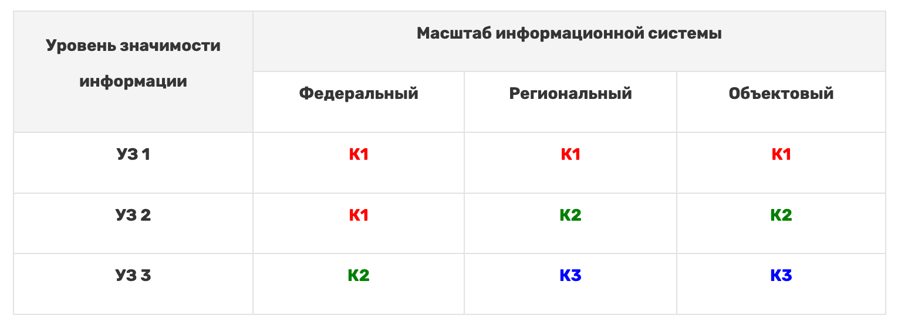
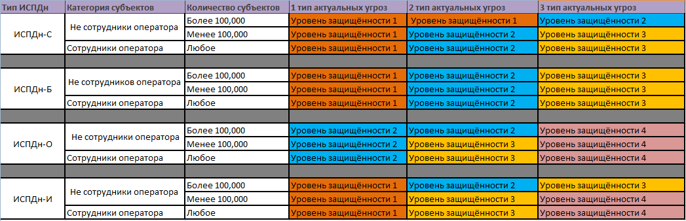

# Законодательство в области ИБ. Бумажная работа

Аннотация: в данном проекте ты поймешь, зачем нужны нормативные акты в информационной безопасности и какую пользу они несут с практической точки зрения, познакомишься и поработаешь с ФЗ 152, 187, 149, приказами ФСТЭК 17 и 21, а также с некоторыми другими важными документами.

## Содержание

1. [Chapter I](#chapter-i) \
   1.1. [Рекомендации к проекту](#%D1%80%D0%B5%D0%BA%D0%BE%D0%BC%D0%B5%D0%BD%D0%B4%D0%B0%D1%86%D0%B8%D0%B8-%D0%BA-%D0%BF%D1%80%D0%BE%D0%B5%D0%BA%D1%82%D1%83)
2. [Chapter II](#chapter-ii) \
   2.1. [Законодательство в области ИБ](#%D0%B7%D0%B0%D0%BA%D0%BE%D0%BD%D0%BE%D0%B4%D0%B0%D1%82%D0%B5%D0%BB%D1%8C%D1%81%D1%82%D0%B2%D0%BE-%D0%B2-%D0%BE%D0%B1%D0%BB%D0%B0%D1%81%D1%82%D0%B8-%D0%B8%D0%B1)
3. [Chapter III](#chapter-iii) \
   3.1. [Задание 1. Нормативные акты](#%D0%B7%D0%B0%D0%B4%D0%B0%D0%BD%D0%B8%D0%B5-1-%D0%BD%D0%BE%D1%80%D0%BC%D0%B0%D1%82%D0%B8%D0%B2%D0%BD%D1%8B%D0%B5-%D0%B0%D0%BA%D1%82%D1%8B) \
   3.2. [Задание 2. Российское и международное законодательство](#%D0%B7%D0%B0%D0%B4%D0%B0%D0%BD%D0%B8%D0%B5-2-%D1%80%D0%BE%D1%81%D1%81%D0%B8%D0%B9%D1%81%D0%BA%D0%BE%D0%B5-%D0%B8-%D0%BC%D0%B5%D0%B6%D0%B4%D1%83%D0%BD%D0%B0%D1%80%D0%BE%D0%B4%D0%BD%D0%BE%D0%B5-%D0%B7%D0%B0%D0%BA%D0%BE%D0%BD%D0%BE%D0%B4%D0%B0%D1%82%D0%B5%D0%BB%D1%8C%D1%81%D1%82%D0%B2%D0%BE) \
   3.3. [Задание 3. Категории и уровни защищенности](#%D0%B7%D0%B0%D0%B4%D0%B0%D0%BD%D0%B8%D0%B5-3-%D0%BA%D0%B0%D1%82%D0%B5%D0%B3%D0%BE%D1%80%D0%B8%D0%B8-%D0%B8-%D1%83%D1%80%D0%BE%D0%B2%D0%BD%D0%B8-%D0%B7%D0%B0%D1%89%D0%B8%D1%89%D0%B5%D0%BD%D0%BD%D0%BE%D1%81%D1%82%D0%B8)

### Введение

> Екатерина работает в местной библиотеке, как она говорит, «смотрительницей за книгами». Когда-то давно она любила читать, но теперь, когда судьба завела ее в колыбель литературы, она только и делает, что описывает инвентарь и перекладывает новые издания вместо старых.
>
> Более того, Екатерина возненавидела любую бюрократию. Лишь одна мысль о новом правиле вызывала у нее гнев, слезы или апатию, а иногда все сразу. И, как полагается, она давно нашла объяснение своей позиции, которое звучало так: «Не понимаю, зачем писать все эти бумажки. Я бы описывала на 100 книг в день больше, если бы не занималась заполнением всех этих табелей, бланков и документов».

## Chapter I

### Рекомендации к проекту

Как учиться в «Школе 21»:

- На протяжении всего курса ты будешь самостоятельно добывать информацию. Пользуйся всеми доступными средствами поиска информации, к примеру, Google и GigaChat. Будь внимателен к источникам информации: проверяй, думай, анализируй, сравнивай.
- Взаимообучение (P2P, Peer-to-Peer) — это процесс, при котором учащиеся обмениваются знаниями и опытом, выступая одновременно в роли учителей и учеников. Этот подход позволяет учиться не только у преподавателя, но и друг у друга, что способствует более глубокому пониманию материала.
- Не стесняйся просить помощи: вокруг тебя такие же пиры, которые тоже проходят этот путь впервые. Не бойся откликаться на просьбы о помощи. Твой опыт ценен и полезен, смело делись им с другими участниками.
- Не списывай, а если пользуешься помощью — всегда разбирайся до конца, почему, как и зачем. Иначе твое обучение не будет иметь никакого смысла.
- Если ты на чем-то застрял и кажется, что все уже перепробовал, но по-прежнему непонятно, куда идти, — просто передохни! Поверь, этот совет помогал многим экспертам по КБ в их работе. Проветрись, перезагрузи голову, и, возможно, в следующий раз тебе наконец придет нужное решение!
- Важен не только результат обучения, но и сам процесс. Нужно не просто решить задачу, а понять, КАК ее решить.
- На пути к мастерству в сфере кибербезопасности ты получишь возможность стать частью поддерживающего и вдохновляющего сообщества «Школы 21» по Кибербезопасности. Присоединяйся в [RocketChat](https://rocketchat-student.21-school.ru/channel/cybersec_21), чтобы получать свежие анонсы от сообщества, а также вступай в [Telegram](https://t.me/+r5wufz8L3mUzOGUy) для коммуникации.

Как работать с проектом:

- Перед выполнением проект необходимо склонировать с GitLab в одноименный репозиторий.
- Все файлы с кодом необходимо создавать в папке `src` склонированного репозитория.
- После клонирования проекта необходимо создать ветку `develop` и вести разработку в ней. После этого пушить в GitLab также нужно ветку `develop`.
- В твоей директории не должно быть иных файлов, кроме тех, что обозначены в заданиях.

Дисклеймер:

- В целях геймификации обучения проект подается в формате истории, чтобы у тебя была возможность отвлечься от сложных заданий и тонны теории в гугле. Если придуманная история кажется тебе бесталанной и скучной, можно указать на это в обратной связи, чтобы автор поплакал над своим писательским навыком. Также можно пропускать введение в каждом задании и фокусироваться только на содержательной части.

## Chapter II

### Законодательство в области ИБ

Законодательство — один из важнейших компонентов всей информационной безопасности. Дело в том, что регуляция такой важной отрасли, как ИБ, лежит в сфере интересов государства и множества его структур. Это, в свою очередь, порождает целую цепочку взаимосвязанных интересов: начиная от управляющего органа и заканчивая заказчиком услуг аудита.

Важно понимать, что «бумажная безопасность» непосредственно влияет на «практическую безопасность» и формирует целый спектр услуг. Государство, безусловно, хочет, чтобы в компаниях (да и в самих структурах государства) не было бардака, когда каждый день федеральные сайты взламывают, из госкорпораций утекают данные налогоплательщиков, а заводы простаивают из-за хакерских атак. Интерес государства здесь понятен. Единственный эффективный способ избежать таких сценариев — заставить всех остальных вкладывать деньги в обеспечение ИБ, наем соответствующих сотрудников и проведение периодических пентестов/аудитов.

Как «заставить» компании исполнять требования к обеспечению ИБ? Издавать нормативные акты, которые могут обязывать, рекомендовать или требовать принимать те или иные меры. Итак, основные виды правовых актов:

- указы Президента;
- постановления;
- федеральные законы;
- приказы;
- рекомендации;
- сообщения;
- стандарты.

Основные инстанции, которые занимаются обновлением и изданием новых правовых актов:

- ФСТЭК;
- ФСБ;
- правительство;
- Роскомнадзор;
- Банк России.

Теперь, когда ты прошел курс молодого юриста, можем переходить к роли обычного эксперта ИБ во всем этом многообразии законов и указов.

Вследствие вышеописанной логики «интересов», к сожалению, возникла ситуация, при которой эти самые интересы могут быть у всех разные. Для многих компаний следование нормативам — чистые убытки, поскольку информационная безопасность сама по себе не создает прибавочной стоимости (если речь не идет про компании, которые продают ИБ-услуги/продукты), но при этом штраф за неисполнение законов/приказов/требований никто платить не хочет, да и ущерб от успешной хакерской атаки может быть огромным.

Инженер по ИБ при этом должен балансировать между непосредственным требованием нормативного акта, желанием заказчика (которым может быть его собственная компания) не раздувать бюджет и здравым смыслом. Причем не только при разработке политики безопасности организации, но и при выборе технических средств, которые будут использованы для организации защиты.

Ознакомиться с законодательной базой можно на профильных сайтах:

- <https://fstec.ru/dokumenty/akty>
- <http://www.fsb.ru/fsb/science/single.htm%21id%3D10437725%40fsbResearchart.html>
- <http://government.ru/docs/all/109306/>
- <https://54.rkn.gov.ru/protection/acts/>
- <http://static.kremlin.ru/media/acts/files/0001201707260023.pdf>

Кроме того, вот еще [общий сборник](https://www.consultant.ru/document/cons_doc_LAW_396371/12c292646be1c89e2bfd4d1714b0fd5cf35f30b3/).

## Chapter III

### Задание 1. Российское законодательство

Для решения данного задания нужны знания в следующих темах: федеральные законы 187, 149, 152, приказы ФСТЭК 17 и 21.

> Однажды Катя наткнулась на старинную книгу, которая завалялась на самой нижней полке. Судя по переплету, это была еще советская книга под названием «Правила хорошего библиотекаря». Екатерина заинтересовалась мудростью древних и решила взять ее на изучение. В книге были представлены 12 законов, которые обязательно должны соблюдаться библиотекарем для эффективной работы. Один из них гласил: «Чтобы быстрее описывать книги и вносить их в опись, можно использовать стандартный книжный номер, в котором каждое число обозначает страну, код издательства, код книги и контрольную цифру».
>
> «Как я раньше до этого не додумалась?» — подумала Катя.
>
> Она всегда писала полное название книги с ФИО автора и издательством.
>
> Эту и другие тайны обращения с книгами Екатерина начала изучать и применять в тот же день.

Конечно, разбирать все нормативные акты — дело небыстрое, которым занимаются в основном по надобности, а не по желанию. Поэтому предлагаем краткий обзор нескольких основных актов.

##### ФЗ 187

**Федеральный закон № 187-ФЗ «О безопасности критической информационной инфраструктуры Российской Федерации»** был принят 26 июля 2017 года и регулирует вопросы безопасности объектов критической информационной инфраструктуры (КИИ) России. Несколько основных положений из него:

Закон устанавливает, что критическая информационная инфраструктура включает в себя объекты, которые имеют важное значение для обеспечения безопасности государства, жизнедеятельности граждан и функционирования экономики. К таким объектам относятся системы, связанные с энергоснабжением, транспортом, здравоохранением, финансами, средствами массовой информации и другими ключевыми отраслями.

Закон устанавливает, что операторы КИИ обязаны обеспечить защиту своих объектов от угроз и рисков, связанных с утратой или повреждением данных, а также с несанкционированным доступом. При этом подчеркивается необходимость разработки и внедрения систем управления безопасностью информации (СУИБ) на объектах КИИ, совместно с регулярными проверками и мониторингом безопасности.

Закон предусматривает ответственность за несоответствие требованиям безопасности, включая штрафы для юридических лиц и их представителей, а также возможные санкции за неисполнение предписаний органов власти. Кроме того, обязывает операторов КИИ предпринимать меры для предотвращения инцидентов безопасности и уведомлять органы власти о выявленных угрозах и инцидентах в области информационной безопасности.

##### ФЗ 149

**Федеральный закон № 149-ФЗ «Об информации, информационных технологиях и о защите информации»** был принят 27 июля 2006 года и является основным нормативным актом, регулирующим использование информации, информационных технологий и защиты информации в России.

Он регулирует права и обязанности субъектов информационных отношений (государственных органов, организаций и граждан), а также определяет принципы обеспечения безопасности информации, защиты прав пользователей и защиты от угроз в информационной сфере. В нем также регламентируются условия, при которых информация может быть ограничена или закрыта для пользователей (например, в случае если она представляет угрозу национальной безопасности).

Помимо этого, затрагиваются вопросы обеспечения безопасности информации:

```
Статья 16, часть 4.
Обладатель информации, оператор информационной системы в случаях, установленных законодательством Российской Федерации, обязаны обеспечить:

1) предотвращение несанкционированного доступа к информации и (или) передачи ее лицам, не имеющим права на доступ к информации;

2) своевременное обнаружение фактов несанкционированного доступа к информации;

3) предупреждение возможности неблагоприятных последствий нарушения порядка доступа к информации;

4) недопущение воздействия на технические средства обработки информации, в результате которого нарушается их функционирование;

5) возможность незамедлительного восстановления информации, модифицированной или уничтоженной вследствие несанкционированного доступа к ней;

6) постоянный контроль за обеспечением уровня защищенности информации;

7) нахождение на территории Российской Федерации баз данных информации, с использованием которых осуществляются сбор, запись, систематизация, накопление, хранение, уточнение (обновление, изменение), извлечение персональных данных граждан Российской Федерации.
```

##### ФЗ 152

**Федеральный закон № 152-ФЗ «О персональных данных»** был принят 27 июля 2006 года и регулирует обработку, хранение, защиту и использование персональных данных в России. Этот закон устанавливает требования для всех организаций, которые собирают, обрабатывают и хранят персональные данные граждан.

Закон устанавливает общие принципы и правила обработки персональных данных, определяя, что:

```
Статья 3, пункт 1.
Персональные данные — любая информация, относящаяся к прямо или косвенно определенному или определяемому физическому лицу (субъекту персональных данных).
```

А также определяет ответственность за нарушение требований по защите персональных данных, утечку персональных данных или их незаконное использование:

```
Статья 6, часть 5.
В случае если оператор поручает обработку персональных данных другому лицу, ответственность перед субъектом персональных данных за действия указанного лица несет оператор. Лицо, осуществляющее обработку персональных данных по поручению оператора, несет ответственность перед оператором.
```

Помимо вышеизложенных законов, существуют и другие, не менее важные и используемые в ИБ:

- ФЗ № 63 «Об электронной подписи»;
- ФЗ № 98 «О коммерческой тайне».

##### Банк России

Далее будут рассмотрены основные документы Банка России, посвященные обеспечению информационной безопасности. Все эти документы так или иначе касаются компаний, работающих в финансовой сфере.

**СТО БР ИББС**

СТО БР ИББС — это целая серия стандартов, посвященных обеспечению информационной безопасности организаций банковской системы Российской Федерации.

СТО БР ИББС-1.0-2014. Содержит в себе общие положения по обеспечению ИБ различными техническими средствами в организациях банковской системы, а также пункты процесса оценки ИБ для организаций:

```
9.1. Проверка и оценка ИБ организаций БС РФ проводится путем выполнения следующих 
процессов:
— мониторинга ИБ и контроля защитных мер;
— самооценки ИБ;
— аудита ИБ;
— анализа функционирования СОИБ (в том числе со стороны руководства).
Указанные процессы являются частью группы процессов “проверка” СМИБ, требования к
которым приведены в разделе 8 настоящего стандарта.
```

СТО БР ИББС-1.4-2018. Является важным документом для организации внутренней информационной безопасности финансовой организации. В нем раскрываются в основном детали аутсорсинга информационной безопасности, в том числе: особенности аутсорсинга процессов информационной безопасности, содержание задач и зона ответственности руководства организации БС РФ при аутсорсинге существенных функций и другие.

```
5.1. Организациям БС РФ при аутсорсинге существенных функций следует рассматривать следующие
факторы нового риска нарушения ИБ:
– возникновение зависимости процессов обеспечения ИБ от деятельности поставщика услуг;
– возникновение зависимости устойчивости (непрерывности) выполнения бизнес-функций организаций
БС РФ от возможных сбоев и отказа объектов информационной инфраструктуры поставщика услуг в
результате реализации угроз ИБ;
– ненадлежащий уровень организации поставщиком услуг систем обеспечения ИБ;
– неверная оценка ресурсов, возможностей (кадровых, финансовых, технических) и потенциала постав‑
щика услуг, необходимых для выполнения взятых на себя обязательств по обеспечению ИБ при реали‑
зации бизнес-функций организаций БС РФ;
– возникновение зависимости выполнения бизнес-функций организаций БС РФ от эффективности дея‑
тельности поставщика услуг и добросовестности выполнения соглашения об уровне услуг (SLA);
– наличие в соглашении об аутсорсинге положений, реализация которых приведет к возникновению
ограничений в деятельности организаций БС РФ, которые в том числе могут быть связаны:
• с досрочным односторонним прекращением поставщиком услуг обеспечения дополнительного уров‑
ня ИБ при предоставлении услуг аутсорсинга;
• с ограничением возможности контроля деятельности поставщика услуг и получения необходимой
информации для контроля риска нарушения ИБ;
• с недостаточным уровнем обеспечения ИБ и ненадлежащим управлением риском нарушения ИБ в
случае недостаточной детализации в соглашении обязанностей поставщика услуг;
• с зависимостью реализации обеспечения ИБ от содержания и качества деятельности лиц, не являю‑
щихся работниками организаций БС РФ;
• с расширением состава внутренних нарушителей безопасности информации, обладающих легально
предоставленными правами логического и (или) физического доступа.
```

СТО БР БФБО-1.7-2023. Содержит информацию и рекомендации по обеспечению безопасности финансовых сервисов с использованием технологии цифровых отпечатков устройств:

```
Рекомендуется применять следующий алгоритм формирования цифрового отпечатка с вычислением функции хеширования:
1. Приложение или веб-сайт кредитной организации, некредитной финансовой организации
проводит сбор данных с устройства пользователя на предмет общих, особых и уникальных
параметров и настроек, а также сведений о конфигурации аппаратного обеспечения (указаны в подпунктах 5.1.1 и 5.1.2 настоящего Стандарта).
2. Собранная информация об устройстве объединяется в одну строку1
 в заданном порядке2
в формате JSON. Полученная строка (исходные параметры) сохраняется отдельно в неизменном виде.
3. Строка с исходными параметрами, собранными в соответствии с пунктом 1 настоящего алгоритма и сохраненными согласно пункту 2 настоящего алгоритма, используется для передачи в кредитную организацию, некредитную финансовую организацию для последующего
вычисления функции хеширования (преобразование исходной строки в строку фиксированной длины, состоящую из цифр и букв (далее — хеш) в соответствии с ГОСТ Р 34.11-2018
«Информационная технология. Криптографическая защита информации. Функция хеширования» с длиной хеш-кода 512 бит») и применения результата хеширования в качестве цифрового отпечатка устройства.
Цифровые отпечатки по точкам сбора можно разделить на два основных вида:
• цифровой отпечаток для браузера (Browser Fingerprint) (точка сбора − персональные компьютеры, мобильные устройства);
• цифровой отпечаток для мобильного приложения (Mobile Fingerprint) (точка сбора − мобильные устройства).
```

СТО БР БФБО-1.9-2024. Содержит информацию и рекомендации по обеспечению безопасности использования QR-кодов при осуществлении переводов денежных средств. В данном документе содержится большое количество иллюстраций проведения операций с QR-кодами, а также таблиц с рекомендациями, угрозами и типовыми сценариями защиты при использовании QR-кодов в финансовой сфере.

```
9.2 Типовые угрозы при осуществлении переводов денежных средств с использованием
QR-кодов
Угрозы безопасности информации при осуществлении переводов денежных средств
с использованием QR-кодов – это различные действия, которые могут привести к нарушению
процессов осуществления переводов денежных средств, используя уязвимости, которыми
обладают процессы и технические средства работы с QR-кодами. Реализация угрозы
безопасности информации заключается в нарушении конфиденциальности, целостности
и доступности информации, необходимой для совершения переводов денежных средств
с использованием QR-кодов. При этом злоумышленник может предпринимать действия
по модификации, уничтожению, блокированию информации, используемой в процессах
переводов денежных средств.
```

Кроме того, Банк России имеет более 10 методических рекомендаций по различным вопросам обеспечения информационной безопасности финансовых организаций:

<https://www.cbr.ru/information_security/acts/?la.Search=&la.TagId=48&la.VidId=24&la.Date.Time=Any&la.Date.DateFrom=&la.Date.DateTo=>

Таким образом, Банк России имеет довольно обширную базу правовых актов, которые должны применяться по необходимости, т. е. при работе с теми или иными организациями/технологиями из финансовой сферы.

#### ФСТЭК

Также рекомендуем изучить приказы ФСТЭК. ФСТЭК — один из главных регулирующих органов, который постоянно собирает обратную связь от экспертов и во многом помогает приводить информационные системы к необходимому уровню защищенности. Но у такого подхода есть и минус: приказы ФСТЭК достаточно часто редактируются и меняются, в отличие от федеральных законов.

**№17**

С ним ознакомление практически обязательное, т. к. он содержит порядок формирования требований к защите информации, содержащейся в государственных информационных системах (ГИС), состав модели угроз, устанавливает три класса защищенности ГИС (1 — самый высокий, 3 — самый низкий), а также предлагает мероприятия для обеспечения защиты информации, содержащейся в информационной системе:

```
# ФЕДЕРАЛЬНАЯ СЛУЖБА ПО ТЕХНИЧЕСКОМУ И ЭКСПОРТНОМУ КОНТРОЛЮ

# ПРИКАЗ №17

13. Для обеспечения защиты информации, содержащейся в информационной системе, проводятся следующие мероприятия:

- формирование требований к защите информации, содержащейся в информационной системе;

- разработка системы защиты информации информационной системы;

- внедрение системы защиты информации информационной системы;

- аттестация информационной системы по требованиям защиты информации (далее — аттестация информационной системы) и ввод ее в действие;

- обеспечение защиты информации в ходе эксплуатации аттестованной информационной системы;

- обеспечение защиты информации при выводе из эксплуатации аттестованной информационной системы или после принятия решения об окончании обработки информации.
```

**№21**

21 приказ необходим в случае, если приходится работать с системами, в которых происходит обработка персональных данных. Этот приказ идет «рука об руку» с ФЗ-152.

В нем содержится, например, состав и содержание мер по обеспечению безопасности персональных данных:

```
# II. Состав и содержание мер по обеспечению безопасности персональных данных
8. В состав мер по обеспечению безопасности персональных данных, реализуемых в рамках системы защиты персональных данных с учетом актуальных угроз безопасности персональных данных и применяемых информационных технологий, входят:

- идентификация и аутентификация субъектов доступа и объектов доступа;

- управление доступом субъектов доступа к объектам доступа;

- ограничение программной среды;

- защита машинных носителей информации, на которых хранятся и (или) обрабатываются персональные данные (далее — машинные носители персональных данных);

- регистрация событий безопасности;

- антивирусная защита;

- обнаружение (предотвращение) вторжений;

- контроль (анализ) защищенности персональных данных;

- обеспечение целостности информационной системы и персональных данных;

- обеспечение доступности персональных данных;

- защита среды виртуализации;

- защита технических средств;

...
```

Кроме того, ФСТЭК и ФСБ осуществляют лицензирование продуктов в сфере ИБ. Их сертификаты соответствия гарантируют, что ПО / аппаратный комплекс соответствует всем требованиям, предъявляемым к данному типу продуктов.

**Твое задание:**

Изучи представленные кейсы и укажи, к каким статьям ФЗ-187 они относятся (может быть несколько статей). Ответы запиши в файл `legal_cases.txt` в формате **«Кейс 1: Статья 1, 4, 2»**. Получившийся файл загрузи на гит.

#### Кейс 1

Организация, осуществляющая деятельность в сфере здравоохранения и относящаяся к КИИ, использует информационную систему для обработки персональных данных пациентов. В ходе проверки выявлено, что система не имеет сертифицированных средств защиты информации, а также отсутствует план реагирования на инциденты информационной безопасности.

#### Кейс 2

Энергетическая компания, которая является субъектом критической информационной инфраструктуры, не предоставила в установленный срок уведомление в уполномоченный орган о начале эксплуатации объекта КИИ.

#### Кейс 3

В ходе аудита информационной безопасности на предприятии, которое относится к сфере транспортной инфраструктуры, обнаружено, что там не проводится ежегодная оценка выполнения требований по обеспечению безопасности КИИ.

#### Кейс 4

Оператор связи, являющийся субъектом КИИ, не назначил ответственное лицо за обеспечение безопасности критической информационной инфраструктуры.

#### Кейс 5

В результате кибератаки на объект КИИ, принадлежащий финансовой организации, произошел сбой в работе системы, что привело к временной недоступности услуг для клиентов. Организация не уведомила уполномоченный орган о данном инциденте в течение установленного срока.

### Задание 2. Российские и международные стандарты

Для решения данного задания нужны знания в следующих темах: ISO 127001, PCI DSS, ГОСТ Р 56546-2015.

> Шли недели, Катя заметно улучшила свою эффективность и даже придумала, как ускорить сортировку книг. Книжку с заветными правилами она прочитала за несколько дней и теперь вовсю применяла полученные знания. Со временем ей пришла идея: «А что, если написать книгу по стандарту содержания книг? Это сильно упростит работу других библиотекарей».
>
> Уловив эту мысль, Катя принялась за написание нового стандарта. Конечно, она базировалась на старом учебнике, но ей это не казалось зазорным, ведь все новое — это хорошо забытое старое. Тем более что какую-то часть рекомендаций она все же писала исходя из личного опыта.

Стандарты (как международные, так и российские) — твои друзья и помощники во всем, что касается обеспечения соответствия нормативным актам. Стандарты могут быть связаны друг с другом и покрывать какую-то одну область или даже один алгоритм, при этом в них могут содержаться рекомендации. Например, перечень стандартов, посвященных криптографии:

- Информационная технология. Криптографическая защита информации. Режимы работы блочных шифров ГОСТ Р 34.13-2015.
- Информационная технология. Криптографическая защита информации. Блочные шифры ГОСТ Р 34.12-2015.
- Информационная технология. Криптографическая защита информации. Функция хеширования ГОСТ Р 34.11-2012.

С полным перечнем национальных стандартов можно ознакомиться [тут](https://fstec.ru/tk-362/standarty/perechen-natsionalnykh-standartov).

К сожалению, не все «кейсы» еще покрыты стандартами, но процесс идет полным ходом.

В международной практике, за счет бОльшего рынка и, соответственно, повышенных требований, стандартов намного больше. Вот лишь некоторые из них:

**ISO/IEC 27001** — один из основных международных стандартов для ИБ. Является результатом развития множества предшествующих стандартов. Включает в себя требования в области информационной безопасности для создания, развития и поддержания СУИБ (системы управления информационной безопасностью), параллельно затрагивая множество других тем. Ознакомиться с ним можно [здесь](https://pqm-online.com/assets/files/pubs/translations/std/iso-mek-27001-2022.pdf).

Кроме того, как и среди отечественных, есть специализированные международные стандарты под конкретные системы:

**PCI DSS** — международный стандарт безопасности, созданный специально для защиты данных платежных карт и всего, что связано с осуществлением платежных операций. Ознакомиться с ним можно [тут](https://www.pcisecuritystandards.org/document_library/).

Не стоит думать, что международные стандарты применяются только в других странах, а у нас нет. На самом деле они используются параллельно с национальными, а когда таковые отсутствуют — руководствуются только международными.

Если нормативные акты необходимы любому ИБ-специалисту, то стандарты изучаются и используются только в конкретных случаях (очевидно, что если ты не работаешь с платежными системами, то и стандартом PCI DSS руководствоваться не будешь).

Однако предлагаем нарушить данное правило и на пару часов представить, что ты занимаешься разработкой криптографической системы.

**Твое задание:**

Изучи приложенный ГОСТ Р 56546—2015 и найди в тексте флаг. Выпиши его в файл `i_am_attentive.txt` и загрузи на гит.

### Задание 3. Категории и уровни защищенности

Для решения данного задания нужны знания в следующих темах: ГИС, ИСПДн, уровни и классы защищенности, уровень значимости информации, ФЗ-187, приказы ФСТЭК 17 и 21.

> Прошло много лет, прежде чем в одной из студий Москвы Екатерина сидела напротив интервьюера и рассказывала об обновлении стандарта издания книг.
>
> — Екатерина, вы начали свой путь со стандарта для библиотекарей, а теперь курируете важнейший этап создания всей литературы мира. Скажите, не считаете ли вы, что ваши стандарты сильно бюрократизируют столь творческий процесс?
>
> — Нет, я вовсе так не считаю. На мой взгляд, бюрократия — это очень полезный процесс, который помогает увеличить эффективность работы и задает вектор для авторов и издательств. Мы разделяем категории книг, так что конечный читатель по категории может легко понять, подходит ему эта книга или нет.
>
> — Скажите, а вы всегда так думали?
>
> — Конечно, еще с момента работы библиотекарем, — с ослепляющей улыбкой ответила она.

Основываясь на изученных тобой нормативных актах и стандартах, можно переходить к определению уровней защищенности и классам защищенности.

Первое, что надо сделать: разделить информационные системы (ИС) на типы. Возьмем два самых популярных: ГИС и ИСПДн.

#### 1. Для государственных информационных систем

**Уровни значимости информации**

Уровень значимости информации определяется степенью возможного ущерба для обладателя информации (заказчика) и (или) оператора от нарушения конфиденциальности (неправомерные доступ, копирование, предоставление или распространение), целостности (неправомерное уничтожение или модифицирование) или доступности (неправомерное блокирование) информации. То есть тех самых трех столпов информационной безопасности.

Как ты выяснил из приказа ФСТЭК №17, для ГИС существуют 3 уровня значимости (УЗ) информации:

- 1 (высокий уровень угроз):

  - высокий потенциальный ущерб;
  - требуется максимальный уровень защиты.
- 2 (средний уровень угроз):

  - средний потенциальный ущерб;
  - требуется средний уровень защиты.
- 3 (низкий уровень угроз):

  - низкий потенциальный ущерб;
  - требуется базовый уровень защиты.

**Класс защищенности**

Класс защищенности — это категория, которая присваивается информационной системе или объекту КИИ в зависимости от уровня важности обрабатываемой информации и потенциального ущерба в случае ее компрометации. Здесь все как с уровнем значимости: 1 — самый высокий, а далее по нисходящей.

Для вычисления класса защищенности используются УЗ (уровни значимости), а также дополнительные характеристики в зависимости от рассматриваемой системы.

На конкретном примере:

Для ГИС имеет значение уровень значимости информации и масштаб системы. Всего для ГИС существуют 3 класса защищенности (да, ровно столько же, сколько и уровней значимости, но это разные вещи). Соответственно, определить класс защищенности (К) можно по следующей таблице:



У тебя может возникнуть вопрос: а зачем вообще нужны эти классы защищенности на практике? А в этом нам поможет опять же приказ ФСТЭК №17:

```
1. Организационные меры и средства защиты информации, применяемые в информационной системе, должны обеспечивать:

- в информационных системах 1 класса защищенности — защиту от угроз безопасности информации, связанных с действиями нарушителей с высоким потенциалом;

- в информационных системах 2 класса защищенности — защиту от угроз безопасности информации, связанных с действиями нарушителей с потенциалом не ниже усиленного базового;

в информационных системах 3 класса защищенности — защиту от угроз безопасности информации, связанных с действиями нарушителей с потенциалом не ниже базового.
```

#### 2. Для систем, в которых осуществляется обработка персональных данных

Теперь рассмотрим ИСПДн. Здесь уже сложнее, поскольку во внимание берется множество факторов: и количество субъектов, и категория субъектов, и конкретные перс. данные, которые обрабатываются в системе, а вместо класса защищенности здесь **уровень защищенности** (обозначается так же, как уровень значимости (УЗ), не путай эти понятия! Они относятся к разным ИС и имеют совершенно разный смысл). В соответствии с приказом ФСТЭК №21 уровни защищенности (УЗ) для ИСПДн следующие:

- 1 (высокий уровень угроз):

  - высокий риск для субъектов ПДн;
  - требуется максимальная защита.
- 2 (средний уровень угроз):

  - средний риск для субъектов ПДн;
  - требуется средний уровень защиты.
- 3 (низкий уровень угроз):

  - низкий риск для субъектов ПДн;
  - требуется базовый уровень защиты.
- 4 (минимальный уровень угроз):

  - минимальный риск для субъектов ПДн;
  - требуется минимальный уровень защиты.

При этом во всех случаях конкретный ущерб (а, соответственно, и риск) определяется самим обладателем информации, оператором или экспертом.



Классификация объектов КИИ немного отличается. Они классифицируются по значимости:

- **высокая значимость;**
- **значимость;**
- **незначительная значимость.**

Устанавливаются три категории значимости объектов критической информационной инфраструктуры: первая, вторая и третья (п.3 ст.7 187-ФЗ). Самая высокая категория — первая, самая низкая — третья (Постановление Правительства РФ №127).

Уровень защиты определяется в зависимости от категории значимости.

Также существуют классы защищенности для АС (Автоматизированных систем) и АСУТП (Автоматизированных систем управления технологическим процессом), и там они тоже строятся на разных метриках.

Давай подведем итог: чтобы понять, какое же ПО/СЗИ нужно ставить в организации и какие меры принимать, необходимо сначала определить уровень защищенности (если мы говорим про ИСПДн) или класс защищенности (если мы говорим про ГИС, АС и т. д.). Уровень/класс защищенности для каждой системы определяются по-разному, исходя из прописанных метрик (для одних это масштаб системы и уровень значимости информации, для других — количество и категория субъектов). Все это нужно для того, чтобы по нормативным документам понять, какие средства защиты и с какими характеристиками должны быть использованы.

*Важно! Если системы пересекаются (например, ГИС, которая занимается обработкой перс. данных), то класс защиты для такой системы высчитывается по отдельным метрикам. Процесс высчитывания прописан в соответствующих нормативных документах и приказах.*

**Твое задание:**

Исходя из предоставленного описания информационных систем, определи их уровень/класс защищенности. Ответы запиши в формате **«Кейс 1: 1К или УЗ1»** в файл `my_cases.txt` и залей на гит. При решении руководствуйся нормативными документами и предоставленными таблицами. Удачи! (Она тебе понадобится.)

#### Кейс 1

Организация занимается обработкой персональных данных сотрудников (ФИО, должность, зарплата) в системе кадрового учета. Данные хранятся в локальной базе данных, доступ к которой имеют только сотрудники отдела кадров. Угрозы безопасности оцениваются как низкие.

#### Кейс 2

Банк обрабатывает персональные данные клиентов, включая паспортные данные, номера счетов и биометрические данные (отпечатки пальцев). Информационная система банка подключена к интернету, и существует риск кибератак.

#### Кейс 3

Государственная организация обрабатывает информацию, связанную с планированием бюджетных расходов. Данные не являются государственной тайной, но их утечка может привести к значительному ущербу для государства.

#### Кейс 4

Транспортная компания управляет системой контроля движения поездов. Система является частью критической информационной инфраструктуры. Нарушение ее работы может привести к сбоям в движении поездов и угрозе жизни пассажиров.

#### Кейс 5

Интернет-магазин обрабатывает персональные данные клиентов (ФИО, адреса доставки, номера телефонов). Данные хранятся в облачной системе, доступ к которой защищен паролями. Угрозы безопасности оцениваются как умеренные.

#### Кейс 6

Медицинский центр обрабатывает персональные данные пациентов, включая медицинские записи и результаты анализов. Данные хранятся в локальной системе, доступ к которой ограничен. Угрозы безопасности оцениваются как высокие из-за возможного ущерба для пациентов в случае утечки.

#### Кейс 7

Энергетическая компания управляет объектом КИИ, который обеспечивает электроэнергией крупный регион. Нарушение работы объекта может привести к отключению электроэнергии у миллионов людей.

#### Кейс 8

Небольшая компания занимается обработкой персональных данных сотрудников (ФИО, номера телефонов) для внутреннего учета. Данные хранятся в локальной системе, доступ к которой ограничен. Угрозы безопасности оцениваются как минимальные.

💡 Нажми [сюда](https://new.oprosso.net/p/4cb31ec3f47a4596bc758ea1861fb624), чтобы поделиться с нами обратной связью на этот проект. Это анонимно и поможет команде Продукта сделать твое обучение лучше.