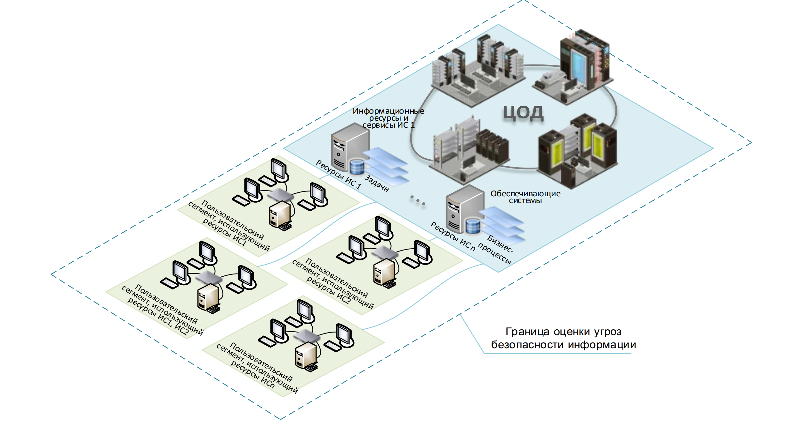
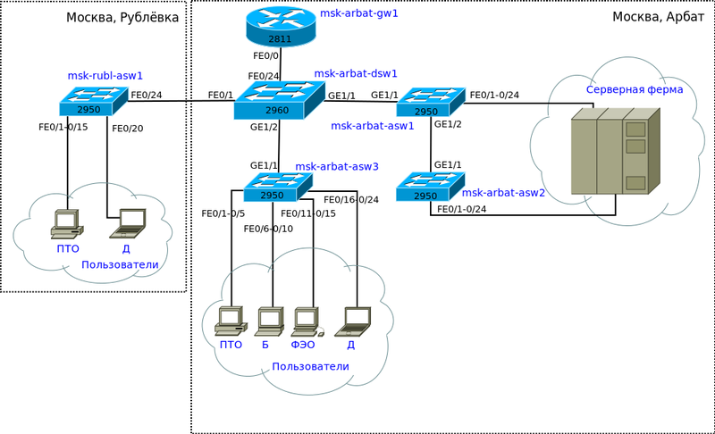
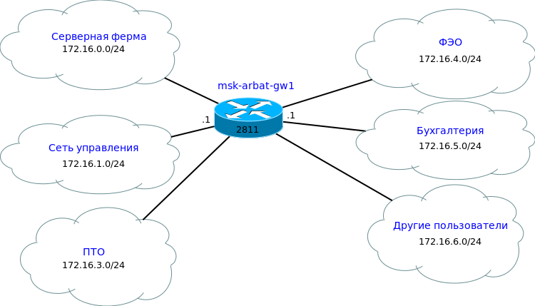

# Этапы производства проекта и документации. Неожиданная угроза

Аннотация: в данном проекте ты познакомишься с документацией, которая используется при проведении различных проектов в сфере ИБ. Узнаешь этапы производства проектов. Изучишь и выполнишь основные этапы проекта «Оценка угроз безопасности информации в компании», составишь модель угроз, а также напишешь руководство пользователя на свою любимую игру.

## Содержание

1. [Chapter I](#chapter-i) \
   1.1. [Рекомендации к проекту](#%D1%80%D0%B5%D0%BA%D0%BE%D0%BC%D0%B5%D0%BD%D0%B4%D0%B0%D1%86%D0%B8%D0%B8-%D0%BA-%D0%BF%D1%80%D0%BE%D0%B5%D0%BA%D1%82%D1%83)
2. [Chapter II](#chapter-ii) \
   2.1. [Этапы производства проекта и документации](#%D1%8D%D1%82%D0%B0%D0%BF%D1%8B-%D0%BF%D1%80%D0%BE%D0%B8%D0%B7%D0%B2%D0%BE%D0%B4%D1%81%D1%82%D0%B2%D0%B0-%D0%BF%D1%80%D0%BE%D0%B5%D0%BA%D1%82%D0%B0-%D0%B8-%D0%B4%D0%BE%D0%BA%D1%83%D0%BC%D0%B5%D0%BD%D1%82%D0%B0%D1%86%D0%B8%D0%B8)
3. [Chapter III](#chapter-iii) \
   3.1. [Задание 1. Обследование](#%D0%B7%D0%B0%D0%B4%D0%B0%D0%BD%D0%B8%D0%B5-1-%D0%BE%D0%B1%D1%81%D0%BB%D0%B5%D0%B4%D0%BE%D0%B2%D0%B0%D0%BD%D0%B8%D0%B5) \
   3.2. [Задание 2. Модель угроз](#%D0%B7%D0%B0%D0%B4%D0%B0%D0%BD%D0%B8%D0%B5-2-%D0%BC%D0%BE%D0%B4%D0%B5%D0%BB%D1%8C-%D1%83%D0%B3%D1%80%D0%BE%D0%B7) \
   3.3. [Задание 3. Оформление документации](#%D0%B7%D0%B0%D0%B4%D0%B0%D0%BD%D0%B8%D0%B5-3-%D0%BE%D1%84%D0%BE%D1%80%D0%BC%D0%BB%D0%B5%D0%BD%D0%B8%D0%B5-%D0%B4%D0%BE%D0%BA%D1%83%D0%BC%D0%B5%D0%BD%D1%82%D0%B0%D1%86%D0%B8%D0%B8)

### Введение

> Капитан Черный Пимп знаменит как гроза морей. О его пиратских походах ходят легенды, а один вид его корабля вселяет ужас во всех моряков на восточном побережье Нового Света. Это жесткий человек, воспитанный океаном, но при этом справедливый как по отношению к своим подчиненным, так и к своим врагам. Однако эта история приключилась не с ним, а с его попугаем по имени Чирик. Это была умнейшая птица, но, к сожалению, ее таланты использовались не по назначению.
>
> Пимп научил попугая улетать в разведку и сообщать о наличии кораблей: один чирик значил один корабль, два чирика — два корабля. Таким образом Чирик мог сосчитать до пяти кораблей. Больше пяти ему никогда не приходилось видеть, поскольку торговые корабли зачастую плавали небольшим флотом.

## Chapter I

### Рекомендации к проекту

Как учиться в «Школе 21»:

- На протяжении всего курса ты будешь самостоятельно добывать информацию. Пользуйся всеми доступными средствами поиска информации, к примеру, Google и GigaChat. Будь внимателен к источникам информации: проверяй, думай, анализируй, сравнивай.
- Взаимообучение (P2P, Peer-to-Peer) — это процесс, при котором учащиеся обмениваются знаниями и опытом, выступая одновременно в роли учителей и учеников. Этот подход позволяет учиться не только у преподавателя, но и друг у друга, что способствует более глубокому пониманию материала.
- Не стесняйся просить помощи: вокруг тебя такие же пиры, которые тоже проходят этот путь впервые. Не бойся откликаться на просьбы о помощи. Твой опыт ценен и полезен, смело делись им с другими участниками.
- Не списывай, а если пользуешься помощью — всегда разбирайся до конца, почему, как и зачем. Иначе твое обучение не будет иметь никакого смысла.
- Если ты на чем-то застрял и кажется, что все уже перепробовал, но по-прежнему непонятно, куда идти, — просто передохни! Поверь, этот совет помогал многим экспертам по КБ в их работе. Проветрись, перезагрузи голову, и, возможно, в следующий раз тебе наконец придет нужное решение!
- Важен не только результат обучения, но и сам процесс. Нужно не просто решить задачу, а понять, КАК ее решить.
- На пути к мастерству в сфере кибербезопасности ты получаешь возможность быть частью поддерживающего и вдохновляющего сообщества «Школы 21» по Кибербезопасности. Присоединяйся в [RocketChat](https://rocketchat-student.21-school.ru/channel/cybersec_21), чтобы получать свежие анонсы от сообщества, а также вступай в [Telegram](https://t.me/+r5wufz8L3mUzOGUy) для коммуникации.

Как работать с проектом:

- Перед выполнением проект необходимо склонировать с GitLab в одноименный репозиторий.
- Все файлы с кодом необходимо создавать в папке `src` склонированного репозитория.
- После клонирования проекта необходимо создать ветку `develop` и вести разработку в ней. После этого пушить в GitLab также нужно ветку `develop`.
- В твоей директории не должно быть иных файлов, кроме тех, что обозначены в заданиях.

Дисклеймер:

- В целях геймификации обучения проект подается в формате истории, чтобы у тебя была возможность отвлечься от сложных заданий и тонны теории в гугле. Если придуманная история кажется тебе бесталанной и скучной, можно указать на это в обратной связи, чтобы автор поплакал над своим писательским навыком. Также можно пропускать введение в каждом задании и фокусироваться только на содержательной части.

## Chapter II

### Этапы производства проекта и документации

Давай вспомним, чем проект отличается от процесса.

**Проект** — это временное предприятие, предназначенное для создания уникального продукта, услуги или результата. Проект имеет начало и конец, определенные сроки, ресурсы и цели.

В то время как **процесс** — это нечто повторяющееся, регулярное, без установленного срока окончания.

Когда мы говорим, что обеспечение информационной безопасности — это процесс, подразумевается, что внутри (в течение) этого процесса происходят проекты. Проекты по внедрению СЗИ, проекты по анализу защищенности информационной системы, проекты по аудиту и/или категоризации и так далее. Одним словом, проектов бывает много. И каждый из этих проектов направлен на повышение уровня защищенности организации.

Многие проекты так или иначе регламентированы стандартами или в крайнем случае методиками. При этом неформально практически у любого проекта в ИБ есть несколько стадий:

- Этап обследования.\
  На этом этапе зачастую происходит сбор информации. Конечно же, в финальном отчете должно быть отражено и задокументировано найденное. Можно назвать этот этап «инвентаризацией объектов Х», где вместо Х подставь любой тип проекта (аудита, анализа, внедрения и т. д.).
- Этап разработки документации.\
  На этом этапе все довольно тривиально. Поскольку ты совершил обследование, то на основе какой-либо метрики (на основе стандартов, своей экспертизы, законодательства, а иногда и всех вместе) ты создаешь прибавочный продукт в виде документа. Это может быть рекомендация, регламент, политика, модель угроз или руководство.
- Этап внедрения.\
  Этот этап применим только в том случае, если по результатам своей деятельности твоя задача не просто сказать «У вас все плохо, переделывайте», а еще и самостоятельно сделать и настроить все правильно.

Каждый из верхнеуровнево описанных этапов может (зачастую так и происходит) разбиваться еще на множество малых. В данном проекте ты рассмотришь некоторые этапы проведения такого проекта, как «Оценка угроз безопасности информации в компании». Формально этот проект включает в себя следующие этапы:

1. определение негативных последствий, которые могут наступить от реализации (возникновения) угроз безопасности информации;
2. определение возможных объектов воздействия угроз безопасности информации;
3. оценку возможности реализации (возникновения) угроз безопасности информации и определение их актуальности.

Однако чтобы не концентрироваться на единственном типе проектов, мы постараемся обобщить некоторые этапы, которые могут встречаться и в других проектах.

Для более глубокого изучения темы можно обратиться к разным стандартам и нормативным актам, которые детально описывают те или иные проекты:

- ГОСТ Р ИСО/МЭК 27001:2021 — стандарт по методам и средствам обеспечения безопасности. Объясняет особенности реализации системы менеджмента информационной безопасности.
- ГОСТ Р ИСО/МЭК 15408-1-2012 — информационная технология. Методы и средства обеспечения безопасности. Критерии оценки безопасности информационных технологий.
- СТО БР ИББС-1.1-2007 — Обеспечение информационной безопасности организаций банковской системы Российской Федерации. Аудит информационной безопасности. Дополнительные стандарты Банка России можно посмотреть здесь: <https://cbr.ru/information_security/acts/?la.Search=&la.TagId=48&la.VidId=26&la.Date.Time=Any&la.Date.DateFrom=&la.Date.DateTo=>)

## Chapter III

### Задание 1. Обследование

Для решения данного задания нужны знания в следующих темах: модель OSI, инвентаризация, граница оценки угроз.

> Во время очередного поиска торгового флота Черный Пимп решил затаиться на одном из архипелагов недалеко от большой земли. Чирик по обыкновению полетел в разведку, надеясь за свою работу получить еще немного корма.
>
> Пимп терпеливо ждал, когда вернется его верный друг. Ждать пришлось так долго, что матросы начали отпускать шутки о новой жизни Чирика и его любовных отношениях с другими птицами. Тем не менее Чирик вернулся, но в абсолютной тишине.
>
> — Чирик, ты видел корабли?
>
> Чирик беспомощно смотрел своими умными глазами на вопрошающего. Попугай, безусловно, видел корабли, но как сказать Пимпу о том, что их было намного больше пяти, он не знал.

Неважно, о каком типе проекта мы говорим: оценка защищенности компании, аудит или категорирование — в любом случае всегда необходимо иметь на руках информацию об обследуемом объекте. Эта информация может быть предоставлена самим заказчиком, а может включаться в перечень работ.

В нашем случае обследование необходимо далее для оценки угроз безопасности информации. Этот этап включает в себя сбор информации о системе защиты информации, изучение документаций, протоколов и журналов систем, запуск автоматизированных средств инвентаризации.

Самое главное — определить границу оценки угроз (или так называемый скоуп). Причем это относится не только к оценке угроз безопасности, но и в целом к любым работам, которые включают в себя этап обследования. На выходе ты будешь иметь состав устройств (с операционными системами, версиями ПО, работающими сервисами). Будет отлично, если у твоего заказчика есть CMDB — система инвентаризации активов, тогда со сбором информации будет намного проще.

На рисунке 1 представлена граница оценки угроз.

Иногда заказчик может потребовать схему сети — в таком случае тебе нужно будет построить структурную схему сети либо разделенную по уровням (L1, L2, L3 — в соответствии с моделями OSI).

Пример схем сетей, которые могут требоваться в отчете после обследования:

1. L1 — физические устройства сети с номерами портов и обозначением, что куда подключено.

1. L2 — указываются VLAN'ы и/или совокупность VLAN'ов на интерфейсах.

1. L3 — указываются адреса сетей и их связанность между собой.

Таким образом, на выходе из первого этапа сбора информации ты обладаешь:

- списком всего оборудования/устройств с версионностью ОС и ПО (его может предоставить заказчик, либо придется делать самостоятельно);
- схемами сетей (их может предоставить заказчик, либо придется делать самостоятельно);
- границей проведения дальнейших этапов (ее ты определяешь самостоятельно). В нее входят объекты воздействия — те элементы инфраструктуры, которые могут подвергаться угрозам. Объекты воздействия рассматриваются на аппаратном, системном и прикладном уровнях, на уровне сетевой модели взаимодействия, а также на уровне пользователей.

**Твое задание:**

По предоставленной структурной схеме сети определи границу проведения оценки угроз безопасности информации при следующей задаче: «Проведи оценку угроз безопасности информации для ЦОД2».

В качестве ответа предоставь полный список сегментов, входящих в границу проведения оценки угроз, в файле `answer.txt`. Получившийся файл загрузи на гит.

Пример:

- Сегмент 1, Сегмент 2, ЦОД5, Сегмент 3.

### Задание 2. Модель угроз

Для решения данного задания нужны знания в следующих темах: методика оценки угроз безопасности информации от ФСТЭК, модель угроз.

> Пимп понял, что попугай видел флот, но информация о количестве кораблей играла огромную роль. Обычно пираты не нападают, если кораблей больше 6 штук, так как в таком случае сравнительно безопасный рейд невозможен.
>
> Моряки замерли в ожидании решения Пимпа. Он молча удалился в свою каюту и начал думать.
>
> «Больше пяти кораблей на данном направлении — точно не королевский флот, потому что они заходят в порт сильно севернее. Значит, это либо боевой патруль, либо огромная торговая флотилия. Однако боевой патруль не ходит так близко к берегу, им просто не хватит осадки фрегатов. Тем не менее нельзя исключать, что это новые и более маневренные боевые корабли... Ядер у нас достаточно, чтобы выдержать долгий морской бой, но если нас начнут брать на абордаж, мне просто не хватит людей...» — думал про себя капитан.
>
> «Все или ничего» было его умозаключение. Он уже давно в этом «бизнесе», а слава лучшего пирата Нового Света не приходит к тому, кто не готов рискнуть.
>
> Выйдя к своей команде, он громко прокричал: «Морские псы! Сегодня мы возьмем самую большую наживу за последнюю четверть века! И никакие угрозы нам не помеха!»

**Модель угроз** — важнейший элемент любой организации, обеспечивающей безопасность своих ресурсов. По решению обладателя информации или оператора модель угроз безопасности информации разрабатывается как для отдельной системы или сети, так и для совокупности взаимодействующих систем и сетей оператора.

При разработке модели угроз безопасности информации для отдельной системы и сети она должна содержать описание угроз безопасности информации, актуальных для инфраструктуры, на базе которой эта система или сеть функционирует, а также угроз безопасности информации, связанных с интерфейсами взаимодействия со смежными (взаимодействующими) системами и сетями. Допускается разработка одной модели угроз безопасности информации для нескольких однотипных создаваемых систем и сетей обладателя информации или оператора.

Применимо к конкретно выбранному проекту: «Оценка угроз безопасности информации», для построения модели угроз необходимы следующие вещи:

1. Должны быть определены негативные последствия, которые могут наступить от реализации (возникновения) угроз безопасности информации.
2. Должны быть определены возможные антропогенные источники угроз безопасности информации, к которым относятся лица (группа лиц), осуществляющие реализацию угроз безопасности информации путем несанкционированного доступа и (или) воздействия на информационные ресурсы и (или) компоненты систем и сетей, — актуальные нарушители.
3. Должны быть определены возможные способы реализации (возникновения) угроз безопасности информации, за счет использования которых актуальными нарушителями могут быть реализованы угрозы безопасности информации в системах и сетях, — актуальные способы реализации (возникновения) угроз безопасности информации.
4. Должны быть определены возможные угрозы безопасности информации и оценена их актуальность для систем и сетей — актуальные угрозы безопасности информации.

Другими словами, тебе нужно определить, **какие последствия** при реализации угроз могут наступить, **кто** может осуществлять угрозы, а также **способы** реализации этих угроз, при этом должны быть выделены **актуальные** угрозы.

Итак, у тебя есть 4 необходимых «кирпичика»:

- последствия,
- источники угроз,
- способы реализации угроз,
- актуальные угрозы.

Как определить и расписать каждый конкретный «кирпичик», можешь почитать в [методических указаниях ФСТЭК](https://fstec.ru/dokumenty/vse-dokumenty/spetsialnye-normativnye-dokumenty/metodicheskij-dokument-ot-5-fevralya-2021-g).

Стоит отметить, что модель угроз должна по итогу быть оформлена в виде отдельного документа.

**Важно!** Это применимо и к любым другим документам по итогам проекта — они оформляются каждый в соответствии с рекомендациями к конкретно этому виду проекта (если таковые рекомендации имеются). Если рекомендаций от регулирующих органов нет (как, например, для пентестов), то отчет оформляется в согласованной с заказчиком форме, желательно с использованием соответствующих стандартов.

Пример структуры отчета модели угроз, в соответствии с рекомендациями ФСТЭК, можно найти в приложении 3 к [документу](https://fstec.ru/dokumenty/vse-dokumenty/spetsialnye-normativnye-dokumenty/metodicheskij-dokument-ot-5-fevralya-2021-g).

**Твое задание:**

Напиши модель угроз для следующего ресурса:

Интернет-сайт частной организации, развернутый на сервере с публичным адресом во внешнем периметре инфраструктуры. На сайте представлены продукты компании, есть личный кабинет пользователя, компания продает свои продукты через этот сайт.

Отчет составь по образцу методических указаний ФСТЭК, назови его `Threat_site.docx` и залей на гит.

Пояснение:

- Пропусти пункты 1 и 2 в своем отчете. В остальных пунктах от тебя потребуются таблички по образцу из приложений методических рекомендаций ФСТЭК. Если предоставленной информации об объекте угроз недостаточно, придумай ее самостоятельно.
- В пункте **«Источники угроз безопасности информации»** рассмотри по 3 вида каждой категории.

*Подсказка: в совокупности в твоей модели угроз должно быть 7 таблиц.*

### Задание 3. Оформление документации

Для решения данного задания нужны знания в следующих темах: ГОСТ 34.201-89, ГОСТ Р 59795-2021.

> Уже к вечеру того же дня капитан Пимп и его попугай Чирик копались в огромных сундуках, которые они захватили во время удачного пиратского рейда. Однако кораблей оказалось меньше, чем предполагал Пимп, — всего 4 штуки.
>
> Это была торговая флотилия из Индии, которая везла специи, чай, разные драгоценности и рукописи. Пимп умел читать и считать, а свою команду держал в строгой, можно даже сказать зверской, дисциплине. Все награбленное строго пересчитывалось и документировалось, чтобы любая пропажа могла быть сразу замечена. При этом доли между пиратами делились также под запись.
>
> В одном из захваченных документов Пимп нашел письмо королю Англии, которое содержало весьма занимательный текст. В нем говорилось, что, в соответствии с приказом Эдольта I, к берегам Нового Света выслан флот во главе с капитаном Мимпом, чтобы поймать и предать суду знаменитого пирата — самого Черного Пимпа.
>
> Чирик все это время сидел у него на плече.
>
> — Чирик, сколько кораблей было в этой флотилии?
>
> Чирик чирикнул 4 раза.
>
> — А сколько кораблей было в той флотилии, которую ты видел днем?
>
> Чирик промолчал и жалобно посмотрел на капитана.
>
> В этот момент на палубе раздался сигнал тревоги, а в капитанскую каюту забежал матрос:
>
> — Капитан, 15 боевых кораблей по правому борту, идут на нас на большой скорости!

Ты уже знаешь, что на большинстве этапов любого проекта необходимо иметь документацию. Конечно, если рекомендованный формат документа отсутствует в методических рекомендациях или ГОСТах, руководствоваться нужно общепринятыми стандартами.

В таких случаях один из основных стандартов по комплектности документации, а также по наименованию и содержанию документов — это **ГОСТ 34.201-89**. Ознакомиться можно [тут](https://meganorm.ru/Data2/1/4294850/4294850119.pdf).

Если проект связан с внедрением какого-либо СЗИ (СЗИ является Автоматизированной системой), то тебе необходим стандарт ГОСТ Р 59795-2021, который регламентирует целый перечень всевозможной документации, которая должна быть представлена при передаче/внедрении/поддержке Автоматизированных систем. К слову, с точки зрения заказчика, ты имеешь полное право требовать документацию в соответствии с этим стандартом.

Ознакомиться с этим стандартом можно [здесь](https://docs.cntd.ru/document/1200181351).

Поскольку перечень необходимых документов при внедрении превышает дюжину, сконцентрируемся на одном из них: руководство пользователя. С этим документом ты будешь работать достаточно часто при взаимодействии с любой АС, а также, ориентируясь на этот документ, твой заказчик будет проводить ПМИ, если ты будешь в роли исполнителя.

Документ **«Руководство пользователя»** в соответствии с ГОСТ Р 59795 — 2021 должен содержать разделы:

- введение;
- назначение и условия применения;
- подготовка к работе;
- описание операций;
- аварийные ситуации;
- рекомендации по освоению.

При этом конкретное содержание «Руководства администратора» не регламентируется. Однако при его составлении все также нужно руководствоваться ГОСТ Р 59795 — 2021.

Примерный состав **«Руководства администратора»**:

- Описание назначения и порядка использования программного продукта;
- Описание общих принципов логики функционирования системы;
- Перечисление администраторских обязанностей и связанных с ними операций;
- Регламент выполнения каждой операции — очередность, периодичность, обязательность;
- Перечень мероприятий по обслуживанию системы с указанием порядка проведения:
  - настройка и параметризация;
  - справочно-нормативные данные;
  - описание управления учетными записями;
  - способы назначения прав доступа;
  - ввод и вывод информации;
- Описание возможных проблем или неполадок функционирования системы, методов их устранения.

**Твое задание:**

Составь документ «Руководство пользователя» на свою любимую игру или приложение. Следуй ГОСТ Р 59795 — 2021 при описании разделов и изучи, что должно входить в каждый раздел.

Руководство пользователя запиши в файл `I_am_user.docx` и загрузи на гит.

💡 Нажми [сюда](https://new.oprosso.net/p/4cb31ec3f47a4596bc758ea1861fb624), чтобы поделиться с нами обратной связью на этот проект. Это анонимно и поможет команде Продукта сделать твоё обучение лучше.