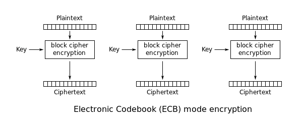
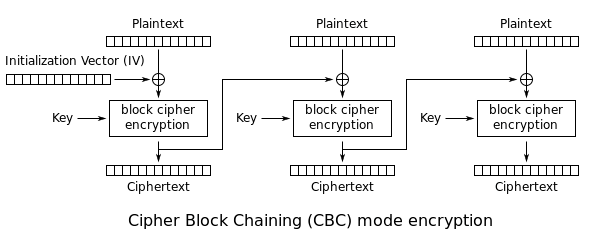
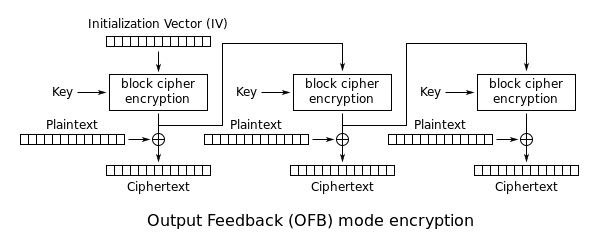
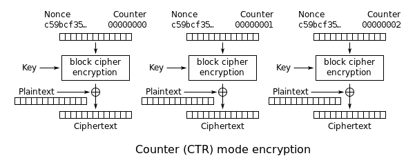

# Симметричная криптография — Шифрование века

Аннотация: В этом проекте ты узнаешь особенности и детали симметричных алгоритмов шифрования, основы криптоанализа, а также информацию об атаках на основе особенностей алгоритмов шифрования.

## Содержание

1. [Chapter I](#chapter-i) \
   1.1. [Рекомендации к проекту](#%D1%80%D0%B5%D0%BA%D0%BE%D0%BC%D0%B5%D0%BD%D0%B4%D0%B0%D1%86%D0%B8%D0%B8-%D0%BA-%D0%BF%D1%80%D0%BE%D0%B5%D0%BA%D1%82%D1%83)
2. [Chapter II](#chapter-ii) \
   2.1. [Симметричное шифрование](#%D1%81%D0%B8%D0%BC%D0%BC%D0%B5%D1%82%D1%80%D0%B8%D1%87%D0%BD%D0%BE%D0%B5-%D1%88%D0%B8%D1%84%D1%80%D0%BE%D0%B2%D0%B0%D0%BD%D0%B8%D0%B5)
3. [Chapter III](#chapter-iii) \
   3.1. [Задание 1. Блочное шифрование](#%D0%B7%D0%B0%D0%B4%D0%B0%D0%BD%D0%B8%D0%B5-1.-%D0%B1%D0%BB%D0%BE%D1%87%D0%BD%D0%BE%D0%B5-%D1%88%D0%B8%D1%84%D1%80%D0%BE%D0%B2%D0%B0%D0%BD%D0%B8%D0%B5) \
   3.2. [Задание 2. Потоковое шифрование](#%D0%B7%D0%B0%D0%B4%D0%B0%D0%BD%D0%B8%D0%B5-2.-%D0%B1%D0%BB%D0%BE%D1%87%D0%BD%D0%BE%D0%B5-%D1%88%D0%B8%D1%84%D1%80%D0%BE%D0%B2%D0%B0%D0%BD%D0%B8%D0%B5) \
   3.3. [Задание 3. AES](#%D0%B7%D0%B0%D0%B4%D0%B0%D0%BD%D0%B8%D0%B5-3.-aes) \
   3.4. [Задание 4. Режимы работы блочных шифров](#%D0%B7%D0%B0%D0%B4%D0%B0%D0%BD%D0%B8%D0%B5-4.-%D1%80%D0%B5%D0%B6%D0%B8%D0%BC%D1%8B-%D1%80%D0%B0%D0%B1%D0%BE%D1%82%D1%8B-%D0%B1%D0%BB%D0%BE%D1%87%D0%BD%D1%8B%D1%85-%D1%88%D0%B8%D1%84%D1%80%D0%BE%D0%B2) \
   3.5. [Задание 5. Уязвимости алгоритмов шифрования](#%D0%B7%D0%B0%D0%B4%D0%B0%D0%BD%D0%B8%D0%B5-5.-%D1%83%D1%8F%D0%B7%D0%B2%D0%B8%D0%BC%D0%BE%D1%81%D1%82%D0%B8-%D0%B0%D0%BB%D0%B3%D0%BE%D1%80%D0%B8%D1%82%D0%BC%D0%BE%D0%B2-%D1%88%D0%B8%D1%84%D1%80%D0%BE%D0%B2%D0%B0%D0%BD%D0%B8%D1%8F)

### Введение

> Перед Йозефом висела табличка: «Добро пожаловать в Нарнию».
>
> «Какое странное название для города», — подумал он, но мысли его прервал внезапный толчок чемодана.
>
> Это был оленезаяц. Магическая зверушка, которую Йозеф привез местному торговцу на продажу. В чемодане были и другие, но так толкался только непоседливый заяц с рожками оленя. Вообще, у нашего героя был свой таксопарк летающих метел, а торговлей магическими существами он занимался для души. Вот и сейчас он душевно потряс свой чемодан, чтобы оленезаяц успокоился.
>
> Выйдя с вокзала летающих поездов, он осмотрелся: повсюду были огромные бетонные постройки, которые напоминали когти, тянущиеся до небес. Уже вечерело, поэтому необходимо было торопиться, пока торговец снова не телепортировался в другой город.
>
> Дойдя пешком до неприметного магазинчика в спальном районе, Йозеф постучал в дверь. Вывеска гласила: «Китайские огоньки. Оптом».
>
> «Надо будет прикупить, глядишь, загадаю желание, и дела пойдут лучше», — заключил молодой контрабандист.
>
> Дверь вскоре открылась, и на пороге его встретил мужчина лет пятидесяти, с огромной лысиной и немного горбатым носом. Его звали Сидоров, это и был будущий счастливый обладатель оленезайца.
>
> — Входи, — быстро проговорил он, — хвост не привел?
>
> Йозеф хотел было пошутить про хвост, магических существ и приплести к этой шутке оленезайца, но быстро этого сделать не смог, поэтому удрученно пробормотал: «Нет», и они зашли в магазин.

## Chapter I

### Рекомендации к проекту

Как учиться в «Школе 21»:

- На протяжении всего курса ты будешь самостоятельно добывать информацию. Пользуйся всеми доступными средствами поиска информации, к примеру, Google и GigaChat. Будь внимателен к источникам информации: проверяй, думай, анализируй, сравнивай.
- Взаимообучение (P2P, Peer-to-Peer) — это процесс, при котором учащиеся обмениваются знаниями и опытом, выступая одновременно в роли учителей и учеников. Этот подход позволяет учиться не только у преподавателя, но и друг у друга, что способствует более глубокому пониманию материала.
- Не стесняйся просить помощи: вокруг тебя такие же пиры, которые тоже проходят этот путь впервые. Не бойся откликаться на просьбы о помощи. Твой опыт ценен и полезен, смело делись им с другими участниками.
- Не списывай, а если пользуешься помощью — всегда разбирайся до конца, почему, как и зачем. Иначе твое обучение не будет иметь никакого смысла.
- Если ты на чем-то застрял и кажется, что все уже перепробовал, но по-прежнему непонятно, куда идти, — просто передохни! Поверь, этот совет помогал многим экспертам по КБ в их работе. Проветрись, перезагрузи голову, и, возможно, в следующий раз тебе наконец придет нужное решение!
- Важен не только результат обучения, но и сам процесс. Нужно не просто решить задачу, а понять, КАК ее решить.
- На пути к мастерству в сфере кибербезопасности ты получаешь возможность быть частью поддерживающего и вдохновляющего сообщества «Школы 21» по Кибербезопасности. Присоединяйся в [RocketChat](https://rocketchat-student.21-school.ru/channel/cybersec_21), чтобы получать свежие анонсы от сообщества, а также вступай в [Telegram](https://t.me/+r5wufz8L3mUzOGUy) для коммуникации.

Как работать с проектом:

- Перед выполнением проект необходимо склонировать с GitLab в одноименный репозиторий.
- Все файлы с кодом необходимо создавать в директории `src` склонированного репозитория.
- После клонирования проекта необходимо создать ветку `develop` и вести разработку в ней. После этого пушить в GitLab также нужно ветку `develop`.
- В директории `src` представлены файлы для работы с заданием.
- В твоей директории не должно быть иных файлов, кроме тех, что обозначены в заданиях.

Дисклеймер:

- В целях геймификации обучения проект подается в формате истории, чтобы у тебя была возможность отвлечься от сложных заданий и тонны теории в гугле. Если придуманная история кажется тебе бесталанной и скучной, можно указать на это в обратной связи, чтобы автор поплакал над своим писательским навыком. Также можно пропускать введение в каждом задании и фокусироваться только на содержательной части.

## Chapter II

### Симметричное шифрование

Ты уже знаешь, что симметричное шифрование предполагает наличие единого ключа для шифрования и дешифрования информации. Однако на этом особенности не заканчиваются.

Существует два типа симметричного шифрования: блочный и потоковый. В блочном данные шифруются «кусками» (блоками) фиксированной длины, например, 32 бита. А потоковое шифрование данных предполагает обработку каждого бита информации с использованием гаммирования, то есть изменения этого бита с помощью соответствующего ему бита псевдослучайной секретной последовательности чисел, которая формируется на основе ключа и имеет ту же длину, что и шифруемое сообщение. Как правило, биты исходных данных сравниваются с битами секретной последовательности с помощью логической операции XOR, которая тебе уже хорошо знакома. Оба этих типа мы подробно разберем в заданиях данного проекта.

Помимо типов симметричного шифрования, существуют «режимы работы» — это механизмы применения алгоритмов при шифровании. Алгоритм — это своего рода инструмент, а режим работы — инструкция к этому инструменту.

Чтобы лучше справиться со всеми заданиями, рекомендуем изучить следующие темы:

- парадокс дней рождения;
- сеть Фейстеля;
- раундовый ключ.

## Chapter III

### Задание 1. Блочное шифрование

Для решения данного задания нужны знания в следующих темах: Python, симметричное шифрование, типы данных в Python.

> Когда Сидоров убедился, что за ними никто не следит, Йозеф размашистым движением закинул чемодан на стол. Из чемодана раздались одновременно рык, писк и злобное жужжание.
>
> «Котопес, змеерыб и пчелокрот, — моментально понял Йозеф. — Надеюсь, не поранились. Больше так делать не буду».
>
> Магические существа стоили огромных денег, потому что были запрещены к обороту и продаже. Этот закон вышел совсем недавно под давлением защитников животных, так что Йозеф хотел за пару-тройку месяцев сорвать куш на этом запрете.
>
> — Сколько с меня? — загадочно спросил Сидоров.
>
> — 50 криптокоинов, — ответил Йозеф.
>
> Сидоров ухмыльнулся.
>
> — Мы договаривались на 45. Но так и быть, по рукам, — сказал Сидоров и протянул ладонь в знак завершенной сделки.
>
> Они пожали руки, и Йозефу на счет моментально поступило 50 криптокоинов. В магическом мире все платежи проходят через децентрализованную систему «Потокчейн». Она, конечно же, была централизованной и контролировалась государствами, но всех причастных это мало волновало.
>
> — А этих продаешь? — спросил вновь повеселевший Сидоров.
>
> — Нет, просто показываю, — начал ерничать Йозеф, — конечно, продаю, но только пачками. Если хочешь одного, придется купить сразу троих.
>
> Сидоров не отреагировал на неудачную попытку пошутить и принялся рассматривать содержимое чемодана. И вдруг в дверь кто-то постучал.

Начнем рассматривать блочное шифрование с конкретного примера. Перед нами реализация шифрования с использованием алгоритма DES:

```
from Crypto.Cipher import DES

key = '12345678' # Ключ должен иметь длину 8 байт (64 бита) при использовании DES.
cipher = DES.new(key, DES.MODE_ECB)	# Создаем шифр DES с ранее указанным ключом и режимом работы ECB.

ct1 = cipher.encrypt('abcdefgh')	# DES шифрует 8 байт за один «проход».
print repr(ct1)
>>> '\x94\xd4Ck\xc3\xb5\xb6\x93'

ct2 = cipher.encrypt('abcdefgh')	# Одни и те же 8 байт всегда будут шифроваться в одно и то же.
print repr(ct2)
>>> '\x94\xd4Ck\xc3\xb5\xb6\x93'

ct3 = cipher.encrypt('hgfedbca')	# Разные байты будут шифроваться по-другому.
print repr(ct3)
>>> 'KKX\x8d\x86\xa4f]'

ct4 = cipher.encrypt('abcdefghabcdefgh') # Что, если попробовать зашифровать больше, чем 8 байт?
print repr(ct4)
>>> '\x94\xd4Ck\xc3\xb5\xb6\x93\x94\xd4Ck\xc3\xb5\xb6\x93'

ct5 = cipher.encrypt('abcdefghhgfedbca')
print repr(ct5)
>>>'\x94\xd4Ck\xc3\xb5\xb6\x93KKX\x8d\x86\xa4f]'
```

Посмотри на **ct4** и **ct5** выше. Они показывают суть того, что такое блочный шифр. Блочные шифры шифруют один блок данных за раз. Для DES размер блока равен 8. Это можно проверить с помощью `DES.block_size`. Для **ct4** первые 8 зашифрованных байт — это «abcdefgh», а следующие 8 зашифрованных байт — тоже «abcdefgh», поэтому на выходе мы получаем 8 зашифрованных байт, за которыми следуют точно такие же 8 зашифрованных байт.

Другими словами, если `x`, `y` и `z` являются 8-байтовыми строками, то `DES_encrypt(x+y+z) == DES_encrypt(x) + DES_encrypt(y) + DES_encrypt(z)`.

Обрати внимание, что это выражение справедливо только для режима **Electronic Codebook** или **ECB**, режима блочного шифрования. В режиме ECB каждый блок просто шифруется отдельно. Это самый слабый режим, и несложно догадаться почему. Одни и те же блоки открытого текста будут отображаться в одних и тех же блоках зашифрованного текста (при использовании одного и того же ключа). Это что-то вроде шифра замены, но с блоками вместо отдельных символов, а, соответственно, он подвержен атакам.

Принцип работы ECB представлен на картинке:



**Твое задание:**

Изучи файл `crypto_alphabet.py`. В нем содержится имплементация алгоритма шифрования DES. Какой текст был в переменной flag, если результат работы программы следующий:

`"0c318c942012106f9093d54a405ab56fecf16b372ddb6122585a5347d6a175899e3f821f5bc54aa0d2c8541cecfa0091b9a1470c7471bf087cefe2c8e575ed4728d43e67f61c16830c539ef854af384f482bb5cd35c81dfda48a5e7e90880b58cd954905d348e1bb2407ba89db5d09e5718e2cf75b6fccbd81b4e095d1c6429c148964a24b566c7b028c0717c6cfaa58fc568b381375cd68a09fba8adaebbe661ca72544d2fa26bf528f2634355bcd03d5278668dab99ad0d586437908008739b9441f8f3c5c981eb055c6372b0f2c43a2bfe10b945097a78b64f1a925f37f273a7097b7c874cf06cdfd76839c0c691d8ddf73cb9a388efcf2c354a77dd1f055669420faaeb041ffe749cd247ea592fbba21d45a8a7a69ba22f4cddb6ad77b47f79aef93bcc9781c03af3c93c290783095599b6028978beecae02be5e443d174fe72314bd4baf0a5ea480cefc443150d34a13f0596feb5f1b6cbc87b17b1aa0c64ec8afffb94081ec930b4f4a91a8ecb21d8ac319d0fa6f5298155c7e60b6bf11992dc019501ce5b0a06df0efb6f3f15d717cdd31bfec3687491909d8ae06b59d33737a055712067f775d8790d947b5f4215842b9d5ccf167653409543e247a54b13b28eb153b2d6b5a981e7ec778072877520e18bc5e16e8aaeb3fc3bd23c1dbc4a573cb04eb53da0b778fb2c727b1be49134ca888f27061975cb4a8a6da647349a13f796f644b9ddd4471ca24d3aa53a3ca4175290624ac2df158b304ac2e97bd14d9736924bd97115e2686719d3b830930726f871bf07eb334bd14a1dba9c628c7cea0a4ffe11dda4873f3d301578fe8f8490aae2870afca1ca02bd3f3c08a6c59e659a581a56c276f264a0ec3b9972b2adc4ba719839249e39bafa4b17e1413328d62c561752d909068887d00beac0e7bee12d9cd14cbcc4fd7513cc0e5797d4ef33f8fa34b4feb7363f9798e65762c76cf61a18f16797ab1b5867603d0bd49865706148cbea1bd2e92bc5125f5246b1da1db6fd8c0d42efe5842c4387f89764c803a04e3b841d7386603debb484d277c452d1b49345fbef437e4791c35899d720a09a6da4ce6790265bbfddfaf693db531704e74d34b9c67b294835f16f"`

`"4215842b9d5ccf16ecf16b372ddb61229093d54a405ab56f46b1da1db6fd8c0d482bb5cd35c81dfd8b64f1a925f37f27718e2cf75b6fccbdd49865706148cbeaba21d45a8a7a69bab9441f8f3c5c981e8ddf73cb9a388efcd49865706148cbea3a7097b7c874cf068ddf73cb9a388efc8b64f1a925f37f27718e2cf75b6fccbdd49865706148cbea482bb5cd35c81dfda48a5e7e90880b58b9441f8f3c5c981e8ddf73cb9a388efccdfd76839c0c691dd49865706148cbeacdfd76839c0c691d028c0717c6cfaa58fc568b381375cd683a7097b7c874cf06d49865706148cbea482bb5cd35c81dfd528f2634355bcd03148964a24b566c7bb9441f8f3c5c981ec0e7bee12d9cd14c9764c803a04e3b84"`

В качестве ответа запиши значение flag в файл `solution.txt` и выложи на гит.

### Задание 2. Потоковое шифрование

Для решения данного задания нужны знания в следующих темах: симметричное шифрование, Python.

> — Открывайте, я же вижу, что вы открыты, — крикнул женский голос за дверью.
>
> Глаза Сидорова стали узкими, как у змеи. Он грозно посмотрел на Йозефа и процедил сквозь зубы:
>
> — Прячь все. Быстро.
>
> Йозеф дрожащими от волнения руками бросился закрывать чемодан. Магические существа, поняв, что их опять запирают в душном чемодане, начали брыкаться и издавать страшные звуки, что значительно осложняло весь процесс.
>
> Осознав, что такими темпами их точно раскусят, Йозеф достал магическую палочку и по одному заколдовал всех магических существ. Это было заклинание иллюзии, которое превратило чемодан с неведомыми животными в обычный чемодан с драгоценными камнями.
>
> Через секунду после того как последний кричащий монстр превратился в сверкающий изумруд, дверь открылась. В магазин зашла женщина средних лет в джинсах и черной толстовке, с милым цветочком в волосах.
>
> — Запрещенкой торгуете? — ласково улыбнулась она.

**Твое задание:**

В файле `crypto.py` в директории src представлена реализация одного из алгоритмов шифрования на Python. Однако в коде имеется ряд ошибок, делающих невозможным расшифровку сообщения с помощью классической реализации алгоритма. Необходимо определить, какой алгоритм реализован, найти все ошибки в коде и расшифровать исходное сообщение для получения флага.

Для выполнения задачи заполни файл `solution_stream.txt` и залей его на гит:

- **Алгоритм шифрования**: определи, какой алгоритм реализован.
- **Ошибки реализации**: укажи все ошибки, обнаруженные при реализации алгоритма, и напиши, как их исправить.
- **Флаг**: расшифруй сообщение и скопируй ответ в файл.

### Задание 3. AES

Для решения данного задания нужны знания в следующих темах: алгоритм DES, блочное шифрование, Python.

> Она осторожной походкой пошла осматривать полки с китайскими огоньками, как бы выжидая, что ей ответят двое мужчин, которые заперлись в магазине.
>
> Повисла неловкая пауза, так как Йозеф ждал ответа от Сидорова, а тот был занят тем, что исподлобья подозрительно смотрел на женщину.
>
> — А вы с какой целью интересуетесь? — наконец прозвучал вопрос от владельца магазина.
>
> — Может быть, хочу тоже прикупить себе магическую зверушку... А может, и не хочу, кто знает, — задорно ответила та, продолжая рассматривать ассортимент.
>
> — Тогда спешим вас разочаровать: я продаю только магические камушки, — с убеждением протараторил Йозеф.
>
> — Замечательно! Это же изумруды! Они сейчас очень популярны! — закричала женщина и нарочито радостно побежала к чемодану. — Беру все! Сколько с меня?
>
> — К сожалению, сделка уже совершена, и свободных камней на продажу уже не осталось, — начал подыгрывать Сидоров.
>
> Женщина не обратила внимания на его слова, зачарованно рассматривая камни.

Один из самых используемых блочных шифров — AES. Основное различие между AES и DES, о котором тебе следует знать на данный момент, заключается в том, что размер блока для AES составляет 16 байт, а длина ключа составляет 16, 24 или 32 байта.

AES еще не взломан, поэтому проблемы, связанные с AES, имеют отношение к ошибкам в реализации (плохо выбранные ключи или IV), а не к самому шифру. Иногда проблемы могут заключаться в индивидуальной реализации AES с неудачно выбранным S-BOX, что требует некоторого дифференциального анализа и знаний внутреннего устройства AES. Рассмотрим, как происходит шифрование с использованием AES в уже знакомом тебе режиме ECB:

```
from Crypto.Cipher import AES

key = 'thisisasecretkey' # Ключ должен быть 16, 24, или 32 байт.
cipher = AES.new(key) # Режим по умолчанию: ECB (так же, как для DES).

ct1 = cipher.encrypt('abcdefghijklmnop')	# AES шифрует по 16 байт.
print repr(ct1)
>>> '5\xe0\xce[\x9d\xea\x1c=\xbd\xfbz;L\xa5\x02t'

ct2 = cipher.encrypt('abcdefghijklmnop'*2) # Проверяем режим работы ECB.
print repr(ct2)
>>> '5\xe0\xce[\x9d\xea\x1c=\xbd\xfbz;L\xa5\x02t5\xe0\xce[\x9d\xea\x1c=\xbd\xfbz;L\xa5\x02t'
```

**Твое задание:**

Рассмотри файл `4es.py` в директории src. В нем представлена реализация алгоритма AES CBC. Какой был изначальный текст в переменной plaintext, если результат работы программы следующий:
`dd95b1d1373f97307b1943a00bd9a09fc9568802187663ff93cadfedd688b644`

В качестве ответа загрузи на гит файл `solution_aes.txt` со следующим содержимым:

- **Флаг**: изначальная строка plaintext.
- **Режим работы**: напиши режим работы, который тебе понадобился для расшифровки.

### Задание 4. Режимы работы блочных шифров

Для решения данного задания нужны знания в следующих темах: алгоритм AES, режим ECB, Python.

> — Расскажите, что каждый из этих камней делает, — шепотом попросила она, оглядываясь на ошарашенных мужчин.
>
> «Лучше ей подыграть», — дружно подумали дельцы и кинулись на ходу сочинять истории о том, как камни лечат от рака, слепоты и бедности. В красках описывая историю каждого из них.
>
> Женщина восторженно вскрикивала, с горящими глазами слушая их чепуху.
>
> — А этот камень нужно наложить на другой такой же камень, чтобы они оба сработали. Их совместный эффект дарует невидимость аж на 5 минут. Но данное действие можно повторять только раз в сутки, — Йозефа было не остановить.

Возьмем AES и рассмотрим разные режимы работы на конкретных реализациях.

#### CBC



Для режима CBC первым шагом является создание случайного вектора инициализации (IV) размером 16 байт.

Затем происходит XOR IV с первыми 16 байтами изначального текста, чтобы получить входные данные для AES.

При этом создаются первые 16 байт зашифрованного текста (часто IV отправляется как фактические первые 16 байт). Эти первые вычисленные байты зашифрованного текста становятся IV для следующего блока открытого текста и повторяются. Своего рода паровоз из IV.

```
from Crypto.Cipher import AES
import os
from pwn import xor

key = 'asupersecretkey!'
iv = os.urandom(16)	# IV должен быть 16 байт!
print iv.encode('hex')
>>> 2fcb848b15ebf54c21b1fe8cc76a1f75

cbc = AES.new(key, AES.MODE_CBC, iv)
ct1 = cbc.encrypt('abcdefghijklmnop' * 2)
print ct1.encode('hex')
>>> 67f6b474948976ae67597d6f8ebf8ac128f58872b7a9a58ce833e50be5373742

# Делаем механику CBC, но с использованием ECB-режима.
ecb = AES.new(key, AES.MODE_ECB)
block1 = ecb.encrypt(xor(iv, 'abcdefghijklmnop'))
block2 = ecb.encrypt(xor(block1, 'abcdefghijklmnop'))
ct2 = block1 + block2
print ct2.encode('hex')
>>> 67f6b474948976ae67597d6f8ebf8ac128f58872b7a9a58ce833e50be5373742

# Как видим, шифр-тексты сошлись. Таким образом, CBC может быть реализован через ECB.
```

#### OFB



Для режима OFB первый шаг такой же, как и в режиме CBC: мы выбираем случайный IV размером 16 байт.

Этот IV шифруется с помощью 16-байтового ключа, а затем с этим результатом выполняются две вещи:

1. Вывод подвергается операции XOR с первыми 16 байтами открытого текста.
2. Вывод снова шифруется и становится IV для следующих 16 байт открытого текста.

Давай зашифруем с помощью библиотеки Python, а затем посмотрим, сможем ли мы расшифровать вручную.

```
from Crypto.Cipher import AES
import os
from pwn import *

key = "major_key_alert!" 
IV = os.urandom(16) # IV = efcc04b94963a02e01ac139456a3f160 в виде hex.
cipher = AES.new(key, AES.MODE_OFB, IV) 

ct = cipher.encrypt("so many AES modes,so little time") 
print(ct) 
>>> 'g\xb7\xddL\xb6\xd8\x0b\x12u#D\x18a\xafv{\x93\xf6\x90$Z\x02|\xdb|\xa7\x8fO_j\x81\xa1'

# Теперь попробуем расшифровать с помощью ECB-режима.
ecb_cipher = AES.new(key)

# Шифруем (дешифруем) IV первый раз, чтобы получить первый блок.
xor_key = ecb_cipher.encrypt(IV)
first_block = xor(xor_key, ct[:16]) 
print(first_block) 
>>> "so many AES mode"

# Шифруем (дешифруем) IV второй раз, чтобы получить второй блок.
xor_key = ecb_cipher.encrypt(xor_key) 
second_block = xor(xor_key, ct[16:])
print(second_block) 
>>> "s,so little time"

# Восстанавливаем изначальный текст.
pt = first_block + second_block 
print(pt) 
>>> "so many AES modes,so little time"
```

#### CTR



Для режима CTR выбирается начальный *блок счетчика*, аналогичный IV.

Затем он шифруется с помощью блочного шифра и подвергается операции XOR с открытым текстом.

Для следующего блока предыдущий блок счетчика увеличивается, шифруется, выполняется операция XOR и т. д.

Важно никогда не использовать один и тот же начальный блок счетчика с одним и тем же ключом в ходе шифрования.

```
from Crypto.Cipher import AES
from Crypto.Util import Counter
from Crypto.Random import get_random_bytes

key = get_random_bytes(16) # Генерация 16 байт ключа для AES.

iv = get_random_bytes(8) # Генерация IV.

ctr = Counter.new(64, prefix=iv) # Создание объекта счетчика.

cipher = AES.new(key, AES.MODE_CTR, counter=ctr)

data = b"Hello, this is a secret message!"

ciphertext = cipher.encrypt(data)
print("Зашифрованные данные:", ciphertext.hex())

decipher = AES.new(key, AES.MODE_CTR, counter=ctr) # Для расшифровки создадим новый объект шифрования с тем же ключом и счетчиком.

decrypted_data = decipher.decrypt(ciphertext)
print("Расшифрованные данные:", decrypted_data.decode())
```

Помимо рассмотренных нами режимов, существуют еще RD, CFB, PCBC и другие. С ними можно ознакомиться на просторах интернета.

**Твое задание:**

Даны 5 скриптов `some_operating_mode.py`. Изучи их и определи, какие режимы работы реализованы в каждом из них. Ответ запиши в файл `operator.txt` в следующем формате:

- `some_operating_mode_1.py: режим работы`;
- `some_operating_mode_2.py: режим работы`.

Файл `operator.txt` выложи на гит.

### Задание 5. Уязвимости алгоритмов шифрования

Для решения данного задания нужны знания в следующих темах: потоковое шифрование, алгоритм ChaCha20, Python.

> — Очень жаль, что камни уже не продаются. Может, вы хотя бы оставите свои визитки, джентльмены? — грустно спросила женщина, явно собираясь уходить.
>
> Сидоров с Йозефом зашевелились. Йозеф понял, что оставил свою визитку в куртке, которая висела у входа. Поэтому подбежал к ней и начал шарить по карманам. Сидоров в это время полез под прилавок, чтобы сделать вид, что он тоже ищет визитку.
>
> Йозеф наконец отыскал спасительную картонную визитку, которую приберег для таких случаев. На ней было написано: «Продажа камней и других драгоценностей. Йозеф Р.». Он вернулся к женщине и гордо вручил ей визитку. Сидоров в это время сослался на то, что не может найти свои.
>
> Они горячо распрощались, и контрабандист снова остался со своим покупателем наедине.
>
> — Повезло, чуть не попались, — облегченно вздохнул Йозеф.
>
> — Расколдовывай обратно да проваливай поскорее, — буркнул Сидоров.
>
> Йозеф достал свою палочку, взмахнул ей над чемоданом и... ничего не произошло.
>
> «Что-то не так», — подумал молодой волшебник.
>
> Он повторил свое заклинание еще и еще раз, но все попытки не привели к нужному результату. Перед ним все также лежал чемодан с изумрудами вместо чемодана с волшебными существами.
>
> Сидоров не выдержал и оттолкнул Йозефа от чемодана. Он взял в руки первый попавшийся камень и поднес его к лампе.
>
> — Это стекло! Она подменила камни! — закричал Сидоров и кинулся к выходу в надежде догнать воровку, но женщина уже была очень далеко.

У симметричных алгоритмов шифрования, за счет использования одного и того же ключа, есть уязвимые места. Если долго смотреть в зашифрованные сообщения, то ~~рано или поздно они начнут смотреть на тебя~~ ты увидишь, что при блочном шифровании прослеживаются закономерности формирования зашифрованных блоков. При этом поточные шифры тоже не безупречны, особенно если был выбран слабый ключ. Ну и конечно, никто не запрещает (кроме законодательства) попробовать атаку грубой силы (brute force): взять зашифрованное сообщение и перебирать все возможные ключи до тех пор, пока в результате дешифрования не получится осмысленная информация. Стоит отметить, что этот способ перестал работать после ухода на пенсию алгоритма DES в начале 2000-х годов, т. к. современные алгоритмы для подбора ключа потребуют намного больше лет, чем прошло с последнего альбома System of a Down. Таким образом, «взломать» современные алгоритмы можно только за счет несовершенства реализации, по крайней мере, до тех пор, пока у каждого человека не будет личного квантового компьютера.

**Твое задание:**

Изучи файл `crypto_crack.py` в директории src. Эта программа шифрует флаг с помощью алгоритма, названного в честь популярного танца. Чтобы расшифровать флаг, знания ключа шифрования недостаточно, поэтому вот вывод программы:

`{"key":"ZJLG3ISPIHPLEoSe9dlErrGtOGlxfTO4AJ23y8fvgHQ=", "ciphertext": "u1eldjdCfC85wyWiBp8uPOQtRI5LrSZTPk+vdJPhfKd1z00sKl1b5A=="}`

В качестве ответа загрузи на гит файл `crack.txt`, в котором указано изначальное значение переменной flag. Также напиши, в какой строке допущена ошибка, позволившая расшифровать флаг.

---

💡 Нажми [сюда](https://new.oprosso.net/p/4cb31ec3f47a4596bc758ea1861fb624), чтобы поделиться с нами обратной связью на этот проект. Это анонимно и поможет команде Продукта сделать твое обучение лучше.