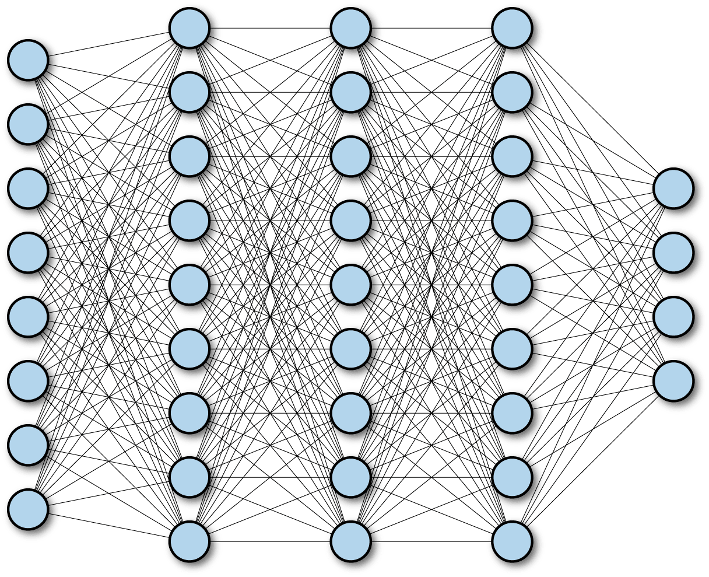

# Churn prediction

## Intro to Neural Networks. Churn prediction

Summary:\_ This project is an introduction to artificial neural networks: fully connected neural networks, hidden layers, activation functions, back-propagation, dropout.

💡 [Tap here](https://new.oprosso.net/p/4cb31ec3f47a4596bc758ea1861fb624) **to leave your feedback on the project**. It's anonymous and will help our team improve your educational experience. We recommend that you complete the survey immediately after the project.

## Contents

1. [Chapter I](#chapter-i) \
   1.1. [Preamble](#preamble)
2. [Chapter II](#chapter-ii) \
   2.1. [Introduction](#introduction)
3. [Chapter III](#chapter-iii) \
   3.1. [Goals](#goals)
4. [Chapter IV](#chapter-iv) \
   4.1. [Instructions](#instructions)
5. [Chapter V](#chapter-v) \
   5.1. [Mandatory part](#mandatory-part)
6. [Chapter VI](#chapter-vi) \
   6.1. [Bonus part](#bonus-part)
7. [Chapter VII](#chapter-vii) \
   7.1. [Submission and peer-correction](#submission-and-peer-correction)

## Chapter I

How to learn at “School 21”:

- Here, you’ll find a unique learning experience with a lot of freedom. You’re given a task and left to find your own way to solve it, using whatever resources work best for you — whether that’s the Internet or AI tools like GigaChat. Just be mindful of information quality: verify, think critically, analyze, and compare.
- Peer-to-peer (P2P) learning is the exchange of knowledge and experience with peers, where everyone acts as both mentor and student. This approach allows you to gain a deeper understanding of the material by learning from one another.
- Feel free to ask for help: around you are peers who are also navigating this path for the first time. Share your own experience and ideas with others. Join Rocket.Chat to stay updated with the latest community announcements.
- Your learning is meaningless if you just copy someone else’s solutions. When receiving help from others, always make sure you fully understand the “why”, “how”, and “purpose” behind the solution. Don’t be afraid to make mistakes.
- Does the task seem impossible? Take a break, get some fresh air and clear your mind — this has helped many people. Maybe after that, the solution will come to you naturally.
- The learning process is just as important as the result. It’s not just about completing the task — it’s about understanding HOW to solve it.

### Preamble

Did you know that your brain is a natural neural network? It consists of an average of 90 billion neurons, which are interconnected by 100-1,000 trillion synaptic connections. When one neuron is activated, it transmits its signal to another neuron or does the opposite — inhibits the transmission of the signal. A combination of chemicals and electricity is used to do this.

Some research suggests that there is a hierarchy among the neurons in our brain. Some of them are responsible for recognizing certain basic figures. When they "see" them, they transmit the signal to the next neuron in the hierarchy. This next neuron might be responsible for recognizing "A". If it sees it, it passes the signal on to another neuron that might be responsible for "Apple".

This information was inspiring to people working in the field of artificial intelligence, and they decided to use some of the insights from the human brain to create artificial neural networks.

## Chapter II

### Introduction

Artificial neural networks are not as complex as natural ones. They are just inspired by brains. Still, they are a bit more complicated than classic machine learning algorithms.

In general, nothing changes — it is a subset of machine learning algorithms. So it needs data to make predictions. It can be used for classification and regression tasks when we talk about classical machine learning tasks.

In this project you will only work with Fully Connected Neural Networks (FCNN). These networks consist of neurons, each of which is connected to all other neurons in the previous and next layers.

The first layer is called the "input layer". Each of the neurons in this layer takes the value of one feature. For example, if you have 15 features in your dataset, you will have 15 neurons in the input layer.

The next layers are called the hidden layers. Each of them consists of neurons that perform a nonlinear transformation of the input they receive. The input is the sum of the product of the values and weights from the previous layer. For example, for the first neuron in the first hidden layer, you need to multiply each feature value by a weight and then calculate the sum. The hidden layer neuron passes this sum through an activation function, such as a sigmoid (as in logistic regression), and returns the value to the next layer. The neurons in the next layer will do the same.

The final layer is the output layer. It actually predicts something. For example, if you have a classification task where you have 4 classes, you will have 3 (n-1) neurons in the output layer.

In this example, you can think of the neural network as an ensemble full of logistic regressions. Training an FCNN means finding optimal values of weights that minimize the error.

There is the forward propagation mechanism — when you do the computations (multiplying weights and values and applying activation functions and making predictions). And there is the backward propagation mechanism — when you have the predictions, you calculate the error, and then adjust the weights (e.g., via stochastic gradient descent) from the last layers to the first layers. Going back and forth is how you train a neural network.

## Chapter III

### Goals

The goal of this project is to give you a first approach to neural networks. You will try to train a multilayer perceptron (FCNN) using several libraries, as well as create the same network using NumPy.

## Chapter IV

### Instructions

- This project will be evaluated by humans only. You are free to organize and name your files as you wish.
- Here and throughout, we use Python 3 as the only correct version of Python.
- The standard does not apply to this project. However, you are encouraged to be clear and structured in your source code design.
- Place the datasets in the **data** subfolder.

## Chapter V

### Mandatory part

#### a. Task

In this project you will work on a churn prediction. You need to predict which customers will stop being customers of the bank. You will need to use a multilayer perceptron for your final prediction.

- Baseline. Naive classifier where you use the most popular class for prediction.
- Random Forest. Solve the task with the random forest as another baseline solution, using grid search to find optimal hyperparameters.
- Scikit-learn. Solve the task using [MLPClassifier](https://scikit-learn.org/stable/modules/generated/sklearn.neural_network.MLPClassifier.html).
- Keras. Solve the task using Keras from the TensorFlow library.
- TensorFlow. Solve the task using the TensorFlow library.
- NumPy. Implement the best architecture you obtained earlier, but with NumPy using matrix computations. You need to train the model and use it for inference (prediction).

#### b. Dataset

You will work with the dataset of one of the Russian banks. It contains various data about their customers: financial information, their age, the services they used, and the goal — whether they will leave the bank in the next three months. There are two files: training and test. You will use the training data to fit the models and make predictions for the test dataset.

> **Note:** You can find the dataset in the project page: "p01\_bank\_data.zip".

The description of the fields:

| Variable: | Description: |
| --- | --- |
| AGE | Age (months) |
| AMOUNT\_RUB\_ATM\_PRC | The fraction of transactions with MCC to the |
| AMOUNT\_RUB\_CLO\_PRC |  |
| AMOUNT\_RUB\_NAS\_PRC |  |
| AMOUNT\_RUB\_SUP\_PRC |  |
| APP\_CAR | Ownership of car |
| APP\_COMP\_TYPE | Type of employer |
| APP\_DRIVING\_LICENSE | Driving license |
| APP\_EDUCATION | Education |
| APP\_EMP\_TYPE | Type of occupation |
| APP\_KIND\_OF\_PROP\_HABITATION | Type of habitation property |
| APP\_MARITAL\_STATUS | Marital status |
| APP\_POSITION\_TYPE | Position type |
| APP\_REGISTR\_RGN\_CODE | Code region |
| APP\_TRAVEL\_PASS | International passport |
| AVG\_PCT\_DEBT\_TO\_DEAL\_AMT | Average percentage of debt to deal amount (average annuity) |
| AVG\_PCT\_MONTH\_TO\_PCLOSE | Average percentage of the credit term left |
| CLNT\_JOB\_POSITION | Job position |
| CLNT\_JOB\_POSITION\_TYPE | Job position type |
| CLNT\_SALARY\_VALUE | Salary |
| CLNT\_SETUP\_TENOR | Months of being a customer |
| CLNT\_TRUST\_RELATION | Trust relation |
| CNT\_ACCEPTS\_MTP | Number of accepts in different campaign |
| CNT\_ACCEPTS\_TK |  |
| CNT\_TRAN\_ATM\_TENDENCY1M | Trend of transactions number by the MCC type (1 and 3 months) |
| CNT\_TRAN\_ATM\_TENDENCY3M |  |
| CNT\_TRAN\_AUT\_TENDENCY1M |  |
| CNT\_TRAN\_AUT\_TENDENCY3M |  |
| CNT\_TRAN\_CLO\_TENDENCY1M |  |
| CNT\_TRAN\_CLO\_TENDENCY3M |  |
| CNT\_TRAN\_MED\_TENDENCY1M |  |
| CNT\_TRAN\_MED\_TENDENCY3M |  |
| CNT\_TRAN\_SUP\_TENDENCY1M |  |
| CNT\_TRAN\_SUP\_TENDENCY3M |  |
| CR\_PROD\_CNT\_CC | Number of product used in the period (by the category products) |
| CR\_PROD\_CNT\_CCFP |  |
| CR\_PROD\_CNT\_IL |  |
| CR\_PROD\_CNT\_PIL |  |
| CR\_PROD\_CNT\_TOVR |  |
| CR\_PROD\_CNT\_VCU |  |
| DEAL\_GRACE\_DAYS\_ACC\_AVG | Grace metrics |
| DEAL\_GRACE\_DAYS\_ACC\_MAX |  |
| DEAL\_GRACE\_DAYS\_ACC\_S1X1 |  |
| DEAL\_YQZ\_IR\_MAX | Max and min interest rate for revolvers and annuities |
| DEAL\_YQZ\_IR\_MIN |  |
| DEAL\_YWZ\_IR\_MAX |  |
| DEAL\_YWZ\_IR\_MIN |  |

| ID: | Unique ID: |
| --- | --- |
| LDEAL\_ACT\_DAYS\_ACC\_PCT\_AVG | Metrics of activity in the period (credit contracts) |
| LDEAL\_ACT\_DAYS\_PCT\_AAVG |  |
| LDEAL\_ACT\_DAYS\_PCT\_CURR |  |
| LDEAL\_ACT\_DAYS\_PCT\_TR |  |
| LDEAL\_ACT\_DAYS\_PCT\_TR3 |  |
| LDEAL\_ACT\_DAYS\_PCT\_TR4 |  |
| LDEAL\_AMT\_MONTH | Other product metrics in the period (credit contracts) |
| LDEAL\_DELINQ\_PER\_MAXYQZ |  |
| LDEAL\_DELINQ\_PER\_MAXYWZ |  |
| LDEAL\_GRACE\_DAYS\_PCT\_MED |  |
| LDEAL\_TENOR\_MAX |  |
| LDEAL\_TENOR\_MIN |  |
| LDEAL\_USED\_AMT\_AVG\_YQZ |  |
| LDEAL\_USED\_AMT\_AVG\_YWZ |  |
| LDEAL\_YQZ\_CHRG |  |
| LDEAL\_YQZ\_COM |  |
| LDEAL\_YQZ\_PC |  |
| MAX\_PCLOSE\_DATE | Number of months until planned credit close date (max with annuities) |
| MED\_DEBT\_PRC\_YQZ | Median of debt percentage for annuities and revolvers |
| MED\_DEBT\_PRC\_YWZ |  |
| PACK | Service package |
| PRC\_ACCEPTS\_A\_AMOBILE | % of accepts in channels / product groups |
| PRC\_ACCEPTS\_A\_ATM |  |
| PRC\_ACCEPTS\_A\_EMAIL\_LINK |  |
| PRC\_ACCEPTS\_A\_MTP |  |
| PRC\_ACCEPTS\_A\_POS |  |
| PRC\_ACCEPTS\_A\_TK |  |
| PRC\_ACCEPTS\_MTP |  |
| PRC\_ACCEPTS\_TK |  |
| REST\_AVG\_CUR | Average current account balances |
| REST\_AVG\_PAYM | Average salary account balances |
| REST\_DYNAMIC\_CC\_1M | Trend of monthly average account balances per products (1 or 3 months) |
| REST\_DYNAMIC\_CC\_3M |  |
| REST\_DYNAMIC\_CUR\_1M |  |
| REST\_DYNAMIC\_CUR\_3M |  |
| REST\_DYNAMIC\_FDEP\_1M |  |
| REST\_DYNAMIC\_FDEP\_3M |  |
| REST\_DYNAMIC\_IL\_1M |  |
| REST\_DYNAMIC\_IL\_3M |  |
| REST\_DYNAMIC\_PAYM\_1M |  |
| REST\_DYNAMIC\_PAYM\_3M |  |
| REST\_DYNAMIC\_SAVE\_3M |  |
| SUM\_TRAN\_ATM\_TENDENCY1M | Trend of transactions amount per MCC (1 months and 3 months) |
| SUM\_TRAN\_ATM\_TENDENCY3M |  |
| SUM\_TRAN\_AUT\_TENDENCY1M |  |
| SUM\_TRAN\_AUT\_TENDENCY3M |  |
| SUM\_TRAN\_CLO\_TENDENCY1M |  |
| SUM\_TRAN\_CLO\_TENDENCY3M |  |
| SUM\_TRAN\_MED\_TENDENCY1M |  |
| SUM\_TRAN\_MED\_TENDENCY3M |  |
| SUM\_TRAN\_SUP\_TENDENCY1M |  |
| SUM\_TRAN\_SUP\_TENDENCY3M |  |

| TARGET: | Actual churn in the next 3 months: |
| --- | --- |
| TRANS\_AMOUNT\_TENDENCY3M | Ratio between transaction sum in the last 3 months to the last 6 months |
| TRANS\_CNT\_TENDENCY3M | Ratio between transaction number in the last 3 months to the last 6 months |
| TRANS\_COUNT\_ATM\_PRC | Ratio of MCC transactions to the all transactions in the period |
| TRANS\_COUNT\_NAS\_PRC |  |
| TRANS\_COUNT\_SUP\_PRC |  |
| TURNOVER\_CC | Average turnover in credit cards |
| TURNOVER\_DYNAMIC\_CC\_1M | Trend of monthly average turnovers in the period (1 or 3 months) |
| TURNOVER\_DYNAMIC\_CC\_3M |  |
| TURNOVER\_DYNAMIC\_CUR\_1M |  |
| TURNOVER\_DYNAMIC\_CUR\_3M |  |
| TURNOVER\_DYNAMIC\_IL\_1M |  |
| TURNOVER\_DYNAMIC\_IL\_3M |  |
| TURNOVER\_DYNAMIC\_PAYM\_1M |  |
| TURNOVER\_DYNAMIC\_PAYM\_3M |  |
| TURNOVER\_PAYM | Average turnover of salary accounts |

#### c. Implementation

You can work in Jupyter notebooks. The notebooks should be well formatted. You need to make a split on the train and test (20%) datasets with stratification. You can apply any preprocessing to the data: work with anomalies, missing values, feature generation and selection. Use a grid search to find the best hyperparameters.

In the last part of the assignment, when you implement your neural network, please use OOP principles.

At the end of your notebook(s), you will have to create a table with the results of your research, where you should show the name of the library, the algorithms, the hyperparameters, and the score (accuracy and AUC) of the models you used (including baseline solutions). Try to use dropout for model regularization.

#### d. Submission

When you are done working with the models, you need to save the final predictions in the CSV file with only two fields: "ID" and "TARGET". The order of the IDs should be the same as in the test data set you were given. The values of "TARGET" can be either the class or the probability.

You must obtain an AUC of at least 0.8183 on the test dataset with a neural network solution. This is calculated by an automated checker.

Your repository should contain one or more notebooks with your solutions and the prediction file.

## Chapter VI

### Bonus part

- Try to get a better AUC on the test dataset with a neural network solution — 0.83.
- Try to get an even better AUC on the test dataset with a neural network solution — 0.85.

## Chapter VII

### Submission and peer-connection

Submit your work to your Git repository as usual. Only the work in your repository will be graded.

Here are the things your peer reviewer will need to check:

- There are baseline solutions;
- There are all 4 required implementations of neural networks;
- The score achieved on the test dataset.