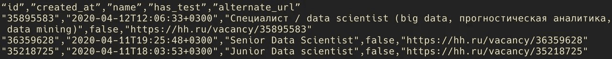

# UNIX: инструменты командной строки

Summary: В первый день ты научишься пользоваться утилитами командной строки UNIX для базовых задач Data Science. Ты освоишь `curl`, `sort`, `uniq`, `jq`, `sed` и `cat` и узнаешь, как применять их для сбора и предобработки данных.

💡 Если это твой первый проект, [заполни эту форму](http://opros.so/kAnXy).
💡 [Нажми сюда](https://new.oprosso.net/p/4cb31ec3f47a4596bc758ea1861fb624), **чтобы поделиться с нами обратной связью на этот проект**. Это анонимно и поможет нашей команде сделать обучение лучше. Рекомендуем заполнить опрос сразу после выполнения проекта.

## Содержание

1. [Глава I](#%D0%B3%D0%BB%D0%B0%D0%B2%D0%B0-i) \
   1.1. [Предисловие](#%D0%BF%D1%80%D0%B5%D0%B4%D0%B8%D1%81%D0%BB%D0%BE%D0%B2%D0%B8%D0%B5)
2. [Глава II](#%D0%B3%D0%BB%D0%B0%D0%B2%D0%B0-ii) \
   2.1. [Инструкция](#%D0%B8%D0%BD%D1%81%D1%82%D1%80%D1%83%D0%BA%D1%86%D0%B8%D1%8F)
3. [Глава III](#%D0%B3%D0%BB%D0%B0%D0%B2%D0%B0-iii) \
   3.1. [Упражнение 00. Первый shell-скрипт](#%D1%83%D0%BF%D1%80%D0%B0%D0%B6%D0%BD%D0%B5%D0%BD%D0%B8%D0%B5-00-%D0%BF%D0%B5%D1%80%D0%B2%D1%8B%D0%B9-shell-%D1%81%D0%BA%D1%80%D0%B8%D0%BF%D1%82)
4. [Глава IV](#%D0%B3%D0%BB%D0%B0%D0%B2%D0%B0-iv) \
   4.1. [Упражнение 01. Преобразование JSON в CSV](#%D1%83%D0%BF%D1%80%D0%B0%D0%B6%D0%BD%D0%B5%D0%BD%D0%B8%D0%B5-01-%D0%BF%D1%80%D0%B5%D0%BE%D0%B1%D1%80%D0%B0%D0%B7%D0%BE%D0%B2%D0%B0%D0%BD%D0%B8%D0%B5-json-%D0%B2-csv)
5. [Глава V](#%D0%B3%D0%BB%D0%B0%D0%B2%D0%B0-v) \
   5.1. [Упражнение 02. Сортировка файла](#%D1%83%D0%BF%D1%80%D0%B0%D0%B6%D0%BD%D0%B5%D0%BD%D0%B8%D0%B5-02-%D1%81%D0%BE%D1%80%D1%82%D0%B8%D1%80%D0%BE%D0%B2%D0%BA%D0%B0-%D1%84%D0%B0%D0%B9%D0%BB%D0%B0)
6. [Глава VI](#%D0%B3%D0%BB%D0%B0%D0%B2%D0%B0-vi) \
   6.1. [Упражнение 03. Замена строк в файле](#%D1%83%D0%BF%D1%80%D0%B0%D0%B6%D0%BD%D0%B5%D0%BD%D0%B8%D0%B5-03-%D0%B7%D0%B0%D0%BC%D0%B5%D0%BD%D0%B0-%D1%81%D1%82%D1%80%D0%BE%D0%BA-%D0%B2-%D1%84%D0%B0%D0%B9%D0%BB%D0%B5)
7. [Глава VII](#%D0%B3%D0%BB%D0%B0%D0%B2%D0%B0-vii) \
   7.1. [Упражнение 04. Описательная статистика](#%D1%83%D0%BF%D1%80%D0%B0%D0%B6%D0%BD%D0%B5%D0%BD%D0%B8%D0%B5-04-%D0%BE%D0%BF%D0%B8%D1%81%D0%B0%D1%82%D0%B5%D0%BB%D1%8C%D0%BD%D0%B0%D1%8F-%D1%81%D1%82%D0%B0%D1%82%D0%B8%D1%81%D1%82%D0%B8%D0%BA%D0%B0)
8. [Глава VIII](#%D0%B3%D0%BB%D0%B0%D0%B2%D0%B0-viii) \
   8.1. [Упражнение 05. Разбиение и конкатенация](#%D1%83%D0%BF%D1%80%D0%B0%D0%B6%D0%BD%D0%B5%D0%BD%D0%B8%D0%B5-05-%D1%80%D0%B0%D0%B7%D0%B1%D0%B8%D0%B5%D0%BD%D0%B8%D0%B5-%D0%B8-%D0%BA%D0%BE%D0%BD%D0%BA%D0%B0%D1%82%D0%B5%D0%BD%D0%B0%D1%86%D0%B8%D1%8F)

## Глава I

### Предисловие

С древнейших времен человечеству известно: для принятия взвешенных решений необходимо владеть информацией, или данными. В Древнем Египте, например, государство, чтобы заранее подсчитать, сколько денег поступит в казну, проводило переписи населения. А ещё раньше пастухи считали поголовье стада, чтобы решить, какую долю животных можно продать, а какую — оставить для собственных нужд.

Со временем методы обработки данных становились всё точнее и, как следствие, всё сложнее. Сегодня мы умеем восполнять пробелы в знаниях с помощью прогнозов, построенных с помощью алгоритмов машинного обучения. Теперь мы можем заглядывать в будущее, например, предсказывать спрос на продукты и заранее наращивать необходимые мощности. Банк может оценить вероятность того, вернёт ли конкретный заёмщик кредит, и, используя полученные данные, распределить ресурсы максимально эффективно, что в конечном счёте увеличит прибыль.

Развиваются не только алгоритмы, но и технологии, а также инструменты, которые делают анализ данных дешевле и доступнее. Именно они демократизировали эту сферу. Теперь компаниям гораздо проще начать использовать результаты обработки больших массивов данных. Отсюда и растущий интерес к таким актуальным понятиям, как «большие данные», «искусственный интеллект» и другим.

Сегодня работа с большими объёмами информации уже не является привилегией держателей огромных бюджетов, располагающих колоссальными ресурсами, — работать с данными и извлекать из них ценность может практически каждый.

Как верно замечено в сериале «Мистер Робот»:
«Мы живём в поистине захватывающее время!»

## Глава II

### Инструкция

Как учиться в «Школе 21»:

- Здесь тебя ждет уникальный образовательный опыт с большим количеством свободы. Ты получаешь задачу и самостоятельно ищешь пути решения, используя любые удобные способы поиска информации — ресурсы Интернета или нейросети (например, GigaChat). Но внимательно относись к качеству информации: проверяй, думай, анализируй, сравнивай.
- Взаимообучение (Peer-to-Peer, P2P) — это обмен знаниями и опытом с другими пирами, где каждый выступает и учителем, и учеником. Такой подход позволяет глубже понять материал, учась друг у друга.
- Чувствуй себя свободно и проси о помощи — вокруг тебя те, кто тоже впервые проходят этот путь. Делись своим опытом и идеями с другими. Присоединяйся к Rocket.Chat, чтобы быть в курсе всех новостей от нашего сообщества.
- Твое обучение не будет иметь никакого смысла, если ты будешь копировать чужие решения. Если пользуешься помощью других — всегда разбирайся до конца, почему, как и зачем. Не бойся ошибиться.
- Кажется, что задача невыполнима? Сделай перерыв, проветрись, перезагрузи голову — это помогало многим. Возможно, после этого решение придет само собой.
- Важен не только результат обучения, но и сам процесс. Нужно не просто решить задачу, а понять, КАК ее решить.

Как работать с проектом:

- Не обращай внимание на слухи, подсказки и догадки. Если сомневаешься, как выполнять задание — обращайся к этой инструкции, и только к ней.
- Здесь и далее (в заданиях, где используется Python) единственной допустимой версией Python является Python 3.
- Если ты выполняешь задания на Python (module01, module02, module03), в каждом python-файле в конце добавляй служебный блок `if __name__ == ‘__main__’`.
- Перепроверь настройки прав доступа к файлам и каталогам.
- Чтобы твоё решение приняли к оценке, оно должно лежать в твоём GIT-репозитории.
- Оценивание выполняют твои пиры по интенсиву.
- В твоей директории не должно быть иных файлов, кроме тех, что обозначены в заданиях. Настрой `.gitignore`, чтобы исключить случайные файлы и папки из проверки.
- Чтобы твоё решение приняли к оценке, оно должно лежать в твоём GIT-репозитории. Всегда делай push только в ветку develop! Ветка master будет проигнорирована. Работай в директории src.
- Если требуется точный вывод, запрещено подменять результат заранее подготовленным выводом — твое решение должно реально выполнять задачу.
- Есть вопрос? Спроси соседа справа. Если это не помогло — соседа слева.
- Не забывай, что информация в интернете всегда с тобой. Как и пиры. Общайся. Ищи.
- Внимательно читай примеры. В них может быть что-то, что не указано в явном виде в самом задании.
- Да пребудет с тобой Сила!

## Глава III

### Упражнение 00. Первый shell-скрипт

- Каталог для сдачи: `ex00/`.
- Файлы для сдачи: `hh.sh`, `hh.json`.
- Разрешённые импорты: `curl`, `jq`.

В этом упражнении ты будешь взаимодействовать с HeadHunter API для получения информации о вакансиях. Чтобы выполнить задание, тебе нужно понимать, как работают `curl` и HeadHunter API.

Напиши shell-скрипт, который:

- Принимает в качестве аргумента название вакансии — «data scientist» (в следующих упражнениях это пригодится).
- Загружает информацию о первых 20 вакансиях, соответствующих параметрам поиска.
- Сохраняет результат в файл `hh.json`.

Формат результата в файле должен быть таким, чтобы каждое поле было на новой строке. См. пример в `ex00_sample.json`.

Скрипт должен быть исполняемым. Используемый интерпретатор: `/bin/sh`.

Помести скрипт и результаты парсинга в каталог `ex00` внутри каталога `src` твоего репозитория.

## Глава IV

### Упражнение 01. Преобразование JSON в CSV

- Каталог для сдачи: `ex01/`.
- Файлы для сдачи: `filter.jq`, `json_to_csv.sh`, `hh.csv`.
- Разрешённые импорты: `jq`.

В предыдущем упражнении у тебя получился JSON-файл. Хоть JSON и является популярным форматом для API, для анализа данных он неудобен. Поэтому тебе нужно преобразовать его в CSV — с ним работать проще.

Напиши shell-скрипт `json_to_csv.sh`, который:

- Запускает `jq` с фильтром, записанным в отдельный файл `filter.jq`.
- Извлекает следующие 5 столбцов по вакансиям: `"id"`, `"created_at"`, `"name"`, `"has_test"`, `"alternate_url"`.
- Сохраняет результат в CSV-файл `hh.csv`.

См. пример ниже:



В первой строке CSV должны быть заголовки столбцов.

Скрипт должен быть исполняемым. Используемый интерпретатор: `/bin/sh`.

Помести файл фильтра, который конвертирует JSON в CSV, а также результат конвертации в каталог `ex01` внутри каталога `src` твоего репозитория.

## Глава V

### Упражнение 02. Сортировка файла

- Каталог для сдачи: `ex02/`.
- Файлы для сдачи: `sorter.sh`, `hh_sorted.csv`.
- Разрешённые импорты: `cat`, `sort`, `head`, `tail`.

Иногда для следующих этапов анализа бывает полезно расположить данные не в произвольном порядке, а особым образом, отсортированными по определённому критерию. В этом упражнении тебе потребуется отсортировать CSV-файл с несколькими столбцами.

Напиши shell-скрипт `sorter.sh`, который:

- Сортирует файл `hh.csv` из предыдущего упражнения по столбцу `"created_at"`, а затем по `"id"` по возрастанию.
- Сохраняет результат в CSV-файл `hh_sorted.csv`.

В первой строке CSV должны оставаться заголовки столбцов.

Скрипт должен быть исполняемым. Используемый интерпретатор: `/bin/sh`.

Помести скрипт и результат сортировки в каталог `ex02` внутри каталога `src` твоего репозитория.

## Глава VI

### Упражнение 03. Замена строк в файле

- Каталог для сдачи: `ex03/`.
- Файлы для сдачи: `cleaner.sh`, `hh_positions.csv`.
- Разрешённые импорты: без ограничений.

Исходные данные обычно неструктурированы — в них трудно разобраться. Перед тем как приступить к анализу, их необходимо тщательно обработать. Это упражнение как раз посвящено процессу предобработки. Если вы посмотрите на файл из предыдущего задания, то увидите, что все вакансии с названием «Data Scientist» в нём подсвечены (проверять это не нужно). В этом нет ничего удивительного — мы ведь использовали эту строку как ключевой запрос для поиска через API HeadHunter. Однако это выделение не несёт полезной информации ни для нас, ни для алгоритмов. По сути, это просто шум, который только мешает анализу.

Напиши shell-скрипт `cleaner.sh`, который:

- Извлекает из названия позиции позицию «Junior», «Middle» или «Senior».
  - Если ни одного из этих слов нет, подставь «-».
    - Примеры:
      - `"Senior Data Scientist"` → `"Senior"`
      - `"Analyst/Data Scientist"` → `"-"`
      - `"Specialist/Data Scientist (Big Data, Predictive Analytics, Data Mining)"` → `"-"`
  - Если встречается несколько позиций — оставь все:
    - `"Middle/Senior Data Scientist"` → `"Middle/Senior"`
- Сохраняет результат в CSV-файл `hh_positions.csv`.

См. пример ниже:

```
"id","created_at","name","has_test","alternate_url"
"35218725","2020-04-11T18:03:53+0300","Junior",false,"https://hh.ru/vacancy/35218725"
"36359628","2020-04-11T19:25:48+0300","Senior",false,"https://hh.ru/vacancy/36359628"
"35895583","2020-04-12T12:06:33+0300","-",false,"https://hh.ru/vacancy/35895583"
```

CSV-файл должен содержать заголовки в первой строке и быть отсортирован как в предыдущем упражнении.

Скрипт должен быть исполняемым. Используемый интерпретатор: `/bin/sh`.

Помести скрипт и результаты очистки в каталог `ex03` внутри каталога `src` твоего репозитория.

## Глава VII

### Упражнение 04. Описательная статистика

- Каталог для сдачи: `ex04/`.
- Файлы для сдачи: `counter.sh`, `hh_uniq_positions.csv`.
- Разрешённые инструменты: без ограничений.

Прежде чем переходить к сложным методам анализа, полезно составить общее представление о данных. В этом упражнении тебе потребуется посчитать количество уникальных названий должностей в файле. Это поможет выявить возможное смещение в данных. Скажем, может оказаться, что вакансий для старших специалистов (Senior) больше, чем для начинающих (Junior). Эти наблюдения могут быть полезны для дальнейшего анализа.

Напиши shell-скрипт `counter.sh`, который:

- Считает число уникальных значений в столбце `name` файла, подготовленного в предыдущем упражнении.
- Сортирует таблицу по этому числу по убыванию.
- Сохраняет результат в CSV-файл `hh_uniq_positions.csv`.

Пример:

```
"name","count"
"Junior",10
"Middle",5
"Senior",3
```

В первой строке CSV должны быть заголовки столбцов, как в примере.

Скрипт должен быть исполняемым. Используемый интерпретатор: `/bin/sh`.

Помести скрипт и результаты подсчёта в каталог `ex04` внутри каталога `src` твоего репозитория.

## Глава VIII

### Упражнение 05. Разбиение и конкатенация

- Каталог для сдачи: `ex05/`.
- Файлы для сдачи: `partitioner.sh`, `concatenator.sh`.
- Разрешённые импорты: без ограничений.

При работе с большими наборами данных их часто разбивают на более мелкие части — партиции. Каждая такая партиция содержит данные из определённого диапазона ключей. Один из самых распространённых подходов — партиционирование по дате, когда в каждой партиции хранятся данные за конкретный день. В этом упражнении тебе предстоит выполнить такое разделение, а затем провести обратную операцию — объединить партиции обратно.

Напиши shell-скрипт `partitioner.sh`, который:

- Принимает на ввод результат Упражнения 03.
- Сохраняет срезы данных с разными значениями `created_at` в отдельные CSV-файлы, названные по соответствующей дате.

Пример содержимого такого файла:

```
"id","created_at","name","has_test","alternate_url"
"35218725","2020-04-11T18:03:53+0300","Junior",false,"https://hh.ru/vacancy/35218725"
"36359628","2020-04-11T19:25:48+0300","Senior",false,"https://hh.ru/vacancy/36359628"
```

Напиши shell-скрипт `concatenator.sh`, который:

- Принимает на ввод отдельные файлы, полученные `partitioner.sh`.
- Объединяет все эти файлы в один CSV-файл.

CSV-файл должен содержать заголовки в первой строке, как в примере. Результирующий CSV, полученный `concatenator.sh`, должен совпадать с результатом Упражнения 03.

Скрипты должны быть исполняемыми. Используемый интерпретатор: `/bin/sh`.

Помести оба скрипта в каталог `ex05` внутри каталога `src` твоего репозитория.