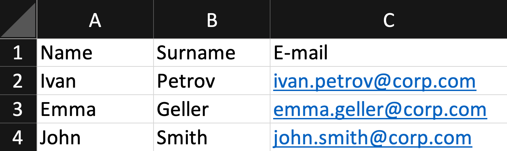

# Введение в Python: синтаксис и семантика

Резюме: Сегодня ты получишь базовые знания о синтаксисе и семантике Python.

💡 [Нажми сюда](https://new.oprosso.net/p/4cb31ec3f47a4596bc758ea1861fb624) **чтобы поделиться с нами обратной связью на этот проект**. Это анонимно и поможет нашей команде сделать обучение лучше. Рекомендуем заполнить опрос сразу после выполнения проекта.

## Содержание

1. [Глава I](#%D0%B3%D0%BB%D0%B0%D0%B2%D0%B0-i) \
   1.1. [Предисловие](#%D0%BF%D1%80%D0%B5%D0%B4%D0%B8%D1%81%D0%BB%D0%BE%D0%B2%D0%B8%D0%B5)
2. [Глава II](#%D0%B3%D0%BB%D0%B0%D0%B2%D0%B0-ii) \
   2.1. [Инструкция](#%D0%B8%D0%BD%D1%81%D1%82%D1%80%D1%83%D0%BA%D1%86%D0%B8%D1%8F)
3. [Глава III](#%D0%B3%D0%BB%D0%B0%D0%B2%D0%B0-iii) \
   3.1. [Дополнительные инструкции на сегодня](#%D0%B4%D0%BE%D0%BF%D0%BE%D0%BB%D0%BD%D0%B8%D1%82%D0%B5%D0%BB%D1%8C%D0%BD%D1%8B%D0%B5-%D0%B8%D0%BD%D1%81%D1%82%D1%80%D1%83%D0%BA%D1%86%D0%B8%D0%B8-%D0%BD%D0%B0-%D1%81%D0%B5%D0%B3%D0%BE%D0%B4%D0%BD%D1%8F)
4. [Глава IV](#%D0%B3%D0%BB%D0%B0%D0%B2%D0%B0-iv) \
   4.1. [Упражнение 00. Типы данных](#%D1%83%D0%BF%D1%80%D0%B0%D0%B6%D0%BD%D0%B5%D0%BD%D0%B8%D0%B5-00-%D1%82%D0%B8%D0%BF%D1%8B-%D0%B4%D0%B0%D0%BD%D0%BD%D1%8B%D1%85)
5. [Глава V](#%D0%B3%D0%BB%D0%B0%D0%B2%D0%B0-v) \
   5.1. [Упражнение 01. Работа с файлами](#%D1%83%D0%BF%D1%80%D0%B0%D0%B6%D0%BD%D0%B5%D0%BD%D0%B8%D0%B5-01-%D1%80%D0%B0%D0%B1%D0%BE%D1%82%D0%B0-%D1%81-%D1%84%D0%B0%D0%B9%D0%BB%D0%B0%D0%BC%D0%B8)
6. [Глава VI](#%D0%B3%D0%BB%D0%B0%D0%B2%D0%B0-vi) \
   6.1. [Упражнение 02. Поиск по ключу](#%D1%83%D0%BF%D1%80%D0%B0%D0%B6%D0%BD%D0%B5%D0%BD%D0%B8%D0%B5-02-%D0%BF%D0%BE%D0%B8%D1%81%D0%BA-%D0%BF%D0%BE-%D0%BA%D0%BB%D1%8E%D1%87%D1%83)
7. [Глава VII](#%D0%B3%D0%BB%D0%B0%D0%B2%D0%B0-vii) \
   7.1. [Упражнение 03. Поиск по значению и по ключу](#%D1%83%D0%BF%D1%80%D0%B0%D0%B6%D0%BD%D0%B5%D0%BD%D0%B8%D0%B5-03-%D0%BF%D0%BE%D0%B8%D1%81%D0%BA-%D0%BF%D0%BE-%D0%B7%D0%BD%D0%B0%D1%87%D0%B5%D0%BD%D0%B8%D1%8E-%D0%B8-%D0%BF%D0%BE-%D0%BA%D0%BB%D1%8E%D1%87%D1%83)
8. [Глава VIII](#%D0%B3%D0%BB%D0%B0%D0%B2%D0%B0-viii) \
   8.1. [Упражнение 04. Словари](#%D1%83%D0%BF%D1%80%D0%B0%D0%B6%D0%BD%D0%B5%D0%BD%D0%B8%D0%B5-04-%D1%81%D0%BB%D0%BE%D0%B2%D0%B0%D1%80%D0%B8)
9. [Глава IX](#%D0%B3%D0%BB%D0%B0%D0%B2%D0%B0-ix) \
   9.1. [Упражнение 05. Поиск по значению или по ключу](#%D1%83%D0%BF%D1%80%D0%B0%D0%B6%D0%BD%D0%B5%D0%BD%D0%B8%D0%B5-05-%D0%BF%D0%BE%D0%B8%D1%81%D0%BA-%D0%BF%D0%BE-%D0%B7%D0%BD%D0%B0%D1%87%D0%B5%D0%BD%D0%B8%D1%8E-%D0%B8%D0%BB%D0%B8-%D0%BF%D0%BE-%D0%BA%D0%BB%D1%8E%D1%87%D1%83)
10. [Глава X](#%D0%B3%D0%BB%D0%B0%D0%B2%D0%B0-x) \
    10.1. [Упражнение 06. Сортировка словаря](#%D1%83%D0%BF%D1%80%D0%B0%D0%B6%D0%BD%D0%B5%D0%BD%D0%B8%D0%B5-06-%D1%81%D0%BE%D1%80%D1%82%D0%B8%D1%80%D0%BE%D0%B2%D0%BA%D0%B0-%D1%81%D0%BB%D0%BE%D0%B2%D0%B0%D1%80%D1%8F)
11. [Глава XI](#%D0%B3%D0%BB%D0%B0%D0%B2%D0%B0-xi) \
    11.1. [Упражнение 07. Множества](#%D1%83%D0%BF%D1%80%D0%B0%D0%B6%D0%BD%D0%B5%D0%BD%D0%B8%D0%B5-07-%D0%BC%D0%BD%D0%BE%D0%B6%D0%B5%D1%81%D1%82%D0%B2%D0%B0)
12. [Глава XII](#%D0%B3%D0%BB%D0%B0%D0%B2%D0%B0-xii) \
    12.1. [Упражнение 08. Работа со строками как со списками](#%D1%83%D0%BF%D1%80%D0%B0%D0%B6%D0%BD%D0%B5%D0%BD%D0%B8%D0%B5-08-%D1%80%D0%B0%D0%B1%D0%BE%D1%82%D0%B0-%D1%81%D0%BE-%D1%81%D1%82%D1%80%D0%BE%D0%BA%D0%B0%D0%BC%D0%B8-%D0%BA%D0%B0%D0%BA-%D1%81%D0%BE-%D1%81%D0%BF%D0%B8%D1%81%D0%BA%D0%B0%D0%BC%D0%B8)
13. [Глава XIII](#%D0%B3%D0%BB%D0%B0%D0%B2%D0%B0-xiii) \
    13.1. [Упражнение 09. Шифр Цезаря](#%D1%83%D0%BF%D1%80%D0%B0%D0%B6%D0%BD%D0%B5%D0%BD%D0%B8%D0%B5-09-%D1%88%D0%B8%D1%84%D1%80-%D1%86%D0%B5%D0%B7%D0%B0%D1%80%D1%8F)

## Глава I

### Предисловие

Python - самый популярный язык программирования в области анализа данных. Благодаря чему он так хорошо подходит для этих задач? Прежде всего, это интерпретируемый язык. Это свойство позволяет пользователю легко взаимодействовать с отдельными блоками кода и мгновенно получать результат - именно то, что нужно, когда анализируешь данные под разными углами или подбираешь гиперпараметры для модели машинного обучения. Добавьте к этому богатый набор библиотек для научных задач, включая Data Science, и простой, лаконичный синтаксис - вот вам и готовая формула языка №1 для работы с данными.

Предлагаю вам ознакомиться с 19 изящными принципами, которые повлияли на дизайн Python (они известны как The Zen of Python):

- Красивое лучше, чем уродливое.
- Явное лучше, чем неявное.
- Простое лучше, чем сложное.
- Сложное лучше, чем запутанное.
- Плоское лучше, чем вложенное.
- Разреженное лучше, чем плотное.
- Читаемость имеет значение.
- Особые случаи не настолько особые, чтобы нарушать правила.
- При этом практичность важнее безупречности.
- Ошибки не должны проходить незамеченными.
- Если они не были явно подавленными.
- Встретив двусмысленность, отбрось искушение угадать.
- Должен существовать один и, желательно, только один очевидный способ сделать это.
- Хотя он поначалу может быть и не очевиден, если вы не голландец.
- Сейчас лучше, чем никогда.
- Хотя никогда зачастую лучше, чем прямо сейчас.
- Если реализацию сложно объяснить - идея плоха.
- Если реализацию легко объяснить - идея, возможно, хороша.
- Пространства имён - отличная штука! Будем делать их больше!

Если вы забудете какой-либо из этих принципов, просто выполните в Python команду import this - и они сразу появятся.

## Глава II

### Инструкция

Как учиться в «Школе 21»:

- Здесь тебя ждет уникальный образовательный опыт с большим количеством свободы. Ты получаешь задачу и самостоятельно ищешь пути решения, используя любые удобные способы поиска информации — ресурсы Интернета или нейросети (например, GigaChat). Но внимательно относись к качеству информации: проверяй, думай, анализируй, сравнивай.
- Взаимообучение (Peer-to-Peer, P2P) — это обмен знаниями и опытом с другими пирами, где каждый выступает и учителем, и учеником. Такой подход позволяет глубже понять материал, учась друг у друга.
- Чувствуй себя свободно и проси о помощи — вокруг тебя те, кто тоже впервые проходят этот путь. Делись своим опытом и идеями с другими. Присоединяйся к Rocket.Chat, чтобы быть в курсе всех новостей от нашего сообщества.
- Твое обучение не будет иметь никакого смысла, если ты будешь копировать чужие решения. Если пользуешься помощью других — всегда разбирайся до конца, почему, как и зачем. Не бойся ошибиться.
- Кажется, что задача невыполнима? Сделай перерыв, проветрись, перезагрузи голову — это помогало многим. Возможно, после этого решение придет само собой.
- Важен не только результат обучения, но и сам процесс. Нужно не просто решить задачу, а понять, КАК ее решить.

Как работать с проектом:

- Не обращай внимание на слухи, подсказки и догадки. Если сомневаешься, как выполнять задание - обращайся к этой инструкции, и только к ней.
- Здесь и далее (в заданиях, где используется Python) единственной допустимой версией Python является Python 3.
- Если ты выполняешь задания на Python (module01, module02, module03), в каждом python-файле в конце добавляй служебный блок `if __name__ == '__main__'`.
- Перепроверь настройки прав доступа к файлам и каталогам.
- Чтобы твоё решение приняли к оценке, оно должно лежать в твоём GIT-репозитории.
- Оценивание выполняют твои пиры по интенсиву.
- В твоей директории не должно быть иных файлов, кроме тех, что обозначены в заданиях. Настрой .gitignore, чтобы исключить случайные файлы и папки из проверки.
- Чтобы твоё решение приняли к оценке, оно должно лежать в твоём GIT-репозитории. Всегда делай push только в ветку develop! Ветка master будет проигнорирована. Работай в директории src.
- Если требуется точный вывод, запрещено подменять результат заранее подготовленным выводом - твое решение должно реально выполнять задачу.
- Есть вопрос? Спроси соседа справа. Если это не помогло - соседа слева.
- Не забывай, что информация в интернете всегда с тобой. Как и пиры. Общайся. Ищи.
- Внимательно читай примеры. В них может быть что-то, что не указано в явном виде в самом задании.
- Да пребудет с тобой Сила!

## Глава III

### Дополнительные инструкции на сегодня

- Никакого кода в глобальной области видимости. Используй функции!
- В конце каждого файла должен быть вызов функции внутри условия вида: `if __name__ == '__main__': your_function(whatever parameter is required)`.
- Обработку ошибок можно разместить в этом же условии.
- Импорты запрещены, кроме тех, что указаны в разделе «Разрешённые импорты/функции» в шапке каждого упражнения.
- Разрешены любые встроенные функции, если в упражнении не указано иное.
- Исключения, выбрасываемые open(), не нужно обрабатывать.
- Используемый интерпретатор: Python 3.

## Глава IV

### Упражнение 00. Типы данных

- Turn-in directory: `ex00/`.
- Files to turn in: `data_types.py`.
- Allowed functions: любой импорт запрещён.

Как и в любом другом языке, в Python есть несколько встроенных типов данных. В этом упражнении ты познакомишься с самыми популярными и полезными.

1. Создай скрипт data\_types.py и определи функцию data\_types(). В этой функции объяви 8 переменных разных типов и выведи их типы в стандартный поток вывода.
2. Тебе нужно **в точности** воспроизвести следующий вывод:

   ```
    > python3 data_types.py
    [int, str, float, bool, list, dict, tuple, set]
   ```
3. Не вписывай названия типов вручную в print. Не забудь вызвать свою функцию в конце скрипта, как указано в сегодняшних инструкциях:

   ```
    if __name__ == '__main__':
        data_types()
   ```
4. Помести файл в каталог ex00 внутри каталога src твоего репозитория.

## Глава V

### Упражнение 01. Работа с файлами

- Turn-in directory: `ex01/`.
- Files to turn in: `read_and_write.py`.
- Allowed functions: любой импорт запрещён.

В этом упражнении ты можешь определить столько функций, сколько потребуется, и назвать их как угодно. В прикреплённом файле [ds.csv](https://drive.google.com/file/d/1tDEDTytYaUrfJsXD5z5QvJSb5VNlL-eZ/view) (вспомни предыдущий день) есть несколько столбцов, разделённых запятыми, с разными данными о вакансиях.

1. Разработай скрипт на Python read\_and\_write.py, который открывает файл ds.csv, считывает содержащиеся в нём данные, заменяет все разделители-запятые на "\t" и сохраняет данные в новый файл ds.tsv. Будь внимателен: в данных могут встречаться запятые. Если ты заменишь их, данные будут повреждены.
2. Помести скрипт в каталог ex01 внутри каталога src твоего репозитория.

## Глава VI

### Упражнение 02. Поиск по ключу

- Turn-in directory: `ex02/`.
- Files to turn in: `stock_prices.py`.
- Allowed functions: `import sys`.

1. У тебя есть следующие словари, скопируй их в одну из своих функций:

   ```
    COMPANIES = {
    'Apple': 'AAPL',
    'Microsoft': 'MSFT',
    'Netflix': 'NFLX',
    'Tesla': 'TSLA',
    'Nokia': 'NOK'
    }

    STOCKS = {
    'AAPL': 287.73,
    'MSFT': 173.79,
    'NFLX': 416.90,
    'TSLA': 724.88,
    'NOK': 3.37
    }
   ```
2. Напиши программу, которая принимает в качестве аргумента название компании (например, Apple) и выводит в стандартный поток её цену акции (например, 287.73). Если программе передано название компании, которой нет в словаре, она должна вывести "Unknown company". Если аргументы не переданы или их слишком много, программа не должна делать ничего и должна завершиться.

   ```
    $> python3 stock_prices.py tesla
    724.88
    $> python3 stock_prices.py Facebook
    Unknown company
    $> python3 stock_prices.py Tesla Apple
   ```

## Глава VII

### Упражнение 03. Поиск по значению и по ключу

- Turn-in directory: `ex03/`.
- Files to turn in: `ticker_symbols.py`.
- Allowed functions: `import sys`.

1. Используй те же два словаря, что и в предыдущем упражнении. Ещё раз скопируй их, используя одну из функций в твоём скрипте.
2. Создай программу, которая принимает тикер (например, AAPL) и выводит название компании и цену акции, разделённые пробелом. Поведение программы должно быть идентично предыдущему упражнению.

   ```
    $> python3 ticker_symbols.py tsla
    Tesla 724.88
    $> python3 ticker_symbols.py FB
    Unknown ticker
    $> python3 ticker_symbols.py TSLA AAPL
   ```

## Глава VIII

### Упражнение 04. Словари

- Turn-in directory: `ex04/`.
- Files to turn in: `to_dictionary.py`.
- Allowed functions: любой импорт запрещён.

1. Создай скрипт с именем to\_dictionary.py. В одной из функций скопируй следующий список кортежей как есть:

   ```
    list_of_tuples = [
    ('Russia', '25'),
    ('France', '132'),
    ('Germany', '132'),
    ('Spain', '178'),
    ('Italy', '162'),
    ('Portugal', '17'),
    ('Finland', '3'),
    ('Hungary', '2'),
    ('The Netherlands', '28'),
    ('The USA', '610'),
    ('The United Kingdom', '95'),
    ('China', '83'),
    ('Iran', '76'),
    ('Turkey', '65'),
    ('Belgium', '34'),
    ('Canada', '28'),
    ('Switzerland', '26'),
    ('Brazil', '25'),
    ('Austria', '14'),
    ('Israel', '12')
    ]
   ```
2. Твой скрипт должен преобразовать эту переменную в словарь, где ключ - число, а значение - страна. Как видишь, у одного и того же ключа может быть несколько значений. Скрипт должен вывести содержимое словаря в стандартный поток вывода **строго** в следующем формате:

   ```
    '132' : 'France'
    '132' : 'Germany'
    '178' : 'Spain'
    ...
   ```
3. Подумай, почему порядок не обязательно совпадает с порядком в примере.

## Глава IX

### Упражнение 05. Поиск по значению или по ключу

- Turn-in directory: `ex05/`.
- Files to turn in: `all_stocks.py`.
- Allowed functions: `import sys`.

1. У тебя есть два словаря из ex02. Скопируй их снова в одну из функций твоего скрипта.
2. Напиши программу со следующим поведением:
   - Программа должна принимать в качестве аргумента строку, содержащую множество выражений, разделённых запятыми.
   - Для каждого выражения в строке программа должна определять, является ли оно названием компании, тикером или не тем и не другим.
   - Программа не должна зависеть от регистра, но должна корректно работать с пробелами.
   - Если аргументы отсутствуют или их слишком много, программа не должна ничего выводить.
   - Если в строке встречаются две запятые подряд, программа не должна ничего выводить.
   - Программа должна выводить результаты, разделённые переводами строки, и использовать следующий формат:

     ```
     $ python3 all_stocks.py 'TSLA , aPPle, Facebook'
     TSLA is a ticker symbol for Tesla
     Apple stock price is 287.73
     Facebook is an unknown company or an unknown ticker symbol
     $ python3 all_stocks.py 'TSLA,, apple'
     $ python3 all_stocks.py 'TSLA, , apple'
     $ python3 all_stocks.py TSLA AAPL
     ```

## Глава X

### Упражнение 06. Сортировка словаря

- Turn-in directory: `ex06/`.
- Files to turn in: `dict_sorter.py`.
- Allowed functions: любой импорт запрещён.

1. Для этого упражнения возьми список кортежей из ex04, содержащий страны и числа, и создай словарь, где ключами будут страны, а значениями - числа. Скопируй его в одну из функций в скрипте.
2. Напиши программу, которая выводит названия стран в порядке убывания по числу, а при равенстве чисел - в алфавитном порядке по названию. Выводи по одному на строке, без чисел:

   ```
   The USA
   Spain
   Italy
   France
   Germany
   ...
   ```

## Глава XI

### Упражнение 07. Множества

- Turn-in directory: `ex07/`.
- Files to turn in: `marketing.py`.
- Allowed functions: `import sys`.

В этом упражнении представь, что ты работаешь в отделе маркетинга. Ты будешь работать с двумя разными списками почтовых адресов. Первый список содержит адреса твоих клиентов. Второй список содержит адреса участников последнего мероприятия, среди них есть и твои клиенты. Третий список содержит адреса клиентов, которые просмотрели твоё последнее рекламное письмо.

Тебе нужно сделать следующее:

1. Составить список клиентов, которые ещё не видели рекламное письмо. Этот список будет передан в колл-центр для последующей связи с этими людьми.
2. Составить список участников, которые не являются твоими клиентами. Отправь им вводное письмо, в котором содержится информация о твоих продуктах продуктах.
3. Составить список клиентов, которые не участвовали в мероприятии. Отправь им ссылку на видео и слайды презентации с мероприятия.

Технические детали:

- Создай отдельные функции, которые преобразуют твои списки в множества. Используй операции над множествами, необходимые для выполнения перечисленных бизнес-задач, и возвращай требуемые списки почтовых адресов.
- Оформи код в виде скрипта. Скрипт принимает в качестве аргумента название выполняемой задачи: `call_center`, `potential_clients` или `loyalty_program`. Если передано неверное название, выбрось исключение.
- Для этого упражнения используй следующие три списка:

  ```
  clients = ['andrew@gmail.com', 'jessica@gmail.com', 'ted@mosby.com',
  'john@snow.is', 'bill_gates@live.com', 'mark@facebook.com',
  'elon@paypal.com', 'jessica@gmail.com']
  participants = ['walter@heisenberg.com', 'vasily@mail.ru',
  'pinkman@yo.org', 'jessica@gmail.com', 'elon@paypal.com',
  'pinkman@yo.org', 'mr@robot.gov', 'eleven@yahoo.com']
  recipients = ['andrew@gmail.com', 'jessica@gmail.com', 'john@snow.is']
  ```

## Глава XII

### Упражнение 08. Работа со строками как со списками

- Turn-in directory: `ex08/`.
- Files to turn in: `names_extractor.py`, `letter_starter.py`.
- Allowed functions: `import sys`.

Представь, что ты работаешь в корпорации, где все почтовые адреса имеют единый шаблон: [name.surname@corp.com](mailto:name.surname@corp.com).

1. Создай скрипт, который принимает путь к файлу с этими адресами в качестве аргумента. Все адреса в файле разделены символом '\n'. Скрипт должен вернуть таблицу со следующими полями: **Name**, **Surname** и **Email**, разделёнными "\t". Значения Name и Surname должны начинаться с заглавной буквы. Таблицу нужно сохранить в файл employees.tsv.

Пример:


1. Создай другой скрипт, который принимает адрес электронной почты, ищет соответствующее имя в файле, созданном первым скриптом, и возвращает первый абзац письма:
   *Иван, добро пожаловать в нашу команду! Мы уверены, что работать вместе с тобой будет очень приятно. Для нас это важно - мы стремимся, чтобы в компании работались именно такие люди.*
2. Использовать конструкцию `'la-la {0}'.format(text)` запрещено. Пожалуйста, используй f-строки. Они быстрее и читается лучше.

## Глава XIII

### Упражнение 09. Шифр Цезаря

- Turn-in directory: `ex09/`.
- Files to turn in: `caesar.py`.
- Allowed functions: `import sys`.

Существует метод под названием [Caesar cipher](https://en.wikipedia.org/wiki/Caesar_cipher) (Шифр Цезаря), который кодирует текст сдвигом по алфавиту. Например, «hello» при сдвиге 12 может превратиться в «tqxxa».

1. Напиши программу, которая будет кодировать или декодировать произвольную строку, используя заданный сдвиг, в соответствии с переданным аргументом:

   ```
   $ python3 caesar.py encode 'ssh -i private.key user@school21.ru' 12
   eet -u bduhmfq.wqk geqd@eotaax21.dg
   $ python3 caesar.py decode 'eet -u bduhmfq.wqk geqd@eotaax21.dg' 12
   ssh -i private.key user@school21.ru
   ```
2. Если скрипту передана строка с кириллическими символами, скрипт должен выбросить исключение со строкой: "The script does not support your language yet." Если передано некорректное количество аргументов, выбрось исключение.