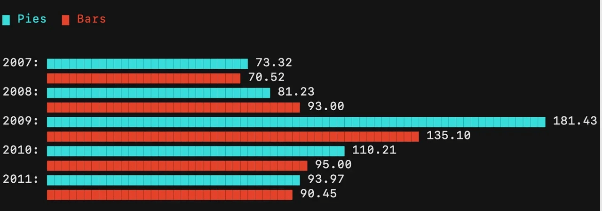
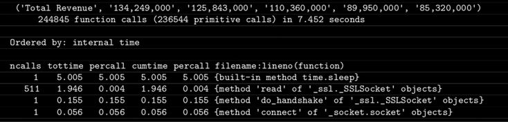

# Введение в Python: управление пакетами и виртуальная среда

Резюме: Сегодня ты получишь базовые знания о том, как управлять библиотеками в Python и работать с виртуальными средами.

💡 [Нажми сюда](https://new.oprosso.net/p/4cb31ec3f47a4596bc758ea1861fb624) **чтобы поделиться с нами обратной связью на этот проект**. Это анонимно и поможет нашей команде сделать обучение лучше. Рекомендуем заполнить опрос сразу после выполнения проекта.

## Содержание

1. [Глава I](#%D0%B3%D0%BB%D0%B0%D0%B2%D0%B0-i) \
   1.1. [Предисловие](#%D0%BF%D1%80%D0%B5%D0%B4%D0%B8%D1%81%D0%BB%D0%BE%D0%B2%D0%B8%D0%B5)
2. [Глава II](#%D0%B3%D0%BB%D0%B0%D0%B2%D0%B0-ii) \
   2.1. [Инструкция](#%D0%B8%D0%BD%D1%81%D1%82%D1%80%D1%83%D0%BA%D1%86%D0%B8%D1%8F)
3. [Глава III](#%D0%B3%D0%BB%D0%B0%D0%B2%D0%B0-iii) \
   3.1. [Дополнительные инструкции на сегодня](#%D0%B4%D0%BE%D0%BF%D0%BE%D0%BB%D0%BD%D0%B8%D1%82%D0%B5%D0%BB%D1%8C%D0%BD%D1%8B%D0%B5-%D0%B8%D0%BD%D1%81%D1%82%D1%80%D1%83%D0%BA%D1%86%D0%B8%D0%B8-%D0%BD%D0%B0-%D1%81%D0%B5%D0%B3%D0%BE%D0%B4%D0%BD%D1%8F)
4. [Глава IV](#%D0%B3%D0%BB%D0%B0%D0%B2%D0%B0-iv) \
   4.1. [Упражнение 00. Виртуальная среда](#%D1%83%D0%BF%D1%80%D0%B0%D0%B6%D0%BD%D0%B5%D0%BD%D0%B8%D0%B5-00-%D0%B2%D0%B8%D1%80%D1%82%D1%83%D0%B0%D0%BB%D1%8C%D0%BD%D0%B0%D1%8F-%D1%81%D1%80%D0%B5%D0%B4%D0%B0)
5. [Глава V](#%D0%B3%D0%BB%D0%B0%D0%B2%D0%B0-v) \
   5.1. [Упражнение 01. Установка пакета](#%D1%83%D0%BF%D1%80%D0%B0%D0%B6%D0%BD%D0%B5%D0%BD%D0%B8%D0%B5-01-%D1%83%D1%81%D1%82%D0%B0%D0%BD%D0%BE%D0%B2%D0%BA%D0%B0-%D0%BF%D0%B0%D0%BA%D0%B5%D1%82%D0%B0)
6. [Глава VI](#%D0%B3%D0%BB%D0%B0%D0%B2%D0%B0-vi) \
   6.1. [Упражнение 02. Установка множества библиотек](#%D1%83%D0%BF%D1%80%D0%B0%D0%B6%D0%BD%D0%B5%D0%BD%D0%B8%D0%B5-02-%D1%83%D1%81%D1%82%D0%B0%D0%BD%D0%BE%D0%B2%D0%BA%D0%B0-%D0%BC%D0%BD%D0%BE%D0%B6%D0%B5%D1%81%D1%82%D0%B2%D0%B0-%D0%B1%D0%B8%D0%B1%D0%BB%D0%B8%D0%BE%D1%82%D0%B5%D0%BA)
7. [Глава VII](#%D0%B3%D0%BB%D0%B0%D0%B2%D0%B0-vii) \
   7.1. [Упражнение 03. Очень красивый суп](#%D1%83%D0%BF%D1%80%D0%B0%D0%B6%D0%BD%D0%B5%D0%BD%D0%B8%D0%B5-03-%D0%BE%D1%87%D0%B5%D0%BD%D1%8C-%D0%BA%D1%80%D0%B0%D1%81%D0%B8%D0%B2%D1%8B%D0%B9-%D1%81%D1%83%D0%BF)
8. [Глава VIII](#%D0%B3%D0%BB%D0%B0%D0%B2%D0%B0-viii) \
   8.1. [Упражнение 04. Профилирование](#%D1%83%D0%BF%D1%80%D0%B0%D0%B6%D0%BD%D0%B5%D0%BD%D0%B8%D0%B5-04-%D0%BF%D1%80%D0%BE%D1%84%D0%B8%D0%BB%D0%B8%D1%80%D0%BE%D0%B2%D0%B0%D0%BD%D0%B8%D0%B5)
9. [Глава IX](#%D0%B3%D0%BB%D0%B0%D0%B2%D0%B0-ix) \
   9.1. [Упражнение 05. PyTest](#%D1%83%D0%BF%D1%80%D0%B0%D0%B6%D0%BD%D0%B5%D0%BD%D0%B8%D0%B5-05-pytest)

## Глава I

### Предисловие

10 правил библиотеки:

- Соблюдай тишину (уровень громкости голоса 0-1).
- Пользуйся полочным разделителем.
- Перелистывай страницы за верхний уголок.
- Перед чтением вымой руки.
- Возвращай книги в срок.
- Во время чтения не ешь и не пей.
- Береги книги от влаги.
- Используй закладку.
- Не делай пометок и рисунков на страницах.
- Храни книги в недоступном для детей и животных месте.

## Глава II

### Инструкция

Как учиться в «Школе 21»:

- Здесь тебя ждет уникальный образовательный опыт с большим количеством свободы. Ты получаешь задачу и самостоятельно ищешь пути решения, используя любые удобные способы поиска информации — ресурсы Интернета или нейросети (например, GigaChat). Но внимательно относись к качеству информации: проверяй, думай, анализируй, сравнивай.
- Взаимообучение (Peer-to-Peer, P2P) — это обмен знаниями и опытом с другими пирами, где каждый выступает и учителем, и учеником. Такой подход позволяет глубже понять материал, учась друг у друга.
- Чувствуй себя свободно и проси о помощи — вокруг тебя те, кто тоже впервые проходят этот путь. Делись своим опытом и идеями с другими. Присоединяйся к Rocket.Chat, чтобы быть в курсе всех новостей от нашего сообщества.
- Твое обучение не будет иметь никакого смысла, если ты будешь копировать чужие решения. Если пользуешься помощью других — всегда разбирайся до конца, почему, как и зачем. Не бойся ошибиться.
- Кажется, что задача невыполнима? Сделай перерыв, проветрись, перезагрузи голову — это помогало многим. Возможно, после этого решение придет само собой.
- Важен не только результат обучения, но и сам процесс. Нужно не просто решить задачу, а понять, КАК ее решить.

Как работать с проектом:

- Не обращай внимание на слухи, подсказки и догадки. Если сомневаешься, как выполнять задание - обращайся к этой инструкции, и только к ней.
- Здесь и далее (в заданиях, где используется Python) единственной допустимой версией Python является Python 3.
- Если ты выполняешь задания на Python (module01, module02, module03), в каждом python-файле в конце добавляй служебный блок `if __name__ == '__main__'`.
- Перепроверь настройки прав доступа к файлам и каталогам.
- Чтобы твоё решение приняли к оценке, оно должно лежать в твоём GIT-репозитории.
- Оценивание выполняют твои пиры по интенсиву.
- В твоей директории не должно быть иных файлов, кроме тех, что обозначены в заданиях. Настрой .gitignore, чтобы исключить случайные файлы и папки из проверки.
- Чтобы твоё решение приняли к оценке, оно должно лежать в твоём GIT-репозитории. Всегда делай push только в ветку develop! Ветка master будет проигнорирована. Работай в директории src.
- Если требуется точный вывод, запрещено подменять результат заранее подготовленным выводом - твое решение должно реально выполнять задачу.
- Есть вопрос? Спроси соседа справа. Если это не помогло - соседа слева.
- Не забывай, что информация в интернете всегда с тобой. Как и пиры. Общайся. Ищи.
- Внимательно читай примеры. В них может быть что-то, что не указано в явном виде в самом задании.
- Да пребудет с тобой Сила!

## Глава III

### Дополнительные инструкции на сегодня

- Никакого кода в глобальной области видимости. Используй функции!
- В конце каждого файла должен быть вызов функции внутри условия вида:

  ```
  if __name__ == '__main__':
      # your tests and your error handling
  ```
- Любое необработанное исключение аннулирует работу, даже если это та самая ошибка, обработку которой просили проверить.
- Импорты запрещены, кроме тех, что указаны в разделе «Разрешённые импорты» в шапке каждого упражнения.

## Глава V

### Упражнение 01. Установка пакета

- Каталог для сдачи: `ex01/`.
- Файлы для сдачи: `pies_bars.sh`, файл с данными и папка с твоим виртуальным окружением из предыдущего упражнения.
- Разрешённые импорты: без ограничений.

Давай установим первый пакет в твоё виртуальное окружение! Сейчас мы немного поработаем с библиотекой **termgraph**. Она позволяет рисовать графики и диаграммы прямо в терминале. Круто, да?

1. Установи библиотеку в виртуальное окружение, созданное в предыдущем упражнении.
2. Сделай такую же визуализацию, как в примере ниже, но с другой цветовой схемой. Файл для визуализации создай самостоятельно.

   
3. Создай для этого shell-скрипт с именем pies\_bars.sh. В нём должна быть только часть, отвечающая за построение графика, **без** активации и деактивации окружения.

## Глава VI

### Упражнение 02. Установка множества библиотек

- Каталог для сдачи: `ex02/`.
- Файлы для сдачи: `librarian.py` и архив с твоим виртуальным окружением.
- Разрешённые импорты: без ограничений.

В следующих упражнениях ты будешь работать с несколькими разными библиотеками. Для этого задания подготовь своё виртуальное окружение.

- Установи последние релизы **BeautifulSoup** и **PyTest**. Устанавливать их по одному (pip install x; pip install y) **запрещено**. Использование циклов тоже **запрещено**. Найди более изящный способ - используй установку через **requirements**.
- Напиши Python-скрипт librarian.py, который:

  - проверяет, что запущен **в нужном виртуальном окружении**;
  - устанавливает библиотеки;
  - в конце **отображает все установленные библиотеки** примерно в таком виде (список может отличаться) и **сохраняет его в** requirements.txt:

    ```
    six==1.14.0
    soupsieve==2.0
    termgraph==0.2.0
    wcwidth==0.1.9
    zipp==3.1.0
    ```
- Помести **архив окружения** в эту папку. Ты можешь добавить архив в репозиторий программно или создать его из командной строки. При желании архив можно сжать. Если скрипт был запущен **не в том окружении**, он должен выбросить исключение.

## Глава VII

### Упражнение 03. Очень красивый суп

- Каталог для сдачи: `ex03/`.
- Файлы для сдачи: `financial.py`.
- Разрешённые импорты: без ограничений.

В предыдущем упражнении ты установил две библиотеки. Теперь поработаем с одной из них - **BeautifulSoup**. Она приходит на помощь, когда нужно парсить сайт без готового API (как было с HeadHunter в День 00). Проблема в том, что при парсинге веб-страницы ты получаешь не только полезную информацию, но и HTML-разметку, с которой работать не всегда удобно. Этот пакет помогает ориентироваться по HTML-блокам и классам и проще извлекать нужные данные. Помни, что сам по себе это **не парсер** - он лишь помогает навести порядок в HTML/XML (значит, в окружении нужно установить выбранную HTTP-библиотеку).

В этом упражнении ты будешь парсить Yahoo Finance. Да, у него есть API, но в учебных целях забудем об этом. Зайди на [страницу такого типа](https://finance.yahoo.com/quote/msft/financials?p=msft) и получи некоторые данные по конкретному полю для конкретной компании.

Напиши Python-скрипт, который:

- принимает тикер и название поля таблицы в качестве аргументов (например, MSFT, Total Revenue);
- возвращает кортеж с запрошенной информацией;
- особые условия: добавь в скрипт «сон на 5 секунд» (sleep for 5 seconds) - он понадобится позже.

Пример:

```
$ ./financial.py 'MSFT' 'Total Revenue'
('Total Revenue', '134,249,000', '125,843,000', '110,360,000',
'89,950,000', '85,320,000')
```

Если URL не существует - выбрось исключение. Если запрошенного поля не существует - сделай то же самое.

## Глава VIII

### Упражнение 04. Профилирование

- Каталог для сдачи: `ex04/`.
- Файлы для сдачи: `financial.py`, `financial_enhanced.py`, `profiling-sleep.txt`, `profiling-tottime.txt`, `profiling-http.txt`, `profiling-ncalls.txt`.
- Разрешённые импорты: без ограничений.

С первого раза написать идеальный код, в который нельзя ничего улучшить, - большая редкость. Рано или поздно приходится разбираться, почему скрипты работают медленнее, чем ожидалось. Как раз для таких задач и существуют профилировщики.

Согласно Википедии, **профилирование** - это вид динамического анализа программ, который измеряет их пространственную и временную сложность, использование отдельных инструкций, частоту и длительность вызовов функций и другие параметры. Чаще всего эти данные используются для оптимизации.

Помнишь свой скрипт из прошлого упражнения? Сейчас мы его оптимизируем. Даже если ты гуру программирования, одна из использованных структур была не самой эффективной (мы специально попросили сделать именно так).

- **Примените cProfile** к скрипту financial.py, чтобы получить таблицу использованных функций, **отсортированную по убыванию общего времени выполнения**. Сохраните результат в файл profiling-sleep.txt.



- **Удалите из скрипта строку с** time.sleep(5) и повторно запустите профилирование. Вы должны получить новую таблицу, в которой **отсутствует встроенный метод** time.sleep(). Сохраните её в файл profiling-tottime.txt.
- **Попробуйте использовать другую HTTP-клиентскую библиотеку**, чтобы проверить, будет ли скрипт работать быстрее. Сохраните новый скрипт как financial\_enhanced.py, а результаты профилирования - в файл profiling-http.txt.
- **Получите ту же таблицу, но отсортированную по убыванию количества вызовов**. Это помогает определить, какие функции можно оптимизировать, сократив число их вызовов. Сохраните таблицу в profiling-ncalls.txt.
- **В этой задаче используйте библиотеку** pstats: отсортируйте данные по **совокупному времени (cumulative time)** и выведите первые пять результатов. Сохраните результат в файл pstats-cumulative.txt.

## Глава IX

### Упражнение 05. PyTest

- Каталог для сдачи: `ex05/`.
- Файлы для сдачи: `financial_test.py`.
- Разрешённые импорты: без ограничений.

Быстродействие - не единственная характеристика, которую нужно учитывать. Скрипт может с самого работать не так, как задумано. Чтобы убедиться в его корректности, необходимо писать модульные тесты. Их суть в том, чтобы передавать в код различные входные данные и проверять, соответствуют ли выходные значения ожидаемым.

- В задании ex03 ты наверняка использовал одну или несколько функций. **Для каждой из них создай как минимум три теста с помощью библиотеки PyTest.** Убедись, что твой скрипт возвращает корректную информацию для каждого запроса:
  - При запросе Total Revenue возвращает ли он общую выручку для указанного тикера?
  - Является ли тип возвращаемого значения кортежем?
  - Возникает ли исключение при вводе некорректного имени тикера?
- **Добавь тесты в код своего скрипта** financial.py\*\*.\*\* Сохрани файл в своей директории под именем financial\_test.py. Запусти PyTest - все тесты должны быть пройдены. Если это не так, доработай скрипт, чтобы привести его в соответствие с требованиями.