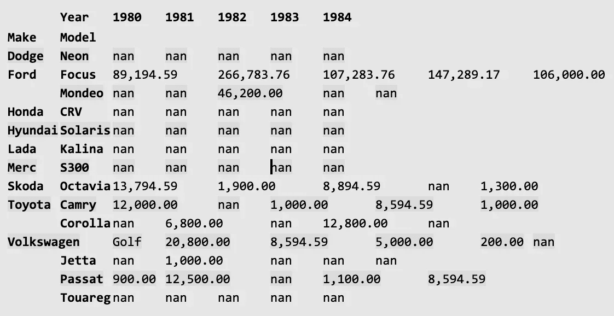

# Pandas: работа с DataFrame

Резюме. Сегодня ты освоишь основные навыки работы с библиотекой Pandas.

💡 [Нажми сюда](https://new.oprosso.net/p/4cb31ec3f47a4596bc758ea1861fb624), **чтобы поделиться с нами обратной связью на этот проект**. Это анонимно и поможет нашей команде сделать обучение лучше. Рекомендуем заполнить опрос сразу после выполнения проекта.

## Содержание

1. [Глава I](#%D0%B3%D0%BB%D0%B0%D0%B2%D0%B0-i)\
   1.1. [Предисловие](#%D0%BF%D1%80%D0%B5%D0%B4%D0%B8%D1%81%D0%BB%D0%BE%D0%B2%D0%B8%D0%B5)
2. [Глава II](#%D0%B3%D0%BB%D0%B0%D0%B2%D0%B0-ii)\
   2.1. [Инструкция](#%D0%B8%D0%BD%D1%81%D1%82%D1%80%D1%83%D0%BA%D1%86%D0%B8%D1%8F)
3. [Глава III](#%D0%B3%D0%BB%D0%B0%D0%B2%D0%B0-iii)\
   3.1. [Дополнительные инструкции на сегодня](#%D0%B4%D0%BE%D0%BF%D0%BE%D0%BB%D0%BD%D0%B8%D1%82%D0%B5%D0%BB%D1%8C%D0%BD%D1%8B%D0%B5-%D0%B8%D0%BD%D1%81%D1%82%D1%80%D1%83%D0%BA%D1%86%D0%B8%D0%B8-%D0%BD%D0%B0-%D1%81%D0%B5%D0%B3%D0%BE%D0%B4%D0%BD%D1%8F)
4. [Глава IV](#%D0%B3%D0%BB%D0%B0%D0%B2%D0%B0-iv)\
   4.1. [Упражнение 00. Загрузка и сохранение](#%D1%83%D0%BF%D1%80%D0%B0%D0%B6%D0%BD%D0%B5%D0%BD%D0%B8%D0%B5-00-%D0%B7%D0%B0%D0%B3%D1%80%D1%83%D0%B7%D0%BA%D0%B0-%D0%B8-%D1%81%D0%BE%D1%85%D1%80%D0%B0%D0%BD%D0%B5%D0%BD%D0%B8%D0%B5)
5. [Глава V](#%D0%B3%D0%BB%D0%B0%D0%B2%D0%B0-v)\
   5.1. [Упражнение 01. Базовые операции](#%D1%83%D0%BF%D1%80%D0%B0%D0%B6%D0%BD%D0%B5%D0%BD%D0%B8%D0%B5-01-%D0%B1%D0%B0%D0%B7%D0%BE%D0%B2%D1%8B%D0%B5-%D0%BE%D0%BF%D0%B5%D1%80%D0%B0%D1%86%D0%B8%D0%B8)
6. [Глава VI](#%D0%B3%D0%BB%D0%B0%D0%B2%D0%B0-vi)\
   6.1. [Упражнение 02. Предобработка](#%D1%83%D0%BF%D1%80%D0%B0%D0%B6%D0%BD%D0%B5%D0%BD%D0%B8%D0%B5-02-%D0%BF%D1%80%D0%B5%D0%B4%D0%BE%D0%B1%D1%80%D0%B0%D0%B1%D0%BE%D1%82%D0%BA%D0%B0-%D0%B4%D0%B0%D0%BD%D0%BD%D1%8B%D1%85)
7. [Глава VII](#%D0%B3%D0%BB%D0%B0%D0%B2%D0%B0-vii)\
   7.1. [Упражнение 03. Выборки и агрегирование](#%D1%83%D0%BF%D1%80%D0%B0%D0%B6%D0%BD%D0%B5%D0%BD%D0%B8%D0%B5-03-%D0%B2%D1%8B%D0%B1%D0%BE%D1%80%D0%BA%D0%B8-%D0%B8-%D0%B0%D0%B3%D1%80%D0%B5%D0%B3%D0%B0%D1%86%D0%B8%D0%B8)
8. [Глава VIII](#%D0%B3%D0%BB%D0%B0%D0%B2%D0%B0-viii)\
   8.1. [Упражнение 04. Обогащение и преобразования](#%D1%83%D0%BF%D1%80%D0%B0%D0%B6%D0%BD%D0%B5%D0%BD%D0%B8%D0%B5-04-%D0%BE%D0%B1%D0%BE%D0%B3%D0%B0%D1%89%D0%B5%D0%BD%D0%B8%D0%B5-%D0%B8-%D0%BF%D1%80%D0%B5%D0%BE%D0%B1%D1%80%D0%B0%D0%B7%D0%BE%D0%B2%D0%B0%D0%BD%D0%B8%D1%8F)
9. [Глава IX](#%D0%B3%D0%BB%D0%B0%D0%B2%D0%B0-ix)\
   9.1. [Упражнение 05. Оптимизация в Pandas](#%D1%83%D0%BF%D1%80%D0%B0%D0%B6%D0%BD%D0%B5%D0%BD%D0%B8%D0%B5-05-%D0%BE%D0%BF%D1%82%D0%B8%D0%BC%D0%B8%D0%B7%D0%B0%D1%86%D0%B8%D0%B8-pandas)

## Глава I

### Предисловие

**Занимательные факты о пандах**

- Панды - настоящие обжоры. Едят они практически 12 часов в день, и за это время они могут съедать до 12 килограммов бамбука.
- В отличие от большинства сородичей-медведей, панды не впадают в зимнюю спячку. С приходом холодов они просто спускаются с гор туда, где потеплее, и продолжают свой пир.
- К сожалению, эти замечательные животные находятся под угрозой исчезновения: по оценкам учёных, в дикой природе осталось всего около 1000 особей.
- В среднем за день панды, кхм, ходят в туалет около 40 раз.
- Легенда гласит, что изначально панда была полностью белой. Однажды девочка встретила в лесу белого медвежонка. Они подружились и часто вместе играли. Как-то раз на него напал снежный барс. Девочка бросилась на помощь своему другу и погибла. В знак скорби медведи опустили лапы в пепел. Оплакивая девочку, они тёрли лапками глаза, хватались за голову, крепко обнимали друг друга, чтобы утешиться. С тех пор и появились на теле панды черные пятна.
- Брачный период и его закономерное завершение у панд занимает около двух-трёх дней. После спаривания самка прогоняет самца со своей территории и в одиночку выращивает потомство.
- Большая панда обычно рожает одного детёныша. Иногда на свет появляются двойни, но в таком случае мать, как правило, бросает более слабого - у неё просто не хватает сил заботиться о двоих.
- Морда панды выглядит пухленькой, на самом деле это не жир - объём морде придает мощная жевательная мускулатура.
- Содержание даже одной панды в зоопарке - дорогое удовольствие. Расходы на неё впятеро превышают затраты на следующего за ней по стоимости животного - слона.
- Если вам кажется, что всё это как-то относится к библиотеке pandas, - нет, это не так. Её название происходит от термина «panel data», который в эконометрике обозначает наборы данных, содержащие наблюдения за одними и теми же объектами в течение нескольких временны́х периодов.

## Глава II

### Инструкция

Как учиться в «Школе 21»:

- Здесь тебя ждет уникальный образовательный опыт с большим количеством свободы. Ты получаешь задачу и самостоятельно ищешь пути решения, используя любые удобные способы поиска информации — ресурсы Интернета или нейросети (например, GigaChat). Но внимательно относись к качеству информации: проверяй, думай, анализируй, сравнивай.
- Взаимообучение (Peer-to-Peer, P2P) — это обмен знаниями и опытом с другими пирами, где каждый выступает и учителем, и учеником. Такой подход позволяет глубже понять материал, учась друг у друга.
- Чувствуй себя свободно и проси о помощи — вокруг тебя те, кто тоже впервые проходят этот путь. Делись своим опытом и идеями с другими. Присоединяйся к Rocket.Chat, чтобы быть в курсе всех новостей от нашего сообщества.
- Твое обучение не будет иметь никакого смысла, если ты будешь копировать чужие решения. Если пользуешься помощью других — всегда разбирайся до конца, почему, как и зачем. Не бойся ошибиться.
- Кажется, что задача невыполнима? Сделай перерыв, проветрись, перезагрузи голову — это помогало многим. Возможно, после этого решение придет само собой.
- Важен не только результат обучения, но и сам процесс. Нужно не просто решить задачу, а понять, КАК ее решить.

Как работать с проектом:

- Не обращай внимание на слухи, подсказки и догадки. Если сомневаешься, как выполнять задание - обращайся к этой инструкции, и только к ней.
- Здесь и далее (в заданиях, где используется Python) единственной допустимой версией Python является Python 3.
- Если ты выполняешь задания на Python (module01, module02, module03), в каждом python-файле в конце добавляй служебный блок `if __name__ == '__main__'`.
- Перепроверь настройки прав доступа к файлам и каталогам.
- Чтобы твоё решение приняли к оценке, оно должно лежать в твоём GIT-репозитории.
- Оценивание выполняют твои пиры по интенсиву.
- В твоей директории не должно быть иных файлов, кроме тех, что обозначены в заданиях. Настрой .gitignore, чтобы исключить случайные файлы и папки из проверки.
- Чтобы твоё решение приняли к оценке, оно должно лежать в твоём GIT-репозитории. Всегда делай push только в ветку develop! Ветка master будет проигнорирована. Работай в директории src.
- Если требуется точный вывод, запрещено подменять результат заранее подготовленным выводом - твое решение должно реально выполнять задачу.
- Есть вопрос? Спроси соседа справа. Если это не помогло - соседа слева.
- Не забывай, что информация в интернете всегда с тобой. Как и пиры. Общайся. Ищи.
- Внимательно читай примеры. В них может быть что-то, что не указано в явном виде в самом задании.
- Да пребудет с тобой Сила!

## Глава III

### Дополнительные инструкции на сегодня\*\*

- Работай с кодом в Jupyter Notebook.
- Для каждого крупного подзадания из списка упражнений (чёрные маркеры) в твоём файле `.ipynb` должен быть заголовок уровня `h2` - так пирам будет проще ориентироваться в коде.
- Импорты запрещены, кроме указанных в разделе «Разрешённые импорты/функции» в шапке каждого упражнения.
- Разрешены любые встроенные функции, если в упражнении не указано иное.
- Все необходимые данные сохраняй и загружай из подпапки `data/`.

## Глава IV

### Упражнение 00. Загрузка и сохранение\*\*

- Каталог для сдачи: `ex00/`.
- Файлы для сдачи: `load_and_save.ipynb`.
- Разрешённые импорты: `import pandas as pd`.

Поздравляю! За пять дней и один рывок ты выстроил базовые навыки работы с Python: знаешь основные типы данных и полезные встроенные функции, умеешь работать в виртуальной среде, использовать ООП и логирование, парсить данные с сайтов и отправлять сообщения в Rocket.Chat. На этой неделе фокус смещается в сторону Data Science - тебя ждёт серия упражнений по Pandas, одной из самых популярных и полезных библиотек в этой области.

В этом упражнении тебе надо загрузить [log-файл](https://drive.google.com/file/d/1kgByP3EZHL8xAm-oGaBpf0-fPdVIYRaY/view) (положи его в каталог `data` внутри каталога `src` текущего дня) в датафрейм, изменить разделитель и сохранить в другой файл.

Задача:

1. `read_csv`:
   - Отфильтруй строки с индексами 2 и 3 с помощью аргумента `skiprows` - мы знаем, что эти наблюдения были фейковыми.
   - Отфильтруй последние две строки «хвоста» с помощью аргумента `skipfooter` - они тоже фейковые.
   - Задай имена столбцов: `datetime`, `user`.
   - Используй `datetime` как индексный столбец.
2. Переименуй `datetime` в `date_time`.
3. `to_csv`:
   - Используй в качестве разделителя символ `';'`.
   - Сохрани в файл `feed-views-semicolon.log`.

Ожидаемый результат после `read_csv`:

```
In [3]: df.head()
Out [3]:
user
date_time
2020-04-17 12:01:08.463179 artem
2020-04-17 12:01:23.743946 artem
2020-04-17 12:35:52.735016 artem
2020-04-17 12:36:21.401412 oksana
2020-04-17 12:36:22.023355 oksana

In [4]: df.tail()
Out [4]:
user
date_time
2020-05-21 16:36:40.915488 ekaterina
2020-05-21 17:49:36.429237 maxim
2020-05-21 18:45:20.441142 valentina
2020-05-21 23:03:06.457819 maxim
2020-05-21 23:23:49.995349 pavel
```

Подумай, сколько строк кода пришлось бы написать, если бы нужно было сделать то же самое без Pandas.

## Глава V

### Упражнение 01. Базовые операции\*\*

- Каталог для сдачи: `ex01/`.
- Файлы для сдачи: `basic_operations.ipynb`.
- Разрешённые импорты: `import pandas as pd`.

Это далеко не всё, на что способен Pandas. Поехали дальше. В этом упражнении ты поработаешь с логом посещений страницы пользователями и временными метками.

- Создай датафрейм с названием `views` с двумя столбцами `datetime` и `user`, прочитав файл `feed-views.log`.
  - Приведи столбец `datetime` к типу `datetime64[ns]` (dtype).
  - Извлеки из `datetime` год, месяц, день, час, минуту и секунду в новые столбцы.
- Создай новый столбец `daytime`.
  - Присваивай значение времени суток, если час попадает в заданный интервал (например, «afternoon», если час > 11 и ≤ 17).
  - 0-3:59 = night, 4-6:59 = early morning, 7-10:59 = morning, 11-16:59 = afternoon, 17-19:59 = early evening, 20-23:59 = evening.
  - Для решения подзадачи используй метод `cut`.
  - Назначь столбец `user` индексом.
- Посчитай количество элементов в датафрейме.
  - Используй метод `count()`.
  - Посчитай число элементов в каждой категории времени суток с помощью `value_counts()`.
- Отсортируй значения в датафрейме одновременно по часам, минутам и секундам по возрастанию (не по одному столбцу по очереди).
- Вычисли минимум и максимум для часов и моду для категорий `daytime`.
  - Найди максимальный час для строк, где время суток - night.
  - Найди минимальный час для строк, где время суток - morning.
  - Дополнительно узнай, кто посещал страницу в эти часы, и приведи один пример.
  - Вычисли моду для часа и для `daytime`.
- Покажи три самых ранних и три самых поздних часа дня и соответствующие имена пользователей, используя `nsmalles()` и `nlargest()`.
- Используй метод `describe()` для получения базовой статистики по столбцам.
  - Чтобы найти самый популярный интервал посещений, вычисли интерквартильный размах для часа: извлеки нужные значения из результата `describe()` и сохрани их в переменную `iqr`.

## Глава VI

### Упражнение 02. Предобработка данных\*\*

- Каталог для сдачи: `ex02/`.
- Файлы для сдачи: `preprocessing.ipynb`.
- Разрешённые импорты: `import pandas as pd`.

В один из следующих дней (очень скоро) ты будешь обучать модели машинного обучения, но большинству моделей нужны чистые, обогащённые данные - без дублей и пропусков. Pandas отлично подходит для этого: он не только помогает делать описательный анализ и лучше понимать данные, но и позволяет их предобрабатывать. Этим ты и займёшься в этом упражнении.

- [Скачай](https://drive.google.com/open?id=1kFMUiXtrlw5B6WTjJ-mUm4-STV28Zsvn) и прочитай CSV-файл, указав **`ID`** в качестве индексного столбца.
- Подсчитай число наблюдений с помощью метода `count()`.
- Удали дубликаты, учитывая только столбцы `CarNumber`, `Make_n_Model` и `Fines`.
  - Из двух одинаковых наблюдений оставляй `последнее`.
  - Ещё раз проверь количество наблюдений.
- Поработай с пропущенными значениями.
  - Посмотри, сколько пропусков в каждом столбце.
  - Удали все столбцы с более чем `500` пропусками, используя аргумент `thresh`. Проверь число пропусков в каждом столбце.
  - Замени все пропуски в столбце `Refund` предыдущим значением в этом столбце (используй аргумент `method`) и проверь число пропусков.
  - Замени все пропуски в столбце `Fines` средним значением этого столбца (не учитывая NA/NULL при вычислении среднего). Снова проверь число пропусков.
- Раздели и распарьсь марку и модель.
  - Используй `apply` и для разбиения, и для извлечения значений в новые столбцы `Make` и `Model`.
  - Удали столбец `Make_n_Model`.
  - Сохрани датафрейм в файл `auto.json` в формате ниже:

    ```
    [{"CarNumber":"Y163O8161RUS","Refund":2.0,"Fines":3200.0,"Make":"Ford",
    "Model":"Focus"},
    {"CarNumber":"E432XX77RUS","Refund":1.0,"Fines":6500.0,"Make":"Toyota",
    "Model":"Camry"}]
    ```

## Глава VII

### Упражнение 03. Выборки и агрегации\*\*

- Каталог для сдачи: `ex03/`.
- Файлы для сдачи: `selects_n_aggs.ipynb`.
- Разрешённые импорты: `import pandas as pd`.

Отлично! Данные очищены: дубликаты удалены, пропуски обработаны, столбцы приведены к удобному виду - можно двигаться дальше. Впереди много вопросов, на которые нужно ответить.

1. Загрузите в датафрейм JSON-файл, созданный в предыдущем упражнении.
   - Установите столбец `CarNumber` в качестве индекса.
2. Сделайте выборки:
   - Отобразите строки, где штрафы больше `2 100`.
   - Отобразите строки, где штрафы больше `2 100`, а возврат (`Refund`) равен `2`.
   - Отобразите строки, где модель входит в список: `['Focus', 'Corolla']`.
   - Отобразите строки, где номер автомобиля входит в список:\
     `['Y7689C197RUS', '92928M178RUS', '7788KT197RUS', 'H115YO163RUS', 'X758HY197RUS']`.
3. Выполните агрегации по `Make` и `Model`:
   - Выведите медианные значения штрафов, сгруппировав по `Make`.
   - Выведите медианные значения штрафов, сгруппировав по `Make` и `Model`.
   - Выведите количество штрафов, сгруппированное по `Make` и `Model`, чтобы понять, можно ли доверять медиане.
   - Выведите минимальные и максимальные штрафы, сгруппированные по `Make` и `Model`, чтобы лучше понять разброс.
   - Выведите стандартное отклонение штрафов, сгруппированное по `Make` и `Model`, чтобы лучше понять разброс.
4. Агрегации по номерам автомобилей:
   - Выведите номера автомобилей, сгруппированные по количеству штрафов в порядке убывания - хотим найти тех, кто чаще всего нарушал.
   - Из исходного датафрейма выберите все строки, соответствующие **топ-1** номеру - приблизимся и посмотрим детали.
   - Выведите номера автомобилей, сгруппированные по сумме штрафов в порядке убывания - хотим найти тех, кто заплатил больше всех.
   - Из исходного датафрейма выберите все строки, соответствующие **топ-1** номеру по сумме штрафов.
   - Постройте таблицу, которая отвечает на вопрос: «Есть ли номера автомобилей, привязанные к разным моделям?»

## Глава VIII

### Упражнение 04. Обогащение и преобразования\*\*

- Каталог для сдачи: `ex04/`.
- Файлы для сдачи: `enrichment.ipynb`.
- Разрешённые импорты: `import pandas as pd`, `import numpy as np`, `import requests`.

Отлично! Чем больше у тебя данных, тем глубже анализ. Давай обогатим исходный набор данных.

1. Прочитай JSON-файл, сохранённый в ex02.

- Одна из колонок имеет тип float, задай формат отображения через `pd.options.display.float_format`: числа с плавающей точкой должны показываться с двумя знаками после запятой.
- В столбце Model есть пропущенные значения; ничего с ними не делай.

1. Обогати DataFrame сэмплом из этого же DataFrame.

- Создай сэмпл из 200 новых наблюдений, используя `random_state = 21`.
  - В сэмпле **не должно** появиться новых комбинаций `car number`, `make` и `model`, чтобы набор данных оставался согласованным.
  - На столбцы `refund` и `fines` ограничений нет: можно случайно выбирать их значения и назначать любому номеру автомобиля.
- Конкатенируй сэмпл с исходным DataFrame и получи новый DataFrame `concat_rows`.

1. Обогати `concat_rows` новой колонкой с сгенерированными данными.

- Создай Series с именем Year со случайными целыми числами от 1980 до 2019.
- Перед генерацией лет вызови `np.random.seed(21)`.
- Конкатенируй Series с DataFrame и назови получившийся DataFrame `fines`.

1. Обогати DataFrame данными из другого DataFrame.

- Создай новый DataFrame с номерами автомобилей и их владельцами.
  - Возьми самые популярные фамилии в США (файл [surname.json](https://git.21-school.ru/masters/DSB7_Pandas.ID_886517/-/blob/master/datasets/surname.json) в папке datasets).
  - Создай новую Series с фамилиями: без спецсимволов (запятых, скобок и т. п.); количество должно совпадать с числом уникальных номеров автомобилей в сэмпле (используй `random_state = 21`).
  - Создай DataFrame `owners` с колонками `CarNumber` и `SURNAME`.
- Добавь ещё пять наблюдений в `fines` (придумай свои `CarNumber` и т. п.).
- Удали последние 20 наблюдений из owners и добавь три новых, отличных от добавленных в `fines`.
- Соедини два DataFrame.
  - Новый DataFrame должен содержать **только** те номера, которые есть **в обоих** DataFrame.
  - Новый DataFrame должен содержать **все** номера **из обоих** DataFrame.
  - Новый DataFrame должен содержать **только** номера `из` fines.
  - Новый DataFrame должен содержать **только** номера `из` owners.

1. Создай сводную таблицу (pivot table) из `fines`.

- Она должна выглядеть как на примере ниже (значения - суммы штрафов), но со **всеми** годами. Твои значения могут отличаться.

  

1. Сохрани оба DataFrame - `fines` и `owners` - в CSV-файлы **без индекса**.

## Глава IX

### Упражнение 05. Оптимизации Pandas

- Каталог для сдачи: `ex05/`.
- Файлы для сдачи: `optimizations.ipynb`.
- Разрешённые импорты: `import pandas as pd`, `import gc`.

Мы возвращаемся к теме эффективности кода. К этому моменту ты уже знаешь основы Pandas. Пора познакомиться с продвинутыми возможностями, о которых большинство пользователей Pandas не знает (а кто-то просто пренебрегает ими).

1. Прочитай файл `fines.csv`, который ты сохранил(а) в предыдущем упражнении.

- Во всех подпунктах далее тебе нужно вычислять `fines/refund*year` для каждой строки и создать новый столбец с рассчитанными данными.
- Измеряй время с помощью магической команды `%%timeit` в ячейке.

1. Итерации:

- Напиши функцию, которая проходит по DataFrame циклом `for i in range(0, len(df))`, использует `iloc` и `append()` в список. Результат функции присвой новому столбцу в DataFrame.
- Сделай то же с использованием `iterrows()`.
- Сделай то же с использованием `apply()` и лямбда-функции.
- Сделай то же, используя объекты `Series` из DataFrame.
- Сделай как в предыдущем подпункте, но используй метод `.values`.

1. Индексация: время также измеряй магической командой `%%timeit` в ячейке.

- Получи строку для конкретного `CarNumber`, например, "O136HO197RUS."
- Установи индекс в своём DataFrame столбцом `CarNumber`.
- Снова получи строку для того же `CarNumber`.

1. Понижение разрядности типов (downcasting):

- Выполни `df.info(memory_usage='deep')` и обрати внимание на Dtype и объём памяти.
- Создай `copy()` исходного DataFrame в другой DataFrame - `optimized_df`.
- Понизь разрядность типа с `float64` до `float32` для всех столбцов.
- Понизь разрядность типа с `int64` до минимально возможного числового Dtype.
- Запусти `info(memory_usage='deep')` для нового DataFrame и обрати внимание на Dtype и объём памяти.

1. Категории:

- Преобразуй столбцы типа `object` в `category`.
- На этот раз проверь объём памяти. Вероятно, он уменьшится в 2-3 раза по сравнению с исходным DataFrame.

1. Очистка памяти:

- Используя библиотеку `gc` и команду `%reset_selective`, удали из памяти **только** свой исходный DataFrame