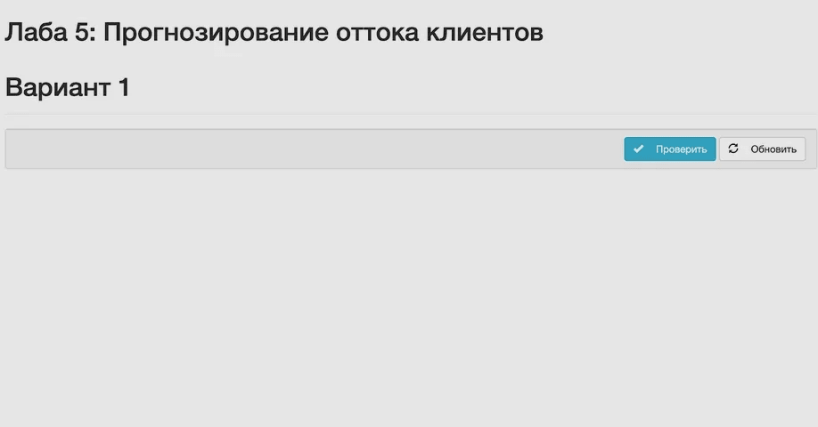
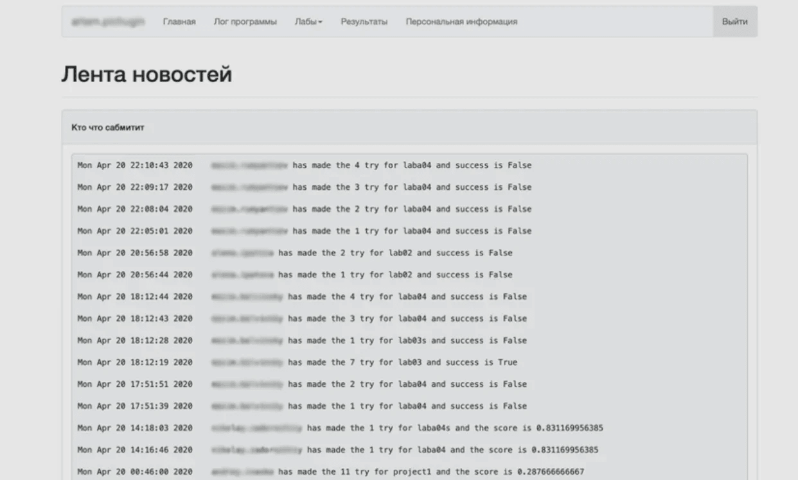

# SQL и Pandas

Резюме: Сегодня ты освоишь основные навыки работы с SQL.

💡 [Нажми сюда,](https://new.oprosso.net/p/4cb31ec3f47a4596bc758ea1861fb624) чтобы поделиться с нами обратной связью на этот проект. Это анонимно и поможет нашей команде сделать обучение лучше. Рекомендуем заполнить опрос сразу после выполнения проекта.

## Содержание

1. [Глава I](#%D0%B3%D0%BB%D0%B0%D0%B2%D0%B0-i) \
   1.1. [Предисловие](#%D0%BF%D1%80%D0%B5%D0%B4%D0%B8%D1%81%D0%BB%D0%BE%D0%B2%D0%B8%D0%B5)
2. [Глава II](#%D0%B3%D0%BB%D0%B0%D0%B2%D0%B0-ii) \
   2.1. [Инструкция](#%D0%B8%D0%BD%D1%81%D1%82%D1%80%D1%83%D0%BA%D1%86%D0%B8%D1%8F)
3. [Глава III](#%D0%B3%D0%BB%D0%B0%D0%B2%D0%B0-iii) \
   3.1. [Дополнительные инструкции на сегодня](#%D0%B4%D0%BE%D0%BF%D0%BE%D0%BB%D0%BD%D0%B8%D1%82%D0%B5%D0%BB%D1%8C%D0%BD%D1%8B%D0%B5-%D0%B8%D0%BD%D1%81%D1%82%D1%80%D1%83%D0%BA%D1%86%D0%B8%D0%B8-%D0%BD%D0%B0-%D1%81%D0%B5%D0%B3%D0%BE%D0%B4%D0%BD%D1%8F)
4. [Глава IV](#%D0%B3%D0%BB%D0%B0%D0%B2%D0%B0-iv) \
   4.1. [Упражнение 00. Выборка (SELECT)](#%D1%83%D0%BF%D1%80%D0%B0%D0%B6%D0%BD%D0%B5%D0%BD%D0%B8%D0%B5-00-%D0%B2%D1%8B%D0%B1%D0%BE%D1%80%D0%BA%D0%B0-select)
5. [Глава V](#%D0%B3%D0%BB%D0%B0%D0%B2%D0%B0-v) \
   5.1. [Упражнение 01. Подзапрос (SUBQUERY)](#%D1%83%D0%BF%D1%80%D0%B0%D0%B6%D0%BD%D0%B5%D0%BD%D0%B8%D0%B5-01-%D0%BF%D0%BE%D0%B4%D0%B7%D0%B0%D0%BF%D1%80%D0%BE%D1%81-subquery)
6. [Глава VI](#%D0%B3%D0%BB%D0%B0%D0%B2%D0%B0-vi) \
   6.1. [Упражнение 02. Соединение (JOIN)](#%D1%83%D0%BF%D1%80%D0%B0%D0%B6%D0%BD%D0%B5%D0%BD%D0%B8%D0%B5-02-%D1%81%D0%BE%D0%B5%D0%B4%D0%B8%D0%BD%D0%B5%D0%BD%D0%B8%D0%B5-join)
7. [Глава VII](#%D0%B3%D0%BB%D0%B0%D0%B2%D0%B0-vii) \
   7.1. [Упражнение 03. Агрегации](#%D1%83%D0%BF%D1%80%D0%B0%D0%B6%D0%BD%D0%B5%D0%BD%D0%B8%D0%B5-03-%D0%B0%D0%B3%D1%80%D0%B5%D0%B3%D0%B0%D1%86%D0%B8%D0%B8)
8. [Глава VIII](#%D0%B3%D0%BB%D0%B0%D0%B2%D0%B0-viii) \
   8.1. [Упражнение 04. A/B-тестирование](#%D1%83%D0%BF%D1%80%D0%B0%D0%B6%D0%BD%D0%B5%D0%BD%D0%B8%D0%B5-04-ab-%D1%82%D0%B5%D1%81%D1%82%D0%B8%D1%80%D0%BE%D0%B2%D0%B0%D0%BD%D0%B8%D0%B5)

## Глава I

### Предисловие

«Сиквел» или «Эс-Кью-Эл»? Как всё-таки правильно произносить SQL? Некоторые эйчары отсеивают кандидатов на собеседовании, если те говорят «неправильно». Кажется, произношение имеет значение!

Изначально язык назывался SEQUEL (Structured English Query Language), но позже выяснилось, что это зарегистрированный товарный знак компании-авиапроизводителя. Авторам пришлось сменить название. Так и появился SQL (Structured Query Language).

Одного из создателей языка, Дона Чемберлина, [спросили](http://patorjk.com/blog/2012/01/26/pronouncing-sql-s-q-l-or-sequel/), какой вариант произношения считать верным. Он ответил: «Поскольку изначально язык назывался SEQUEL, многие продолжали использовать это произношение и после того, как мы сократили название».

Принято считать, что «Эс-Кью-Эл» - вариант более официальный. А что думают другие «авторитеты»? Официальное произношение «MySQL» - «Май Эс-Кью-Эл» (а не «Май Сиквел»). В то же время, документация Oracle утверждает, что правильно говорить «Сиквел».

Прежде чем приступить к упражнениям, тебе предстоит сделать осознанный выбор: как ты будешь говорить - «Сиквел» или «Эс-Кью-Эл»? Неформальный вариант или официальный? Какой из двух тебе ближе?

## Глава II

### Инструкция

Как учиться в «Школе 21»:

- Здесь тебя ждет уникальный образовательный опыт с большим количеством свободы. Ты получаешь задачу и самостоятельно ищешь пути решения, используя любые удобные способы поиска информации — ресурсы Интернета или нейросети (например, GigaChat). Но внимательно относись к качеству информации: проверяй, думай, анализируй, сравнивай.
- Взаимообучение (Peer-to-Peer, P2P) — это обмен знаниями и опытом с другими пирами, где каждый выступает и учителем, и учеником. Такой подход позволяет глубже понять материал, учась друг у друга.
- Чувствуй себя свободно и проси о помощи — вокруг тебя те, кто тоже впервые проходят этот путь. Делись своим опытом и идеями с другими. Присоединяйся к Rocket.Chat, чтобы быть в курсе всех новостей от нашего сообщества.
- Твое обучение не будет иметь никакого смысла, если ты будешь копировать чужие решения. Если пользуешься помощью других — всегда разбирайся до конца, почему, как и зачем. Не бойся ошибиться.
- Кажется, что задача невыполнима? Сделай перерыв, проветрись, перезагрузи голову — это помогало многим. Возможно, после этого решение придет само собой.
- Важен не только результат обучения, но и сам процесс. Нужно не просто решить задачу, а понять, КАК ее решить.

Как работать с проектом:

- Не обращай внимание на слухи, подсказки и догадки. Если сомневаешься, как выполнять задание - обращайся к этой инструкции, и только к ней.
- Здесь и далее (в заданиях, где используется Python) единственной допустимой версией Python является Python 3.
- Если ты выполняешь задания на Python (module01, module02, module03), в каждом python-файле в конце добавляй служебный блок `if __name__ == '__main__'`.
- Перепроверь настройки прав доступа к файлам и каталогам.
- Чтобы твоё решение приняли к оценке, оно должно лежать в твоём GIT-репозитории.
- Оценивание выполняют твои пиры по интенсиву.
- В твоей директории не должно быть иных файлов, кроме тех, что обозначены в заданиях. Настрой .gitignore, чтобы исключить случайные файлы и папки из проверки.
- Чтобы твоё решение приняли к оценке, оно должно лежать в твоём GIT-репозитории. Всегда делай push только в ветку develop! Ветка master будет проигнорирована. Работай в директории src.
- Если требуется точный вывод, запрещено подменять результат заранее подготовленным выводом - твое решение должно реально выполнять задачу.
- Есть вопрос? Спроси соседа справа. Если это не помогло - соседа слева.
- Не забывай, что информация в интернете всегда с тобой. Как и пиры. Общайся. Ищи.
- Внимательно читай примеры. В них может быть что-то, что не указано в явном виде в самом задании.
- Да пребудет с тобой Сила!

## Глава III

### Дополнительные инструкции на сегодня

- Работай с кодом в Jupyter Notebook.
- Для каждого крупного подзадания из списка упражнений в твоём файле .ipynb должен быть заголовок уровня **h2** - так пирам будет проще ориентироваться в коде.
- Импорты запрещены, кроме указанных в разделе «Разрешённые импорты/функции» в шапке каждого упражнения.
- Разрешены любые встроенные функции, если в упражнении не указано иное.
- Сегодня можно использовать только следующие методы Pandas: io.sql.read\_sql и to\_sql, если в упражнении не предписано иное.
- Все необходимые данные сохраняй и загружай из подпапки data/.

## Глава IV

### Упражнение 00. Выборка (SELECT)

- Каталог для сдачи: `ex00/`.
- Файлы для сдачи: `ex00_first_select.ipynb`.
- Разрешённые импорты: `import pandas as pd`, `import sqlite3`.

Одного Python порой бывает недостаточно. Вспомни первый день интенсива, где ты использовал утилиты командной строки - для определённых задач они эффективнее. Сегодня ты будешь работать с SQL. Зачем это может пригодиться? Данные не всегда хранятся в удобных CSV- или JSON-файлах; иногда они находятся в базе данных, и их нужно оттуда извлекать. SQL также применяется в инструментах для работы с большими данными, таких как Apache Spark и Hive (в Hive это называется HQL).

Задание:
Скачай [эту базу данных SQLite](https://drive.google.com/open?id=1zQ8AR2Ry3ajzB3UZO1Sfk3xtDJlzQF2M). В течение дня ты будешь работать через Pandas с различными таблицами из этой базы. Все таблицы связаны между собой и относятся к одному проекту. Это реальный набор данных от образовательной компании, у которой есть собственная платформа. На этой платформе студенты проверяют правильность своих решений и получают обратную связь. Таблица checker хранит логи о том, какие лабораторные работы и когда были проверены пользователями.

Компания создала на платформе новую страницу «Лента новостей» (Newsfeed), где эти логи видны всем студентам программы. Логи посещений страниц хранятся в другой таблице - pageviews. Гипотеза состояла в том, что эта страница создаст эффект социального давления (peer pressure), побуждая студентов начинать работу над лабораторными раньше. Это могло бы быть полезно, так как у них появилось бы время на большее число итераций и эксперименты с разными подходами. В этой серии упражнений ты проверишь, верна ли эта гипотеза.

Но начнём с простого. В этом упражнении тебе нужно извлечь из базы отфильтрованные данные. Почему важно фильтровать данные непосредственно в запросе, а не после загрузки в Pandas? Потому что таблицы могут быть огромными. Если попытаться выгрузить всю таблицу целиком, её обработка может завершиться неудачей. Всегда держи это в уме.

Первый способ фильтрации - выбирать только нужные столбцы.
Второй - выбирать только нужные строки.

Подробная инструкция:

1. Положи файл базы данных в подпапку data внутри каталога src.
2. Создай соединение с базой данных с помощью библиотеки `sqlite3`.
3. Получи схему таблицы `pageviews`, используя `pd.io.sql.read_sql()` и запрос: `"PRAGMA table_info(pageviews);"`
4. Получи только первые десять строк таблицы `pageviews`, чтобы ознакомиться с её структурой.
5. Одним запросом получи подтаблицу, удовлетворяющую следующим условиям:
   - используются только столбцы "uid" и "datetime";
   - выбираются только пользовательские данные (`user_*`), данные администраторов исключаются;
   - данные отсортированы по "uid" в порядке возрастания;
   - столбец "datetime" используется в качестве индекса;
   - столбец "datetime" преобразован в тип `DatetimeIndex`;
   - имя результирующего DataFrame - `pageviews`.
6. Закрой соединение с базой данных.

## Глава V

### Упражнение 01. Подзапрос (SUBQUERY)

- Каталог для сдачи: `ex01/`.
- Файлы для сдачи: `ex01_subquery.ipynb`.
- Разрешённые импорты: `import pandas as pd`, `import sqlite3`.

Хорошо, давайте усложним задачу. Вы слышали о подзапросах? По сути, это запрос внутри другого запроса. Какова же их практическая польза? Как правило, они нужны, когда требуется выполнить агрегацию над результатом предыдущей выборки. Важно помнить, что вложенные запросы выполняются первыми, и только после них - основной запрос.

Вот что нужно сделать:

1. Создай соединение с базой данных с помощью библиотеки `sqlite3`.
2. Получи схему таблицы `checker`.
3. Получи первые десять строк таблицы, чтобы посмотреть её структуру.
4. Одним запросом (с любым количеством подзапросов) посчитай, сколько строк удовлетворяют условиям:
   - считаем строки из таблицы `pageviews`, но **только для тех записей** из `checker`, у которых:
     - `status = 'ready'` - логи со статусом проверки нас не интересуют;
     - `numTrials = 1` - анализируем только первые коммиты, потому что они показывают момент, когда студент начал работать над лабораторной;
     - labnames входит в список: `laba04`, `laba04s`, `laba05`, `laba06`, `laba06s`, и `project1` - активные в рамках эксперимента;
     - сохрани результат запроса (количество) в DataFrame с колонкой "cnt".
5. Закрой соединение.

## Глава VI

### Упражнение 02. Соединение (JOIN)

- Каталог для сдачи: `ex02/`.
- Файлы для сдачи: `ex02_joins.ipynb`.
- Разрешённые импорты: `import pandas as pd`, `import sqlite3`.

В этом упражнении ты создашь так называемую витрину данных (datamart) - таблицу для аналитики, которую обычно получают объединением нескольких таблиц. Мы соберём разные сведения о пользователях: когда они сделали первые коммиты и когда впервые посетили ленту (newsfeed). Это пригодится для последующего анализа.

Что нужно сделать:

1. Создай соединение с базой данных с помощью библиотеки `sqlite3`.
2. Одним запросом создай в базе новую таблицу `datamart`, объединив таблицы `pageviews` и `checker`.
   - В таблице должны быть колонки: "uid", "labname", "first\_commit\_ts", "first\_view\_ts".
   - "first\_commit\_ts" - новое имя колонки "timestamp" из таблицы checker; это первая отправка для конкретной лабораторной и пользователя.
   - "first\_view\_ts" - первая временная метка посещения пользователем ленты (newsfeed) из pageviews.
   - Фильтр `status = 'ready'` должен сохраняться.
   - Фильтр `numTrials = 1` должен сохраняться.
   - "labnames" должен входить в список: `laba04`, `laba04s`, `laba05`, `laba06`, `laba06s`, и `project1`.
   - В таблицу должны попадать только пользователи (uid вида user\_\*), администраторы - исключаются.
   - Колонки "first\_commit\_ts" и "first\_view\_ts" должны иметь тип `datetime64[ns]`.
3. С помощью методов Pandas создай два DataFrame: `test` и `control`.
   - `test` содержит пользователей с заполненными значениями в "first\_view\_ts".
   - `control` содержит пользователей с пропущенными значениями в "first\_view\_ts".
   - Замени пропуски в control средним значением "first\_view\_ts" среди пользователей из test. Сохрани обе таблицы в базе - они понадобятся в следующих упражнениях.
4. Закрой соединение.

*Небольшой совет: выполняй задание последовательно - от простого к сложному. Так будет проще отлаживать запросы.*

## Глава VII

### Упражнение 03. Агрегации

- Каталог для сдачи: `ex03/`.
- Файлы для сдачи: `ex03_aggs.ipynb`.
- Разрешённые импорты: `import pandas as pd`, `import sqlite3`.

Предыдущая работа была лишь подготовкой данных - инсайтов мы ещё не получили. Сейчас исправим. Вспомним нашу гипотезу: если пользователи увидят ленту (newsfeed), они начнут работать над лабораторными раньше. Ключевая метрика - разница между моментом начала работы (первый коммит) и дедлайном лабораторной.

Для этого упражнения нужно:

1. Создай соединение с базой данных с помощью библиотеки `sqlite3`.
2. Получи схему таблицы `test`.
3. Получи первые десять строк таблицы `test`, чтобы посмотреть её структуру.
4. Найди минимальное значение дельты между первым коммитом и дедлайном соответствующей лабораторной для всех пользователей **одним запросом**.
   - Выполни объединение с таблицей `deadlines`.
   - Разницу отобрази в часах.
   - Не учитывай лабораторную `project1` (у неё более длинные дедлайны - это выброс).
   - Сохрани значение в DataFrame `df_min` вместе с соответствующим uid.
5. Аналогично найди **максимум** (тоже **одним запросом**). Имя DataFrame - `df_max`.
6. Аналогично найди **среднее** (тоже **одним запросом**). На этот раз в DataFrame **не должно** быть колонки uid. Имя DataFrame - `df_avg`.
7. Протестируй гипотезу, что у пользователей, которые посещали ленту новостей несколько раз, дельта между первым коммитом и дедлайном ниже. Для этого посчитай коэффициент корреляции между числом просмотров ленты и дельтой.
   - **Одним запросом** создай таблицу с колонками: "uid", "avg\_diff", "pageviews".
   - "uid" - идентификаторы, существующие в `test`.
   - "avg\_diff" - средняя дельта между первым коммитом и дедлайном по пользователю.
   - "pageviews" - число посещений ленты новостей по пользователю.
   - Не учитывай `project1`.
   - Сохрани результат в DataFrame `views_diff`.
   - Используй метод Pandas `corr()` для вычисления коэффициента корреляции между числом просмотров и дельтой.
8. Закрой соединение.

## Глава VIII

### Упражнение 04. A/B-тестирование

- Каталог для сдачи: `ex04/`.
- Файлы для сдачи: `ex04_ab-test.ipynb`.
- Разрешённые импорты: `import pandas as pd`, `import sqlite3`.

Итак, выясним, повлияла ли «Лента» (Newsfeed) на поведение студентов. Стали ли они раньше начинать работу над лабораторными? Напомним: в базе уже подготовлены две таблицы - `test` и `control`. Мы проведём упрощённый A/B-тест. Сначала надо посчитать разницу между моментом первого коммита и дедлайном **до** и **после** первого визита на страницу. То же самое - для контрольной группы.

Иными словами, у каждого пользователя из `test` есть собственная метка времени первого визита в «Ленту». Нужно посчитать среднюю дельту (first commit - deadline) **до** и **после** этой метки. Для `control` делаем аналогично, но используем ранее вычисленную **среднюю** метку первого визита из группы `test`.

Если в группе `test` дельта «до» статистически отличается от «после», а в `control` такого эффекта нет, - идею с новой страницей можно масштабировать.

Подробно:

1. Создай соединение с базой данных с помощью библиотеки `sqlite3`.
2. **Одним запросом на группу** создай два DataFrame: `test_results` и `control_results` - с колонками "time" и "avg\_diff", и **ровно двумя строками**.
   - В "time" должны быть значения "after" и "before".
   - В "avg\_diff" - средняя дельта для всех пользователей за периоды **до** и **после** их первого визита на страницу.
   - Учитывай **только** тех пользователей, у кого есть наблюдения и «до», и «после».
3. Лабораторную `project1` по-прежнему **не** учитывай.
4. Закрой соединение.
5. Дай ответ: подтвердилась ли гипотеза - влияет ли страница на поведение студентов?