# Pandas, SQL и визуализация данных

Резюме. Сегодня мы поможем тебе с визуализацией данных в Matplotlib, Seaborn и Plotly.

💡 [Нажми сюда](https://new.oprosso.net/p/4cb31ec3f47a4596bc758ea1861fb624), **чтобы поделиться с нами обратной связью на этот проект**. Это анонимно и поможет нашей команде сделать обучение лучше. Рекомендуем заполнить опрос сразу после выполнения проекта.

## Содержание

- [Pandas, SQL и визуализация данных](#pandas-sql-%D0%B8-%D0%B2%D0%B8%D0%B7%D1%83%D0%B0%D0%BB%D0%B8%D0%B7%D0%B0%D1%86%D0%B8%D1%8F-%D0%B4%D0%B0%D0%BD%D0%BD%D1%8B%D1%85)
  - [Содержание](#%D1%81%D0%BE%D0%B4%D0%B5%D1%80%D0%B6%D0%B0%D0%BD%D0%B8%D0%B5)
  - [Глава I](#%D0%B3%D0%BB%D0%B0%D0%B2%D0%B0-i)
    - [Предисловие](#%D0%BF%D1%80%D0%B5%D0%B4%D0%B8%D1%81%D0%BB%D0%BE%D0%B2%D0%B8%D0%B5)
  - [Глава II](#%D0%B3%D0%BB%D0%B0%D0%B2%D0%B0-ii)
    - [Инструкция](#%D0%B8%D0%BD%D1%81%D1%82%D1%80%D1%83%D0%BA%D1%86%D0%B8%D1%8F)
  - [Глава III](#%D0%B3%D0%BB%D0%B0%D0%B2%D0%B0-iii)
    - [Дополнительные инструкции на сегодня](#%D0%B4%D0%BE%D0%BF%D0%BE%D0%BB%D0%BD%D0%B8%D1%82%D0%B5%D0%BB%D1%8C%D0%BD%D1%8B%D0%B5-%D0%B8%D0%BD%D1%81%D1%82%D1%80%D1%83%D0%BA%D1%86%D0%B8%D0%B8-%D0%BD%D0%B0-%D1%81%D0%B5%D0%B3%D0%BE%D0%B4%D0%BD%D1%8F)
  - [Глава IV Основная часть](#%D0%B3%D0%BB%D0%B0%D0%B2%D0%B0-iv-%D0%BE%D1%81%D0%BD%D0%BE%D0%B2%D0%BD%D0%B0%D1%8F-%D1%87%D0%B0%D1%81%D1%82%D1%8C)
    - [Упражнение 00. Линейный график](#%D1%83%D0%BF%D1%80%D0%B0%D0%B6%D0%BD%D0%B5%D0%BD%D0%B8%D0%B5-00-%D0%BB%D0%B8%D0%BD%D0%B5%D0%B9%D0%BD%D1%8B%D0%B9-%D0%B3%D1%80%D0%B0%D1%84%D0%B8%D0%BA)
  - [Глава V](#%D0%B3%D0%BB%D0%B0%D0%B2%D0%B0-v)
    - [Упражнение 01. Линейный график со стилями](#%D1%83%D0%BF%D1%80%D0%B0%D0%B6%D0%BD%D0%B5%D0%BD%D0%B8%D0%B5-01-%D0%BB%D0%B8%D0%BD%D0%B5%D0%B9%D0%BD%D1%8B%D0%B9-%D0%B3%D1%80%D0%B0%D1%84%D0%B8%D0%BA-%D1%81%D0%BE-%D1%81%D1%82%D0%B8%D0%BB%D1%8F%D0%BC%D0%B8)
  - [Глава VI](#%D0%B3%D0%BB%D0%B0%D0%B2%D0%B0-vi)
    - [Упражнение 02. Столбчатая диаграмма](#%D1%83%D0%BF%D1%80%D0%B0%D0%B6%D0%BD%D0%B5%D0%BD%D0%B8%D0%B5-02-%D1%81%D1%82%D0%BE%D0%BB%D0%B1%D1%87%D0%B0%D1%82%D0%B0%D1%8F-%D0%B4%D0%B8%D0%B0%D0%B3%D1%80%D0%B0%D0%BC%D0%BC%D0%B0)
  - [Глава VII](#%D0%B3%D0%BB%D0%B0%D0%B2%D0%B0-vii)
    - [Упражнение 03. Столбчатые диаграммы](#%D1%83%D0%BF%D1%80%D0%B0%D0%B6%D0%BD%D0%B5%D0%BD%D0%B8%D0%B5-03-%D1%81%D1%82%D0%BE%D0%BB%D0%B1%D1%87%D0%B0%D1%82%D1%8B%D0%B5-%D0%B4%D0%B8%D0%B0%D0%B3%D1%80%D0%B0%D0%BC%D0%BC%D1%8B)
  - [Глава VIII](#%D0%B3%D0%BB%D0%B0%D0%B2%D0%B0-viii)
    - [Упражнение 04. Гистограмма](#%D1%83%D0%BF%D1%80%D0%B0%D0%B6%D0%BD%D0%B5%D0%BD%D0%B8%D0%B5-04-%D0%B3%D0%B8%D1%81%D1%82%D0%BE%D0%B3%D1%80%D0%B0%D0%BC%D0%BC%D0%B0)
  - [Глава IX](#%D0%B3%D0%BB%D0%B0%D0%B2%D0%B0-ix)
    - [Упражнение 05. Диаграмма размаха (boxplot)](#%D1%83%D0%BF%D1%80%D0%B0%D0%B6%D0%BD%D0%B5%D0%BD%D0%B8%D0%B5-05-%D0%B4%D0%B8%D0%B0%D0%B3%D1%80%D0%B0%D0%BC%D0%BC%D0%B0-%D1%80%D0%B0%D0%B7%D0%BC%D0%B0%D1%85%D0%B0-boxplot)
  - [Глава X](#%D0%B3%D0%BB%D0%B0%D0%B2%D0%B0-x)
    - [Упражнение 06. Матрица диаграмм рассеяния (scatter matrix)](#%D1%83%D0%BF%D1%80%D0%B0%D0%B6%D0%BD%D0%B5%D0%BD%D0%B8%D0%B5-06-%D0%BC%D0%B0%D1%82%D1%80%D0%B8%D1%86%D0%B0-%D0%B4%D0%B8%D0%B0%D0%B3%D1%80%D0%B0%D0%BC%D0%BC-%D1%80%D0%B0%D1%81%D1%81%D0%B5%D1%8F%D0%BD%D0%B8%D1%8F-scatter-matrix)
  - [Глава XI Бонусная часть](#%D0%B3%D0%BB%D0%B0%D0%B2%D0%B0-xi-%D0%B1%D0%BE%D0%BD%D1%83%D1%81%D0%BD%D0%B0%D1%8F-%D1%87%D0%B0%D1%81%D1%82%D1%8C)
    - [Упражнение 07. Тепловая карта (heatmap)](#%D1%83%D0%BF%D1%80%D0%B0%D0%B6%D0%BD%D0%B5%D0%BD%D0%B8%D0%B5-07-%D1%82%D0%B5%D0%BF%D0%BB%D0%BE%D0%B2%D0%B0%D1%8F-%D0%BA%D0%B0%D1%80%D1%82%D0%B0-heatmap)
  - [Глава XII](#%D0%B3%D0%BB%D0%B0%D0%B2%D0%B0-xii)
    - [Упражнение 08. Seaborn](#%D1%83%D0%BF%D1%80%D0%B0%D0%B6%D0%BD%D0%B5%D0%BD%D0%B8%D0%B5-08-seaborn)
  - [Глава XIII](#%D0%B3%D0%BB%D0%B0%D0%B2%D0%B0-xiii)
    - [Упражнение 09. Plotly](#%D1%83%D0%BF%D1%80%D0%B0%D0%B6%D0%BD%D0%B5%D0%BD%D0%B8%D0%B5-09-plotly)

## Глава I

### Предисловие

Зачем нам нужна визуализация? Во-первых, этот инструмент помогает в максимально доступной форме донести результаты нашей деятельности до работодателя, коллег, заказчиков и т. п. Во-вторых, она способствует более глубокому пониманию данных. Ниже — пример, почему это важно.

Попробуй представить (или набросать на бумаге) распределение двух переменных со следующими характеристиками (свойство: значение):

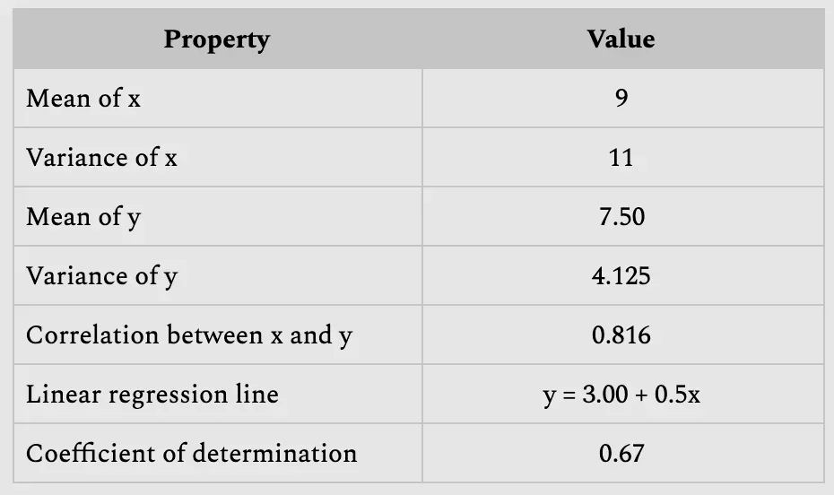

Думаешь, точки можно расположить только одним способом?

Нет, вариантов здесь несколько. Такие наборы числовых данных называются «квартет Энскомба» ([Anscombe’s quartet](https://en.wikipedia.org/wiki/Anscombe's_quartet)).

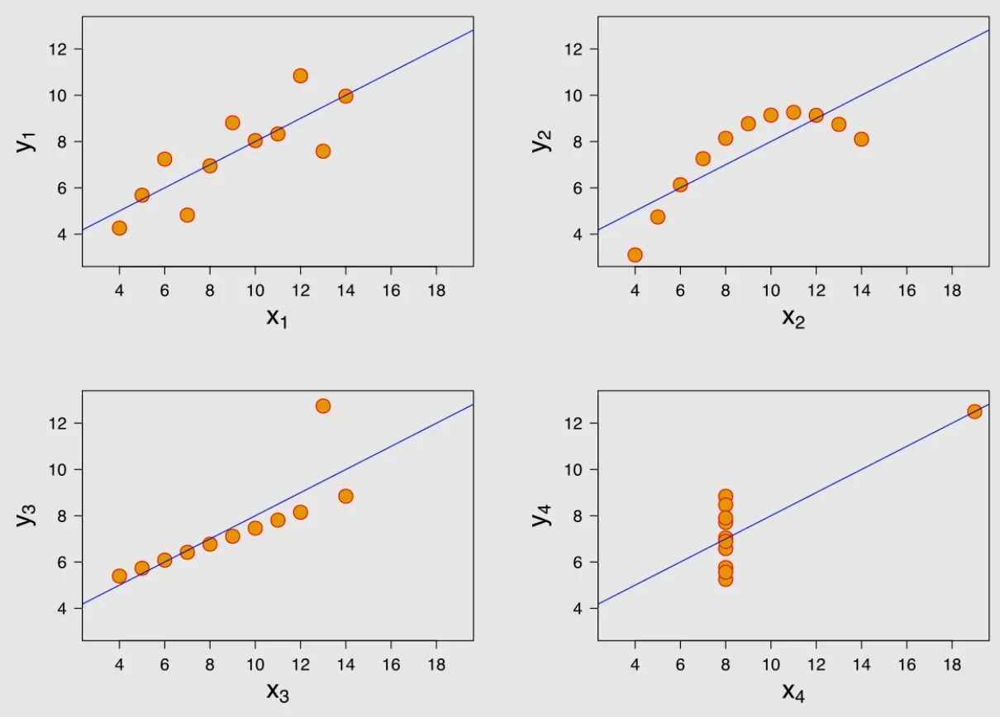

Все графики выше имеют одинаковые числовые характеристики. Верится с трудом, не правда ли?

Сами по себе характеристики могут ввести в заблуждение — используй графики, чтобы проникнуть в саму суть этих данных.

## Глава II

### Инструкция

Как учиться в «Школе 21»:

- Здесь тебя ждет уникальный образовательный опыт с большим количеством свободы. Ты получаешь задачу и самостоятельно ищешь пути решения, используя любые удобные способы поиска информации — ресурсы Интернета или нейросети (например, GigaChat). Но внимательно относись к качеству информации: проверяй, думай, анализируй, сравнивай.
- Взаимообучение (Peer-to-Peer, P2P) — это обмен знаниями и опытом с другими пирами, где каждый выступает и учителем, и учеником. Такой подход позволяет глубже понять материал, учась друг у друга.
- Чувствуй себя свободно и проси о помощи — вокруг тебя те, кто тоже впервые проходят этот путь. Делись своим опытом и идеями с другими. Присоединяйся к Rocket.Chat, чтобы быть в курсе всех новостей от нашего сообщества.
- Твое обучение не будет иметь никакого смысла, если ты будешь копировать чужие решения. Если пользуешься помощью других — всегда разбирайся до конца, почему, как и зачем. Не бойся ошибиться.
- Кажется, что задача невыполнима? Сделай перерыв, проветрись, перезагрузи голову — это помогало многим. Возможно, после этого решение придет само собой.
- Важен не только результат обучения, но и сам процесс. Нужно не просто решить задачу, а понять, КАК ее решить.

Как работать с проектом:

- Не обращай внимание на слухи, подсказки и догадки. Если сомневаешься, как выполнять задание - обращайся к этой инструкции, и только к ней.
- Здесь и далее (в заданиях, где используется Python) единственной допустимой версией Python является Python 3.
- Если ты выполняешь задания на Python (module01, module02, module03), в каждом python-файле в конце добавляй служебный блок `if __name__ == '__main__'`.
- Перепроверь настройки прав доступа к файлам и каталогам.
- Чтобы твоё решение приняли к оценке, оно должно лежать в твоём GIT-репозитории.
- Оценивание выполняют твои пиры по интенсиву.
- В твоей директории не должно быть иных файлов, кроме тех, что обозначены в заданиях. Настрой .gitignore, чтобы исключить случайные файлы и папки из проверки.
- Чтобы твоё решение приняли к оценке, оно должно лежать в твоём GIT-репозитории. Всегда делай push только в ветку develop! Ветка master будет проигнорирована. Работай в директории src.
- Если требуется точный вывод, запрещено подменять результат заранее подготовленным выводом — твое решение должно реально выполнять задачу.
- Есть вопрос? Спроси соседа справа. Если это не помогло — соседа слева.
- Не забывай, что информация в интернете всегда с тобой. Как и пиры. Общайся. Ищи.
- Внимательно читай примеры. В них может быть что-то, что не указано в явном виде в самом задании.
- Да пребудет с тобой Сила!

## Глава III

### Дополнительные инструкции на сегодня

- Работай с кодом в Jupyter Notebook.
- Импорты запрещены, кроме тех, что указаны в разделе «Разрешённые импорты/функции» в шапке каждого упражнения.
- Разрешены любые встроенные функции, если в упражнении не указано иное.
- Все необходимые данные сохраняй и загружай из подпапки `data/`.

## Глава IV Основная часть

### Упражнение 00. Линейный график

- Каталог для сдачи: `ex00/`.
- Файлы для сдачи: `00_line_chart.ipynb`.
- Разрешённые импорты: `import pandas as pd`, `import sqlite3`.

Сегодня ты будешь работать с наборами данных, которые ты использовал в ходе предыдущего дня.

Мы попробуем разобраться, как ведут себя студенты образовательной организации. Мы снова используем Pandas и SQL (для тренировки), а также библиотеки визуализации в Python: Matplotlib, Seaborn и Plotly.

Как обычно, начнём с простого. Если ты ещё не строил графики в Python — самое время начать!

Помнишь, как мы анализировали страницу «Лента новостей»? Ты задумывался, как часто эту страницу посещали в течение определённого отрезка времени?

- Установи соединение с [базой данных](https://drive.google.com/open?id=1zQ8AR2Ry3ajzB3UZO1Sfk3xtDJlzQF2M) (той же, что и в предыдущий день).
- Выполни запрос к таблице `pageviews`, получив столбец datetime только для пользователей (без админов).
- С помощью Pandas создай новый DataFrame, в котором визиты посчитаны и сгруппированы по дате.
- Используя метод Pandas `.plot()`, построй график.
  - Размер шрифта — 8.
  - Размер фигуры — (15, 8).
  - Заголовок графика — "Views per day".
  - Обрати внимание на поворот меток по оси X (xticks) на графике ниже.
- Закрой соединение с базой данных.

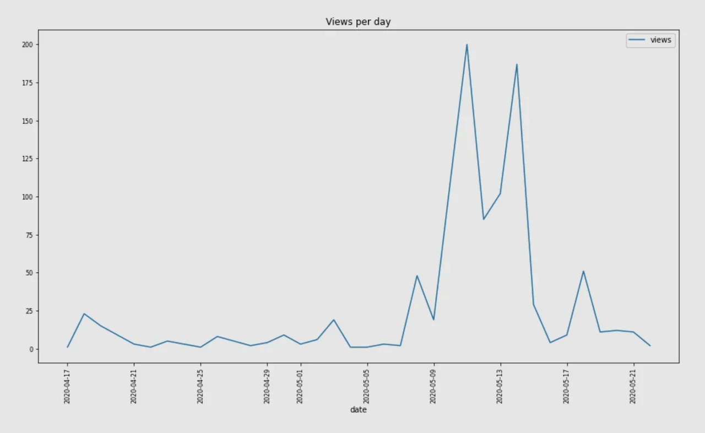

## Глава V

### Упражнение 01. Линейный график со стилями

- Каталог для сдачи: `ex01/`.
- Файлы для сдачи: `01_line_chart_styles.ipynb`.
- Разрешённые импорты: `import pandas as pd`, `import sqlite3`.

Класс! Помнишь, у нас есть данные по коммитам? Было бы здорово показать обе метрики во времени на одном графике — вдруг увидим закономерности?

Нужно воссоздать график в точности как на примере (и по данным, и по стилю):

- Анализируй только пользователей, без админов.
- Учитывай только те даты, когда есть и просмотры, и коммиты из checker.
- Размер шрифта — 8.
- Размер фигуры — (15, 8).
- В конце блокнота добавь markdown-ячейку с вопросом: “Сколько раз число просмотров превышало 150?” и строкой: “Ответ \_\_\_”. Подставь число вместо подчёркивания.

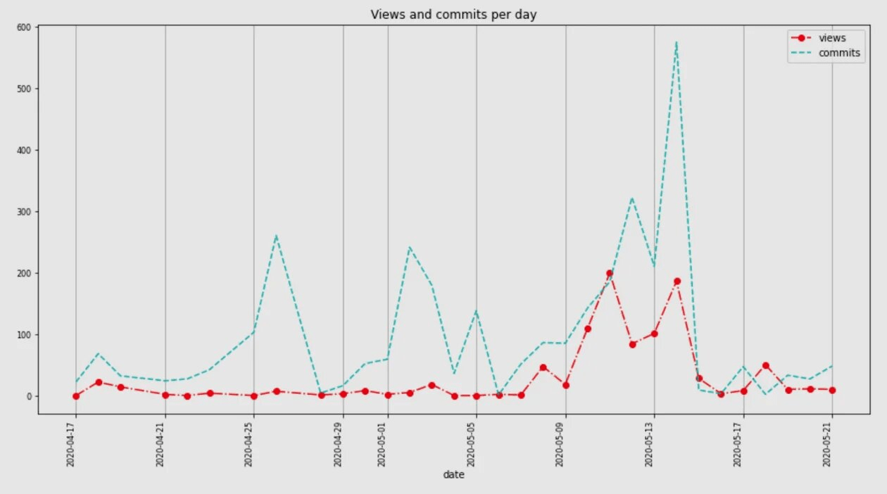

## Глава VI

### Упражнение 02. Столбчатая диаграмма

- Каталог для сдачи: `ex02/`.
- Файлы для сдачи: `02_bar_chart.ipynb`.
- Разрешённые импорты: `import pandas as pd`, `import sqlite3`.

У нас есть ещё один вопрос: когда пользователи чаще коммитят лабораторные — ночью, утром, днём или вечером? И как ситуация менялась со временем?

Сделай всё необходимое, чтобы получить график как на примере:

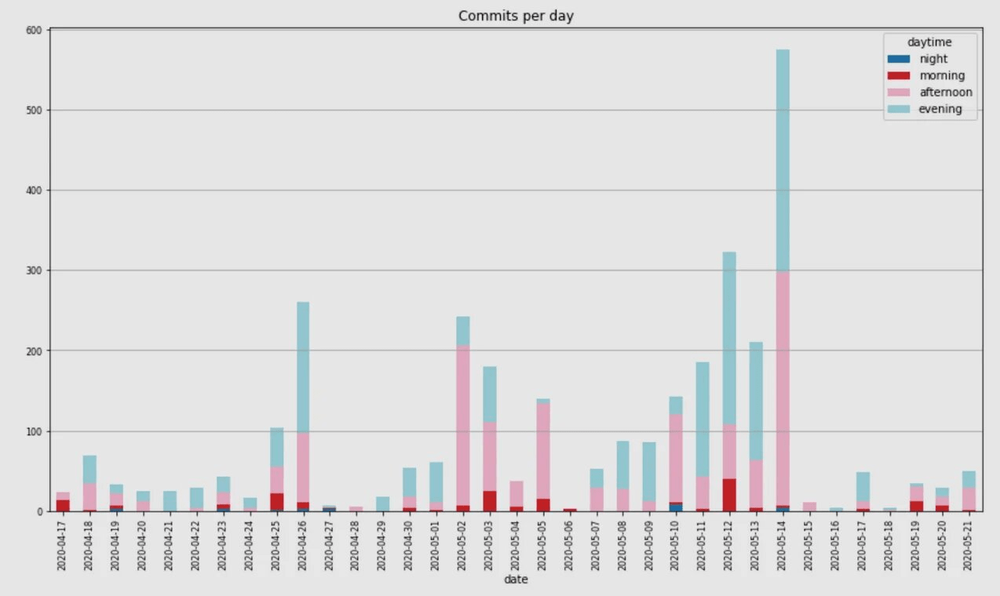

- Анализируй только пользователей (не учитывай админов).
- Размер шрифта и размер фигуры — те же, что раньше.
- Интервалы времени суток:
  - night (ночь) — с 0:00:00 до 03:59:59,
  - morning (утро) — с 04:00:00 до 09:59:59,
  - afternoon (день) — с 10:00:00 до 16:59:59,
  - evening (вечер) — с 17:00:00 до 23:59:59.
- Палитру выбери на свой вкус — повторять цвета из примера не требуется.
- В конце блокнота добавь markdown-ячейку и вставь вопросы:
  - «Когда наши пользователи обычно коммитят: ночью, утром, днём или вечером?» — в ответе укажи две самые частые категории.
  - «Какой день имел максимальное число коммитов и при этом вечером коммитов больше, чем днём?»В ответе должна стоять дата этого дня.

## Глава VII

### Упражнение 03. Столбчатые диаграммы

- Каталог для сдачи: `ex03/`.
- Файлы для сдачи: `03_bar_charts.ipynb`.
- Разрешённые импорты: `import pandas as pd`, `import sqlite3`.

А что если среднее число коммитов отличается в будни и в выходные?

Сделай все необходимые действия, чтобы получить график как на примере:

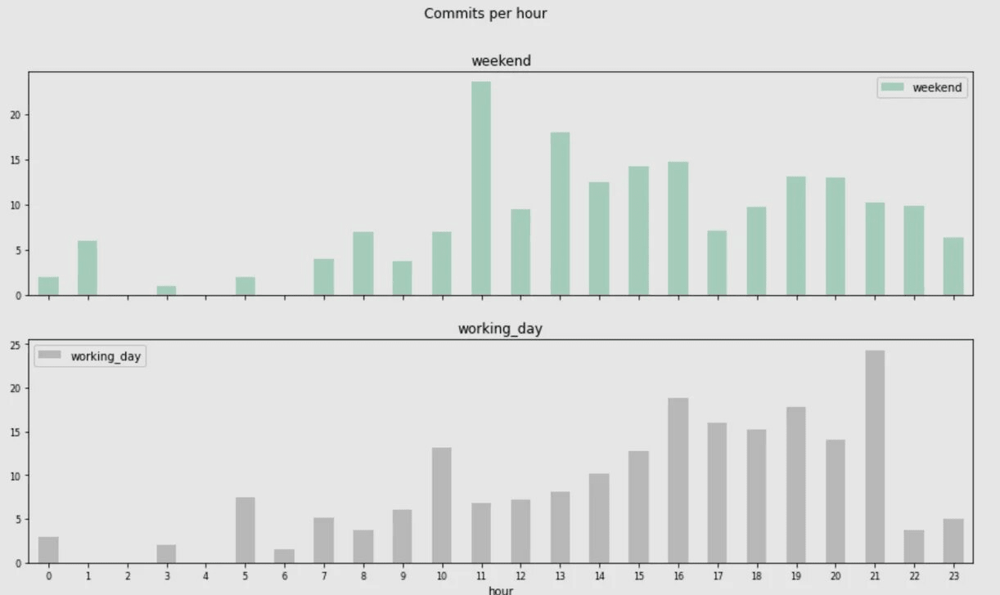

- Анализируй только пользователей (не учитывай админов).
- Размер шрифта и размер фигуры — те же, что раньше.
- Для каждого часа посчитай среднее число коммитов в рабочие дни и в выходные (если в конкретный час не было коммитов, не учитывай его при расчёте среднего). Используй эти значения для графика (пример агрегирования): Mon, 17–18: 5 commits, Tue, 17–18: 6 commits, Wed, 17–18: 7 commits.
- Палитру выбери на свой вкус — повторять цвета из примера не требуется.
- В конце блокнота добавь markdown-ячейку с вопросом: «Различается ли динамика в рабочие дни и в выходные?» и в ответе укажи час с наибольшим числом коммитов в будни и такой же топовый час в выходные.

## Глава VIII

### Упражнение 04. Гистограмма

- Каталог для сдачи: `ex04/`.
- Файлы для сдачи: `04_histogram.ipynb`.
- Разрешённые импорты: `import pandas as pd`, `import sqlite3`, `import matplotlib.pyplot as plt`.

В предыдущем упражнении ты строил распределение, группируя значения в Pandas.

Было бы неплохо этот процесс автоматизировать, и сделать это можно с помощью гистограмм. На этот раз не используем средние значения: берём абсолютное число коммитов и сравниваем будни и выходные.

Сделай всё необходимое, чтобы получить график как на примере:

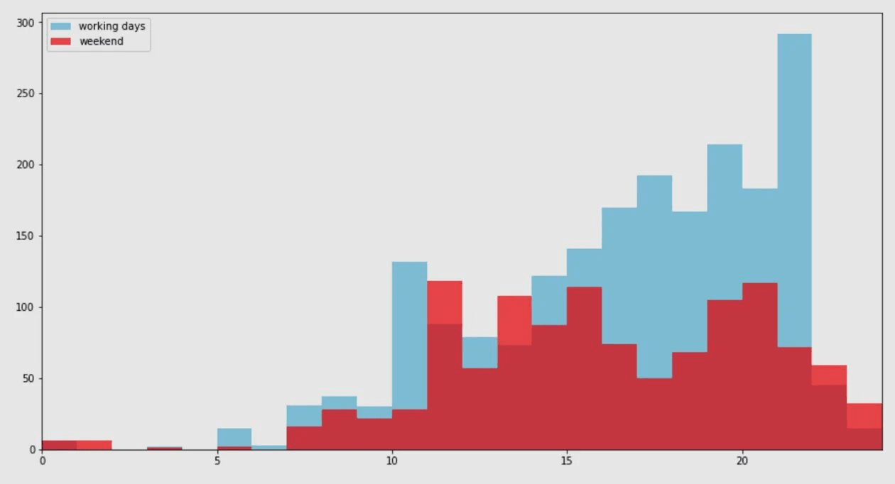

- Анализируй только пользователей (не учитывай админов).
- Подготовь два списка значений для входа гистограммы: отдельно для рабочих дней и для выходных.
- Размер фигуры — тот же; размер шрифта и цветовую палитру выбирай сам.
- Прозрачность «передней» гистограммы: alpha = 0.7.
- В конце блокнота добавь markdown-ячейку с вопросом: «Есть ли часы, когда общее число коммитов было выше в выходные, чем в рабочие дни?» В ответе приведи топ-4 примера.

## Глава IX

### Упражнение 05. Диаграмма размаха (boxplot)

- Каталог для сдачи: `ex05/`.
- Файлы для сдачи: `05_boxplot.ipynb`.
- Разрешённые импорты: `import pandas as pd`, `import sqlite3`, `import matplotlib.pyplot as plt`.

Помнишь, мы пытались выяснить, повлияла ли «Лента новостей» на поведение пользователей из экспериментальной и контрольной групп? В прошлый раз мы считали только средние. А что с дисперсией — не изменилась ли она? Есть ли выбросы?

Чтобы дать ответы на эти вопросы, мы воспользуемся диаграммой размаха, она же ящик с усами, он же boxplot.

Сделай всё необходимое, чтобы получить график как на примере:

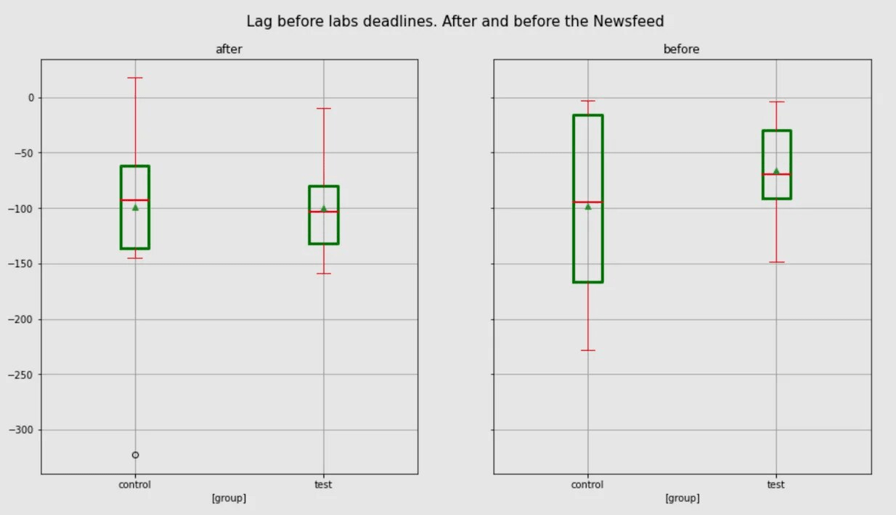

- Используй данные из [файла](https://drive.google.com/file/d/1B6M7Ku89ViIStXvWU6j7PyDnCTb0McEI/view?usp=sharing): прочитай в DataFrame и при необходимости выполни преобразования.
- Размер фигуры — прежний; размер шрифта выбери сам.
- Палитра — как в примере.
- Размер шрифта заголовка — 15.
- Толщина линий «ящиков» — 3, толщина линий медианы — 2.
- В конце блокнота добавь markdown-ячейку с вопросом: «Каков IQR (межквартильный размах) контрольной группы до появления ленты новостей?» В ответе укажи приблизительное значение, округлив до ближайшего десятка.

## Глава X

### Упражнение 06. Матрица диаграмм рассеяния (scatter matrix)

- Каталог для сдачи: `ex06/`.
- Файлы для сдачи: `06_scatter_matrix.ipynb`.
- Разрешённые импорты: `import pandas as pd`, `import sqlite3`, `from pandas.plotting import scatter_matrix`.

Помнишь, мы пытались понять, есть ли связь между числом посещений «Ленты новостей» и средней разницей между датами первого коммита и дедлайна? Проблема в том, что коэффициент корреляции показывает линейную зависимость. А если связь нелинейная? Проиллюстрируем ситуацию графиками.

Сделай всё необходимое, чтобы получить график как на примере:

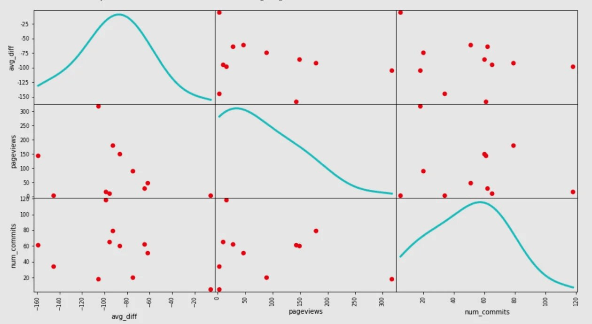

- Построй DataFrame, где для каждого пользователя из группы test есть: средняя дельта, число визитов в «Ленту», число коммитов.
- Не учитывай `project1` при расчётах средней дельты и числа коммитов.
- Число коммитов возьми из таблицы checker.
- Размер фигуры — тот же; размер шрифта и палитру выбирай сам.
- Размер точек — 200.
- Толщина линий диагональных графиков (KDE) — 3.
- В конце блокнота добавь markdown-ячейку с вопросами (ответ — «да» или «нет»):
  - «Можно ли сказать, что если у пользователя мало просмотров ленты, то у него, вероятно, мало коммитов?»
  - «Можно ли сказать, что если у пользователя мало просмотров ленты, то у него, вероятно, малая средняя разница между первым коммитом и дедлайном лабораторной?»
  - «Можно ли сказать, что много пользователей с малым числом коммитов и немного — с большим числом коммитов?»
  - «Можно ли сказать, что много пользователей с малой средней разницей и немного — с большой средней разницей?»

## Глава XI Бонусная часть

### Упражнение 07. Тепловая карта (heatmap)

- Каталог для сдачи: `ex07/`.
- Файлы для сдачи: `07_heatmap.ipynb`.
- Разрешённые импорты: `import pandas as pd`, `import sqlite3`, `import matplotlib.pyplot as plt`, `from mpl_toolkits.axes_grid1 import make_axes_locatable`.

В одном из предыдущих упражнений мы выясняли, отличается ли поведение пользователей в будни и в выходные. Здесь посмотрим, есть ли различия между днями недели и между часами.

- Анализируй только пользователей (не учитывай админов).
- Для обоих графиков выбери понравившуюся палитру.
- Для запроса используй таблицу checker.
- Используй абсолютные числа коммитов (не средние).
- Отсортируй DataFrame по общему числу коммитов пользователя.
- В конце блокнота добавь markdown-ячейку и ответь (смотри только на графики):
  - «У какого пользователя больше всего коммитов во Вт?» Ответ: `user_*`.
  - «У какого пользователя больше всего коммитов в Чт?» Ответ: `user_*`.
  - «В какой день недели пользователи не любят много коммитить?» Ответ, например: `Monday`.
  - «Какой пользователь и в который час сделал наибольшее число коммитов?» Ответ, например: `user_1, 15`.

Сделай всё необходимое, чтобы получить два графика как на примере.

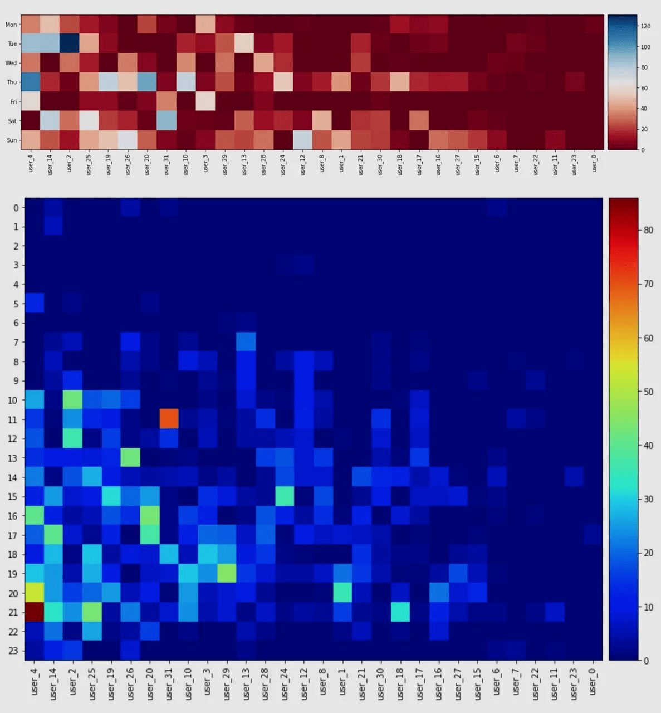

## Глава XII

### Упражнение 08. Seaborn

- Каталог для сдачи: `ex08/`.
- Файлы для сдачи: `08_seaborn.ipynb`.
- Разрешённые импорты: `import pandas as pd`, `import sqlite3`, `import matplotlib.pyplot as plt`, `import seaborn as sns`.

Иногда в предыдущих упражнениях мы исключали `project1` из расчётов: это был конкурс с более длинными дедлайнами и заметно большим числом коммитов. Посмотрим динамику коммитов в этом проекте по пользователям. На этот раз используем `Seaborn` — в нём проще быстро сделать красивый график.

Сделай всё необходимое, чтобы получить график как на примере:

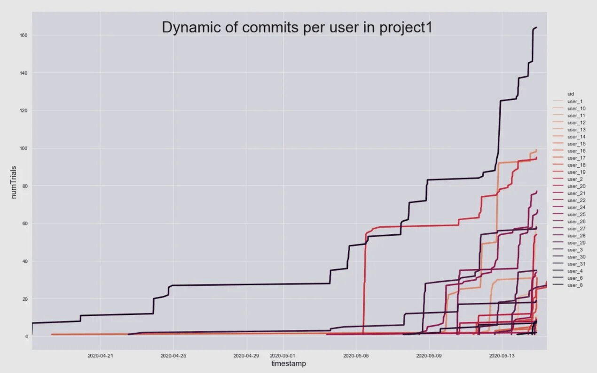

- Анализируй только пользователей, без админов.
- Учитывай только логи из таблицы checker со статусом ready.
- Палитру выбери на свой вкус.
- linewidth = 3.
- Фон графика — серый.
- Высота — 10, ширина — в 1.5 раза больше высоты.
- Размер шрифта заголовка — 30.
- Размер шрифта подписей осей — 15.
- В конце блокнота добавь markdown-ячейку с вопросами (смотри только на график):
  - «Какой пользователь почти всё время был лидером по числу коммитов?» Ответ: `user_*`.
  - «Какой пользователь был лидером лишь недолгое время?» Ответ: `user_*`.

## Глава XIII

### Упражнение 09. Plotly

- Каталог для сдачи: `ex09/`.
- Файлы для сдачи: `09_plotly.ipynb`.
- Разрешённые импорты: `import pandas as pd`, `import sqlite3`, `import plotly.graph_objects as go`, `import numpy as np`.

Matplotlib и Seaborn — очень мощные библиотеки, и их хватает для большинства задач DataViz. Но они не дают возможности делать интерактивные графики и анимации. Здесь на помощь приходит Plotly. В этом упражнении нужно построить почти тот же график, что в предыдущем, но в виде анимации.

Сделай всё необходимое, чтобы получить график как на примере.

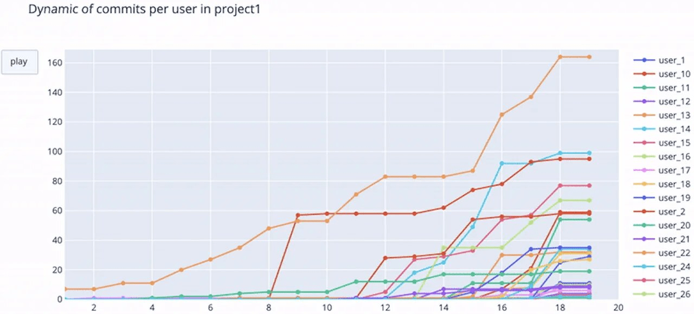

Это непростая задача, хорошие и понятные туториалы найти сложно, так что воспользуйся вот этой [ссылкой](https://github.com/datageekrj/YouTubeChannelHostingFiles/blob/master/lineRace.py).