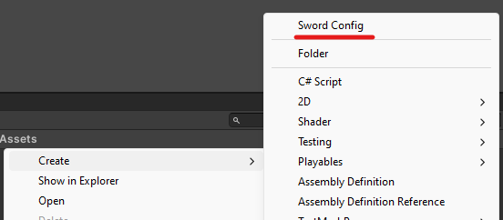
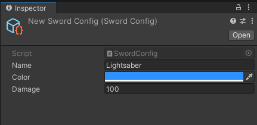
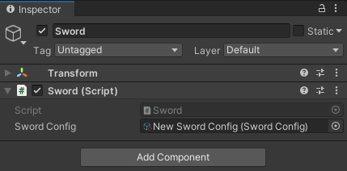
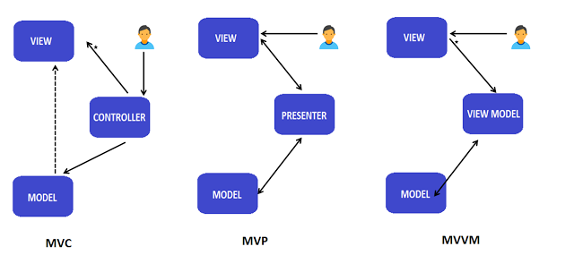
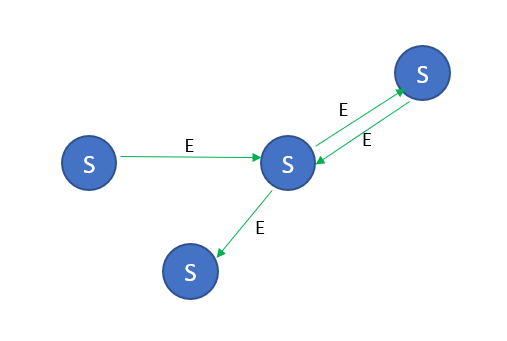
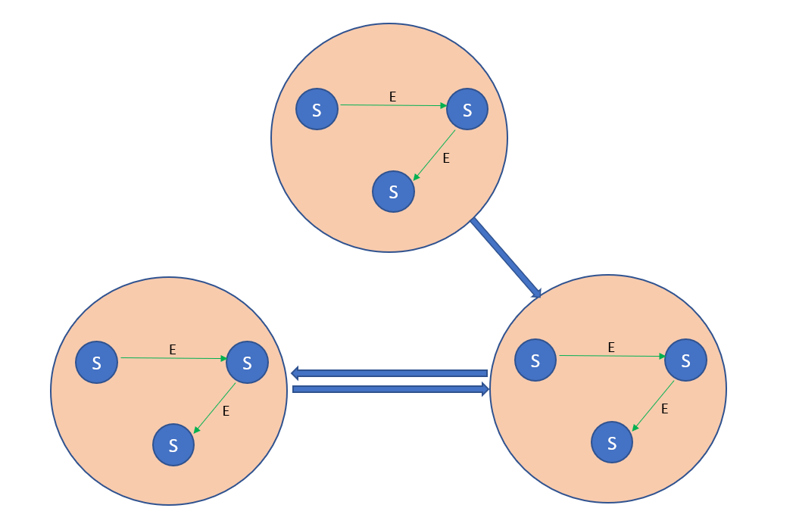
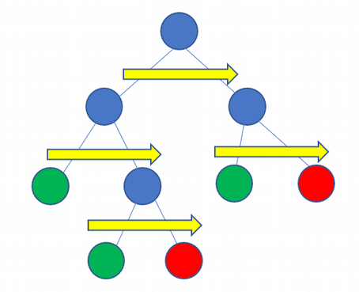

# Game Design

An introduction to the basic principles of game creation and design, different approaches to creating AI.

💡 [Tap here](https://new.oprosso.net/p/4cb31ec3f47a4596bc758ea1861fb624) **to leave your feedback on the project**. It's anonymous and will help our team make your educational experience better. We recommend completing the survey immediately after the project.

## Contents

1. [Chapter I](#chapter-i) \
   1.1. [Introduction](#introduction)
2. [Chapter II](#chapter-ii) \
   2.1. [Game Design Document](#game-design-document) \
   2.2. [Architecture on MonoBehaviour](#architecture-on-monobehaviour) \
   2.3. [ScriptableObject](#scriptableobject) \
   2.4. [MV\* patterns](#mv-patterns) \
   2.5. [Reactive Programming](#reactive-programming) \
   2.6. [Creating a game AI](#creating-a-game-AI)
3. [Chapter III](#chapter-iii) \
   3.1. [Part 1. Game Design Document](#part-1-game-design-document) \
   3.2. [Part 2. Refactor](#part-2-refactor) \
   3.3. [Part 3. AI](#part-3-ai)

## Chapter I

## Introduction

In this project you will study the structure of the game design document, learn about some architectural patterns and approaches to creating AI, reactive programming and three-layer architecture within game development.

At the end, you will have to write a design document for your project, refactor the game code, and integrate the AI into it.

## Chapter II

### Game Design Document

**Game Design Document (GDD)** is a detailed description of all the key aspects of the game.

Thanks to the game design document, every team member sees the " big picture", which makes it much easier to understand the current tasks of the project. Besides, GDD is an excellent solution for commiting changes and innovations in the project that occur in the process of development. It is important to understand that GDD changes and evolves throughout the project.

**Main points of the design document:**

- **Table of contents**
- **Introduction**. A brief description of the project: the name, platform, technology used and the target audience of the game
- **Gameplay**. A detailed description of the core gameplay. It is necessary to highlight which part of the game is the base for determining the player's experience..
- **In-game UI or HUD**. Heads-Up Display is a part of the visual interface that appears in the foreground of the game; what the player sees during gameplay
- **A mock-up of the interfaces and main menu**. A schematic sketch of all the windows/interfaces/screens of the game in the graphical editor. Each of them is followed by a brief description
- **Features**. Key and additional mechanics: training, inventory, dialogs, upgrades, and others. It is obligatory to create a mocap for each feature (schematic sketches of everything related to this feature)
- **Functional sections**. May differ for different genres of games. For example, game balancing, admin panel, monetization, promotion formats, statistics collection, etc.

### Architecture on MonoBehaviour

The most obvious way to design a game is to use object-oriented programming. The architecture for Unity games in this case becomes similar to the EC (Entity Component) pattern: there are entities with a set of components (in the form of **MonoBehaviour** scripts) that contain data and methods for working with this data, lined up in a certain hierarchy.

```
public class Gun : MonoBehaviour
{
    [SerializeField]
    private int ammo;

    public void Shoot()
    {
        ammo--;
        // ...
    }
}
```

```
public class Player : MonoBehaviour
{
    [SerializeField]
    private Gun gun;

    private void Update()
    {
        if (Input.GetMouseButtonDown(0))
            gun.Shoot();
    }
}
```

One of the main problems with **MonoBehaviour** is that you can't call the constructor. If in a normal C# program the main way to inject dependencies is to pass them through a constructor as parameters, this method won't work in **Unity**.

Instead, it is common to use other approaches to resolving dependencies, for example:

- Methods of searching components by their type - **GetComponent** (searching for a component inside the current **GameObject**), **FindObjectOfType** (searching for a component in the whole scene) etc. It is worth noting that these methods are resource-consuming (especially **Find** methods), so it is not recommended to use them inside **Update** and **FixedUpdate**.
- Serialized fields are fields marked with `[SerializeField]` attribute, allowing you to drag dependencies via inspector (see example with classes `Player` and `Gun`).

This is where another serious problem occurs: the implicit sequence of initialization method calls. Consider the same example with the player and the gun:

```
public class Gun : MonoBehaviour
{
    public string Name { get; private set; }

    private void Awake()
    {
        Name = "Desert Eagle";
    }
}
```

```
public class Player : MonoBehaviour
{
    [SerializeField]
    private Gun gun;

    private void Awake()
    {
        Debug.Log("My gun is " + gun.Name); // may be null (or may not)
    }
}
```

In this example, the player performs actions related to the gun in the **Awake** method. The problem is that the gun also performs initialization in its own method **Awake**. This means that by the time the player's **Awake** method is executed, the gun may not have had time to initialize - we can't guarantee that the **Awake** of the gun will be called before the **Awake** of the player.

So designing a game entirely on **MonoBehaviour**, while the most obvious way, can lead to many problems:

1. As mentioned before, injecting dependencies into **MonoBehaviour** is not an easy task, largely due to the lack of constructors.
2. By using unity components in game logic, we become tied to **UnityEngine** - an unnecessary dependency that also complicates the task of dividing the architecture into layers and highlighting the model.
3. A classic problem of the OOP approach: horizontal relationships between entities. Suppose there is a `Player` and an `Enemy` that can take damage from the player. The question arises: which of these classes should know about the existence of the other and be responsible for causing damage?

### ScriptableObject

**ScriptableObject (SO)** is a special **Unity** class, whose instances allow you to store data independently of script instances.

**ScriptableObject**, unlike **GameObject**, exists not in the context of a particular scene, but in the context of the whole project. With **SO** you can conveniently transfer data both between **MonoBehaviour** scripts and between different scenes.

**ScriptableObject** example:

```
[CreateAssetMenu]
public class SwordConfig : ScriptableObject
{
    public string Name;
    public Color Color;
    public float Damage;
}
```

To create a **SO** instance, you need to click on it's name in the **Create** menu.



The created instance can be configured via the inspector.



Now you can create a **MonoBehaviour** sword script that reads parameters from **ScriptableObject**:

```
public class Sword : MonoBehaviour
{
    [SerializeField]
    private SwordConfig swordConfig;

    private void Start()
    {
        Debug.Log("Name: " + swordConfig.Name);
        Debug.Log("Color: " + swordConfig.Color);
        Debug.Log("Damage: " + swordConfig.Damage);
    }
}
```

References to **SO**, like references to **GameObject**, are added to the inspector through serialized fields.



**Architecture on ScriptableObject**

**ScriptableObject** cannot completely replace **MonoBehaviour** when making a game, but patterns that use **SO** can make developing small projects much easier.

**The first pattern is EventChannel**. The SO in this case acts as a kind of channel that connects two independent parts of the system, allowing messages or events to be transferred between these parts.

This is what a simple implementation of **EventChannel** looks like:

```
[CreateAssetMenu]
public class EventChannel : ScriptableObject
{
    public event Action Event;

    public void RaiseEvent()
        => Event?.Invoke();
}
```

Suppose our game has a **Game** script and an exit button. When pressing the button, the **Game** class has to perform exit logic. To do that, you can add a reference to one **EventChannel** to the **Game** and **ExitButton** classes - the button script will call the event and the game script will accept it:

```
public class ExitButton : MonoBehaviour
{
    [SerializeField]
    private EventChannel exitEventChannel;

    [SerializeField]
    private Button button;

    private void Start()
        => button.onClick.AddListener(SendExitEvent);

    private void OnDestroy()
        => button.onClick.RemoveListener(SendExitEvent);

    private void SendExitEvent()
        => exitEventChannel.RaiseEvent();
}
```

```
public class Game : MonoBehaviour
{
    [SerializeField]
    private EventChannel exitEventChannel;

    private void Start()
        => exitEventChannel.Event += OnExitEvent;

    private void OnDestroy()
        => exitEventChannel.Event -= OnExitEvent;

    private void OnExitEvent()
        => Application.Quit();
}
```

This pattern has obvious advantages: ease of use and ensuring low relatedness between classes (**Game** and **ExitButton** know nothing about each other).

A serious disadvantage is the lack of support from the IDE. Unlike normal C# events, we won't be able to track all the places in the code where one or another **EventChannel** is used. In addition, the widespread use of EventChannel can lead to a more confusing code, because in theory any script can send events and any script can receive them, but these events cannot be tracked in the IDE.

The idea behind the **second pattern** is to create a **ScriptableObject** that contains a field (property) and provides global access to that field (property).

```
[CreateAssetMenu]
public class FloatVariable : ScriptableObject
{
    public float Value { get; set; }
}
```

Suppose we have a player with health points and a UI element that displays the player's health points. This is what an implementation of the pattern would look like:

```
public class Player : MonoBehaviour
{
    [SerializeField]
    private FloatVariable healthVariable;

    private void Start()
    {
        healthVariable.Value = 100f;
    }
}
```

```
public class HealthDisplay : MonoBehaviour
{
    [SerializeField]
    private FloatVariable healthVariable;

    [SerializeField]
    private TMP_Text healthText;

    private void Update()
    {
        healthText.text = "Player HP: " + healthVariable.Value;
    }
}
```

**FloatVariable** is basically a global variable with all the problems that come with it - this is a serious disadvantage of this pattern.

### MV\* patterns

**MV**\* patterns are typically used for designing GUI applications, but they can also be used in game development.

The idea behind **MV**\* patterns is to divide the application architecture into three layers:

- **Model** - data and business logic;
- **View** - the layer with which the user directly interacts;
- The link between the model and the view: **Controller**, **Presenter**, **ViewModel** for **MVC**, **MVP**, **MVVM** patterns respectively.



For **Unity**, the patterns will look something like this:

- **Model** - usually a clean C# class containing data and business logic;
- **View** - **MonoBehaviour** script that interacts with UI elements without business logic;
- **Controller**/**Presenter**/**ViewModel** - the link between **View** and **Model**. Can be either **MonoBehaviour** script or clean C# class.

You need the MV\* patterns to separate the logical parts of your application so that you can create them separately from each other. In other words, you can write independent blocks of code which you can change as you like without affecting the others. Moreover, if properly separated, you can easily replace one of the layers with another (for example, you can add a new **View** while keeping the old **Model**, or transfer part of the business logic to the server without affecting the logic of the **View**).

However, although MV\* patterns allow to separate business logic and mapping and partially avoid dependencies from `UnityEngine`, they still do not fully solve the problem of horizontal connections between entities.

### Reactive Programming

**Reactive programming** is an approach to programming based on interaction with data streams.

**Stream** is a kind of timeline where you can track the state of your object or its parameters and subscribe to change it by operating on the data.

For example, we have a player who can take damage from the enemy, and a UI that displays the current health of the player. In the reactive approach we create a data stream (e.g. player health) that will have its own timeline, during which the health value will change and trigger an event about it, and all subscribers will receive a new event.

There is a **UniRx** library for reactive programming in **Unity**. This is what the example with the player and the UI looks like:

```
public class Player : MonoBehaviour
{
    public ReactiveProperty<float> Health = new ReactiveProperty<float>(100f);

    public void ApplyDamage(float damage)
        => Health -= damage;
}
```

```
public class UI : MonoBehaviour
{
    [SerializeField]
    private Player player;

    [SerializeField]
    private Text healthText;

    private void Start()
    {
        player.Health.SubscribeToText(healthText);
    }
}
```

**Advantages of reactive programming:**

- Code coupling decreases;
- High control over data and events;
- Consistent with the OOP approach.

The disadvantages of reactive programming include the need to use additional libraries for working with streams, the difficulty of tracking these streams during development, debugging and testing, as well as the difficulty in understanding for beginners.

### Creating a game AI

The easiest way to create a basic game AI is to use if-else statements to describe the logic of behavior:

```
if (IsEnemyClose())
{
    if (HasEnoughHealth())
        AttackEnemy();
    else
        RunAway();
}
else
{
    Walk();
}
```

This approach is usually not used because as the number of possible states and behaviors increases, the code becomes very difficult to maintain.

****Finite State Machine (FSM) и Hierarchical Finite State Machine (HFSM)****

****Finite State Machine**** is a directed graph with all possible states of the system and conditions (events) for transition between them.



For example, the bot is in **Walk (S)** state. It will be in this state until the event (or condition) **EnemyClose (E)** occurs, after which the active state switches to another state - **AttackEnemy (S)**.

To reduce complexity, we can also divide certain behaviors into sub-states using ****Hierarchical Finite State Machine****.



The ability to move from any state to any other state by setting conditions (events) simplifies the design of AI behavior. But as the size and complexity grows, **FSM** and **HFSM** become difficult to maintain.

****Behavior Tree (BT)****

**Behavior Trees** are trees designed to describe complex behavior and make decisions about behavior selection. At each tick the whole tree is calculated, and if another behavior (action) other than the current one is chosen, the state will change, otherwise the current behavior will continue to run.



**The diagram shows three types of nodes:**

1. Blue: **sector nodes**, parent nodes that execute each of the child nodes in order.
2. Green: **conditional** and **decoration nodes**, control the process of executing the nodes.
3. Red: **action nodes**, actions that must be performed.

In many cases, **BT** provides a basis for developing more understandable and easy-to-read AIs compared to hierarchical **FSM**. The main disadvantage is that for very large **BT** the cost of evaluating the whole tree can be extremely high.

****Goal Oriented Action Planning (GOAP) или Utility AI****

**GOAP** works by identifying the behavioral options available to the AI and choosing the best option for a particular situation.

In **GOAP** you give the planner a list of actions that the AI can perform, the current world state and the desired world state (target state). Then **GOAP** will try to find a series of actions that will bring the AI to the target state.

The **Utility AI** works in a similar way. It is also commonly known as the "utility estimation" method. Each possible action is given its own weight, by which the AI chooses the highest-priority action and performs it.

**GOAP** and **Utility AI** perform well in situations where there is no unambiguously right or wrong sequence of actions. This is also the disadvantage of these approaches - it is impossible to predict the behavior of AI at a particular point in time.

## Chapter III

### Part 1. Game Design Document

You need to write a design document for a game you have developed from the project Meeting Unity.

- The document must be in the repository in **.md** format
- The chapters about **UI**, **mockup interface** and **features** must be accompanied by the corresponding images. They can be either screenshots from the game or sketches created from scratch. Each item on the list must be signed. Explanations can be added if necessary.
- The document should have at least one **functional section** (for example, about monetization or promotion).

### Part 2. Refactor

You need to refactor the code of your game from the Meeting Unity project using the studied approaches.

- You need to get rid of the so-called **Find** methods (**FindGameObjectsWithTag, FindObjectOfType** etc.).
- Methods that search for components (**GetComponent**, **GetComponentInChildren**, etc.) should not be called inside **Update** and **FixedUpdate**.
- Your classes must not have public fields (public properties are allowed, but only with modifiers `get;` or `get; private set;`).
- Try to avoid static methods, properties, events, classes; also avoid using the **Singleton** pattern.
- You need to add at least one **ScriptableObject** to the project (it can be used for storing configurations or as the **EventChannel** discussed earlier).
- Rebuild the architecture of your project using one of the **MV**\* patterns. An example of creating a leaderboard on \*\*MVP:\*\*UI (as \*\*View)\*\*requests the necessary data from **Presenter**; **Presenter** sends the request to **Model**, data received from **Model** sends back to **View**; and **Model** contains business logic for saving and getting the list of leaders. For convenience of subsequent checking, you should add **Model**, **View**, etc. to the names of corresponding classes (for example, **LeaderStoragePresenter**, **ScoreView**, etc.)

### Part 3. AI

It is necessary to integrate AI into your game. It is recommended to use **FSM** for AI implementation, but you can also choose one of the following methods: **HFSM**, **BT**, **GOAP**, **Utility AI**.

**For the theme No.1 (a game like Crowd City)**

- It is necessary to implement AI enemies.
- Enemies, like the player, must gather crowds and attack other enemies or the player.
- An enemy facing a smaller crowd is more likely to attack, while an enemy facing a larger crowd is more likely to flee.

**For the theme No.2 (an endless runner game)**

- It is necessary to implement AI opponents.
- Opponents run next to the player at different speeds, trying to avoid obstacles (the reaction of bots do not have to be perfect).
- The player can knock down opponents by moving into their lane. He gets extra points for this.

**For the theme No.3 (a game like My Mini Mart)**

- It is necessary to implement AI customers.
- Customers must come to the shop and wait for their order. If the order was completed successfully, the player receives currency, otherwise he receives nothing.
- If the customer does not receive his order within a certain time, he leaves (it is necessary to visualize in some way the current order and the remaining waiting time for each customer).