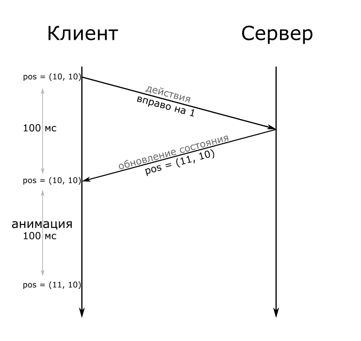
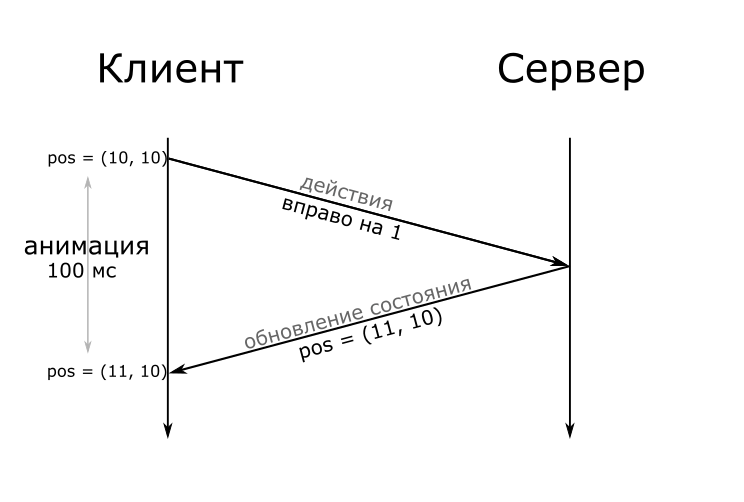
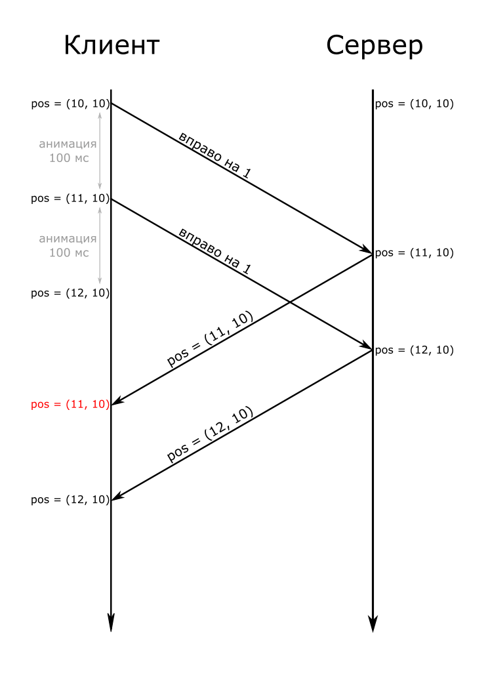
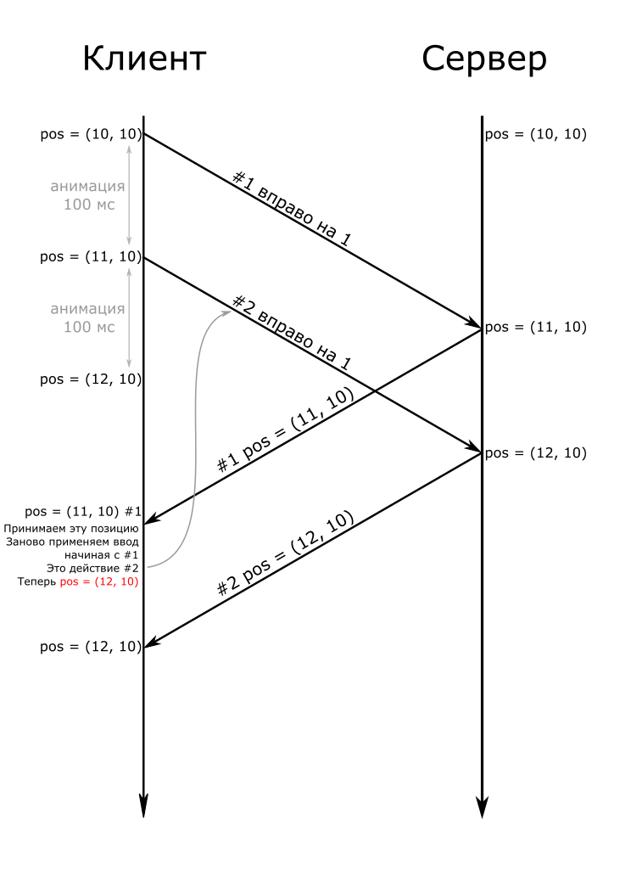

# Multiplayer

Adding networking to the game.

💡 [Tap here](https://new.oprosso.net/p/4cb31ec3f47a4596bc758ea1861fb624) **to leave your feedback on the project**. It's anonymous and will help our team make your educational experience better. We recommend completing the survey immediately after the project.

## Contents

1. [Chapter I](#chapter-i) \
   1.1. [Introduction](#introduction)
2. [Chapter II](#chapter-ii) \
   2.1. [Network connection types in games](#network-connection-types-in-games) \
   2.2. [Synchronization problems](#synchronization-problems) \
   2.3. [Server update frequency](#server-update-frequency)
3. [Chapter III](#chapter-iii) \
   3.1. [Part 1. Adding networking](#part-1-adding-networking)

## Chapter I

## Introduction

In this project you will learn the basics of networking in games, types of network connections, and solutions to synchronization problems. You will also need to add networking to the game developed in previous projects.

## Chapter II

## Network connection types in games

Network code in games is entirely tied to the interaction with the server. There are several basic models of this interaction:

- authoritative server
- listen server
- peer-to-peer

### Authoritative server

The authoritative server processes and performs all actions affecting the game process, applying the rules of the game and handling input from players-clients on the server side.

The client cannot make any changes to the game state himself. Instead, he sends to the server what exactly he wants to do, the server processes this request, makes changes to the game state and sends the updated state to the clients.

With this approach, logic on the client is reduced to a minimum, the client becomes responsible only for rendering game state and handling player actions. The advantage of this approach is that it makes it much harder for clients to cheat.

Developing an authoritative server requires a description of the game state and the rules of player interaction with that state on the server side.

### Listen server

The server in this network model is one of the players, to which all the other players connect. On the one hand, such a system solves the problem with the global inaccessibility to the game in the case of switching off the servers, on the other hand - any failure in the connection "host", ie "player-server", leads to problems for all other players.

In this case, the server is not some separate application, but the game client, which has priority in determining what actually happened. In such a system, it is more difficult to control the "honesty" of players and to block cheats. If the clients interact with the server as an authoritative one, and their ability to cheat is limited, then the "host", due to access to the server, can no longer be controlled.

### Peer-to-peer

A multiplayer game with a peer-to-peer network has no central entity to control the game state, so each client must control its own game state, communicating any changes and important actions to others.

Player actions are controlled locally, so the player's game state is updated almost instantly. Opponents' actions are simulated based on the internet network, and the player must receive a network message from *every* opponent. For the accuracy of the simulation, each participant is responsible for disseminating *only* information about their character, not others.

This type of network connection is the least protected against cheating and the most dependent on the quality of the connection, because if there are delays between the players there will be desynchronization.

## Synchronization problems

When using an authoritative server, it is necessary to create an illusion of instant execution of commands for the player, while the client waits for the server to confirm the requests. To do this, the client simulates the result on the screen. When another state of the world comes from the server, the client starts making predictions again.

### Client-side prediction

Even though there are some cheating players, most of the time the game server is processing valid requests. This means most of the input received will be valid and will update the game state as expected. We can use this to our advantage if the game world is *deterministic* enough (that is, the result is determined by commands and the previous state)

Suppose that the difference between the time of sending a request and receiving a response (hereinafter referred to as lag) is 100 ms and the character's move time is 100 ms. Without using predictions, the action time will be 200 ms.

Since the world is deterministic, we can assume the inputs we send to the server will be executed successfully. Under this assumption, the client can predict the state of the game world and most of the time this will be correct.

Instead of sending the inputs and waiting for the new game state to start rendering it, we can send the input and start rendering the outcome of that inputs as if they had succeded, while we wait for the server to send the “true” game state – which more often than not, will match the state calculated locally :

Now there’s absolutely no delay between the player’s actions and the results on the screen, while the server is still authoritative. Even if the client starts sending invalid commands using cheats, this will not affect the state of the game on the server, which is seen by other players.

Now let’s say we have a 250 ms lag to the server, and moving takes 100 ms.

Using the above approach, here is what happens if the player quickly presses the right key twice:

From the player's point of view, he pressed the right key twice, so the character moved two squares to the right, stood there for 50 ms, jumped one square to the left, stood there for 100 ms, and jumped one square to the right. Of course, this is completely unacceptable.

### Server reconciliation

It's not that hard to get around this problem. It is enough to add to each request from the client its number. And the server will add the number of the last processed request. You need to keep copies of all commands sent to the server on the client.

So, at t = 250, the client gets “x = 11, last processed request = #1”. It discards its copies of sent input up to #1 – but it retains a copy of #2, which hasn’t been acknowledged by the server. It updates its internal game state with what the server sent, x = 11, and then applies all the input still not seen by the server – in this case, input #2, “move to the right”. The end result is x = 12, which is correct.

Then, at t = 350 a new game state arrives from the server; this time it says “x = 12, last processed request = #2”. At this point, the client discards all input up to #2, and updates the state with x = 12. There’s no unprocessed input to replay, so processing ends there, with the correct result.

## Server update frequency

When there are a lot of clients, they send commands too often. Updating the game world for each team and then broadcasting the changed state would consume too much CPU and bandwidth.

A better approach is to queue the client inputs as they are received, without any processing. Instead, the game world is updated periodically at low frequency, for example 10 times per second.In every update, all the unprocessed client input is applied and the new game state is broadcast to the clients.

Since the client applies another player's status update as soon as it receives it, this naturally leads to jerks, since the update rate of enemy players will be 10 frames per second.

Depending on the type of game you are developing, there are different ways to deal with this. The more predictable the game, the easier it is to get out of this situation.

### Extrapolation

If the state of the game can be predicted accurately enough based on previous information received from the server, extrapolation can be applied.

Let's look at how extrapolation works, with server updates every 100ms.

1. The client receives information from the server
2. For the next 100 ms it won’t receive any new information, but it still needs to show the changes in a game. The easiest thing to assume is that the characteristics of the other players will be constant during this time and locally reproduce the physics with these parameters in mind
3. When the server updates, the states of the other players will be corrected.

This method is only appropriate for objects with high inertia, as their state is less dependent on player input.

### Interpolation

Extrapolation cannot be applied in all scenarios where a character's direction and speed change rapidly.

In this case, interpolation is applied, which is using only the real information provided by the server, showing other players from the recent past. Even in fast games, a delay of 100 ms is usually unnoticeable.

Say the client receives data from the server at the moments *t = 900*, *t = 1000* and *t = 1100*. At *t = 1000*, the client has already received information about the actions of other players in the period from *t = 900* to *t = 1000*. Thus in the period from *t = 1000* to *t = 1100* the client will see the actions of other players with a delay of 100 ms.

## Chapter III

### Part 1. Adding networking

You need to integrate networking into your game. General project requirements:

- An authoritative server must be used for the implementation.
- The server must not respond to every request, but [respond to all clients with a certain frequency](#server-update-frequency)(at least 10 times per second).
- Client-side [prediction](#client-side-prediction) must be implemented.
- The [extrapolation](#extrapolation) or the [interpolation](#interpolation) must be implemented.
- Use TextMeshPro library for the text in the UI.
- Use SerializedField for configurable parameters.

**For the theme No.1 (a game like Crowd City)**

- You need to add real players as enemies, which means that the game can have both real players and AI.

**For the theme No.2 (an endless runner game)**

- You need to add real players as opponents.
- All real players run at the same speed.
- Real players can't knock each other down, their models don't interact.
- The run goes on until only one real player remains.

**For the theme No.3 (a game like My Mini Mart)**

- You need to implement the ability to visit other players'shops.
- When visiting another player's shop, it must be possible to order.
- If the order was completed successfully, the owner of the shop receives currency, otherwise he gets nothing (and the player who visited the shop has no currency to spend).