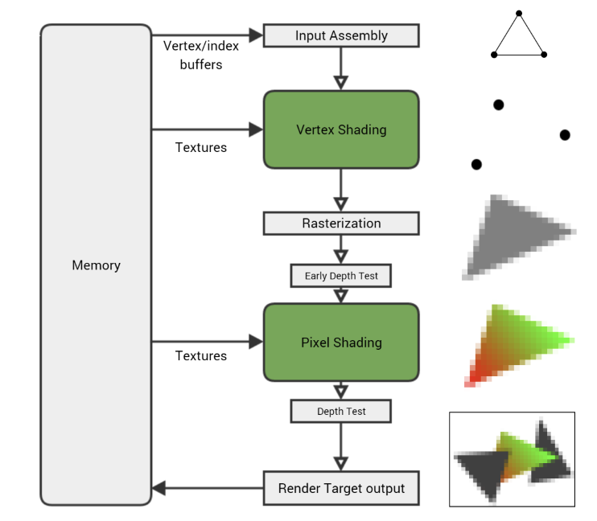
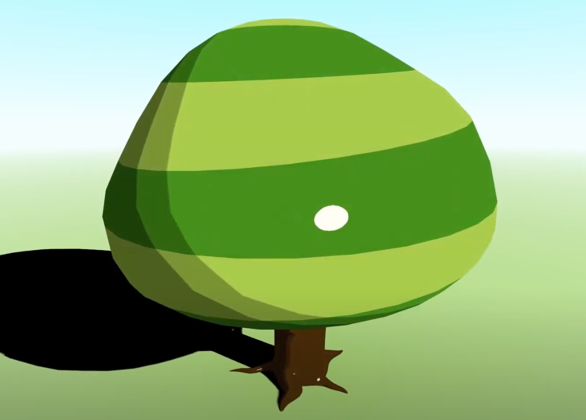
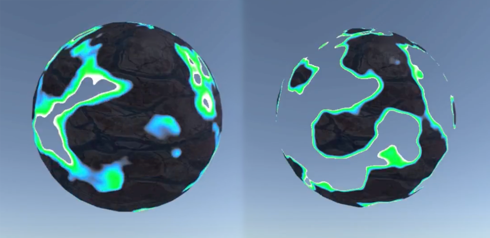
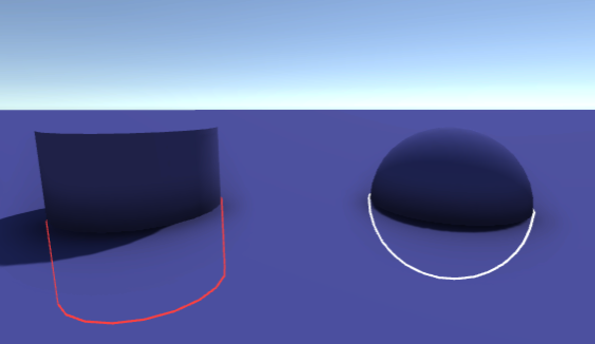
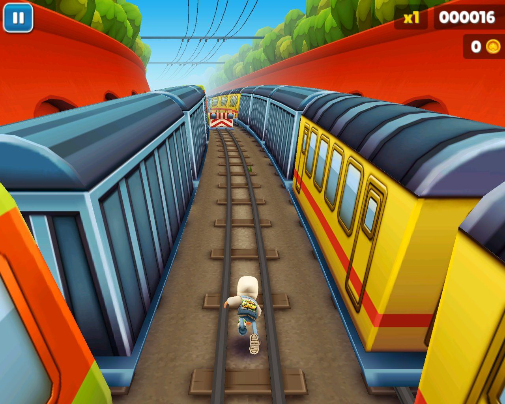
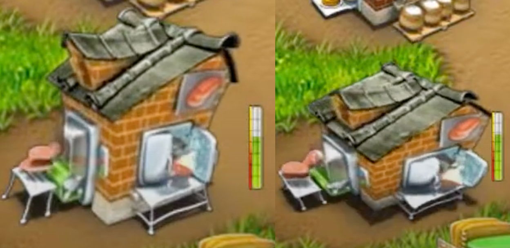

# Shaders

Introduction to the render pipeline and shaders in Unity.

💡 [Tap here](https://new.oprosso.net/p/4cb31ec3f47a4596bc758ea1861fb624) **to leave your feedback on the project**. It's anonymous and will help our team make your educational experience better. We recommend completing the survey immediately after the project.

## Contents

1. [Chapter I](#chapter-i) \
   1.1. [Introduction](#introduction)
2. [Chapter II](#chapter-ii) \
   2.1. [Render pipeline](#render-pipeline) \
   2.2. [Draw calls](#draw-calls) \
   2.3. [Shaders](#shaders) \
   2.4. [Rendering in Unity](#rendering-in-unity) \
   2.5. [Shader Graph](#shader-graph)
3. [Chapter III](#chapter-iii) \
   3.1. [Part 1. Three Shaders](#part-1-three-shaders)

## Chapter I

## Introduction

In this project, you will learn about the mechanism of render pipeline, shaders and specifics of writing them in Unity. You will also have to write some shaders for a game developed in previous projects.

## Chapter II

## Render pipeline

For a mesh to be displayed on the screen, it must pass through the GPU to be processed and rendered. Conceptually, this path is very simple: the mesh is loaded, vertices are grouped together as triangles, the triangles are converted into pixels, each pixel is given a colour, and that's the final image. Let's look at a simplified rendering pipeline diagram:



- Input Assembly. The GPU reads the vertex and index buffers from memory, determines how the vertices are connected to form triangles, and feeds the rest of the pipeline.
- Vertex Shading. The vertex shader gets executed once for every vertex in the mesh, running on a single vertex at a time. Its main purpose is to transform the vertex, taking its position and using the current camera and viewport settings to calculate where it will end up on the screen.
- Rasterization. Once the vertex shader has been run on each vertex of a triangle and the GPU knows where it will appear on screen, the triangle is rasterized - converted into a collection of individual pixels. Per-vertex values - UV coordinates, vertex color, normal, etc. - are interpolated across the triangle's pixels. So if one vertex of a triangle has a black vertex color and another has white, a pixel rasterized in the middle of the two will get the interpolated vertex color grey.
- Pixel Shading. Each rasterized pixel is then run through the pixel shader. This gives the pixel a color by combining material properties, textures, lights, and other parameters in the programmed way to get a particular look. Since there are so many pixels (a 1080p render target has over two million) and each one needs to be shaded at least once, the pixel shader is usually where the GPU spends a lot of its time.
- Render Target Output. Finally the pixel is written to the render target - but not before undergoing some tests to make sure it's valid. But if the pixel passes all the tests (depth, alpha, stencil etc.), it gets written to the render target in memory.

## Draw calls

The GPU itself cannot simply take over and work out the rendering process, because it depends on the game code, which is handled by the CPU. It is the CPU that tells it what to render and how. The CPU and GPU are separate chips, running independently and in parallel. To hit our target frame rate, both the CPU and GPU have to do all the work to produce a single frame within the time allowed. For example, at 30fps that's 33 milliseconds per frame. Latency of the results of at least one component leads to skipping frames.

Draw Call is a sequence of commands that the CPU tells the GPU how it should render. At the time of the current request, the GPU retrieves the current vertex/index buffers, the current vertex/pixel shaders and their input data from memory. This leads to a situation where to change the state of the GPU you need to create a new drawing call. That is - to pass it a number of new input data and parameters. A large number of draw calls can be a serious performance problem. It is important to keep in mind that the slightest change in the input data causes a new draw call. For example, two draw calls will be required to render two identical meshes with the same shader, but with different textures. There are various techniques and technologies for reducing the number of such calls (texture atlases, GPU Instansing, etc.).

## Shaders

A shader is a program that is executed on the GPU and describes how the image should be rendered

Shaders are written in special programming languages. The most popular ones are: HLSL, GLSL, CG

- **HLSL** (**H**igh **L**evel **S**hader **L**anguage) is a high-level C-like language for writing shaders, which was developed by Microsoft and is part of DirectX.
- **GLSL** (Open**GL S**hading **L**anguage) is a high-level language for writing shaders. The language syntax is based on the ANSI C programming language.
- **CG** (**C** for **G**raphics) is a high-level programming language developed by Nvidia in collaboration with Microsoft for shader programming. Cg is based on the C programming language. A distinctive feature is compiling for DirectX and OpenGL. It is considered obsolete since 2012 without additional extensions.

Shader languages have some distinguishing features from usual programming languages, which are related to their narrow focus:

1. Data types:

Besides the classic int, float, and bool, shader languages usually include the half/fixed (16/11 bits) floating-point type. Since more often floating point numbers are used for rendering graphics, this type is designed to optimize memory consumption.

There is also a simple way to create vectors and matrices in such languages. To all basic types you can add a digit from 1 to 4 to get a vector (float3, half4) or two digits separated by an "x" to get a matrix (float4x2 is a 4-by-2 matrix)

To access components of such types special structures are used (by the example of HLSL):

```
float4 vec;
// It is convenient if we interpret the vector as a position
vec.x, vec.y, vec.z, vec.w // Access to the first, second, etc. element

// It is convenient if we interpret a vector as a color
vec.r, vec.g, vec.b, vec.a

float4x4 mat

mat._11, mat._12, ..., mat._44 // _{**position** row number}{**position** column number}
mat._m00, mat._m01, ..., mat._m33 // _m{row **index**}{column **index**}
```

Moreover, you can form a vector of the same or lower dimension from a vector of higher dimension. There is also a syntactic feature called swizzling:

```
float4 baseVec = float4(1, 2, 3, 4);
float2 vec2 = baseVec.xy // vec2 = (1, 2)
float2 vec2 = baseVec.xz // vec2 = (1, 3)

// Swizzling 
float4 vec4 = baseVec.zxwy // vec4 = (3, 1, 4, 2)
```

To work with textures, the fragment shader provides so-called samplers. A sampler is a texture, and a set of rules (the texture coordinates addressing mode, their index, and the type of texture filtering set) for extracting a particular pixel.

```
sampler2D _BaseTex;
```

1. Types of shaders

Depending on the stage of the pipeline, shaders are divided into several types: vertex, fragment (pixel), and geometric. And the newest types of pipeline also have tessellation shaders.

**Vertex shaders** make animations of characters, grass, trees, create waves on water, and so on. Their job is to transform the positions of the vertices. The vertex shader provides the programmer with vertex-related data, such as vertex coordinates in space, its texture coordinates, its color, and its normal vector.

**Geometric shaders** can create new geometry, and can be used to create particles, change model detail on the fly, create silhouettes, etc. Unlike the previous vertex, they are able to process not only a single vertex, but an entire primitive. A primitive can be a segment (two vertices) and a triangle (three vertices), and up to six vertices can be processed for the triangular primitive if there is information about adjacent vertices. Unlike the other types, these are optional.

**Fragment shaders** are used for texture mapping, lighting, and various texture effects such as reflection, refraction, fog, Bump Mapping, etc. Pixel shaders are also used for post effects. The pixel shader works with bitmap fragments and with textures - it processes pixel-related data (e.g., color, depth, texture coordinates). The pixel shader is used at the last stage of the graphics pipeline to form an image fragment.

1. Semantics

The semantics is a string that passes information about the intended use of the parameter. Semantics are needed for all variables passed between pipeline steps. So in HLSL, when defining a structure that will be fed to the vertex shader input, you can tell the engine which vertex data we want to see in which variable

```
struct appdata
{
    UNITY_VERTEX_INPUT_INSTANCE_ID
    float4    vertex   : POSITION; // position of the vertex in the object space.
    float3    normal   : NORMAL; // Normal vector
};
```

1. Branching

The most familiar branching type is *dynamic branching* (*if-else*). With dynamic branching, the comparison condition is in a variable, which means that the comparison is done for each vertex or each pixel at runtime, which makes it impossible to process them in the same way.

This kind of branching does not affect the speed of the shader in the best way, so it is customary to use alternatives

*Static branching*

`#ifdef ... #endif` allow you to get different shader variants at compile time. Unlike normal CPU programs, the build process produces all possible branching variants, which can be chosen in runtime between two draw calls, depending on conditions.

*Linear interpolation*

With linear interpolation, you can choose between two variants without having to use dynamic branching. The trick is this: The *lerp* function usually takes three numeric parameters: *a* - initial value, *b* - final value, *t* counts the final value by the formula *result = a + (b - a) \* t*. Then when *t = 0* - *result = a*, when *t = 1* - *result = b*.

## Rendering in Unity

The current versions of Unity have three different pipelines for rendering graphics - **Built-in**, **URP** (**U**niversal **R**ender **P**ipeline, former LWRP - **L**ight **W**eight \*\*Render **P**ipeline) and **HDRP** (**H**igh **D**efinition **R**ender **P**ipeline)

- **Built-in** is Unity's default rendering pipeline. It is a general-purpose rendering pipeline that has limited customization and extension options.
- **URP** is a scriptable rendering pipeline that is fast and easy to set up and allows you to create optimized graphics on a wide range of platforms.
- **HDRP** is a scriptable rendering pipeline that lets you create cutting-edge, high-fidelity graphics on high-end platforms.
- URP and HDRP are concrete implementations of **SRP** (**S**criptable **R**ender **P**ipeline), which allows you to create your own custom rendering pipeline using the Rendering Pipeline API with scripting ability in Unity.

There are three types of files associated with shaders in Unity:

- Files with the `.shader` extension are ShaderLab files, which are capable of compiling into different types of rendering pipelines.
- Files with the `.shadergraph` extension are ShaderGraph files that can only be compiled in URP or in HDRP.
- Files with the `.hlsl` extension that allow us to describe individual functions in the HLSL language. You can use them with the directive or in a node called Custom Function in the Shader Graph. There is also another type of function file with a .`cginc` extension for using the CG language.

Unity supports shader programming in HLSL and GC, although in fact Unity switched to HLSL a long time ago, so the choice of language depends only on the rendering pipeline used in the project, or, more precisely, on the set of built-in libraries: Built-In pipeline assumes using `.cginc` extension libraries, and SRP - `.hlsl`.

To render a mesh using a shader, you need to create a material based on that shader and set values for the shader's properties that are put in the inspector. Material = shader + specific property values (textures, smoothness, glow, etc.).

To work with Unity, the shader code must be wrapped in a construction in a declarative language called ShaderLab. The syntax of this language allows you to display shader properties in the Unity Inspector when configuring a material. In a simplified way, its structure can be represented as follows:

```
Shader "Tab_In_the_Shader_List/Shader_Name"
{
    Properties
    {
        // Block of properties that can be configured through the inspector for a material
        [Attributes] _PropertyCodeName("InspectorPropertyName", Data Type) = DefaultValue
        _BaseTex("BaseTex", 2D) = "white"
    }
    SubShader
    {
        // A shader variant with specific settings for different hardware, a set of passes, and common rendering settings. There can be several subshaders

        // Defining settings common to all passes of a given subshader
        ParameterName ParameterValue
        Cull Back // e.g., cut off polygons directed from the camera

        // For example, this string says that the subshader is suitable for URP, it will render non-transparent geometry and should be called when rendering it
        Tags { "RenderPipeline"="UniversalPipeline" "RenderType"="Opaque" "Queue"="Geometry" }

        HLSLINCLUDE
        // Code block with shader logic in HLSL 
        
        // Functions common to all passes can be described in the subshader block
        float DistanceFromPlane(float3 pos, float4 plane)
        {
          float d = dot(float4(pos, 1.0f), plane);
          return d;
        }

        ENDHLSL

        Pass
        {
            // Block with the definition of a single pass. There can be several such blocks

            // Parameter override for a specific pass
            Name "Forward" // Set the pass name 
            Cull Off // turn off the cutoff for this pass

            HLSLPROGRAM
            // block of code with passage logic in HLSL

            // block with preprocessor directives, the two that are listed below are mandatory. We use them to specify that the functions described below, named vert and frag, are vertex and fragment shaders
            #pragma vertex vert
            #pragma fragment frag

            // define a structure with input data for the vertex shader. this texture will be automatically created by Unity and filled with data
            // data_type variable_name : SEMANTICS, by semantics the engine understands what data we want to see in this field
            struct appdata
            {
              UNITY_VERTEX_INPUT_INSTANCE_ID
              float4    vertex    : POSITION;
              float3    normal    : NORMAL;
            };

            // define the structure with the data that will be transferred from the vertex shader to the fragment shader
            struct v2f
            {
              UNITY_VERTEX_INPUT_INSTANCE_ID
              UNITY_VERTEX_OUTPUT_STEREO
              float4    vertex     : SV_POSITION;
              fixed4    faceColor  : COLOR;
            };

            // block with uniform (global) variables, which are filled with the values from the properties in the Properties block with the same names
            uniform sampler2D _BaseTex;

            // vertex shader
            v2f vert(appdata in)
            {
                v2f out;
                ...
                return out;
            }

            // fragment shader
            half4 frag(v2f in) : SV_Target
            {
                half4 color;
                ...
                return color;
            }

            ENDHLSL
        }
    }
    Fallback "Diffuse" // If none of the subshaders fit the device, the specified one will be used
}
```

## Shader Graph

Shader Graph is a tool that lets you create shaders visually. Instead of writing code, you create and connect nodes in a graph environment. It gives you instant feedback that reflects your changes, and it's easy enough for beginners to create shaders.

Shader Graph is available through the package manager window in supported versions of the Unity editor. If you install a scripted rendering pipeline (SRP) such as URP or HDRP, Unity automatically installs the Shader Graph in your project.


## Chapter III

## Part 1. Three Shaders

You will have to implement the three proposed shaders for the previously selected projects:

- You must use the **Universal Render Pipeline (URP)** in your project.
- All configurable shader parameters must be put in the inspector
- It is allowed to implement via Shader Graph and using code
- All shaders must reuse the cartoon lighting function
- To enable/disable the effect, use static branching (enable/disable keyword) or interpolation (numeric field: value 0 - disabled, value 1 - enabled)
- Do not use if else construct for branching
- Implement a "cartoon" shader:

  

  - The implementation must be a separate function, so that it can be reused in the following shaders
  - The shader must implement a custom lighting model, getting information from Unity about the light sources in the shader through special methods(`GetMainLight()`, `GetAdditionalLight()`)
  - The lighting of an object must consist of three components: background, diffuse and specular
  - The color of the background component must be selected through the inspector
  - The diffuse part must allow for three areas of illumination on the object: light, halftone, shadow
  - Thresholds for determining which illumination area a pixel belongs to must be set up through numerical parameters in the inspector
  - The specular part must allow you to draw a highlight in the illumination area of light and halftone
  - The location of the highlight must consider the direction in which you are looking at the model
  - The size of the highlight must be set by a numerical parameter through the inspector
  - It is necessary to add a numeric field, which regulates the sharpness of the borders of transition between illumination areas: when the value is 0 the borders must be sharp, when the value is increased the borders must be blurred and become smoother
- Implement a dissolve shader:

  

  - The shader must be implemented through a clipping operation (**not** through a transparency change)
  - The mask for the effect must be selected through the inspector
  - It is necessary to add a numeric field to regulate the speed of applying the effect
- Depending on the previously selected project, implement a shader based on vertex position manipulation

  - **For the theme No.1 (a game like Crowd City)** Outlining the contour of the stickmans when they are closed by an obstacle:

    

    - You need to implement a two-pass shader (either two different shaders and two materials respectively, or one multi-pass shader)
    - The first pass must fill the stencil buffer
    - The cartoon light function must also be integrated into it
    - The second pass must check with the stencil buffer and draw an enlarged mesh silhouette by shifting the vertex in the normal direction by the width of the outline
    - The color and width of the outline must be set through the inspector
    - You need to change the Z-Test settings so that the outline is drawn only when the object overlaps with another one
  - **For the theme No.2 (an endless runner game).** Curving a flat, straight surface that the player walks on to simulate an uneven surface (Subway Surfer style)

    

    - The shader must perform a vertex shift on the three axes using mathematical functions of time and distance to the running player
    - To pass the player's position into the shader, you need to use a regular script that will put the position value through `Shader.SetGlobal()`.
    - It is necessary to add numerical fields to change the force of curvature of the plane on different axes
  - **For the theme No.3 (a game like My Mini Mart)** Machine animation (Farm Frenzy style):

    

    - The shader must stretch/shrink the model along the three axes using the sine/cosine function of time
    - It is necessary to add numerical fields to adjust the phase shift of sine/cosine functions through the inspector (so that the direction of distortion (stretching or shrinking) does not occur simultaneously on all three axes)
    - You need to add numeric fields to change the amount of distortion for each of the axes
    - It is necessary to add a numeric field to change the speed of the effect