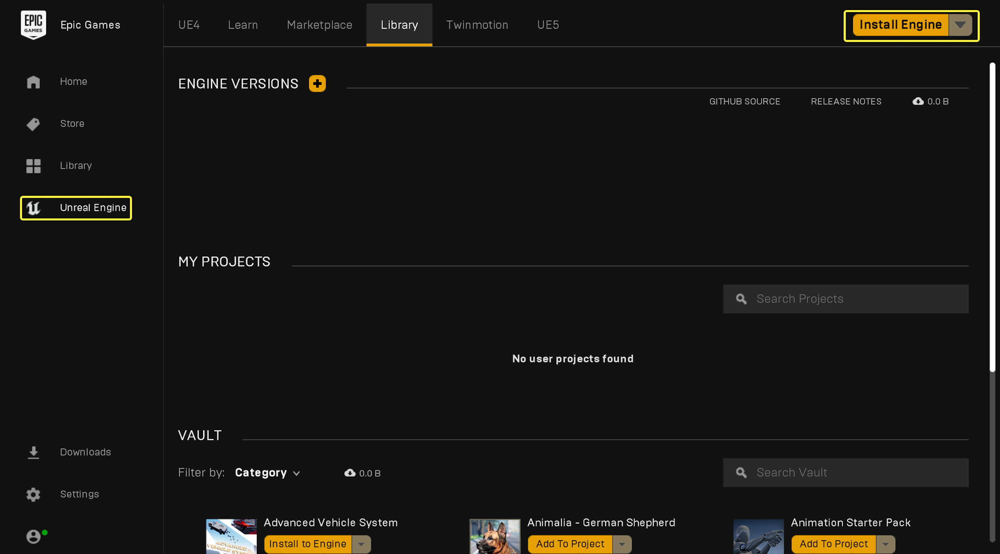
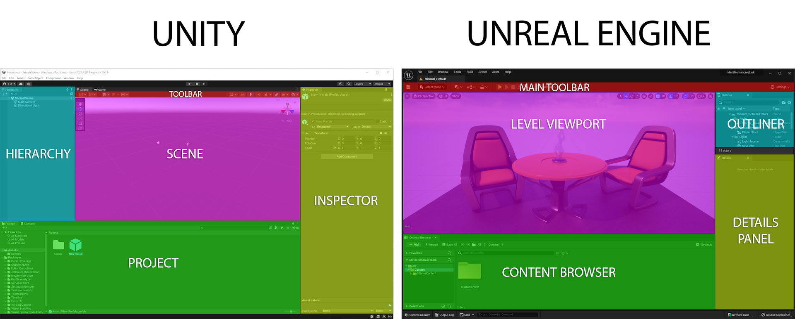
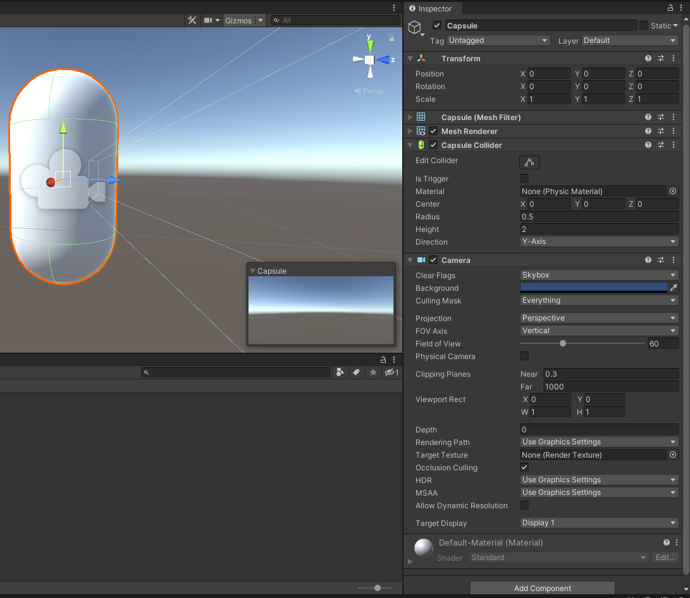
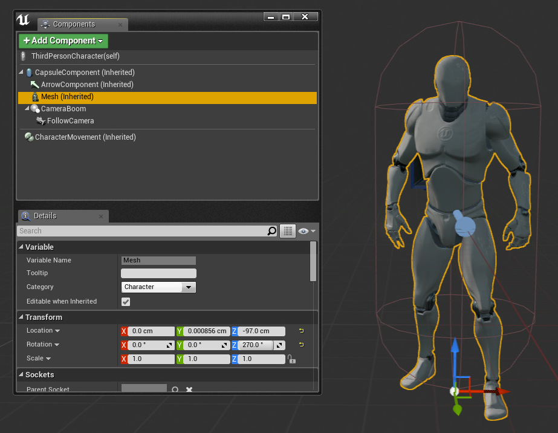
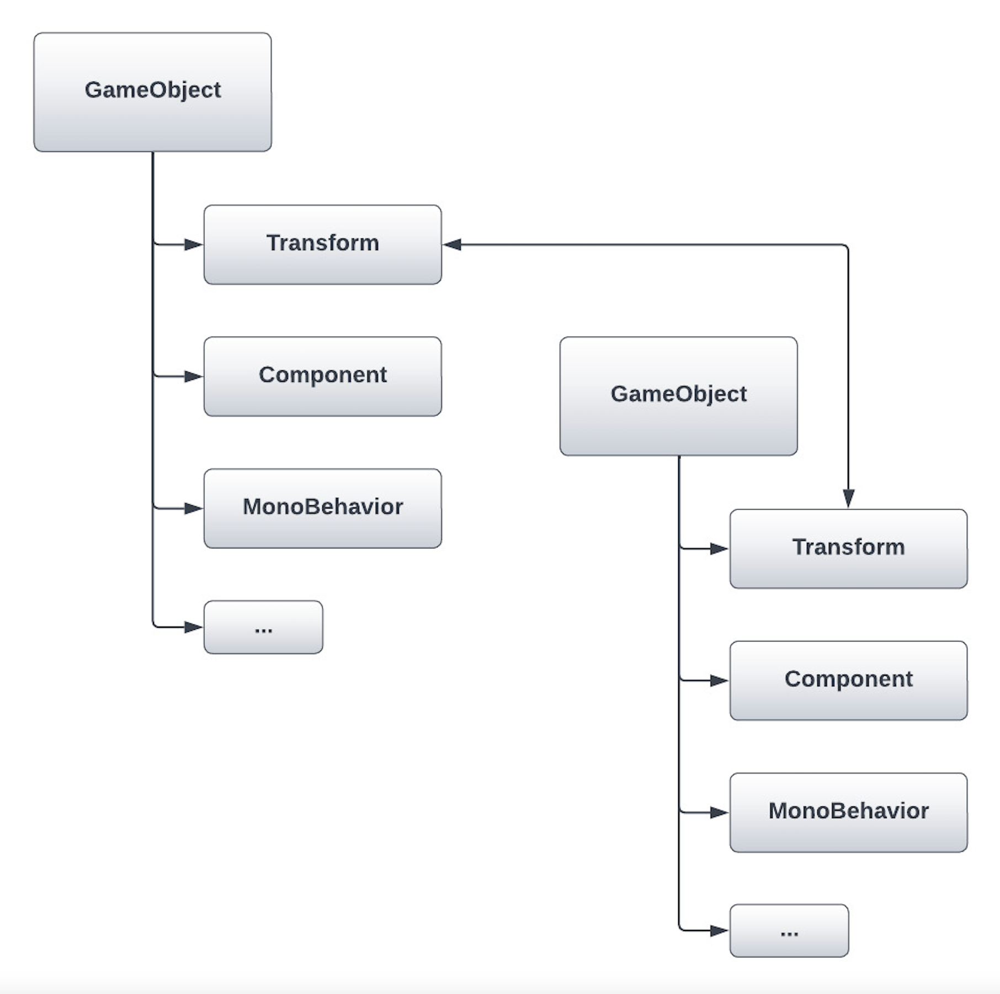
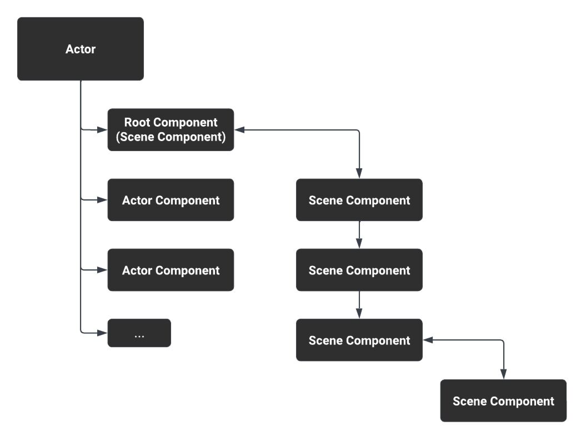
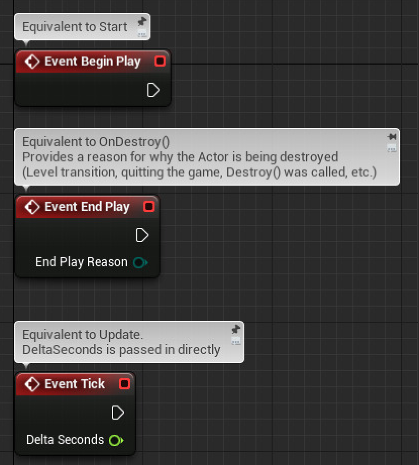

# Unreal Engine

Introduction to the basic tools of the Unreal Engine.

💡 [Tap here](https://new.oprosso.net/p/4cb31ec3f47a4596bc758ea1861fb624) **to leave your feedback on the project**. It's anonymous and will help our team make your educational experience better. We recommend completing the survey immediately after the project.

## Contents

1. [Chapter I](#chapter-i) \
   1.1. [Introduction](#introduction)
2. [Chapter II](#chapter-ii) \
   2.1. [Unreal Engine installation](#unreal-engine-installation) \
   2.2. [Unity vs. Unreal Engine](#unity-vs-unreal-Engine) \
   2.3. [Blueprints and visual scripting](#blueprints-and-visual-scripting) \
   2.4. [Project structure](#project-structure) \
   2.5. [GameObject and Actor](#gameobject-and-actor) \
   2.6. [Prefabs and Blueprints](#prefabs-and-blueprints) \
   2.7. [Script components and MonoBehaviour](#script-components-and-monobehaviour) \
   2.8. [Compound objects](#compound-objects) \
   2.9. [Coding in Unreal Engine](#coding-in-unreal-engine) \
   2.10. [Comparison of methods](#comparison-of-methods)
3. [Chapter III](#chapter-iii) \
   3.1. [Part 1. Copying a game to the Unreal Engine](#part-1-copying-a-game-to-the-unreal-engine)

## Chapter I

## Introduction

In this project you will learn about the Unreal Engine, the principles of working with the Unreal Editor, its built-in classes and libraries. You will also have to copy the game you created in the Game Design project to the Unreal Engine.

## Chapter II

### Unreal Engine installation

To download and install Unreal Engine, you need:

- Register an Epic Games account if you don't have one.
- Login to Epic Games Launcher.
- Install Unreal Engine of the latest version (e.g. 5.2.0).



### Unity vs. Unreal Engine

Unreal Editor is an editor for working on a Unreal Engine (UE) project. The picture below shows Unity and Unreal Editor side by side. Each block is labeled to show the terminology from Unity equivalent for Unreal Engine.



The following table contains the terms from Unity on the left and their Unreal Engine equivalents (or counterparts) on the right.

| Unity | Unreal Engine |
| --- | --- |
| Component | Component |
| GameObject | Actor |
| Prefab | Blueprint Class |
| Mesh | Static Mesh |
| Skinned Mesh | Skeletal Mesh |
| Shader | Material, Material Editor |
| Material | Material Instance |
| Particle Effect | Effect, Particle, Niagara |
| UI | UMG (Unreal Motion Graphics) |
| Animation | Skeletal Mesh Animation System |
| Mecanim | Animation Blueprint |
| Sequences | Sequencer |
| Sprite Editor | Paper2D |
| C# | C++ |
| Script, Bolt | Blueprint |
| Raycast | Line Trace, Shape Trace |
| Rigidbody | Collision, Physics |

### Blueprints and visual scripting

The Blueprint Visual Scripting system in Unreal Engine is a complete scripting system based on the concept of using a node-based interface to create gameplay elements from within Unreal Editor. As with many common scripting languages, it is used to define object-oriented (OO) classes or objects in the engine.

**Blueprint Class**, often shortened to **Blueprint**, is an asset that allows authors to easily add functionality on top of existing game classes. **Blueprints** are created within the Unreal Editor visually, not by entering code, and are saved as assets in the content package. Basically, they define a new class or type **Actor**, which can then be placed on the level as an instance that behaves like any other type **Actor**.

### Project structure

The project folder contains **Content** folder (analog of **Assets** in Unity), where all the project assets are stored, and **Config** folder (analog of **ProjectSettings** in Unity), where *.ini* project configuration files are stored. C++ classes are located in the **Source** folder of the project.

In Unity, game objects are placed on a scene and saved as a scene file. Unreal Engine has a **Map** file, similar to the scene in Unity. The **Map** files store data about the level and objects in it, as well as lighting data and some level settings.

In Unity, the C# source files are placed in the **Assets** folder. In Unreal Engine, the source files are placed in different locations depending on the type of project being created:

- C++ projects are placed in the **Source** folder. The **Source** folder can contain various files, including C++ source files (.cpp) and header files (.h), as well as some build scripts (Build.cs, Target.cs);
- Blueprints do not have a **Source** folder. Blueprints can be placed anywhere in the **Content** folder.

### GameObject and Actor

In Unity, a **GameObject** is a "thing" that can be placed in the world. The equivalent of this in Unreal Engine is **Actor**. You can use standard **Actors** when creating your game, but Unreal Engine also includes special types of **Actors** with built-in features, such as Pawn (**Actors** that can be controlled by the player or AI) or Character (for player-controlled ones).

**Actors** in Unreal Engine are slightly different from **GameObjects** in Unity. In Unity, **GameObject** is a C# class that cannot be extended directly. In Unreal Engine, **Actor** is a C++ class that you can extend and configure via inheritance.

In Unity, functionality is added to **GameObject** using components. In Unreal Engine, components are similarly added to **Actors**. In Unity, **GameObject** contains a flat list of components. In Unreal Engine, **Actor** contains a hierarchy of components connected to each other.

Component list example in Unity:



Component list example in Unreal Engine:



### Prefabs and Blueprints

In Unity, you can create a prefab from a **GameObjects** set of components. Unreal Engine has the same feature, which is based on **Blueprint Class**:

- Create an **Actor** with the components.
- Click **Blueprint > Add Script** in the **Actor** details panel to add a **Blueprint** to it.
- Choose where to save the new **Blueprint** class.
- Click **Create Blueprint**.

### Script components and MonoBehaviour

Unity uses scripting components to use C# scripts, which are added to **GameObjects**.\*\* To define what this component does, a class is created, inherited from **MonoBehaviour**, that describes the logic. Unreal Engine works the same way: you can create entirely new component classes, using either Blueprint or C++, and add them to any **Actor**.

In Unity, when you create a new **MonoBehaviour** file, you get a skeleton class with *Start()* and *Update()* methods. In Unreal Engine, the new component has similar methods:

- *InitializeComponent()*, which plays the same role as *Start()* in Unity;
- *TickComponent()*, which plays the same role as *Update()* in Unity. In **Blueprint** components, these functions are displayed as visual nodes.

### Compound objects

In Unity, each **GameObject** has a **Transform** component that sets **GameObject** position, rotation and scale in the world. Similarly, every Unreal Engine **Actor** has a **Root Component**, which can be any subclass of the **Scene Component**. The **Scene Component** gives the **Actor** location, rotation and scale in the world, which also apply to all components child to the **Scene Component**.

If you place an empty **Actor**, Unreal Engine will still create a **Default Scene Root** for it, which is just a **Scene Component**. If you add a new scene component to the **Actor**, it will replace the **Default Scene Root**.

In Unity, component objects are created by constructing a hierarchy of **GameObjects** and parenting their **Transform** components together:



In Unreal Engine, compound game objects are created by nesting Components hierarchically:



As you can see from the diagram, nested hierarchies can be created by attaching **Scene Components** to one another. **Actor Components** (the base class for all Components) can only be attached directly to the Actor itself.

### Coding in Unreal Engine

You can use standard tools such as Visual Studio for Windows or Xcode for macOS to write code in C++. When you create a new C++ project in Unreal Engine (or add C++ code to an existing project), Unreal Engine automatically creates Visual Studio project files.

One important difference in Unreal Engine: sometimes you have to manually refresh the Visual Studio project files (for example, after downloading a new version of Unreal Engine or when manually changing the location of the source files on disk). This can be done in two ways:

- From the main menu, go to **Tools > Refresh Visual Studio Project**.
- Right click the *.uproject* file in your project's directory and select **Generate Visual Studio project files**.

Below is a comparison between Unity's *Start*, *Update* and *OnDestroy* methods and its Unreal Engine equivalents.

Unity:

```
public class MyComponent : MonoBehaviour
{
    void Start() {}
    void OnDestroy() {}
    void Update() {}
}
```

Unreal Engine (C++):

```
UCLASS()
class AMyActor : public AActor
{
GENERATED_BODY()

    // Called at start of game.
    void BeginPlay();

    // Called when destroyed.
    void EndPlay(const EEndPlayReason::Type EndPlayReason);

    // Called every frame to update this actor.
    void Tick(float DeltaSeconds);
};
```

Unreal Engine (Blueprint):



Remember, in Unreal Engine, you must call the parent class's version of the method. For example, in Unity C# this would be called `base.Update()`, but in Unreal Engine C++ you will use `Super::TickComponent()`.

In C++, some classes use the prefix *A*, while others use the prefix *U*. *A* indicates **Actor** subclass, whereas *U* indicates an **Object** subclass. Another common prefix is *F*, which is used for most plain data structures and non-**UObject** classes .

### Comparison of methods

You can find a more detailed comparison of methods in the *materials* folder.

## Chapter III

### Part 1. Copying a game to the Unreal Engine

You need to copy the game, implemented in the Game Design project with all the mechanics.

- You can use both C++ scripts and **Blueprints** to implement scripting components
- Use Pawn **Actor** type to implement the AI

Reminder of project descriptions:

**Project №1**

A game about gathering your crowd like **agar.io**, **Archers.io** and **Crowd City:**

- The game scene must be a map with obstacles (stones, buildings, etc.) bounded at the edges.
- The player appears on the map in the predetermined spawn locations. There should be at least 3 different spawn locations with the ability to customize them (position, spawn radius)
- The player can freely move around the map. For PC control, the player can use both arrow keys and WASD. The mobile version requires a "floating" joystick, which is not available for the PC version.
- The player runs around the map, on which stickmans appear with customizable intervals. For their appearance it is necessary to reuse the already prepared mechanics of spawning
- When you run up close to the stickmans (also customizable), you join them to your "crowd".
- The whole crowd moves with the main player "around" him
- At the spawn points on the map with some periodicity immobile enemies appear.
- AI Enemies need to be implemented
- Enemies, like the player, must gather crowds and attack other enemies or the player
- An enemy facing a smaller crowd is more likely to attack, while an enemy facing a larger crowd is more likely to flee.
- When the crowd approaches the enemy by some distance the crowd starts shooting at the enemy. All parameters should be customizable
- Each member of the crowd has a gun that fires bullets in the direction of the enemy at set intervals. Bullets can be used as regular spheres
- Health points of enemies, player, stickmans; weapon damage; bullet speed must also be customizable
- The game must be time-limited. The duration of the game must be customizable
- During the game the UI must display the current size of the player's crowd and the remaining game time. 15 seconds before the end, the timer text must turn red, signaling the upcoming end of the game
- The UI panel with the number of points scored by the player = the number of joined stickmans should be displayed at the end of the game time
- There must be a button in the main menu scene to start the game and a table of top-3 records for the number of points scored with the time the record was set. Records must be saved between logins to the game.

**Project №2**

Endless runner game like **Subway Surfers**, **Temple Run**, **Crash Bandicoot: On the Run!**

- The game scene must be a plane, conventionally divided into three lines
- The player runs along these lines, moving between them using the left-right arrow keys or the A-D keys on PC, or the left-right swipe on mobile devices
- The player can jump and roll with the up/down arrow keys or the W-S keys on PC, or with the up/down swipe on mobile devices
- Three types of obstacles must be implemented:
  1. those that can be jumped over;
  2. those that can be passed by rolling under;
  3. those that can only be bypassed by other lines (similar to the trains in Subway Surfers)
- Over time, the speed of the game is gradually increased until it reaches the maximum value, which must be configurable. The speed of increase should also be configurable
- Bonuses must periodically appear on the path, giving invulnerability for a configurable period of time. When hitting an obstacle, the bonus expires, and the obstacle "destroys" itself (you can limit yourself to its simple disappearance).
- The game lasts until the player hits an obstacle. After the crash the distance run is displayed on the final panel in the UI
- During the game, the UI should display the current distance run
- There must be a button in the main menu scene to start the game and a table of top-3 records for the number of points scored with the time the record was set. Records must be saved between logins to the game.
- Need to implement AI opponents
- Opponents run next to the player at different speeds, trying to avoid obstacles (the reaction of bots should not be perfect)
- The player can knock down opponents by moving into their lane. For this he gets additional points

**Project №3**

A game about making and selling juices like **My Mini Mart:**

- The game scene must be a limited area with zones where future trees and plants will be placed, factory machines will be built, and cash registers will be located.
- The player can freely move around the map. For PC control, the player can use both arrow keys and WASD. The mobile version requires a "floating" joystick, which is not available for the PC version.
- The player has a wallet with all his money, which he gets from selling juice and spends to buy new trees and plants, cars and other environments. This amount of money is displayed in the UI during the game.
- Initially, the player starts the game with a fixed, configurable amount of money. It can be immediately in his wallet or nearby on the map, where it needs to be collected.
- At the beginning, the player can buy and plant an orange tree, a basic juicer, and a cash register. The purchase itself is a short stay of the player in the zone, during which money is gradually written off from the wallet (similar to **My Mini Mart**). The time in which the purchase takes place must be configurable and depend on the amount of purchase (buying a car for 100 coins should last a little longer than buying a car for 10 coins). The cost of trees, plants and machines should also be configurable and displayed in the in-game UI.
- Trees and plants produce a certain amount of fruit in a certain amount of time. Machines similarly run a configurable amount of time (i.e., juice is not produced immediately after adding oranges to the juicer). Everything should be configurable and displayed in the in-game UI.
- Machines (including the juicer) have two "sub-zones". In one you can only stack resources (fruit), from the other take already processed resources (juice, for example)
- Only one fruit can be juiced at a time, but it must be possible to put several fruits in a "tray" in front of the juicer, from where they will be dragged into the juicer. A similar "tray" must be at the outlet of the juicer, where the jars of juice will be placed.
- To collect any resources it is enough to stay in the resource gathering zone for some time. To give resources (to the juicer, for example) it is also enough to stand for a while with resources in hand near the resource giving zone.
- The player can carry several resources of different types in his hands at once, but only the desired resources can be given away. For example, a juicer cannot be given juice again, even if it is in the player's hand. The resources themselves in the player's hand are placed on top of each other (like in a stack).
- To sell juice, the player simply walks up to the cash register, similar to a juicer. The sale can be *momentary*.
- It is also necessary to add the ability to "upgrade" the juicer and the orange tree. The orange tree after upgrading increases the maximum possible number of oranges grown at one time. The juicer starts to work faster after the upgrade.
- The ability to upgrade must open after the player reaches the limit of a certain amount of money. The upgrade itself is similar to buying trees or cars (similar to **My Mini Mart**).
- The main menu scene must have a button to start the game and the current amount of money the player has. The amount of money the player has, as well as his progress (constructions, current resources on trees/machines) should be saved between logins to the game.
- It is necessary to implement AI customers.
- Customers must come to the shop and wait for their order. If the order was completed successfully, the player receives currency, otherwise he receives nothing.
- Without having received their order within a certain time, the customer leaves (it is necessary to visualize somehow the current order and the remaining waiting time for each customer).